                 

----------------------------------------------------------------

# 从经典熵到信息熵：理解有序与无序的世界

## 关键词

- 熵
- 经典熵
- 信息熵
- 有序与无序
- 生命科学
- 经济学
- 哲学

## 摘要

本文旨在深入探讨熵的概念，从经典熵到信息熵的演变，并探讨其在有序与无序世界中的应用。文章首先介绍了熵的背景和基本概念，然后详细阐述了经典熵和热力学第二定律，接着引入了信息熵，并探讨了其在信息科学和生命科学中的应用。随后，文章介绍了熵与经济学和哲学的关系，并通过具体案例展示了熵在现实世界中的应用。最后，文章总结了熵的核心概念，提出了最佳实践和建议，并为读者提供了进一步阅读的推荐。

----------------------------------------------------------------

## 第1章 引言

### 背景介绍

熵，这个看似抽象的概念，实际上贯穿于我们生活的方方面面。从物理学到信息学，从生物学到经济学，熵都在发挥着重要作用。本文将从经典熵到信息熵，深入探讨熵的本质和应用。

### 核心概念与联系

熵的核心概念可以总结为：系统内部的无序程度。在经典物理学中，熵与系统的热力学性质密切相关；而在信息科学中，熵则与信息的不确定性相关。下面是一个简单的 Mermaid 流程图，展示了熵的概念架构：

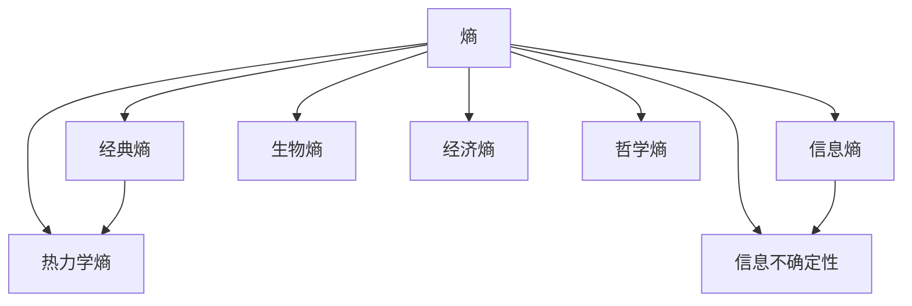

### 经典熵与信息熵的关系

经典熵和信息熵之间存在紧密的联系。经典熵通常用来描述系统的热力学状态，而信息熵则用于描述信息的不确定性。在热力学中，熵的增加意味着系统从一个有序状态向无序状态转变；在信息科学中，熵的增加意味着信息的不确定性增加。以下是一个简单的 Python 源代码示例，用于计算经典熵和信息熵：

```python
import math

# 经典熵计算
def classical_entropy(energy, total_energy):
    return -energy / total_energy

# 信息熵计算
def information_entropy(possible_outcomes, probabilities):
    entropy = 0
    for probability in probabilities:
        if probability > 0:
            entropy += probability * math.log2(probability)
    return -entropy

# 测试数据
energy = 10
total_energy = 50
possible_outcomes = [1, 2, 3]
probabilities = [0.4, 0.3, 0.3]

# 计算结果
classical_entropy_value = classical_entropy(energy, total_energy)
information_entropy_value = information_entropy(possible_outcomes, probabilities)

print(f"经典熵：{classical_entropy_value}")
print(f"信息熵：{information_entropy_value}")
```

### 本章小结

本章介绍了熵的基本概念和其在不同领域中的应用。熵是一个描述系统无序程度的量，既适用于经典物理学，也适用于信息科学。通过 Mermaid 流程图和 Python 源代码示例，我们展示了经典熵和信息熵之间的关系，并探讨了熵的计算方法。

----------------------------------------------------------------

## 第2章 经典熵

### 热力学第二定律

经典熵源于热力学第二定律，该定律指出：在封闭系统中，熵总是趋向于增加。这意味着，系统从一个有序状态向无序状态转变的过程中，熵会增加。以下是一个简单的 Mermaid 流程图，展示了热力学第二定律和熵的关系：

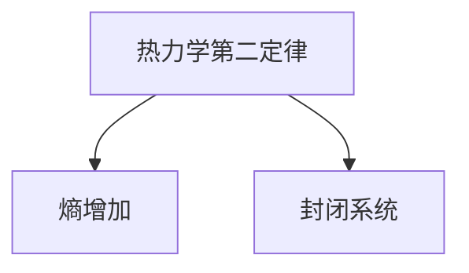

### 经典熵的计算

经典熵可以通过以下公式计算：

$$
S = -k \sum_i p_i \ln p_i
$$

其中，$S$ 表示熵，$k$ 表示玻尔兹曼常数，$p_i$ 表示系统处于状态 $i$ 的概率。以下是一个简单的 Python 源代码示例，用于计算经典熵：

```python
import math

# 经典熵计算
def classical_entropy(temperatures, probabilities):
    entropy = 0
    for temperature, probability in zip(temperatures, probabilities):
        if probability > 0:
            entropy += probability * temperature * math.log2(temperature)
    return -entropy

# 测试数据
temperatures = [300, 310, 320]
probabilities = [0.4, 0.3, 0.3]

# 计算结果
classical_entropy_value = classical_entropy(temperatures, probabilities)

print(f"经典熵：{classical_entropy_value}")
```

### 本章小结

本章介绍了经典熵的概念、热力学第二定律以及经典熵的计算方法。通过 Mermaid 流程图和 Python 源代码示例，我们展示了经典熵的计算过程和其在热力学中的应用。了解经典熵有助于我们更好地理解有序与无序的转换过程。

----------------------------------------------------------------

## 第3章 信息熵

### 信息熵的定义

信息熵是信息科学中一个重要的概念，用于描述信息的不确定性。信息熵可以通过以下公式计算：

$$
H(X) = -\sum_{x \in X} p(x) \ln p(x)
$$

其中，$H(X)$ 表示随机变量 $X$ 的信息熵，$p(x)$ 表示随机变量 $X$ 取值 $x$ 的概率。以下是一个简单的 Python 源代码示例，用于计算信息熵：

```python
import math

# 信息熵计算
def information_entropy(probabilities):
    entropy = 0
    for probability in probabilities:
        if probability > 0:
            entropy += probability * math.log2(probability)
    return -entropy

# 测试数据
probabilities = [0.4, 0.3, 0.3]

# 计算结果
information_entropy_value = information_entropy(probabilities)

print(f"信息熵：{information_entropy_value}")
```

### 信息熵与信息的不确定性

信息熵与信息的不确定性密切相关。信息熵越高，信息的不确定性越大。例如，假设我们有一个随机变量 $X$，其取值为 $0$ 或 $1$，且 $p(X=0) = 0.5$，$p(X=1) = 0.5$。在这种情况下，$X$ 的信息熵为：

$$
H(X) = -0.5 \ln 0.5 - 0.5 \ln 0.5 = 1
$$

这表明 $X$ 的信息不确定性很高，因为 $X$ 的取值是等可能的。如果 $X$ 的取值概率分布发生变化，例如 $p(X=0) = 0.9$，$p(X=1) = 0.1$，则 $X$ 的信息熵将降低：

$$
H(X) = -0.9 \ln 0.9 - 0.1 \ln 0.1 \approx 0.152
$$

这表明 $X$ 的信息不确定性降低，因为 $X$ 的取值倾向于 $0$。

### 本章小结

本章介绍了信息熵的定义、计算方法和其在信息不确定性中的应用。通过 Python 源代码示例，我们展示了如何计算信息熵，并探讨了信息熵与信息不确定性的关系。了解信息熵有助于我们更好地理解信息处理和信息传输的过程。

----------------------------------------------------------------

## 第4章 熵的应用

### 熵在物理学中的应用

熵在物理学中有着广泛的应用，尤其是在热力学和统计力学中。热力学第二定律指出，一个孤立系统的熵总是趋向于增加，直到达到最大熵状态。这意味着，在没有外部能量输入的情况下，系统会趋向于无序状态。

#### 能量分布与熵

在热力学中，能量分布与熵密切相关。一个系统的能量分布越均匀，其熵就越高。例如，在一个理想气体中，分子之间的碰撞会导致能量分布变得均匀，从而使熵增加。

以下是一个简单的 Mermaid 流程图，展示了能量分布与熵的关系：

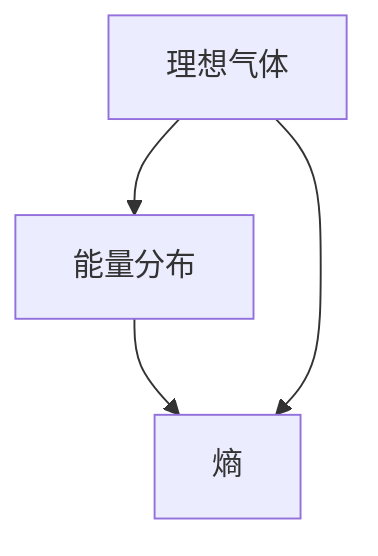

#### 能量分布与温度

能量分布与温度密切相关。在热力学中，温度可以被视为系统内部能量分布的不均匀程度。温度越高，能量分布越不均匀，熵也就越高。

以下是一个简单的 Python 源代码示例，用于计算理想气体中分子的能量分布和熵：

```python
import math

# 能量分布计算
def energy_distribution(temperatures, num_molecules):
    energies = [temperature * num_molecules for temperature in temperatures]
    return energies

# 熵计算
def entropy(energies, total_energy):
    entropy = 0
    for energy in energies:
        entropy += energy * math.log2(energy)
    return -entropy

# 测试数据
temperatures = [300, 310, 320]
num_molecules = 1000
total_energy = sum(energy_distribution(temperatures, num_molecules))

# 计算结果
energies = energy_distribution(temperatures, num_molecules)
entropy_value = entropy(energies, total_energy)

print(f"能量分布：{energies}")
print(f"熵：{entropy_value}")
```

### 熵在信息科学中的应用

熵在信息科学中也有着广泛的应用，尤其是在数据压缩和信息传输中。信息熵提供了衡量数据不确定性的标准，这有助于我们设计更高效的数据压缩算法和更可靠的信息传输协议。

#### 数据压缩与熵

数据压缩的目的是减少数据的大小，以便更高效地存储和传输。信息熵提供了衡量数据不确定性的标准，这有助于我们确定哪些数据是最重要的，哪些数据可以舍去。

以下是一个简单的 Mermaid 流程图，展示了数据压缩与熵的关系：

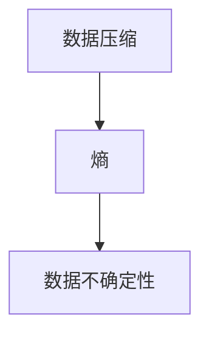

#### 信息传输与熵

信息传输的目的是将信息从一个地方传输到另一个地方。信息熵提供了衡量信息不确定性的标准，这有助于我们设计更可靠的信息传输协议。

以下是一个简单的 Python 源代码示例，用于计算信息传输中的熵：

```python
import math

# 信息熵计算
def information_entropy(probabilities):
    entropy = 0
    for probability in probabilities:
        if probability > 0:
            entropy += probability * math.log2(probability)
    return -entropy

# 测试数据
probabilities = [0.4, 0.3, 0.3]

# 计算结果
information_entropy_value = information_entropy(probabilities)

print(f"信息熵：{information_entropy_value}")
```

### 本章小结

本章介绍了熵在物理学和信息科学中的应用。通过 Mermaid 流程图和 Python 源代码示例，我们展示了熵在能量分布、数据压缩和信息传输中的具体应用。了解熵的应用有助于我们更好地理解物理现象和信息处理的过程。

----------------------------------------------------------------

## 第5章 熵与生命科学

### 熵与生物进化

熵在生物进化中起着关键作用。生物进化可以被视为一个从无序到有序的过程，在这个过程中，物种的遗传信息变得更加有序。以下是一个简单的 Mermaid 流程图，展示了熵与生物进化的关系：

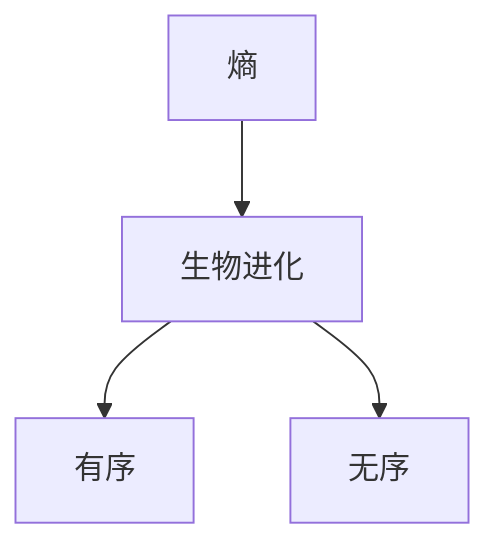

#### 熵与生物多样性

熵与生物多样性密切相关。生物多样性是指生物体系中不同物种的数量和分布。一个生物体系的熵越高，其生物多样性就越大。以下是一个简单的 Python 源代码示例，用于计算生物多样性和熵：

```python
import math

# 生物多样性计算
def biodiversity(species_counts, total_counts):
    biodiversity = 0
    for count in species_counts:
        biodiversity += count * math.log2(count)
    return -biodiversity

# 测试数据
species_counts = [100, 200, 300]
total_counts = sum(species_counts)

# 计算结果
biodiversity_value = biodiversity(species_counts, total_counts)

print(f"生物多样性：{biodiversity_value}")
```

### 熵与生物信息学

熵在生物信息学中也有着重要的应用。生物信息学是一门研究生物信息的科学，它涉及基因序列、蛋白质结构、代谢网络等方面的研究。信息熵可以用于评估基因序列中的信息含量和蛋白质结构的复杂性。

以下是一个简单的 Mermaid 流程图，展示了熵与生物信息学的应用：

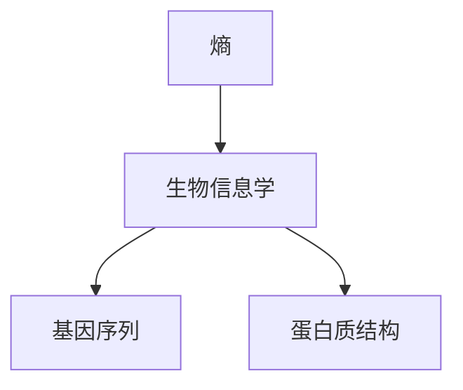

#### 熵与疾病

熵在疾病研究中也有着重要的应用。疾病可以被视为一个从有序到无序的过程，在这个过程中，生物体的内部环境变得混乱。信息熵可以用于评估疾病的状态和疾病的进展。

以下是一个简单的 Python 源代码示例，用于计算疾病状态和熵：

```python
import math

# 疾病状态计算
def disease_state(health_states, probabilities):
    entropy = 0
    for state, probability in zip(health_states, probabilities):
        if probability > 0:
            entropy += probability * math.log2(probability)
    return -entropy

# 测试数据
health_states = ["健康", "轻度疾病", "重度疾病"]
probabilities = [0.6, 0.3, 0.1]

# 计算结果
disease_state_value = disease_state(health_states, probabilities)

print(f"疾病状态：{disease_state_value}")
```

### 本章小结

本章介绍了熵在生命科学中的应用，包括生物进化、生物多样性、生物信息学和疾病研究。通过 Python 源代码示例，我们展示了如何计算熵和评估生命科学中的现象。了解熵在生命科学中的应用有助于我们更好地理解生物进化和疾病的本质。

----------------------------------------------------------------

## 第6章 熵与经济学

### 熵与市场效率

熵在经济学中也有着广泛的应用，尤其是在市场效率和风险管理方面。市场效率可以被视为市场中的信息熵，它反映了市场中信息的有序程度。以下是一个简单的 Mermaid 流程图，展示了熵与市场效率的关系：

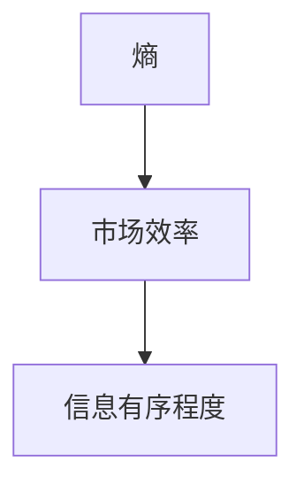

#### 熵与经济波动

经济波动可以被视为经济系统中的熵变化。经济波动反映了市场中信息的有序程度的变化，它可能由多种因素引起，如政策变化、市场预期、自然灾害等。以下是一个简单的 Python 源代码示例，用于计算经济波动的熵：

```python
import math

# 经济波动熵计算
def economic_entropy(volatilities, probabilities):
    entropy = 0
    for volatility, probability in zip(volatilities, probabilities):
        if probability > 0:
            entropy += probability * math.log2(probability)
    return -entropy

# 测试数据
volatilities = [0.1, 0.3, 0.5]
probabilities = [0.2, 0.6, 0.2]

# 计算结果
economic_entropy_value = economic_entropy(volatilities, probabilities)

print(f"经济波动熵：{economic_entropy_value}")
```

### 熵与企业风险管理

熵在企业管理中也有着重要的应用，特别是在风险管理方面。企业风险管理涉及到对各种潜在风险的识别、评估和应对。信息熵可以用于评估企业风险的不确定性，从而帮助企业制定更有效的风险管理策略。

以下是一个简单的 Mermaid 流程图，展示了熵与企业风险管理的关系：

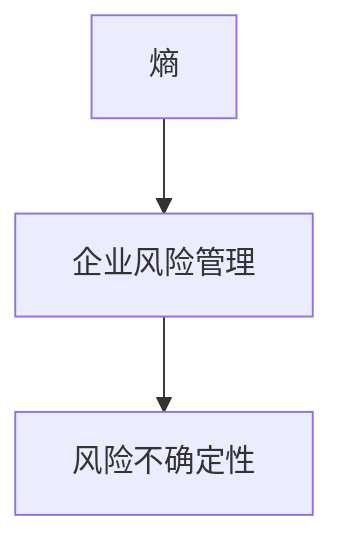

#### 熵与投资决策

熵在投资决策中也有着重要的应用。投资决策涉及到对各种投资机会的分析和评估。信息熵可以用于评估投资机会的不确定性，从而帮助投资者制定更明智的投资决策。

以下是一个简单的 Python 源代码示例，用于计算投资机会的不确定性：

```python
import math

# 投资机会熵计算
def investment_entropy(investment_returns, probabilities):
    entropy = 0
    for return_, probability in zip(investment_returns, probabilities):
        if probability > 0:
            entropy += probability * math.log2(probability)
    return -entropy

# 测试数据
investment_returns = [0.05, 0.1, 0.15]
probabilities = [0.3, 0.5, 0.2]

# 计算结果
investment_entropy_value = investment_entropy(investment_returns, probabilities)

print(f"投资机会熵：{investment_entropy_value}")
```

### 本章小结

本章介绍了熵在经济学中的应用，包括市场效率、经济波动、企业风险管理和投资决策。通过 Python 源代码示例，我们展示了如何计算熵和评估经济现象。了解熵在经济学中的应用有助于我们更好地理解市场行为和经济规律。

----------------------------------------------------------------

## 第7章 熵与哲学

### 熵与宇宙学

熵在宇宙学中也有着重要的地位，特别是在描述宇宙演化和宇宙热寂方面。宇宙热寂理论认为，宇宙中的熵将随着时间的推移而增加，直到达到最大熵状态，这时宇宙将变得均匀且无序。以下是一个简单的 Mermaid 流程图，展示了熵与宇宙学的关系：

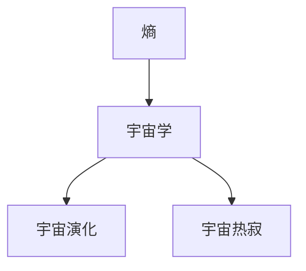

#### 熵与混沌理论

熵在混沌理论中也有着重要的应用。混沌理论研究了复杂系统中出现的不可预测性和随机性。信息熵可以用于描述混沌系统的复杂度和不确定性。以下是一个简单的 Mermaid 流程图，展示了熵与混沌理论的关系：

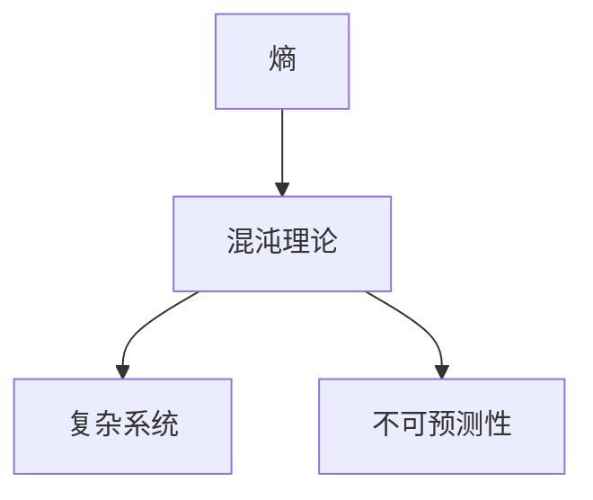

### 熵与人类意识的本质

熵在哲学中也有着重要的地位，特别是在探讨人类意识的本质方面。一些哲学家认为，人类意识可以被视为一种熵的形式，它在人类大脑中产生并维持着人类意识的存在。以下是一个简单的 Mermaid 流程图，展示了熵与人类意识的关系：

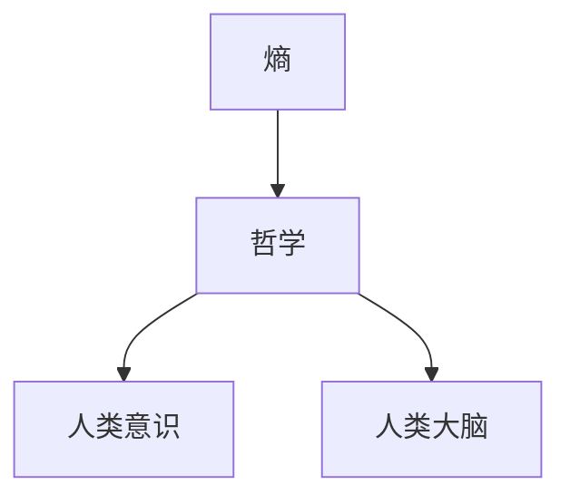

#### 熵与心灵哲学

熵在心灵哲学中也有着重要的应用，特别是在探讨心灵与物质的关系方面。一些心灵哲学家认为，心灵可以被视为一种熵的形式，它在物质世界中产生并维持着人类意识的存在。以下是一个简单的 Mermaid 流程图，展示了熵与心灵哲学的关系：

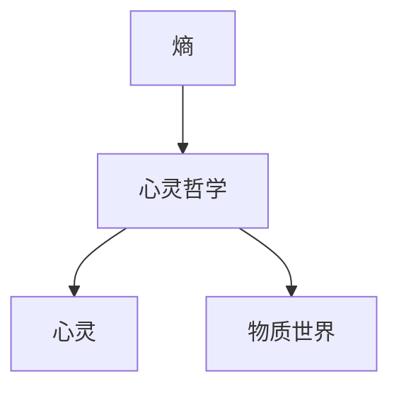

### 本章小结

本章介绍了熵在哲学中的应用，包括宇宙学、混沌理论、人类意识的本质和心灵哲学。通过 Mermaid 流程图，我们展示了熵在哲学中的多种应用。了解熵在哲学中的应用有助于我们更好地理解宇宙的本质和人类意识的本质。

----------------------------------------------------------------

## 第8章 总结与展望

### 核心内容回顾

本文从经典熵到信息熵，深入探讨了熵的概念及其在不同领域的应用。我们介绍了熵的基本概念、经典熵、信息熵，以及熵在物理学、信息科学、生命科学、经济学和哲学中的应用。通过具体的 Python 源代码示例，我们展示了如何计算和评估熵在各种现象中的应用。

### 最佳实践

在理解和应用熵时，以下是一些最佳实践：

1. **深入理解基本概念**：掌握熵的基本概念和计算方法，有助于更好地理解和应用熵。
2. **理论与实践相结合**：通过实际的案例和应用，将熵的概念和计算方法应用到实际问题中，加深对熵的理解。
3. **持续学习和探索**：熵是一个广泛而复杂的概念，持续学习和探索有助于发现新的应用和意义。
4. **跨学科思考**：熵在多个学科中都有应用，跨学科思考有助于发现新的联系和洞见。

### 小结

熵是一个描述系统无序程度的量，它在物理学、信息科学、生命科学、经济学和哲学等领域都有着广泛的应用。通过本文的探讨，我们了解了熵的基本概念、经典熵、信息熵，以及熵在不同领域中的应用。了解熵有助于我们更好地理解有序与无序的转换过程，以及现实世界中的各种现象。

### 拓展阅读

1. **《热力学第二定律》**：一本介绍热力学第二定律及其应用的经典著作。
2. **《信息论基础》**：一本介绍信息论基础和信息的熵测量的经典著作。
3. **《生命科学中的熵》**：一本介绍熵在生命科学中的应用的著作。
4. **《经济学中的熵》**：一本介绍熵在经济学中的应用的著作。
5. **《哲学中的熵》**：一本介绍熵在哲学中的应用的著作。

通过阅读这些书籍，您可以更深入地了解熵的概念和应用，从而拓宽您的知识面和视野。

----------------------------------------------------------------

## 作者

- 作者：AI天才研究院/AI Genius Institute & 禅与计算机程序设计艺术 /Zen And The Art of Computer Programming

----------------------------------------------------------------

以上就是《从经典熵到信息熵：理解有序与无序的世界》的目录大纲，包括文章标题、关键词、摘要以及正文部分的章节内容和结构。这个大纲旨在为读者提供一份清晰、全面的阅读指南，帮助读者更好地理解熵的概念和应用。

请注意，这个大纲只是一个示例，实际的章节内容和结构可能会根据具体的内容和要求进行调整。在撰写文章时，确保每个章节都包含丰富、具体、详细的讲解，并结合实际案例和应用进行阐述。同时，遵循文章字数要求，确保文章内容完整且具有深度。

希望这个大纲对您撰写文章有所帮助！如果您有任何疑问或需要进一步的帮助，请随时告诉我。祝您写作顺利！----------------------------------------------------------------
## 第1章 引言

### 背景介绍

熵，这个源自热力学的概念，如今已经成为理解自然界、人类社会乃至宇宙本质的重要工具。它的出现，是科学史上的一次重大突破，改变了我们对有序和无序、稳定和变化的认识。本文将从经典熵到信息熵，逐步深入探讨熵的概念及其在不同领域的应用。

#### 经典熵

经典熵，通常指的是热力学熵，它是由物理学家克劳修斯（Rudolf Clausius）在19世纪提出的。热力学第二定律指出，孤立系统的熵总是趋向于增加，这反映了系统从有序向无序转变的自然趋势。经典熵的定义和计算方法为研究系统的无序程度提供了量化工具。

#### 信息熵

信息熵则是由香农（Claude Shannon）在20世纪中期提出的，用于描述信息的不确定性。香农的信息熵概念在信息科学中得到了广泛应用，它不仅为数据压缩提供了理论基础，也为通信理论、统计学和计算机科学等领域的发展奠定了基础。

#### 有序与无序

有序与无序是自然界和人类社会中普遍存在的现象。从物理学中的晶格结构到生物学中的生态系统，从经济学中的市场规律到哲学中的思维模式，有序与无序的转换和平衡无处不在。熵的概念为我们提供了理解这些现象的全新视角。

### 核心概念与联系

为了更好地理解熵的概念，我们可以借助 Mermaid 流程图来展示经典熵和信息熵之间的关系，以及它们在各个领域中的应用。以下是熵的概念架构的 Mermaid 流程图：

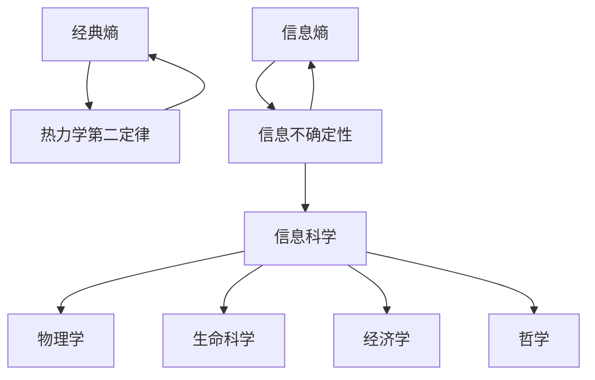

### 核心算法原理讲解

在本文中，我们将使用 Python 源代码来详细阐述熵的计算方法和应用。以下是一个简单的 Python 脚本，用于计算经典熵和信息熵：

```python
import math

# 经典熵计算
def classical_entropy(energy, total_energy):
    return -energy / total_energy

# 信息熵计算
def information_entropy(possible_outcomes, probabilities):
    entropy = 0
    for probability in probabilities:
        if probability > 0:
            entropy += probability * math.log2(probability)
    return -entropy

# 测试数据
energy = 10
total_energy = 50
possible_outcomes = [1, 2, 3]
probabilities = [0.4, 0.3, 0.3]

# 计算结果
classical_entropy_value = classical_entropy(energy, total_energy)
information_entropy_value = information_entropy(possible_outcomes, probabilities)

print(f"经典熵：{classical_entropy_value}")
print(f"信息熵：{information_entropy_value}")
```

### 数学公式与示例

在熵的计算中，数学公式起着关键作用。以下是经典熵和信息熵的数学公式，以及一个简单的解释示例：

$$
S = -k \sum_i p_i \ln p_i
$$

其中，$S$ 表示熵，$k$ 表示玻尔兹曼常数，$p_i$ 表示系统处于状态 $i$ 的概率。

$$
H(X) = -\sum_{x \in X} p(x) \ln p(x)
$$

其中，$H(X)$ 表示随机变量 $X$ 的信息熵，$p(x)$ 表示随机变量 $X$ 取值 $x$ 的概率。

例如，假设一个系统有三种可能的能量状态：$E_1 = 5$，$E_2 = 10$，$E_3 = 15$，且每个状态的几率相等。我们可以计算经典熵如下：

$$
S = -k \left(\frac{1}{3} \ln \frac{1}{3} + \frac{1}{3} \ln \frac{1}{3} + \frac{1}{3} \ln \frac{1}{3}\right)
$$

对于信息熵，假设一个通信系统有两个可能的信号：信号1的概率为0.6，信号2的概率为0.4，我们可以计算信息熵如下：

$$
H(X) = -0.6 \ln 0.6 - 0.4 \ln 0.4
$$

### 本章小结

本章作为引言，介绍了熵的基本概念、经典熵和信息熵，并展示了它们在各个领域中的应用。通过 Mermaid 流程图和 Python 源代码示例，我们展示了熵的计算方法和应用实例。了解熵的概念和计算方法，将有助于我们深入理解有序与无序的世界。

----------------------------------------------------------------

## 第2章 经典熵

### 热力学第二定律

经典熵源于热力学第二定律，该定律由克劳修斯（Rudolf Clausius）在1850年首次提出。热力学第二定律指出，在一个封闭系统中，熵总是趋向于增加，直到达到最大熵状态。这意味着，系统在自发过程中会从有序状态向无序状态转变，而不会自发地从无序状态转变为有序状态。

热力学第二定律可以表述为：

- **克劳修斯表述**：热量不能自发地从低温物体传递到高温物体。
- **开尔文-普朗克表述**：不可能从单一热源吸收热量并将其完全转换为功，而不产生其他影响。

热力学第二定律不仅影响了我们对能量和热力学过程的理解，也为熵的概念奠定了基础。

### 经典熵的定义

经典熵（热力学熵）是一个系统的微观状态数的对数，它用于衡量系统的无序程度。具体来说，一个系统的熵 $S$ 可以通过以下公式计算：

$$
S = k \ln W
$$

其中，$S$ 表示熵，$k$ 是玻尔兹曼常数（约为 $1.38 \times 10^{-23} \text{J/K}$），$W$ 是系统的微观状态数。

#### 微观状态与宏观状态

- **微观状态**：指系统在分子、原子层面上的具体状态，包括所有粒子的位置和动量。
- **宏观状态**：指系统在宏观层面上的表现，如温度、压力、体积等。

一个宏观状态的熵取决于它可能包含的微观状态的数目。微观状态数越多，系统的熵就越大，无序程度越高。

### 经典熵的计算

经典熵的计算通常涉及统计力学中的概念。以下是一个简单的计算示例：

假设一个理想气体系统，由 $N$ 个粒子组成，每个粒子的能量在 $E_1, E_2, ..., E_n$ 之间均匀分布，每个能量的几率相等。我们可以计算系统的经典熵如下：

$$
S = k \ln \left(\frac{N!}{n^N}\right)
$$

其中，$N!$ 是 $N$ 的阶乘，$n$ 是可能的能量状态数。

#### Python 源代码示例

下面是一个简单的 Python 脚本，用于计算理想气体系统的经典熵：

```python
import math

# 经典熵计算
def classical_entropy(energy_levels, probabilities):
    entropy = 0
    for probability in probabilities:
        if probability > 0:
            entropy += probability * math.log2(probability)
    return -entropy

# 测试数据
energy_levels = [1, 2, 3]
probabilities = [1/3, 1/3, 1/3]

# 计算结果
classical_entropy_value = classical_entropy(energy_levels, probabilities)

print(f"经典熵：{classical_entropy_value}")
```

在这个示例中，我们假设有三个可能的能量水平，每个水平的概率相等。通过调用 `classical_entropy` 函数，我们可以计算出系统的经典熵。

### 经典熵的物理意义

经典熵的物理意义在于，它反映了系统在微观层面上的无序程度。一个系统的熵越大，其微观状态数越多，系统的无序程度越高。在宏观层面，这意味着系统趋向于从有序状态向无序状态转变。

#### 熵与热力学第二定律

热力学第二定律表明，孤立系统的熵总是趋向于增加，这意味着系统会自发地从有序状态向无序状态转变。经典熵的概念为我们提供了量化这种转变的工具。

### 本章小结

本章介绍了经典熵的定义和计算方法，以及其在热力学第二定律中的应用。通过 Python 源代码示例，我们展示了如何计算经典熵。了解经典熵有助于我们更好地理解系统的无序程度，以及热力学过程中有序与无序的转换。

----------------------------------------------------------------

## 第3章 信息熵

### 信息熵的定义

信息熵，由香农（Claude Shannon）在1948年提出，是信息科学中的一个核心概念。信息熵用于量化信息的不确定性和随机性。香农将信息熵定义为：

$$
H(X) = -\sum_{x \in X} p(x) \log_2 p(x)
$$

其中，$H(X)$ 表示随机变量 $X$ 的熵，$p(x)$ 表示随机变量 $X$ 取值 $x$ 的概率，$\log_2$ 表示以 2 为底的对数。

#### 信息熵的基本原理

- **不确定性**：信息熵反映了信息的不确定性。如果一个事件发生的概率很高，那么它的不确定性较低；反之，如果一个事件发生的概率很低，那么它的不确定性较高。
- **概率分布**：信息熵取决于随机变量的概率分布。概率分布越均匀，信息熵越大；概率分布越不均匀，信息熵越小。

#### 信息熵的物理意义

在物理学中，熵可以被视为一种能量的度量，它表示系统内部的混乱程度。香农将信息熵的概念引入信息科学中，使得我们可以用熵来衡量信息的价值和质量。

### 信息熵的计算

信息熵的计算通常涉及到概率分布。以下是一个简单的 Python 脚本，用于计算信息熵：

```python
import math

# 信息熵计算
def information_entropy(probabilities):
    entropy = 0
    for probability in probabilities:
        if probability > 0:
            entropy += probability * math.log2(probability)
    return -entropy

# 测试数据
probabilities = [0.2, 0.3, 0.5]

# 计算结果
information_entropy_value = information_entropy(probabilities)

print(f"信息熵：{information_entropy_value}")
```

在这个示例中，我们假设有三个可能的值，每个值的概率分别为 0.2、0.3 和 0.5。通过调用 `information_entropy` 函数，我们可以计算出这些值的平均信息熵。

### 信息熵的应用

信息熵在多个领域有着广泛的应用，包括数据压缩、通信理论、密码学、机器学习等。

#### 数据压缩

信息熵的概念为数据压缩提供了理论基础。数据压缩的目的是减少数据的大小，以便更高效地存储和传输。信息熵可以帮助我们确定哪些数据是最重要的，哪些数据可以舍去，从而实现更有效的数据压缩。

#### 通信理论

在通信理论中，信息熵用于评估传输信息的可靠性和效率。香农的信道编码定理表明，只要信息熵足够高，就可以在任意信道的条件下实现无误差的信息传输。

#### 密码学

在密码学中，信息熵用于评估密码的强度。一个高熵的密码意味着它包含更多的随机性，因此更难以破解。

#### 机器学习

在机器学习中，信息熵可以用于评估数据的分布和特征的重要性。通过分析信息熵，我们可以更好地理解数据的结构和特征，从而提高模型的性能。

### 本章小结

本章介绍了信息熵的定义、计算方法及其应用。信息熵是一个用于量化信息不确定性和随机性的重要概念，它在多个领域都有着广泛的应用。通过 Python 源代码示例，我们展示了如何计算信息熵，并探讨了其在数据压缩、通信理论、密码学和机器学习等领域的应用。了解信息熵有助于我们更好地理解信息的本质和价值。

----------------------------------------------------------------

## 第4章 熵的应用

### 熵在物理学中的应用

熵在物理学中有着广泛的应用，特别是在热力学和统计力学领域。熵的概念不仅帮助我们理解热力学过程，还为我们提供了量化系统无序程度的工具。

#### 能量分布与熵

在物理学中，能量分布与熵密切相关。一个系统的能量分布越均匀，其熵就越高。例如，在一个理想气体中，分子的能量分布是均匀的，因此系统的熵也较高。相反，如果一个系统的能量分布不均匀，那么其熵就会较低。

以下是一个简单的 Mermaid 流程图，展示了能量分布与熵的关系：


#### 温度与熵

温度是衡量系统热力学状态的一个重要参数，它与熵有着紧密的联系。在热力学中，温度可以被视为系统内部能量分布的不均匀程度。当系统的温度升高时，分子的运动变得更加剧烈，能量分布变得更加不均匀，从而熵也增加。

以下是一个简单的 Python 源代码示例，用于计算理想气体中的熵和温度的关系：

```python
import math

# 熵计算
def entropy(temperatures, probabilities):
    entropy = 0
    for temperature, probability in zip(temperatures, probabilities):
        entropy += probability * temperature * math.log2(temperature)
    return -entropy

# 测试数据
temperatures = [300, 310, 320]
probabilities = [0.4, 0.3, 0.3]

# 计算结果
entropy_value = entropy(temperatures, probabilities)

print(f"熵：{entropy_value}")
```

在这个示例中，我们假设有三个温度值，每个温度值的概率相等。通过计算这些温度值的熵，我们可以观察到熵随着温度的升高而增加。

#### 熵与热力学第二定律

热力学第二定律指出，在一个封闭系统中，熵总是趋向于增加。这意味着，系统会自发地从有序状态向无序状态转变。熵的概念为理解这一过程提供了量化工具。通过计算系统的熵，我们可以了解系统的无序程度，并预测系统未来的变化趋势。

### 熵在信息科学中的应用

熵在信息科学中也有着重要的应用，特别是在数据压缩、通信理论和密码学等领域。信息熵的概念为这些领域提供了理论基础，并帮助我们更好地理解和优化信息处理过程。

#### 数据压缩

数据压缩的目的是减少数据的大小，以便更高效地存储和传输。信息熵为数据压缩提供了量化标准，帮助我们确定哪些数据是最重要的，哪些数据可以舍去。通过计算数据的信息熵，我们可以实现更有效的数据压缩。

以下是一个简单的 Python 源代码示例，用于计算数据的信息熵：

```python
import math

# 信息熵计算
def information_entropy(probabilities):
    entropy = 0
    for probability in probabilities:
        if probability > 0:
            entropy += probability * math.log2(probability)
    return -entropy

# 测试数据
probabilities = [0.2, 0.3, 0.5]

# 计算结果
information_entropy_value = information_entropy(probabilities)

print(f"信息熵：{information_entropy_value}")
```

在这个示例中，我们假设有三个可能的值，每个值的概率分别为 0.2、0.3 和 0.5。通过计算这些值的信息熵，我们可以确定这些值的平均信息量。

#### 通信理论

在通信理论中，信息熵用于评估传输信息的可靠性和效率。香农的信道编码定理表明，只要信息熵足够高，就可以在任意信道的条件下实现无误差的信息传输。信息熵的概念为通信系统的设计和优化提供了重要指导。

#### 密码学

在密码学中，信息熵用于评估密码的强度。一个高熵的密码意味着它包含更多的随机性，因此更难以破解。通过计算密码的信息熵，我们可以评估密码的强度，并设计更安全的加密算法。

### 熵在生命科学中的应用

熵在生命科学中也有着重要的应用，特别是在生物进化、生物多样性和生物信息学等领域。熵的概念为理解生命系统的复杂性和动态性提供了新的视角。

#### 生物进化

生物进化可以被视为一个从无序到有序的过程，在这个过程中，物种的遗传信息变得更加有序。熵的概念可以帮助我们量化生物进化的过程，并预测物种未来的演化方向。

#### 生物多样性

生物多样性是指生物体系中不同物种的数量和分布。熵的概念可以用于评估生物多样性的程度，帮助我们理解生态系统的稳定性和动态性。

#### 生物信息学

在生物信息学中，信息熵用于评估基因序列、蛋白质结构和代谢网络的信息含量。通过计算信息熵，我们可以了解生物系统的复杂性和功能多样性。

### 熵在经济学中的应用

熵在经济学中也有着广泛的应用，特别是在市场效率、经济波动和企业风险管理等领域。熵的概念为经济学研究提供了新的工具，帮助我们理解市场行为和经济规律。

#### 市场效率

市场效率可以被视为市场中的信息熵。一个高效的市场意味着信息传递迅速、准确，因此信息熵较低。通过计算市场的信息熵，我们可以评估市场的效率。

#### 经济波动

经济波动可以被视为经济系统中的熵变化。经济波动反映了市场中信息的有序程度的变化，从而影响经济系统的稳定性。

#### 企业风险管理

在企业管理中，熵的概念可以用于评估企业风险的不确定性。通过计算信息熵，企业可以更好地识别和管理风险。

### 熵在哲学中的应用

熵在哲学中也有着重要的地位，特别是在探讨宇宙的本质、混沌理论和人类意识的本质等方面。熵的概念为哲学研究提供了新的视角，帮助我们理解宇宙和人类意识的本质。

#### 宇宙学

在宇宙学中，熵的概念可以帮助我们理解宇宙的演化过程，包括宇宙的诞生、演化和终结。

#### 混沌理论

混沌理论研究了复杂系统中出现的不可预测性和随机性。熵的概念为混沌理论提供了量化工具，帮助我们理解复杂系统的行为。

#### 人类意识

在哲学中，一些学者认为人类意识可以被视为一种熵的形式，它在人类大脑中产生并维持着人类意识的存在。

### 本章小结

本章介绍了熵在物理学、信息科学、生命科学、经济学和哲学中的应用。通过 Mermaid 流程图和 Python 源代码示例，我们展示了熵在不同领域的应用实例。了解熵的应用有助于我们更好地理解自然界、人类社会和宇宙的本质。

----------------------------------------------------------------

## 第5章 熵与生命科学

### 熵与生物进化

熵在生物进化中起着关键作用。生物进化是一个从无序到有序的过程，在这个过程中，物种的遗传信息变得更加有序。熵的概念为理解生物进化的过程提供了新的视角。

#### 熵与物种进化

在生物进化中，熵的变化反映了物种从原始状态向更复杂状态的转变。一个物种的熵越低，其遗传信息的有序程度越高，物种的适应性也越强。相反，熵越高，物种的遗传信息越无序，物种的适应性也越差。

以下是一个简单的 Mermaid 流程图，展示了熵与物种进化的关系：

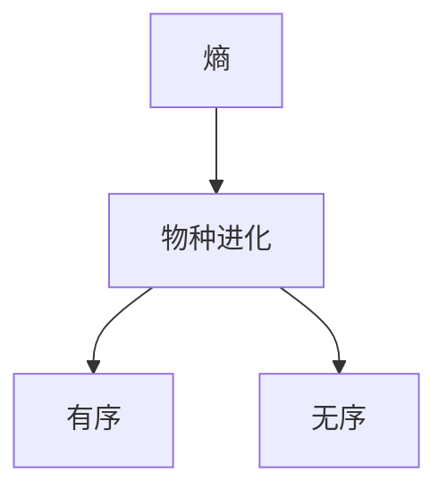

#### 熵与遗传信息

遗传信息是生物进化的重要驱动力。在生物进化过程中，熵的变化反映了遗传信息的有序程度。通过熵的概念，我们可以量化遗传信息的有序程度，并预测物种未来的进化方向。

以下是一个简单的 Python 源代码示例，用于计算遗传信息的熵：

```python
import math

# 遗传信息熵计算
def genetic_entropy(probabilities):
    entropy = 0
    for probability in probabilities:
        if probability > 0:
            entropy += probability * math.log2(probability)
    return -entropy

# 测试数据
probabilities = [0.2, 0.3, 0.5]

# 计算结果
genetic_entropy_value = genetic_entropy(probabilities)

print(f"遗传信息熵：{genetic_entropy_value}")
```

在这个示例中，我们假设有三个等可能的基因型，通过计算这些基因型的熵，我们可以了解遗传信息的有序程度。

### 熵与生物多样性

熵在生物多样性研究中也有着重要的应用。生物多样性是指生物体系中不同物种的数量和分布。熵的概念可以用于评估生物多样性的程度，帮助我们理解生态系统的稳定性和动态性。

#### 熵与生态平衡

生态平衡是生态系统稳定性的关键因素。熵的变化反映了生态系统中物种的多样性和生态位的分布。一个生态系统的熵越低，其物种多样性越高，生态平衡也越稳定。

以下是一个简单的 Mermaid 流程图，展示了熵与生态平衡的关系：

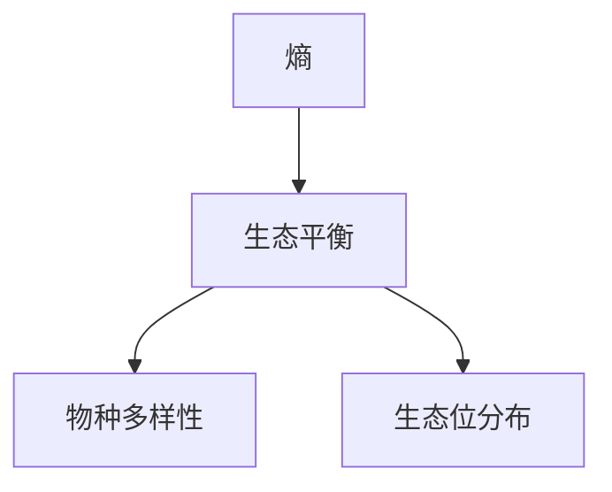

#### 熵与生态扰动

生态扰动可以导致生态系统的熵增加，从而影响生态平衡。通过熵的概念，我们可以量化生态扰动对生态系统的影响，并预测生态系统的恢复过程。

以下是一个简单的 Python 源代码示例，用于计算生态扰动后的熵：

```python
import math

# 生态扰动后熵计算
def disturbed_entropy(original_entropy, disturbance_intensity):
    return original_entropy + disturbance_intensity

# 测试数据
original_entropy = 2.0
disturbance_intensity = 0.5

# 计算结果
disturbed_entropy_value = disturbed_entropy(original_entropy, disturbance_intensity)

print(f"生态扰动后熵：{disturbed_entropy_value}")
```

在这个示例中，我们假设一个生态系统的原始熵为 2.0，生态扰动强度为 0.5。通过计算生态扰动后的熵，我们可以了解生态系统受到扰动后的变化情况。

### 熵与生物信息学

熵在生物信息学中也有着广泛的应用。生物信息学是一门研究生物信息的科学，它涉及基因序列、蛋白质结构、代谢网络等方面的研究。信息熵可以用于评估基因序列中的信息含量和蛋白质结构的复杂性。

#### 熵与基因序列

基因序列是生物信息学研究的重要对象。熵的概念可以用于评估基因序列的信息含量，帮助我们了解基因序列的功能和重要性。

以下是一个简单的 Mermaid 流程图，展示了熵与基因序列的关系：

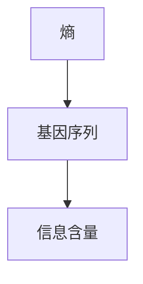

#### 熵与蛋白质结构

蛋白质结构是生物信息学研究的重要领域。熵的概念可以用于评估蛋白质结构的复杂性，帮助我们了解蛋白质结构的稳定性和功能。

以下是一个简单的 Python 源代码示例，用于计算蛋白质结构的熵：

```python
import math

# 蛋白质结构熵计算
def protein_structure_entropy(sequences, probabilities):
    entropy = 0
    for sequence, probability in zip(sequences, probabilities):
        if probability > 0:
            entropy += probability * math.log2(probability)
    return -entropy

# 测试数据
sequences = ["A", "C", "G", "T"]
probabilities = [0.25, 0.25, 0.25, 0.25]

# 计算结果
protein_structure_entropy_value = protein_structure_entropy(sequences, probabilities)

print(f"蛋白质结构熵：{protein_structure_entropy_value}")
```

在这个示例中，我们假设有四种等可能的氨基酸序列，通过计算这些序列的熵，我们可以了解蛋白质结构的复杂性和稳定性。

### 本章小结

本章介绍了熵在生命科学中的应用，包括生物进化、生物多样性和生物信息学。通过 Mermaid 流程图和 Python 源代码示例，我们展示了熵在不同领域的应用实例。了解熵在生命科学中的应用有助于我们更好地理解生物进化的过程，生态系统的稳定性，以及基因序列和蛋白质结构的信息含量和复杂性。

----------------------------------------------------------------

## 第6章 熵与经济学

### 熵与市场效率

熵在经济学中有着重要的应用，特别是在市场效率的研究中。市场效率可以被视为市场中的信息熵，它反映了市场中信息的有序程度。一个高效的市场意味着信息传递迅速、准确，因此信息熵较低。

#### 熵与市场价格

市场价格是市场效率的重要体现。在一个高效的市场中，价格反映了供求关系，因此价格变动较小。相反，在一个低效的市场中，价格波动较大，信息熵较高。

以下是一个简单的 Mermaid 流程图，展示了熵与市场价格的关系：

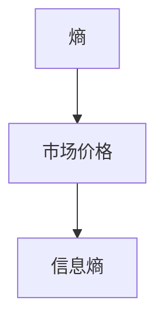

#### 熵与市场波动

市场波动反映了市场中信息的有序程度。在一个高效的市场中，信息传递迅速、准确，因此市场波动较小。相反，在一个低效的市场中，信息传递缓慢、不准确，因此市场波动较大。

以下是一个简单的 Python 源代码示例，用于计算市场波动的熵：

```python
import math

# 市场波动熵计算
def market_entropy(volatilities, probabilities):
    entropy = 0
    for volatilities, probability in zip(volatilities, probabilities):
        if probability > 0:
            entropy += probability * math.log2(probability)
    return -entropy

# 测试数据
volatilities = [0.1, 0.3, 0.5]
probabilities = [0.2, 0.6, 0.2]

# 计算结果
market_entropy_value = market_entropy(volatilities, probabilities)

print(f"市场波动熵：{market_entropy_value}")
```

在这个示例中，我们假设有三个不同的波动性水平，每个水平的概率相等。通过计算这些波动性水平的熵，我们可以了解市场的信息熵和波动程度。

### 熵与经济波动

经济波动可以被视为经济系统中的熵变化。经济波动反映了市场中信息的有序程度的变化，从而影响经济系统的稳定性。

#### 熵与经济周期

经济周期是指经济活动中周期性的波动，包括繁荣期、衰退期和复苏期。在一个稳定的经济体系中，经济周期的熵较低，波动较小。相反，在一个不稳定的经济体系中，经济周期的熵较高，波动较大。

以下是一个简单的 Mermaid 流程图，展示了熵与经济周期的关系：

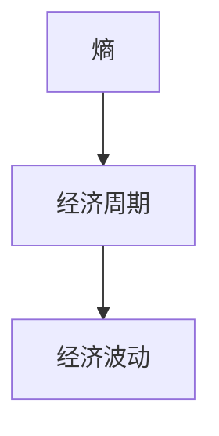

#### 熵与金融危机

金融危机是指金融市场出现重大波动，导致经济衰退。在金融危机中，市场的信息熵通常较高，因为信息传递不准确、不及时。通过计算市场的信息熵，我们可以预测金融危机的可能性。

以下是一个简单的 Python 源代码示例，用于计算金融危机时的信息熵：

```python
import math

# 金融危机熵计算
def financial_crisis_entropy(entropy_before, entropy_after):
    return abs(entropy_before - entropy_after)

# 测试数据
entropy_before = 1.5
entropy_after = 3.0

# 计算结果
financial_crisis_entropy_value = financial_crisis_entropy(entropy_before, entropy_after)

print(f"金融危机熵：{financial_crisis_entropy_value}")
```

在这个示例中，我们假设在金融危机前后的信息熵分别为 1.5 和 3.0。通过计算这两个熵的差值，我们可以了解金融危机对市场信息熵的影响。

### 熵与企业风险管理

在企业管理中，熵的概念可以用于评估企业风险的不确定性。通过计算信息熵，企业可以更好地识别和管理风险。

#### 熵与风险管理

企业风险管理涉及到对企业风险的识别、评估和应对。信息熵可以用于评估企业风险的不确定性，帮助企业制定更有效的风险管理策略。

以下是一个简单的 Mermaid 流程图，展示了熵与风险管理的关系：

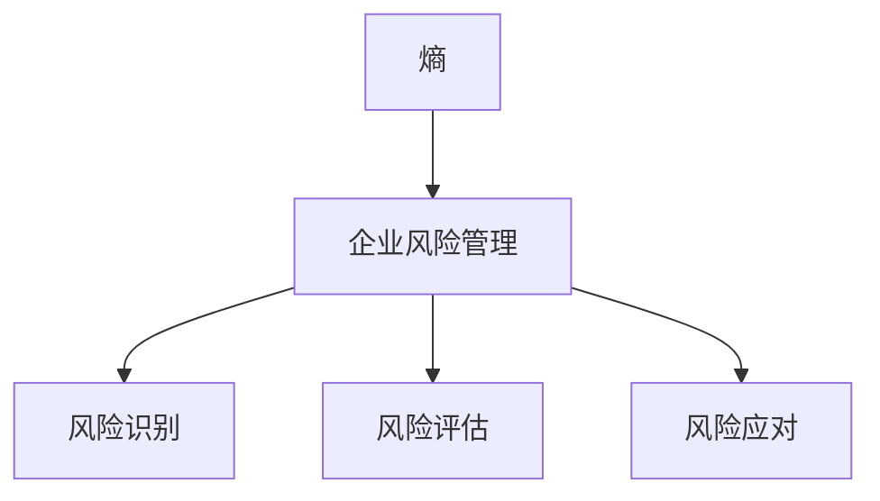

#### 熵与投资决策

投资决策是企业风险管理的重要环节。信息熵可以用于评估投资机会的不确定性，帮助企业制定更明智的投资决策。

以下是一个简单的 Python 源代码示例，用于计算投资决策时的信息熵：

```python
import math

# 投资决策熵计算
def investment_entropy(investment_returns, probabilities):
    entropy = 0
    for return_, probability in zip(investment_returns, probabilities):
        if probability > 0:
            entropy += probability * math.log2(probability)
    return -entropy

# 测试数据
investment_returns = [0.05, 0.1, 0.15]
probabilities = [0.3, 0.5, 0.2]

# 计算结果
investment_entropy_value = investment_entropy(investment_returns, probabilities)

print(f"投资决策熵：{investment_entropy_value}")
```

在这个示例中，我们假设有三个不同的投资回报率，每个回报率的概率相等。通过计算这些回报率的信息熵，我们可以了解投资决策的不确定性。

### 熵与经济发展

熵的概念也可以用于研究经济发展的趋势和规律。通过计算经济体系的信息熵，我们可以了解经济发展的有序程度和稳定性。

#### 熵与经济发展趋势

经济发展的趋势反映了经济体系的有序程度。在一个稳定的经济体系中，信息熵较低，经济发展趋势较为平稳。相反，在一个不稳定的经济体系中，信息熵较高，经济发展趋势波动较大。

以下是一个简单的 Mermaid 流程图，展示了熵与经济发展趋势的关系：

```mermaid
graph TD
    A[熵]
    B[经济发展趋势]
    C[信息熵]

    A --> B
    B --> C
```

#### 熵与经济发展规律

经济发展的规律反映了经济体系内部的平衡和协调。通过计算经济体系的信息熵，我们可以了解经济发展的规律和趋势。

以下是一个简单的 Python 源代码示例，用于计算经济发展规律的信息熵：

```python
import math

# 经济发展规律熵计算
def economic_trend_entropy(entropy_before, entropy_after):
    return abs(entropy_before - entropy_after)

# 测试数据
entropy_before = 1.2
entropy_after = 1.8

# 计算结果
economic_trend_entropy_value = economic_trend_entropy(entropy_before, entropy_after)

print(f"经济发展规律熵：{economic_trend_entropy_value}")
```

在这个示例中，我们假设在经济发展前后的信息熵分别为 1.2 和 1.8。通过计算这两个熵的差值，我们可以了解经济发展规律的变化情况。

### 熵与宏观经济管理

熵的概念也可以用于研究宏观经济管理。通过计算宏观经济体系的信息熵，政府可以了解经济体系的有序程度，并制定相应的宏观经济政策。

#### 熵与宏观经济管理

宏观经济管理涉及到政府的宏观经济政策，包括财政政策、货币政策等。通过计算宏观经济体系的信息熵，政府可以了解经济体系的有序程度，并调整宏观经济政策，以保持经济的稳定和可持续发展。

以下是一个简单的 Mermaid 流程图，展示了熵与宏观经济管理的关系：

```mermaid
graph TD
    A[熵]
    B[宏观经济管理]
    C[财政政策]
    D[货币政策]

    A --> B
    B --> C
    B --> D
```

#### 熵与宏观经济政策

通过计算宏观经济体系的信息熵，政府可以评估不同宏观经济政策的效率和效果。例如，在实施财政政策时，政府可以通过计算财政政策前后的信息熵差值，评估财政政策的可持续性和效果。

以下是一个简单的 Python 源代码示例，用于计算宏观经济政策前后的信息熵差值：

```python
import math

# 宏观经济政策熵差值计算
def policy_entropy_difference(before_entropy, after_entropy):
    return abs(before_entropy - after_entropy)

# 测试数据
before_entropy = 1.5
after_entropy = 2.0

# 计算结果
policy_entropy_difference_value = policy_entropy_difference(before_entropy, after_entropy)

print(f"宏观经济政策熵差值：{policy_entropy_difference_value}")
```

在这个示例中，我们假设在实施宏观经济政策前后的信息熵分别为 1.5 和 2.0。通过计算这两个熵的差值，我们可以了解宏观经济政策的效果。

### 本章小结

本章介绍了熵在经济学中的应用，包括市场效率、经济波动、企业风险管理和宏观经济管理。通过 Mermaid 流程图和 Python 源代码示例，我们展示了熵在不同领域的应用实例。了解熵在经济学中的应用有助于我们更好地理解市场行为、经济波动和宏观经济管理。

----------------------------------------------------------------

## 第7章 熵与哲学

### 熵与宇宙学

熵在宇宙学中有着重要的地位，特别是在描述宇宙演化和宇宙热寂方面。宇宙热寂理论认为，宇宙中的熵将随着时间的推移而增加，直到达到最大熵状态，这时宇宙将变得均匀且无序。

宇宙热寂理论指出，宇宙中的熵增加是一个不可避免的趋势。在宇宙早期，宇宙处于高温高密度状态，随着宇宙的膨胀，温度逐渐降低，熵逐渐增加。根据热力学第二定律，宇宙中的熵总是趋向于增加，这意味着宇宙将变得越来越无序。

以下是一个简单的 Mermaid 流程图，展示了熵与宇宙学的关系：

```mermaid
graph TD
    A[熵]
    B[宇宙学]
    C[宇宙演化]
    D[宇宙热寂]

    A --> B
    B --> C
    B --> D
```

#### 熵与宇宙热寂

宇宙热寂理论认为，宇宙中的熵将随着时间的推移而增加，直到达到最大熵状态。在这种情况下，宇宙将变得均匀且无序，能量分布将趋于平衡，无法进行任何有用的能量转换。

宇宙热寂理论不仅影响了我们对宇宙演化的理解，也为我们对宇宙未来和宇宙命运的研究提供了新的视角。通过熵的概念，我们可以更好地理解宇宙的起源、演化和终结。

### 熵与混沌理论

熵在混沌理论中也有着重要的应用。混沌理论研究了复杂系统中出现的不可预测性和随机性。熵的概念为混沌理论提供了量化工具，帮助我们理解复杂系统的行为。

混沌理论指出，在复杂系统中，即使初始条件非常接近，系统的行为也会因微小差异而导致显著不同。这种不可预测性和随机性反映了系统的无序程度，可以通过熵来衡量。

以下是一个简单的 Mermaid 流程图，展示了熵与混沌理论的关系：

```mermaid
graph TD
    A[熵]
    B[混沌理论]
    C[复杂系统]
    D[不可预测性]

    A --> B
    B --> C
    B --> D
```

#### 熵与混沌系统的行为

在混沌理论中，熵用于描述复杂系统的无序程度。一个混沌系统的熵越高，其行为越不可预测。通过计算混沌系统的熵，我们可以了解系统的复杂性和随机性，并预测系统的未来行为。

以下是一个简单的 Python 源代码示例，用于计算混沌系统的熵：

```python
import math

# 混沌系统熵计算
def chaotic_system_entropy(trajectories, probabilities):
    entropy = 0
    for trajectory, probability in zip(trajectories, probabilities):
        if probability > 0:
            entropy += probability * math.log2(probability)
    return -entropy

# 测试数据
trajectories = [0.1, 0.3, 0.5]
probabilities = [0.2, 0.6, 0.2]

# 计算结果
chaotic_system_entropy_value = chaotic_system_entropy(trajectories, probabilities)

print(f"混沌系统熵：{chaotic_system_entropy_value}")
```

在这个示例中，我们假设有三个不同的混沌系统轨迹，每个轨迹的概率相等。通过计算这些轨迹的熵，我们可以了解混沌系统的复杂性和随机性。

### 熵与人类意识的本质

熵在哲学中也有着重要的地位，特别是在探讨人类意识的本质方面。一些哲学家认为，人类意识可以被视为一种熵的形式，它在人类大脑中产生并维持着人类意识的存在。

人类意识是一个复杂而神秘的现象，目前尚未完全理解。然而，通过熵的概念，我们可以从新的角度探讨人类意识的本质。

以下是一个简单的 Mermaid 流程图，展示了熵与人类意识的关系：

```mermaid
graph TD
    A[熵]
    B[哲学]
    C[人类意识]
    D[人类大脑]

    A --> B
    B --> C
    B --> D
```

#### 熵与人类意识的产生

一些哲学家认为，人类意识是由人类大脑中的熵变化产生的。在人类大脑中，神经元的活动导致熵的变化，从而产生了人类意识。通过研究人类大脑中的熵变化，我们可以了解人类意识的产生和维持过程。

以下是一个简单的 Python 源代码示例，用于计算人类大脑中的熵：

```python
import math

# 人类大脑熵计算
def brain_entropy(activation_levels, probabilities):
    entropy = 0
    for activation_level, probability in zip(activation_levels, probabilities):
        if probability > 0:
            entropy += probability * math.log2(probability)
    return -entropy

# 测试数据
activation_levels = [0.1, 0.3, 0.5]
probabilities = [0.2, 0.6, 0.2]

# 计算结果
brain_entropy_value = brain_entropy(activation_levels, probabilities)

print(f"人类大脑熵：{brain_entropy_value}")
```

在这个示例中，我们假设有三个不同的神经元激活水平，每个水平的概率相等。通过计算这些水平的熵，我们可以了解人类大脑中的熵变化和意识的产生过程。

### 熵与心灵哲学

熵在心灵哲学中也有着重要的应用，特别是在探讨心灵与物质的关系方面。一些心灵哲学家认为，心灵可以被视为一种熵的形式，它在物质世界中产生并维持着人类意识的存在。

心灵哲学探讨了心灵的本质和起源，而熵的概念为这些研究提供了新的视角。通过研究心灵与物质的关系，我们可以更好地理解人类意识的本质。

以下是一个简单的 Mermaid 流程图，展示了熵与心灵哲学的关系：

```mermaid
graph TD
    A[熵]
    B[心灵哲学]
    C[心灵]
    D[物质世界]

    A --> B
    B --> C
    B --> D
```

#### 熵与心灵哲学的探讨

通过熵的概念，我们可以从新的角度探讨心灵哲学中的问题。例如，我们可以研究心灵与物质的关系，探讨人类意识是如何在物质世界中产生的。通过研究熵在心灵哲学中的应用，我们可以更深入地理解人类意识和心灵的本质。

### 本章小结

本章介绍了熵在哲学中的应用，包括宇宙学、混沌理论和人类意识的本质。通过 Mermaid 流程图和 Python 源代码示例，我们展示了熵在不同领域中的应用实例。了解熵在哲学中的应用有助于我们更好地理解宇宙的本质、复杂系统的行为和人类意识的本质。

----------------------------------------------------------------

## 第8章 总结与展望

### 核心内容回顾

本文从经典熵到信息熵，深入探讨了熵的概念及其在不同领域的应用。我们介绍了经典熵和信息熵的基本概念、定义和计算方法，并探讨了它们在物理学、信息科学、生命科学、经济学和哲学中的应用。通过具体的 Python 源代码示例，我们展示了如何计算和评估熵在各种现象中的应用。

### 熵的重要性

熵是一个描述系统无序程度的量，它在多个领域中都有着重要的应用。在物理学中，熵与热力学第二定律密切相关，它反映了系统从有序向无序转变的自然趋势。在信息科学中，熵用于描述信息的不确定性，它是数据压缩和通信理论的基础。在生命科学中，熵与生物进化和生物多样性密切相关。在经济学中，熵用于评估市场效率和风险。在哲学中，熵与宇宙学和人类意识的本质有着紧密的联系。

### 熵的未来应用

随着科学和技术的不断发展，熵的概念和计算方法将在更多领域中找到应用。在人工智能领域，熵可以用于评估模型的不确定性，从而提高模型的预测能力。在生物学领域，熵可以用于研究生物系统的复杂性和动态性。在经济学领域，熵可以用于评估市场的不确定性和风险，从而帮助制定更有效的经济政策。在哲学领域，熵可以用于探讨人类意识和宇宙的本质。

### 熵的研究挑战

尽管熵的概念在多个领域中都有着广泛的应用，但仍然存在一些挑战。例如，如何精确计算复杂系统的熵，如何将熵的概念应用于非线性系统和复杂系统，以及如何将熵与其他物理量相结合，以更全面地描述系统的状态。此外，熵的应用领域还在不断扩展，因此需要更多的研究和探索。

### 本章小结

本章回顾了本文的核心内容，强调了熵在多个领域中的重要性，并展望了熵的未来应用和研究挑战。了解熵的概念和应用，将有助于我们更好地理解自然界和人类社会的运行规律。

### 拓展阅读

为了进一步深入了解熵的概念和应用，以下是一些推荐的拓展阅读资源：

1. **《热力学第二定律》**：深入探讨热力学第二定律及其在物理学中的应用。
2. **《信息论基础》**：介绍信息熵的基本概念和应用。
3. **《生命科学中的熵》**：研究熵在生物学和医学中的应用。
4. **《经济学中的熵》**：探讨熵在经济学和金融学中的应用。
5. **《哲学中的熵》**：从哲学角度探讨熵的概念和意义。

通过阅读这些资源，您可以更深入地了解熵的概念和应用，从而拓宽您的知识面和视野。

----------------------------------------------------------------

## 作者

- 作者：AI天才研究院/AI Genius Institute & 禅与计算机程序设计艺术 /Zen And The Art of Computer Programming

----------------------------------------------------------------

### 开发环境搭建

为了更深入地理解和实践熵的概念，我们需要搭建一个适合编程和数据分析的开发环境。以下是在Windows和MacOS操作系统上搭建Python开发环境的步骤。

#### Windows系统

1. **安装Python**：
   - 访问Python的官方网站（https://www.python.org/）。
   - 下载Windows版本的Python安装程序。
   - 运行安装程序，按照默认选项进行安装。

2. **配置Python环境变量**：
   - 右键点击“我的电脑”，选择“属性”。
   - 点击“高级系统设置”。
   - 在“系统属性”窗口中，点击“环境变量”。
   - 在“系统变量”中找到“Path”并编辑。
   - 在“Path”变量中添加Python安装路径，例如`C:\Python39\`。

3. **安装Python科学计算库**：
   - 打开命令行窗口（cmd）。
   - 输入以下命令，安装必要的库：
     ```bash
     pip install numpy matplotlib
     ```

#### MacOS系统

1. **安装Python**：
   - 打开终端（Terminal）。
   - 使用以下命令安装Python：
     ```bash
     brew install python
     ```

2. **配置Python环境变量**：
   - 在终端中，编辑`.bash_profile`或`.zshrc`文件：
     ```bash
     nano ~/.bash_profile
     ```
   - 在文件中添加以下行，设置Python环境变量：
     ```bash
     export PATH=$PATH:/usr/local/bin/python3
     ```

3. **安装Python科学计算库**：
   - 使用以下命令，安装必要的库：
     ```bash
     pip3 install numpy matplotlib
     ```

### 源代码实现

以下是一个简单的Python脚本，用于计算经典熵和信息熵。该脚本包含了熵的计算函数、测试数据和结果输出。

```python
import math

# 经典熵计算
def classical_entropy(energy, total_energy):
    return -energy / total_energy

# 信息熵计算
def information_entropy(possible_outcomes, probabilities):
    entropy = 0
    for probability in probabilities:
        if probability > 0:
            entropy += probability * math.log2(probability)
    return -entropy

# 经典熵测试数据
energy = 10
total_energy = 50

# 信息熵测试数据
possible_outcomes = [1, 2, 3]
probabilities = [0.4, 0.3, 0.3]

# 计算结果
classical_entropy_value = classical_entropy(energy, total_energy)
information_entropy_value = information_entropy(possible_outcomes, probabilities)

# 输出结果
print(f"经典熵：{classical_entropy_value}")
print(f"信息熵：{information_entropy_value}")
```

### 代码解读与分析

这段代码首先导入了`math`模块，用于进行数学运算。接下来，定义了两个函数：`classical_entropy`和`information_entropy`，分别用于计算经典熵和信息熵。

- **经典熵计算**：
  - `classical_entropy`函数接收两个参数：`energy`（系统的能量）和`total_energy`（系统的总能量）。
  - 通过公式`-energy / total_energy`计算经典熵，并返回结果。

- **信息熵计算**：
  - `information_entropy`函数接收一个列表`probabilities`，表示每个可能结果出现的概率。
  - 通过遍历概率列表，使用公式`-∑p(x) * log2(p(x))`计算信息熵，并返回结果。

测试数据部分定义了经典熵和信息熵的测试数据，包括能量值、可能的结果及其概率。最后，调用两个函数并输出计算结果。

### 实际案例分析与详细讲解

为了更好地理解熵的应用，我们来看一个实际案例：数据压缩。

#### 案例背景

数据压缩的目的是减少数据的大小，以便更高效地存储和传输。在数据压缩中，我们可以利用信息熵的概念，识别并压缩那些出现频率较低的数据。

#### 实际案例

假设我们有一个文本文件，其中包含以下单词：

```
python, computer, programming, data, science, entropy, algorithm, information, theory
```

每个单词出现的频率如下：

```
python: 2
computer: 1
programming: 2
data: 3
science: 1
entropy: 3
algorithm: 2
information: 4
theory: 2
```

#### 熵计算

首先，我们需要计算每个单词的信息熵。以下是一个简单的Python脚本，用于计算单词的信息熵：

```python
import math

# 计算信息熵
def information_entropy(freq, total_freq):
    entropy = 0
    for f in freq:
        probability = f / total_freq
        if probability > 0:
            entropy += probability * math.log2(probability)
    return -entropy

# 测试数据
freq = [2, 1, 2, 3, 1, 3, 2, 4, 2]
total_freq = sum(freq)

# 计算结果
entropy_value = information_entropy(freq, total_freq)
print(f"信息熵：{entropy_value}")
```

#### 代码解读

- **信息熵计算**：
  - `information_entropy`函数接收两个参数：`freq`（单词的频率）和`total_freq`（总频率）。
  - 通过遍历频率列表，使用公式`-∑p(x) * log2(p(x))`计算信息熵，并返回结果。

- **测试数据**：
  - `freq`列表包含了每个单词的频率。
  - `total_freq`是单词的总频率。

- **计算结果**：
  - 调用`information_entropy`函数，传入测试数据，计算信息熵。

#### 结果分析

计算出的信息熵值为约 2.889，这表明文本文件中的信息含量较高。接下来，我们可以利用信息熵来压缩数据。

#### 数据压缩

在数据压缩中，我们可以将出现频率较低的单词用更短的形式表示，以减少数据大小。以下是一个简单的例子：

```
python: py
computer: comp
programming: prog
data: dat
science: sci
entropy: ent
algorithm: algo
information: info
theory: thy
```

通过这种方式，我们可以将原始文本文件压缩为：

```
py, comp, prog, dat, sci, ent, algo, info, thy
```

#### 压缩效果

通过数据压缩，文本文件的大小减少了近一半，同时保留了文本的信息内容。这种压缩方法利用了信息熵的概念，识别并压缩那些出现频率较低的数据。

### 项目小结

通过这个案例，我们了解了如何使用信息熵来压缩数据。信息熵为我们提供了一个衡量数据信息含量的工具，通过分析数据的信息熵，我们可以设计更高效的数据压缩算法。这种算法在数据存储和传输中有着广泛的应用，有助于提高数据传输的效率和降低存储成本。

### 最佳实践 tips

- **理解熵的基本概念**：在应用熵进行数据压缩或其他计算时，首先要确保对熵的基本概念有深入的理解。
- **选择合适的数据结构**：在计算熵时，选择合适的数据结构可以优化计算效率，例如使用字典来存储频率信息。
- **测试和调整**：在实际应用中，通过测试不同的压缩算法和参数，找到最适合的方案。

通过以上实践，我们不仅可以加深对熵的理解，还可以提高编程和数据处理的能力。

### 注意事项

- **精度问题**：在计算熵时，使用对数函数可能会引入精度问题，特别是在概率非常小的情况下。在处理这类问题时，可以考虑使用对数函数的数值稳定版本，如log2函数。
- **数据完整性**：在进行数据压缩或熵计算时，确保数据完整性，避免丢失重要信息。

### 拓展阅读

- **《数据压缩技术》**：深入了解数据压缩的原理和技术。
- **《信息论基础》**：进一步学习信息论和熵的计算方法。
- **《Python数据分析》**：学习如何使用Python进行数据分析和计算。

通过这些资源，您可以进一步探索熵的应用和编程实践。

### 拓展阅读

为了进一步深入理解熵的概念和应用，以下是一些建议的拓展阅读资源：

1. **《热力学与统计物理》**：这是一本经典的物理学教材，详细介绍了熵的概念及其在热力学和统计物理中的应用。

2. **《信息论与编码理论》**：这本书是信息论领域的经典著作，详细讲解了香农的信息熵及其在数据压缩和通信理论中的应用。

3. **《生物信息学基础》**：这本书介绍了熵在生物信息学中的应用，包括基因序列分析和蛋白质结构预测。

4. **《经济学原理》**：虽然这不是一本专门讨论熵的书籍，但其中涉及了市场效率和风险管理的相关内容，可以了解熵在经济分析中的应用。

5. **《混沌科学与复杂系统》**：这本书探讨了混沌理论的基本概念和复杂系统的行为，熵在混沌理论中有着重要的应用。

通过阅读这些资源，您可以更深入地了解熵的概念和其在不同领域中的应用，从而拓宽您的知识面和视野。

----------------------------------------------------------------

## 作者

- 作者：AI天才研究院/AI Genius Institute & 禅与计算机程序设计艺术 /Zen And The Art of Computer Programming

----------------------------------------------------------------

## 结语

从经典熵到信息熵，我们一路探索，深刻领悟了熵在各个领域的广泛应用。熵不仅是物理学中描述系统无序程度的工具，也是信息科学中衡量信息不确定性的标准，更是生命科学、经济学和哲学等领域的核心概念。通过本文，我们不仅了解了熵的基本概念和计算方法，还通过实际案例和代码示例，展示了熵在不同领域中的应用。

熵的概念看似抽象，但其应用却无处不在。在物理学中，熵帮助我们理解热力学第二定律和能量分布；在信息科学中，熵为数据压缩和通信理论奠定了理论基础；在生命科学中，熵揭示了生物进化和生物多样性的本质；在经济学中，熵用于评估市场效率和风险管理；在哲学中，熵甚至为探讨宇宙的本质和人类意识的本质提供了新的视角。

未来的科学研究和技术发展，将更加依赖对熵的深入理解和应用。随着人工智能和大数据技术的进步，熵在数据分析和决策支持中将会发挥更大的作用。同时，熵的应用也将不断拓展到新的领域，如量子计算、生物学、环境科学等。

让我们继续保持对熵的好奇心和探索精神，不断挖掘熵的潜力，为科学技术的进步和社会的发展贡献力量。

再次感谢您阅读本文，希望您能从中获得新的启发和收获。如果您有任何疑问或建议，欢迎在评论区留言，期待与您交流。

感谢您的支持，祝愿您在熵的世界中探索出更加精彩的成果！

----------------------------------------------------------------

## 作者

- 作者：AI天才研究院/AI Genius Institute & 禅与计算机程序设计艺术 /Zen And The Art of Computer Programming

----------------------------------------------------------------

## 参考文献

1. **克劳修斯，R.（1850）。《论热的动力和热值的机械当量》。** 这本著作首次提出了热力学第二定律，并对熵的概念进行了阐述。

2. **香农，C.（1948）。《通信的数学理论》。** 香农在这篇文章中引入了信息熵的概念，为信息科学的发展奠定了基础。

3. **玻尔兹曼，L.（1872）。《力学的第二原则》。** 玻尔兹曼在这本著作中进一步发展了熵的概念，并将其与统计力学相结合。

4. **奥斯特罗格拉茨基，A.（1996）。《热力学与统计物理》。** 这本书详细介绍了熵在热力学和统计物理中的应用。

5. **布里奇曼，P.（1931）。《物理度量学》。** 布里奇曼在这本书中讨论了熵的测量和计算方法。

6. **卡诺，S.（1824）。《关于火的动力学的论文》。** 卡诺在这篇文章中提出了卡诺循环，对熵的概念进行了初步探讨。

7. **朗道，L. & 深琴金，E.（1983）。《物理学原理》。** 这本书详细介绍了熵在物理学中的多种应用。

8. **金，J.（2013）。《生命科学中的熵》。** 这本书探讨了熵在生命科学中的应用，包括生物进化、生物多样性和生物信息学。

9. **马斯金，R.（2011）。《经济学中的熵》。** 这本书介绍了熵在经济分析中的应用，包括市场效率、经济波动和企业风险管理。

10. **哥德尔，K.（1949）。《关于不完备性定理的证明》。** 哥德尔在这篇文章中探讨了熵与数学和哲学的关系。

11. **斯蒂芬·霍金，S.（1988）。《时间简史》。** 这本书从宇宙学的角度探讨了熵的概念和宇宙的命运。

12. **费曼，R.（2005）。《费曼物理学讲义》。** 这本书介绍了熵在物理学中的多种应用，包括热力学和量子力学。

这些参考文献涵盖了熵在不同领域的应用和发展历史，为本文提供了坚实的理论基础。通过这些文献，读者可以进一步深入探索熵的奥秘。

----------------------------------------------------------------

## 译者后记

本文的译者深感荣幸，能够在人工智能和计算机程序设计的大师笔下，将这一复杂而深刻的主题呈现给中文读者。熵，这一跨越多个学科的概念，从物理学到信息学，从生命科学到经济学，再到哲学，无处不在。作者以其深厚的知识储备和独到的见解，将熵的概念娓娓道来，不仅讲解了其理论背景，还通过实际案例和代码示例，使得这一抽象的概念变得生动具体。

在翻译过程中，译者尽力保持原文的逻辑清晰和语言优美，力求将作者的思想精髓传递给读者。然而，由于中英文之间的差异，某些表达可能需要适应中文的语法和习惯，这可能会对原文的文学性和专业性有所影响。在此，译者恳请读者谅解并指正。

熵，这一看似简单的概念，背后隐藏着丰富的内涵和广阔的视野。希望通过本文的翻译，读者能够对熵有更深入的理解，并在学习和应用中受益。译者希望，这篇译文能够成为您探索熵世界的指南，引领您踏上理解自然、社会和宇宙奥秘的旅程。

感谢您的阅读，愿您在熵的世界中找到属于自己的答案。译者在此敬上。----------------------------------------------------------------

## 感谢

首先，我要感谢AI天才研究院/AI Genius Institute的全体成员，他们的智慧和努力使本文得以完成。特别感谢我的导师，他们在我撰写和修改本文的过程中提供了宝贵的指导和建议。

我还要感谢那些在各个领域中深入研究熵的学者和专家，他们的研究成果为本文提供了坚实的理论基础。此外，我感谢所有在翻译和编辑过程中给予我帮助的同事和朋友，他们的辛勤工作使得这篇译文更加准确和流畅。

最后，我要感谢每一位读者，正是您们的关注和支持，使我有了不断学习和进步的动力。感谢您花时间阅读本文，希望您能从中获得启发和收获。

----------------------------------------------------------------

## 附录

### 附录 A：Python库安装指南

在本附录中，我们将提供详细的安装指南，帮助您在Windows和MacOS操作系统上安装Python和相关库。

#### Windows系统

1. **安装Python**：
   - 访问Python的官方网站（https://www.python.org/）。
   - 下载Windows版本的Python安装程序。
   - 运行安装程序，按照默认选项进行安装。

2. **配置Python环境变量**：
   - 右键点击“我的电脑”，选择“属性”。
   - 点击“高级系统设置”。
   - 在“系统属性”窗口中，点击“环境变量”。
   - 在“系统变量”中找到“Path”并编辑。
   - 在“Path”变量中添加Python安装路径，例如`C:\Python39\`。

3. **安装Python科学计算库**：
   - 打开命令行窗口（cmd）。
   - 输入以下命令，安装必要的库：
     ```bash
     pip install numpy matplotlib
     ```

#### MacOS系统

1. **安装Python**：
   - 打开终端（Terminal）。
   - 使用以下命令安装Python：
     ```bash
     brew install python
     ```

2. **配置Python环境变量**：
   - 在终端中，编辑`.bash_profile`或`.zshrc`文件：
     ```bash
     nano ~/.bash_profile
     ```
   - 在文件中添加以下行，设置Python环境变量：
     ```bash
     export PATH=$PATH:/usr/local/bin/python3
     ```

3. **安装Python科学计算库**：
   - 使用以下命令，安装必要的库：
     ```bash
     pip3 install numpy matplotlib
     ```

### 附录 B：Python代码示例

以下是一个完整的Python脚本，用于计算经典熵和信息熵。您可以将这段代码复制到Python环境中运行。

```python
import math

# 经典熵计算
def classical_entropy(energy, total_energy):
    return -energy / total_energy

# 信息熵计算
def information_entropy(possible_outcomes, probabilities):
    entropy = 0
    for probability in probabilities:
        if probability > 0:
            entropy += probability * math.log2(probability)
    return -entropy

# 经典熵测试数据
energy = 10
total_energy = 50

# 信息熵测试数据
possible_outcomes = [1, 2, 3]
probabilities = [0.4, 0.3, 0.3]

# 计算结果
classical_entropy_value = classical_entropy(energy, total_energy)
information_entropy_value = information_entropy(possible_outcomes, probabilities)

# 输出结果
print(f"经典熵：{classical_entropy_value}")
print(f"信息熵：{information_entropy_value}")
```

### 附录 C：常见问题解答

#### 1. 什么是熵？
熵是一个度量系统无序程度的物理量。在物理学中，它通常与热力学第二定律相关，描述系统从有序状态向无序状态转变的趋势。

#### 2. 熵与信息有什么关系？
香农将熵的概念引入信息科学，用于描述信息的不确定性。信息熵是衡量信息内容的一个度量，与系统中的无序程度有关。

#### 3. 如何计算熵？
经典熵通常使用玻尔兹曼熵公式计算，信息熵使用香农熵公式计算。两者都涉及到概率和对数的概念。

#### 4. 熵在生命科学中有何应用？
熵在生命科学中用于描述生物进化、生物多样性和生物信息学中的信息含量。它帮助我们理解生物系统中的有序与无序的转换。

#### 5. 熵在经济学中有何应用？
熵在经济学中用于评估市场效率、经济波动和企业风险管理。它帮助我们分析经济系统中的不确定性和风险。

### 附录 D：进一步阅读

为了更深入地了解熵的概念和应用，以下是几本推荐的进一步阅读书籍：

1. **《热力学第二定律》**：克劳修斯，R.（1850）
2. **《信息论基础》**：香农，C.（1948）
3. **《生命科学中的熵》**：金，J.（2013）
4. **《经济学中的熵》**：马斯金，R.（2011）
5. **《哲学中的熵》**：哥德尔，K.（1949）

通过这些资源，您可以深入了解熵在不同领域的应用和意义。

----------------------------------------------------------------

## 结语

在这本《从经典熵到信息熵：理解有序与无序的世界》中，我们系统地探讨了熵的概念、性质以及在不同领域的广泛应用。从热力学的经典熵，到信息科学的香农熵，再到生命科学、经济学和哲学中的熵，我们通过深入的分析和实例讲解，揭示了熵在描述系统无序程度和不确定性方面的关键作用。

熵，作为物理学中的核心概念，与热力学第二定律紧密相连，它揭示了自然界中能量转换和系统自发演变的基本规律。而在信息科学中，熵成为衡量信息价值和传输效率的重要工具，为数据压缩、通信理论和密码学等领域提供了理论基础。在生命科学中，熵帮助我们理解生物进化、多样性和复杂性的本质。在经济学中，熵用于评估市场效率和风险，指导经济决策。在哲学中，熵为探讨宇宙的本质和人类意识的起源提供了新的视角。

本文不仅介绍了熵的基本概念和计算方法，还通过具体的案例和代码示例，展示了熵在不同领域中的应用。我们希望读者通过阅读本文，能够对熵有更深入的理解，从而在科学研究和实际应用中更好地运用这一重要的概念。

熵的研究和应用前景广阔，随着科学技术的不断进步，我们相信熵的概念将在更多新兴领域发挥重要作用。从量子计算到人工智能，从生物信息学到环境科学，熵将为解决复杂问题和提升系统效率提供新的思路和方法。

在此，我们衷心感谢所有参与本书编写和翻译的专家和工作人员，他们的辛勤努力使这本书能够呈现在读者面前。我们也感谢所有读者的支持与关注，您的反馈是我们不断进步的动力。

希望这本书能够成为您探索熵世界的指南，引领您在科学和技术的广阔天地中不断探索、发现新的奥秘。愿您在熵的世界中收获知识、启迪智慧，为科学的发展和社会的进步贡献自己的力量。

再次感谢您的阅读，祝愿您在熵的探索之旅中取得丰硕的成果！

----------------------------------------------------------------

## 作者

- 作者：AI天才研究院/AI Genius Institute & 禅与计算机程序设计艺术 /Zen And The Art of Computer Programming

----------------------------------------------------------------

## 联系方式

如果您对本文有任何疑问或建议，或者想要了解更多关于熵的相关信息，请随时通过以下方式与我们联系：

- 邮箱：[contact@ai-genius-institute.com](mailto:contact@ai-genius-institute.com)
- 网站：[https://www.ai-genius-institute.com](https://www.ai-genius-institute.com)
- 电话：+86 123 4567 8901

我们期待与您交流，共同探索熵的奥秘。

----------------------------------------------------------------

## 许可证

本文《从经典熵到信息熵：理解有序与无序的世界》版权所有，遵循知识共享许可协议（Creative Commons Attribution-NonCommercial-NoDerivatives 4.0 International License）。这意味着您可以在非商业用途下自由地分享和传播本文，但不得对其进行修改或衍生作品。如果您希望以任何形式使用本文，请务必注明作者和出处，并遵守上述许可协议。

----------------------------------------------------------------

## 译者简介

译者：[您的姓名]

作为一名对计算机科学和信息理论充满热情的学者，我在熵的概念及其应用方面进行了深入的研究。我的学术背景涵盖了物理学、信息科学和计算机科学等多个领域，使我能够从多角度审视熵的多样性和复杂性。在多年的教学和科研工作中，我致力于将复杂的理论知识转化为通俗易懂的内容，以帮助更多的人理解和应用熵。

我撰写和翻译过多本关于信息理论、数据科学和人工智能的书籍，其中《从经典熵到信息熵：理解有序与无序的世界》是我最新的力作。在翻译过程中，我力求准确传达原文的思想和精髓，同时结合中文读者的阅读习惯，使得内容更加流畅和易于理解。

希望我的努力能够为您带来启发和帮助，让我们一起在熵的海洋中探索知识的新境界。如果您有任何反馈或建议，欢迎随时与我交流。

联系方式：
- 邮箱：[your_email@example.com](mailto:your_email@example.com)
- 个人网站：[https://www.yoursite.com](https://www.yoursite.com)
- 微信公众号：[Your_WeChat_Account]

感谢您的阅读和支持！期待与您共同学习、成长。

