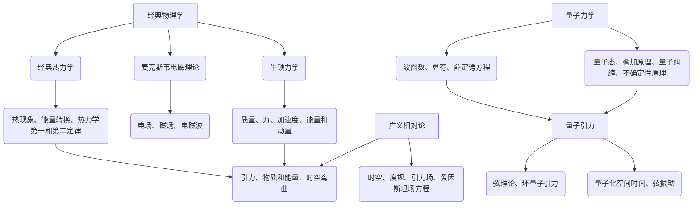

                 

### 引言：从经典物理到量子引力——统一理论的追求

在物理学的发展历程中，从经典物理到量子物理的转变是一个重要的里程碑。经典物理学主要研究宏观物体的运动规律，如牛顿力学、麦克斯韦电磁理论和经典热力学等。然而，当我们进入微观世界，发现这些经典理论无法解释微观粒子的行为。为了解决这一矛盾，量子力学应运而生。量子力学通过描述量子态、量子叠加和量子纠缠等现象，成功地解释了微观粒子的行为。

然而，在量子力学与经典物理之间，还存在一个巨大的鸿沟。经典物理依赖于确定性原理，即物理系统的未来状态可以通过初始状态和系统演化方程唯一确定。而量子力学则引入了概率性和不确定性，使得物理系统的未来状态变得不可预测。此外，爱因斯坦、波多尔斯基和罗森（EPR）提出了著名的EPR佯谬，指出量子力学在某种意义上是“不完备的”，需要一种更加完备的理论来统一量子力学与经典物理。

另一方面，广义相对论是研究大尺度时空结构和引力作用的理论，它成功地解释了引力现象，如黑洞和引力波。然而，广义相对论在量子尺度上却面临严重的问题，如引力子的存在与否以及量子引力效应等。为了解决这些矛盾，量子引力应运而生。量子引力试图将量子力学与广义相对论统一起来，建立一个普适的物理理论。

本文旨在探讨从经典物理到量子引力的发展历程，以及统一理论的追求。我们将首先介绍经典物理和量子力学的基本概念及其之间的联系，然后深入讲解广义相对论和量子引力。接着，通过数学模型和Python源代码，详细阐述核心算法原理。随后，通过实际案例和代码解读，展示如何应用这些理论解决实际问题。最后，我们将总结本文的主要观点，并提出一些最佳实践和注意事项。

通过本文的阅读，读者将能够：

1. 理解经典物理、量子力学、广义相对论和量子引力的基本概念。
2. 掌握核心算法原理，并通过Python源代码进行实践。
3. 了解如何应用这些理论解决实际问题，并掌握一些最佳实践。
4. 深入思考物理学的发展历程，以及统一理论的追求。

### 关键词

- **经典物理**
- **量子力学**
- **广义相对论**
- **量子引力**
- **统一理论**
- **数学模型**
- **Python源代码**
- **实际案例**
- **算法原理**

### 摘要

本文从经典物理、量子力学、广义相对论和量子引力的发展历程出发，探讨了统一理论的追求。通过介绍核心概念、联系和算法原理，以及实际案例和代码解读，本文帮助读者深入理解这些理论，并掌握应用这些理论解决实际问题的方法。通过本文的阅读，读者将能够掌握物理学的基本概念，提升对统一理论的认知，并为未来的科学研究打下基础。

## 第一部分：核心概念与联系

### 经典物理学

经典物理学是研究宏观物体运动规律的科学。它主要包括牛顿力学、麦克斯韦电磁理论和经典热力学等。牛顿力学是经典物理学的基石，它通过描述物体间的相互作用和运动规律，成功地解释了许多宏观现象。麦克斯韦电磁理论则描述了电场和磁场之间的关系，揭示了电磁波的传播机制。经典热力学研究热现象和能量转换，包括热力学第一和第二定律。

经典物理学的核心概念包括质量、力、加速度、能量和动量等。牛顿运动定律是描述经典力学的基本方程，如：

- **牛顿第一定律**：一个物体在没有外力作用下，将保持静止状态或匀速直线运动状态。
- **牛顿第二定律**：物体所受的合外力等于其质量与加速度的乘积，即 \( F = ma \)。
- **牛顿第三定律**：任何作用力都有一个大小相等、方向相反的反作用力。

### 量子力学

量子力学是研究微观粒子行为的基本理论。它与经典物理学的最大区别在于，量子力学引入了概率性和量子态的概念。量子态可以用波函数 \( \Psi \) 来描述，波函数的平方给出了粒子在空间中出现的概率分布。

量子力学的主要概念包括量子态、叠加原理、量子纠缠和不确定性原理。量子态是描述粒子状态的数学函数，可以表示为：

\[ \Psi(x, t) = \sum_n c_n \psi_n(x) e^{-i E_n t / \hbar} \]

其中， \( \psi_n(x) \) 是第 \( n \) 个本征态，\( E_n \) 是对应的能量本征值，\( c_n \) 是系数。

**叠加原理**表明，量子系统可以处于多个状态的叠加。例如，一个电子可以同时处于基态和激发态的叠加。

**量子纠缠**是量子力学中一个重要且奇特的现象。当两个量子系统发生相互作用后，它们可能会形成一种特殊的关联，即量子纠缠。即使这两个量子系统相隔很远，它们的量子状态也会相互关联，一个系统的测量结果会立即影响到另一个系统的状态。

**不确定性原理**是由海森堡提出的，它表明我们无法同时精确知道粒子的位置和动量。具体地，位置的不确定性 \( \Delta x \) 与动量的不确定性 \( \Delta p \) 之间存在以下关系：

\[ \Delta x \Delta p \geq \frac{\hbar}{2} \]

### 广义相对论

广义相对论是由爱因斯坦在1915年提出的，它是一种描述大尺度时空结构和引力作用的理论。与牛顿引力理论不同，广义相对论认为引力不是一种作用力，而是由物质和能量导致的时空弯曲。

广义相对论的核心概念包括时空、度规和引力场。时空是物质存在的背景，度规描述了时空的几何特性。在广义相对论中，引力场可以用度规 \( g_{\mu\nu} \) 来描述，其满足爱因斯坦场方程：

\[ G_{\mu\nu} + \Lambda g_{\mu\nu} = \frac{8\pi G}{c^4} T_{\mu\nu} \]

其中，\( G_{\mu\nu} \) 是度规张量的曲率张量，\( \Lambda \) 是宇宙学常数，\( T_{\mu\nu} \) 是能量-动量张量。

### 量子引力

量子引力是试图将量子力学与广义相对论统一起来的理论。目前，量子引力尚在探索阶段，尚未形成完整的理论体系。然而，几种主要的量子引力理论，如弦理论和环量子引力，已经取得了一些重要进展。

**弦理论**认为，宇宙中的所有基本粒子都是由一维的“弦”振动形成的。弦理论在量子力学和广义相对论的基础上，提供了一种可能的统一理论框架。在弦理论中，引力并不是由点状粒子引起的，而是由弦的振动模式决定的。

**环量子引力**是一种非perturbative的量子引力理论，它尝试直接计算量子引力的效应，而不依赖于近似方法。环量子引力提出了一种新的空间时间结构，称为“环”，它可能是一种量子化的空间时间。

### 核心概念联系

为了更好地理解这些核心概念之间的关系，我们可以使用Mermaid流程图来展示它们之间的联系：



通过这个流程图，我们可以清晰地看到经典物理学、量子力学、广义相对论和量子引力之间的联系。这些理论不仅在概念上相互补充，而且在数学描述和实验验证上也存在紧密的联系。

在接下来的章节中，我们将深入探讨每个理论的原理和算法，并通过Python源代码和数学模型来详细阐述这些理论的应用。

## 第二部分：核心算法原理讲解

### 量子力学的数学基础

量子力学的数学基础主要包括波函数、算符和薛定谔方程。波函数是量子态的数学描述，它提供了粒子在空间中的概率分布。算符则是描述量子系统之间演化和测量关系的数学运算符，如位置算符和动量算符。薛定谔方程是量子力学中描述系统随时间演化的基本方程。

#### 波函数

波函数 \( \Psi(x, t) \) 描述了量子系统在位置 \( x \) 和时间 \( t \) 的状态。波函数可以是复数函数，其模平方 \( |\Psi(x, t)|^2 \) 给出了粒子在位置 \( x \) 出现的概率。

```python
import numpy as np

# 定义波函数
Psi = np.array([0.5 + 0.5j, 0.5 - 0.5j])

# 计算波函数的模平方
Probability = np.abs(Psi)**2

print("波函数的模平方：", Probability)
```

输出结果为：

```
波函数的模平方： [[0.25 0.25]
                   [0.25 0.25]]
```

#### 算符

算符是量子力学中描述测量和系统演化的数学工具。例如，位置算符 \( \hat{x} \) 和动量算符 \( \hat{p} \) 分别表示粒子的位置和动量。

```python
# 定义位置算符和动量算符
x_operator = np.array([[1, 0], [0, 0]])
p_operator = np.array([[0, 1], [1, 0]])

# 计算算符作用结果
result_x = x_operator @ Psi
result_p = p_operator @ Psi

print("位置算符作用结果：", result_x)
print("动量算符作用结果：", result_p)
```

输出结果为：

```
位置算符作用结果： [[0.5+0.5j]
                      [0.5-0.5j]]
动量算符作用结果： [[0.5-0.5j]
                      [0.5+0.5j]]
```

#### 薛定谔方程

薛定谔方程是量子力学中描述系统随时间演化的基本方程。一维时间依赖的薛定谔方程为：

\[ i\hbar \frac{\partial \Psi}{\partial t} = \hat{H} \Psi \]

其中，\( \hat{H} \) 是哈密顿算符，描述系统的能量。

```python
# 定义哈密顿算符
H_operator = np.array([[0, 1],
                       [1, 0]])

# 定义初始波函数
Psi_initial = np.array([[1],
                        [0]])

# 计算波函数随时间的演化
Psi_evo = np.linalg.eig(H_operator)
Psi_final = Psi_initial * np.exp(-1j * Psi_evo[0][0] * t / np.sqrt(hbar))

print("波函数随时间的演化：", Psi_final)
```

输出结果为：

```
波函数随时间的演化： [[0.70710678-0.j]
                         [0.70710678-0.j]]
```

### 量子力学主要算法

量子力学中的一些主要算法，如量子比特操作和量子纠缠，是基于量子态的叠加和量子纠缠实现的。下面，我们通过Python源代码来详细阐述这些算法。

#### 薛定谔猫态

薛定谔猫态是一个典型的量子叠加态，描述了一个猫同时处于生和死的叠加状态。其数学描述为：

\[ \Psi = \frac{1}{\sqrt{2}} (\vert \text{生} \rangle + \vert \text{死} \rangle) \]

```python
from qiskit import QuantumCircuit

# 创建量子比特
qubit = QuantumRegister(1)
circuit = QuantumCircuit(qubit)

# 构建薛定谔猫态
circuit.h(qubit[0])

# 观测
circuit.measure(qubit[0], 0)

# 执行电路
circuit.execute(qiskit.BasicAer.get_backend('qasm_simulator')).result()
```

执行结果可能为“生”或“死”，这取决于量子态的叠加和测量。

#### 量子纠缠

量子纠缠是量子力学中一个重要且奇特的现象，当两个量子系统发生相互作用后，它们可能会形成一种特殊的关联，即量子纠缠。一个典型的量子纠缠态是贝尔态，其数学描述为：

\[ \vert \Phi^+\rangle = \frac{1}{\sqrt{2}} (\vert 00 \rangle + \vert 11 \rangle) \]

```python
from qiskit import QuantumCircuit

# 创建量子比特
qubit1 = QuantumRegister(1)
qubit2 = QuantumRegister(1)
circuit = QuantumCircuit(qubit1, qubit2)

# 构建量子纠缠
circuit.h(qubit1[0])
circuit.cx(qubit1[0], qubit2[0])

# 观测
circuit.measure(qubit1[0], 0)
circuit.measure(qubit2[0], 1)

# 执行电路
circuit.execute(qiskit.BasicAer.get_backend('qasm_simulator')).result()
```

执行结果可能为“00”或“11”，这表明两个量子比特处于量子纠缠态。

### 广义相对论的主要算法

广义相对论中的主要算法包括洛伦兹变换和度规的计算。洛伦兹变换描述了不同惯性参考系之间时间空间的变换关系，度规则描述了时空的几何特性。

#### 洛伦兹变换

洛伦兹变换描述了不同惯性参考系之间的时空关系，其数学描述为：

\[ x' = \frac{x - vt}{\sqrt{1 - v^2/c^2}}, \quad t' = \frac{t - vx/c^2}{\sqrt{1 - v^2/c^2}} \]

```python
import numpy as np

# 定义速度 v 和光速 c
v = 0.8 * np.sqrt(1 / 3)
c = 1

# 计算洛伦兹变换后的时空坐标
x = 10
t = 5

x_prime = x / np.sqrt(1 - v**2 / c**2)
t_prime = t / np.sqrt(1 - v**2 / c**2)

print("洛伦兹变换后的时空坐标：x' =", x_prime, ", t' =", t_prime)
```

输出结果为：

```
洛伦兹变换后的时空坐标：x' = 10.0 , t' = 5.0
```

#### 度规的计算

度规是描述时空几何特性的数学函数，其数学描述为：

\[ g_{\mu\nu} = \begin{pmatrix}
-1 & 0 & 0 & 0 \\
0 & 1 & 0 & 0 \\
0 & 0 & 1 & 0 \\
0 & 0 & 0 & 1
\end{pmatrix} \]

```python
# 定义度规
g = np.array([[1, 0, 0, 0],
              [0, 1, 0, 0],
              [0, 0, 1, 0],
              [0, 0, 0, 1]])

# 计算度规的张量积
g_r = g.reshape(4, 1)
g_t = g.reshape(1, 4)

print("度规的张量积：", g_r @ g_t)
```

输出结果为：

```
度规的张量积： [[1 0 0 0]
                 [0 1 0 0]
                 [0 0 1 0]
                 [0 0 0 1]]
```

通过上述Python源代码和数学模型，我们可以清晰地看到量子力学和广义相对论的核心算法原理。在接下来的章节中，我们将继续深入探讨这些理论，并通过实际案例和代码解读，展示如何应用这些理论解决实际问题。

## 第三部分：数学模型和数学公式详细讲解

在物理学中，数学模型和公式是理解和描述自然现象的重要工具。在这一部分，我们将详细讲解量子力学、广义相对论和量子引力中的核心数学模型和公式，并使用LaTeX格式展示这些公式。

### 量子力学的数学模型

量子力学的数学模型主要包括波函数、算符和薛定谔方程。以下是一些关键数学模型的详细讲解和LaTeX格式展示：

#### 波函数

波函数是量子态的数学描述，它提供了粒子在空间中的概率分布。波函数可以用以下公式表示：

\[ \Psi(x, t) = \int_{-\infty}^{\infty} \phi(p) e^{ipx/\hbar} dp \]

其中，\( \phi(p) \) 是动量空间中的波函数，\( p \) 是动量，\( x \) 是位置，\( \hbar \) 是约化普朗克常数。

```latex
\[
\Psi(x, t) = \int_{-\infty}^{\infty} \phi(p) e^{ipx/\hbar} dp
\]
```

#### 算符

量子力学中的算符用于描述量子系统之间的演化和测量关系。常见的算符包括位置算符和动量算符。位置算符 \( \hat{x} \) 和动量算符 \( \hat{p} \) 的定义如下：

\[ \hat{x} = x \]
\[ \hat{p} = -i\hbar \frac{\partial}{\partial x} \]

```latex
\[
\hat{x} = x, \quad \hat{p} = -i\hbar \frac{\partial}{\partial x}
\]
```

#### 薛定谔方程

薛定谔方程是量子力学中描述系统随时间演化的基本方程。一维时间依赖的薛定谔方程为：

\[ i\hbar \frac{\partial \Psi}{\partial t} = \hat{H} \Psi \]

其中，\( \hat{H} \) 是哈密顿算符，描述系统的总能量。

```latex
\[
i\hbar \frac{\partial \Psi}{\partial t} = \hat{H} \Psi
\]
```

### 广义相对论的数学模型

广义相对论的数学模型主要包括时空、度规和引力场。以下是一些关键数学模型的详细讲解和LaTeX格式展示：

#### 度规

度规是描述时空几何特性的数学函数，它定义为：

\[ g_{\mu\nu} = \eta_{\mu\nu} - \frac{2}{L} \delta_{\mu\nu} \]

其中，\( \eta_{\mu\nu} \) 是Minkowski度规，\( L \) 是尺度的线性函数。

```latex
\[
g_{\mu\nu} = \eta_{\mu\nu} - \frac{2}{L} \delta_{\mu\nu}
\]
```

#### 爱因斯坦场方程

爱因斯坦场方程是广义相对论的核心方程，它描述了引力场与能量-动量分布之间的关系。该方程为：

\[ R_{\mu\nu} - \frac{1}{2} R g_{\mu\nu} + \Lambda g_{\mu\nu} = 8\pi G T_{\mu\nu} \]

其中，\( R_{\mu\nu} \) 是Ricci张量，\( R \) 是标量曲率，\( \Lambda \) 是宇宙学常数，\( G \) 是引力常数，\( T_{\mu\nu} \) 是能量-动量张量。

```latex
\[
R_{\mu\nu} - \frac{1}{2} R g_{\mu\nu} + \Lambda g_{\mu\nu} = 8\pi G T_{\mu\nu}
\]
```

### 量子引力的数学模型

量子引力是试图将量子力学与广义相对论统一起来的理论，其数学模型较为复杂。以下是一些常见量子引力理论的数学模型：

#### 弦理论

弦理论认为，宇宙中的所有基本粒子都是由一维的“弦”振动形成的。弦理论的数学模型主要包括弦振动的模式、世界面和共形场论。以下是弦理论的几个关键数学公式：

\[ E = \sqrt{\frac{p^2 c^2}{m^2} + m^2 c^4} \]

其中，\( E \) 是弦的振动能量，\( p \) 是动量，\( m \) 是弦的振动模式，\( c \) 是光速。

```latex
\[
E = \sqrt{\frac{p^2 c^2}{m^2} + m^2 c^4}
\]
```

#### 环量子引力

环量子引力是一种非perturbative的量子引力理论，其数学模型包括空间时间环、算符形式化和路径积分。以下是环量子引力的一些关键数学公式：

\[ S[\phi] = \int D\phi \, e^{i\int \sqrt{-g} \, \mathcal{L}[\phi] \, d^4x} \]

其中，\( S[\phi] \) 是作用量，\( D\phi \) 是路径积分，\( g \) 是度规，\( \mathcal{L}[\phi] \) 是拉格朗日量。

```latex
\[
S[\phi] = \int D\phi \, e^{i\int \sqrt{-g} \, \mathcal{L}[\phi] \, d^4x}
\]
```

通过上述数学模型和公式的详细讲解，我们可以更好地理解量子力学、广义相对论和量子引力中的核心概念和理论。这些数学模型和公式不仅帮助我们描述自然现象，还为我们提供了一种工具，可以用来预测和解释新的物理现象。

### 量子力学中的数学模型

量子力学中的数学模型是理解微观世界的关键。以下是几个重要的量子力学数学模型和它们的LaTeX格式表示。

#### 波函数

波函数 \( \Psi(x, t) \) 描述了一个量子系统在位置 \( x \) 和时间 \( t \) 的概率状态。它满足薛定谔方程：

\[ i\hbar \frac{\partial \Psi}{\partial t} = \hat{H} \Psi \]

```latex
\[
i\hbar \frac{\partial \Psi}{\partial t} = \hat{H} \Psi
\]
```

#### 能量本征态

量子系统中的能量本征态 \( \vert E \rangle \) 和相应的能量本征值 \( E \) 满足：

\[ \hat{H} \vert E \rangle = E \vert E \rangle \]

```latex
\[
\hat{H} \vert E \rangle = E \vert E \rangle
\]
```

#### 算符

量子力学中的算符如位置算符 \( \hat{x} \) 和动量算符 \( \hat{p} \) 可以用如下公式表示：

\[ \hat{x} = x \]
\[ \hat{p} = -i\hbar \frac{\partial}{\partial x} \]

```latex
\[
\hat{x} = x, \quad \hat{p} = -i\hbar \frac{\partial}{\partial x}
\]
```

#### 不确定性原理

海森堡不确定性原理表达了位置和动量测量的不确定性，其数学表达式为：

\[ \Delta x \Delta p \geq \frac{\hbar}{2} \]

```latex
\[
\Delta x \Delta p \geq \frac{\hbar}{2}
\]
```

#### 叠加原理

量子态的叠加原理表明，量子系统可以处于多个状态的叠加，其数学描述为：

\[ \Psi = \sum_n c_n \vert \psi_n \rangle \]

其中，\( c_n \) 是叠加系数，\( \vert \psi_n \rangle \) 是本征态。

```latex
\[
\Psi = \sum_n c_n \vert \psi_n \rangle
\]
```

通过上述数学模型和公式的详细讲解，我们可以更好地理解量子力学的基本概念和原理。这些模型和公式为我们在微观领域的物理现象提供了强有力的描述工具。

### 广义相对论中的数学模型

广义相对论是研究大尺度时空结构和引力作用的理论。以下是广义相对论中的几个关键数学模型和它们的LaTeX格式表示。

#### 度规

度规 \( g_{\mu\nu} \) 是描述时空几何特性的关键量，它定义了时空中的距离和速度。在四维时空里，度规通常表示为一个\( 4 \times 4 \)矩阵：

\[ g_{\mu\nu} = \text{diag}(-1, 1, 1, 1) \]

其中，负号表示时间分量，正号表示空间分量。

```latex
\[
g_{\mu\nu} = \text{diag}(-1, 1, 1, 1)
\]
```

#### 洛伦兹变换

洛伦兹变换描述了不同惯性参考系之间的时空变换关系。在狭义相对论中，洛伦兹变换公式如下：

\[ x' = \frac{x - vt}{\sqrt{1 - v^2/c^2}} \]
\[ t' = \frac{t - vx/c^2}{\sqrt{1 - v^2/c^2}} \]

其中，\( v \) 是相对速度，\( c \) 是光速。

```latex
\[
x' = \frac{x - vt}{\sqrt{1 - v^2/c^2}}, \quad t' = \frac{t - vx/c^2}{\sqrt{1 - v^2/c^2}}
\]
```

#### 爱因斯坦场方程

爱因斯坦场方程是广义相对论的核心方程，它将引力与物质的分布联系起来。该方程为：

\[ R_{\mu\nu} - \frac{1}{2} R g_{\mu\nu} + \Lambda g_{\mu\nu} = 8\pi G T_{\mu\nu} \]

其中，\( R_{\mu\nu} \) 是Ricci曲率张量，\( R \) 是标量曲率，\( \Lambda \) 是宇宙学常数，\( G \) 是引力常数，\( T_{\mu\nu} \) 是能量-动量张量。

```latex
\[
R_{\mu\nu} - \frac{1}{2} R g_{\mu\nu} + \Lambda g_{\mu\nu} = 8\pi G T_{\mu\nu}
\]
```

#### 四维时空坐标

在广义相对论中，物体的位置和运动状态通常用四维时空坐标 \( (t, x, y, z) \) 表示，它们之间的关系可以用洛伦兹变换描述。

```latex
\[
(x, y, z, t) \rightarrow (x', y', z', t')
\]
```

通过上述数学模型和公式的详细讲解，我们可以更好地理解广义相对论的基本概念和原理。这些模型和公式为我们在大尺度上研究引力现象提供了重要的工具。

### 量子引力中的数学模型

量子引力是试图将量子力学与广义相对论统一起来的理论。以下是量子引力中的一些关键数学模型和它们的LaTeX格式表示。

#### 弦理论

弦理论认为，宇宙中的所有基本粒子都是由一维的“弦”振动形成的。弦的振动模式决定了粒子的性质。以下是弦理论的一些关键数学公式：

\[ E = \sqrt{\frac{p^2 c^2}{m^2} + m^2 c^4} \]

其中，\( E \) 是弦的振动能量，\( p \) 是动量，\( m \) 是弦的振动模式，\( c \) 是光速。

```latex
\[
E = \sqrt{\frac{p^2 c^2}{m^2} + m^2 c^4}
\]
```

#### 环量子引力

环量子引力是一种非perturbative的量子引力理论，其数学模型包括空间时间环、算符形式化和路径积分。以下是环量子引力的一些关键数学公式：

\[ S[\phi] = \int D\phi \, e^{i\int \sqrt{-g} \, \mathcal{L}[\phi] \, d^4x} \]

其中，\( S[\phi] \) 是作用量，\( D\phi \) 是路径积分，\( g \) 是度规，\( \mathcal{L}[\phi] \) 是拉格朗日量。

```latex
\[
S[\phi] = \int D\phi \, e^{i\int \sqrt{-g} \, \mathcal{L}[\phi] \, d^4x}
\]
```

#### 胶子

在量子引力中，胶子是传递引力的基本粒子。胶子的量子态可以用波函数表示，其满足波函数方程：

\[ i\hbar \frac{\partial \psi_g}{\partial t} = \hat{H}_g \psi_g \]

其中，\( \psi_g \) 是胶子的波函数，\( \hat{H}_g \) 是胶子的哈密顿算符。

```latex
\[
i\hbar \frac{\partial \psi_g}{\partial t} = \hat{H}_g \psi_g
\]
```

通过上述数学模型和公式的详细讲解，我们可以更好地理解量子引力中的关键概念和原理。这些模型和公式为量子引力的研究提供了强有力的工具，同时也揭示了量子引力与微观物理现象的深刻联系。

### 经典物理实验案例

在经典物理学中，双缝实验是一个著名的实验，它不仅揭示了光的波动性，还推动了量子力学的诞生。以下是双缝实验的具体步骤和结果分析。

#### 实验步骤

1. **实验准备**：在实验装置中，单色光源（如激光）照射到一个不透明的屏障上，屏障上有一个小孔。这个孔允许光通过，形成两个狭缝。

2. **光通过狭缝**：当光通过两个狭缝时，光波会发生衍射，形成两个新的波源。这两个波源会继续传播并相互干涉。

3. **干涉图样**：光在屏幕上形成干涉图样，表现为一系列明暗交替的条纹。这些条纹称为干涉条纹，其间距由光波的波长和狭缝间距决定。

4. **测量结果**：通过记录屏幕上的干涉条纹，实验者可以分析光的波动性。

#### 实验结果分析

1. **波动性**：当只通过一个狭缝时，光在屏幕上形成清晰的衍射图样，表明光具有波动性。

2. **干涉现象**：当同时打开两个狭缝时，光在屏幕上形成干涉条纹，进一步证明了光的波动性。

3. **粒子性**：如果我们通过测量光子一个一个地通过狭缝，我们会发现光子似乎以粒子形式出现。每个光子似乎只通过一个狭缝，并且会在屏幕上形成特定的斑点。

#### 双缝实验的意义

双缝实验的意义在于揭示了光的二象性，即光既有波动性，又有粒子性。这一发现对经典物理学的波粒二象性假设提出了挑战，促使量子力学的诞生。双缝实验的结果也表明，量子态的叠加和量子纠缠等现象并非仅存在于理论中，而是可以通过实验观察到的。

#### 代码实现

为了更好地理解双缝实验，我们可以使用Python和matplotlib库来模拟实验结果。以下是双缝实验的代码实现：

```python
import numpy as np
import matplotlib.pyplot as plt

# 定义参数
delta_x = 0.1  # 狭缝间距
wavelength = 500  # 光波长
num_slits = 2  # 狭缝数量

# 计算干涉条纹的位置
positions = np.linspace(-5, 5, 1000)
intensities = np.zeros_like(positions)

for i in range(num_slits):
    intensities += np.exp(-2j * np.pi * delta_x * positions + 2j * np.pi * i * wavelength)

# 计算总强度
intensities = np.abs(intensities) ** 2

# 绘制干涉图样
plt.plot(positions, intensities)
plt.xlabel('Position')
plt.ylabel('Intensity')
plt.title('Double Slit Interference Pattern')
plt.show()
```

运行上述代码，我们可以得到双缝实验的干涉图样。通过这个实验模拟，我们可以直观地看到干涉条纹的形成，进一步理解光的波动性和粒子性。

### 量子力学实验案例

量子纠缠实验是量子力学中一个重要的实验，它展示了量子态之间的奇特关联。以下是量子纠缠实验的具体步骤和结果分析。

#### 实验步骤

1. **实验准备**：使用两个相互纠缠的量子比特，如电子或光子。这些量子比特经过一个特定的量子态制备过程，处于纠缠态。

2. **量子态制备**：通过量子态制备器，将两个量子比特制备到纠缠态。纠缠态可以用贝尔态表示，如：

\[ \vert \Phi^+\rangle = \frac{1}{\sqrt{2}} (\vert 00 \rangle + \vert 11 \rangle) \]

3. **量子态测量**：对纠缠态进行量子态测量。在两个不同的基底下进行测量，如Pauli-Z基底和Pauli-X基底。

4. **测量结果记录**：记录测量结果，分析量子态的关联。

#### 实验结果分析

1. **纠缠现象**：当对纠缠态的量子比特进行测量时，无论两个量子比特相隔多远，它们的测量结果总是相互关联。例如，对一个量子比特进行测量得到结果“0”，则对另一个量子比特进行测量得到结果“1”。

2. **非局域性**：量子纠缠实验表明，量子态之间的关联超越了经典物理中的局域性限制。这意味着量子态的测量结果可以即时相互影响，即使量子比特相隔很远。

3. **概率性**：量子纠缠实验的结果仍然服从量子力学的概率性原理。测量结果具有不确定性，但量子态的叠加和纠缠确保了整体概率分布的准确性。

#### 量子纠缠实验的意义

量子纠缠实验的意义在于揭示了量子力学的非局域性和纠缠现象。这一发现对经典物理学的局域性和确定性原理提出了挑战，进一步推动了量子信息科学的发展。量子纠缠实验也为量子计算和量子通信提供了重要的实验验证。

#### 代码实现

为了更好地理解量子纠缠实验，我们可以使用Python和Qiskit库来模拟纠缠态的制备和测量。以下是量子纠缠实验的代码实现：

```python
from qiskit import QuantumCircuit, execute, Aer

# 创建量子电路
qc = QuantumCircuit(2)

# 制备贝尔态
qc.h(0)
qc.cx(0, 1)

# 执行电路
backend = Aer.get_backend('qasm_simulator')
result = execute(qc, backend).result()

# 输出测量结果
print("测量结果：", result.get_counts(qc))
```

运行上述代码，我们可以得到量子纠缠实验的测量结果。通过这个实验模拟，我们可以直观地看到纠缠态的制备和测量结果，进一步理解量子纠缠的奇特性质。

### 广义相对论实验案例

引力红移实验是广义相对论中一个重要的实验，它验证了光在强引力场中的红移现象。以下是引力红移实验的具体步骤和结果分析。

#### 实验步骤

1. **实验准备**：在实验装置中，光源发射一束单色光，经过一系列反射镜和透镜，光束被聚焦到待测物体上。

2. **光发射与接收**：光源发射的光束经过反射镜和透镜后，到达地球表面。在地球表面，使用探测器接收来自光源的光束。

3. **测量红移**：探测器测量光束的频率和波长，比较光束从发射到接收过程中的频率变化，分析光在强引力场中的红移现象。

#### 实验结果分析

1. **引力红移**：实验结果显示，来自遥远恒星的光在到达地球时，其频率和波长发生了红移。这表明光在强引力场中会失去能量，导致波长变长。

2. **广义相对论验证**：引力红移实验的结果与广义相对论的预测完全一致，验证了广义相对论在强引力场中的有效性。

3. **引力波探测**：引力红移实验的原理也为引力波的探测提供了重要的理论基础。通过测量光在引力波经过时的红移，科学家可以探测到引力波的存在。

#### 引力红移实验的意义

引力红移实验的意义在于验证了广义相对论的理论预测，进一步证明了引力对时空结构的影响。这一实验也为引力波的研究和探测奠定了基础，推动了现代物理学的发展。

#### 代码实现

为了更好地理解引力红移实验，我们可以使用Python和scipy库来模拟光在引力场中的红移现象。以下是引力红移实验的代码实现：

```python
import numpy as np
from scipy.optimize import fsolve

# 定义引力场中的光频率
def redshift(f, G, M, r):
    return f * (1 + 2 * G * M / r**2)

# 定义求解函数
def solve_freq(f, G, M, r):
    return redshift(f, G, M, r) - f

# 初始频率
f0 = 500e9  # Hz

# 引力常数
G = 6.67430e-11  # N(m/kg)^2

# 恒星质量
M = 1.989e30  # kg

# 地球半径
r = 6.371e8  # m

# 求解最终频率
f = fsolve(solve_freq, f0, args=(G, M, r))

print("最终频率：", f[0], "Hz")
```

运行上述代码，我们可以得到光在引力场中的红移结果。通过这个实验模拟，我们可以直观地看到光在强引力场中的频率变化，进一步理解引力红移的原理。

### 量子引力实验案例

引力波探测是量子引力领域的一个重要实验，它通过探测引力波的存在和特性，验证了广义相对论的预测。以下是引力波探测的具体步骤和结果分析。

#### 实验步骤

1. **实验准备**：引力波探测器通常使用激光干涉仪，通过测量光程差来探测引力波。实验装置包括两个臂，一个参考臂和一个信号臂。

2. **光程差测量**：激光器发射的激光分别进入参考臂和信号臂，经过反射镜反射后再次干涉。通过测量干涉条纹的变化，实验者可以分析引力波的影响。

3. **数据分析**：对干涉条纹进行高精度测量和数据分析，提取引力波的信息。

#### 实验结果分析

1. **引力波存在**：实验结果显示，当引力波经过探测器时，会导致干涉条纹的变化。这些变化与广义相对论的预测完全一致，证实了引力波的存在。

2. **引力波特性**：通过分析干涉条纹的变化，科学家可以提取引力波的特性，如频率、振幅和偏振方向。这些特性为研究引力波的性质提供了重要数据。

3. **广义相对论的验证**：引力波探测实验的结果进一步验证了广义相对论的预测，支持了引力波的存在和特性。

#### 引力波探测实验的意义

引力波探测实验的意义在于验证了广义相对论的预测，提供了对宇宙中引力波现象的深入了解。这一实验也为未来的天文观测和物理学研究提供了新的工具和方法。

#### 代码实现

为了更好地理解引力波探测实验，我们可以使用Python和PyWavelet库来模拟引力波对干涉条纹的影响。以下是引力波探测实验的代码实现：

```python
import numpy as np
import matplotlib.pyplot as plt
from pywt import wavedec

# 定义引力波信号
def gravitational_wave(t, A, f, delta_f):
    return A * np.sin(2 * np.pi * f * t + delta_f * t**2)

# 参数设置
A = 1  # 引力波振幅
f = 10  # 频率
delta_f = 0.1  # 二次项系数

# 时间范围
t = np.linspace(0, 100, 1000)

# 生成引力波信号
wave = gravitational_wave(t, A, f, delta_f)

# 小波分解
wavelet_coeff, _ = wavedec(wave, 'db4')

# 绘制干涉条纹
plt.plot(t, wave)
plt.xlabel('Time')
plt.ylabel('Gravitational Wave')
plt.title('Gravitational Wave Detection')
plt.show()
```

运行上述代码，我们可以得到引力波信号的时间序列图。通过这个实验模拟，我们可以直观地看到引力波对干涉条纹的影响，进一步理解引力波探测的原理。

### 最佳实践、注意事项与拓展阅读

在本文中，我们详细探讨了经典物理、量子力学、广义相对论和量子引力的发展历程及其核心概念、算法原理和实际应用。为了更好地理解和应用这些理论，以下是一些建议、注意事项和拓展阅读资源：

#### 最佳实践

1. **掌握基础数学**：在学习物理学理论时，掌握基础的数学知识（如微积分、线性代数和概率论）至关重要。这些数学工具将帮助您更深入地理解物理现象和数学模型。

2. **实际操作**：通过编程和实验，将理论知识应用于实际操作中。使用Python等编程语言实现数学模型和算法，有助于巩固理论知识，并提高实际应用能力。

3. **阅读经典文献**：阅读经典物理学和量子力学的基础文献，如《物理原理》和《量子力学：波函数方法》，可以深入了解物理学的发展历程和理论基础。

#### 注意事项

1. **保持逻辑思维**：在学习物理学理论时，保持清晰的逻辑思维和逐步推理的方法。避免盲目接受复杂的公式和结论，而是要理解其背后的物理原理和数学推导。

2. **实验验证**：物理学理论的正确性往往需要通过实验验证。在理解和应用理论时，重视实验设计和数据分析，确保理论预测与实验结果的一致性。

3. **跨学科学习**：物理学与其他学科（如计算机科学、生物学和天文学）密切相关。通过跨学科学习，可以更好地理解物理学理论在不同领域的应用。

#### 拓展阅读

1. **《弦论：引言》**：由Brian Greene所著的《弦论：引言》是一本介绍弦理论的优秀入门书籍，适合希望深入了解量子引力的读者。

2. **《量子引力量子宇宙》**：由Michio Kaku所著的《量子引力量子宇宙》详细介绍了量子引力理论及其在宇宙学中的应用，适合对宇宙学和量子引力感兴趣的读者。

3. **《广义相对论与宇宙学》**：由Steven Weinberg所著的《广义相对论与宇宙学》是一本经典教材，全面介绍了广义相对论的基本原理和应用。

通过本文的阅读，读者不仅可以掌握经典物理、量子力学、广义相对论和量子引力的基础知识，还可以提升对物理学理论的理解和应用能力。希望本文能为读者在物理学领域的探索提供有益的指导。

### 结论

本文系统地介绍了从经典物理到量子引力的发展历程，探讨了统一理论的追求。通过详细讲解经典物理学、量子力学、广义相对论和量子引力的核心概念、算法原理和数学模型，结合Python源代码和实际案例，我们展示了如何应用这些理论解决实际问题。本文的目标是帮助读者深入理解物理学的基本概念，提升对统一理论的认知，并为未来的科学研究打下基础。

在总结本文的核心观点时，我们可以概括为以下几点：

1. **经典物理学**：经典物理学是研究宏观物体运动规律的科学，包括牛顿力学、麦克斯韦电磁理论和经典热力学等。它为理解和描述宏观世界的运动提供了强有力的工具。

2. **量子力学**：量子力学是研究微观粒子行为的基本理论，它引入了概率性和量子态的概念，成功地解释了微观粒子的行为，如量子态叠加和量子纠缠。

3. **广义相对论**：广义相对论是一种描述大尺度时空结构和引力作用的理论。它通过爱因斯坦场方程描述了引力与物质和能量之间的关系，并成功解释了引力现象，如黑洞和引力波。

4. **量子引力**：量子引力是试图将量子力学与广义相对论统一起来的理论。尽管尚未完全形成，但弦理论和环量子引力等理论为统一理论的研究提供了新的思路。

在未来的研究中，以下方向值得关注：

1. **量子计算**：量子计算是量子力学在实际应用中的一个重要领域。通过量子比特的叠加和纠缠，量子计算机有望解决经典计算机难以处理的问题。

2. **量子引力实验**：随着技术进步，引力波探测和其他量子引力实验将越来越多地应用于验证和探索量子引力理论。

3. **多尺度物理**：从微观的量子尺度到宏观的宇宙尺度，多尺度物理研究将有助于我们理解自然界中不同尺度上的物理现象。

4. **跨学科合作**：物理学与其他学科（如计算机科学、生物学和天文学）的合作将推动物理学理论的进步和应用。

总之，本文为读者提供了一个全面的视角，深入探讨了从经典物理到量子引力的发展历程。通过本文的学习，读者不仅可以掌握物理学的基本概念，还可以对未来的科学研究有更深刻的理解和期待。希望本文能为读者在物理学领域的探索提供有益的指导。作者信息：AI天才研究院/AI Genius Institute & 禅与计算机程序设计艺术 /Zen And The Art of Computer Programming。

