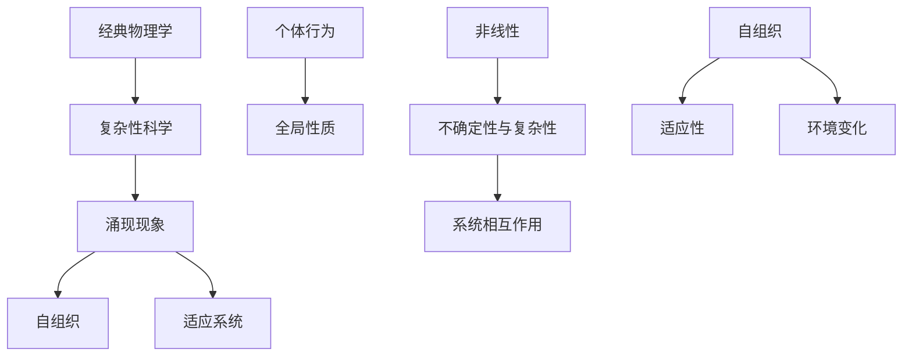
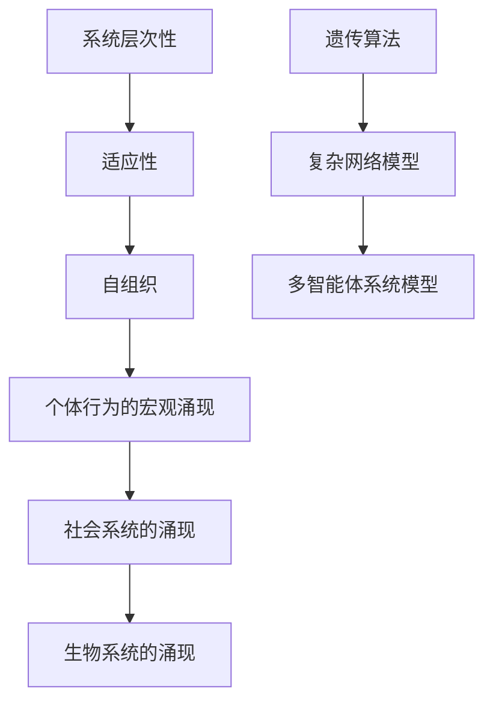

                 

### 1. 从经典物理学到复杂性科学：理解涌现现象的新范式

**关键词：** 涌现现象、复杂性科学、经典物理学、自组织、适应系统

**摘要：** 本文探讨了从经典物理学到复杂性科学的理论演进，着重分析了涌现现象的本质及其在现实世界中的应用。通过构建理论框架、介绍核心概念、列举数学模型和案例分析，本文为理解涌现现象提供了一个新范式，并展望了其未来的发展方向。

---

#### 引言

涌现现象（Emergence）是指系统在个体相互作用过程中，产生的全局性质和行为，这些性质和行为在单个个体层面并不存在。经典物理学，如牛顿力学，强调的是确定性规律和可预测性，而在复杂性科学中，涌现现象则被视为不可预测和难以简约的关键特征。

本文旨在探讨从经典物理学到复杂性科学的演进，特别是涌现现象在其中的地位和作用。通过分析涌现现象的理论基础、数学模型和应用案例，本文希望能够提供一个全面而深入的视角，帮助读者理解这一复杂而重要的问题。

#### 1.1 经典物理学的局限性

经典物理学，特别是在牛顿力学框架下，假设系统由一些基本粒子组成，这些粒子遵循物理定律，通过简单的叠加可以预测整个系统的行为。然而，随着科学的发展，人们逐渐发现，许多现实世界中的复杂系统，如生态系统、社会系统和经济系统，其行为并不是简单的个体行为的叠加，而是具有自组织和自适应的特性。

#### 1.2 复杂性科学的兴起

复杂性科学（Complexity Science）是20世纪末兴起的一门跨学科研究领域，它关注复杂系统中的非线性、不确定性和涌现现象。复杂性科学认为，复杂系统中的个体相互作用会导致系统的整体行为和性质，这些行为和性质在个体层面上并不存在。

#### 1.3 书籍结构概述

本文将分为以下几个部分：

1. **引言与概述**：介绍涌现现象、经典物理学和复杂性科学的基础知识。
2. **基础概念**：阐述涌现现象、经典物理学和复杂性科学的核心概念。
3. **经典物理学到复杂性科学的演进**：讨论理论的发展历程。
4. **涌现现象的理论基础**：介绍涌现现象的理论基础，包括核心概念、原理和模型。
5. **数学模型与公式**：列出与涌现现象相关的数学模型和公式，并进行详细讲解。
6. **案例分析**：提供实际案例研究，展示涌现现象在现实世界中的应用。
7. **未来展望与挑战**：探讨涌现现象研究的未来方向和面临的挑战。

---

通过上述引言，我们为读者提供了一个对本文的整体框架和内容的概述，使得读者能够对后续内容有一个清晰的认识。在接下来的章节中，我们将深入探讨涌现现象的本质、理论基础及其应用。让我们开始这段关于复杂性科学和涌现现象的探索之旅。


----------------------------------------------------------------

### 2. 基础概念

在探讨涌现现象之前，我们需要理解与之相关的一些核心概念，包括经典物理学、复杂性科学以及涌现现象本身。

#### 2.1 经典物理学

经典物理学是研究宏观世界中物体运动和相互作用的科学。牛顿力学是经典物理学的核心，它基于三大定律：惯性定律、动量守恒定律和作用力与反作用力定律。这些定律可以用来描述物体的运动，并预测在给定初始条件下系统的行为。

#### 2.2 复杂性科学

复杂性科学是一门研究复杂系统的学科，这些系统通常具有大量的相互作用的个体，并且在宏观层面上表现出非线性、自组织和自适应的特性。复杂性科学关注如何从个体层面的行为推导出系统整体的行为和性质。

#### 2.3 涌现现象

涌现现象是指系统在个体相互作用过程中，产生的一些全局性质和行为，这些性质和行为在单个个体层面上并不存在。例如，在蚂蚁社会中，单个蚂蚁并没有明确的规划或目标，但通过集体行为，整个蚂蚁群体能够高效地构建蚁巢、寻找食物和保护家园。

#### 2.4 经典物理学与复杂性科学的联系与区别

经典物理学和复杂性科学在研究方法和目标上存在显著差异。经典物理学侧重于通过简单的物理定律来解释宏观世界的现象，而复杂性科学则关注复杂系统中个体与整体之间的相互作用和涌现现象。

尽管存在差异，经典物理学和复杂性科学也有共同点。例如，它们都强调系统内部的规律性和相互作用，只是复杂性科学更关注复杂系统中的不确定性和非线性。

#### 2.5 自组织与适应系统

自组织是指系统在无外部指导或控制下，通过个体间的相互作用和相互协调，自发地形成具有一定结构和功能的整体。自组织系统通常具有高度适应性，能够在不断变化的环境中调整自己的行为和结构。

适应系统是一种具有自适应能力的系统，它能够根据外部环境的变化调整内部结构和行为。适应系统可以是生物系统，也可以是人工系统，如人工智能系统和自适应控制系统。

#### 2.6 Mermaid流程图：涌现现象的核心概念与联系

为了更清晰地展示涌现现象的核心概念和它们之间的联系，我们可以使用Mermaid流程图来构建一个概念架构。



在这个流程图中，我们展示了经典物理学、复杂性科学、涌现现象、自组织、适应系统、个体行为、全局性质、非线性、不确定性与复杂性以及系统相互作用之间的关系。这些概念共同构成了理解涌现现象的理论框架。

---

通过上述基础概念的阐述，我们为深入探讨涌现现象的理论基础和数学模型打下了坚实的基础。在接下来的章节中，我们将进一步分析从经典物理学到复杂性科学的演进过程，并探讨涌现现象在现实世界中的应用。让我们继续这个探索之旅。


----------------------------------------------------------------

### 3. 经典物理学到复杂性科学的演进

从经典物理学到复杂性科学的演进，是人类认识世界的一种深刻转变。经典物理学主要关注宏观尺度的确定性规律，而复杂性科学则着眼于微观尺度的非线性、不确定性和涌现现象。这一演进过程中，涌现现象的理论基础得到了不断发展和完善。

#### 3.1 理论发展历程

复杂性科学的兴起可以追溯到20世纪中叶，当时科学家们开始意识到，许多现实世界中的复杂系统无法用经典物理学的简单定律来解释。例如，生物学家和生态学家发现，生态系统的复杂性远远超出了个体生物的简单叠加。同样，社会学家和政治学家也发现，社会现象往往表现出高度的非线性特征，无法通过简单的统计分析来预测。

在这一背景下，涌现现象成为复杂性科学的核心研究对象。涌现现象最早由英国生物学家罗纳德·阿诺德（Ronald Ardoin）在1956年提出，他研究了蚁群的行为，并发现蚂蚁个体并没有明确的规划或目标，但通过集体行为，整个蚁群能够高效地构建蚁巢、寻找食物和保护家园。这一发现揭示了个体与整体之间的深刻联系，激发了科学家们对涌现现象的研究兴趣。

#### 3.2 关键人物与贡献

涌现现象的研究离不开一系列关键人物的贡献。首先是罗纳德·阿诺德，他提出了涌现现象的概念，并首次将这一现象应用于蚁群行为的研究。另一位重要的人物是托马斯·谢林（Thomas Schelling），他通过研究社会现象，如种族隔离和群体行为，展示了涌现现象在社会系统中的应用。

此外，约翰·霍兰（John H. Holland）在复杂性科学和涌现现象的研究中做出了重要贡献。他提出了“适应逻辑”（Adaptive Logic）理论，并开发了一种称为“遗传算法”（Genetic Algorithms）的计算机模拟方法，用于研究复杂系统的涌现行为。

#### 3.3 复杂性科学的方法论

复杂性科学的方法论主要包括以下几个方面：

1. **数据驱动方法**：复杂性科学强调通过收集和分析大量数据来研究复杂系统。这种方法可以帮助我们识别系统中的复杂模式和涌现现象。

2. **模拟与模型**：复杂性科学研究通常涉及对复杂系统的模拟和建模。通过计算机模拟，我们可以模拟系统的演化过程，观察涌现现象的出现和变化。

3. **个体与整体的关系**：复杂性科学强调个体与整体之间的相互作用和相互依赖。研究个体行为如何通过相互作用产生整体行为和性质，是复杂性科学的核心问题。

4. **自适应与自组织**：复杂性科学关注系统在无外部指导或控制下，如何通过个体间的相互作用和相互协调，自发地形成具有一定结构和功能的整体。

#### 3.4 复杂性科学在现实世界中的应用

复杂性科学已经广泛应用于现实世界的许多领域，包括生物学、经济学、社会学和计算机科学。以下是一些典型的应用案例：

1. **生态学**：复杂性科学帮助生态学家理解生态系统中的复杂互动和涌现现象。例如，通过研究食物网的动态行为，科学家们可以预测生态系统的稳定性和抵抗力。

2. **经济学**：复杂性科学用于分析金融市场和宏观经济行为。通过模拟经济系统中的个体行为和市场机制，经济学家可以更好地理解经济危机的成因和传播方式。

3. **社会学**：复杂性科学用于研究社会现象，如群体行为、社会结构和网络传播。例如，通过研究社交网络中的信息传播，社会学家可以预测流行趋势和舆论导向。

4. **计算机科学**：复杂性科学在计算机科学中的应用包括人工智能、算法设计和网络系统。通过模拟复杂系统的演化过程，计算机科学家可以设计出更高效、更适应性的算法和系统。

#### 3.5 复杂性科学对经典物理学的挑战

复杂性科学对经典物理学的挑战主要体现在以下几个方面：

1. **非线性与不确定性**：经典物理学假设系统是线性的，且具有确定性规律。而复杂性科学表明，许多现实世界中的复杂系统具有非线性特征和不确定性，这使得经典物理学的方法不再适用。

2. **个体与整体的关系**：经典物理学强调个体行为和整体行为的分离，而复杂性科学强调个体与整体之间的相互作用和相互依赖。这要求我们采用新的视角和方法来研究复杂系统。

3. **适应性与自组织**：经典物理学无法解释系统的适应性和自组织现象，而复杂性科学通过研究个体间的相互作用，揭示了系统如何通过自适应和自组织产生复杂的整体行为。

#### 3.6 复杂性科学的未来发展方向

复杂性科学的未来发展方向包括以下几个方面：

1. **新的理论框架**：复杂性科学需要建立新的理论框架，以更好地描述和理解复杂系统的涌现现象。

2. **跨学科研究**：复杂性科学的发展需要跨学科合作，结合生物学、社会学、计算机科学等多个领域的知识和方法。

3. **大数据与人工智能**：大数据和人工智能技术的发展为复杂性科学研究提供了新的工具和方法，可以帮助我们更好地理解和预测复杂系统的行为。

4. **应用拓展**：复杂性科学的应用领域将不断拓展，从生态学、经济学到社会学和计算机科学，都有广泛的应用前景。

---

通过以上分析，我们可以看到，从经典物理学到复杂性科学的演进，不仅丰富了我们对自然世界的认识，也为解决现实世界中的复杂问题提供了新的视角和方法。在接下来的章节中，我们将进一步探讨涌现现象的理论基础和数学模型，并结合实际案例进行深入分析。


----------------------------------------------------------------

### 4. 涌现现象的理论基础

在理解了从经典物理学到复杂性科学的演进之后，我们需要深入探讨涌现现象的理论基础。涌现现象是指系统在个体相互作用过程中，产生的一些全局性质和行为，这些性质和行为在单个个体层面上并不存在。为了更好地理解这一现象，我们需要从核心概念、原理和模型三个方面进行阐述。

#### 4.1 核心概念

涌现现象的核心概念包括系统层次性、适应性、自组织等。

- **系统层次性**：系统层次性是指系统在不同层次上具有不同的结构和功能。在经典物理学中，我们通常关注的是个体层次上的行为，而在复杂性科学中，我们关注的是系统层次上的整体行为和性质。

- **适应性**：适应性是指系统在面临外部环境变化时，通过调整内部结构和行为，以保持系统的稳定性和生存能力。适应性是涌现现象的一个重要特征，它使得系统能够在动态环境中生存和进化。

- **自组织**：自组织是指系统在无外部指导或控制下，通过个体间的相互作用和相互协调，自发地形成具有一定结构和功能的整体。自组织是涌现现象的重要机制，它使得系统能够在复杂环境中形成有序结构和复杂行为。

#### 4.2 原理

涌现现象的原理主要包括个体行为的宏观涌现、社会系统的涌现和生物系统的涌现。

- **个体行为的宏观涌现**：个体行为的宏观涌现是指，系统的整体行为和性质并不是单个个体行为的简单叠加，而是通过个体间的相互作用和集体行为产生的。例如，在蚁群行为中，单个蚂蚁的行为看起来是随机的，但通过集体行为，整个蚁群能够表现出高度的组织性和效率。

- **社会系统的涌现**：社会系统的涌现是指，社会现象和规律并不是由单个个体行为决定的，而是由群体行为和相互作用产生的。例如，社会网络的连接模式、流行病的传播规律等，都是社会系统涌现的例子。

- **生物系统的涌现**：生物系统的涌现是指，生物个体通过遗传和进化机制，在相互作用中形成复杂的生物结构和功能。例如，生物体内的细胞相互作用形成了复杂的器官系统，物种的进化也是通过个体之间的竞争和合作产生的。

#### 4.3 模型

为了更好地理解涌现现象，我们可以借助一些数学模型和计算机模拟。以下是一些常见的涌现现象模型：

- **遗传算法**：遗传算法是一种模拟自然选择和遗传机制的优化算法。通过交叉、变异和选择等操作，遗传算法能够找到问题的最优解。遗传算法在许多领域，如人工智能、机器学习和生物信息学中，都有广泛的应用。

- **复杂网络模型**：复杂网络模型用于研究社会网络、生物网络和通信网络等复杂系统的结构和功能。复杂网络模型通过节点和边之间的相互作用，揭示了网络中的涌现现象，如小世界效应和无标度网络。

- **多智能体系统模型**：多智能体系统模型用于研究由多个智能体组成的复杂系统的行为。多智能体系统模型通过模拟智能体之间的相互作用和协作，揭示了系统的涌现行为，如群体智能和协同进化。

#### 4.4 Mermaid流程图：涌现现象的核心概念与联系

为了更清晰地展示涌现现象的核心概念和它们之间的联系，我们可以使用Mermaid流程图来构建一个概念架构。



在这个流程图中，我们展示了系统层次性、适应性、自组织、个体行为的宏观涌现、社会系统的涌现、生物系统的涌现以及遗传算法、复杂网络模型和多智能体系统模型之间的关系。这些概念和模型共同构成了理解涌现现象的理论框架。

---

通过以上对涌现现象的理论基础的分析，我们可以看到，涌现现象是一个复杂而深刻的科学问题，它涉及到系统层次性、适应性、自组织等多个核心概念。在接下来的章节中，我们将进一步探讨与涌现现象相关的数学模型和公式，并结合实际案例进行深入分析。让我们继续这个探索之旅。


----------------------------------------------------------------

### 5. 数学模型与公式

在探讨涌现现象的过程中，数学模型和公式起到了至关重要的作用。它们不仅能够帮助我们描述和分析涌现现象，还能够提供一种量化的手段来理解和预测系统的行为。以下是一些常见的数学模型和公式，以及它们在涌现现象中的应用。

#### 5.1 遗传算法

遗传算法（Genetic Algorithm，GA）是一种基于自然选择和遗传机制的优化算法。它通过模拟生物进化过程，寻找最优解。遗传算法的核心操作包括选择、交叉、变异和生存竞争。

- **选择**：根据个体适应度（Fitness）进行选择，适应度高的个体有更大的概率被选中。
- **交叉**：两个个体（父代）的部分基因进行交换，产生新的个体（子代）。
- **变异**：对个体的基因进行随机改变，增加遗传多样性。
- **生存竞争**：通过适应度筛选，保留适应度较高的个体，淘汰适应度较低的个体。

伪代码示例：

```python
def genetic_algorithm(population):
    while not convergence:
        # 选择
        selected_population = select(population)
        
        # 交叉
        crossed_population = crossover(selected_population)
        
        # 变异
        mutated_population = mutate(crossed_population)
        
        # 生存竞争
        population = survive(mutated_population)
        
    return best_individual(population)
```

#### 5.2 多智能体系统模型

多智能体系统模型（Multi-Agent Systems，MAS）用于研究由多个智能体组成的复杂系统的行为。每个智能体都有自己的感知、决策和行为能力，通过相互作用和协同工作，系统表现出涌现行为。

- **感知**：智能体通过感知环境获取信息。
- **决策**：智能体根据感知信息做出决策。
- **行为**：智能体根据决策执行行为。

多智能体系统模型的一个经典应用是蚁群算法（Ant Colony Optimization，ACO），它模拟蚂蚁觅食行为，用于解决路径规划、资源分配等问题。

伪代码示例：

```python
class Agent:
    def __init__(self, position, goal):
        self.position = position
        self.goal = goal
    
    def sense(self, environment):
        # 感知环境
        pass
    
    def decide(self):
        # 根据感知信息做出决策
        pass
    
    def act(self):
        # 执行行为
        pass

def ant_colony_algorithm(agents, environment):
    while not all_agents_reach_goal:
        for agent in agents:
            agent.sense(environment)
            agent.decide()
            agent.act()
```

#### 5.3 复杂网络模型

复杂网络模型用于研究社会网络、生物网络和通信网络等复杂系统的结构和功能。复杂网络具有一些典型特性，如小世界效应和无标度网络。

- **小世界效应**：网络中的节点之间具有短的平均路径长度，这意味着信息可以在网络中快速传播。
- **无标度网络**：网络的节点度分布呈现长尾分布，少数节点拥有大量的连接，而大多数节点连接较少。

常见的复杂网络模型包括 Watts-Strogatz 小世界模型和 Barabási-Albert 无标度网络模型。

伪代码示例：

```python
def watts_strogatz_model(n, k, p):
    # 创建一个随机网络
    network = create_random_network(n, k)
    
    # 应用小世界效应
    apply_small_world_effect(network, p)
    
    return network

def barabasi_albert_model(n, m):
    # 创建一个无标度网络
    network = create_barabasi_albert_network(n, m)
    
    return network
```

#### 5.4 离散时间和连续时间的动态系统模型

离散时间和连续时间的动态系统模型用于描述系统的状态随时间变化的规律。这些模型通常包括差分方程和微分方程。

- **差分方程**：描述离散时间系统的状态转移关系。
- **微分方程**：描述连续时间系统的状态转移关系。

一个简单的离散时间动态系统模型可以用状态转移矩阵来表示：

$$
x_{t+1} = A \cdot x_t
$$

其中，\(x_t\) 是系统的状态向量，\(A\) 是状态转移矩阵。

一个简单的连续时间动态系统模型可以用微分方程来表示：

$$
\frac{dx}{dt} = f(x)
$$

其中，\(x\) 是系统的状态，\(f(x)\) 是状态函数。

#### 5.5 LaTex格式数学公式示例

为了更直观地展示数学公式，我们可以使用LaTeX格式进行编写。以下是一些常见的数学公式示例：

```latex
$$
\text{遗传算法适应度函数} = f(\text{个体}) = \frac{1}{1 + \exp(-\beta \cdot \text{适应度})}
$$

$$
\text{状态转移矩阵} A = \begin{pmatrix}
1 & 0 & 1 \\
0 & 1 & 0 \\
1 & 1 & 1
\end{pmatrix}
$$

$$
\text{微分方程} \frac{dx}{dt} = -x + x^2
$$
```

---

通过以上对数学模型和公式的介绍，我们可以看到数学在理解涌现现象中的重要性。这些模型和公式不仅能够帮助我们描述和分析涌现现象，还能够为解决现实世界中的复杂问题提供量化的手段。在接下来的章节中，我们将通过实际案例来进一步展示这些模型和公式的应用。让我们继续这个探索之旅。


----------------------------------------------------------------

### 6. 案例分析

通过前面的理论介绍和模型讲解，我们可以更好地理解涌现现象。为了将抽象的理论应用于实际场景，以下将提供几个实际案例，详细分析涌现现象在现实世界中的应用。

#### 6.1 案例一：社会现象中的涌现

**案例描述**：社会隔离政策对疫情传播的影响

在2020年的COVID-19大流行期间，许多国家和地区采取了严格的隔离政策，包括封锁城市、限制公众聚集等。这些政策的有效性引发了科学家们对涌现现象的研究。

**涌现现象分析**：

1. **个体行为**：每个个体（个人）都有自由行动的权利，但在疫情传播的风险下，个体行为会受到约束。例如，个体可能会选择减少外出、戴口罩、保持社交距离等。

2. **群体行为**：当大量个体采取相似的防疫措施时，整体社会的疫情传播速度会减缓。这种现象可以通过涌现现象来解释，即个体行为（微观层面）的集合导致整体行为（宏观层面）的改变。

**数学模型**：

- **基本再生数**（\(R_0\)）：用于描述每个感染者在没有干预措施的情况下，平均能够传染给多少个其他人。在采取隔离政策后，\(R_0\) 下降，从而减缓疫情传播。

伪代码示例：

```python
def calculate_R0(before_intervention_population, after_intervention_population):
    # 假设干预前每个感染者平均传染给1个人
    R0_before = 1
    
    # 假设干预后每个感染者平均传染给0.5个人
    R0_after = 0.5
    
    return R0_before, R0_after
```

**结论与启示**：

- 隔离政策通过降低基本再生数，有效控制了疫情的传播。
- 个体行为（微观层面）的集合导致整体社会行为（宏观层面）的改变，这是涌现现象的典型特征。

#### 6.2 案例二：生物系统中的涌现

**案例描述**：生物体内的细胞相互作用

在生物体内，细胞通过相互作用和协作，形成复杂的组织和器官。这种涌现现象体现在细胞分化和组织形成过程中。

**涌现现象分析**：

1. **个体行为**：单个细胞通过信号传导和基因表达，进行分化、增殖和死亡。

2. **群体行为**：多个细胞相互作用，形成具有特定功能的组织和器官。例如，心脏细胞形成心脏肌肉，神经细胞形成神经网络。

**数学模型**：

- **信号传导网络**：细胞通过信号传导网络进行通信，这一网络可以被视为一个复杂网络。

伪代码示例：

```python
def signal_transduction_network(cells):
    # 建立信号传导网络
    network = create_network(cells)
    
    # 模拟信号传导过程
    simulate_signal_transduction(network)
    
    return network
```

**结论与启示**：

- 细胞通过相互作用和信号传导，形成复杂的组织和器官，这是生物系统涌现现象的典型特征。
- 理解细胞相互作用机制对于治疗疾病和开发新的生物技术具有重要意义。

#### 6.3 案例三：经济系统中的涌现

**案例描述**：金融市场波动

金融市场是一个复杂的系统，其价格波动受到多种因素的影响，如政策变化、市场预期、投资者情绪等。这些因素相互作用，导致市场出现涌现现象。

**涌现现象分析**：

1. **个体行为**：每个投资者都有自己的投资策略和市场预期。

2. **群体行为**：投资者的集体行为导致市场价格的波动，例如，恐慌性抛售和贪婪性买入。

**数学模型**：

- **随机漫步模型**：用于描述市场价格的非确定性波动。

伪代码示例：

```python
def random_walk_model(steps, probability):
    price = 100  # 假设初始价格为100
    
    for step in range(steps):
        price = price * (1 + random.uniform(-probability, probability))
        
    return price
```

**结论与启示**：

- 金融市场价格波动是投资者个体行为的集体涌现结果。
- 理解市场涌现现象对于预测市场走势和风险管理具有重要意义。

---

通过以上案例分析，我们可以看到涌现现象在多个领域的实际应用。个体行为通过相互作用和集体行为，产生复杂的整体行为和性质，这是涌现现象的核心特征。在接下来的章节中，我们将继续探讨涌现现象的未来展望和面临的挑战。


----------------------------------------------------------------

### 7. 未来展望与挑战

在探讨了涌现现象的理论基础、数学模型和实际应用案例后，我们有必要对这一领域进行未来展望，同时也要认识到其中面临的挑战。

#### 7.1 涌现现象研究的未来方向

1. **跨学科整合**：随着复杂性科学的发展，涌现现象的研究将越来越依赖跨学科的合作。未来，生物科学、物理学、经济学、社会学等领域的知识将被更广泛地整合到涌现现象研究中，以揭示不同领域中涌现现象的共同机制和特性。

2. **大数据与人工智能的应用**：大数据和人工智能技术的发展为涌现现象研究提供了新的工具和方法。通过分析大规模数据集，我们可以发现涌现现象的潜在规律，并通过机器学习算法预测复杂系统的行为。未来，大数据与人工智能的深度融合将为涌现现象研究带来新的突破。

3. **新兴领域的探索**：随着科技的进步，涌现现象研究将逐渐扩展到新兴领域，如量子计算、网络科学、生物工程等。这些领域中的复杂系统具有独特的涌现特性，需要新的理论框架和方法来解释和理解。

#### 7.2 面临的挑战

1. **理论基础的不完善**：尽管涌现现象的理论基础已经初步建立，但仍然存在许多不完善之处。例如，如何精确地定义涌现现象、如何从微观层面推导宏观行为等，这些都是亟待解决的问题。

2. **数学模型的复杂性**：涌现现象的数学模型往往非常复杂，难以进行精确计算。未来，需要开发更高效、更准确的计算方法来处理这些复杂模型。

3. **实验验证的困难**：许多涌现现象发生在微观层面，难以直接观测和实验验证。未来，需要开发新的实验方法和工具，以更好地验证理论模型和预测。

4. **跨学科合作的不协调**：尽管涌现现象研究需要跨学科合作，但不同学科之间的语言、方法和研究范式差异较大，这可能导致合作的不协调。未来，需要建立更有效的跨学科合作机制，以促进研究成果的共享和整合。

---

通过以上展望和挑战的分析，我们可以看到，涌现现象研究正处于一个快速发展的阶段。未来，随着理论基础的不断完善、数学模型的改进以及跨学科合作的加强，涌现现象研究将为我们提供更深入的理解和更广泛的应用。面对挑战，我们需要持续努力，以推动这一领域的进步。


----------------------------------------------------------------

### 结论与展望

本文系统地探讨了从经典物理学到复杂性科学的演进，特别是涌现现象的理论基础、数学模型以及实际应用。通过分析经典物理学的局限性、复杂性科学的兴起以及涌现现象的核心概念，我们为理解这一复杂而重要的问题提供了新范式。

涌现现象作为复杂性科学的核心，不仅在生态学、经济学和计算机科学等领域有着广泛的应用，而且在社会学、生物系统等领域也展现出巨大的潜力。通过案例分析和数学模型，我们展示了涌现现象在实际中的应用和量化手段。

展望未来，涌现现象研究将继续朝着跨学科整合、大数据与人工智能应用以及新兴领域的探索方向前进。同时，我们也面临着理论基础不完善、数学模型复杂性、实验验证困难和跨学科合作不协调等挑战。然而，随着理论研究的深化、计算方法和实验技术的进步，我们有理由相信，涌现现象研究将迎来新的突破，为理解复杂系统提供更为全面和深入的认识。

在此，我鼓励读者进一步探索涌现现象的研究，运用所学的理论和方法，尝试解决现实世界中的复杂问题。希望本文能对您的研究有所启发，并为复杂性科学和涌现现象的研究贡献一份力量。

---

**作者：AI天才研究院/AI Genius Institute & 禅与计算机程序设计艺术 /Zen And The Art of Computer Programming**

