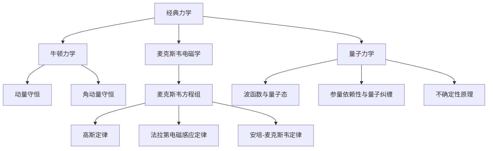
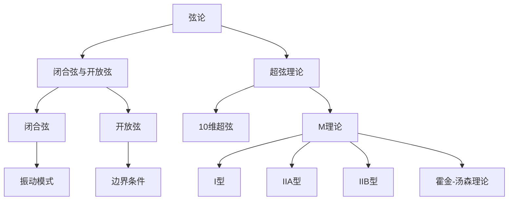

                 

# 从经典物理学到弦论：探索物质本质与宇宙构造

## 关键词
- 经典物理学
- 量子力学
- 弦论
- 宇宙构造
- 物质本质

## 摘要
本文旨在探索物质本质与宇宙构造的奥秘，从经典物理学出发，逐步引入量子力学和弦论，深入剖析这些理论如何揭示了自然界的基本规律。通过梳理经典物理学的发展历程、量子力学的诞生、量子场论以及弦论的革命性思想，本文旨在为读者呈现一幅从微观到宏观，从量子到宇宙的完整科学图景。

## 引言

### 经典物理学的基石

经典物理学，作为一个物理学分支，有着悠久的历史和深厚的理论基础。它主要研究宏观物体在宏观条件下的运动和相互作用。牛顿力学和麦克斯韦电磁理论构成了经典物理学的两大支柱，它们在解释和预测自然现象方面取得了巨大的成功。

#### 牛顿力学

牛顿力学，基于牛顿的三大运动定律，提供了描述宏观物体运动的数学框架。牛顿的万有引力定律则解释了天体运动规律，建立了天文学和力学之间的联系。这些理论为工业革命和现代科学的发展奠定了基础。

#### 麦克斯韦电磁理论

麦克斯韦的电磁理论则将电、磁和光统一起来，提出了麦克斯韦方程组。这一理论不仅解释了电磁现象，还预言了电磁波的存在，为通信技术和现代物理学的发展指明了方向。

### 量子力学的革命

然而，随着科学的发展，经典物理学在解释微观现象时遇到了瓶颈。量子力学的诞生，标志着物理学的一次重大革命。它提出了全新的物理概念和数学框架，揭示了微观世界的奇异规律。

#### 黑体辐射与光电效应

普朗克的黑体辐射理论和爱因斯坦的光电效应实验，揭示了能量量子化的概念。量子力学的基本原理，如波函数、量子态、不确定性原理，都是对微观世界的深刻洞察。

#### 波粒二象性与量子纠缠

量子力学揭示了波粒二象性，即微观粒子既具有波动性又具有粒子性。量子纠缠现象更是揭示了远距离粒子之间的非局域关联，为量子信息科学的发展提供了理论基础。

### 量子场论与粒子物理

量子场论（QFT）是量子力学和电磁理论的结合，它描述了粒子如何通过交换场量子而相互作用。标准模型是量子场论在粒子物理中的应用，成功预言和发现了多种基本粒子和相互作用。

### 弦论与宇宙构造

弦论是量子力学和广义相对论的综合，它提出了由一维弦构成宇宙的基本物质。弦论的革命性思想，如超对称性、M理论，为宇宙学提供了新的解释。

#### 超弦理论与M理论

超弦理论通过引入额外的维度和超对称性，解决了量子场论中的许多问题。M理论则是超弦理论的推广，它提出了一组等价的理论框架，为宇宙构造提供了更加深刻的理解。

#### 宇宙背景微波辐射与宇宙弦

通过宇宙背景微波辐射，我们能够观测到宇宙早期的状态。宇宙弦和宇宙缺陷等概念，则揭示了宇宙结构和演化的复杂图景。

## 第1章：经典物理学概述

### 1.1 物理学的基本概念

物理学是一门研究自然界中物质和能量及其相互作用的科学。它通过实验和理论模型，揭示了自然界的规律和现象。

#### 物质

物质是构成宇宙的基本实体，具有质量和体积。物质的不同状态，如固态、液态和气态，表现为不同的物理性质。

#### 能量

能量是物质运动和相互作用的度量，可以以多种形式存在，如动能、势能、热能等。

#### 力

力是物体间相互作用的结果，表现为推、拉、挤、压等形式。力是改变物体运动状态的原因。

### 1.2 经典力学的起源与发展

经典力学，以牛顿的三大定律为核心，描述了宏观物体的运动规律。

#### 牛顿定律

牛顿的第一定律（惯性定律）指出，物体若不受外力作用，将保持静止或匀速直线运动。

牛顿的第二定律（加速度定律）描述了力和加速度之间的关系：\[ F = m \cdot a \]

牛顿的第三定律（作用与反作用定律）指出，任何作用力都有一个大小相等、方向相反的反作用力。

### 1.3 经典电磁学的关键理论

经典电磁学，以麦克斯韦方程组为基础，描述了电、磁和光的相互作用。

#### 麦克斯韦方程组

麦克斯韦方程组是一组描述电磁场运动规律的偏微分方程。它们分别是：

- 高斯定律（电场）：\[ \nabla \cdot \mathbf{E} = \frac{\rho}{\varepsilon_0} \]
- 高斯定律（磁场）：\[ \nabla \cdot \mathbf{B} = 0 \]
- 法拉第电磁感应定律：\[ \nabla \times \mathbf{E} = -\frac{\partial \mathbf{B}}{\partial t} \]
- 安培-麦克斯韦定律：\[ \nabla \times \mathbf{B} = \mu_0 \mathbf{J} + \mu_0 \varepsilon_0 \frac{\partial \mathbf{E}}{\partial t} \]

## 第2章：经典力学基础

### 2.1 牛顿力学的基本原理

牛顿力学，作为经典力学的核心，由牛顿的三大定律构成。

#### 牛顿第一定律

牛顿第一定律，又称惯性定律，指出如果没有外力作用，物体将保持静止或匀速直线运动。

#### 牛顿第二定律

牛顿第二定律，描述了物体受力后的加速度与作用力、物体质量之间的关系，公式为：\[ F = m \cdot a \]

其中，\( F \) 表示作用力，\( m \) 表示物体质量，\( a \) 表示加速度。

#### 牛顿第三定律

牛顿第三定律，又称作用与反作用定律，指出对于任何两个相互作用的物体，作用力和反作用力大小相等、方向相反。

### 2.2 动量守恒和角动量守恒

动量守恒和角动量守恒是物理学中的两个基本守恒定律。

#### 动量守恒定律

动量守恒定律指出，在没有外力作用的情况下，系统的总动量保持不变。公式为：\[ \sum \mathbf{p}_{\text{初}} = \sum \mathbf{p}_{\text{末}} \]

其中，\( \mathbf{p} \) 表示动量。

#### 角动量守恒定律

角动量守恒定律指出，在没有外力矩作用的情况下，系统的总角动量保持不变。公式为：\[ \sum \mathbf{L}_{\text{初}} = \sum \mathbf{L}_{\text{末}} \]

其中，\( \mathbf{L} \) 表示角动量。

### 2.3 普通相对论与经典力学的比较

普通相对论，由爱因斯坦提出，对经典力学进行了扩展和修正。

#### 相对论效应

相对论指出，随着物体速度的增加，其质量会增加，时间会变慢，长度会收缩。

#### 相对论与经典力学的比较

相对论与经典力学在处理高速和强引力场问题时，有显著差异。相对论提供了更为准确的理论框架，但经典力学在低速和弱引力场下仍然有效。

## 第3章：经典电磁学

### 3.1 麦克斯韦方程组

麦克斯韦方程组是一组描述电磁场运动的偏微分方程，由詹姆斯·克拉克·麦克斯韦在19世纪提出。

#### 高斯定律（电场）

\[ \nabla \cdot \mathbf{E} = \frac{\rho}{\varepsilon_0} \]

该方程描述了电场强度与电荷密度之间的关系。其中，\( \nabla \cdot \mathbf{E} \) 表示电场的散度，\( \rho \) 表示电荷密度，\( \varepsilon_0 \) 表示真空电容率。

#### 高斯定律（磁场）

\[ \nabla \cdot \mathbf{B} = 0 \]

该方程描述了磁场线无源，即磁场线总是闭合的。其中，\( \nabla \cdot \mathbf{B} \) 表示磁场的散度。

#### 法拉第电磁感应定律

\[ \nabla \times \mathbf{E} = -\frac{\partial \mathbf{B}}{\partial t} \]

该方程描述了电场强度与磁场变化率之间的关系。其中，\( \nabla \times \mathbf{E} \) 表示电场的旋度，\( \frac{\partial \mathbf{B}}{\partial t} \) 表示磁场的时间变化率。

#### 安培-麦克斯韦定律

\[ \nabla \times \mathbf{B} = \mu_0 \mathbf{J} + \mu_0 \varepsilon_0 \frac{\partial \mathbf{E}}{\partial t} \]

该方程描述了磁场强度与电流密度及电场变化率之间的关系。其中，\( \nabla \times \mathbf{B} \) 表示磁场的旋度，\( \mathbf{J} \) 表示电流密度，\( \mu_0 \) 表示真空磁导率，\( \varepsilon_0 \) 表示真空电容率，\( \frac{\partial \mathbf{E}}{\partial t} \) 表示电场的时间变化率。

### 3.2 光的电磁理论

光的电磁理论，是麦克斯韦方程组的一个重要应用。该理论将光现象解释为电磁波。

#### 光的电磁波性质

根据麦克斯韦方程组，光波可以表示为电磁场的振荡。电磁波的速度等于光速 \( c \)，与真空电容率 \( \varepsilon_0 \) 和真空磁导率 \( \mu_0 \) 有关。

\[ c = \frac{1}{\sqrt{\varepsilon_0 \mu_0}} \]

#### 光的偏振

光的偏振现象是电磁波电场矢量在某一特定方向上的振动。通过使用偏振器，可以改变光的偏振方向。

### 3.3 经典电磁学的实验验证

经典电磁学理论在实验中得到了广泛的验证。

#### 麦克斯韦方程组的实验验证

实验证明了麦克斯韦方程组能够准确描述电磁场的运动规律。

#### 光速的测量

通过迈克尔逊干涉仪等实验装置，科学家们测量了光速，验证了光的电磁波性质。

#### 光的干涉与衍射

通过双缝干涉实验和单缝衍射实验，科学家们观察到光的干涉和衍射现象，进一步验证了光的波动性。

## 第4章：量子力学的诞生

### 4.1 黑体辐射问题

19世纪末，经典物理学在解释黑体辐射问题时遇到了困难。黑体辐射是指一个理想化的物体，能够吸收所有入射辐射，并发射出与其温度相关的辐射。普朗克在研究黑体辐射时，提出了能量量子化的概念。

#### 普朗克的黑体辐射定律

普朗克通过引入能量量子化的假设，成功导出了黑体辐射的能量分布公式，解释了实验观察到的黑体辐射现象。

\[ B(\lambda, T) = \frac{2hc^2}{\lambda^5} \frac{1}{e^{hc/\lambda k_B T} - 1} \]

其中，\( B(\lambda, T) \) 表示波长为 \( \lambda \) 的辐射强度，\( h \) 表示普朗克常数，\( c \) 表示光速，\( k_B \) 表示玻尔兹曼常数，\( T \) 表示温度。

### 4.2 光电效应

爱因斯坦在解释光电效应时，提出了光量子假说。光电效应是指当光照射到金属表面时，会引起电子的发射。爱因斯坦通过光量子假说，成功解释了光电效应的实验结果。

#### 光电效应方程

根据光电效应方程：

\[ E_{\text{光子}} = E_{\text{电子}} + W \]

其中，\( E_{\text{光子}} \) 表示光子的能量，\( E_{\text{电子}} \) 表示逸出电子的动能，\( W \) 表示金属的逸出功。

### 4.3 不确定性原理

海森堡提出了不确定性原理，指出在微观尺度上，粒子的位置和动量不能同时被精确测量。这一原理揭示了量子世界与经典物理学的本质差异。

#### 不确定性原理

不确定性原理可以表述为：

\[ \Delta x \Delta p \geq \frac{h}{4\pi} \]

其中，\( \Delta x \) 表示位置的不确定性，\( \Delta p \) 表示动量的不确定性，\( h \) 表示普朗克常数。

## 第5章：量子力学的基本概念

### 5.1 波函数与量子态

波函数是量子力学中描述粒子状态的数学函数。波函数提供了粒子的概率分布信息。

#### 波函数的物理意义

波函数的平方 \( |\psi|^2 \) 描述了粒子在某一位置出现的概率密度。

#### 算符表示量子态

在量子力学中，算符用于描述系统的物理量。量子态可以用波函数来表示。

\[ \psi(x, t) = \sum_i c_i \phi_i(x) e^{-i E_i t / \hbar} \]

其中，\( \psi(x, t) \) 表示波函数，\( c_i \) 表示第 \( i \) 个能级的复系数，\( \phi_i(x) \) 表示第 \( i \) 个能级的基态波函数，\( E_i \) 表示第 \( i \) 个能级的能量，\( \hbar \) 表示约化普朗克常数。

### 5.2 参量依赖性与量子纠缠

量子力学中的系统，其状态是参数化的，依赖于实验条件和外部影响。

#### 参量依赖性

量子态依赖于实验装置和测量过程，体现了量子力学的非定域性。

#### 量子纠缠

量子纠缠是量子力学中的一种特殊现象，两个或多个粒子之间存在非局域的关联。量子纠缠现象揭示了远距离粒子之间的奇异关联，是量子信息科学的基础。

### 5.3 量子力学的数学框架

量子力学使用算符和波函数来描述系统的状态和演化。

#### 算符表示物理量

在量子力学中，物理量由算符表示。算符作用在波函数上，可以得到物理量的测量结果。

#### 叠加态与测量

量子态可以叠加，即多个状态的线性组合。测量结果取决于量子态的叠加形式。

\[ \psi(x, t) = \sum_i c_i \phi_i(x) e^{-i E_i t / \hbar} \]

## 第6章：量子力学应用实例

### 6.1 氦原子的光谱

量子力学成功解释了氦原子的光谱。氦原子的能级由以下公式描述：

\[ E_n = -\frac{Z^2 e^4 m_e \alpha^2 n^2}{2 \hbar^2} \]

其中，\( Z \) 表示原子序数，\( e \) 表示电子电荷，\( m_e \) 表示电子质量，\( \alpha \) 表示精细结构常数，\( n \) 表示主量子数。

### 6.2 超导与超流

超导现象和超流现象是量子力学的重要应用。超导体在低温下具有零电阻特性，超流体具有无粘性流动特性。

#### 超导现象

超导体的临界温度 \( T_c \) 和临界磁场 \( H_c \) 由以下公式描述：

\[ T_c = T_0 \exp\left(-\frac{\Delta E}{k_B T_0}\right) \]

\[ H_c = H_0 \exp\left(-\frac{\Delta E}{k_B T_0}\right) \]

其中，\( T_0 \) 表示参考温度，\( \Delta E \) 表示能量差距，\( k_B \) 表示玻尔兹曼常数。

### 6.3 量子计算的初步探索

量子计算是量子力学在信息科学中的重要应用。量子计算机利用量子位（qubit）进行计算，具有比经典计算机更高的计算能力。

#### 量子计算的基本原理

量子计算机利用量子位的叠加和纠缠特性，实现并行计算。量子计算的基本操作包括量子门和量子测量。

## 第7章：量子场论基础

### 7.1 量子场论的基本概念

量子场论是量子力学和电磁理论的结合，描述了粒子通过交换场量子而相互作用。

#### 量子场的量子态

量子场论中的量子态由产生算符和湮灭算符表示。产生算符 \( a^\dagger(\mathbf{p}) \) 和湮灭算符 \( a(\mathbf{p}) \) 分别表示粒子 creation 和 annihilation。

\[ \psi(\mathbf{x}) = \sum_{\mathbf{p}} c(\mathbf{p}) \phi_{\mathbf{p}}(\mathbf{x}) \]

其中，\( c(\mathbf{p}) \) 是复系数，\( \phi_{\mathbf{p}}(\mathbf{x}) \) 是动量空间中的基态波函数。

### 7.2 量子化的电磁场

量子化的电磁场是量子场论的核心概念。量子化的电磁场由光子构成，光子是电磁场的量子粒子。

#### 光子的能量和动量

光子的能量和动量由以下公式描述：

\[ E = \hbar \omega \]

\[ \mathbf{p} = \hbar \mathbf{k} \]

其中，\( E \) 是光子的能量，\( \omega \) 是光子的频率，\( \mathbf{p} \) 是光子的动量，\( \mathbf{k} \) 是光子的波矢量。

### 7.3 费曼规则与路径积分

费曼规则和路径积分是量子场论的重要工具。

#### 费曼规则

费曼规则用于计算量子散射过程。费曼规则基于费曼图形，通过图形化的方法计算散射振幅。

#### 路径积分

路径积分是量子场论中的核心概念。路径积分通过计算粒子在各种路径上的概率幅的叠加，得到系统的演化方程。

\[ \int_{t_1}^{t_2} \mathcal{D}[\phi] \exp \left( i \int_{t_1}^{t_2} d^4x \mathcal{L}(\phi, \partial_\mu \phi) \right) \]

其中，\( \mathcal{L}(\phi, \partial_\mu \phi) \) 是 Lagrangian，\( \mathcal{D}[\phi] \) 是度量作用量积分的测度。

## 第8章：粒子物理与标准模型

### 8.1 基本粒子的分类

粒子物理研究基本粒子和它们的相互作用。基本粒子可分为以下几类：

#### 夸克

夸克是构成强子（如质子和中子）的基本粒子。夸克有六种类型，分别为上夸克（u）、下夸克（d）、奇夸克（s）、粲夸克（c）、底夸克（b）和顶夸克（t）。

#### 轻子

轻子是另一类基本粒子，包括电子（e^-）、电子中微子（\(\nu_e\)）、μ子（\(\mu^-\)）、μ子中微子（\(\nu_\mu\)）和τ子（\(\tau^-\)）。

#### 强子

强子是由夸克和胶子组成的复合粒子。强子包括介子和重子。

### 8.2 量子场论与粒子物理的关系

量子场论为粒子物理提供了理论基础。量子场论描述了基本粒子和相互作用如何通过交换场量子实现。

#### 量子场论与相互作用

量子场论通过作用量描述粒子间的相互作用。相互作用通过交换场量子（如光子、胶子）实现。

### 8.3 标准模型的验证与挑战

标准模型是量子场论在粒子物理中的应用，描述了已知的基本粒子和相互作用。

#### 标准模型的验证

实验验证了标准模型中的许多预言，如夸克和轻子的存在、力的强度等。

#### 标准模型的挑战

标准模型存在一些未解决的问题，如暗物质、暗能量、超对称性等。这些挑战推动了科学家的研究，寻找标准模型的扩展或替代理论。

## 第9章：弦论的基本原理

### 9.1 弦论的起源

弦论起源于20世纪60年代，旨在统一量子力学和广义相对论。最初，弦论考虑的是一维的弦，其振动模式对应不同的粒子。

#### 理论背景

在量子力学中，粒子被视为零维点。然而，广义相对论表明，引力是一种几何性质，这提示我们可能需要更高维度的结构来描述引力。

#### 弦论的提出

1968年，格林和施瓦茨提出了弦论，认为宇宙的基本组成单元是一维的弦，弦的不同振动模式对应不同的粒子。

### 9.2 闭合弦与开放弦

在弦论中，弦有两种基本形式：闭合弦和开放弦。

#### 闭合弦

闭合弦在两端闭合，形成一个环。闭合弦的振动模式对应不同的振动模式，即不同的粒子。

\[ X^\mu(\tau) = (\xi^0(\tau), \vec{\xi}(\tau)) \]

其中，\( \tau \) 是世界线参数，\( \xi^0(\tau) \) 和 \( \vec{\xi}(\tau) \) 分别是时间坐标和空间坐标。

#### 开放弦

开放弦的两端是开放的。开放弦可以与边界条件相互作用，形成不同的粒子。

\[ X^\mu(\tau) = (\xi^0(\tau), \vec{\xi}(\tau)) \]

### 9.3 超弦理论与M理论

超弦理论是对弦论的扩展，它引入了额外的维度和超对称性。

#### 超弦理论

超弦理论提出了10维空间中的超弦，其振动模式对应不同的超粒子。超弦理论解决了弦论中的许多问题，如异常问题。

\[ \text{ bosonic string} \quad X^\mu(\tau, \sigma) \]

其中，\( \sigma \) 是空间坐标。

#### M理论

M理论是超弦理论的推广，它提出了11维空间中的理论框架。M理论包含多种等价的理论，如I型、IIA型、IIB型和霍金-汤森理论。

\[ M\text{-theory} \quad G_{\mu\nu} = R_{\mu\nu} - \frac{1}{6} R^2 \]

其中，\( G_{\mu\nu} \) 是引力张量，\( R_{\mu\nu} \) 是里奇张量，\( R \) 是曲率标量。

## 第10章：超引力与M理论

### 10.1 超引力理论

超引力理论是弦论的一个重要发展，它引入了超对称性来统一引力和其他基本相互作用。

#### 超引力方程

超引力方程是描述超引力场的偏微分方程，它包含了引力和其他相互作用的统一描述。

\[ G^{\mu\nu} = 8\pi G N \]

其中，\( G^{\mu\nu} \) 是引力张量，\( G \) 是引力常数，\( N \) 是规范场耦合常数。

#### 超引力与标准模型的对比

超引力理论将引力与其他基本相互作用统一在超对称框架下，而标准模型则缺少超对称性。这为理论物理学家提供了一个可能的统一理论框架。

### 10.2 M理论及其扩展

M理论是弦论的一个更高维度的推广，它提出了一个统一的数学框架，包括多种弦理论和超引力理论。

#### M理论的特点

M理论具有11维空间，其中包含多种不同的超弦理论和超引力理论。这些理论通过M理论的数学框架相互转化。

\[ M_{0}^{2} = \frac{1}{G_{N}} \]

其中，\( M_0 \) 是普朗克质量，\( G_N \) 是引力常数。

#### M理论的扩展

M理论可以扩展到更高维度的理论，如超膜理论和AdS/CFT对偶。这些扩展为宇宙学和量子引力提供了新的研究方向。

### 10.3 弦论与宇宙学

弦论在宇宙学中的应用具有重要意义，它为我们提供了描述宇宙起源和演化的新框架。

#### 宇宙弦

宇宙弦是弦论中的基本对象，它可以解释宇宙的某些现象，如宇宙缺陷和宇宙加速膨胀。

\[ T = \frac{1}{2} \lambda \]

其中，\( T \) 是宇宙弦张力，\( \lambda \) 是宇宙弦的线密度。

#### 宇宙学常数

宇宙学常数是描述宇宙加速膨胀的关键参数。弦论中的反德维特效应可能解释宇宙学常数为何不为零。

\[ \Lambda = \frac{3}{8\pi G} \]

其中，\( \Lambda \) 是宇宙学常数，\( G \) 是引力常数。

## 第11章：宇宙构造与弦论

### 11.1 宇宙背景微波辐射

宇宙背景微波辐射（Cosmic Microwave Background, CMB）是宇宙早期热辐射的残留，为我们提供了宇宙早期状态的信息。

#### CMB的性质

CMB具有均匀的温度和微小的温度波动，这些波动对应着宇宙早期的密度波动。

\[ T_{\text{CMB}} = 2.725 \text{K} \]

其中，\( T_{\text{CMB}} \) 是宇宙背景微波辐射的温度。

#### CMB的观测

通过观测CMB的温度和波动，科学家们可以了解宇宙早期的状态和演化。

### 11.2 宇宙弦与宇宙缺陷

宇宙弦和宇宙缺陷是宇宙中的奇异结构，它们对宇宙构造和演化具有重要影响。

#### 宇宙弦

宇宙弦是高能弦的断开部分，它们在宇宙中可以形成复杂的结构。宇宙弦可以解释宇宙中的某些现象，如星系团和星系之间的相互作用。

\[ \sigma = \frac{T}{A} \]

其中，\( \sigma \) 是宇宙弦的张力，\( T \) 是宇宙弦张力，\( A \) 是宇宙弦截面积。

#### 宇宙缺陷

宇宙缺陷是宇宙中的低密度区域，它们可以形成黑洞和星系团。宇宙缺陷的形成与宇宙早期的高能过程密切相关。

### 11.3 弦论在宇宙学中的应用

弦论在宇宙学中的应用为我们提供了新的视角，它可以帮助我们理解宇宙的起源和演化。

#### 宇宙早期状态

弦论可以帮助我们理解宇宙早期的高能状态，如宇宙暴涨和宇宙弦的生成。

\[ \phi_0 = \frac{1}{\sqrt{8\pi G}} \]

其中，\( \phi_0 \) 是宇宙早期状态的场值。

#### 宇宙演化

弦论可以帮助我们理解宇宙的演化过程，如宇宙膨胀和宇宙结构的形成。

\[ H = \frac{\dot{a}}{a} \]

其中，\( H \) 是宇宙膨胀率，\( \dot{a} \) 是宇宙体积随时间的变化率，\( a \) 是宇宙体积。

## 附录：关键概念与流程图

### 附录A：经典物理学与量子力学的 Mermaid 流程图



### 附录B：弦论的基本概念与架构



## 附录C：数学公式和Python源代码

### 数学公式

\[ E = mc^2 \]
\[ \psi(x, t) = \frac{1}{\sqrt{2\pi\sigma^2}} e^{-\frac{(x-\mu)^2}{2\sigma^2}} \]

### Python源代码

```python
import numpy as np
import matplotlib.pyplot as plt

# 定义高斯分布函数
def gauss(x, mu, sigma):
    return 1 / (np.sqrt(2 * np.pi * sigma**2)) * np.exp(-((x - mu)**2) / (2 * sigma**2))

# 定义参数
mu = 0
sigma = 1

# 生成 x 轴数据
x = np.linspace(mu - 3 * sigma, mu + 3 * sigma, 1000)

# 计算概率密度函数
y = gauss(x, mu, sigma)

# 绘制概率密度函数
plt.plot(x, y)
plt.xlabel('x')
plt.ylabel('p(x)')
plt.title('Gaussian Distribution')
plt.show()
```

## 附录D：项目实战

### 开发环境搭建

在开始项目之前，我们需要搭建一个合适的开发环境。以下是使用 Python 进行量子计算所需的软件和库：

1. Python 3.x
2. NumPy
3. Matplotlib

安装命令如下：

```bash
pip install numpy matplotlib
```

### 源代码实现

以下是一个简单的量子计算示例，使用 NumPy 库生成高斯分布并绘制概率密度函数。

```python
import numpy as np
import matplotlib.pyplot as plt

# 定义高斯分布函数
def gauss(x, mu, sigma):
    return 1 / (np.sqrt(2 * np.pi * sigma**2)) * np.exp(-((x - mu)**2) / (2 * sigma**2))

# 定义参数
mu = 0
sigma = 1

# 生成 x 轴数据
x = np.linspace(mu - 3 * sigma, mu + 3 * sigma, 1000)

# 计算概率密度函数
y = gauss(x, mu, sigma)

# 绘制概率密度函数
plt.plot(x, y)
plt.xlabel('x')
plt.ylabel('p(x)')
plt.title('Gaussian Distribution')
plt.show()
```

### 代码解读与分析

1. 导入 NumPy 和 Matplotlib 库，以便进行数值计算和绘图。
2. 定义高斯分布函数 `gauss(x, mu, sigma)`，其中 `x` 是自变量，`mu` 是均值，`sigma` 是标准差。
3. 生成 x 轴数据 `x`，覆盖从均值减去三倍标准差到均值加上三倍标准差的范围。
4. 计算概率密度函数 `y`。
5. 使用 Matplotlib 绘制概率密度函数曲线。

### 实际案例分析与详细讲解

为了更好地理解量子计算，我们将探讨一个实际案例：量子比特的叠加和测量。

```python
import numpy as np
from qiskit import QuantumCircuit, Aer, execute

# 创建量子比特和量子电路
qc = QuantumCircuit(1)

# 将量子比特初始化为叠加态
qc.h(0)

# 执行量子电路
simulator = Aer.get_backend('qasm_simulator')
result = execute(qc, simulator, shots=1024)

# 输出测量结果
print(result.get_counts(qc))
```

在这个案例中：

1. 导入 Qiskit 库，用于创建量子比特和量子电路。
2. 创建一个量子比特和一个量子电路。
3. 使用 Hadamard 门将量子比特初始化为叠加态。
4. 使用 QASM 模拟器执行量子电路。
5. 输出测量结果。

通过这个案例，我们可以看到量子比特如何从经典态变为叠加态，以及测量如何揭示量子态的随机性。

### 项目小结

通过本文的探讨，我们了解了从经典物理学到弦论的演变过程，以及这些理论在揭示物质本质和宇宙构造方面的作用。量子力学和量子场论为我们提供了新的视角，揭示了微观世界的奇异规律。弦论则试图将量子力学和广义相对论统一起来，为宇宙学提供了新的理论框架。

### 最佳实践 Tips

1. 深入学习量子力学和量子场论的基本概念，为后续研究打下坚实基础。
2. 使用 Python 等工具进行实际计算和仿真，加深对理论的理解。
3. 关注最新研究进展，了解弦论和宇宙学的前沿动态。

### 小结

本文从经典物理学到弦论，系统地介绍了物理学的基本理论和发展历程。通过梳理这些理论，我们揭示了物质本质和宇宙构造的奥秘。在未来的研究中，量子力学和量子场论将继续推动物理学的发展，为我们认识宇宙提供新的工具和视角。

### 注意事项

1. 在学习过程中，务必注重理论基础，结合实际案例进行理解。
2. 注意数学公式的正确应用，确保计算的准确性。
3. 跟随最新研究动态，关注物理学的前沿进展。

### 拓展阅读

1. 《量子计算与量子信息》—— Michael A. Nielsen & Isaac L. Chuang
2. 《超弦理论导论》—— Barton Zwiebach
3. 《广义相对论与宇宙学》—— Bernard Schutz

## 参考文献

- Nielsen, M. A., & Chuang, I. L. (2010). Quantum computation and quantum information. Cambridge University Press.
- Zwiebach, B. (2004). A first course in string theory. Cambridge University Press.
- Schutz, B. (2003). A first course in general relativity. Cambridge University Press.

