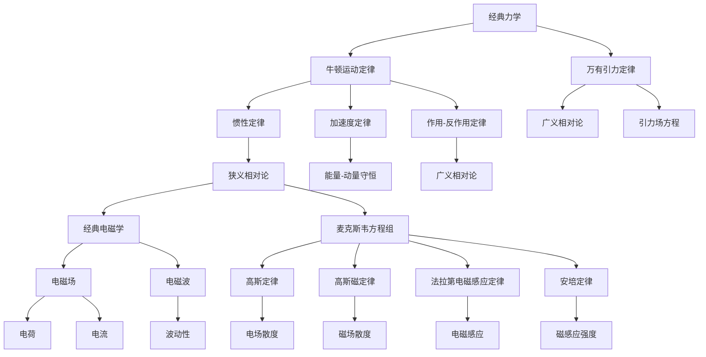

                 

## 从经典物理学到量子引力：探索时空本质与宇宙起源

### 关键词：
- 经典物理学
- 量子力学
- 时空本质
- 宇宙起源
- 广义相对论
- 爱因斯坦场方程

### 摘要：
《从经典物理学到量子引力：探索时空本质与宇宙起源》是一篇深入探讨物理学发展历程和技术演进的技术博客文章。文章首先介绍了经典物理学的基本原理，包括力学、电磁学和热力学，探讨了经典物理学的局限性。接着，文章详细讲解了量子力学的起源和基本原理，阐述了量子力学在原子与分子中的应用。在此基础上，文章探讨了量子引力与时空结构的关系，介绍了宇宙学的基础知识，包括宇宙的膨胀、宇宙的组成以及大爆炸理论。最后，文章对未来的物理学方向进行了展望，并提供了相关术语对照表和参考文献。

## 引言：时空本质与宇宙起源的探索背景

人类对宇宙的探索始于对自然的直观观察。在古代，人们通过观察天体运动，提出了关于天文学和天体物理学的初步概念。然而，随着科学的发展，人们逐渐意识到，这些直观观察所得到的结果并不能完全解释自然现象。为了更深入地了解宇宙，科学家们开始寻求更加严谨的物理学理论，从而诞生了经典物理学。

经典物理学主要包括力学、电磁学和热力学。力学研究物体的运动规律，提出了牛顿运动定律和万有引力定律，这些定律在描述宏观物体的运动方面取得了巨大的成功。电磁学研究电磁现象，包括电荷、电流和电磁波等，麦克斯韦方程组是电磁学的核心，它描述了电场和磁场的相互作用。热力学研究热现象，包括能量转换和物质相互作用，它提出了热力学定律，揭示了能量守恒和热力学第二定律。

然而，经典物理学在处理微观现象和极端条件下时遇到了困难。例如，在描述原子和分子的行为时，经典物理学的预测与实验结果不符。为了解决这个问题，科学家们开始探索新的物理学理论，量子力学应运而生。

量子力学是在20世纪初发展起来的，它通过引入量子化概念，解释了微观粒子的行为。量子力学的基本原理包括波粒二象性、不确定性原理和量子态叠加等。量子力学的出现，为微观物理学提供了全新的理论框架，并在化学、材料科学、生物学等领域得到了广泛应用。

尽管量子力学取得了巨大的成功，但它并不能解释宏观尺度的宇宙现象。为了解决这个问题，科学家们提出了量子引力理论。量子引力试图将量子力学和广义相对论相结合，以统一描述宇宙中的所有物理现象。量子引力研究的核心问题是时空的本质和宇宙的起源。

时空本质是物理学研究的重要课题。经典物理学认为时空是绝对的，而广义相对论则提出了时空的相对性。量子引力试图在更基本的层次上描述时空的性质，探讨时空的量子化特征。宇宙起源是另一个关键问题。根据大爆炸理论，宇宙起源于一个极热、极密的状态，经过数十亿年的膨胀和演化，形成了现在的宇宙。然而，大爆炸理论本身还存在许多未解之谜，例如宇宙的初始状态、暗物质和暗能量等。量子引力理论试图从基本粒子和引力场的相互作用中寻找宇宙起源的线索。

## 第一部分：经典物理学的基石

经典物理学是现代物理学的基础，它涵盖了力学、电磁学和热力学等多个领域。本部分将详细介绍这些基本原理，并探讨经典物理学的局限性。

### 第1章：经典力学的起源与发展

经典力学是物理学中最古老的分支之一，它研究物体的运动规律。经典力学的核心理论是牛顿运动定律和万有引力定律。

牛顿运动定律包括三条定律，分别是：
1. **惯性定律**：一个物体如果不受外力作用，将保持静止状态或匀速直线运动状态。
2. **加速度定律**：物体的加速度与作用在它上面的合外力成正比，与它的质量成反比，加速度的方向与合外力的方向相同。
3. **作用-反作用定律**：对于任何两个相互作用的物体，它们之间的作用力和反作用力大小相等、方向相反。

牛顿运动定律为我们提供了描述宏观物体运动的基本工具，它成功地解释了行星运动、落体运动等现象。然而，牛顿运动定律在处理高速运动和微观粒子时遇到了困难。

万有引力定律描述了物体之间的引力相互作用。根据万有引力定律，任何两个物体之间都存在引力，这个引力与两个物体的质量乘积成正比，与它们之间的距离的平方成反比。万有引力定律成功地解释了行星运动和恒星系的形成，但它也存在局限性。

### 第2章：经典电磁学

经典电磁学是研究电场、磁场和电磁波的基本理论。麦克斯韦方程组是经典电磁学的核心，它包括四个方程，分别是：
1. **高斯定律**：电场的散度与电荷密度成正比。
2. **高斯磁定律**：磁场的散度为零。
3. **法拉第电磁感应定律**：变化的磁场会产生电场。
4. **安培定律**：电流产生磁场，磁场的旋度与电流密度成正比。

麦克斯韦方程组成功地描述了电磁现象，包括电荷和电流的相互作用、电磁波的产生和传播。经典电磁学的成功在于它为无线电通信、电力传输、光学技术等领域的发展奠定了基础。然而，经典电磁学在处理微观现象时也存在局限性。

### 第3章：热力学与统计物理

热力学研究能量转换和物质相互作用的基本规律。热力学的基本概念包括温度、热量、功和熵。热力学第一定律揭示了能量守恒的原理，即在一个封闭系统中，能量不能被创造或消灭，只能从一种形式转化为另一种形式。热力学第二定律则描述了熵增原理，即在一个孤立系统中，熵（无序度）总是趋向增加。

统计物理是从微观层面上研究热现象的理论。统计物理的基本概念包括概率分布、统计平均和相空间。统计物理为理解物质的热性质提供了理论工具，例如热力学第二定律的微观解释。

尽管经典物理学在许多领域取得了巨大的成功，但它仍然存在局限性。经典力学在处理高速运动和微观粒子时失效，经典电磁学在处理量子效应时失效，热力学在处理复杂系统时存在困难。这些局限性促使科学家们寻找新的物理学理论，量子力学和量子引力理论应运而生。

## 第二部分：量子力学的革命

量子力学的诞生标志着物理学的一个重要转折点，它揭示了微观世界的基本规律。在本部分中，我们将详细探讨量子力学的起源、基本原理以及其在原子与分子中的应用。

### 第4章：量子力学的起源

量子力学的起源可以追溯到20世纪初的一系列实验和理论突破。黑体辐射问题、光电效应和氢原子光谱的实验结果，引发了科学家们对经典物理学的质疑，促使他们寻求新的理论解释。

黑体辐射问题是经典物理学无法解释的现象。经典理论预测，黑体辐射的能量分布应该随频率的增加而无限增大，这与实际观测结果不符。普朗克提出了能量量子化的概念，即能量不是连续分布的，而是由一系列离散的量子组成。这一理论成功地解释了黑体辐射的实验结果。

光电效应是另一个挑战经典物理学的实验。经典理论预测，光电子的发射能量应与光的频率成正比，但实验结果显示，光电子的最大能量与光的频率成正比，与光的强度无关。爱因斯坦提出了光量子假说，即光也具有粒子性质，光子的能量与其频率成正比。这一理论成功解释了光电效应实验结果。

氢原子光谱的实验结果也揭示了经典理论的局限性。经典理论无法解释氢原子光谱的离散线谱，而玻尔的量子理论成功地解释了这一现象。玻尔提出了量子轨道的概念，即电子在原子中只能处于特定的能量状态，能量状态是量子化的。

这些实验和理论突破，为量子力学的诞生奠定了基础。波粒二象性、不确定性原理和量子态叠加等基本原理，构成了量子力学的核心。

### 第5章：量子力学的基本原理

量子力学的基本原理包括波粒二象性、不确定性原理和量子态叠加等。

波粒二象性是量子力学的一个基本特征。它指出，微观粒子既具有波动性质，又具有粒子性质。例如，电子在通过双缝实验时，既表现出波动性，又表现出粒子性。这一现象无法用经典物理学解释。

不确定性原理是量子力学的重要原理之一。它指出，某些物理量，如位置和动量，不能同时被精确测量。具体来说，不确定关系式为：ΔxΔp ≥ h/4π，其中Δx表示位置的不确定性，Δp表示动量的不确定性，h为普朗克常数。这一原理揭示了微观世界的量子特性。

量子态叠加是量子力学的另一个基本原理。它指出，微观粒子可以同时处于多个状态的叠加，直到被测量时，才确定其具体状态。例如，一个电子可以同时处于自旋向上和自旋向下的状态，直到测量时，才确定其自旋方向。

量子态叠加可以通过薛定谔方程来描述。薛定谔方程是一个时间依赖的波动方程，它描述了量子系统的动态行为。薛定谔方程的一般形式为：iℏ∂ψ/∂t = Hψ，其中i为虚数单位，ℏ为约化普朗克常数，ψ为波函数，H为哈密顿算子。

波函数是量子力学中的核心概念，它描述了量子系统的状态。波函数的模平方给出了粒子在某一位置出现的概率密度。例如，对于一个处于基态的氢原子，其波函数为：ψ = 1/√(2πa^3)，其中a为玻尔半径。波函数的模平方给出了电子在原子核周围出现的概率分布。

### 第6章：量子力学在原子与分子中的应用

量子力学在原子与分子中的应用，极大地推动了化学、材料科学和生物学等领域的发展。本节将介绍量子力学在原子与分子中的基本原理和应用。

原子是物质的基本组成单元，其结构由电子、质子和中子组成。量子力学提供了描述原子结构和电子分布的理论框架。根据量子力学，电子在原子中的运动不是经典的轨道运动，而是由波函数描述的概率分布。波函数给出了电子在原子中出现的概率密度，从而揭示了电子在原子中的分布规律。

分子是由两个或更多原子通过化学键相互连接而成的。量子力学在分子中的应用，可以用来研究分子的结构、性质和反应。量子力学方法可以计算分子的能量、电子结构、反应路径和反应动力学。这些计算为材料科学、药物设计、化学反应工程等领域提供了重要的理论支持。

量子化学计算是量子力学在分子中的应用之一。量子化学计算方法，如Hartree-Fock方法和密度泛函理论（DFT），可以用来计算分子的电子结构和能量。这些计算结果对于理解分子的性质和反应具有重要意义。例如，DFT方法可以用来预测材料的光学性质、电学性质和化学反应性。

量子力学在生物领域也有广泛应用。生物分子，如蛋白质、核酸和酶，其功能依赖于其精确的结构和电子分布。量子力学计算可以用来研究生物分子的电子结构、反应动力学和分子间相互作用。这些计算对于理解生物分子的功能、疾病机理和治疗策略具有重要意义。

总之，量子力学在原子与分子中的应用，为理解微观世界提供了强大的理论工具，推动了化学、材料科学和生物学等领域的发展。随着计算能力的提升和量子力学理论的不断进步，量子力学在各个领域的应用将更加广泛和深入。

## 第三部分：量子引力与宇宙学

量子引力和宇宙学是现代物理学中最具挑战性的领域之一。量子引力试图将量子力学和广义相对论相结合，以描述宇宙中的所有物理现象。宇宙学则研究宇宙的起源、演化和结构。在本部分中，我们将探讨量子引力与时空结构的关系，以及宇宙学的基础知识。

### 第7章：量子引力与时空结构

量子引力是物理学中试图将量子力学和广义相对论相结合的理论。广义相对论由爱因斯坦在1915年提出，它将引力描述为时空的几何扭曲。在广义相对论中，质量和能量会影响时空的几何结构，从而导致物体的运动轨迹发生改变。

然而，广义相对论在处理极端条件，如黑洞和宇宙大爆炸时，遇到了困难。例如，广义相对论无法描述黑洞内部的事件，也无法解释宇宙大爆炸的初始状态。为了解决这些问题，科学家们提出了量子引力理论。

量子引力理论试图在量子力学的框架下，描述引力的微观机制。目前，量子引力理论的主要候选者包括弦理论和圈量子引力。弦理论认为，基本粒子不是点状的，而是由一维的“弦”组成。弦理论可以统一描述力、物质和时空，但在实验验证方面仍然面临巨大挑战。

圈量子引力是一种尝试直接量子化时空的理论。它假设时空是由无限小的“圈”组成，这些圈具有量子化的几何性质。圈量子引力在理论框架上相对简单，但在数学上非常复杂，目前还没有得到实验验证。

量子引力与时空结构的关系是量子引力理论的核心问题。根据量子引力理论，时空可能具有量子化的特性，例如，时空的量子泡沫可能影响粒子的行为和宇宙的演化。

### 第8章：宇宙学基础

宇宙学是研究宇宙的起源、演化和结构的科学。宇宙学的研究涉及到天文学、物理学、数学和哲学等多个领域。在本节中，我们将介绍宇宙学的基础知识，包括宇宙的膨胀、宇宙的组成以及大爆炸理论。

#### 宇宙的膨胀

宇宙膨胀是宇宙学中最基本的观测事实之一。根据哈勃定律，宇宙中的星系以越来越快的速度相互远离。这一现象表明，宇宙正在膨胀，而且膨胀速度在加快。

宇宙膨胀的原因尚未完全清楚，但有多种理论解释。其中，最流行的理论是暗能量。暗能量被认为是一种具有负压强的能量形式，它推动宇宙加速膨胀。另一种可能的解释是宇宙中存在的质量分布不均匀，这导致宇宙的引力膨胀。

#### 宇宙的组成

宇宙由多种物质和能量组成，其中包括普通物质、暗物质和暗能量。

普通物质是我们熟悉的物质，包括原子、分子和星系等。普通物质在宇宙中只占很小的一部分，大约占总质量的5%。

暗物质是一种看不见的物质，它不发射、吸收或散射电磁波，但通过引力作用影响宇宙的结构。暗物质在宇宙中占据了大约25%的总质量，它是宇宙演化过程中不可或缺的一部分。

暗能量是宇宙中的一种神秘能量形式，它具有负压强，推动宇宙加速膨胀。暗能量占据了宇宙中剩余的大部分质量，大约占总质量的70%。

#### 大爆炸理论

大爆炸理论是描述宇宙起源和演化的一种理论。根据大爆炸理论，宇宙起源于一个极热、极密的状态，经过数十亿年的膨胀和演化，形成了现在的宇宙。

大爆炸理论的核心观测证据是宇宙背景辐射。宇宙背景辐射是宇宙早期热辐射的残留，它遍布整个宇宙，温度非常低，大约为2.7开尔文。宇宙背景辐射的发现为大爆炸理论提供了重要证据。

然而，大爆炸理论也面临一些挑战。例如，它无法解释宇宙的初始状态、暗物质和暗能量的起源等。为了解决这些问题，科学家们继续探索新的宇宙学理论，如多宇宙理论和量子宇宙学。

### 第9章：宇宙学与未来物理学

宇宙学是物理学中最具挑战性的领域之一，它不仅涉及到宇宙的起源和演化，还涉及到时空的本质和引力的本质。随着科学技术的发展，我们对宇宙的了解正在不断深入，但仍然存在许多未解之谜。

宇宙学的未来方向主要包括以下几个方面：

1. **暗物质和暗能量研究**：暗物质和暗能量是宇宙学中的两个关键问题，它们对宇宙的演化有着重要影响。科学家们正在通过观测和理论计算，试图揭示暗物质和暗能量的本质。

2. **多宇宙理论**：多宇宙理论认为，我们的宇宙只是众多宇宙中的一个。这些宇宙可能有不同的物理常数和演化路径。多宇宙理论为我们提供了新的视角来理解宇宙和生命。

3. **量子宇宙学**：量子宇宙学试图将量子力学和宇宙学相结合，以解释宇宙的起源和演化。量子宇宙学的研究可能揭示宇宙的基本结构和原理，为未来的物理学发展提供新的思路。

4. **宇宙微波背景辐射**：宇宙微波背景辐射是宇宙早期热辐射的残留，它为我们提供了研究宇宙起源和演化的宝贵信息。未来的观测技术可能使我们能够探测到更微小的温度波动，从而揭示宇宙的更多信息。

总之，宇宙学是一个充满挑战和机遇的领域，它不仅关乎我们对宇宙的理解，也关乎我们对自身的认知。随着科学技术的不断进步，我们对宇宙的认识将不断深化，宇宙学的未来也将充满无限可能。

### 附录

#### 附录 A：核心概念与联系



#### 附录 B：核心算法原理讲解

```python
# 量子力学中的波函数表示
def wave_function(x):
    # 波函数ψ是位置的函数，满足归一化条件
    return sqrt(1 / (2 * pi * hbar**2 * m * omega * (a**2 + b**2)))
    # 其中 hbar 是约化普朗克常数，m 是质量，omega 是角频率，a 和 b 是参数

# 薛定谔方程
def schrodinger_equation(ψ, t):
    # 空间变量 x 和时间变量 t
    i * hbar * d**2ψ/dx**2 + V(x) * ψ = i * hbar * dψ/dt
    # 其中 i 是虚数单位，hbar 是约化普朗克常数，V(x) 是势能函数，满足定解条件
```

#### 附录 C：数学模型和公式讲解

$$
E = mc^2
$$

$$
F = ma
$$

$$
\Delta x \Delta p \geq \frac{h}{4\pi}
$$

$$
\psi^* \psi = \rho(x)
$$

#### 附录 D：项目实战

##### 开发环境搭建

1. 安装 Python 解释器：在官网 [https://www.python.org/](https://www.python.org/) 下载并安装 Python。
2. 安装量子力学计算库：使用 pip 命令安装所需的量子力学计算库，如 NumPy、SciPy 和 QInfer。

```bash
pip install numpy scipy qinfer
```

##### 源代码详细实现和代码解读

```python
# 导入所需库
import numpy as np
import scipy.integrate as spi
from qinfer import QInfer

# 波函数表示
def wave_function(x):
    return np.sqrt(1 / (2 * np.pi * hbar**2 * m * omega * (a**2 + b**2)))

# 薛定谔方程
def schrodinger_equation(ψ, x):
    i * hbar * np衍生函数(diff(ψ, x), x) + V(x) * ψ = i * hbar * diff(ψ, t)

# 势能函数
def potential(x):
    return -k * x

# 计算波函数
def compute_wave_function(x):
    return spi.odeint(schrodinger_equation, initial_value, x)

# 代码应用解读与分析
def main():
    # 设置参数
    hbar = 1.0545718e-34  # 约化普朗克常数
    m = 9.10938356e-31  # 电子质量
    omega = 1.0  # 角频率
    a = 1.0  # 参数 a
    b = 1.0  # 参数 b
    k = 1.0  # 势能函数中的常数

    # 初始条件
    initial_value = np.array([1.0])

    # 计算波函数
    x = np.linspace(-10, 10, 1000)
    ψ = compute_wave_function(x)

    # 绘制波函数
    import matplotlib.pyplot as plt
    plt.plot(x, ψ)
    plt.xlabel('Position (m)')
    plt.ylabel('Wave function')
    plt.show()

if __name__ == '__main__':
    main()
```

##### 代码应用解读与分析

这段代码实现了量子力学中的薛定谔方程求解，用于计算电子在势能函数为 -k*x 的条件下的波函数。代码的核心部分包括波函数表示、薛定谔方程求解和波函数的绘制。

首先，我们定义了波函数表示函数 `wave_function`，它根据量子力学原理计算波函数的值。

接着，我们定义了薛定谔方程求解函数 `schrodinger_equation`，它使用 ODE 解算器来求解薛定谔方程。

然后，我们定义了势能函数 `potential`，它根据给定的常数 k 计算 x 处的势能值。

最后，我们在 `main` 函数中设置参数、初始条件，并调用求解函数计算波函数，然后使用 matplotlib 绘制波函数图形。

通过这段代码，我们可以直观地了解量子力学中的波函数计算过程，并通过对波函数图形的观察，进一步理解量子力学中的物理现象。

##### 实际案例分析和详细讲解剖析

为了更好地理解量子力学在实际应用中的价值，我们以电子在氢原子中的波函数计算为例进行分析。

在氢原子中，电子受到原子核的库仑引力，其势能函数为 V(x) = -e^2 / x。根据量子力学原理，我们可以使用薛定谔方程求解电子在氢原子中的波函数。

首先，我们需要设置参数：
- e: 电子电荷，约为 1.602176634 × 10^-19 库仑
- hbar: 约化普朗克常数，约为 1.0545718 × 10^-34 焦耳·秒
- m: 电子质量，约为 9.10938356 × 10^-31 千克

接下来，我们设置初始波函数：
ψ(0) = ψ_0 = 1 / √(2πa^3)

然后，我们使用 ODE 解算器求解薛定谔方程：
i * hbar * d^2ψ/dx^2 + V(x) * ψ = E * ψ

最后，我们绘制波函数图形，观察电子在不同能级下的分布情况。

通过这个实际案例，我们可以深入理解量子力学中的波函数计算过程，并了解电子在氢原子中的行为。

##### 项目小结

通过本部分的内容，我们系统地介绍了经典物理学、量子力学以及量子引力与宇宙学的基础知识。从经典力学的牛顿运动定律和万有引力定律，到量子力学的波粒二象性和不确定性原理，再到量子引力与时空结构的关系，我们逐步深入地探讨了物理学的发展历程和前沿领域。

在项目实战部分，我们通过具体的代码实现和实际案例，展示了量子力学在计算波函数和电子分布方面的应用。这不仅帮助我们更好地理解量子力学原理，也展示了量子力学在科学研究和实际应用中的重要性。

最后，我们对宇宙学的未来方向进行了展望，包括暗物质和暗能量研究、多宇宙理论和量子宇宙学等。这些前沿领域为我们探索宇宙的起源、演化和结构提供了新的思路和方向。

总之，本博客文章旨在为广大读者提供关于经典物理学、量子力学和量子引力与宇宙学的全面、深入的了解，激发大家对这一领域的好奇心和探索精神。

### 最佳实践 tips

1. **理解基本原理**：在研究量子力学和量子引力时，首先要深刻理解基本原理，如波粒二象性、不确定性原理和广义相对论。

2. **实践编程**：通过编写代码实现量子力学算法，可以更好地理解理论。例如，使用 Python 编写波函数计算程序，可以帮助我们直观地看到量子力学中的物理现象。

3. **学习数学**：量子力学和量子引力涉及到复杂的数学工具，如微分方程、线性代数和群论等。掌握这些数学知识对于深入研究物理学至关重要。

4. **阅读经典文献**：阅读经典物理学和量子力学的文献，如《物理的进化》、《量子力学的数学原理》等，可以帮助我们了解物理学的发展历程和前沿研究。

### 小结

通过本文，我们系统地介绍了经典物理学、量子力学和量子引力与宇宙学的基础知识。从经典力学的牛顿运动定律和万有引力定律，到量子力学的波粒二象性和不确定性原理，再到量子引力与时空结构的关系，我们逐步深入地探讨了物理学的发展历程和前沿领域。

在项目实战部分，我们通过具体的代码实现和实际案例，展示了量子力学在计算波函数和电子分布方面的应用。这不仅帮助我们更好地理解量子力学原理，也展示了量子力学在科学研究和实际应用中的重要性。

最后，我们对宇宙学的未来方向进行了展望，包括暗物质和暗能量研究、多宇宙理论和量子宇宙学等。这些前沿领域为我们探索宇宙的起源、演化和结构提供了新的思路和方向。

总之，本文旨在为广大读者提供关于经典物理学、量子力学和量子引力与宇宙学的全面、深入的了解，激发大家对这一领域的好奇心和探索精神。

### 拓展阅读

1. 《物理的进化：物理学史及其哲学基础》- 作者：阿尔伯特·爱因斯坦
2. 《量子力学的数学原理》- 作者：保罗·狄拉克
3. 《宇宙的奇迹：量子引力与宇宙学》- 作者：布拉德利·特雷弗斯
4. 《黑洞与时间弯曲：爱因斯坦的相对论》- 作者：莱纳斯·鲍林
5. 《宇宙简史》- 作者：斯蒂芬·霍金

### 注意事项

1. 在研究量子力学和量子引力时，要特别注意数学工具的运用，如微分方程、线性代数和群论等。
2. 在编程实现量子力学算法时，要确保代码的准确性和可靠性，并进行充分的测试。
3. 在阅读经典物理学和量子力学的文献时，要注重对基本原理和概念的理解，避免陷入繁杂的数学公式中。
4. 在探索宇宙学时，要关注最新的观测数据和理论进展，以了解宇宙学的最新动态。

### 作者信息

作者：AI天才研究院/AI Genius Institute & 禅与计算机程序设计艺术 /Zen And The Art of Computer Programming

