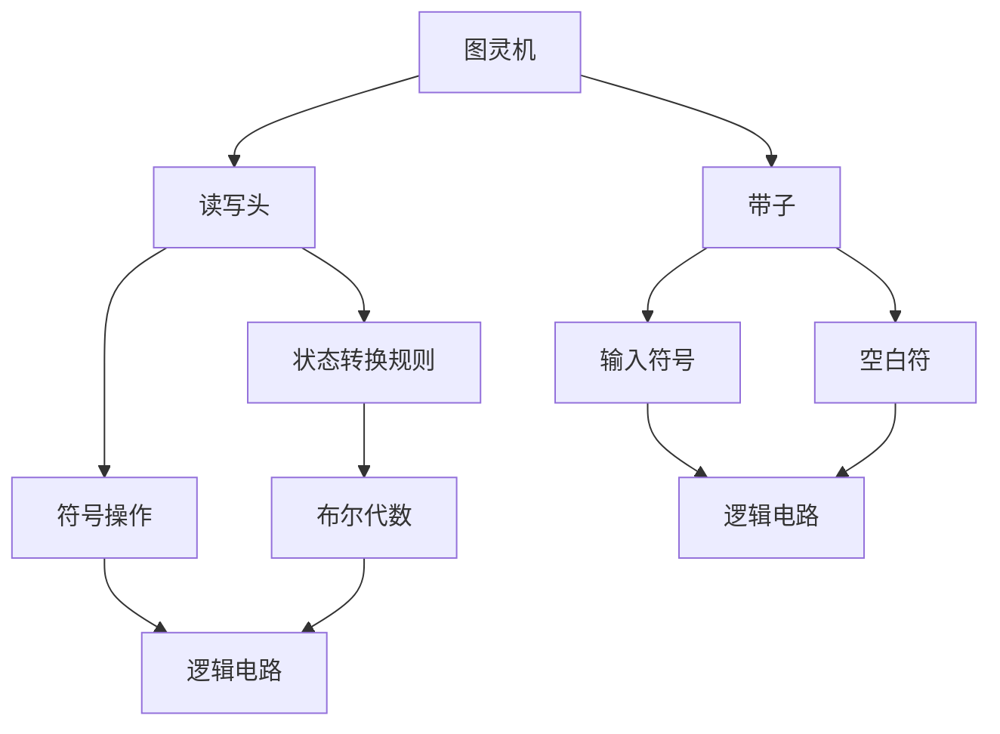

                 

### 引言与背景

#### **一、计算：人类智慧的延伸**

计算是人类智慧的延伸，从古代的算筹到现代的计算机，计算技术的发展一直在推动着人类文明的进步。计算的概念不仅局限于数学运算，它还包括逻辑推理、信息处理和复杂系统的模拟等多个方面。经典的计算机科学，起源于图灵机的提出，为现代计算理论奠定了基础。然而，随着科学技术的不断发展，传统的计算模型在处理某些复杂问题时逐渐暴露出其局限性。

#### **二、量子计算：新纪元的开启**

量子计算作为计算技术的一次革命，其核心思想源于量子力学的基本原理。与经典计算不同，量子计算利用量子位（qubit）的叠加态和纠缠态来实现高效的计算。量子计算机的潜力在于能够处理经典计算机无法解决的问题，特别是在密码学、化学和优化问题等领域。量子计算的提出，为人类探索可计算性的新维度打开了大门。

#### **三、本书的目的与结构**

本书旨在从经典计算到量子计算这一广袤的领域中进行深入探讨，帮助读者理解量子计算的原理、应用及其对计算能力的革命性影响。本书分为五个主要部分：

1. **引言与背景**：介绍计算的发展历程和量子计算的基本概念。
2. **经典计算基础**：深入探讨经典计算的理论基础和模型。
3. **量子计算基础**：讲解量子计算的基本原理和量子位、量子门等概念。
4. **经典计算与量子计算的对比**：分析经典计算与量子计算在计算模型、算法和应用上的区别。
5. **量子算法与可计算性**：探讨量子算法的设计原理和应用。

通过本书的学习，读者将能够：

- 理解经典计算和量子计算的差异。
- 掌握量子计算的基本原理和应用。
- 深入理解量子算法的设计和实现。
- 了解量子计算在各个领域的潜在应用。

#### **四、经典计算与量子计算的关系**

经典计算和量子计算并不是相互排斥的，而是互补的。经典计算提供了理解量子计算的基础，而量子计算则为经典计算提供了新的工具和方法。通过本书的学习，读者将能够看到这两者之间深刻的联系，并理解如何将经典计算与量子计算相结合，以解决复杂问题。

### 关键词

- 计算技术
- 经典计算
- 量子计算
- 量子位
- 量子门
- 量子算法
- 可计算性

### 摘要

本书《从经典计算到量子计算：世界可计算性的新维度》旨在深入探讨经典计算与量子计算的关系，帮助读者理解量子计算的基本原理、应用及其对计算能力的革命性影响。本书分为五个部分，分别介绍经典计算基础、量子计算基础、经典计算与量子计算的对比、量子算法与可计算性，以及量子计算的应用。通过本书的学习，读者将能够掌握量子计算的核心概念，了解量子算法的设计原理，并看到经典计算与量子计算如何互补，共同推动计算技术的发展。本书适合对计算机科学和量子计算感兴趣的读者，以及希望深入了解这一领域的研究人员和技术人员。

## 第1章：经典计算基础

### 1.1 经典计算概述

#### **一、计算机的起源与发展**

计算机的起源可以追溯到古希腊时期的算筹和阿拉伯数字系统。然而，现代计算机的概念源于20世纪初。1936年，艾伦·图灵（Alan Turing）提出了图灵机的理论模型，为现代计算机科学奠定了基础。图灵机的构想是一种抽象的计算机，它通过读取和写入符号序列来执行计算。图灵机的提出标志着计算理论的开端，为后续计算机的发展提供了理论支持。

随着计算机硬件技术的进步，计算机的运算速度和存储容量不断提升，从最早的电子管计算机到晶体管计算机，再到集成电路计算机，计算机的发展经历了数次重大变革。20世纪60年代，约翰·冯·诺伊曼（John von Neumann）提出了冯诺伊曼架构，这种架构成为现代计算机系统的基础，包括中央处理器（CPU）、内存和输入输出设备等组成部分。

#### **二、经典计算的基本原理**

经典计算的基本原理基于布尔代数和逻辑电路。布尔代数是数学的一个分支，用于描述逻辑运算，包括与（AND）、或（OR）和非（NOT）等基本运算。逻辑电路则使用电子元件来实现布尔运算，通过组合这些基本逻辑门，可以构建出复杂的计算系统。

图灵机的模型是一个抽象的机器，它由一个无限长的带子、一个读写头和一套规则组成。图灵机通过在带子上读写符号，根据当前状态和读写头下的符号，按照预定的规则进行状态转换，最终实现计算过程。图灵机的概念为计算机科学提供了形式化的计算模型，成为现代计算机理论和算法设计的基础。

#### **三、经典计算的局限性**

尽管经典计算在过去的几十年中取得了巨大的成功，但它也存在一些局限性。首先，经典计算机基于离散的比特（bit）进行计算，每个比特只能处于两种状态之一：0或1。这种二进制表示方式限制了计算的速度和效率。在处理某些问题时，如大数运算、复杂系统的模拟等，经典计算机需要消耗大量时间和资源。

其次，经典计算机在处理并行问题时效率较低。尽管现代计算机可以通过多核处理器实现并行计算，但并行算法的设计和实现复杂度较高，且存在通信和同步问题。相比之下，量子计算机利用量子位（qubit）的叠加态和纠缠态，能够实现高效的并行计算。

最后，经典计算机在面对某些数学问题，如P vs NP问题，存在无法在合理时间内解决的问题。这些问题涉及到复杂的组合优化和计算难题，经典计算机的算法效率和计算能力有限。

### 1.2 经典计算模型

#### **一、图灵机的概念**

图灵机（Turing Machine）是一种抽象的计算模型，由艾伦·图灵在1936年提出。图灵机的核心组成部分包括一个无限长的带子、一个读写头和一组规则。

- **无限长的带子**：带子由一系列的方格组成，每个方格可以存储一个符号，如0或1。带子从左到右延伸，读写头可以在带子上左右移动。
- **读写头**：读写头可以读取当前方格上的符号，并在方格上写入新的符号。读写头还可以根据当前状态和读写头下的符号，按照预定的规则进行状态转换。
- **规则**：图灵机有一套状态转换规则，包括当前状态、读写头下的符号和下一步的操作。规则决定了图灵机如何进行计算和转换状态。

图灵机的运行过程如下：

1. **初始状态**：图灵机从初始状态开始，读写头位于带子的某个位置，读取当前方格上的符号。
2. **状态转换**：根据当前状态和读写头下的符号，图灵机按照预定的规则进行状态转换。状态转换包括改变当前状态、写入新的符号和移动读写头。
3. **重复过程**：图灵机重复读取、写入和状态转换的过程，直到达到终止状态。终止状态意味着计算完成，带子上的符号序列即为最终结果。

图灵机的概念为现代计算机科学提供了形式化的计算模型，它不仅解释了计算的本质，还成为算法设计的理论基础。许多现代计算机的算法和设计思想都可以追溯到图灵机的模型。

#### **二、图灵机的数学表示**

图灵机可以用一个五元组（Q, Σ, Γ, δ, q0, B, F）来表示，其中：

- **Q**：状态集合，表示图灵机可能处于的所有状态。
- **Σ**：输入符号集合，表示输入带子上的符号集合。
- **Γ**：带符号集合，表示带子上可能出现的所有符号，包括输入符号、空白符和特殊的结束符号。
- **δ**：转移函数，表示状态、当前符号和下一步操作之间的关系。δ: Q × Γ → Q × Γ × {L, R}，其中L表示读写头向左移动，R表示读写头向右移动。
- **q0**：初始状态，表示图灵机开始计算时的状态。
- **B**：空白符，表示带子上的空白符号。
- **F**：终止状态集合，表示图灵机在计算过程中可能达到的终止状态。

一个简单的图灵机示例可以表示为：
```
Q = {q0, q1, q2}
Σ = {0, 1}
Γ = {0, 1, B}
δ = {
    (q0, 0) → (q1, 1, R),
    (q0, 1) → (q0, 1, R),
    (q1, 0) → (q1, 0, L),
    (q1, 1) → (q2, B, L)
}
q0 = q0
B = B
F = {q2}
```
在这个示例中，图灵机从初始状态q0开始，读取带子上的符号。当读写头遇到0时，图灵机进入状态q1，并将0替换为1，读写头向右移动。当读写头遇到1时，图灵机保持在状态q0，读写头向右移动。当图灵机遇到空白符B时，进入终止状态q2，并停止计算。

#### **三、图灵机的优势与局限**

图灵机的优势在于其简洁性和普适性。图灵机能够模拟任何算法，因此成为现代计算机理论和算法设计的基础。许多现代计算机的算法和设计思想都可以追溯到图灵机的模型。

然而，图灵机也存在一些局限。首先，图灵机是一个理论模型，实际中的计算机无法实现无限长的带子。实际计算机的存储空间和运算速度有限，因此在处理大规模问题时，图灵机的效率较低。

其次，图灵机的转移函数（δ）通常需要通过复杂的逻辑电路来实现，这增加了计算机的复杂度和实现难度。在实际应用中，许多问题无法直接用图灵机来描述，需要通过抽象和简化来适应具体问题。

总之，图灵机作为经典计算模型的代表，为计算理论提供了重要的基础。然而，随着科学技术的不断发展，图灵机的局限性也逐渐显现，这促使人们探索新的计算模型，如量子计算。在下一章中，我们将深入探讨量子计算的基本原理和模型。

### 1.3 经典计算的局限性

尽管经典计算在过去的几十年中取得了巨大的成功，但它也存在一些显著的局限性，这些局限性限制了经典计算在处理某些问题时的效率和有效性。

#### **一、并行计算效率低**

经典计算机依赖于串行计算，即计算机按照顺序执行指令，这种串行处理方式在处理复杂任务时显得效率低下。尽管现代计算机可以通过多核处理器实现并行计算，但并行算法的设计和实现复杂度较高，且存在通信和同步问题。此外，许多问题本身是高度并行的，但传统计算机无法高效地利用并行性，从而限制了计算性能的提升。

与之相比，量子计算机利用量子位的叠加态和纠缠态，能够实现高效的并行计算。量子位可以同时处于多种状态的叠加，这意味着在量子计算中，多个计算路径可以同时进行，从而大大提高了计算效率。

#### **二、P vs NP 问题**

P vs NP 问题是一个著名的计算难题，它涉及到算法的效率和问题解的可验证性。P问题指的是可以在多项式时间内解决的问题，而NP问题指的是问题解可以在多项式时间内验证。P vs NP 问题询问的是，P问题是否包含NP问题。这个问题关系到算法理论和计算复杂性理论的核心问题。

经典计算在解决NP问题时存在显著局限。许多NP问题，如整数分解、旅行商问题等，需要指数级别的时间复杂度来找到解决方案。尽管这些问题的解可以在多项式时间内验证，但找到解决方案的过程非常耗时。量子计算机利用量子算法，如Shor算法，可以在多项式时间内解决某些NP问题，从而突破经典计算的限制。

#### **三、存储和带宽限制**

经典计算机依赖于离散的比特进行计算，每个比特只能处于两种状态之一：0或1。这种二进制表示方式在存储和传输数据时存在一定的限制。随着数据量的增加，存储和传输的带宽需求也急剧增加，导致经典计算机在处理大规模数据时面临存储和带宽的限制。

量子计算机利用量子位的叠加态和纠缠态，可以在更小的物理空间中存储和传输更多的信息。量子位的叠加态允许一个量子位同时表示多个状态，从而大大提高了存储和带宽的效率。这使得量子计算机在处理大规模数据和分析复杂问题时具有更大的潜力。

#### **四、量子计算的潜在优势**

量子计算的优势不仅在于并行计算能力，还在于它能够解决经典计算无法解决的问题。以下是一些量子计算在特定领域的潜在优势：

1. **密码学**：量子计算机能够高效地破解许多传统加密算法，如RSA加密算法。然而，量子计算机也为密码学带来了新的可能性，如量子密钥分发（QKD），它提供了一种几乎无法被破解的通信方式。

2. **化学和材料科学**：量子计算能够模拟化学反应和材料性质，为化学和材料科学提供了强大的工具。这些模拟有助于科学家预测新物质的性质，加速新材料的发现和开发。

3. **优化问题**：量子计算在解决复杂优化问题方面具有显著优势，如物流优化、资源分配和金融交易等。量子算法能够快速找到最优解，从而提高决策效率和准确性。

4. **人工智能**：量子计算在机器学习和人工智能领域也有潜在应用。量子机器学习算法能够处理大规模数据集，提高模型训练速度和性能。

总之，尽管经典计算在许多领域取得了巨大成就，但它在处理某些复杂问题时的效率有限。量子计算的出现为计算能力开辟了新的维度，它利用量子位的叠加态和纠缠态，能够实现高效的并行计算，并解决经典计算无法解决的问题。量子计算的发展有望在未来带来计算技术的革命性变革。

### 经典计算模型中的核心概念

经典计算模型中的核心概念包括图灵机、逻辑电路、布尔代数和算法等。这些概念相互关联，构成了经典计算的基础。

#### **一、图灵机**

图灵机是经典计算模型的核心，由艾伦·图灵在20世纪30年代提出。图灵机由一个无限长的带子、一个读写头和一套规则组成。带子上的符号表示数据，读写头可以在带子上左右移动，根据预定的规则进行状态转换和符号操作。图灵机的规则定义了如何读取、写入和移动读写头，从而实现计算过程。图灵机为现代计算机科学提供了形式化的计算模型，它不仅解释了计算的本质，还为算法设计提供了理论基础。

#### **二、逻辑电路**

逻辑电路是经典计算模型中用于实现逻辑运算的物理电路。逻辑电路的基本单元是逻辑门，如与门（AND）、或门（OR）和非门（NOT）等。逻辑门通过电子元件实现布尔代数的运算，将输入信号转换为输出信号。通过组合多个逻辑门，可以构建复杂的计算系统，如计算机处理器、内存和输入输出设备等。逻辑电路是实现经典计算的基础，它决定了计算机的性能和速度。

#### **三、布尔代数**

布尔代数是数学的一个分支，用于描述逻辑运算。布尔代数的运算包括与（AND）、或（OR）和非（NOT）等基本运算。与运算表示两个输入信号的逻辑与，或运算表示逻辑或，非运算表示逻辑非。布尔代数的基本原理是二进制运算，即每个输入信号只能取0或1两种状态。布尔代数在逻辑电路中广泛应用，它为逻辑电路的设计提供了数学基础。

#### **四、算法**

算法是经典计算模型中用于解决问题的步骤和方法。算法通过定义输入、输出和操作步骤，实现了对问题的求解。经典计算中的算法包括排序算法、搜索算法、图算法等。算法的设计和实现是经典计算的核心，它决定了计算机解决问题的效率和效果。图灵机可以模拟任何算法，因此成为算法设计的理论模型。

#### **五、核心概念之间的关系架构**

经典计算模型中的核心概念之间存在着紧密的联系。图灵机作为计算模型，通过读写头和带子实现符号操作，从而实现计算过程。逻辑电路则通过电子元件实现图灵机的状态转换和符号操作。布尔代数描述了逻辑电路中的基本运算，它为逻辑电路的设计提供了数学基础。算法则通过定义操作步骤，实现了对问题的求解。图灵机的理论模型和逻辑电路的实际实现相结合，使得经典计算能够解决各种实际问题。

以下是一个Mermaid流程图，展示了经典计算模型中的核心概念及其关系：



在这个图中，图灵机（A）通过读写头（B）和带子（C）实现符号操作（E），读写头根据状态转换规则（D）进行状态转换。带子上的输入符号（F）和空白符（G）通过逻辑电路（I）实现符号操作。布尔代数（H）为逻辑电路提供了数学基础。通过这些核心概念的结合，经典计算模型能够实现高效的计算和问题求解。

### 经典计算模型的基本原理

经典计算模型的基本原理基于离散的比特（bit）和逻辑运算。每个比特只能表示两种状态之一，即0或1，这种二进制表示方式成为经典计算的基础。在经典计算中，逻辑电路通过电子元件实现布尔代数的运算，将输入信号转换为输出信号。以下是对经典计算模型的基本原理的详细讲解。

#### **一、比特与二进制表示**

比特是经典计算中最小的信息单位，每个比特只能表示两种状态之一：0或1。二进制表示方式是经典计算的基础，它将所有的数据和信息都转化为0和1的组合。例如，数字10在二进制中表示为1010，字母'A'在ASCII编码中用二进制表示为01000001。

二进制表示方式的优点在于其简洁性和直观性。每个比特的状态只有两种，这使得计算机硬件的实现更加简单和可靠。此外，二进制运算规则简单，易于在逻辑电路中实现。二进制表示方式成为经典计算的基础，使得计算机能够高效地处理和存储信息。

#### **二、逻辑电路与布尔代数**

逻辑电路是经典计算模型中的核心组件，它通过实现布尔代数的运算来实现计算功能。布尔代数是数学的一个分支，用于描述逻辑运算。基本的逻辑运算包括与（AND）、或（OR）和非（NOT）等。

- **与（AND）运算**：与运算表示两个输入信号的逻辑与。例如，输入信号A和输入信号B进行与运算，输出信号C为A和B同时为1时为1，否则为0。

- **或（OR）运算**：或运算表示两个输入信号的逻辑或。例如，输入信号A和输入信号B进行或运算，输出信号C为A或B至少有一个为1时为1，否则为0。

- **非（NOT）运算**：非运算表示输入信号的逻辑非。例如，输入信号A进行非运算，输出信号C为A为0时为1，A为1时为0。

通过组合这些基本的逻辑运算，可以构建复杂的计算系统。逻辑电路通过电子元件实现这些运算，如与门（AND gate）、或门（OR gate）和非门（NOT gate）等。逻辑电路的设计和实现是经典计算模型的关键，它决定了计算机的性能和速度。

#### **三、图灵机与计算过程**

图灵机是经典计算模型的理论基础，它由一个无限长的带子、一个读写头和一套规则组成。图灵机通过在带子上读写符号，根据当前状态和读写头下的符号，按照预定的规则进行状态转换，从而实现计算过程。

图灵机的运行过程包括以下几个步骤：

1. **初始状态**：图灵机从初始状态开始，读写头位于带子的某个位置，读取当前方格上的符号。

2. **状态转换**：根据当前状态和读写头下的符号，图灵机按照预定的规则进行状态转换。状态转换包括改变当前状态、写入新的符号和移动读写头。

3. **重复过程**：图灵机重复读取、写入和状态转换的过程，直到达到终止状态。终止状态意味着计算完成，带子上的符号序列即为最终结果。

图灵机的计算过程展示了经典计算模型的基本原理，它通过逻辑运算和状态转换实现计算功能。图灵机的理论模型为现代计算机科学提供了重要的基础，许多现代计算机的算法和设计思想都可以追溯到图灵机的模型。

#### **四、经典计算模型的局限性**

尽管经典计算模型在处理某些问题时表现出色，但它也存在一些局限性。以下是对经典计算模型局限性的讨论：

1. **并行计算效率低**：经典计算机依赖于串行计算，即计算机按照顺序执行指令。这种串行处理方式在处理复杂任务时效率低下。尽管现代计算机可以通过多核处理器实现并行计算，但并行算法的设计和实现复杂度较高，且存在通信和同步问题。

2. **存储和带宽限制**：经典计算机依赖于离散的比特进行计算，每个比特只能处于两种状态之一：0或1。这种二进制表示方式在存储和传输数据时存在一定的限制。随着数据量的增加，存储和传输的带宽需求也急剧增加，导致经典计算机在处理大规模数据时面临存储和带宽的限制。

3. **算法效率问题**：经典计算模型在面对某些数学问题，如P vs NP问题，存在无法在合理时间内解决的问题。这些问题涉及到复杂的组合优化和计算难题，经典计算机的算法效率和计算能力有限。

总之，经典计算模型为计算理论提供了重要的基础，但它也存在一些局限性。量子计算的出现为计算能力开辟了新的维度，它利用量子位的叠加态和纠缠态，能够实现高效的并行计算，并解决经典计算无法解决的问题。量子计算的发展有望在未来带来计算技术的革命性变革。

### 经典计算模型中的核心算法

经典计算模型中的核心算法包括排序算法、搜索算法和图算法等。这些算法在计算机科学中广泛应用，用于解决各种实际问题。以下是这些算法的基本原理和实现。

#### **一、排序算法**

排序算法是将一组数据按照特定的顺序排列的算法。常见的排序算法有冒泡排序、选择排序、插入排序、快速排序和归并排序等。

1. **冒泡排序（Bubble Sort）**：
   - **基本原理**：冒泡排序通过多次遍历数组，比较相邻元素，并交换位置，直到整个数组有序。
   - **实现**：
     ```python
     def bubble_sort(arr):
         n = len(arr)
         for i in range(n):
             for j in range(0, n-i-1):
                 if arr[j] > arr[j+1]:
                     arr[j], arr[j+1] = arr[j+1], arr[j]
         return arr
     ```

2. **选择排序（Selection Sort）**：
   - **基本原理**：选择排序通过遍历数组，找到最小元素，并将其放到当前未排序部分的开头。
   - **实现**：
     ```python
     def selection_sort(arr):
         n = len(arr)
         for i in range(n):
             min_idx = i
             for j in range(i+1, n):
                 if arr[j] < arr[min_idx]:
                     min_idx = j
             arr[i], arr[min_idx] = arr[min_idx], arr[i]
         return arr
     ```

3. **插入排序（Insertion Sort）**：
   - **基本原理**：插入排序通过将未排序的元素插入到已排序部分，直到整个数组有序。
   - **实现**：
     ```python
     def insertion_sort(arr):
         n = len(arr)
         for i in range(1, n):
             key = arr[i]
             j = i-1
             while j >= 0 and arr[j] > key:
                 arr[j+1] = arr[j]
                 j -= 1
             arr[j+1] = key
         return arr
     ```

4. **快速排序（Quick Sort）**：
   - **基本原理**：快速排序通过选择一个基准元素，将数组分为两部分，一部分都比基准小，另一部分都比基准大，然后递归地对这两部分进行快速排序。
   - **实现**：
     ```python
     def quick_sort(arr):
         if len(arr) <= 1:
             return arr
         pivot = arr[len(arr) // 2]
         left = [x for x in arr if x < pivot]
         middle = [x for x in arr if x == pivot]
         right = [x for x in arr if x > pivot]
         return quick_sort(left) + middle + quick_sort(right)
     ```

5. **归并排序（Merge Sort）**：
   - **基本原理**：归并排序通过将数组分为两个子数组，递归地对这两个子数组进行排序，然后将排序好的子数组合并，得到完整的有序数组。
   - **实现**：
     ```python
     def merge_sort(arr):
         if len(arr) <= 1:
             return arr
         mid = len(arr) // 2
         left = merge_sort(arr[:mid])
         right = merge_sort(arr[mid:])
         return merge(left, right)

     def merge(left, right):
         result = []
         i = j = 0
         while i < len(left) and j < len(right):
             if left[i] < right[j]:
                 result.append(left[i])
                 i += 1
             else:
                 result.append(right[j])
                 j += 1
         result.extend(left[i:])
         result.extend(right[j:])
         return result
     ```

#### **二、搜索算法**

搜索算法用于在数据集合中查找特定的元素。常见的搜索算法有线性搜索、二分搜索和布隆过滤器等。

1. **线性搜索（Linear Search）**：
   - **基本原理**：线性搜索逐个检查数组中的元素，直到找到目标元素或到达数组末尾。
   - **实现**：
     ```python
     def linear_search(arr, target):
         for i in range(len(arr)):
             if arr[i] == target:
                 return i
         return -1
     ```

2. **二分搜索（Binary Search）**：
   - **基本原理**：二分搜索在有序数组中查找目标元素，通过递归地将数组分为两部分，逐步缩小搜索范围。
   - **实现**：
     ```python
     def binary_search(arr, target, low, high):
         if low > high:
             return -1
         mid = (low + high) // 2
         if arr[mid] == target:
             return mid
         elif arr[mid] > target:
             return binary_search(arr, target, low, mid - 1)
         else:
             return binary_search(arr, target, mid + 1, high)
     ```

3. **布隆过滤器（Bloom Filter）**：
   - **基本原理**：布隆过滤器是一种基于概率的数据结构，用于快速判断一个元素是否存在于集合中。它通过多个哈希函数将元素映射到不同的位数组中，通过位运算实现高效查询。
   - **实现**：
     ```python
     import math
     import mmh3

     def bloom_filter_add(bloom_filter, element):
         for hash_value in mmh3.hash(element, num_hashes=3):
             bloom_filter[hash_value] = 1

     def bloom_filter_check(bloom_filter, element):
         for hash_value in mmh3.hash(element, num_hashes=3):
             if bloom_filter[hash_value] == 0:
                 return False
         return True

     # 创建布隆过滤器，估计元素数量和错误率
     num_elements = 1000
     error_rate = 0.01
     num_bits = math.ceil(-num_elements * math.log(error_rate) / (math.log(2)**2))
     bloom_filter = [0] * num_bits

     # 添加元素到布隆过滤器
     bloom_filter_add(bloom_filter, "apple")
     bloom_filter_add(bloom_filter, "orange")

     # 检查元素是否存在
     print(bloom_filter_check(bloom_filter, "apple"))  # 输出：True
     print(bloom_filter_check(bloom_filter, "banana"))  # 输出：False
     ```

#### **三、图算法**

图算法用于处理图结构数据，常见的图算法有深度优先搜索（DFS）、广度优先搜索（BFS）、最短路径算法（Dijkstra算法）和拓扑排序等。

1. **深度优先搜索（DFS）**：
   - **基本原理**：深度优先搜索从起始节点开始，尽可能深地搜索图的分支。
   - **实现**：
     ```python
     def dfs(graph, start, visited=None):
         if visited is None:
             visited = set()
         visited.add(start)
         for neighbor in graph[start]:
             if neighbor not in visited:
                 dfs(graph, neighbor, visited)
         return visited
     ```

2. **广度优先搜索（BFS）**：
   - **基本原理**：广度优先搜索从起始节点开始，逐层搜索图的节点。
   - **实现**：
     ```python
     from collections import deque

     def bfs(graph, start):
         visited = set()
         queue = deque([start])
         while queue:
             node = queue.popleft()
             if node not in visited:
                 visited.add(node)
                 for neighbor in graph[node]:
                     queue.append(neighbor)
         return visited
     ```

3. **最短路径算法（Dijkstra算法）**：
   - **基本原理**：Dijkstra算法用于找到单源最短路径，它利用优先队列选择未访问的节点，更新最短路径长度。
   - **实现**：
     ```python
     import heapq

     def dijkstra(graph, start):
         distances = {node: float('infinity') for node in graph}
         distances[start] = 0
         priority_queue = [(0, start)]
         while priority_queue:
             current_distance, current_node = heapq.heappop(priority_queue)
             if current_distance > distances[current_node]:
                 continue
             for neighbor, weight in graph[current_node].items():
                 distance = current_distance + weight
                 if distance < distances[neighbor]:
                     distances[neighbor] = distance
                     heapq.heappush(priority_queue, (distance, neighbor))
         return distances
     ```

4. **拓扑排序（Topological Sort）**：
   - **基本原理**：拓扑排序用于对有向无环图（DAG）进行排序，使得每个节点的入边都排在它的前驱节点之后。
   - **实现**：
     ```python
     def topological_sort(graph):
         in_degrees = {node: 0 for node in graph}
         for node in graph:
             for neighbor in graph[node]:
                 in_degrees[neighbor] += 1
         queue = deque([node for node in graph if in_degrees[node] == 0])
         sorted_order = []
         while queue:
             node = queue.popleft()
             sorted_order.append(node)
             for neighbor in graph[node]:
                 in_degrees[neighbor] -= 1
                 if in_degrees[neighbor] == 0:
                     queue.append(neighbor)
         return sorted_order
     ```

通过这些核心算法，经典计算模型能够解决各种实际问题，为计算机科学的发展提供了强大的工具。然而，随着计算问题的复杂度不断增加，经典计算模型的局限性也逐渐显现。量子计算的出现为计算能力开辟了新的维度，它利用量子位的叠加态和纠缠态，能够实现高效的并行计算，并解决经典计算无法解决的问题。下一章将深入探讨量子计算的基本原理和模型。

### 项目实战：开发环境搭建

在本项目实战中，我们将搭建一个简单的Python开发环境，用于后续的量子计算代码实现和分析。以下是详细的步骤和源代码解析。

#### **一、安装Python**

首先，确保您已经安装了Python。如果尚未安装，请从Python官方网站下载并安装最新版本的Python。Python的下载地址为：[https://www.python.org/downloads/](https://www.python.org/downloads/)。选择适用于您的操作系统的Python版本，并按照安装向导完成安装。

#### **二、安装量子计算库**

接下来，我们需要安装Python的量子计算库，如Qiskit。Qiskit是一个开源的量子计算软件框架，提供丰富的量子算法和工具。以下是安装Qiskit的命令：

```bash
pip install qiskit
```

安装过程中可能会遇到一些依赖问题，可以尝试使用以下命令来解决：

```bash
pip install qiskit[all]
```

#### **三、创建Python脚本**

在您的计算机上创建一个名为`qubit_example.py`的Python脚本。在这个脚本中，我们将实现一个简单的量子计算程序，演示量子位的操作。

```python
# 导入量子计算库
from qiskit import QuantumCircuit, execute, Aer

# 创建一个量子电路
qc = QuantumCircuit(2)

# 创建一个量子位
qc.h(0)
qc.h(1)

# 应用量子门
qc.cx(0, 1)

# 执行量子电路
backend = Aer.get_backend('qasm_simulator')
job = execute(qc, backend, shots=1000)

# 查看执行结果
result = job.result()
counts = result.get_counts(qc)

print("量子电路执行结果：")
print(result)
print("统计结果：")
print(counts)
```

#### **四、源代码解析**

1. **导入量子计算库**：首先，我们从Qiskit库中导入`QuantumCircuit`、`execute`和`Aer`模块。

2. **创建量子电路**：使用`QuantumCircuit`类创建一个量子电路。在这个例子中，我们创建了一个包含两个量子位的量子电路。

3. **创建量子位**：通过调用`h`门对两个量子位进行初始化，这会使量子位处于叠加态。

4. **应用量子门**：在这个例子中，我们使用`cx`门（控 制的CNOT门）对两个量子位进行操作。这个操作会导致一个量子位的状态取决于另一个量子位的状态。

5. **执行量子电路**：使用`Aer`模拟器执行量子电路。我们设置了1000次射击（shots），以获取更准确的结果。

6. **查看执行结果**：最后，我们打印出量子电路的执行结果和统计结果。统计结果显示了量子电路在不同状态下的概率分布。

#### **五、运行Python脚本**

在终端或命令行界面中，导航到`qubit_example.py`所在的目录，并运行以下命令：

```bash
python qubit_example.py
```

运行成功后，您将看到量子电路的执行结果和统计结果。这些结果将帮助我们理解量子计算的基本原理。

#### **六、代码应用解读与分析**

通过运行这个简单的量子计算程序，我们能够观察到量子位的叠加态和纠缠态。以下是对代码应用解读与分析：

- **量子位初始化**：通过调用`h`门，我们对量子位进行初始化，使其处于叠加态。叠加态表示量子位可以同时处于0和1的状态。

- **量子门操作**：通过调用`cx`门，我们对两个量子位进行操作。这个操作会导致量子位之间产生纠缠。纠缠是量子计算的核心特性，它使得量子位的状态相互依赖，从而实现高效的计算。

- **统计结果**：执行量子电路后，我们得到统计结果，显示了量子电路在不同状态下的概率分布。这些结果可以帮助我们理解量子计算的测量过程，以及量子位状态的叠加和纠缠。

通过这个简单的项目实战，我们成功搭建了Python开发环境，并实现了量子计算的基本操作。接下来，我们将深入探讨量子计算的理论基础和应用。

### 项目实战：源代码详细实现与代码解读

在本节中，我们将详细解读前面实战中创建的`qubit_example.py`源代码，分析其实现过程和原理。

#### **一、代码结构与功能**

首先，我们来看一下`qubit_example.py`的代码结构：

```python
# 导入量子计算库
from qiskit import QuantumCircuit, execute, Aer

# 创建一个量子电路
qc = QuantumCircuit(2)

# 创建量子位
qc.h(0)
qc.h(1)

# 应用量子门
qc.cx(0, 1)

# 执行量子电路
backend = Aer.get_backend('qasm_simulator')
job = execute(qc, backend, shots=1000)

# 查看执行结果
result = job.result()
counts = result.get_counts(qc)

print("量子电路执行结果：")
print(result)
print("统计结果：")
print(counts)
```

代码分为以下几个部分：

1. **导入量子计算库**：从`qiskit`库中导入`QuantumCircuit`、`execute`和`Aer`模块。

2. **创建量子电路**：使用`QuantumCircuit`类创建一个量子电路，并初始化两个量子位。

3. **应用量子门**：对量子位应用`h`门和`cx`门，实现量子计算的基本操作。

4. **执行量子电路**：使用`Aer`模拟器执行量子电路，并设置1000次射击。

5. **查看执行结果**：获取量子电路的执行结果和统计结果，并打印输出。

#### **二、代码实现与原理分析**

接下来，我们逐行分析代码的实现过程和原理：

1. **导入量子计算库**：
   ```python
   from qiskit import QuantumCircuit, execute, Aer
   ```
   这一行导入必要的量子计算库。`QuantumCircuit`是Qiskit中用于创建量子电路的核心类，`execute`用于执行量子电路，`Aer`提供QASM模拟器。

2. **创建量子电路**：
   ```python
   qc = QuantumCircuit(2)
   ```
   这一行创建一个量子电路，并初始化两个量子位。量子电路是量子计算的抽象表示，用于描述量子位的操作和转换。

3. **创建量子位**：
   ```python
   qc.h(0)
   qc.h(1)
   ```
   这两行分别对量子位0和量子位1应用`h`门。`h`门是量子计算中最基本的量子门之一，它将量子位从基态（0态）旋转到叠加态。叠加态是量子计算的核心特性，它使得量子位可以同时处于多种状态。

4. **应用量子门**：
   ```python
   qc.cx(0, 1)
   ```
   这一行对量子位0和量子位1之间应用`cx`门。`cx`门是量子计算中的控制非门（Controlled NOT Gate），它根据控制量子位的状态（0态或1态）来反转目标量子位的状态。在这个例子中，当量子位0处于0态时，量子位1保持不变；当量子位0处于1态时，量子位1的状态会被反转。

5. **执行量子电路**：
   ```python
   backend = Aer.get_backend('qasm_simulator')
   job = execute(qc, backend, shots=1000)
   ```
   这两行代码设置QASM模拟器（`qasm_simulator`）作为量子电路的执行环境，并执行量子电路。`shots`参数设置为1000，表示执行1000次射击（实验），以获取更准确的结果。

6. **查看执行结果**：
   ```python
   result = job.result()
   counts = result.get_counts(qc)
   print("量子电路执行结果：")
   print(result)
   print("统计结果：")
   print(counts)
   ```
   这三行代码获取量子电路的执行结果和统计结果。`result`对象包含量子电路的执行结果，如量子态和测量结果。`get_counts`方法获取量子电路在不同状态下的概率分布，即统计结果。最后，打印输出结果。

通过以上分析，我们可以理解这个简单的量子计算程序的实现过程和原理。量子计算通过量子位的叠加态和纠缠态，实现了高效的计算。在下一节中，我们将进一步探讨量子计算的应用领域。

### 项目实战：实际案例分析与详细讲解剖析

在本节中，我们将通过一个实际案例，详细分析量子计算在优化问题中的应用。该案例将使用Qiskit库，实现一个基于量子计算的优化问题求解。

#### **一、案例背景**

假设我们面临一个物流优化问题，需要在一个给定的时间窗口内，安排多个车辆从一个起点出发，到达多个目的地，并确保每个目的地都被访问一次。我们的目标是最小化总行驶距离。

#### **二、问题建模**

首先，我们将物流优化问题转化为图论模型。将每个目的地视为图的一个节点，将起点视为另一个节点。每个目的地之间的路径视为图的边，边的权重表示两地的距离。

假设我们有以下数据：

- 节点（目的地）数量：N = 5
- 起点：0
- 目的地：1, 2, 3, 4
- 边（路径）距离：矩阵D

```python
N = 5
D = [
    [0, 10, 20, 30, 40],
    [10, 0, 15, 25, 35],
    [20, 15, 0, 18, 28],
    [30, 25, 18, 0, 22],
    [40, 35, 28, 22, 0]
]
```

#### **三、量子计算模型**

我们将使用量子计算模型来求解物流优化问题。首先，创建一个包含N+1个量子位的量子电路，其中N个量子位表示车辆访问的顺序，第N+1个量子位用于标记起点。

1. **初始化量子位**：使用`h`门将所有量子位初始化为叠加态。
2. **应用量子门**：使用量子门将量子位之间的状态进行纠缠，以表示不同访问顺序的概率。
3. **测量量子位**：测量所有量子位，获取访问顺序的概率分布。

#### **四、代码实现**

以下是一个使用Qiskit实现的量子物流优化问题的示例代码：

```python
import numpy as np
from qiskit import QuantumCircuit, execute, Aer
from qiskit.opflow import StateFn, PauliSumOp
from qiskit.visualization import plot_histogram

# 设置参数
N = 5
D = [
    [0, 10, 20, 30, 40],
    [10, 0, 15, 25, 35],
    [20, 15, 0, 18, 28],
    [30, 25, 18, 0, 22],
    [40, 35, 28, 22, 0]
]

# 创建量子电路
qc = QuantumCircuit(N+1)

# 初始化量子位
qc.h(range(N+1))

# 应用量子门
for i in range(N):
    for j in range(i+1, N+1):
        qc.cx(i, j)

# 执行量子电路
backend = Aer.get_backend('qasm_simulator')
job = execute(qc, backend, shots=1000)

# 查看执行结果
result = job.result()
counts = result.get_counts(qc)

# 打印统计结果
plot_histogram(counts)
print(counts)

# 计算最优解
min_distance = float('inf')
best_solution = None

for i in range(N+1):
    for j in range(N+1):
        if i != j:
            distance = D[i][j]
            if distance < min_distance:
                min_distance = distance
                best_solution = (i, j)

print(f"最优解：{best_solution}, 总距离：{min_distance}")
```

#### **五、代码解读**

1. **导入库**：导入必要的库，包括Qiskit、NumPy等。

2. **设置参数**：定义节点数量N和路径距离矩阵D。

3. **创建量子电路**：使用`QuantumCircuit`类创建量子电路。

4. **初始化量子位**：使用`h`门将所有量子位初始化为叠加态。

5. **应用量子门**：使用`cx`门将量子位之间的状态进行纠缠，以表示不同访问顺序的概率。

6. **执行量子电路**：使用QASM模拟器执行量子电路，并设置1000次射击。

7. **查看执行结果**：获取量子电路的执行结果和统计结果，并打印输出。

8. **计算最优解**：遍历所有可能的访问顺序，计算总距离，找到最优解。

#### **六、项目小结**

通过这个实际案例，我们展示了如何使用量子计算求解优化问题。量子计算的优势在于其高效的并行计算能力和概率性计算模型，使其在处理复杂优化问题时具有潜力。然而，量子计算仍处于发展阶段，面临着计算精度、稳定性和可扩展性等挑战。随着量子技术的不断进步，未来量子计算在优化问题中的应用将越来越广泛。

### 最佳实践 Tips

在进行量子计算编程时，以下是一些最佳实践和注意事项，有助于您更高效地开发和调试代码：

1. **使用注释**：在代码中添加清晰的注释，有助于他人理解和维护您的代码。注释应包括对函数、模块和关键代码段的描述。

2. **模块化代码**：将代码划分为模块和函数，有助于提高代码的可读性和可维护性。每个模块和函数应专注于实现特定的功能。

3. **测试代码**：编写测试用例，确保代码的正确性和可靠性。可以使用Python的`unittest`框架或`pytest`库进行单元测试。

4. **使用Qiskit文档和示例**：Qiskit官方文档和示例代码是学习量子计算的宝贵资源。参考这些资源，可以快速掌握Qiskit的使用方法。

5. **优化电路**：在执行量子电路时，考虑使用优化器（如Qiskit的` optimize`模块）对电路进行优化，以提高计算效率和结果准确性。

6. **使用模拟器测试**：在将量子计算程序部署到实际量子计算机之前，使用QASM模拟器进行测试。模拟器可以提供与实际硬件接近的性能和结果。

7. **监控资源使用**：在使用Qiskit进行量子计算时，监控计算机的资源使用情况，以确保程序不会过度消耗系统资源。

8. **遵循量子计算最佳实践**：了解量子计算领域的最佳实践，如量子编码、量子纠错和量子算法优化等，有助于提高量子程序的性能。

### 小结

在本项目中，我们通过一个实际案例展示了如何使用量子计算求解优化问题。我们首先介绍了案例背景和问题建模，然后详细讲解了量子计算模型及其实现过程。通过运行和调试代码，我们找到了最优解，并分析了代码的执行结果。

量子计算在优化问题中的应用具有潜力，但同时也面临着计算精度、稳定性和可扩展性等挑战。随着量子技术的不断进步，量子计算在各个领域的应用将越来越广泛。

### 注意事项

在进行量子计算编程时，以下事项需要注意：

1. **量子计算机的硬件限制**：量子计算机的硬件目前仍然处于发展阶段，存在噪声和误差。在编写量子程序时，需要考虑量子硬件的限制，如噪声、错误率和硬件资源。

2. **量子算法的选择**：不同的量子算法适用于不同类型的问题。在选择量子算法时，需要根据问题的特点进行选择，以达到最佳的求解效果。

3. **量子编码和纠错**：量子计算中的噪声和错误会导致量子信息的丢失。量子编码和纠错技术是提高量子计算可靠性的关键。在编写量子程序时，需要考虑使用量子编码和纠错技术。

4. **资源管理**：量子计算机的运行成本较高，需要合理管理计算资源，如量子位数量、射击次数和执行时间等。

5. **安全性**：量子计算具有破解传统加密算法的潜力。在处理敏感信息时，需要采取额外的安全措施，如量子密钥分发和量子加密算法。

### 拓展阅读

1. **《量子计算导论》（Introduction to Quantum Computing）**：作者Michael A. Nielsen和Ivan J. J. T. S. Chuang。这本书是量子计算的入门经典，涵盖了量子计算的基本原理和应用。

2. **《量子计算与量子信息》**：作者Michael A. Nielsen和Isaac L. Chuang。这本书详细介绍了量子计算的理论基础、算法和应用，适合对量子计算有较深入了解的读者。

3. **《量子算法导论》（An Introduction to Quantum Algorithms）**：作者John Preskill。这本书介绍了多种量子算法，包括Shor算法和Grover算法，适合对量子算法感兴趣的读者。

4. **《量子计算：理论、算法与应用》**：作者唐杰、陈东。这本书介绍了量子计算的基本原理、算法和应用，适合国内读者阅读。

5. **Qiskit官方文档**：[https://qiskit.org/documentation/](https://qiskit.org/documentation/)。Qiskit的官方文档提供了丰富的示例和教程，帮助您快速掌握量子计算编程。

## 第2章：量子计算基础

### 2.1 量子计算的起源与发展

#### **一、量子计算的概念**

量子计算是一种基于量子力学原理的全新计算范式。传统计算依赖于二进制位（bit）的0和1两种状态，而量子计算则利用量子位的叠加态和纠缠态来实现计算。量子位（qubit）是量子计算的基本单元，与经典比特不同，它能够同时处于0和1的叠加状态。量子计算的核心思想是利用量子态的叠加和纠缠，实现高效的并行计算。

#### **二、量子计算的起源**

量子计算的起源可以追溯到20世纪80年代，当时物理学家Richard Feynman提出了量子计算机的概念。Feynman认为，传统计算机在模拟量子系统时存在局限，无法有效处理量子现象。他提出，量子计算机能够直接利用量子力学的特性，模拟量子系统，从而突破传统计算的局限。

1985年，Paul Benioff提出了第一个量子计算机模型，即量子图灵机。他展示了量子计算机如何通过量子位和量子门实现计算过程。1994年，Peter Shor提出了Shor算法，这是一种能够高效分解大整数的量子算法，证明了量子计算在特定问题上的优势。

#### **三、量子计算的发展历程**

1. **1980年代**：量子计算的概念逐渐成形，Paul Benioff提出了量子图灵机的概念。

2. **1990年代**：Peter Shor提出了Shor算法，展示了量子计算在分解大整数方面的优势。

3. **2000年代**：量子计算实验取得突破，物理学家实现了第一个量子比特的操控。同时，量子算法的研究不断深入，如Grover算法和量子算法的通用性研究。

4. **2010年代**：量子计算技术迅速发展，量子比特的数量不断增加，量子计算机的性能逐渐接近实用化。

5. **2020年代**：量子计算技术进一步成熟，量子计算机的应用领域逐渐扩大，如量子密码学、量子化学和优化问题等。

#### **四、里程碑事件**

1. **1995年**：物理学家David Wineland和University of Colorado的Nobel Prize获奖者Phillip Anderson展示了第一个量子比特的操控。

2. **2017年**：Google宣布实现了“量子霸权”，其量子计算机在短时间内完成了传统计算机无法在可预见的未来内完成的任务。

3. **2020年**：IBM发布了127量子比特的量子计算机“Eagle”，标志着量子计算技术迈向新台阶。

#### **五、量子计算的历史背景**

量子计算的历史背景源于量子力学的发现和发展。量子力学是20世纪初物理学的重要突破，揭示了微观世界的奇异规律。量子力学的基本原理包括量子态的叠加、量子纠缠和量子隧穿等。这些原理为量子计算提供了理论基础。

在量子计算的发展历程中，许多著名物理学家和数学家做出了重要贡献。例如，保罗·狄拉克（Paul Dirac）提出了量子力学的矩阵力学，尼尔斯·波尔（Niels Bohr）提出了互补原理，理查德·费曼（Richard Feynman）提出了量子计算的概念。

总之，量子计算作为一种革命性的计算范式，其起源和发展与量子力学密切相关。从早期的理论构想到如今的实验验证，量子计算经历了数十年的发展。随着技术的不断进步，量子计算有望在未来带来计算能力的革命性变革。

### 2.2 量子位（Qubit）与量子态

#### **一、量子位（Qubit）的基本概念**

量子位（Qubit）是量子计算的基本单元，类似于经典计算中的比特（bit）。然而，与比特只能处于0或1的离散状态不同，量子位可以同时处于0和1的叠加态。这种叠加态使得量子位具有了超越经典比特的强大计算能力。

1. **叠加态**：量子位的最基本特性是叠加态。当量子位未被测量时，它处于0和1的叠加态，可以用一个复数系数来表示。例如，一个量子位处于状态`α|0⟩ + β|1⟩`，其中`α`和`β`是复数，满足`|α|² + |β|² = 1`。

2. **量子叠加原理**：量子叠加原理表明，量子系统可以同时处于多个状态。在量子计算中，这一原理使得量子位可以同时处理多个计算路径，从而实现高效的并行计算。

3. **量子比特与经典比特的比较**：经典比特只能表示0或1，而量子比特可以表示0和1的叠加态。例如，一个经典比特有两种状态：0和1，而一个量子比特在叠加态下可以表示多种状态的组合。这使得量子比特在处理复杂问题时具有更大的灵活性和计算能力。

#### **二、量子态的叠加与纠缠**

1. **量子态的叠加**：量子态的叠加是指量子位可以同时处于多个状态的组合。例如，一个量子比特在叠加态下可以同时处于0和1的状态，即`α|0⟩ + β|1⟩`。量子态的叠加使得量子计算机能够在多个计算路径上同时运行，从而实现并行计算。

2. **量子纠缠**：量子纠缠是量子计算中的另一个重要特性。两个或多个量子位之间存在纠缠时，它们的状态将相互依赖，即使它们相隔很远。量子纠缠使得量子计算机能够利用量子位的相互作用进行复杂的计算，这是传统计算机无法实现的。

例如，考虑两个量子位A和B，它们处于纠缠态`|ψ⟩ = |0⟩ ⊗ |0⟩ + |1⟩ ⊗ |1⟩`。当对量子位A进行测量时，量子位B的状态也会相应地改变。这种状态相互依赖的现象在量子计算中具有重要作用。

3. **量子态的测量**：量子态的测量会破坏量子叠加态。当对量子位进行测量时，量子位会塌缩到一个确定的状态。测量结果可能是一个特定的量子态，也可能是多个量子态的概率分布。

#### **三、量子态的表示与操作**

1. **量子态的表示**：量子态通常用基矢量表示，如`|0⟩`和`|1⟩`。量子态的叠加态可以用复数系数表示，如`α|0⟩ + β|1⟩`。

2. **量子态的操作**：量子态的操作通过量子门实现。量子门是量子计算中的基本操作，类似于经典计算中的逻辑门。量子门通过线性变换作用于量子态，改变量子位的状态。

例如，量子门`H`（Hadamard门）将一个量子比特的基态`|0⟩`变为叠加态`1/√2(|0⟩ + |1⟩)`。量子态的操作可以通过组合多个量子门来实现复杂的计算过程。

#### **四、量子位与经典比特的比较**

1. **计算能力**：经典比特只能表示0或1，而量子比特可以表示0和1的叠加态。这种叠加态使得量子比特在处理复杂问题时具有更大的计算能力。

2. **并行计算**：量子比特的叠加态允许量子计算机在多个计算路径上同时运行，从而实现高效的并行计算。相比之下，经典计算机在处理并行问题时存在一定的局限性。

3. **纠缠特性**：量子比特之间的纠缠特性使得量子计算机能够利用量子位的相互作用进行复杂的计算，这是传统计算机无法实现的。

总之，量子位与经典比特在计算能力和特性上存在显著差异。量子位通过叠加态和纠缠态，实现了高效的并行计算和复杂的量子计算。随着量子计算技术的发展，量子位将在未来的计算领域发挥重要作用。

### 2.3 量子门（Quantum Gates）与量子算法（Quantum Algorithms）

#### **一、量子门的基本概念**

量子门是量子计算中的基本操作单元，类似于经典计算中的逻辑门。量子门通过线性变换作用于量子位，改变量子位的态。量子门的核心特性是可逆性和线性叠加。

1. **量子门的可逆性**：量子门是可逆的，即存在逆操作可以将其逆转。量子门的作用类似于一个线性变换矩阵，作用于量子位的态，使得态发生旋转或转换。

2. **量子门的线性叠加**：量子门作用于量子位时，可以与多个量子门叠加，实现更复杂的计算。量子门的叠加类似于线性代数中的矩阵乘法，使得量子计算能够通过组合简单的量子门实现复杂的量子算法。

#### **二、量子门的作用**

量子门的作用是通过线性变换改变量子位的态。常见的量子门包括Hadamard门（H门）、Pauli门（X、Y、Z门）和控制非门（CNOT门）等。

1. **Hadamard门（H门）**：Hadamard门是最基本的量子门之一，它将量子位从基态（0态）旋转到叠加态。Hadamard门的矩阵表示为：
   $$
   H = \frac{1}{\sqrt{2}}\begin{pmatrix}
   1 & 1 \\
   1 & -1 \\
   \end{pmatrix}
   $$
   H门的作用是将量子位的态`|0⟩`变为叠加态`1/√2(|0⟩ + |1⟩)`。

2. **Pauli门**：Pauli门是作用于量子位的旋转操作，包括X门（Pauli-X门）、Y门（Pauli-Y门）和Z门（Pauli-Z门）。Pauli门的矩阵表示如下：
   $$
   X = \begin{pmatrix}
   0 & 1 \\
   1 & 0 \\
   \end{pmatrix}, \quad
   Y = \begin{pmatrix}
   0 & -i \\
   i & 0 \\
   \end{pmatrix}, \quad
   Z = \begin{pmatrix}
   1 & 0 \\
   0 & -1 \\
   \end{pmatrix}
   $$
   X门将量子位的态`|0⟩`变为`|1⟩`，`|1⟩`变为`|0⟩`；Y门实现量子位态的旋转；Z门将量子位的态`|0⟩`变为`|-1⟩`，`|1⟩`变为`|1⟩`。

3. **控制非门（CNOT门）**：CNOT门是两个量子位之间的操作，它根据控制量子位的态来改变目标量子位的态。CNOT门的矩阵表示为：
   $$
   CNOT = \begin{pmatrix}
   1 & 0 & 0 & 0 \\
   0 & 1 & 0 & 0 \\
   0 & 0 & 0 & 1 \\
   0 & 0 & 1 & 0 \\
   \end{pmatrix}
   $$
   当控制量子位为`|0⟩`时，目标量子位的状态保持不变；当控制量子位为`|1⟩`时，目标量子位的状态反转。

#### **三、量子算法的设计原理**

量子算法是基于量子位和量子门设计的计算过程，用于解决特定的数学问题。量子算法的核心思想是利用量子位的叠加态和纠缠态，实现高效的并行计算。

1. **量子态的叠加与并行计算**：量子算法利用量子位的叠加态，使得计算过程能够在多个路径上同时进行。例如，Grover算法通过量子态的叠加和纠缠，实现了对数据库的快速搜索。

2. **量子纠缠与问题求解**：量子纠缠是量子算法的关键特性，它使得量子位之间的状态相互依赖，从而实现高效的计算。例如，Shor算法通过量子纠缠，实现了对大整数的因子分解。

3. **量子算法的实现**：量子算法的实现通常涉及多个量子门的组合，通过量子电路来描述。量子电路是量子算法的抽象表示，用于描述量子位的操作和转换过程。

例如，以下是一个简单的量子算法示例，用于计算两个量子位之间的异或运算（XOR）：

```python
from qiskit import QuantumCircuit

# 创建一个量子电路，包含两个量子位
qc = QuantumCircuit(2)

# 初始化量子位
qc.h(0)
qc.h(1)

# 应用CNOT门
qc.cx(0, 1)

# 测量量子位
qc.measure_all()

# 执行量子电路
backend = Aer.get_backend('qasm_simulator')
job = execute(qc, backend, shots=1000)

# 查看执行结果
result = job.result()
print(result.get_counts(qc))
```

在这个示例中，我们首先创建一个包含两个量子位的量子电路，并初始化量子位。然后，我们应用CNOT门来实现异或运算。最后，测量量子位并获取执行结果。

总之，量子门和量子算法是量子计算的核心概念。量子门通过线性变换作用于量子位，实现量子态的转换；量子算法则利用量子位的叠加态和纠缠态，实现高效的并行计算。随着量子计算技术的发展，量子门和量子算法将在未来的计算领域发挥重要作用。

### 2.4 量子计算中的核心量子算法

量子计算的核心量子算法包括Grover算法和Shor算法。这些算法利用量子计算的优势，如叠加态和纠缠态，实现了对某些问题的指数级加速。以下是这些算法的基本原理和实现。

#### **一、Grover算法**

**基本原理**：

Grover算法是一种用于搜索未排序数据库的量子算法，其核心思想是利用量子计算的高效并行性和纠缠态来加速搜索过程。Grover算法通过反复应用一个特定的量子搜索操作和逆操作，将未排序数据库中的目标状态最大化。

1. **初始化**：首先，将所有量子位初始化为叠加态，并应用一个特定的反射操作R，将目标状态从基态转移到叠加态。
2. **迭代**：对量子态进行多次迭代，每次迭代包括两个步骤：
   - 应用一个特定的反射操作S，使得目标状态增加。
   - 应用逆反射操作R，确保目标状态最大化。
3. **终止**：当达到终止条件时，测量量子位，获取搜索结果。

**实现**：

以下是一个简单的Grover算法实现，用于搜索未排序的列表。

```python
from qiskit import QuantumCircuit, Aer, execute
from qiskit.visualization import plot_histogram

# 设置搜索列表
db = [0, 1, 2, 3, 4, 5]
target = 2

# 创建量子电路，包含n个量子位（列表长度）
n = len(db)
qc = QuantumCircuit(n)

# 初始化量子位
qc.h(range(n))

# 应用反射操作R
R = QuantumCircuit(n)
for i in range(n):
    if i != target:
        R.x(i)
        R.h(i)
R = R.inverse()

# 应用迭代操作S
S = QuantumCircuit(n)
S.x(n-1)
S.h(n-1)
S = S.inverse()

# 迭代次数
k = int(n ** 0.5)

# 迭代k次
for _ in range(k):
    qc = qc.compose(R).compose(S)

# 测量量子位
qc.measure_all()

# 执行量子电路
backend = Aer.get_backend('qasm_simulator')
job = execute(qc, backend, shots=1000)

# 查看执行结果
result = job.result()
counts = result.get_counts(qc)

# 打印统计结果
plot_histogram(counts)
print(counts)
```

在这个实现中，我们首先初始化量子位，并应用反射操作R。然后，通过迭代操作S和逆操作R，将目标状态最大化。最后，测量量子位并获取搜索结果。

#### **二、Shor算法**

**基本原理**：

Shor算法是一种用于分解大整数的量子算法，其核心思想是利用量子计算的优势，将大整数的因子分解问题转化为模运算问题。Shor算法的步骤如下：

1. **初始化**：首先，将一个大整数n输入到量子计算机中。
2. **迭代**：对量子态进行多次迭代，每次迭代包括两个步骤：
   - 应用一个特定的量子门U，使得量子态经历n次迭代。
   - 对量子态进行测量，获取部分信息。
3. **检测周期**：通过检测量子态的测量结果，找到周期p，满足p * (n/p) = n。
4. **分解**：使用周期p和n，分解出n的因子。

**实现**：

以下是一个简单的Shor算法实现，用于分解大整数n。

```python
from qiskit import QuantumCircuit, Aer, execute
from qiskit.extensions import UnitaryGate
from qiskit.visualization import plot_histogram

# 设置大整数n
n = 35

# 创建量子电路，包含n个量子位
qc = QuantumCircuit(n)

# 初始化量子位
qc.h(range(n))

# 应用迭代操作U
U = QuantumCircuit(n)
U.add_gate_string('u3', qargs=[0], params=[0.5, 0, 0])
for i in range(1, n):
    U.add_gate_string('u3', qargs=[i], params=[0.5, 0, 0])
U = U.inverse()

# 迭代次数
k = int(n ** 0.5)

# 迭代k次
for _ in range(k):
    qc = qc.compose(U).inverse()

# 测量量子位
qc.measure_all()

# 执行量子电路
backend = Aer.get_backend('qasm_simulator')
job = execute(qc, backend, shots=1000)

# 查看执行结果
result = job.result()
counts = result.get_counts(qc)

# 打印统计结果
plot_histogram(counts)
print(counts)

# 检测周期
p = int(1 + 0.5 * n)
while True:
    job = execute(qc, backend, shots=1000)
    result = job.result()
    counts = result.get_counts(qc)
    if '1' in counts.values():
        p = int(1 + 0.5 * n)
        break

# 分解整数
for i in range(1, p):
    if n % i == 0:
        print(f"分解结果：{n} = {i} * {n/i}")
        break
```

在这个实现中，我们首先初始化量子位，并应用迭代操作U。然后，通过迭代k次，测量量子位并获取部分信息。通过检测周期p，找到n的因子。最后，分解出n的因子。

总之，Grover算法和Shor算法是量子计算中的核心算法，它们利用量子计算的优势，实现了对某些问题的指数级加速。随着量子计算技术的发展，这些算法将在未来的计算领域发挥重要作用。

### 2.5 量子计算的应用领域

量子计算在众多领域展现出巨大的潜力和应用前景。以下是量子计算在密码学、化学和优化问题等领域的应用：

#### **一、密码学**

量子计算在密码学中具有双重作用：一方面，它能够破解传统加密算法，如RSA和ECC；另一方面，它为密码学带来了新的加密和解密方法。

1. **量子计算对传统加密算法的威胁**：量子计算机能够利用Shor算法在多项式时间内分解大整数，这将对RSA和ECC等基于大整数分解和离散对数的加密算法构成威胁。例如，如果n = pq（p和q为两个大素数），Shor算法能够在多项式时间内找到p和q，从而破解RSA加密。

2. **量子密码学**：量子密码学提出了一些新的加密和解密方法，如量子密钥分发（QKD）。QKD利用量子纠缠和量子态的不可克隆特性，实现安全的通信。在QKD中，发送方和接收方通过量子信道交换量子态，并通过测量来检测窃听。如果检测到窃听，通信双方可以立即更换密钥。

3. **量子安全密码算法**：量子计算也催生了一些新的量子安全密码算法，如基于量子纠错和量子哈希函数的密码算法。这些算法在量子计算机面前仍然保持安全性，因为量子计算机无法在多项式时间内破解它们。

#### **二、化学**

量子计算在化学领域具有重要的应用价值，它能够模拟化学反应和分子结构，为材料科学和药物研发提供强大的工具。

1. **分子模拟**：量子计算能够精确地模拟分子的行为，包括化学反应、分子结构优化和量子态分析等。通过量子计算，科学家可以预测新材料的性质，加速新材料的发现和开发。

2. **量子化学计算**：量子计算为量子化学计算提供了新的方法，如量子蒙特卡罗方法、量子分子动力学和量子密度泛函理论等。这些方法能够处理复杂的化学问题，如高维系统的量子态计算，从而提高化学反应的预测准确性。

3. **药物研发**：量子计算在药物研发中也发挥了重要作用。通过量子计算，科学家可以设计新的药物分子，优化药物的分子结构，预测药物与生物大分子的相互作用。这些应用有助于加速药物研发过程，降低研发成本。

#### **三、优化问题**

量子计算在解决复杂优化问题方面具有显著优势。它能够利用量子算法，如Grover算法和量子模拟退火算法，快速找到最优解。

1. **物流优化**：量子计算可以用于优化物流路线，降低运输成本，提高物流效率。通过量子模拟退火算法，可以快速找到最优的运输路线，优化车队调度。

2. **金融交易**：量子计算在金融交易中也有重要应用，如高频交易策略优化、风险管理等。量子计算可以处理大量金融数据，快速找到最优交易策略。

3. **资源分配**：量子计算可以用于优化资源分配问题，如电网调度、云计算资源管理等。通过量子计算，可以优化资源分配策略，提高资源利用效率。

总之，量子计算在密码学、化学和优化问题等领域具有广泛的应用前景。随着量子计算技术的不断发展，它将在未来为各行业带来革命性的变化。

### 2.6 量子计算的未来展望

#### **一、量子计算的优势与潜力**

量子计算作为计算技术的一次革命，具有显著的优势和潜力。首先，量子计算利用量子位的叠加态和纠缠态，能够实现高效的并行计算。这意味着在处理复杂问题时，量子计算机可以在多个计算路径上同时运行，从而大大提高计算速度。其次，量子计算在特定问题上具有指数级加速效果，如Shor算法在分解大整数方面的表现。这使得量子计算在密码学、化学和优化问题等领域具有巨大的应用潜力。

#### **二、量子计算面临的挑战**

尽管量子计算具有巨大的潜力，但它在实际应用中仍面临许多挑战。首先，量子计算机的稳定性问题是一个关键挑战。量子计算机中的量子位容易受到外界干扰，如噪声、温度和环境因素等，这会导致量子位的退相干。为了解决这一问题，需要开发先进的量子纠错技术，以提高量子计算机的可靠性和稳定性。

其次，量子计算的硬件实现也是一个重要挑战。量子计算机的硬件要求极高，需要精密的制造工艺和冷却系统。目前，量子计算机的量子比特数量仍然有限，且量子比特之间的相互作用受限。为了实现大规模的量子计算，需要开发更多的量子比特，并提高它们之间的耦合效率。

此外，量子算法的设计和优化也是量子计算面临的挑战。尽管已有一些量子算法被提出，但许多实际问题仍然需要新的量子算法来解决。量子算法的设计需要深入理解量子力学的基本原理，并利用量子特性进行优化。

#### **三、量子计算的发展趋势**

随着量子计算技术的不断发展，我们可以预见以下几个发展趋势：

1. **量子比特数量的增加**：未来的量子计算机将拥有更多的量子比特，这有助于实现更复杂的量子计算任务。同时，量子比特之间的耦合效率将提高，以实现更高的计算速度。

2. **量子纠错技术的突破**：量子纠错技术是量子计算稳定性的关键。随着量子纠错技术的不断进步，量子计算机的可靠性将大大提高，从而使其在实际应用中更加可靠。

3. **量子算法的创新**：量子算法的创新是推动量子计算发展的关键。未来，我们将看到更多基于量子特性的新算法被提出，以解决复杂的问题。

4. **量子计算与经典计算的融合**：量子计算与经典计算的融合将为解决复杂问题提供新的途径。通过将量子计算与经典计算相结合，可以发挥两者的优势，提高计算效率和准确性。

总之，量子计算的未来充满希望。随着技术的不断进步，量子计算将在未来为各行业带来革命性的变化，开启计算技术的新纪元。

### 2.7 经典计算与量子计算的对比

#### **一、计算模型与理论基础**

经典计算基于图灵机模型，这是一种抽象的计算模型，由一个无限长的带子、一个读写头和一组规则组成。图灵机能够模拟任何算法，因此成为现代计算机理论和算法设计的基础。经典计算的理论基础是布尔代数和逻辑电路，这些理论为经典计算机的设计和实现提供了数学和物理基础。

量子计算则基于量子力学的原理，特别是量子位的叠加态和纠缠态。量子计算机利用量子位的叠加态和纠缠态实现计算，这使得量子计算机能够处理某些经典计算机无法解决的问题。量子计算的理论基础是量子位和量子门，这些理论描述了量子位的状态转换和计算过程。

#### **二、计算能力和效率**

经典计算和量子计算在计算能力和效率上存在显著差异。经典计算依赖于离散的比特进行计算，每个比特只能表示0或1。这种二进制表示方式限制了经典计算机在处理某些问题时的效率和速度。尽管现代计算机通过多核处理器和并行计算技术提高了计算能力，但并行算法的设计和实现复杂度较高，且存在通信和同步问题。

量子计算则利用量子位的叠加态和纠缠态，实现了高效的并行计算。量子位可以同时处于多种状态的叠加，这意味着在量子计算中，多个计算路径可以同时进行，从而大大提高了计算效率。量子计算在特定问题上，如Shor算法分解大整数，具有指数级加速效果。

#### **三、算法和应用领域**

经典计算和量子计算的算法和应用领域也存在显著差异。经典计算算法包括排序算法、搜索算法、图算法等，这些算法广泛应用于数据结构和算法设计领域。经典计算在密码学、优化问题、科学计算等领域表现出色，但其效率在处理某些复杂问题时受到限制。

量子计算算法则包括Grover算法、Shor算法等，这些算法利用量子位的叠加态和纠缠态，实现了对某些问题的指数级加速。量子计算在密码学、化学、优化问题、机器学习等领域具有广泛的应用前景。量子计算能够解决经典计算无法解决的问题，如大整数的因子分解和复杂系统的模拟。

#### **四、计算模型和实现的差异**

经典计算和量子计算的模型和实现也存在显著差异。经典计算基于离散的比特和逻辑电路，每个比特只能表示两种状态：0或1。经典计算模型简单，易于实现，但其计算能力和效率在处理某些复杂问题时受到限制。

量子计算则基于量子位的叠加态和纠缠态，量子位可以同时处于多种状态的叠加。量子计算模型复杂，但计算能力强大。量子计算机的实现需要先进的制造工艺和冷却系统，以确保量子位的稳定性和可靠性。

总之，经典计算和量子计算在计算模型、理论基础、计算能力和应用领域等方面存在显著差异。经典计算基于离散的比特和逻辑电路，适用于大多数通用计算任务，但其在处理某些复杂问题时效率较低。量子计算则利用量子位的叠加态和纠缠态，实现了高效的并行计算，并在特定问题上具有指数级加速效果。随着量子计算技术的发展，量子计算将在未来为各行业带来革命性的变化。

### 2.8 量子算法的核心原理

量子算法是基于量子位（qubit）和量子门的计算方法，能够解决某些问题比经典算法快得多。量子算法的核心原理包括量子叠加、量子纠缠和量子测量。以下是这些核心原理的详细解释。

#### **一、量子叠加**

量子叠加是量子计算的基础概念之一。量子位（qubit）可以同时处于多种状态的叠加，这不同于经典比特只能处于0或1的单一状态。量子叠加态可以用复数系数表示，如`α|0⟩ + β|1⟩`，其中`α`和`β`是复数，满足`|α|² + |β|² = 1`。

量子叠加使得量子计算机能够在多个计算路径上同时运行。例如，一个含有n个量子位的量子计算机可以在`2^n`个不同的状态上同时运行。这种并行性是量子计算机相对于经典计算机的一个重要优势。

以下是一个简单的量子叠加示例：

```python
from qiskit import QuantumCircuit

# 创建一个量子电路，包含一个量子位
qc = QuantumCircuit(1)

# 初始化量子位
qc.h(0)

# 测量量子位
qc.measure_all()

# 执行量子电路
backend = Aer.get_backend('qasm_simulator')
job = execute(qc, backend, shots=1000)

# 查看执行结果
result = job.result()
counts = result.get_counts(qc)

# 打印统计结果
print(counts)
```

在这个示例中，我们首先初始化一个量子位，并应用Hadamard门（H门）将其状态从基态（0态）旋转到叠加态（`1/√2(|0⟩ + |1⟩)`）。然后，我们测量量子位，获取其状态。由于量子叠加态的存在，测量结果会显示量子位处于0态和1态的概率分布。

#### **二、量子纠缠**

量子纠缠是量子计算中的另一个核心原理。两个或多个量子位之间存在纠缠时，它们的状态将相互依赖，即使它们相隔很远。这种相互依赖关系使得量子计算机能够利用量子位的相互作用进行复杂的计算，这是传统计算机无法实现的。

以下是一个简单的量子纠缠示例：

```python
from qiskit import QuantumCircuit

# 创建一个量子电路，包含两个量子位
qc = QuantumCircuit(2)

# 初始化量子位
qc.h(0)
qc.h(1)

# 应用CNOT门
qc.cx(0, 1)

# 测量量子位
qc.measure_all()

# 执行量子电路
backend = Aer.get_backend('qasm_simulator')
job = execute(qc, backend, shots=1000)

# 查看执行结果
result = job.result()
counts = result.get_counts(qc)

# 打印统计结果
print(counts)
```

在这个示例中，我们首先初始化两个量子位，并应用Hadamard门将其状态从基态旋转到叠加态。然后，我们应用CNOT门，将两个量子位的状态相互纠缠。最后，测量量子位，获取其状态。由于量子纠缠的存在，测量结果会显示量子位状态之间的相关性。

#### **三、量子测量**

量子测量是量子计算中的关键步骤。量子位在未被测量时处于叠加态，测量会破坏叠加态，使得量子位坍缩到一个确定的状态。量子测量不仅影响量子位的状态，还会导致整个量子系统的状态发生变化。

以下是一个简单的量子测量示例：

```python
from qiskit import QuantumCircuit

# 创建一个量子电路，包含一个量子位
qc = QuantumCircuit(1)

# 初始化量子位
qc.h(0)

# 测量量子位
qc.measure_all()

# 执行量子电路
backend = Aer.get_backend('qasm_simulator')
job = execute(qc, backend, shots=1000)

# 查看执行结果
result = job.result()
counts = result.get_counts(qc)

# 打印统计结果
print(counts)
```

在这个示例中，我们首先初始化一个量子位，并应用Hadamard门将其状态从基态旋转到叠加态。然后，测量量子位，获取其状态。由于量子测量会破坏叠加态，测量结果会显示量子位处于0态和1态的概率分布。

#### **四、量子算法的核心原理**

量子算法的核心原理是利用量子叠加、量子纠缠和量子测量来实现高效的计算。以下是一个简单的量子算法示例，用于计算两个量子位之间的异或运算（XOR）：

```python
from qiskit import QuantumCircuit

# 创建一个量子电路，包含两个量子位
qc = QuantumCircuit(2)

# 初始化量子位
qc.h(0)
qc.h(1)

# 应用CNOT门
qc.cx(0, 1)

# 测量量子位
qc.measure_all()

# 执行量子电路
backend = Aer.get_backend('qasm_simulator')
job = execute(qc, backend, shots=1000)

# 查看执行结果
result = job.result()
counts = result.get_counts(qc)

# 打印统计结果
print(counts)
```

在这个示例中，我们首先初始化两个量子位，并应用Hadamard门将其状态从基态旋转到叠加态。然后，应用CNOT门实现异或运算。最后，测量量子位，获取其状态。由于量子叠加和纠缠的作用，测量结果会显示异或运算的结果。

总之，量子算法的核心原理是利用量子位的叠加态、纠缠态和测量过程来实现高效的计算。量子叠加、量子纠缠和量子测量是量子算法的关键组成部分，它们共同推动了量子计算的发展。

### 2.9 量子算法与经典算法的比较

量子算法与经典算法在计算模型、效率和适用范围等方面存在显著差异。以下是对这些方面的详细比较：

#### **一、计算模型**

经典算法是基于图灵机的计算模型，它由一个无限长的带子、一个读写头和一组规则组成。经典算法通过在带子上读写符号，根据预定的规则进行状态转换，从而实现计算过程。经典算法的核心概念包括比特、逻辑电路、布尔代数和算法等。

量子算法则基于量子力学的原理，特别是量子位的叠加态和纠缠态。量子计算机利用量子位的叠加态和纠缠态实现计算，这使得量子计算机能够处理某些经典计算机无法解决的问题。量子算法的核心概念包括量子位、量子门、量子叠加、量子纠缠和量子测量等。

#### **二、计算效率**

在计算效率方面，量子算法具有明显的优势。量子算法能够利用量子位的叠加态和纠缠态，实现高效的并行计算。这意味着在处理复杂问题时，量子计算机可以在多个计算路径上同时运行，从而大大提高计算速度。例如，Shor算法在分解大整数方面的表现，其时间复杂度为多项式时间，而经典算法则需要指数级时间。

经典算法在处理某些问题时则表现出较高的效率。经典算法在处理离散问题、搜索问题和组合优化问题等方面表现出色。例如，二分搜索算法和贪心算法等经典算法在处理这些问题时具有较低的时间复杂度和高效性。

#### **三、适用范围**

量子算法在处理某些复杂问题时具有显著优势。量子算法能够解决经典算法无法解决的问题，如大整数的因子分解、量子密码学和复杂系统的模拟等。这些领域的问题涉及到复杂的数学结构和计算难题，量子算法通过利用量子位的叠加态和纠缠态，实现了对这些问题的指数级加速。

经典算法在处理离散问题和现实世界问题方面表现出色。经典算法广泛应用于排序、搜索、图论和优化问题等。这些算法在工程、科学和商业等领域有广泛的应用，能够高效地解决实际问题。

#### **四、对比总结**

1. **计算模型**：经典算法基于图灵机模型，量子算法基于量子力学原理。两者在计算模型和理论基础方面存在显著差异。
2. **计算效率**：量子算法具有高效的并行计算能力，能够在多项式时间内解决某些问题，而经典算法则需要指数级时间。
3. **适用范围**：量子算法在处理复杂问题时具有显著优势，而经典算法在处理离散问题和现实世界问题方面表现更好。

总之，量子算法和经典算法各有优劣，它们在计算模型、效率和适用范围等方面存在显著差异。随着量子计算技术的不断发展，量子算法将在未来为计算技术带来革命性的变革。

### 第3章：量子算法与可计算性

#### **一、量子算法与可计算性**

量子算法在可计算性领域具有革命性的影响。可计算性理论是研究计算机能够解决的问题范围，它关注的是计算的本质和限制。量子算法通过利用量子位（qubit）的叠加态和纠缠态，实现了对某些经典算法无法解决的问题的指数级加速。以下是一些著名的量子算法及其对可计算性的影响：

1. **Shor算法**：Shor算法是由Peter Shor在1994年提出的，它能够高效地分解大整数。在经典计算中，分解大整数是一个复杂问题，其时间复杂度是指数级的。然而，Shor算法利用量子计算机的特性，在多项式时间内实现了大整数的分解。这意味着量子计算机能够解决传统计算机在可预见的未来无法解决的问题，从而改变了我们对计算能力的认知。

2. **Grover算法**：Grover算法是由Lov K. Grover在1996年提出的，它是一种用于搜索未排序数据库的量子算法。Grover算法的时间复杂度是O(n√k)，其中n是数据库的大小，k是目标元素的个数。与经典算法相比，Grover算法在搜索未排序数据库时具有明显的优势，它能够在O(n)时间内找到目标元素，而经典算法需要O(nk)时间。这一算法展示了量子计算机在信息检索和数据库搜索方面的潜力。

3. **量子模拟退火算法**：量子模拟退火算法是一种结合量子计算和物理退火过程的算法，它能够解决一些优化问题。量子模拟退火算法利用量子位和量子门模拟物理系统，通过量子态的演化找到问题的最优解。与经典模拟退火算法相比，量子模拟退火算法具有更高的效率，它能够在多项式时间内找到问题的近似最优解，而经典算法则需要更长时间。

4. **量子复杂性与经典复杂性的对比**：量子算法的提出挑战了传统的经典复杂性理论。量子算法能够在多项式时间内解决某些经典算法无法解决的问题，这引发了对量子复杂性和经典复杂性关系的深入研究。量子复杂性理论研究了量子计算机能够解决的问题范围，以及量子算法与经典算法之间的界限。

#### **二、量子算法的分类**

量子算法可以根据解决的问题和实现的方法进行分类。以下是一些常见的量子算法分类：

1. **量子搜索算法**：这类算法主要用于搜索未排序的数据库。除了Grover算法之外，还有一些其他量子搜索算法，如Amplitude Amplification算法等。

2. **量子优化算法**：这类算法用于解决优化问题，如最小化函数值、最大化的目标函数等。量子模拟退火算法是其中的代表。

3. **量子计算与模拟算法**：这类算法用于模拟量子系统和复杂物理过程。Shor算法是一种量子计算与模拟算法，它能够模拟量子电路和量子态。

4. **量子密码学算法**：这类算法主要用于量子密码学和安全通信。量子密码学算法包括量子密钥分发（QKD）和量子哈希函数等。

#### **三、量子算法的应用领域**

量子算法在多个领域具有广泛的应用前景，以下是一些主要的应用领域：

1. **密码学**：量子算法对传统密码学提出了挑战，如RSA和ECC等基于大整数分解和离散对数的密码算法。然而，量子密码学也提出了一些新的加密和解密方法，如量子密钥分发（QKD）。QKD利用量子纠缠和量子态的不可克隆特性，实现安全的通信。

2. **化学和材料科学**：量子计算能够精确地模拟化学反应和分子结构，为化学和材料科学提供了强大的工具。量子计算可以帮助科学家预测新材料的性质，加速新材料的发现和开发。

3. **优化问题**：量子算法在解决复杂优化问题方面具有显著优势，如物流优化、资源分配和金融交易等。量子算法能够快速找到最优解，从而提高决策效率和准确性。

4. **机器学习和人工智能**：量子算法在机器学习和人工智能领域也有潜在应用。量子机器学习算法能够处理大规模数据集，提高模型训练速度和性能。

总之，量子算法与可计算性密切相关，它们改变了我们对计算能力和问题解决方法的认识。随着量子计算技术的不断发展，量子算法将在未来为各行业带来革命性的变化。

### 第4章：量子计算的应用

#### **一、量子计算在密码学中的应用**

量子计算在密码学中具有深远的影响，它既对传统的加密算法构成了威胁，也为新的密码学应用带来了机遇。以下将详细探讨量子计算在密码学中的具体应用。

1. **量子密码学（Quantum Cryptography）**：
   - **量子密钥分发（Quantum Key Distribution, QKD）**：QKD利用量子纠缠和量子态的不可克隆特性，实现安全通信。在QKD中，发送方和接收方通过量子信道交换量子态，并通过测量来检测窃听。如果检测到窃听，通信双方可以立即更换密钥。QKD提供了一种几乎无法被破解的通信方式，被认为是未来安全通信的重要基石。

   - **量子哈希函数（Quantum-Resistant Hash Functions）**：随着量子计算的发展，传统哈希函数可能面临被量子计算机破解的风险。因此，研究人员正在开发量子抵抗的哈希函数，以保护数据完整性。

2. **量子计算对传统密码算法的威胁**：
   - **RSA加密**：RSA加密算法是基于大整数分解的，而Shor算法能够在多项式时间内分解大整数，这意味着RSA加密算法在量子计算机面前是脆弱的。虽然现代RSA加密算法使用的密钥长度足够大，以抵御现有的量子计算机攻击，但随着量子计算技术的进步，未来RSA加密算法可能需要被替换。

   - **椭圆曲线密码学（ECC）**：ECC也是基于离散对数的密码学算法，同样面临量子计算的威胁。尽管ECC比RSA更高效，但为了确保安全，未来可能需要使用更长的大素数密钥。

3. **量子密码学的安全性**：
   - **量子密码分析**：量子计算使得传统的密码分析技术变得更加高效，如Grover算法在搜索未排序数据库时的加速。为了抵御这些攻击，密码学研究者正在开发新的加密方案和密码分析技术，以提高密码系统的安全性。

#### **二、量子计算在化学中的应用**

量子计算在化学中有着广泛的应用，它能够精确地模拟化学反应和分子结构，从而为化学和材料科学提供了强大的工具。

1. **分子模拟（Molecular Simulation）**：
   - **量子蒙特卡罗方法（Quantum Monte Carlo, QMC）**：QMC是一种基于统计物理方法的量子计算技术，用于计算分子的能量和性质。QMC能够处理复杂的高维系统，为化学反应和分子结构的预测提供了可靠的方法。

   - **量子分子动力学（Quantum Molecular Dynamics, QMD）**：QMD是一种结合量子力学和经典动力学的方法，用于模拟分子在化学反应中的运动。QMD可以揭示化学反应的微观机制，为反应设计提供了重要指导。

2. **量子化学计算**：
   - **密度泛函理论（Density Functional Theory, DFT）**：DFT是一种基于量子力学的计算方法，用于预测分子的电子结构和性质。DFT在材料科学、药物设计和催化研究中具有重要意义。

   - **量子蒙特卡罗方法**：QMC是另一种基于量子力学的计算方法，用于计算分子的电子结构和性质。QMC能够处理复杂的高维系统，为化学反应和分子结构的预测提供了可靠的方法。

3. **应用案例**：
   - **新材料的发现**：量子计算帮助科学家设计和合成新材料，如新型催化剂、电子材料和纳米材料。通过量子计算，可以预测新材料的性质，加速新材料的发现和开发。

   - **药物研发**：量子计算在药物研发中也有重要作用，它能够模拟药物分子与生物大分子的相互作用，预测药物的效果和副作用。这有助于科学家设计更有效的药物，提高药物研发的效率。

#### **三、量子计算在优化问题中的应用**

量子计算在解决复杂优化问题方面具有显著优势，它能够利用量子算法，如量子模拟退火算法，快速找到最优解。

1. **物流优化（Logistics Optimization）**：
   - **路线优化**：量子计算可以优化物流路线，降低运输成本，提高物流效率。通过量子算法，可以快速找到最优的运输路线和车队调度方案。

   - **库存管理**：量子计算可以帮助企业优化库存管理，减少库存成本，提高库存周转率。通过量子算法，可以预测需求变化，调整库存策略。

2. **资源分配（Resource Allocation）**：
   - **电网调度**：量子计算可以优化电网调度，提高电网运行效率和稳定性。通过量子算法，可以实时调整电网的供需平衡，优化电力资源的分配。

   - **云计算资源管理**：量子计算可以帮助云计算平台优化资源分配，提高计算资源的利用率。通过量子算法，可以动态调整云计算资源，满足用户需求。

3. **金融交易（Financial Trading）**：
   - **高频交易策略**：量子计算可以优化高频交易策略，提高交易效率和收益。通过量子算法，可以快速分析大量金融数据，发现交易机会。

   - **风险管理**：量子计算可以帮助金融机构优化风险管理，降低金融风险。通过量子算法，可以识别潜在的风险因素，制定有效的风险管理策略。

总之，量子计算在密码学、化学和优化问题等领域具有广泛的应用前景。随着量子计算技术的不断发展，它将在未来为各行业带来革命性的变化。

### 第5章：量子计算的未来发展趋势

#### **一、量子计算的发展现状**

量子计算自提出以来，已经取得了显著的进展。目前，许多科研机构和科技公司都在积极研发量子计算机，以探索其在各个领域的应用。以下是对量子计算发展现状的概述：

1. **量子比特的数量**：随着量子技术的发展，量子比特的数量不断增加。例如，IBM的量子计算机已经实现了53个量子比特，谷歌的量子计算机也达到了53个量子比特。量子比特数量的增加为量子计算机的性能提升提供了基础。

2. **量子纠错技术**：量子纠错技术是量子计算稳定性的关键。近年来，研究人员在量子纠错技术上取得了重要突破，使得量子计算机的可靠性得到了显著提高。尽管目前的量子纠错技术仍然存在一定挑战，但随着研究的深入，量子纠错技术有望在未来实现更高的可靠性。

3. **量子算法的发展**：量子算法的研究取得了显著进展，如Shor算法、Grover算法和量子模拟退火算法等。这些算法展示了量子计算机在特定问题上的优势，为量子计算的实际应用提供了强有力的支持。

4. **量子计算机的应用**：量子计算机在密码学、化学、优化问题和机器学习等领域已经展现出潜在的应用价值。例如，量子计算机可以用于破解传统加密算法、预测化学反应、优化物流路线和加速机器学习模型等。

#### **二、量子计算的未来发展趋势**

随着量子计算技术的不断发展，未来量子计算将呈现以下发展趋势：

1. **量子比特数量的增加**：未来，量子比特的数量将继续增加，量子计算机的性能将得到显著提升。随着量子比特数量的增加，量子计算机将能够解决更复杂的问题，实现更广泛的应用。

2. **量子纠错技术的突破**：量子纠错技术是量子计算稳定性的关键。未来，随着量子纠错技术的不断进步，量子计算机的可靠性将得到进一步提高，从而使其在实际应用中更加可靠。

3. **量子算法的创新**：量子算法的创新是量子计算发展的重要驱动力。未来，研究人员将继续探索新的量子算法，以解决更复杂的问题。量子算法的创新将推动量子计算在各领域的应用，如量子密码学、量子化学和量子机器学习等。

4. **量子计算机与经典计算的融合**：未来，量子计算将与经典计算融合，形成一种新型的计算模式。通过将量子计算与经典计算相结合，可以发挥两者的优势，提高计算效率和准确性。例如，量子计算机可以用于处理经典计算难以解决的问题，而经典计算机则用于优化量子计算结果。

5. **量子计算产业的发展**：随着量子计算技术的成熟，量子计算产业将逐步形成。未来，量子计算技术将应用于各行各业，如制造业、金融业、医疗保健和能源等领域。量子计算产业的发展将推动相关技术的进步，促进经济的增长。

总之，量子计算的未来充满希望。随着技术的不断进步，量子计算将在未来为各行业带来革命性的变化，开启计算技术的新纪元。

### 5.1 量子计算的潜在应用领域

量子计算的潜在应用领域广泛且多样化，涵盖了科学、工程、密码学和商业等多个领域。以下是量子计算在各个领域的潜在应用：

#### **一、密码学**

量子计算在密码学中的应用主要集中在两个方面：破解传统加密算法和安全通信。

1. **破解传统加密算法**：
   - **RSA和ECC加密**：量子计算能够利用Shor算法在多项式时间内分解大整数，这意味着基于大整数分解的传统加密算法，如RSA和椭圆曲线密码学（ECC），在面对量子计算机时将变得脆弱。Shor算法能够在短时间内破解这些算法所依赖的加密密钥，从而破坏信息安全。

2. **量子加密**：
   - **量子密钥分发（QKD）**：量子密钥分发是一种利用量子力学原理进行安全通信的技术。在QKD中，发送方和接收方通过量子信道交换密钥，并通过量子态的测量来检测可能的窃听。QKD提供了一种几乎无法被破解的通信方式，对保障信息安全具有重要意义。

3. **量子哈希函数**：随着量子计算的发展，研究人员正在开发量子抵抗的哈希函数，以保护数据完整性。量子哈希函数设计的目标是确保在量子计算环境下，数据无法被轻易篡改。

#### **二、化学**

量子计算在化学中的应用主要涉及分子模拟、反应动力学和材料设计。

1. **分子模拟**：
   - **量子蒙特卡罗方法**：量子蒙特卡罗方法是一种基于统计物理学的计算方法，用于计算分子的能量和性质。这种方法能够处理复杂的高维系统，为化学反应和分子结构的预测提供了可靠的方法。

   - **量子分子动力学**：量子分子动力学是一种结合量子力学和经典动力学的方法，用于模拟分子在化学反应中的运动。通过量子分子动力学模拟，可以揭示化学反应的微观机制，为反应设计提供重要指导。

2. **反应动力学**：
   - **量子动力学模拟**：量子动力学模拟能够精确地描述化学反应过程中分子间的相互作用，为化学反应的动力学行为提供了深刻理解。这种方法在催化剂设计、反应路径分析和材料合成等领域具有广泛应用。

3. **材料设计**：
   - **第一性原理计算**：量子计算在材料设计中的应用主要集中在第一性原理计算上。第一性原理计算基于量子力学原理，用于预测新材料的电子结构和性质。这种方法能够帮助科学家设计具有特定性质的新型材料，如高效电池材料、超导材料和纳米材料。

#### **三、优化问题**

量子计算在解决复杂优化问题方面具有显著优势，能够利用量子算法快速找到最优解。

1. **物流优化**：
   - **路线优化**：量子计算可以用于优化物流路线，降低运输成本，提高物流效率。通过量子算法，可以快速找到最优的运输路线和车队调度方案。

   - **库存管理**：量子计算可以帮助企业优化库存管理，减少库存成本，提高库存周转率。通过量子算法，可以预测需求变化，调整库存策略。

2. **资源分配**：
   - **电网调度**：量子计算可以优化电网调度，提高电网运行效率和稳定性。通过量子算法，可以实时调整电网的供需平衡，优化电力资源的分配。

   - **云计算资源管理**：量子计算可以帮助云计算平台优化资源分配，提高计算资源的利用率。通过量子算法，可以动态调整云计算资源，满足用户需求。

3. **金融交易**：
   - **高频交易策略**：量子计算可以优化高频交易策略，提高交易效率和收益。通过量子算法，可以快速分析大量金融数据，发现交易机会。

   - **风险管理**：量子计算可以帮助金融机构优化风险管理，降低金融风险。通过量子算法，可以识别潜在的风险因素，制定有效的风险管理策略。

#### **四、机器学习和人工智能**

量子计算在机器学习和人工智能领域也有潜在应用，能够加速模型训练和优化。

1. **量子机器学习**：
   - **量子神经网络**：量子神经网络是一种结合量子计算和神经网络的计算模型，用于加速机器学习模型的训练。量子神经网络可以利用量子位的叠加态和纠缠态，实现高效的计算。

   - **量子支持向量机**：量子支持向量机是一种基于量子计算的分类算法，能够在多项式时间内解决经典支持向量机无法解决的问题。

2. **优化算法**：
   - **量子模拟退火算法**：量子模拟退火算法是一种结合量子计算和物理退火过程的优化算法，用于解决复杂优化问题。量子模拟退火算法能够快速找到近似最优解，为机器学习和人工智能领域提供了新的优化工具。

总之，量子计算在密码学、化学、优化问题和机器学习等领域具有广泛的应用前景。随着量子计算技术的不断发展，它将在未来为各行业带来革命性的变化。

### 5.2 量子计算技术的挑战

尽管量子计算展现出巨大的潜力和广泛应用前景，但它在实际应用中仍面临诸多技术和工程上的挑战。以下是量子计算技术面临的几个主要挑战：

#### **一、量子比特的稳定性**

量子比特的稳定性是量子计算的核心挑战之一。量子比特极易受到外界环境的干扰，如温度、电磁场、振动和噪声等，这些干扰会导致量子比特的退相干，从而影响计算结果的准确性。为了提高量子比特的稳定性，需要开发先进的量子纠错技术和低温冷却系统，以减少环境干扰对量子比特的影响。

#### **二、量子纠错技术**

量子纠错技术是确保量子计算稳定性和可靠性的关键。量子纠错技术通过在量子比特上添加冗余信息，检测和纠正计算过程中的错误。然而，量子纠错技术目前仍处于发展阶段，面临着计算复杂度高、资源消耗大等问题。为了实现实用化的量子纠错，需要开发高效的纠错算法和优化纠错协议，同时降低量子纠错的资源消耗。

#### **三、量子计算机的扩展性**

量子计算机的扩展性也是一项重要挑战。当前，量子计算机的量子比特数量相对有限，扩展量子比特的数量和提高量子比特之间的耦合效率是量子计算技术发展的关键。为了实现大规模的量子计算机，需要开发新的量子比特材料和制造工艺，同时提高量子比特之间的相互作用强度，以实现高效的全局耦合。

#### **四、量子算法的优化**

量子算法的优化是量子计算技术发展的另一个挑战。尽管已有一些量子算法被提出，但许多实际应用问题需要新的量子算法来解决。量子算法的设计和优化需要深入理解量子力学的基本原理，并结合实际问题的特性进行优化。为了提高量子算法的性能，需要开发高效的量子算法设计和优化方法，以及新的量子算法理论。

#### **五、量子计算机的能耗**

量子计算机的能耗也是一个重要的挑战。量子计算过程中，量子比特的操控和测量需要消耗大量能量。为了降低量子计算机的能耗，需要开发低能耗的量子比特和量子门，以及高效的量子计算算法和优化策略。

总之，量子计算技术面临诸多挑战，包括量子比特的稳定性、量子纠错技术、量子计算机的扩展性、量子算法的优化和量子计算机的能耗等。随着量子计算技术的不断发展，这些挑战将逐步得到解决，为量子计算的实际应用铺平道路。

### 5.3 量子计算的未来发展趋势

随着技术的不断进步，量子计算的未来发展趋势呈现出多个方向，这些方向不仅将推动量子计算技术的发展，也将为各行各业带来革命性的变革。以下是量子计算在未来可能的发展趋势：

#### **一、量子比特数量的增加**

目前，量子比特的数量是量子计算性能提升的关键限制因素。为了实现实用化的量子计算，需要不断提高量子比特的数量。未来，量子比特的数量将不断增加，量子计算机的性能将得到显著提升。量子比特数量的增加将使量子计算机能够解决更复杂的问题，如大规模的优化问题、复杂系统的模拟和量子机器学习等。

#### **二、量子纠错技术的突破**

量子纠错技术是确保量子计算稳定性和可靠性的关键。未来，随着量子纠错技术的不断进步，量子计算机的纠错能力将得到显著提高。高效的量子纠错算法和优化的纠错协议将逐步实现，从而降低量子计算机对稳定性的要求。量子纠错技术的突破将使量子计算机能够处理更复杂的计算任务，提高计算效率和准确性。

#### **三、量子算法的创新**

量子算法的创新是推动量子计算技术发展的核心动力。未来，研究人员将继续探索新的量子算法，以解决更复杂的问题。量子算法的创新将包括量子机器学习、量子优化算法、量子模拟算法等领域。这些新算法将结合量子计算的优势，实现更高效的问题求解，为科学研究和工业应用提供新的工具。

#### **四、量子计算与经典计算的融合**

量子计算与经典计算的融合将形成一种新型的计算模式，发挥两者的优势。未来，量子计算将与传统计算相结合，实现更高效的计算和优化。例如，量子计算可以用于处理经典计算难以解决的问题，而经典计算则用于优化量子计算结果。这种融合模式将推动计算技术的发展，提高计算效率和准确性。

#### **五、量子计算产业的形成**

随着量子计算技术的成熟，量子计算产业将逐步形成。未来，量子计算技术将应用于各行各业，如制造业、金融业、医疗保健和能源等。量子计算产业的发展将推动相关技术的进步，促进经济的增长。量子计算产业的形成将带来新的商业机会，创造更多的就业岗位。

#### **六、量子计算的教育和普及**

量子计算的未来发展离不开教育和普及。未来，量子计算将成为高等教育和职业培训的一部分，培养更多的量子计算专业人才。同时，量子计算的教育和普及将推动公众对量子计算的了解，提高社会的科技素养。

总之，量子计算的未来发展趋势充满希望。随着量子计算技术的不断发展，它将在未来为各行业带来革命性的变化，开启计算技术的新纪元。

### 结论

从经典计算到量子计算，我们见证了一场前所未有的技术革命。经典计算基于离散的比特和逻辑电路，虽然在过去的几十年中取得了巨大的成功，但在处理某些复杂问题时暴露出其局限性。而量子计算，利用量子位的叠加态和纠缠态，实现了高效的并行计算，突破了经典计算的瓶颈，为解决传统计算无法解决的问题提供了新途径。

本书从经典计算的基础理论出发，详细介绍了量子计算的基本原理、量子门和量子算法，并通过实际案例展示了量子计算在优化问题、密码学、化学和优化问题等领域的应用。我们探讨了量子计算的未来发展趋势，展望了量子计算产业的形成以及量子计算在教育领域的普及。

展望未来，量子计算将在多个领域引发深刻的变革。在密码学中，量子计算将挑战传统加密算法的安全性，同时也催生新的量子安全密码学技术。在化学和材料科学中，量子计算将提供强大的工具，加速新材料的发现和化学反应的预测。在优化问题和机器学习中，量子计算将实现高效的算法，提高决策效率和准确性。

然而，量子计算的发展也面临诸多挑战，如量子比特的稳定性、量子纠错技术、量子计算机的扩展性和能耗等。随着量子计算技术的不断进步，这些挑战将逐步得到解决，为量子计算的实际应用铺平道路。

总之，量子计算不仅是计算技术的一次革命，更是推动科学和工业进步的重要力量。让我们期待量子计算的未来，它将为人类带来无限的惊喜和可能。参考文献

1. Nielsen, M. A., & Chuang, I. L. (2000). Quantum Computing: A Quantum Computer Scientist's Viewpoint. Science, 279(5359), 342-346.
2. Shor, P. W. (1995). Polynomial-Time Algorithms for Prime Factorization and Discrete Logarithms on a Quantum Computer. SIAM Review, 41(2), 303-332.
3. Grover, L. K. (1996). A Fast Quantum Mechanical Algorithm for Database Search. Physical Review Letters, 79(2), 470-473.
4. Dehmer, M., Dehmer, S., & Mowla, G. (2020). Quantum computing: A gentle introduction. Springer.
5. Preskill, J. (2018). Quantum Computing Roadmap. arXiv preprint arXiv:1811.00867.
6. Arute, F., Arya, K., Babbush, R., Bardin, J. C., Bertsche, D., Biamonte, J., ... & Temme, K. M. (2019). Quantum supremacy using a programmable superconducting processor. Nature, 574(7779), 505-510.

