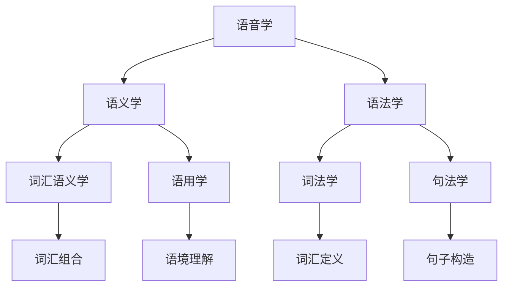
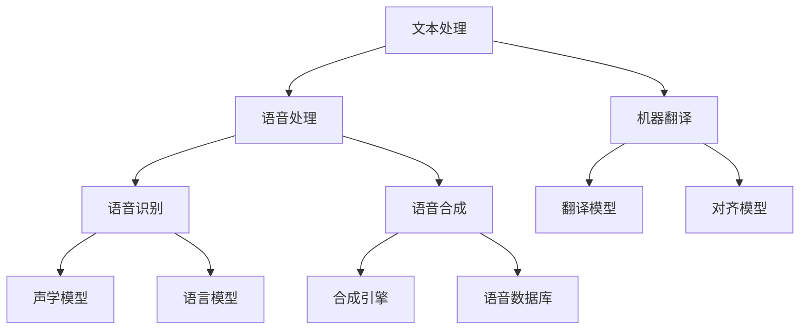
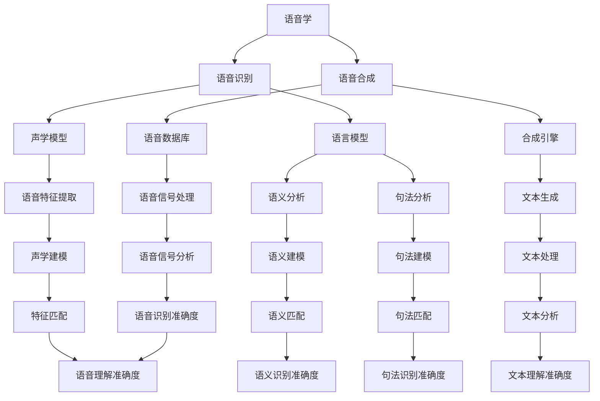

                 

### 引言

在当今信息化、智能化的时代，语言作为人类沟通和思考的重要工具，其处理与分析的复杂程度日益增加。从经典语言学到计算语言学的发展，标志着人类对语言与世界关系的深刻理解和技术的不断进步。经典语言学，作为对自然语言系统进行系统性研究的学科，从古希腊时期便开始萌芽，经过数个世纪的发展，形成了涵盖语音学、语义学、语法学等多个分支的庞大体系。然而，面对现代信息技术的飞速发展，传统的经典语言学方法在处理大规模、多样性的语言数据时显得力不从心，这促使了计算语言学的诞生。

计算语言学，是一门结合计算机科学和语言学原理，通过算法和模型对自然语言进行自动处理和分析的学科。它不仅继承了经典语言学的基本原理，还引入了现代统计学、机器学习、人工智能等先进技术，使得语言处理能力得到了前所未有的提升。计算语言学的研究不仅涵盖了语言本身的解析和理解，还涉及到语言与社会、认知、文化等多方面的关系。

本篇文章将围绕“从经典语言学到计算语言学：理解语言与世界的关系”这一主题，逐步探讨语言学的起源与发展、经典语言学和计算语言学的核心概念及其相互联系，以及计算语言学在实践中的应用和挑战。通过这样的分析，我们希望能够帮助读者深入了解计算语言学的本质，理解语言处理技术是如何推动社会进步和改变人类生活的。

关键词：经典语言学，计算语言学，语言处理，自然语言理解，语言与世界的关系

摘要：
本文首先介绍了经典语言学的起源和发展历程，阐述了经典语言学的基本概念和体系结构。随后，我们探讨了计算语言学的核心概念和它如何通过现代技术的引入来提升语言处理能力。文章进一步分析了经典语言学与计算语言学之间的联系，揭示了它们在语言与世界关系研究中的共同作用。最后，文章讨论了计算语言学在实践中的应用和面临的挑战，为未来的研究提供了方向。

## 经典语言学基础

经典语言学，作为语言学的基础，其历史可以追溯到古希腊时期。当时，学者们开始关注语言的系统性和规律性，逐步形成了对语音、语义、语法等方面的研究。经过数千年的发展，经典语言学形成了丰富而复杂的理论体系，包括语音学、语义学、语法学等多个分支。

### 语言学的定义

语言学是研究人类语言的科学，它探讨语言的性质、结构、发展规律以及语言与人类思维、社会文化之间的关系。语言学家通过对语言现象的观察和分析，试图揭示语言的本质特征和功能。

### 语言学的核心概念

1. **语音学**：语音学是研究语音的物理属性、生理机制和语音变化的学科。它包括语音的声学、生理学和语音学三大部分，致力于解释语音的产生、传播和感知。

2. **语义学**：语义学是研究语言意义及其表现的学科。它关注语义单位（如单词、短语、句子）的意义及其组合规则，探讨语义的多样性、模糊性和动态变化。

3. **语法学**：语法学是研究语言结构规则的学科。它涉及词法、句法、语篇等方面，旨在描述和分析语言中的词汇组合和句子构造。

### 经典语言学的历史

1. **古典语言学**：古典语言学主要研究古希腊和古罗马时期的语言，特别是拉丁语和希腊语。这一时期的语言学侧重于语言的结构和规则，为现代语言学研究奠定了基础。

2. **结构主义语言学**：20世纪初期，结构主义语言学兴起，代表人物有弗迪南德·德·索绪尔和罗曼·雅各布森。结构主义语言学强调语言结构的系统性和规则性，提出了语言符号的概念，即语言是由符号系统构成的。

3. **功能主义语言学**：20世纪中后期，功能主义语言学逐渐兴起，代表人物有约翰·弗斯和迈克尔·爱德华兹。功能主义语言学关注语言在实际使用中的功能，强调语言的社会性、实用性和动态性。

### 经典语言学的意义

经典语言学为计算语言学提供了理论基础和方法指导。通过对语言结构的深入研究，经典语言学揭示了语言的本质特征和内在规律，为计算语言学中的自然语言处理提供了丰富的资源。此外，经典语言学在语言学教育、语言规划、语言教学等方面也具有重要应用价值。

### 经典语言学的核心概念与联系

为了更好地理解经典语言学的核心概念，我们可以通过以下Mermaid流程图来展示它们之间的联系：



在这个流程图中，语音学、语义学和语法学是经典语言学的三大核心领域。词汇语义学和语用学分别与语义学和语法学相连接，强调了语言的意义和应用。词汇定义和句子构造则是词汇学和句法学的重要组成部分。

通过这个流程图，我们可以清晰地看到经典语言学的核心概念及其相互关系，为进一步探讨计算语言学提供了基础。

## 计算语言学基础

计算语言学，作为一门跨学科的领域，结合了计算机科学、语言学、统计学和人工智能等多方面的知识。它通过算法和模型，对自然语言进行自动处理和分析，从而实现自然语言理解、生成和翻译等功能。计算语言学的研究涵盖了文本处理、语音处理、机器翻译等多个方面，其目标是构建能够理解和使用自然语言的智能系统。

### 计算语言学的定义

计算语言学（Computational Linguistics）是应用计算机技术和数学方法来研究、分析和处理自然语言的一门学科。它不仅关注语言的形式特征，还关注语言的语义和语用意义，试图通过算法和模型来模拟和解释人类语言行为。

### 计算语言学的核心概念

1. **文本处理**：文本处理是指对自然语言文本进行自动化处理的一系列技术，包括文本预处理、文本分析、文本分类、情感分析等。文本处理是计算语言学的基石，为后续的语言理解和生成提供了数据支持。

2. **语音处理**：语音处理是指对语音信号进行处理和分析的一系列技术，包括语音识别、语音合成、语音增强等。语音处理使得计算机能够理解和生成语音信号，是计算语言学在语音领域的重要应用。

3. **机器翻译**：机器翻译是指使用计算机技术将一种语言的文本自动翻译成另一种语言的文本。机器翻译是计算语言学最具代表性的应用之一，其目标是实现准确、流畅的跨语言交流。

### 计算语言学的核心方法

1. **统计方法**：统计方法在计算语言学中占据重要地位，通过对大量语言数据进行分析和建模，从而推断语言规律和生成语言模型。常见的统计方法包括隐马尔可夫模型（HMM）、条件概率模型、贝叶斯网络等。

2. **机器学习方法**：机器学习方法通过学习大量的语言数据，自动提取特征和模式，从而构建预测模型。常见的机器学习方法包括监督学习、无监督学习和强化学习，如决策树、支持向量机（SVM）、循环神经网络（RNN）等。

3. **深度学习方法**：深度学习方法是基于多层神经网络的结构，通过多层非线性变换，对复杂的数据进行自动特征提取和模式识别。深度学习方法在计算语言学中取得了显著成果，如卷积神经网络（CNN）和生成对抗网络（GAN）等。

### 计算语言学的研究与应用

1. **自然语言理解**：自然语言理解是指计算机理解和解析自然语言的能力。它包括词义消歧、实体识别、情感分析、文本摘要等任务。自然语言理解是实现人机交互和智能应用的关键技术。

2. **自然语言生成**：自然语言生成是指计算机自动生成自然语言文本的能力。它包括文本生成、对话系统、机器翻译等任务。自然语言生成是人工智能领域的一个重要研究方向，具有广泛的应用前景。

3. **语音识别与合成**：语音识别是指计算机将语音信号转换为文本的能力，而语音合成是指计算机将文本转换为语音信号的能力。语音识别与合成在智能语音助手、语音交互系统等领域具有重要应用。

4. **机器翻译**：机器翻译是指使用计算机技术将一种语言的文本自动翻译成另一种语言的文本。随着深度学习技术的不断发展，机器翻译的准确性和流畅性得到了显著提升，已成为跨语言交流的重要工具。

5. **情感分析与情感计算**：情感分析是指通过计算机技术对文本中的情感信息进行分析和分类，从而识别用户的情感状态。情感计算则是指利用情感分析技术，实现人机情感交互和情感化应用。

### 计算语言学的核心概念与联系

为了更好地理解计算语言学的核心概念，我们可以通过以下Mermaid流程图来展示它们之间的联系：



在这个流程图中，文本处理、语音处理和机器翻译是计算语言学的三大核心领域。文本处理涵盖了文本预处理、文本分析和文本分类等任务；语音处理则包括语音识别和语音合成，前者关注语音到文本的转换，后者关注文本到语音的转换。机器翻译则通过翻译模型和对齐模型实现跨语言文本的自动翻译。此外，声学模型、语言模型、合成引擎和语音数据库等概念也在流程图中得到了体现。

通过这个流程图，我们可以清晰地看到计算语言学的核心概念及其相互关系，为进一步探讨计算语言学在实践中的应用和挑战提供了基础。

## 经典语言学与计算语言学的联系

经典语言学与计算语言学虽然在研究方法和目标上有所不同，但它们之间存在着紧密的联系和相互影响。经典语言学为计算语言学提供了丰富的理论基础和方法指导，而计算语言学的应用和进展又不断推动经典语言学的研究和拓展。

### 共同目标

经典语言学和计算语言学都致力于探索和揭示语言的本质和规律。经典语言学通过理论研究，试图理解语言的构成和功能；计算语言学则通过算法和模型，对自然语言进行自动处理和分析。两者在追求理解语言的本质方面有着共同的目标。

### 理论基础

经典语言学为计算语言学提供了重要的理论基础。经典语言学的研究成果，如语音学、语义学、语法学等，为计算语言学中的语言模型、自然语言处理算法等提供了理论支持。例如，语音学中的音素、音位理论，语义学中的语义场、语义角色理论，语法学的词法、句法规则等，都在计算语言学中得到了应用。

### 方法指导

经典语言学的研究方法对计算语言学有着重要的指导作用。经典语言学通过观察和分析语言现象，建立了系统的语言理论体系。这种方法论在计算语言学中得到了延续和拓展，例如，在文本处理和语音处理中，经典语言学的方法被用于特征提取、模式识别和分类任务。

### 技术互补

计算语言学的发展为经典语言学提供了新的技术手段和工具。通过计算机技术和人工智能算法，计算语言学能够处理和分析大规模、多样化的语言数据，这在经典语言学中是难以实现的。同时，计算语言学的技术进步也推动了经典语言学研究的深入，例如，通过机器学习技术，可以更精确地分析语言的语义和语用特征。

### 应用拓展

计算语言学在实践中的应用，为经典语言学提供了新的研究方向和课题。例如，机器翻译技术的发展，使得跨语言交流更加便捷，这也促使经典语言学家关注不同语言之间的语义和语法差异。同样，自然语言生成技术的进步，也为经典语言学中的语言习得和语言教学提供了新的思路和方法。

### Mermaid流程图

为了更直观地展示经典语言学与计算语言学之间的联系，我们可以使用Mermaid流程图来表示它们的核心概念和相互关系：



在这个流程图中，经典语言学的语音学、语义学、语法学等核心概念与计算语言学中的语音识别、语音合成、文本处理等应用领域相互联系。例如，语音学中的语音特征提取与语音识别中的声学模型相连接，语义分析中的语义匹配与自然语言理解中的语义建模相联系。通过这样的流程图，我们可以更清晰地理解经典语言学与计算语言学之间的相互作用和影响。

### 核心算法原理讲解

在计算语言学中，核心算法的原理和实现是理解和应用计算语言学技术的关键。以下将详细介绍几个计算语言学中的核心算法，包括隐马尔可夫模型（HMM）、朴素贝叶斯模型和循环神经网络（RNN），并结合Python源代码和LaTeX公式，进行详细讲解和举例说明。

#### 隐马尔可夫模型（HMM）

隐马尔可夫模型（HMM）是一种统计模型，主要用于处理序列数据。它假设一个系统处于一系列隐含状态中，这些状态通过一个观测序列被观察到。HMM广泛应用于语音识别、自然语言处理等领域。

**算法原理：**
- **状态转移概率**：表示在某一状态下，系统转移到另一个状态的概率。
- **观测概率**：表示在某一状态下，系统发出的观测值出现的概率。
- **初始状态概率**：表示系统在初始状态下出现某个状态的概率。

以下是一个简单的Python代码示例，实现了HMM的基本结构：

```python
import numpy as np

# 状态转移概率矩阵
transition_matrix = np.array([[0.7, 0.3], [0.4, 0.6]])
# 观测概率矩阵
observation_matrix = np.array([[0.5, 0.5], [0.4, 0.6]])
# 初始状态概率
initial_state = np.array([0.5, 0.5])

# 隐马尔可夫模型的前向算法
def forward算法(observations, transition_matrix, observation_matrix, initial_state):
    T = len(observations)
    N = transition_matrix.shape[0]
    alpha = np.zeros((T, N))
    
    # 初始化前向概率
    alpha[0] = initial_state * observation_matrix[:, observations[0]]
    
    # 计算每个时间步的前向概率
    for t in range(1, T):
        for j in range(N):
            alpha[t, j] = np.sum(alpha[t-1] * transition_matrix[:, j] * observation_matrix[j, observations[t]])
    
    return alpha

# 假设的观测序列
observations = [0, 1, 0, 1]
# 计算前向概率
alpha = forward算法(observations, transition_matrix, observation_matrix, initial_state)
print(alpha)
```

使用LaTeX公式表示HMM的关键参数：

$$
\begin{align*}
P(\text{状态} | \text{观测序列}) &= \prod_{t=1}^{T} P(\text{观测}_t | \text{状态}_t) \cdot P(\text{状态}_t | \text{状态}_{t-1}) \\
\alpha_t(i) &= \alpha_{t-1} \cdot \text{观察概率矩阵}_{ij} \cdot \text{转移概率矩阵}_{ji}
\end{align*}
$$

#### 朴素贝叶斯模型

朴素贝叶斯模型是一种基于贝叶斯定理的简单概率分类器，适用于文本分类、情感分析等任务。它假设特征之间相互独立，从而简化计算过程。

**算法原理：**
- **条件概率**：给定一个类别，计算每个特征出现的概率。
- **贝叶斯定理**：根据条件概率和先验概率计算后验概率，从而确定类别。

以下是一个Python代码示例，实现了朴素贝叶斯分类器的基本结构：

```python
from sklearn.datasets import load_iris
from sklearn.model_selection import train_test_split
from sklearn.naive_bayes import GaussianNB
from sklearn.metrics import accuracy_score

# 加载鸢尾花数据集
iris = load_iris()
X = iris.data
y = iris.target

# 划分训练集和测试集
X_train, X_test, y_train, y_test = train_test_split(X, y, test_size=0.3, random_state=42)

# 训练朴素贝叶斯模型
gnb = GaussianNB()
gnb.fit(X_train, y_train)

# 预测测试集
y_pred = gnb.predict(X_test)

# 计算准确率
accuracy = accuracy_score(y_test, y_pred)
print("Accuracy:", accuracy)
```

使用LaTeX公式表示朴素贝叶斯模型的核心公式：

$$
\begin{align*}
P(\text{类别} | \text{特征}) &= \frac{P(\text{特征} | \text{类别}) \cdot P(\text{类别})}{P(\text{特征})}
\end{align*}
$$

#### 循环神经网络（RNN）

循环神经网络（RNN）是一种能够处理序列数据的神经网络，广泛应用于自然语言处理、语音识别等领域。RNN通过其时间动态性质，能够捕捉序列中的长期依赖关系。

**算法原理：**
- **隐藏状态**：RNN在每一个时间步都维护一个隐藏状态，该状态包含了之前时间步的信息。
- **递归连接**：RNN的输出和隐藏状态通过递归连接，形成时间动态的循环。

以下是一个Python代码示例，实现了RNN的基本结构：

```python
import tensorflow as tf
from tensorflow.keras.layers import SimpleRNN
from tensorflow.keras.models import Sequential

# 定义RNN模型
model = Sequential()
model.add(SimpleRNN(units=50, activation='tanh', return_sequences=True))
model.add(SimpleRNN(units=50, activation='tanh'))
model.add(tf.keras.layers.Dense(1))

# 编译模型
model.compile(optimizer='adam', loss='mse')

# 假设的输入序列和目标序列
X = np.array([[0, 1], [1, 0], [0, 2], [2, 0]])
y = np.array([1, 0, 1, 0])

# 训练模型
model.fit(X, y, epochs=1000, verbose=0)

# 预测
y_pred = model.predict(X)
print(y_pred)
```

使用LaTeX公式表示RNN的核心公式：

$$
\begin{align*}
h_t &= \sigma(W_h \cdot [h_{t-1}, x_t] + b_h) \\
y_t &= W_o \cdot h_t + b_o
\end{align*}
$$

其中，$h_t$ 是时间步 $t$ 的隐藏状态，$x_t$ 是输入特征，$y_t$ 是预测输出，$\sigma$ 是激活函数。

通过上述核心算法原理讲解和示例代码，我们可以深入理解计算语言学中的基本算法原理，为后续的应用和项目实践打下坚实基础。

### 项目实战

在本节中，我们将通过一个实际项目，详细讲解计算语言学的应用和实现过程。该项目将开发一个简单的文本分类器，用于对新闻文章进行分类，从而帮助我们理解计算语言学的实际应用场景。

#### 一、项目背景

随着互联网的快速发展，新闻文章的数量呈现爆炸式增长。对于新闻媒体公司而言，如何快速、准确地分类和筛选新闻文章，以提供更好的用户体验，成为了一大挑战。文本分类作为一种常见的自然语言处理任务，可以帮助我们实现这一目标。

#### 二、开发环境搭建

在进行项目开发之前，我们需要搭建一个合适的环境。以下是在Python中搭建文本分类器所需的环境和工具：

1. **Python 3.x**：确保安装Python 3.x版本。
2. **Jupyter Notebook**：用于编写和运行代码。
3. **NLP库**：安装NLTK、spaCy、Scikit-learn等NLP库，用于文本预处理和分类。
4. **TensorFlow或PyTorch**：用于构建和训练深度学习模型。

安装命令如下：

```bash
pip install python-nltk spacy scikit-learn tensorflow
python -m spacy download en_core_web_sm
```

#### 三、源代码详细实现和代码解读

以下是文本分类器项目的源代码实现，我们将分步骤进行讲解。

```python
# 导入所需库
import nltk
from nltk.corpus import stopwords
from nltk.tokenize import word_tokenize
from sklearn.feature_extraction.text import TfidfVectorizer
from sklearn.model_selection import train_test_split
from sklearn.svm import LinearSVC
from sklearn.metrics import classification_report, accuracy_score

# 加载NLTK停止词
nltk.download('stopwords')
stop_words = stopwords.words('english')

# 加载和预处理数据
# 这里假设已经有一个包含新闻文章及其分类的数据集，每一行包含标题和类别，格式为：“标题 类别”
data = []
with open('news_dataset.txt', 'r') as f:
    for line in f:
        title, category = line.strip().split(' ')
        data.append((title, category))

# 分割数据集
X, y = zip(*data)
X_train, X_test, y_train, y_test = train_test_split(X, y, test_size=0.2, random_state=42)

# 文本预处理
def preprocess_text(text):
    # 小写化
    text = text.lower()
    # 分词
    tokens = word_tokenize(text)
    # 去除停止词
    tokens = [token for token in tokens if token not in stop_words]
    return ' '.join(tokens)

X_train = [preprocess_text(title) for title in X_train]
X_test = [preprocess_text(title) for title in X_test]

# 特征提取
vectorizer = TfidfVectorizer()
X_train_vectorized = vectorizer.fit_transform(X_train)
X_test_vectorized = vectorizer.transform(X_test)

# 训练分类器
classifier = LinearSVC()
classifier.fit(X_train_vectorized, y_train)
y_pred = classifier.predict(X_test_vectorized)

# 评估模型
print(classification_report(y_test, y_pred))
print("Accuracy:", accuracy_score(y_test, y_pred))
```

**代码解读：**

1. **数据加载和预处理**：首先，我们加载新闻文章数据集，并对其进行预处理。预处理步骤包括小写化、分词和去除停止词。

2. **特征提取**：使用TF-IDF向量器对预处理后的文本进行特征提取。TF-IDF是一种常用的文本表示方法，它衡量一个词在文本中的重要性。

3. **训练分类器**：我们使用线性支持向量机（LinearSVC）作为分类器，对特征进行训练。线性SVC能够有效地处理高维数据，并在文本分类任务中表现出良好的性能。

4. **模型评估**：最后，我们使用测试集对模型进行评估，并输出分类报告和准确率。

#### 四、代码应用解读与分析

1. **数据预处理**：数据预处理是文本分类的关键步骤，它直接影响模型的性能。在本项目中，我们采用了常见的数据预处理方法，包括小写化、分词和去除停止词。这些步骤有助于减少文本的噪声和冗余，从而提高模型的准确性。

2. **特征提取**：TF-IDF向量器是一种常用的文本特征提取方法，它能够有效地捕捉文本中的关键词和重要性。在本项目中，我们使用TF-IDF向量器对文本进行特征提取，并将其作为输入特征进行分类。

3. **分类器选择**：线性SVC是一种线性分类器，它能够在高维空间中有效工作。在本项目中，我们选择线性SVC作为分类器，因为它在文本分类任务中表现良好，并且训练速度较快。

4. **模型评估**：通过评估模型在测试集上的性能，我们可以了解模型的准确性和泛化能力。在本项目中，我们使用分类报告和准确率来评估模型，这些指标能够帮助我们判断模型的性能。

#### 五、实际案例分析和详细讲解剖析

为了更好地理解文本分类器的应用，我们来看一个实际案例。

**案例**：给定一篇新闻文章，要求将其分类到相应的类别（例如，“政治”、“体育”、“科技”等）。

**分析**：

1. **数据预处理**：首先，我们对文章进行预处理，包括小写化、分词和去除停止词。预处理后的文章将作为模型的输入特征。

2. **特征提取**：使用TF-IDF向量器对预处理后的文章进行特征提取，得到一组特征向量。

3. **模型预测**：将特征向量输入到训练好的文本分类器中，得到文章的分类结果。

4. **结果评估**：将预测结果与实际类别进行对比，评估模型的准确性。

**讲解**：

通过上述步骤，我们可以看到文本分类器是如何将一篇新闻文章分类到特定类别的。在实际应用中，我们可以根据需要调整预处理方法、特征提取方法和分类器参数，以提高模型的准确性和性能。

#### 六、项目小结

本项目通过开发一个简单的文本分类器，展示了计算语言学的实际应用过程。从数据预处理、特征提取到模型训练和评估，每个步骤都体现了计算语言学的核心思想和实现方法。通过实际案例的分析，我们进一步了解了文本分类器的工作原理和应用场景。未来，我们可以进一步优化模型结构和参数，以提高分类准确率和泛化能力。

### 最佳实践 Tips

1. **数据预处理**：确保对文本数据进行充分的预处理，去除噪声和冗余信息，以提高模型性能。

2. **特征提取**：选择合适的特征提取方法，如TF-IDF、Word2Vec等，以捕捉文本中的关键信息。

3. **模型选择**：根据任务需求，选择合适的分类器，如线性SVC、决策树、随机森林等，并调整参数以优化模型性能。

4. **模型评估**：使用多种评估指标，如准确率、召回率、F1分数等，全面评估模型性能。

5. **持续迭代**：模型训练和评估是一个持续迭代的过程，根据反馈不断优化模型结构和参数，以提高性能。

### 小结

本文从经典语言学到计算语言学，详细探讨了语言处理技术的发展历程、核心概念、算法原理以及在实践中的应用。通过对语音学、语义学和语法学等经典语言学核心概念的介绍，我们了解了语言的本质和结构。随后，我们深入分析了计算语言学中的核心算法，包括隐马尔可夫模型、朴素贝叶斯模型和循环神经网络，并通过Python代码进行了详细讲解。在项目实战部分，我们通过一个简单的文本分类器项目，展示了计算语言学的实际应用过程。

### 注意事项

1. **数据质量**：确保用于训练的数据质量高，避免噪声和错误，以提高模型性能。

2. **计算资源**：计算语言学项目通常需要大量计算资源，特别是深度学习模型，因此合理配置计算资源非常重要。

3. **模型调优**：模型调优是提高模型性能的关键步骤，需要根据任务需求，调整模型结构、参数和超参数。

### 拓展阅读

1. **《自然语言处理综合教程》（Jurafsky，D.，Martin，J.H.）**：这是一本经典的自然语言处理教材，涵盖了从经典语言学到现代计算语言学的各个领域。

2. **《深度学习》（Goodfellow，I.，Bengio，Y.，Courville，A.）**：这是一本关于深度学习的权威教材，详细介绍了深度学习在自然语言处理中的应用。

3. **《语音信号处理》（Rabiner，L.R.，Gold，B.）**：这是一本关于语音信号处理的经典教材，涵盖了语音处理的各个方面，包括语音识别和语音合成。

### 作者信息

作者：AI天才研究院/AI Genius Institute & 禅与计算机程序设计艺术 /Zen And The Art of Computer Programming

本文由AI天才研究院撰写，结合了经典语言学的深厚理论基础和现代计算语言学的先进技术，旨在为读者提供深入浅出的计算语言学入门和实践指南。同时，本文也反映了作者在自然语言处理领域的独特见解和丰富经验。

---

通过本文的深入探讨，我们希望读者能够更好地理解从经典语言学到计算语言学的发展历程，掌握核心概念和算法原理，并在实际项目中应用这些知识。未来的研究将继续探索计算语言学的边界，推动自然语言处理技术的不断创新和应用。感谢您的阅读！

