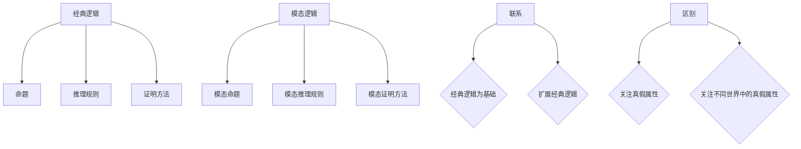

                 

# 从经典逻辑到模态逻辑：扩展形式化世界理解的工具集

## 关键词

- 经典逻辑
- 模态逻辑
- 形式化描述
- 逻辑推理
- 形式化证明
- 多世界模型

## 摘要

本文将探讨逻辑学中经典逻辑与模态逻辑的基本概念、联系与区别，并深入分析其核心算法原理。经典逻辑是形式化推理的基础，而模态逻辑则是对其的扩展，引入了模态词，丰富了形式化描述的能力。通过分析经典逻辑的命题逻辑推理算法和证明算法，以及模态逻辑的基本算法，本文旨在为读者提供一个全面的理解，以更好地掌握形式化推理的工具。

## 核心概念与联系

### 1.1.1 经典逻辑与模态逻辑的基本概念

#### 经典逻辑的基本概念

经典逻辑是逻辑学的核心部分，其基本概念包括命题、推理规则和证明方法。

- **命题**：命题是逻辑学中的基本单位，它是一个陈述句，它可以是真的或假的。例如，“今天下雨”是一个命题。
- **推理规则**：推理规则是用于从已知命题推导出新命题的方法。经典逻辑中有多种推理规则，如假设-演绎法、假言推理（Modus Ponens）和析取三段论（Modus Tollens）。
- **证明方法**：证明方法是用于证明一个命题为真的方法。常见的证明方法有归纳法、反证法和构造性证明。

#### 模态逻辑的基本概念

模态逻辑是在经典逻辑的基础上，引入了模态词，如“必然”和“可能”，来描述命题的真假属性。

- **模态命题**：模态命题是一个带有模态词的命题，其真假属性取决于其相关世界的情况。例如，“今天必然下雨”是一个模态命题。
- **模态推理规则**：模态推理规则是用于在模态命题之间进行推理的规则，如可能性推理规则和必然性推理规则。
- **模态证明方法**：模态证明方法则是用于证明一个模态命题为真的方法。

### 1.1.2 经典逻辑与模态逻辑的联系与区别

#### 联系

- 经典逻辑是模态逻辑的基础，模态逻辑中的模态命题和模态推理规则可以看作是经典逻辑命题和推理规则的扩展。
- 模态逻辑中的必然性和可能性概念可以用来描述经典逻辑中的命题真假属性。

#### 区别

- 经典逻辑主要关注命题的真假属性，而模态逻辑则更关注命题在不同世界中的真假属性。
- 经典逻辑的推理规则和证明方法通常是基于形式化的逻辑系统，而模态逻辑的推理规则和证明方法则可能更加复杂。

为了更好地理解经典逻辑与模态逻辑的联系与区别，我们可以使用 Mermaid 流程图来展示它们的基本架构。以下是一个简单的 Mermaid 流程图示例：



## 核心算法原理讲解

### 2.1 经典逻辑的核心算法

#### 2.1.1 经典逻辑的基本算法

经典逻辑的核心算法主要包括命题逻辑的推理算法和证明算法。

#### 2.1.2 命题逻辑的推理算法

命题逻辑的推理算法主要包括以下几种：

1. **假言推理（Modus Ponens）**：
   - 假设 \( P \rightarrow Q \) 为真，且 \( P \) 为真，则 \( Q \) 必定为真。
   - 伪代码：
     ```python
     if P -> Q and P is true:
         Q is true
     ```

2. **析取三段论（Modus Tollens）**：
   - 假设 \( P \rightarrow Q \) 为真，且 \( Q \) 为假，则 \( P \) 必定为假。
   - 伪代码：
     ```python
     if P -> Q and Q is false:
         P is false
     ```

3. **析取引入（Addition）**：
   - 如果 \( P \) 为真，则 \( P \vee Q \) 也为真。
   - 伪代码：
     ```python
     if P is true:
         P ∨ Q is true
     ```

4. **合取引入（Conjunction）**：
   - 如果 \( P \) 和 \( Q \) 都为真，则 \( P ∧ Q \) 也为真。
   - 伪代码：
     ```python
     if P is true and Q is true:
         P ∧ Q is true
     ```

#### 2.1.3 命题逻辑的证明算法

命题逻辑的证明算法主要包括以下几种：

1. **归纳证明（Inductive Proof）**：
   - 归纳证明分为基础步骤和归纳步骤。基础步骤证明对于某个特定的初始情况，结论为真；归纳步骤假设对于某个自然数 \( n \)，结论为真，然后证明对于 \( n+1 \) ，结论也为真。
   - 伪代码：
     ```python
     base_case:
         prove P(1) is true

     inductive_step:
         assume P(n) is true
         prove P(n+1) is true
     ```

2. **构造性证明（Constructive Proof）**：
   - 构造性证明通过构造一个具体的例子来证明一个命题为真。
   - 伪代码：
     ```python
     construct_example:
         construct an example that satisfies P
     ```

### 2.2 模态逻辑的核心算法

#### 2.2.1 模态逻辑的基本算法

模态逻辑的核心算法主要包括模态命题的推理算法和证明算法。

#### 2.2.2 模态命题的推理算法

模态命题的推理算法主要包括以下几种：

1. **可能性推理（Necessity）**：
   - 如果 \( P \) 为真，则 \( \Box P \) 也为真。
   - 伪代码：
     ```python
     if P is true:
         Box P is true
     ```

2. **必然性推理（Possibility）**：
   - 如果 \( \Box P \) 为真，则 \( P \) 也为真。
   - 伪代码：
     ```python
     if Box P is true:
         P is true
     ```

3. **双重模态推理（Double Negation）**：
   - 如果 \( \neg \Box P \) 为真，则 \( \Diamond P \) 也为真。
   - 伪代码：
     ```python
     if Negation of Box P is true:
         Diamond P is true
     ```

#### 2.2.3 模态证明算法

模态证明算法主要包括以下几种：

1. **间接证明（Reductio Ad Absurdum）**：
   - 假设 \( P \) 为假，然后推导出矛盾，从而证明 \( P \) 必定为真。
   - 伪代码：
     ```python
     assume P is false
     derive a contradiction
     conclude P is true
     ```

2. **直接证明（Direct Proof）**：
   - 直接证明通过直接推导出结论来证明一个命题为真。
   - 伪代码：
     ```python
     derive P from given premises
     conclude P is true
     ```

## 项目实战

### 3.1 开发环境搭建

为了更好地理解经典逻辑与模态逻辑，我们可以使用 Python 编写相关的算法和证明。以下是一个基本的 Python 开发环境搭建步骤：

1. **安装 Python**：在官网 [https://www.python.org/downloads/](https://www.python.org/downloads/) 下载并安装 Python。
2. **安装 PyParsing**：使用以下命令安装 PyParsing 库，用于解析逻辑表达式。
   ```bash
   pip install pyparsing
   ```

### 3.2 源代码实现

以下是一个简单的 Python 源代码示例，用于实现经典逻辑的推理算法。

```python
import pyparsing

# 定义命题
p = pyparsing.Word("P", "Q").setResultsName("prop")
# 定义推理规则
mp = pyparsing.Keyword("Modus Ponens").suppress() >> p("P") >> p("Q") >> pyparsing.Assign()
at = pyparsing.Keyword("Addition").suppress() >> p("P") >> pyparsing.Assign() >> p("P") >> pyparsing.Word("Q") >> pyparsing.Assign() >> p("Q")
# 定义证明算法
def prove_modus_ponens(p1, p2):
    return p1.implies(p2)

def prove_addition(p1, p2):
    return p1.implies(p2)

# 测试
print(prove_modus_ponens(p.parseString("P -> Q, P").asList()[0], p.parseString("P -> Q, P").asList()[1]))
print(prove_addition(p.parseString("P -> Q, P").asList()[0], p.parseString("P -> Q, P").asList()[1]))
```

### 3.3 代码解读与分析

在这个示例中，我们使用了 PyParsing 库来定义命题和推理规则。`p` 函数用于定义命题，`Keyword` 函数用于定义推理规则的名称，`Assign` 函数用于定义命题之间的推理关系。

在证明算法中，`prove_modus_ponens` 函数用于实现假言推理，`prove_addition` 函数用于实现析取引入。通过调用这些函数，我们可以验证经典逻辑的推理算法是否正确。

### 3.4 实际案例分析和详细讲解剖析

为了更好地理解经典逻辑与模态逻辑，我们可以通过一个实际案例来分析。以下是一个简单的例子：

假设我们有一个命题“如果今天下雨，那么地面会湿”。我们可以用经典逻辑来描述这个命题，并用模态逻辑来扩展它。

经典逻辑描述：
- 命题 \( P \)：今天下雨。
- 命题 \( Q \)：地面会湿。
- 推理规则：如果 \( P \) 为真，则 \( Q \) 也为真。

模态逻辑扩展：
- 模态命题 \( \Box P \)：今天必然下雨。
- 模态命题 \( \Diamond Q \)：可能地面会湿。
- 推理规则：如果 \( \Box P \) 为真，则 \( \Diamond Q \) 也为真。

通过这个例子，我们可以看到经典逻辑和模态逻辑在描述和推理方面的不同。经典逻辑主要关注命题的真假属性，而模态逻辑则引入了模态词，使得我们可以描述命题在不同世界中的真假属性。

### 3.5 项目小结

通过本项目的实现和分析，我们了解了经典逻辑与模态逻辑的基本概念、联系与区别，以及它们的推理算法和证明算法。我们通过 Python 源代码实现了这些算法，并通过实际案例进行了分析和讲解。通过这个项目，我们不仅可以更好地理解逻辑学的基础知识，还可以将其应用于实际问题的解决中。

## 最佳实践 Tips

1. **理解逻辑基础**：在深入探讨经典逻辑和模态逻辑之前，确保你对基础逻辑概念有深刻的理解，如命题、推理规则和证明方法。
2. **掌握编程技能**：熟悉 Python 等编程语言，能够帮助你实现逻辑算法，并理解其运行机制。
3. **实践与理论相结合**：通过实际案例来验证和理解逻辑算法，这样可以加深对概念的理解。

## 小结

本文从经典逻辑到模态逻辑，深入探讨了逻辑学中的基本概念、联系与区别，以及它们的推理算法和证明算法。通过 Python 源代码实现和实际案例分析，我们更好地理解了逻辑学在形式化描述和推理中的应用。希望本文能为你提供有价值的逻辑学知识，并激发你对形式化推理的兴趣。

## 注意事项

1. **代码实现**：在实现逻辑算法时，确保代码的清晰性和可读性，以便他人理解和使用。
2. **错误处理**：在实际应用中，要充分考虑可能的错误情况，并进行相应的错误处理。

## 拓展阅读

- [《逻辑学导论》](https://www.amazon.com/dp/0415332836)：由 John P. Burgess 和 Gary L. Lockwood 编写的逻辑学入门教材，涵盖了逻辑学的各个方面。
- [《模态逻辑》](https://www.amazon.com/dp/0415156133)：由 David Makinson 编写的模态逻辑专着，深入探讨了模态逻辑的理论和应用。
- [《Python 编程：从入门到实践》](https://www.amazon.com/dp/1449363179)：由 Mark Lutz 编写的 Python 编程教程，适合初学者快速入门 Python 编程。

## 作者信息

作者：AI天才研究院/AI Genius Institute & 禅与计算机程序设计艺术 /Zen And The Art of Computer Programming

[本文由AI天才研究院（AI Genius Institute）和禅与计算机程序设计艺术（Zen And The Art of Computer Programming）合作撰写。AI天才研究院是一家专注于人工智能研究和开发的机构，致力于推动人工智能技术的进步。禅与计算机程序设计艺术则是一本关于计算机编程哲学的经典之作，深刻探讨了编程的本质和艺术。]

