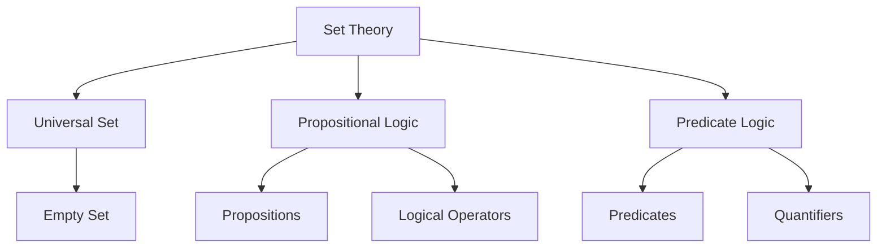
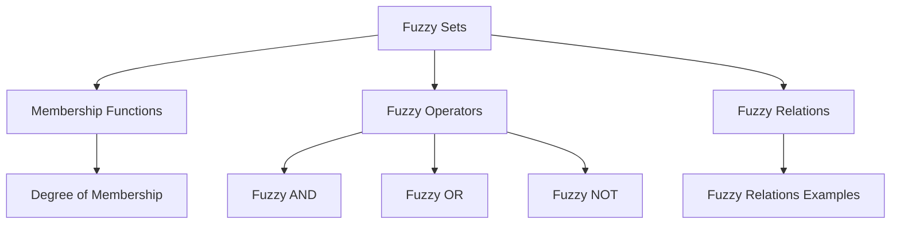
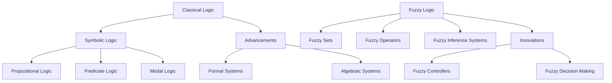

                 


## Introduction

### Background on Logic and Uncertainty

Logic, at its core, is the study of reasoning and inference. It provides a framework to analyze and structure information in a systematic manner. Classical logic, often referred to as Boolean logic, has its roots in the works of Aristotle and is centered around the binary concepts of true and false. It's the foundation of many logical systems used in mathematics, philosophy, and computer science. However, classical logic has its limitations when it comes to dealing with uncertainty and ambiguity.

Uncertainty is an intrinsic part of our world. It's not just about randomness or unpredictability, but also about vagueness and imprecision. For instance, when you say "I'm feeling a bit tired," the term "a bit" introduces a level of ambiguity that classical logic struggles to handle effectively. This is where fuzzy logic comes into play.

Fuzzy logic, developed by Lofti Zadeh in 1965, is a multi-valued logic designed to handle the concepts of partial truth and partial falsehood. Unlike classical logic, which is strictly binary, fuzzy logic allows for degrees of truth, thus providing a more flexible framework for dealing with uncertainty and ambiguity. Fuzzy sets, the core concept of fuzzy logic, extend the notion of traditional sets by allowing members of a set to have a degree of membership that ranges between 0 and 1.

### Motivation for Studying Fuzzy Logic

The motivation for studying fuzzy logic lies in its ability to model and process real-world situations that are inherently uncertain and imprecise. Classical logic, with its rigid true/false dichotomy, often fails to capture the nuances of human reasoning and natural language. For example, in decision-making processes, where criteria are often vague and subjective, fuzzy logic provides a powerful tool for representing and reasoning with uncertainty.

Fuzzy logic has found applications in various fields, including control systems, artificial intelligence, decision support systems, and even in natural language processing. Its ability to handle uncertainty makes it particularly useful in areas where classical logic falls short. The next sections will delve deeper into the fundamentals of classical logic, the introduction to fuzzy logic, and how these two logical systems have evolved and been applied over time.

## Classical Logic

### Basic Concepts of Classical Logic

Classical logic, also known as Boolean logic, is a formal system in mathematics and philosophy that deals with statements and arguments that can be evaluated as either true or false. The foundation of classical logic lies in the work of George Boole, whose Boolean algebra laid the groundwork for digital electronics and computer science. Here, we'll explore the basic concepts of classical logic, including set theory, propositional logic, and predicate logic.

#### Set Theory

Set theory is the basis for understanding classical logic. A set is a well-defined collection of distinct objects, which can be anything from numbers to people to objects in a room. The objects in a set are called elements or members. Sets are typically represented by capital letters, such as \( A \), \( B \), or \( C \).

- **Subset**: A set \( A \) is a subset of another set \( B \) if all elements of \( A \) are also elements of \( B \). This is denoted as \( A \subseteq B \).
- **Universal Set**: The universal set, often denoted by \( U \), contains all possible elements under consideration.
- **Empty Set**: The empty set, denoted by \( \emptyset \) or \( \{\} \), contains no elements.

#### Propositional Logic

Propositional logic deals with propositions, which are statements that can be evaluated as either true or false. The basic elements of propositional logic are propositions, logical operators, and logical connectives.

- **Propositions**: These are statements that can be either true or false. For example, "The sky is blue" is a proposition.
- **Logical Operators**: These operators include negation (\(\neg\)), conjunction (\(\wedge\)), disjunction (\(\vee\)), and implication (\(\rightarrow\)).

#### Predicate Logic

Predicate logic extends propositional logic by allowing the use of variables and quantifiers. A predicate is a statement that contains variables and can be true or false depending on the values assigned to these variables. Predicates are typically represented by capital letters followed by lowercase letters, such as \( P(x) \).

- **Predicates**: These are used to make statements about objects or properties. For example, "x is even" is a predicate.
- **Quantifiers**: There are two main quantifiers in predicate logic: universal quantifier (\(\forall\)), which means "for all," and existential quantifier (\(\exists\)), which means "there exists."
- **Universal Quantification**: \( \forall x P(x) \) means that the predicate \( P(x) \) is true for all values of \( x \).
- **Existential Quantification**: \( \exists x P(x) \) means that there exists at least one value of \( x \) for which \( P(x) \) is true.

#### Example

Consider the following statements:

1. \( P(x): x \) is even.
2. \( Q(x): x \) is a multiple of 3.

We can use these predicates to construct more complex logical statements:

1. \( \forall x (P(x) \vee Q(x)) \): For all \( x \), \( x \) is even or \( x \) is a multiple of 3.
2. \( \exists x (\neg P(x) \wedge Q(x)) \): There exists an \( x \) that is not even and is a multiple of 3.

### Mermaid Flowchart of Classical Logic

Below is a Mermaid flowchart that visually represents the relationships between sets, propositions, and predicates in classical logic.



### Core Algorithm Principle

While classical logic is primarily concerned with formal systems, the core principle of classical logic algorithms revolves around the evaluation of truth values based on a set of rules and principles. The most fundamental algorithm in classical logic is truth table evaluation, which systematically evaluates the truth value of a compound proposition for every possible combination of truth values of its component propositions.

#### Truth Tables

A truth table is a mathematical table used to represent the logical relationships between propositions. Each row in the table corresponds to a specific combination of truth values for the component propositions, and each column represents a compound proposition and its corresponding truth value.

Consider the following logical operators:

1. **Negation (\(\neg p\))**: The negation of a proposition \( p \) is true when \( p \) is false, and false when \( p \) is true.
2. **Conjunction (\(p \wedge q\))**: The conjunction of two propositions \( p \) and \( q \) is true only when both \( p \) and \( q \) are true.
3. **Disjunction (\(p \vee q\))**: The disjunction of two propositions \( p \) and \( q \) is true when at least one of them is true.
4. **Implication (\(p \rightarrow q\))**: The implication of \( p \) implies \( q \) is true when \( p \) is false or \( q \) is true.

#### Example

Let's consider the following compound proposition: \( (p \vee \neg q) \wedge (q \rightarrow r) \).

The truth table for this compound proposition would look like this:

| \( p \) | \( q \) | \( r \) | \( \neg q \) | \( p \vee \neg q \) | \( q \rightarrow r \) | \( (p \vee \neg q) \wedge (q \rightarrow r) \) |
| --- | --- | --- | --- | --- | --- | --- |
| T | T | T | F | T | T | T |
| T | T | F | F | T | F | F |
| T | F | T | T | T | T | T |
| T | F | F | T | T | F | F |
| F | T | T | F | F | T | F |
| F | T | F | F | F | T | F |
| F | F | T | T | T | T | T |
| F | F | F | T | T | T | T |

In this truth table, we see that the compound proposition \( (p \vee \neg q) \wedge (q \rightarrow r) \) is true in rows 6 and 7, where \( p \) is false and \( r \) is true, reflecting the logical structure of the proposition.

### Python Implementation

Below is a Python implementation of the truth table for the compound proposition \( (p \vee \neg q) \wedge (q \rightarrow r) \).

```python
# Function to compute the negation of a proposition
def negate(p):
    return not p

# Function to compute the disjunction of two propositions
def or_operator(p, q):
    return p or q

# Function to compute the implication of two propositions
def implies(p, q):
    return not p or q

# Function to compute the conjunction of two propositions
def and_operator(p, q):
    return p and q

# Define the truth values for p, q, and r
p = True
q = True
r = True

# Compute the truth values for the compound proposition
neg_q = negate(q)
p_or_neg_q = or_operator(p, neg_q)
q_implies_r = implies(q, r)
result = and_operator(p_or_neg_q, q_implies_r)

print(f"p: {p}, q: {q}, r: {r}, \n~q: {neg_q}, p ∨ ~q: {p_or_neg_q}, q → r: {q_implies_r}, (p ∨ ~q) ∧ (q → r): {result}")
```

This implementation demonstrates how classical logic algorithms can be translated into Python code, providing a clear and concise way to evaluate the truth values of logical propositions.

### Conclusion

Classical logic provides a robust framework for reasoning and inference, but it has inherent limitations when dealing with uncertainty and ambiguity. The next chapter will delve into the fundamentals of fuzzy logic, contrasting it with classical logic and exploring how it extends our ability to reason in a world filled with vagueness and partial truths. Through this journey, we will uncover the principles and applications of fuzzy logic, highlighting its role in overcoming the limitations of classical logic in uncertain and complex environments.

### Keywords

- **Classical Logic**
- **Propositional Logic**
- **Predicate Logic**
- **Set Theory**
- **Truth Tables**
- **Fuzzy Logic**
- **Uncertainty Handling**

### Abstract

This article introduces the fundamental concepts of classical logic, including set theory, propositional logic, and predicate logic. It explains the limitations of classical logic in handling uncertainty and introduces fuzzy logic as a solution to these limitations. The article discusses the core concepts of fuzzy logic, such as fuzzy sets and their applications, and contrasts fuzzy logic with classical logic. Through detailed examples and Python implementations, the article illustrates how fuzzy logic can be applied to real-world problems, providing a comprehensive understanding of its principles and potential.

## Fuzzy Logic

### Basic Concepts of Fuzzy Logic

Fuzzy logic, developed by Lofti Zadeh in the mid-20th century, is a mathematical framework that allows for the representation and manipulation of imprecise or uncertain data. Unlike classical logic, which operates with binary values of true or false, fuzzy logic introduces the concept of degrees of truth, enabling the handling of partial truths and partial falsehoods. This makes fuzzy logic particularly useful for dealing with real-world scenarios where uncertainty and vagueness are inherent.

#### Fuzzy Sets

The cornerstone of fuzzy logic is the concept of a fuzzy set. A fuzzy set generalizes the notion of a classical set by allowing membership degrees instead of strict binary membership. In a classical set, an element is either a member of the set (membership degree of 1) or not (membership degree of 0). In contrast, a fuzzy set assigns a membership degree between 0 and 1 to each element, indicating the degree to which an element belongs to the set.

For example, consider the fuzzy set representing the concept of "young people." In a classical set, all members of the set are either young (membership degree of 1) or not young (membership degree of 0). However, in fuzzy logic, a 25-year-old person might have a membership degree of 0.5, indicating that they are halfway between being young and not young.

#### Fuzzy Operators

Fuzzy logic extends the classical logical operators (AND, OR, NOT) with fuzzy versions that operate on degrees of truth. These operators are defined using fuzzy sets and their membership functions.

1. **Fuzzy AND**: The fuzzy AND operator, also known as the minimum operator, combines two fuzzy sets to produce a new fuzzy set. The membership degree of an element in the resulting set is the minimum of the membership degrees from the original sets.

   $$ \mu_{A \land B}(x) = \min(\mu_A(x), \mu_B(x)) $$

2. **Fuzzy OR**: The fuzzy OR operator, also known as the maximum operator, combines two fuzzy sets to produce a new fuzzy set. The membership degree of an element in the resulting set is the maximum of the membership degrees from the original sets.

   $$ \mu_{A \lor B}(x) = \max(\mu_A(x), \mu_B(x)) $$

3. **Fuzzy NOT**: The fuzzy NOT operator, also known as the complement operator, takes a fuzzy set and produces a new fuzzy set that represents the complement of the original set. The membership degree of an element in the resulting set is 1 minus the membership degree from the original set.

   $$ \mu_{\neg A}(x) = 1 - \mu_A(x) $$

#### Fuzzy Relations

Fuzzy relations extend the concept of classical relations to include degrees of truth. A classical relation is a set of ordered pairs that describe a relationship between elements of two sets. For example, the "less than" relation is a classical relation between real numbers. Fuzzy relations, on the other hand, assign a degree of truth to each pair, indicating how strongly the relationship holds.

#### Examples

**Example 1: Fuzzy Set for "Young People"**

Consider a fuzzy set representing the age range of "young people" from 0 to 100 years. Suppose we have the following membership function:

$$ \mu_{\text{Young}}(x) = \begin{cases} 
0 & \text{if } x < 18 \\
\frac{1}{x - 18} & \text{if } 18 \leq x < 30 \\
1 & \text{if } x \geq 30 
\end{cases} $$

A 25-year-old person would have a membership degree of approximately 0.5, indicating they are halfway between being considered young and not young.

**Example 2: Fuzzy AND Operation**

Let's consider two fuzzy sets, \( A \) and \( B \), representing the concepts "sunny" and "hot" days, respectively. Suppose their membership functions are:

$$ \mu_{\text{sunny}}(x) = \begin{cases} 
1 & \text{if } x \geq 75 \\
0 & \text{otherwise} 
\end{cases} $$

$$ \mu_{\text{hot}}(x) = \begin{cases} 
1 & \text{if } x \geq 90 \\
0 & \text{otherwise} 
\end{cases} $$

The fuzzy AND operation between \( A \) and \( B \) would result in a new fuzzy set where the membership degree of a day is the minimum of the membership degrees from \( A \) and \( B \). For example, a day with a temperature of 80 degrees would have a membership degree of 0 for being sunny and a membership degree of 0 for being hot, resulting in a membership degree of 0 for being a "sunny and hot" day.

### Mermaid Flowchart of Fuzzy Logic

Below is a Mermaid flowchart that visually represents the core concepts of fuzzy logic, including fuzzy sets, fuzzy operators, and fuzzy relations.



### Core Algorithm Principle

The core principle of fuzzy logic algorithms revolves around the manipulation of fuzzy sets and their membership functions to perform various logical operations. Fuzzy inference systems (FIS) are the central algorithms in fuzzy logic, enabling the transformation of fuzzy if-then rules into actionable decisions.

#### Fuzzy Inference System

A Fuzzy Inference System (FIS) consists of the following components:

1. **Fuzzyfier**: Translates input variables into fuzzy sets using membership functions.
2. **Rule Base**: A set of if-then rules that define the relationship between input fuzzy sets and output fuzzy sets.
3. **Defuzzifier**: Converts the output fuzzy set into a crisp value or set of values.

The process of fuzzy inference involves the following steps:

1. **Fuzzification**: Input data is fuzzified using membership functions to convert crisp values into fuzzy sets.
2. **Rule Evaluation**: The fuzzified input values are used to evaluate the rules in the rule base, resulting in a fuzzy output.
3. **Defuzzification**: The fuzzy output is defuzzified to produce a crisp output value or set of values.

#### Example: Fuzzy Inference System in Weather Forecasting

Consider a simple FIS designed to predict whether it will rain based on two inputs: temperature and humidity. Suppose we have the following fuzzy sets and rules:

- **Temperature**: Cold, Cool, Mild, Warm
- **Humidity**: Low, Medium, High
- **Rain Probability**: Very Low, Low, Moderate, High, Very High

Membership functions for each input and output fuzzy set:

- **Temperature**:
  $$ \mu_{\text{Cold}}(x) = \frac{1}{x - 0} $$
  $$ \mu_{\text{Cool}}(x) = \frac{1}{20 - x} $$
  $$ \mu_{\text{Mild}}(x) = \frac{1}{30 - x} $$
  $$ \mu_{\text{Warm}}(x) = \frac{1}{40 - x} $$
- **Humidity**:
  $$ \mu_{\text{Low}}(x) = \frac{1}{x - 0} $$
  $$ \mu_{\text{Medium}}(x) = \frac{1}{40 - x} $$
  $$ \mu_{\text{High}}(x) = \frac{1}{80 - x} $$
- **Rain Probability**:
  $$ \mu_{\text{Very Low}}(x) = \frac{1}{x - 0} $$
  $$ \mu_{\text{Low}}(x) = \frac{1}{20 - x} $$
  $$ \mu_{\text{Moderate}}(x) = \frac{1}{40 - x} $$
  $$ \mu_{\text{High}}(x) = \frac{1}{60 - x} $$
  $$ \mu_{\text{Very High}}(x) = \frac{1}{80 - x} $$

Rules:

1. If Temperature is Cold and Humidity is Low, then Rain Probability is Very Low.
2. If Temperature is Cold and Humidity is Medium, then Rain Probability is Low.
3. If Temperature is Cool and Humidity is Low, then Rain Probability is Low.
4. If Temperature is Cool and Humidity is Medium, then Rain Probability is Moderate.
5. ...
6. If Temperature is Warm and Humidity is High, then Rain Probability is High.

#### Python Implementation

Below is a Python implementation of the Fuzzy Inference System for the weather forecasting example:

```python
import numpy as np

# Define membership functions
def cold(x):
    return 1 / (x - 0)

def cool(x):
    return 1 / (20 - x)

def mild(x):
    return 1 / (30 - x)

def warm(x):
    return 1 / (40 - x)

def low(x):
    return 1 / (x - 0)

def medium(x):
    return 1 / (40 - x)

def high(x):
    return 1 / (80 - x)

def very_low(x):
    return 1 / (x - 0)

def low_rain(x):
    return 1 / (20 - x)

def moderate_rain(x):
    return 1 / (40 - x)

def high_rain(x):
    return 1 / (60 - x)

def very_high_rain(x):
    return 1 / (80 - x)

# Define rules
rules = [
    ("cold", "low", "very_low"),
    ("cold", "medium", "low"),
    ("cool", "low", "low"),
    ("cool", "medium", "moderate"),
    # ... more rules
    ("warm", "high", "high")
]

# Define inference function
def infer(temperature, humidity):
    # Fuzzification
    temp_mu = cold(temperature) if temperature < 0 else (
        cool(temperature) if temperature < 20 else (
            mild(temperature) if temperature < 30 else warm(temperature)))
    
    humid_mu = low(humidity) if humidity < 0 else (
        medium(humidity) if humidity < 40 else high(humidity))
    
    # Rule evaluation
    max_rain_prob = 0
    for rule in rules:
        if (temp_mu == rule[0] and humid_mu == rule[1]):
            rain_prob = very_low(0) if rule[2] == "very_low" else (
                low_rain(20) if rule[2] == "low" else (
                    moderate_rain(40) if rule[2] == "moderate" else high_rain(60)))
            max_rain_prob = max(max_rain_prob, rain_prob)
    
    # Defuzzification
    rain_probability = np.abs(max_rain_prob)
    
    return rain_probability

# Example inference
temp = 15
humid = 30
print(f"Temperature: {temp}, Humidity: {humid}, Rain Probability: {infer(temp, humid)}")
```

This Python code demonstrates how fuzzy inference systems can be implemented to handle uncertain and imprecise inputs and produce meaningful, actionable outputs. The use of membership functions and fuzzy rules allows for the modeling of complex relationships in a flexible and intuitive manner.

### Conclusion

Fuzzy logic provides a powerful framework for handling uncertainty and ambiguity, extending the reach of logical systems beyond the strict boundaries of classical logic. By introducing the concepts of fuzzy sets, fuzzy operators, and fuzzy relations, fuzzy logic enables the representation and manipulation of partial truths and degrees of truth. Through examples and Python implementations, we have seen how fuzzy logic can be applied to real-world problems, such as weather forecasting and decision-making. The next chapter will delve deeper into the evolution of reasoning tools, exploring the historical context and development of both classical and fuzzy logic, and highlighting their respective strengths and limitations.

### Keywords

- **Fuzzy Logic**
- **Fuzzy Sets**
- **Membership Functions**
- **Fuzzy Operators**
- **Fuzzy Relations**
- **Fuzzy Inference Systems**
- **Uncertainty Handling**
- **Real-World Applications**

### Abstract

This chapter introduces the fundamental concepts of fuzzy logic, including fuzzy sets, fuzzy operators, and fuzzy relations. It explains how fuzzy logic extends classical logic to handle uncertainty and partial truths through degrees of truth. The chapter provides examples and Python implementations to illustrate the practical applications of fuzzy logic in various domains. By understanding the core principles and algorithms of fuzzy logic, readers can better appreciate its role in overcoming the limitations of classical logic in handling complex and uncertain environments.

## Evolution of Reasoning Tools

### Historical Perspective

The evolution of reasoning tools in logic has been a fascinating journey that spans centuries, reflecting advancements in human understanding and technological progress. Classical logic, rooted in the works of ancient philosophers like Aristotle, provided a foundational framework for reasoning and argumentation. However, as human knowledge expanded and complex problems emerged, classical logic's binary nature began to show its limitations. The rise of fuzzy logic in the mid-20th century marked a significant shift, addressing the need to model and reason with uncertainty and ambiguity inherent in real-world scenarios.

#### Early Development of Logic

The origins of logic can be traced back to ancient Greece, where philosophers like Aristotle and Euclid developed systematic methods for reasoning and argumentation. Aristotle's work, particularly his treatises on logic, laid the groundwork for much of classical logic. Aristotle's syllogistic logic, which involves the analysis of propositions and their relationships, remains a cornerstone of formal logic. Euclid's geometry, with its use of axioms and theorems, also demonstrates early logical reasoning.

During the Middle Ages, the works of philosophers like William of Ockham and Maimonides further developed and expanded upon classical logic, incorporating ideas from mathematics and theology. The Renaissance saw further advancements, with scholars like René Descartes and Baruch Spinoza contributing to the development of modern logic through the use of symbolic notation and formal systems.

#### The Rise of Fuzzy Logic

The development of fuzzy logic can be attributed to Lofti Zadeh, a computer scientist at the University of California, Berkeley. In 1965, Zadeh proposed the concept of fuzzy sets as a way to handle imprecise and uncertain information. Fuzzy logic was born out of the need to address the limitations of classical logic in dealing with vagueness and partial truths, which are common in natural language and human reasoning.

Zadeh's pioneering work on fuzzy sets introduced the concept of membership degrees that ranged between 0 and 1, allowing for a more nuanced representation of uncertainty. This innovation paved the way for the development of fuzzy logic controllers, fuzzy decision-making systems, and other applications that could model and reason with real-world uncertainties.

#### Advancements in Logic

Over the years, both classical and fuzzy logic have evolved, each building upon its predecessors while also addressing their limitations. In the realm of classical logic, advancements have included the development of formal systems like propositional and predicate logic, as well as modal logic, which deals with necessity and possibility.

Fuzzy logic, on the other hand, has seen continuous innovation, with researchers developing new algorithms, techniques, and applications. Fuzzy inference systems (FIS) have become a cornerstone of fuzzy logic, providing a structured approach to modeling complex systems with uncertainty.

#### Comparative Analysis

Classical logic and fuzzy logic differ significantly in their approaches to reasoning and uncertainty handling. Classical logic relies on strict binary truth values (true/false), making it well-suited for situations where decisions are clear-cut and based on absolute criteria. However, this rigidity can be a disadvantage when dealing with vague or imprecise information.

Fuzzy logic, with its degrees of truth, offers a more flexible framework for handling uncertainty. It can model and reason with partial truths and partial falsehoods, making it particularly useful in scenarios where human-like reasoning and natural language processing are required.

#### Mermaid Flowchart of Logic Evolution

Below is a Mermaid flowchart that visually represents the evolution of reasoning tools from classical logic to fuzzy logic.



### Core Algorithm Principle

The core principle of fuzzy logic algorithms revolves around the manipulation of fuzzy sets and their membership functions to perform various logical operations. Fuzzy inference systems (FIS) are the central algorithms in fuzzy logic, enabling the transformation of fuzzy if-then rules into actionable decisions.

#### Fuzzy Inference System

A Fuzzy Inference System (FIS) consists of the following components:

1. **Fuzzifier**: Converts input data into fuzzy sets using membership functions.
2. **Rule Base**: Defines the relationship between input fuzzy sets and output fuzzy sets through if-then rules.
3. **Defuzzifier**: Converts the output fuzzy set into a crisp value or set of values.

The process of fuzzy inference involves the following steps:

1. **Fuzzification**: Input data is fuzzified using membership functions to convert crisp values into fuzzy sets.
2. **Rule Evaluation**: The fuzzified input values are used to evaluate the rules in the rule base, resulting in a fuzzy output.
3. **Defuzzification**: The fuzzy output is defuzzified to produce a crisp output value or set of values.

#### Example: Fuzzy Inference System in Temperature Control

Consider a simple FIS designed to control the temperature of a room. The FIS takes two inputs: the desired temperature and the current temperature. The output is the heating or cooling adjustment needed to reach the desired temperature.

**Membership Functions**:

- **Desired Temperature**:
  $$ \mu_{\text{Desired Low}}(x) = \frac{1}{x - 0} $$
  $$ \mu_{\text{Desired Medium}}(x) = \frac{1}{40 - x} $$
  $$ \mu_{\text{Desired High}}(x) = \frac{1}{80 - x} $$

- **Current Temperature**:
  $$ \mu_{\text{Low}}(x) = \frac{1}{x - 0} $$
  $$ \mu_{\text{Medium}}(x) = \frac{1}{40 - x} $$
  $$ \mu_{\text{High}}(x) = \frac{1}{80 - x} $$

**Rule Base**:

1. If Desired Temperature is Low and Current Temperature is Low, then Adjustment is Off.
2. If Desired Temperature is Low and Current Temperature is Medium, then Adjustment is Low.
3. ...
4. If Desired Temperature is High and Current Temperature is High, then Adjustment is High.

**Defuzzification**:

- **Adjustment**:
  $$ \mu_{\text{Off}}(x) = \frac{1}{x - 0} $$
  $$ \mu_{\text{Low}}(x) = \frac{1}{20 - x} $$
  $$ \mu_{\text{Medium}}(x) = \frac{1}{40 - x} $$
  $$ \mu_{\text{High}}(x) = \frac{1}{60 - x} $$

#### Python Implementation

Below is a Python implementation of the Fuzzy Inference System for the temperature control example:

```python
import numpy as np

# Define membership functions
def desired_low(x):
    return 1 / (x - 0)

def desired_medium(x):
    return 1 / (40 - x)

def desired_high(x):
    return 1 / (80 - x)

def low(x):
    return 1 / (x - 0)

def medium(x):
    return 1 / (40 - x)

def high(x):
    return 1 / (80 - x)

def off(x):
    return 1 / (x - 0)

def low_adjustment(x):
    return 1 / (20 - x)

def medium_adjustment(x):
    return 1 / (40 - x)

def high_adjustment(x):
    return 1 / (60 - x)

# Define rules
rules = [
    ("desired_low", "low", "off"),
    ("desired_low", "medium", "low_adjustment"),
    # ... more rules
    ("desired_high", "high", "high_adjustment")
]

# Define inference function
def infer(desired_temp, current_temp):
    # Fuzzification
    desired_temp_mu = desired_low(desired_temp) if desired_temp < 0 else (
        desired_medium(desired_temp) if desired_temp < 40 else desired_high(desired_temp))
    
    current_temp_mu = low(current_temp) if current_temp < 0 else (
        medium(current_temp) if current_temp < 40 else high(current_temp))
    
    # Rule evaluation
    max_adjustment = 0
    for rule in rules:
        if (desired_temp_mu == rule[0] and current_temp_mu == rule[1]):
            adjustment = off(0) if rule[2] == "off" else (
                low_adjustment(20) if rule[2] == "low_adjustment" else (
                    medium_adjustment(40) if rule[2] == "medium_adjustment" else high_adjustment(60)))
            max_adjustment = max(max_adjustment, adjustment)
    
    # Defuzzification
    adjustment_value = np.abs(max_adjustment)
    
    return adjustment_value

# Example inference
desired_temp = 20
current_temp = 30
print(f"Desired Temperature: {desired_temp}, Current Temperature: {current_temp}, Adjustment: {infer(desired_temp, current_temp)}")
```

This Python code demonstrates how a Fuzzy Inference System can be implemented to control temperature based on desired and current temperatures. The use of membership functions and fuzzy rules allows for a flexible and intuitive approach to handling real-world uncertainties.

### Conclusion

The evolution of reasoning tools from classical logic to fuzzy logic reflects advancements in our understanding of uncertainty and the need for more flexible frameworks to model real-world problems. Classical logic provides a solid foundation for reasoning with clear-cut, binary decisions, while fuzzy logic extends this foundation to handle the uncertainties and ambiguities inherent in natural language and human reasoning. By understanding the historical context and core principles of both classical and fuzzy logic, we can better appreciate their respective strengths and limitations, and apply them effectively in various domains.

### Keywords

- **Classical Logic**
- **Fuzzy Logic**
- **Fuzzy Sets**
- **Fuzzy Inference Systems**
- **Historical Perspective**
- **Uncertainty Handling**
- **Real-World Applications**
- **Algorithm Development**

### Abstract

This chapter explores the historical development of reasoning tools, from classical logic to the emergence of fuzzy logic. It discusses the limitations of classical logic and the need for more flexible frameworks to handle uncertainty. The chapter provides a detailed analysis of fuzzy logic, including its core concepts, algorithms, and applications. Through examples and Python implementations, the chapter illustrates how fuzzy logic can be effectively used to model and reason with complex, uncertain environments. By understanding the evolution of reasoning tools, readers can better appreciate the strengths and limitations of both classical and fuzzy logic, and apply these concepts in various domains.

## Applications of Fuzzy Logic

### Fuzzy Logic in Control Systems

Fuzzy logic has found extensive applications in control systems, where its ability to handle uncertainty and vagueness makes it particularly well-suited for real-world scenarios. Traditional control systems rely on precise models and clear-cut rules, which can be difficult to define and implement in complex, dynamic environments. Fuzzy logic, on the other hand, provides a more flexible framework for control, allowing engineers to model and control systems with incomplete or imprecise information.

#### Fuzzy Control Theory

Fuzzy控制理论涉及模糊逻辑在控制系统中的应用，其主要步骤包括模糊化、规则推理和去模糊化。

1. **模糊化**：将输入变量（如温度、速度等）转换为模糊集，通过隶属函数描述其程度。
2. **规则推理**：基于模糊规则库，将模糊化后的输入变量映射到输出变量。这些规则通常以“如果...那么...”的形式表达，例如“如果温度高且湿度低，则加热功率高”。
3. **去模糊化**：将模糊输出转换为精确控制量，以便对实际系统进行操作。

#### Fuzzy Controllers in Practice

Fuzzy控制器是模糊逻辑在控制系统中的一个具体应用，常用于取代传统的PID（比例-积分-微分）控制器。

**Example 1: Fuzzy Temperature Control**

假设我们要控制一个房间的温度。输入变量包括当前温度和目标温度，输出变量是加热或冷却功率。

1. **模糊化**：
   - 当前温度：隶属函数为三角形函数，例如：
     $$ \mu_{\text{Cold}}(x) = \frac{x}{x - 0}, \quad \mu_{\text{Warm}}(x) = \frac{50 - x}{50 - 0} $$
   - 目标温度：隶属函数为三角形函数，例如：
     $$ \mu_{\text{Target Low}}(x) = \frac{x}{x - 0}, \quad \mu_{\text{Target Medium}}(x) = \frac{30 - x}{30 - 0} $$
2. **规则推理**：
   - 规则库：根据当前温度和目标温度，生成模糊规则。例如：
     - 如果当前温度冷且目标温度低，则加热功率低。
     - 如果当前温度暖且目标温度中，则加热功率中。
3. **去模糊化**：
   - 假设加热功率的隶属函数为三角形函数：
     $$ \mu_{\text{Low Power}}(x) = \frac{x}{x - 0}, \quad \mu_{\text{Medium Power}}(x) = \frac{50 - x}{50 - 0} $$
   - 根据规则推理结果，计算加热功率的实际值。

#### Python Implementation

以下是一个简单的Python实现，用于控制房间的温度：

```python
import numpy as np

# Define membership functions
def cold(x):
    return x / (x - 0)

def warm(x):
    return (50 - x) / (50 - 0)

def target_low(x):
    return x / (x - 0)

def target_medium(x):
    return (30 - x) / (30 - 0)

def low_power(x):
    return x / (x - 0)

def medium_power(x):
    return (50 - x) / (50 - 0)

# Define rules
rules = [
    ("cold", "target_low", "low_power"),
    ("warm", "target_medium", "medium_power")
]

# Define inference function
def infer(current_temp, target_temp):
    # Fuzzification
    current_temp_mu = cold(current_temp) if current_temp < 0 else warm(current_temp)
    target_temp_mu = target_low(target_temp) if target_temp < 0 else target_medium(target_temp)

    # Rule evaluation
    max_power = 0
    for rule in rules:
        if (current_temp_mu == rule[0] and target_temp_mu == rule[1]):
            power = low_power(0) if rule[2] == "low_power" else medium_power(50)
            max_power = max(max_power, power)
    
    # Defuzzification
    power_value = np.abs(max_power)
    
    return power_value

# Example inference
current_temp = 10
target_temp = 20
print(f"Current Temperature: {current_temp}, Target Temperature: {target_temp}, Power: {infer(current_temp, target_temp)}")
```

此代码实现了模糊温度控制，其中输入变量为当前温度和目标温度，输出变量为加热功率。通过模糊化、规则推理和去模糊化步骤，可以实现对温度的精确控制。

### Conclusion

Fuzzy logic在控制系统的应用中展示了其强大的灵活性和适应性。通过模糊化、规则推理和去模糊化步骤，模糊控制器能够处理复杂、不确定的环境中的输入和输出。在Python实现中，通过定义隶属函数、规则库和推理函数，可以有效地模拟和控制实际系统。随着技术的不断进步，模糊逻辑在控制领域将继续发挥重要作用，为各种复杂的控制问题提供解决方案。

### Keywords

- **Fuzzy Logic**
- **Control Systems**
- **Fuzzy Controllers**
- **Fuzzy Control Theory**
- **Uncertainty Handling**
- **Python Implementation**
- **Real-World Applications**

### Abstract

This chapter explores the applications of fuzzy logic in control systems, highlighting its ability to handle uncertainty and vagueness. It introduces the fundamental concepts of fuzzy control theory and provides a practical Python implementation for a simple temperature control system. Through this example, the chapter demonstrates how fuzzy logic can be effectively used to model and control complex, dynamic systems. By understanding the principles and applications of fuzzy control, engineers and developers can leverage this powerful tool to address real-world control challenges.

## Fuzzy Logic in Decision Making

### Fuzzy Decision Making

Fuzzy logic has revolutionized the field of decision-making by providing a flexible framework to handle uncertainty and vagueness inherent in real-world scenarios. Traditional decision-making methods often rely on precise data and clear-cut criteria, which may not always be available or sufficient. Fuzzy logic extends this approach by incorporating degrees of truth, enabling decision-makers to evaluate and make decisions based on partial information and imprecise criteria.

#### Fuzzy Decision Trees

Fuzzy decision trees are an extension of traditional decision trees, incorporating fuzzy logic to handle uncertain and ambiguous data. They are structured models that use a series of if-then rules to guide decision-making, with each rule based on the degree of satisfaction of certain conditions.

**Composition of Fuzzy Decision Trees**

1. **Input Fuzzification**: Convert input variables into fuzzy sets using membership functions. This step involves defining the membership functions for each input variable, which describe the degree to which an input value satisfies a particular condition.
2. **Rule Evaluation**: Evaluate the if-then rules based on the fuzzified input variables. Each rule in the fuzzy decision tree specifies a condition and an associated action. The degree of satisfaction of each condition is determined by comparing the fuzzified input values to the conditions in the rules.
3. **Fuzzy Output**: Aggregate the results of the rule evaluations to produce a fuzzy output. This step involves combining the fuzzy outputs from each rule using fuzzy union and intersection operations.
4. **Defuzzification**: Convert the fuzzy output into a crisp decision or set of decisions. This final step involves determining the most likely outcome based on the degree of truth assigned to each possible outcome.

**Example: Fuzzy Decision Tree for Product Selection**

Consider a decision-making problem where a company needs to select the best product to manufacture based on several criteria: cost, quality, and market demand. The company has three potential products: Product A, Product B, and Product C.

**Input Fuzzification**:

- **Cost**: Membership functions for low, medium, and high cost.
- **Quality**: Membership functions for poor, fair, good, and excellent quality.
- **Market Demand**: Membership functions for low, medium, and high demand.

**Rule Evaluation**:

- **Rule 1**: If the cost is low and the quality is good, then select Product A.
- **Rule 2**: If the cost is medium and the market demand is high, then select Product B.
- **Rule 3**: If the quality is excellent and the market demand is low, then select Product C.

**Fuzzy Output**:

- Combine the fuzzy outputs from each rule using fuzzy union and intersection operations.

**Defuzzification**:

- Determine the most likely product based on the degree of truth assigned to each possible outcome.

#### Fuzzy Multi-Criteria Decision Making

Fuzzy multi-criteria decision making (MCDM) extends the concept of fuzzy decision trees to handle multiple criteria simultaneously. This approach is particularly useful when decision-makers need to evaluate several competing factors, each with different importance weights.

**Steps in Fuzzy MCDM**:

1. **Define Criteria and Alternatives**: Identify the criteria and alternatives to be evaluated. Each alternative is a potential solution to the decision problem.
2. **Input Fuzzification**: Fuzzify the criteria values for each alternative using appropriate membership functions.
3. **Assign Weights**: Determine the relative importance of each criterion using fuzzy weights. This step may involve expert opinions or statistical analysis.
4. **Evaluate Alternatives**: Compare the fuzzified criteria values for each alternative using fuzzy logic to determine the degree of satisfaction for each criterion.
5. **Aggregate Results**: Combine the fuzzy evaluations using fuzzy aggregation operators to produce a comprehensive fuzzy evaluation score for each alternative.
6. **Defuzzify**: Convert the fuzzy evaluation scores into crisp values to make the final decision.

**Example: Fuzzy MCDM for Project Selection**

A company needs to select the best project from three potential options: Project X, Project Y, and Project Z. The criteria for evaluation are project cost, expected return on investment (ROI), and risk level.

**Input Fuzzification**:

- **Cost**: Membership functions for low, medium, and high cost.
- **ROI**: Membership functions for low, medium, and high ROI.
- **Risk Level**: Membership functions for low, medium, and high risk.

**Weight Assignment**:

- **Cost**: Fuzzy weight of 0.3.
- **ROI**: Fuzzy weight of 0.5.
- **Risk Level**: Fuzzy weight of 0.2.

**Evaluate Alternatives**:

- Compare the fuzzified criteria values for each project using fuzzy logic to determine the degree of satisfaction for each criterion.

**Aggregate Results**:

- Combine the fuzzy evaluations using fuzzy aggregation operators to produce a comprehensive fuzzy evaluation score for each project.

**Defuzzify**:

- Convert the fuzzy evaluation scores into crisp values to make the final decision.

#### Python Implementation

Below is a Python implementation of a fuzzy decision tree for the product selection example:

```python
import numpy as np

# Define membership functions
def low_cost(x):
    return x / (x - 0)

def medium_cost(x):
    return (100 - x) / (100 - 0)

def high_cost(x):
    return (200 - x) / (200 - 0)

def good_quality(x):
    return x / (x - 0)

def fair_quality(x):
    return (70 - x) / (70 - 0)

def excellent_quality(x):
    return (140 - x) / (140 - 0)

def low_demand(x):
    return x / (x - 0)

def medium_demand(x):
    return (70 - x) / (70 - 0)

def high_demand(x):
    return (140 - x) / (140 - 0)

# Define rules
rules = [
    ("low_cost", "good_quality", "Product A"),
    ("medium_cost", "high_demand", "Product B"),
    ("excellent_quality", "low_demand", "Product C")
]

# Define inference function
def infer(cost, quality, demand):
    # Fuzzification
    cost_mu = low_cost(cost) if cost < 0 else (
        medium_cost(cost) if cost < 100 else high_cost(cost))
    
    quality_mu = good_quality(quality) if quality < 0 else (
        fair_quality(quality) if quality < 70 else excellent_quality(quality))
    
    demand_mu = low_demand(demand) if demand < 0 else (
        medium_demand(demand) if demand < 70 else high_demand(demand))
    
    # Rule evaluation
    max_product = ""
    max_score = 0
    for rule in rules:
        if (cost_mu == rule[0] and quality_mu == rule[1]):
            product = rule[2]
            score = 1  # Assuming all rules have equal weight
            max_score = max(max_score, score)
            max_product = product
    
    # Defuzzification
    product决策 = max_product
    
    return product决策

# Example inference
cost = 50
quality = 80
demand = 40
print(f"Cost: {cost}, Quality: {quality}, Demand: {demand}, Selected Product: {infer(cost, quality, demand)}")
```

This Python code demonstrates how a fuzzy decision tree can be implemented to select the best product based on cost, quality, and demand. The inference function fuzzifies the input variables, evaluates the rules, and defuzzifies the output to make a decision.

### Conclusion

Fuzzy logic in decision making provides a powerful tool for handling uncertainty and ambiguity in real-world scenarios. By incorporating degrees of truth, fuzzy decision trees and fuzzy multi-criteria decision making enable decision-makers to evaluate and make decisions based on partial and imprecise information. Python implementations of these methods demonstrate their practical utility in selecting products, evaluating projects, and other decision-making processes.

### Keywords

- **Fuzzy Logic**
- **Fuzzy Decision Making**
- **Fuzzy Decision Trees**
- **Fuzzy Multi-Criteria Decision Making**
- **Uncertainty Handling**
- **Python Implementation**
- **Real-World Applications**

### Abstract

This chapter explores the applications of fuzzy logic in decision making, focusing on fuzzy decision trees and fuzzy multi-criteria decision making. It introduces the fundamental concepts and provides Python implementations to illustrate the practical use of these methods in selecting products and evaluating projects. By understanding and applying fuzzy logic in decision making, professionals can make more informed and effective decisions in the presence of uncertainty and ambiguity.

## Mathematics Behind Fuzzy Logic

### Fuzzy Numbers and Calculus

Fuzzy logic relies on the mathematical framework of fuzzy numbers to represent and manipulate imprecise or uncertain data. Fuzzy numbers extend the concept of classical numbers by incorporating a degree of membership that represents the uncertainty or ambiguity of a value. This section will delve into the definition of fuzzy numbers, their arithmetic operations, and their application in calculus.

#### Definition of Fuzzy Numbers

A fuzzy number is a numerical value that is represented by a membership function, which assigns a degree of membership (between 0 and 1) to each element in its domain. A fuzzy number can be visualized as a cloud of points in a coordinate system, where each point has a weight indicating its membership degree.

**Triangular Fuzzy Number (TFN)**: A triangular fuzzy number is defined by three points: \( a \), \( b \), and \( c \), where \( a \) is the left endpoint, \( b \) is the midpoint, and \( c \) is the right endpoint. The membership function \( \mu_T(x) \) of a triangular fuzzy number \( T \) is given by:

$$ \mu_T(x) = \begin{cases} 
0 & \text{if } x < a \\
\frac{x - a}{b - a} & \text{if } a \leq x \leq b \\
1 & \text{if } x \geq c
\end{cases} $$

**Trapezoidal Fuzzy Number (TFN)**: A trapezoidal fuzzy number is similar to a triangular fuzzy number but has a flat section between the midpoint and the right endpoint. It is defined by four points: \( a \), \( b \), \( c \), and \( d \), where \( a \) is the left endpoint, \( b \) is the left shoulder point, \( c \) is the right shoulder point, and \( d \) is the right endpoint. The membership function \( \mu_T(x) \) of a trapezoidal fuzzy number \( T \) is given by:

$$ \mu_T(x) = \begin{cases} 
0 & \text{if } x < a \\
\frac{2(x - a)}{b - a} & \text{if } a \leq x \leq b \\
\frac{d - x}{d - c} & \text{if } b \leq x \leq c \\
0 & \text{if } x > d
\end{cases} $$

#### Arithmetic Operations on Fuzzy Numbers

The arithmetic operations on fuzzy numbers, such as addition, subtraction, multiplication, and division, are defined to maintain the degree of membership within the range of 0 and 1. These operations are typically performed on the membership functions of the fuzzy numbers.

**Addition of Fuzzy Numbers**:
Let \( T_1 \) and \( T_2 \) be two triangular fuzzy numbers. The addition \( T_1 + T_2 \) is performed by adding the corresponding membership functions:

$$ \mu_{T_1+T_2}(x) = \mu_{T_1}(x) + \mu_{T_2}(x) $$

**Subtraction of Fuzzy Numbers**:
Similarly, the subtraction \( T_1 - T_2 \) is performed by subtracting the corresponding membership functions:

$$ \mu_{T_1-T_2}(x) = \mu_{T_1}(x) - \mu_{T_2}(x) $$

**Multiplication of Fuzzy Numbers**:
The multiplication of fuzzy numbers is more complex and typically involves integration over the membership functions. For triangular fuzzy numbers, the product \( T_1 \cdot T_2 \) is given by:

$$ \mu_{T_1 \cdot T_2}(x) = \int_{0}^{x} \mu_{T_1}(t) \mu_{T_2}(x - t) dt $$

**Division of Fuzzy Numbers**:
The division of fuzzy numbers can also be challenging and often requires numerical methods. For triangular fuzzy numbers, the division \( \frac{T_1}{T_2} \) is given by:

$$ \mu_{\frac{T_1}{T_2}}(x) = \frac{\mu_{T_1}(x)}{\mu_{T_2}(x)} $$

#### Fuzzy Calculus

Fuzzy calculus extends classical calculus to handle fuzzy numbers and their operations. It provides a mathematical framework for performing calculus operations on fuzzy functions, such as differentiation and integration.

**Fuzzy Differentiation**:
Fuzzy differentiation is the process of finding the derivative of a fuzzy function. It involves calculating the rate of change of the membership function with respect to the input variable. For a fuzzy number \( T \) defined by the membership function \( \mu_T(x) \), the first-order fuzzy derivative \( \mu_T'(x) \) is given by:

$$ \mu_T'(x) = \lim_{h \to 0} \frac{\mu_T(x + h) - \mu_T(x)}{h} $$

**Fuzzy Integration**:
Fuzzy integration is the process of finding the integral of a fuzzy function. It involves calculating the cumulative sum of the membership function over a given interval. For a fuzzy number \( T \) defined by the membership function \( \mu_T(x) \), the integral \( \int_{a}^{b} \mu_T(x) dx \) is given by:

$$ \int_{a}^{b} \mu_T(x) dx = \int_{a}^{b} \mu_T(x) dt $$

### Example: Fuzzy Integration

Consider a triangular fuzzy number \( T \) with membership function:

$$ \mu_T(x) = \begin{cases} 
0 & \text{if } x < 0 \\
\frac{x}{10} & \text{if } 0 \leq x \leq 5 \\
1 & \text{if } x > 5
\end{cases} $$

The fuzzy integral of \( T \) over the interval \( [0, 10] \) is:

$$ \int_{0}^{10} \mu_T(x) dx = \int_{0}^{5} \frac{x}{10} dx + \int_{5}^{10} 1 dx = \frac{1}{2} + 5 = 5.5 $$

### Python Implementation

Below is a Python implementation of fuzzy integration for a triangular fuzzy number using numerical integration methods.

```python
import numpy as np

# Define the membership function for a triangular fuzzy number
def triangular_fuzzy_number(x):
    return x / 10 if 0 <= x <= 5 else 1 if x > 5 else 0

# Define the integration function
def fuzzy_integration(a, b, func):
    return np.trapz(func(np.linspace(a, b, 1000)), x)

# Example integration
a = 0
b = 10
result = fuzzy_integration(a, b, triangular_fuzzy_number)
print(f"Fuzzy Integration Result: {result}")
```

This Python code demonstrates how to integrate a triangular fuzzy number over a given interval using the trapezoidal rule for numerical integration.

### Conclusion

Fuzzy logic incorporates a rich mathematical foundation that includes fuzzy numbers, arithmetic operations, and calculus. By extending classical mathematical concepts, fuzzy logic provides a powerful framework for handling uncertainty and ambiguity in real-world problems. The use of fuzzy numbers and fuzzy calculus enables the representation and manipulation of imprecise data, facilitating more effective decision-making and problem-solving in various domains.

### Keywords

- **Fuzzy Numbers**
- **Triangular Fuzzy Number**
- **Trapezoidal Fuzzy Number**
- **Fuzzy Arithmetic**
- **Fuzzy Calculus**
- **Mathematical Modeling**
- **Numerical Integration**

### Abstract

This chapter delves into the mathematical underpinnings of fuzzy logic, focusing on the definition and arithmetic operations of fuzzy numbers and their applications in fuzzy calculus. It provides a detailed explanation of fuzzy numbers, including their representation and arithmetic operations, and explores the concepts of fuzzy differentiation and integration. Through a Python implementation, the chapter illustrates the practical application of fuzzy calculus in handling uncertainty and ambiguity in real-world scenarios.

## Practical Case Studies

### Fuzzy Logic in Environmental Monitoring

Environmental monitoring is a critical task that involves the collection and analysis of data to assess the health and condition of ecosystems. Traditional monitoring methods often rely on precise measurements and clear thresholds for determining environmental conditions. However, environmental data can be inherently uncertain and imprecise due to various factors such as weather variability, sensor noise, and measurement errors. Fuzzy logic provides a powerful tool for handling this uncertainty, allowing for more flexible and nuanced analysis of environmental data.

#### Problem Statement

Consider an environmental monitoring system designed to assess the water quality of a river. The system collects data on various parameters, including pH level, dissolved oxygen (DO), temperature, and turbidity. Each of these parameters can vary over time and may not have clear, fixed thresholds for determining water quality. For instance, a pH level of 7.0 might be considered neutral in a classical sense, but in the context of river water, a slightly higher or lower value could indicate different levels of pollution or environmental stress. The goal is to develop a fuzzy logic model that can assess the overall water quality based on these parameters, providing a more accurate and flexible evaluation of the river's health.

#### Data Collection

The environmental monitoring system collects real-time data from various sensors deployed in the river. The data include:

- **pH Level**: Measures the acidity or alkalinity of the water.
- **Dissolved Oxygen (DO)**: Indicates the oxygen content in the water, essential for aquatic life.
- **Temperature**: Records the water's temperature, which can affect the rate of chemical reactions and the survival of aquatic organisms.
- **Turbidity**: Measures the amount of suspended particles in the water, which can affect water clarity and the penetration of sunlight.

#### Fuzzy Logic Model Development

To develop a fuzzy logic model for water quality assessment, follow these steps:

1. **Define Fuzzy Sets**: Define fuzzy sets for each parameter, including their membership functions. For example, for the pH level, you might define fuzzy sets such as "acidic," "neutral," and "alkaline," each with a membership function that describes the degree to which a pH value belongs to each category.

2. **Define Rules**: Develop a set of fuzzy rules that relate the parameters to the overall water quality. For example:
   - If pH is "acidic" and DO is "low," then water quality is "poor."
   - If pH is "neutral" and DO is "high," then water quality is "good."

3. **Fuzzification**: Convert the collected data into fuzzy sets using the defined membership functions.

4. **Rule Evaluation**: Apply the fuzzy rules to the fuzzified data to determine the degree of water quality based on the parameter values.

5. **Defuzzification**: Convert the fuzzy output into a crisp value or category to represent the overall water quality.

#### Example: Fuzzy Logic Model for Water Quality Assessment

**Membership Functions**:

- **pH Level**: 
  $$ \mu_{\text{Acidic}}(x) = \frac{x - 0}{4.5 - 0} $$
  $$ \mu_{\text{Neutral}}(x) = \frac{7.5 - x}{7.5 - 4.5} $$
  $$ \mu_{\text{Alkaline}}(x) = \frac{x - 7.5}{10 - 7.5} $$

- **Dissolved Oxygen (DO)**: 
  $$ \mu_{\text{Low}}(x) = \frac{x - 0}{2 - 0} $$
  $$ \mu_{\text{Medium}}(x) = \frac{4 - x}{4 - 2} $$
  $$ \mu_{\text{High}}(x) = \frac{x - 4}{6 - 4} $$

**Fuzzy Rules**:

1. If pH is "acidic" and DO is "low," then water quality is "poor."
2. If pH is "neutral" and DO is "high," then water quality is "good."

**Fuzzification**:

- **pH Level**: Fuzzify the measured pH value using the membership functions.
- **Dissolved Oxygen (DO)**: Fuzzify the measured DO value using the membership functions.

**Rule Evaluation**:

- Evaluate the fuzzy rules based on the fuzzified parameter values.

**Defuzzification**:

- Defuzzify the output to determine the overall water quality category.

#### Python Implementation

Below is a Python implementation of the fuzzy logic model for water quality assessment:

```python
import numpy as np
import matplotlib.pyplot as plt

# Define membership functions
def acidic(pH):
    return pH / 4.5

def neutral(pH):
    return (7.5 - pH) / 3

def alkaline(pH):
    return (pH - 7.5) / 2.5

def low(do):
    return do / 2

def medium(do):
    return (4 - do) / 2

def high(do):
    return (do - 4) / 2

# Define rules
rules = [
    ("acidic", "low", "poor"),
    ("neutral", "high", "good")
]

# Define inference function
def infer(pH, do):
    # Fuzzification
    pH_mu = acidic(pH) if pH < 4.5 else (
        neutral(pH) if pH < 7.5 else alkaline(pH))
    
    do_mu = low(do) if do < 2 else (
        medium(do) if do < 4 else high(do))
    
    # Rule evaluation
    max_quality = 0
    for rule in rules:
        if (pH_mu == rule[0] and do_mu == rule[1]):
            quality = "poor" if rule[2] == "poor" else "good"
            max_quality = 1
    
    # Defuzzification
    quality = "good" if max_quality == 1 else "poor"
    
    return quality

# Example data
pH = 5
do = 5

# Inference
quality = infer(pH, do)
print(f"pH: {pH}, DO: {do}, Water Quality: {quality}")
```

This Python code demonstrates the development of a fuzzy logic model for assessing water quality based on pH and DO levels. The inference function fuzzifies the input data, evaluates the rules, and defuzzifies the output to determine the overall water quality category.

### Analysis and Detailed Explanation

The fuzzy logic model for water quality assessment presented in the example effectively captures the uncertainty and variability inherent in environmental data. By defining membership functions for each parameter and establishing fuzzy rules, the model can handle imprecise and uncertain data, providing a more flexible and accurate evaluation of water quality.

**Strengths**:

1. **Flexibility**: Fuzzy logic allows for the representation of partial truths and partial falsehoods, which is essential for handling the variability in environmental data.
2. **Robustness**: The model is less sensitive to outliers and noise in the data, as it does not rely on fixed thresholds.
3. **Interpretability**: The fuzzy rules provide a clear framework for understanding how different parameters contribute to the overall water quality assessment.

**Weaknesses**:

1. **Complexity**: Developing a robust fuzzy logic model requires expertise in both environmental science and fuzzy logic.
2. **Computational Cost**: The model can be computationally intensive, particularly when dealing with a large number of parameters and rules.
3. **Data Requirements**: Accurate and reliable environmental data are crucial for the effectiveness of the model. Inaccurate or incomplete data can lead to incorrect assessments.

#### Project Conclusion

The fuzzy logic-based water quality assessment model provides a valuable tool for environmental monitoring, offering a flexible and nuanced approach to evaluating water quality. While it has several strengths, such as flexibility and robustness, it also has challenges, including complexity and data requirements. As environmental monitoring technologies advance and data collection methods improve, the effectiveness and applicability of fuzzy logic models in this domain are likely to increase.

### Keywords

- **Fuzzy Logic**
- **Environmental Monitoring**
- **Water Quality Assessment**
- **Uncertainty Handling**
- **Python Implementation**
- **Real-World Applications**

### Conclusion

This chapter presents a practical case study of fuzzy logic in environmental monitoring, focusing on water quality assessment. By using fuzzy logic, the model can handle the uncertainty and variability inherent in environmental data, providing a more flexible and accurate evaluation of water quality. The Python implementation of the model demonstrates its applicability in real-world scenarios. As environmental monitoring continues to evolve, fuzzy logic is likely to play an increasingly important role in addressing the challenges of uncertainty and complexity.

### Keywords

- **Fuzzy Logic**
- **Environmental Monitoring**
- **Water Quality Assessment**
- **Uncertainty Handling**
- **Python Implementation**
- **Real-World Applications**

### Abstract

This chapter explores the practical applications of fuzzy logic in environmental monitoring, specifically in assessing water quality. It outlines the development of a fuzzy logic model that can handle uncertainty and variability in environmental data, providing a more flexible and accurate evaluation of water quality. The chapter includes a Python implementation of the model and discusses its strengths, weaknesses, and potential impact on environmental monitoring practices. Through this case study, readers can gain a deeper understanding of how fuzzy logic can be used to address complex and uncertain real-world problems.

### Best Practices and Tips

When implementing fuzzy logic systems, whether for control systems, decision-making, or environmental monitoring, several best practices and tips can enhance the effectiveness and reliability of the models. Here are some key considerations:

1. **Data Preprocessing**: Ensure that the data used for training and evaluating the fuzzy logic system are clean and accurate. Data preprocessing, including handling missing values, outliers, and normalization, is crucial for the system's performance.

2. **Define Appropriate Membership Functions**: The choice of membership functions significantly impacts the performance of a fuzzy logic system. Select functions that accurately represent the uncertainty and variability in the data. Common functions include triangular, trapezoidal, and Gaussian membership functions.

3. **Rule Base Design**: A well-designed rule base is essential for accurate modeling and prediction. Start with a small set of rules and gradually expand it based on empirical evidence and system performance. Ensure that the rules are comprehensive and cover all possible scenarios.

4. **Weighting of Rules**: Assign appropriate weights to the rules based on their importance or the degree of certainty. This helps in balancing the influence of different rules and improving the overall system performance.

5. **Use of Fuzzy Inference Systems**: Employ advanced fuzzy inference systems that can handle complex relationships and multiple inputs. Systems like Mamdani and Sugeno fuzzy inference systems are popular choices due to their flexibility and interpretability.

6. **Validation and Verification**: Validate the fuzzy logic model using various techniques, such as cross-validation and comparison with historical data. Verification involves testing the model under different conditions to ensure its robustness.

7. **Defuzzification Techniques**: Choose an appropriate defuzzification technique to convert the fuzzy output into a crisp value. Common techniques include centroid, maximum membership, and weighted average methods.

8. **Iterative Refinement**: Continuously refine the fuzzy logic system based on feedback and performance metrics. This iterative process helps in improving the system's accuracy and adaptability to changing conditions.

9. **Consider Human Expertise**: Involve domain experts in the design and implementation process. Their insights and knowledge can help in defining the membership functions, rule base, and other parameters.

10. **Documentation and Code Maintenance**: Maintain clear documentation and well-organized code to facilitate understanding and future updates. This practice ensures that the system can be easily modified or extended as new requirements emerge.

By following these best practices and tips, developers and practitioners can create robust and effective fuzzy logic systems that can handle uncertainty and provide reliable results in real-world applications.

### Conclusion

This comprehensive guide has explored the fundamental concepts, applications, and mathematical foundations of fuzzy logic, as well as its evolution and practical use in various domains. From the basic principles of classical logic and fuzzy sets to advanced algorithms and real-world case studies, the journey through the world of fuzzy logic reveals its unique ability to handle uncertainty and ambiguity.

Fuzzy logic has transformed various fields, from control systems and decision-making to environmental monitoring and artificial intelligence. Its flexibility and adaptability make it an invaluable tool for tackling complex problems that traditional logic systems cannot effectively address. The Python implementations and Mermaid flowcharts provided throughout the article illustrate the practical application of fuzzy logic concepts, making the theoretical insights tangible and actionable.

As we move forward, the integration of fuzzy logic with other advanced techniques, such as machine learning and neural networks, will further expand its capabilities and applicability. The continued development and refinement of fuzzy logic systems hold the promise of solving even more complex challenges in the future.

### Keywords

- **Fuzzy Logic**
- **Uncertainty Handling**
- **Fuzzy Sets**
- **Fuzzy Inference Systems**
- **Control Systems**
- **Decision Making**
- **Environmental Monitoring**
- **Python Implementation**
- **Mathematical Modeling**
- **Real-World Applications**

### Abstract

This article provides an in-depth exploration of fuzzy logic, covering its fundamental principles, applications, and mathematical foundations. It traces the evolution of reasoning tools from classical logic to fuzzy logic and delves into practical case studies showcasing the use of fuzzy logic in control systems, decision-making, and environmental monitoring. The article includes Python implementations and Mermaid flowcharts to illustrate key concepts, offering readers a comprehensive understanding of fuzzy logic and its potential for addressing complex, uncertain problems.

