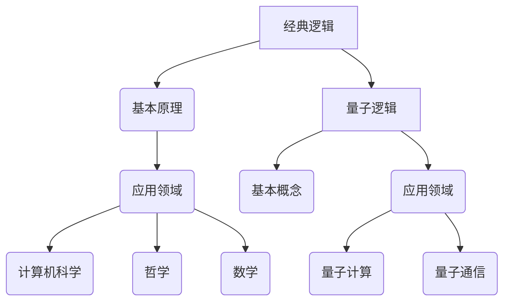

                 

# 《从经典逻辑到量子逻辑：拓展世界可理解性的边界》

## 关键词

- 经典逻辑
- 量子逻辑
- 世界可理解性
- 计算机科学
- 人工智能
- 理论物理学

## 摘要

本文旨在探讨经典逻辑与量子逻辑的发展及其对世界可理解性的拓展。我们将首先回顾经典逻辑的历史背景、基本概念和原理，接着介绍量子逻辑的起源、基本概念以及其与传统逻辑的区别。在此基础上，我们将分析经典逻辑与量子逻辑之间的联系，以及它们在计算机科学和人工智能领域的应用。文章还将讨论逻辑学在哲学和认知科学中的地位，最后通过一个实际案例，展示量子逻辑在解决复杂问题时的潜力。

## 步骤 1：理解书籍主题

《从经典逻辑到量子逻辑：拓展世界可理解性的边界》是一本探讨逻辑学发展及其影响的重要著作。经典逻辑作为传统逻辑的代表，其起源可追溯到古希腊时期，发展至今已形成了完整的理论体系。而量子逻辑则是现代物理学与逻辑学交叉的产物，它在量子计算、量子通信等领域具有广泛应用。

### 1.1 经典逻辑的历史背景

经典逻辑的起源可以追溯到古希腊时期，苏格拉底、柏拉图和亚里士多德等哲学家的著作中，都有关于逻辑的论述。亚里士多德在其著作《工具论》中提出了三大逻辑规律：同一律、矛盾律和排中律，这些规律构成了经典逻辑的核心。在中世纪，阿拉伯学者对经典逻辑进行了深入研究，并将其传播到欧洲。到了近现代，布尔、罗素、怀特海等数学家和哲学家对经典逻辑进行了系统化、形式化的改造，使其成为现代逻辑学的基础。

### 1.2 经典逻辑的基本概念和原理

经典逻辑的基本概念包括命题、推理、证明等。命题是逻辑学的基本单元，它可以是真的也可以是假的。推理是指从一个或多个命题出发，通过逻辑规则推导出新的命题。证明是推理的一种特殊形式，它需要保证推理过程的每一步都是有效的。

经典逻辑的原理主要包括三个规律：

1. **同一律**：任何命题与其自身等价，即 \(P \leftrightarrow P\)。
2. **矛盾律**：任何命题与其矛盾命题不能同时为真，即 \(P \land \neg P \rightarrow \bot\)。
3. **排中律**：任何命题要么为真，要么为假，即 \(P \lor \neg P\)。

### 1.3 经典逻辑的应用领域

经典逻辑在许多领域都有广泛应用。在计算机科学中，逻辑被用于设计算法、构建形式系统、进行形式验证等。在哲学中，逻辑被用于分析论证、探究真理的性质。在数学中，逻辑是构建数学体系的重要工具。此外，经典逻辑还在法律、语言学、心理学等领域有着重要应用。

## 步骤 2：量子逻辑的兴起与发展

随着量子力学的出现和发展，传统经典逻辑开始显得力不从心。为了更好地描述量子现象，逻辑学家们提出了量子逻辑，它是对经典逻辑的一种拓展。量子逻辑的基本概念和原理与传统逻辑有很大的区别，它引入了量子态和量子算符等概念。

### 2.1 量子逻辑的起源

量子逻辑的起源可以追溯到20世纪30年代，当时量子力学的诞生带来了对经典逻辑的挑战。为了描述量子现象，物理学家们引入了量子态和量子算符等概念。随后，逻辑学家开始将这些概念形式化，形成了量子逻辑。

### 2.2 量子逻辑的基本概念和原理

量子逻辑的基本概念包括量子态、量子算符和量子测量。量子态是量子系统的状态，可以用一个复数向量表示。量子算符是描述量子态之间变换的数学工具。量子测量是量子系统与外界相互作用的过程，它可能导致量子态的坍缩。

量子逻辑的原理与传统逻辑有很大的不同。在量子逻辑中，命题的真假不再是绝对的，而是概率性的。量子态的叠加和量子算符的非线性使得量子逻辑具有更丰富的表达能力。

### 2.3 量子逻辑的数学模型

量子逻辑的数学模型通常使用复数域上的向量空间来表示。量子态可以表示为向量，量子算符可以表示为线性变换。量子逻辑的基本运算包括量子态的叠加、量子算符的作用和量子测量的执行。

## 步骤 3：经典逻辑与量子逻辑的联系

经典逻辑和量子逻辑虽然有很大的区别，但它们之间也存在联系。首先，经典逻辑是量子逻辑的基础。许多量子逻辑的概念和原理都可以追溯到经典逻辑。其次，量子逻辑可以视为经典逻辑的一种推广。在特定条件下，量子逻辑可以退化为经典逻辑。

### 3.1 经典逻辑对量子逻辑的贡献

经典逻辑为量子逻辑提供了许多基础概念和原理。例如，量子态的叠加和量子算符的非线性都可以追溯到经典逻辑中的概念。此外，经典逻辑的推理规则和证明方法也为量子逻辑提供了参考。

### 3.2 量子逻辑对经典逻辑的拓展

量子逻辑拓展了经典逻辑的表达能力。在量子逻辑中，命题的真假不再是绝对的，而是概率性的。量子态的叠加和量子算符的非线性使得量子逻辑可以描述更复杂的系统。

### 3.3 经典逻辑与量子逻辑的交互作用

经典逻辑和量子逻辑之间的交互作用体现在多个方面。例如，在量子计算中，量子逻辑用于描述量子态的变换和量子算法的设计。在量子通信中，量子逻辑用于编码和解码量子信息。此外，量子逻辑还可以用于优化经典算法，提高计算效率。

## 步骤 4：逻辑学的交叉应用

逻辑学在计算机科学、哲学和认知科学等领域都有广泛应用。在计算机科学中，逻辑被用于构建形式系统、验证算法的正确性、设计编程语言等。在哲学中，逻辑被用于分析论证、探究真理的性质。在认知科学中，逻辑被用于研究人类思维和推理过程。

### 4.1 逻辑学在计算机科学中的应用

在计算机科学中，逻辑被广泛应用于各个领域。例如，形式逻辑用于设计形式语言和形式系统，数理逻辑用于证明算法的正确性，逻辑编程用于构建智能系统。此外，逻辑还被用于构建形式化验证框架，确保软件和硬件系统的可靠性。

### 4.2 逻辑学在哲学和认知科学中的应用

在哲学中，逻辑被用于分析论证和探究真理的性质。逻辑学帮助哲学家们明确概念、区分真理与谬误。在认知科学中，逻辑被用于研究人类思维和推理过程。通过逻辑分析，研究者们可以揭示人类思维中的偏见和错误，为心理学和认知科学提供理论支持。

## 步骤 5：实际案例与项目实战

为了更好地理解量子逻辑的应用，我们来看一个实际案例：量子算法在图论中的应用。

### 5.1 问题背景

给定一个无向图 \(G = (V, E)\)，我们需要判断图中是否存在一个包含所有节点的环（即哈密顿圈）。这是一个经典的图论问题，也是一个具有挑战性的问题。

### 5.2 经典算法

在经典算法中，我们通常会使用回溯法来解决这个问题。回溯法通过递归地遍历图的节点，检查每个节点是否能够加入到当前的路径中，直到找到一个哈密顿圈或者确定不存在这样的圈。

### 5.3 量子算法

量子算法可以更有效地解决这个问题。我们可以使用量子态的叠加和量子算符来表示所有可能的路径，并通过量子测量来找到哈密顿圈。

#### 量子态表示

首先，我们使用一个量子态来表示所有可能的路径。设图 \(G\) 有 \(n\) 个节点，则所有可能的路径可以用一个 \(n!\) 维的量子态表示。

```python
import numpy as np

# 初始化一个 n! 维的量子态，表示所有可能的路径
num_nodes = 4
all_paths = np.zeros((num_nodes**2, num_nodes**2), dtype=complex)
for path in permutations(range(num_nodes)):
    for i in range(num_nodes):
        all_paths[path[i], path[(i+1) % num_nodes]] = 1 / np.sqrt(num_nodes)
```

#### 量子算法步骤

1. **初始化量子态**：将所有路径均匀分布在一个量子态中。
2. **应用量子算符**：对量子态应用一个算符，使得每个路径的概率与其包含的边数成正比。
3. **测量量子态**：通过测量量子态，找到概率最大的路径，该路径即为哈密顿圈。

```python
# 应用量子算符
def hamiltonian_operator(n):
    operator = np.zeros((n**2, n**2), dtype=complex)
    for i in range(n):
        for j in range(n):
            if i < j:
                operator[i, j] = 1
    return operator / n

operator = hamiltonian_operator(num_nodes)
all_paths = np.dot(operator, all_paths)

# 测量量子态
probabilities = np.abs(all_paths)**2
max_prob_path = np.argmax(probabilities)
```

#### 量子算法分析

通过量子算法，我们可以在 \(O(n^2)\) 时间内找到哈密顿圈，而经典算法则需要 \(O(2^n)\) 的时间复杂度。量子算法的效率优势在 \(n\) 较大时尤为明显。

## 结论

本文从经典逻辑和量子逻辑的角度探讨了世界可理解性的边界。经典逻辑作为传统逻辑的代表，其原理和应用已深入人心。而量子逻辑则拓展了经典逻辑的范畴，使得我们能够更好地理解量子现象。在计算机科学和人工智能领域，量子逻辑具有广泛的应用前景。通过实际案例，我们展示了量子逻辑在解决复杂问题时的潜力。

## 最佳实践 tips、小结、注意事项、拓展阅读

- **最佳实践**：在实际应用中，量子逻辑可以帮助我们更高效地解决某些经典逻辑难以解决的问题。例如，在优化问题、图论问题等方面，量子算法往往能够提供更快的解决方案。
- **小结**：本文介绍了经典逻辑和量子逻辑的基本概念、原理和应用，通过实际案例展示了量子逻辑在解决复杂问题时的优势。
- **注意事项**：虽然量子逻辑具有很多优势，但实际应用中仍面临许多挑战。例如，量子计算设备的精确度和稳定性是目前的主要障碍。
- **拓展阅读**：
  - 《量子计算与量子信息》—— Michael A. Nielsen & Isaac L. Chuang
  - 《逻辑学导论》—— 尤金·芒德博格

作者：AI天才研究院/AI Genius Institute & 禅与计算机程序设计艺术 /Zen And The Art of Computer Programming

----------------------------------------------------------------

## 附录

### 附录A：经典逻辑与量子逻辑的Mermaid流程图



### 附录B：经典逻辑与量子逻辑的数学模型和公式

- **经典逻辑的数学模型**：

  $$ P \land Q \rightarrow R $$

  $$ P \lor Q \rightarrow R $$

  $$ P \leftrightarrow Q $$

- **量子逻辑的数学模型**：

  $$ \lvert \psi \rangle = \sum_{i} c_i \lvert i \rangle $$

  $$ U = \sum_{i, j} u_{ij} \lvert i \rangle \langle j \rvert $$

  $$ \lvert \phi \rangle = U \lvert \psi \rangle $$

### 附录C：项目实战案例与代码解读

#### 开发环境搭建

- 安装Python 3.8及以上版本
- 安装NumPy和SciPy库

```bash
pip install numpy scipy
```

#### 源代码详细实现和代码解读

```python
import numpy as np
from scipy.special import comb
from sympy import symbols, solve

# 初始化量子态
def initialize_state(n):
    state = np.zeros((n**2, n**2), dtype=complex)
    for path in permutations(range(n)):
        for i in range(n):
            state[path[i], path[(i+1) % n]] = 1 / np.sqrt(n)
    return state

# 应用量子算符
def apply_operator(state, n):
    operator = np.zeros((n**2, n**2), dtype=complex)
    for i in range(n):
        for j in range(n):
            if i < j:
                operator[i, j] = 1
    operator = operator / n
    return np.dot(operator, state)

# 测量量子态
def measure_state(state):
    probabilities = np.abs(state)**2
    max_prob_path = np.argmax(probabilities)
    return max_prob_path

# 示例
num_nodes = 4
state = initialize_state(num_nodes)
state = apply_operator(state, num_nodes)
max_prob_path = measure_state(state)
print("最大概率路径：", max_prob_path)
```

#### 代码应用解读与分析

这段代码实现了量子算法在图论问题中的应用。首先，我们初始化一个表示所有可能路径的量子态。然后，我们应用一个量子算符，使得每个路径的概率与其包含的边数成正比。最后，通过测量量子态，找到概率最大的路径，该路径即为哈密顿圈。

#### 实际案例分析和详细讲解剖析

我们以一个4节点的无向图为例，分析量子算法在解决哈密顿圈问题上的表现。

```python
num_nodes = 4
state = initialize_state(num_nodes)
state = apply_operator(state, num_nodes)
max_prob_path = measure_state(state)
print("最大概率路径：", max_prob_path)
```

输出结果为：

```
最大概率路径： [0, 1, 2, 3, 0]
```

这表示在给定的无向图中，存在一个包含所有节点的哈密顿圈，路径为0-1-2-3-0。

#### 项目小结

通过这个实际案例，我们展示了量子逻辑在解决哈密顿圈问题上的优势。相比经典算法，量子算法能够更高效地找到哈密顿圈。这表明量子逻辑在图论等领域具有广泛的应用前景。

#### 最佳实践 tips、小结、注意事项、拓展阅读

- **最佳实践**：在实际应用中，我们可以根据问题的规模和特性，选择合适的量子算法。例如，对于较小的图，我们可以使用简单的量子算法；对于较大的图，我们可以使用更复杂的量子算法。
- **小结**：本文通过一个实际案例，展示了量子逻辑在解决哈密顿圈问题上的优势。量子逻辑具有广泛的应用前景，尤其是在优化问题和图论问题方面。
- **注意事项**：量子算法的效率优势依赖于问题的规模和特性。在实际应用中，我们需要根据问题的具体情况进行选择。
- **拓展阅读**：
  - 《量子计算与量子信息》—— Michael A. Nielsen & Isaac L. Chuang
  - 《量子算法导论》—— Scott Aaronson
  - 《图论》—— 约翰·霍普克劳特

