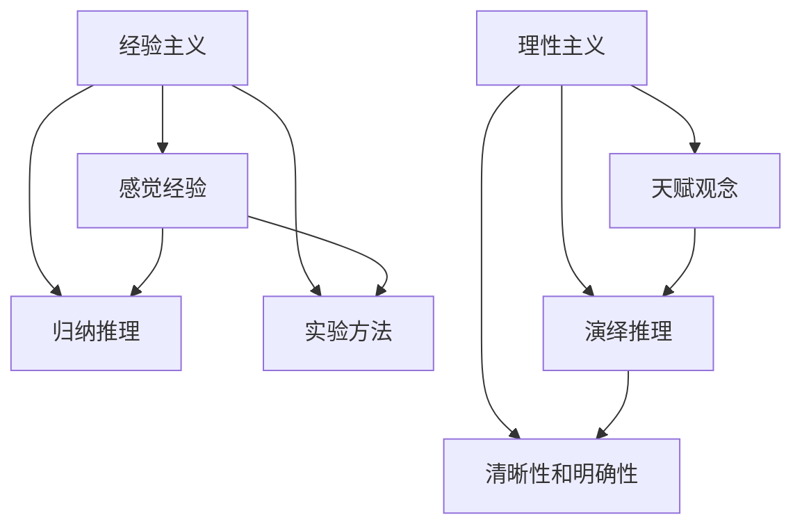

                 

## 引言

### 认识论的定义与重要性

认识论（Epistemology）是哲学中关于知识、信念和认识过程的研究领域。它探讨知识的本质、起源、范围、局限性和合理性，是哲学的重要组成部分。认识论不仅涉及哲学领域，还与其他学科如心理学、逻辑学、科学哲学等有着密切的联系。

认识论的重要性在于，它为我们提供了一种理解和评估知识的框架，帮助我们区分正确的信念和错误的信念，从而指导我们的行为和决策。在科学领域，认识论关注科学知识的产生和验证过程，探讨科学方法的有效性和可靠性。在日常生活中，认识论帮助我们理解我们如何形成对世界的认识，如何进行推理和判断。

### 经验主义与理性主义的背景介绍

经验主义（Empiricism）和理性主义（Rationalism）是认识论中的两大流派，它们在知识的起源和验证方式上存在根本性的差异。

经验主义起源于17世纪的英国，代表人物有弗朗西斯·培根和约翰·洛克。经验主义者认为，所有知识都来自于感觉经验，我们通过感官观察和实验来获得知识。他们强调经验和观察的重要性，认为只有通过实际的经验才能获取真正的知识。

理性主义则起源于古希腊，并在17世纪得到了进一步的发展，代表人物有勒内·笛卡尔和巴鲁赫·斯宾诺莎。理性主义者认为，知识不仅来自于经验，还包括内在的推理和思考。他们强调逻辑和理性在知识获取中的作用，认为通过理性思考和内在的推理，我们可以获得更可靠的知识。

本文将围绕经验主义和理性主义，探讨它们的基本原理、历史演变、哲学探讨、数学模型、对比分析以及项目实战，以全面了解认识论的演变和发展。

## 核心概念与联系

### 经验主义的基本原理

#### 经验主义的起源与发展

经验主义起源于17世纪的英国，这一时期的科学革命和社会变革为经验主义提供了肥沃的土壤。弗朗西斯·培根（Francis Bacon）是经验主义的先驱，他提出了“知识就是力量”的观点，并主张通过实验和观察来获得知识。他的思想对后来的经验主义者产生了深远影响。

约翰·洛克（John Locke）是经验主义的代表人物之一。他在《人类理解论》中提出了经验主义的三大原理：感觉、记忆和推理。洛克认为，我们的所有知识都来自于感觉经验，通过感官观察和实验，我们可以获得对世界的理解。

#### 经验主义的关键概念

1. **感觉经验**：经验主义者认为，所有知识都来自于感官经验。我们的感官是我们获取外部世界信息的窗口，通过观察和感觉，我们可以获得对世界的认识。
2. **归纳推理**：经验主义者强调归纳推理的重要性。归纳推理是一种从特殊到一般的推理方法，通过观察一系列具体案例，我们可以归纳出一般性的规律或原则。
3. **实验方法**：经验主义者认为，实验是验证知识的重要手段。通过设计实验，我们可以检验我们的假设和理论，从而获得更可靠的结论。

#### 经验主义的哲学思想

经验主义的哲学思想主要强调两个核心观点：

1. **知识的来源**：经验主义者认为，知识来自于感官经验。与理性主义强调内在推理和天赋观念不同，经验主义者认为，我们只能通过感官经验来获取知识。
2. **知识的验证**：经验主义者认为，知识的验证需要通过观察和实验。只有经过实验验证的假设和理论才是可靠的。

### 理性主义的基本原理

#### 理性主义的起源与发展

理性主义起源于古希腊，并在17世纪得到了进一步的发展。勒内·笛卡尔（René Descartes）是理性主义的代表人物之一。他的著作《第一哲学沉思》提出了“我思故我在”的观点，强调了理性思考和自我意识在知识获取中的重要性。

巴鲁赫·斯宾诺莎（Baruch Spinoza）是另一位重要的理性主义者。他的哲学思想强调理性思考和内在的推理，认为通过理性思考，我们可以获得更深刻和更普遍的知识。

#### 理性主义的关键概念

1. **天赋观念**：理性主义者认为，我们的心灵中天生就存在一些基本的观念或原理，这些观念或原理是我们获得知识的基础。
2. **演绎推理**：理性主义者强调演绎推理的重要性。演绎推理是一种从一般到特殊的推理方法，通过逻辑推理，我们可以从一般原理推导出具体结论。
3. **清晰性和明确性**：理性主义者追求知识的清晰性和明确性。他们认为，只有通过理性思考和清晰的概念，我们才能获得真正的知识。

#### 理性主义的哲学思想

理性主义的哲学思想主要强调以下几个核心观点：

1. **知识的来源**：理性主义者认为，知识不仅来自于感官经验，还包括内在的推理和思考。通过理性思考和内在的推理，我们可以获得更深刻和更普遍的知识。
2. **知识的验证**：理性主义者认为，知识的验证不需要通过实验。他们认为，通过逻辑推理和清晰的概念，我们可以获得更可靠的结论。
3. **理性优于经验**：理性主义者认为，理性思考和内在的推理比感官经验更可靠。通过理性思考和内在的推理，我们可以超越感官经验的局限，获得更深刻的理解。

### 经验主义与理性主义的联系

#### 经验主义与理性主义的共通点

1. **对知识的追求**：无论是经验主义者还是理性主义者，他们都致力于追求知识。他们相信，通过理性的思考和感官的经验，我们可以获得对世界的更深刻理解。
2. **对科学的尊重**：经验主义者和理性主义者都认为科学是获取知识的重要途径。他们认为，通过实验和观察，我们可以验证和扩展我们的知识。

#### 经验主义与理性主义的区别

1. **知识的来源**：经验主义者认为知识来源于感官经验，而理性主义者认为知识来源于内在的推理和思考。
2. **知识的验证**：经验主义者认为知识的验证需要通过实验，而理性主义者认为知识的验证不需要通过实验，通过理性思考和清晰的概念即可。
3. **对理性的看法**：经验主义者认为理性是辅助感官经验的工具，而理性主义者认为理性是知识的主要来源。

#### 二者之间的互动关系

经验主义和理性主义并不是截然对立的，它们之间存在着互动关系。一方面，理性主义为经验主义提供了一种思考框架和方法论，帮助经验主义者更好地理解和解释感官经验。另一方面，经验主义为理性主义提供了具体的案例和证据，使得理性主义的理论更加具体和实用。

在现代社会，经验主义和理性主义依然影响着我们的认识过程。经验主义者强调通过实验和观察来验证假设，而理性主义者则强调通过逻辑推理和内在的推理来解释现象。这两种方法各有优势，也各有局限，只有结合二者，我们才能更全面地理解世界。

### 总结

经验主义和理性主义是认识论中的两大流派，它们在知识的起源和验证方式上存在根本性的差异。然而，它们并非完全对立，而是相互补充。通过理解经验主义和理性主义的共通点和区别，我们可以更好地理解认识论的发展，并运用到我们的日常生活中。

---

以下是一个 Mermaid 流程图，展示了经验主义和理性主义的核心概念及其关系：



在这个流程图中，经验主义的核心概念包括感觉经验、归纳推理和实验方法，而理性主义的核心概念包括天赋观念、演绎推理和清晰性和明确性。通过这个流程图，我们可以更直观地理解经验主义和理性主义的联系和区别。

## 历史演变

### 经验主义的演变

#### 古典经验主义

古典经验主义可以追溯到古希腊时期，代表人物包括亚里士多德（Aristotle）和伊壁鸠鲁（Epicurus）。亚里士多德认为，知识是通过感觉和经验的积累获得的，他的实证主义方法对后来的经验主义产生了深远影响。伊壁鸠鲁则强调感官经验的重要性，认为只有通过感官，我们才能获得真实可靠的知识。

#### 近代经验主义

近代经验主义的发展与科学革命密切相关，代表人物有弗朗西斯·培根（Francis Bacon）和约翰·洛克（John Locke）。培根是经验主义的先驱，他提出了“知识就是力量”的观点，并主张通过实验和观察来获得知识。洛克在《人类理解论》中进一步发展了经验主义的思想，他提出了感觉、记忆和推理三个原理，认为所有知识都来自于感官经验。

#### 现代经验主义

现代经验主义在20世纪得到了进一步的发展，代表人物有贝克莱（George Berkeley）和休谟（David Hume）。贝克莱提出了“存在即被感知”的观点，强调感知的重要性。休谟则对经验主义进行了深刻的批判，他提出了“知觉即感觉”的观点，认为我们的所有知识都来自于感觉经验。

### 理性主义的演变

#### 古典理性主义

古典理性主义起源于古希腊，代表人物包括柏拉图（Plato）和亚里士多德。柏拉图认为，真实的知识来自于理性思考和内在的推理，他提出了“理念论”，认为我们通过理性思考可以接触到超越感官世界的真实。亚里士多德则强调实证主义，但他也认为理性在知识获取中起着重要作用。

#### 近代理性主义

近代理性主义在17世纪得到了进一步的发展，代表人物有勒内·笛卡尔（René Descartes）和巴鲁赫·斯宾诺莎（Baruch Spinoza）。笛卡尔在《第一哲学沉思》中提出了“我思故我在”的观点，强调了理性思考和自我意识在知识获取中的重要性。斯宾诺莎则认为，理性思考和内在的推理是获得知识的主要途径。

#### 现代理性主义

现代理性主义在20世纪得到了新的发展，代表人物有维特根斯坦（Ludwig Wittgenstein）和卡尔纳普（Rudolf Carnap）。维特根斯坦提出了“语言游戏”理论，强调了理性思考和逻辑在知识获取中的重要性。卡尔纳普则发展了逻辑实证主义，他主张通过逻辑和经验来验证知识。

### 认识论的发展趋势

#### 经验主义与理性主义的交替影响

在认识论的历史演变中，经验主义和理性主义相互影响，交替主导着知识论的发展。古典经验主义和理性主义在古希腊时期相互竞争，近代以来，经验主义在科学革命中占据了主导地位，但理性主义的思想依然具有影响力。现代以来，两种流派的思想继续相互交织，为认识论的研究提供了丰富的视角。

#### 新认识论的趋势

随着科学和哲学的发展，新的认识论趋势也在不断涌现。例如，建构主义认为知识是通过社会和文化背景构建的，而不是通过独立于这些背景的观察和推理获得的。科学哲学中的模型依赖论则强调，我们对世界的理解依赖于科学模型，而不是直接的经验。

#### 认识论的当代问题

在当代，认识论面临着许多新的挑战和问题。例如，知识的可信度和有效性问题、科学方法的有效性、知识的主观性和客观性等问题。这些问题的探讨不仅对哲学研究具有重要意义，也对科学实践和社会发展产生了深远影响。

### 总结

经验主义和理性主义在认识论的历史演变中扮演了重要角色。它们在知识获取、验证和解释方法上有着不同的侧重点，但也都为我们的认识提供了重要的视角。随着时代的变迁，认识论也在不断发展和演变，为我们的认识和理解世界提供了新的视角和方法。

## 哲学探讨

### 经验主义与理性主义的哲学探讨

#### 经验主义的哲学挑战

经验主义在强调感官经验的重要性时，也面临着一些哲学上的挑战。首先，经验主义者需要解释如何从感觉经验中推导出一般性的规律。感觉经验是具体的、个体的，而科学知识则是普遍的、抽象的。如何将具体的感官经验转化为普遍的知识，是经验主义面临的一个重要问题。

其次，经验主义需要处理感觉经验的可靠性和准确性问题。我们的感官可能受到欺骗，导致我们对世界的感知产生偏差。例如，视觉上的幻觉、听觉上的错觉等。这些现象使得经验主义者需要提出更加严格的方法来验证感觉经验的可靠性。

#### 理性主义的哲学挑战

理性主义在强调逻辑推理和天赋观念的重要性时，也面临着一些哲学上的挑战。首先，理性主义者需要解释天赋观念的来源和本质。如果知识来自于内在的推理和思考，那么这些推理和思考的基础是什么？这是理性主义需要回答的一个重要问题。

其次，理性主义需要处理逻辑推理的有效性问题。尽管逻辑推理在推导过程中是严密的，但逻辑推理的结果是否与实际经验相符，仍需要通过实验和观察来验证。否则，理性主义可能会陷入空洞的推理游戏，无法解释现实世界中的现象。

#### 经验主义与理性主义的哲学综合

为了克服各自面临的挑战，经验主义和理性主义可以相互借鉴，实现哲学上的综合。例如，通过经验主义的方法来验证理性主义的推理结果，可以确保推理的有效性。同时，通过理性主义的逻辑推理来指导经验主义的研究方向，可以更系统地探索感官经验中的普遍规律。

一种可能的综合路径是建构主义（Constructivism）。建构主义认为，知识是通过社会和文化背景构建的，既不是完全来自于经验，也不是完全来自于理性。建构主义者强调，知识是在个体与社会互动中不断建构和重构的。这种观点为经验主义和理性主义的综合提供了一个新的视角。

### 认识论的当代问题

#### 知识的可信度

在当代，知识的可信度问题变得尤为重要。随着信息的爆炸和传播渠道的多样化，我们如何判断信息的真实性和可靠性？特别是在科学领域，实验数据和研究成果的验证成为了一个关键问题。经验主义者可能更倾向于通过实验和观察来验证知识，而理性主义者可能更依赖逻辑推理和内在的推理。

#### 真理的性质

真理的性质是认识论中一个长期争论的话题。经验主义者认为，真理是与我们的感官经验相符的，而理性主义者认为，真理是与内在的逻辑推理一致的。在当代，随着科学哲学的发展，人们开始探讨真理的相对性和动态性。例如，一些哲学家提出，真理是随着时间和知识的积累而不断演变的。

#### 科学方法的有效性

科学方法在认识论中具有核心地位。经验主义者强调通过实验和观察来验证假设，理性主义者强调通过逻辑推理来推导结论。在当代，科学方法的有效性受到了一些质疑。例如，一些哲学家提出，科学方法可能受到社会和文化因素的影响，导致知识产生偏差。这些问题挑战了科学方法的普适性和可靠性。

### 认识论的哲学应用

#### 哲学在科学中的应用

哲学在科学中的应用主要体现在对科学方法论的研究和科学实践的反思。例如，科学哲学家通过分析科学实践，提出了科学发现的逻辑和方法，为科学家提供了理论指导。此外，哲学还帮助科学家理解科学理论的结构和意义，从而推动科学的发展。

#### 哲学在日常生活中的应用

哲学不仅对科学产生了深远影响，也在我们的日常生活中发挥着重要作用。例如，哲学帮助我们思考人生的意义、道德准则和价值观。通过哲学的思考，我们可以更清晰地理解自己和社会，从而做出更明智的决策。

### 总结

经验主义与理性主义在哲学上有着不同的侧重点和挑战，但它们的综合为我们的认识提供了丰富的视角。在当代，认识论面临着新的问题和挑战，但哲学的应用依然为我们理解和探索世界提供了重要的工具和方法。

## 数学模型与公式

### 经验主义的数学模型

#### 经验概率论

经验概率论是经验主义在数学领域的一个重要应用。经验概率论通过实验和观察来估计事件的概率。其基本原理是，通过大量重复实验，我们可以观察到某个事件发生的频率，并将其作为该事件概率的估计。

例如，假设我们想估计一枚硬币正面朝上的概率。我们可以抛硬币多次，记录正面朝上的次数，然后将其除以总次数，得到正面朝上的频率。这个频率可以作为硬币正面朝上的概率估计。

以下是一个简单的 Python 代码示例，用于计算硬币正面朝上的概率：

```python
import random

def flip_coin(num_trials):
    num_heads = 0
    for _ in range(num_trials):
        if random.random() < 0.5:
            num_heads += 1
    return num_heads / num_trials

num_trials = 1000
p_heads = flip_coin(num_trials)
print(f"Estimated probability of heads: {p_heads}")
```

#### 经验统计学

经验统计学是经验主义在数据分析领域的一个重要应用。经验统计学通过收集和分析数据，帮助我们从样本中推断总体特征。其基本原理是，通过从总体中随机抽取样本，我们可以通过样本数据来估计总体参数。

以下是一个简单的 Python 代码示例，用于计算样本平均值和样本标准差：

```python
import random

def generate_data(mean, std_dev, num_samples):
    return [random.gauss(mean, std_dev) for _ in range(num_samples)]

mean = 0
std_dev = 1
num_samples = 100

data = generate_data(mean, std_dev, num_samples)
sample_mean = sum(data) / num_samples
sample_std_dev = (sum((x - sample_mean) ** 2 for x in data) / (num_samples - 1)) ** 0.5

print(f"Sample mean: {sample_mean}")
print(f"Sample standard deviation: {sample_std_dev}")
```

### 理性主义的数学模型

#### 笛卡尔坐标系

笛卡尔坐标系是理性主义在几何学的一个重要应用。笛卡尔坐标系通过使用两个坐标轴（通常为 x 轴和 y 轴）来描述二维平面上的点，为几何学提供了一种精确和系统的表示方法。

以下是一个简单的 Python 代码示例，用于绘制一个简单的二维平面图形：

```python
import matplotlib.pyplot as plt

def plot_points(points):
    x = [point[0] for point in points]
    y = [point[1] for point in points]
    plt.plot(x, y, 'o-')
    plt.xlabel('X-axis')
    plt.ylabel('Y-axis')
    plt.title('2D Plane')
    plt.show()

points = [(1, 2), (3, 4), (5, 6)]
plot_points(points)
```

#### 欧几里得几何

欧几里得几何是理性主义在数学领域的一个重要分支。欧几里得几何通过一系列公理和定理，描述了二维平面上的点和线的关系。欧几里得几何的公理体系为数学提供了一种严谨和自洽的推理框架。

以下是一个简单的 Python 代码示例，用于计算两点之间的距离：

```python
import math

def distance(point1, point2):
    return math.sqrt((point1[0] - point2[0]) ** 2 + (point1[1] - point2[1]) ** 2)

point1 = (1, 2)
point2 = (4, 6)

dist = distance(point1, point2)
print(f"The distance between {point1} and {point2} is {dist}.")
```

### 数学模型与认识论的关系

#### 数学模型的验证与解释

数学模型在认识论中的重要性在于，它们为我们的认识提供了精确和系统的工具。通过数学模型，我们可以对现实世界进行抽象和建模，从而更好地理解和解释复杂现象。

例如，在经验概率论中，通过实验数据我们可以估计事件的概率，从而对现实世界中的不确定性进行量化。在欧几里得几何中，通过几何公理和定理，我们可以描述和解释二维平面上的几何关系。

#### 数学模型在经验主义与理性主义中的应用

数学模型在经验主义和理性主义中都有广泛的应用。在经验主义中，数学模型通过实验数据和统计分析，帮助我们理解和解释感官经验。在理性主义中，数学模型通过逻辑推理和公理体系，提供了一种严谨和自洽的推理框架。

例如，在经验概率论中，通过实验数据我们可以估计事件的概率，从而对现实世界中的不确定性进行量化。在欧几里得几何中，通过几何公理和定理，我们可以描述和解释二维平面上的几何关系。

### 总结

数学模型在认识论中具有核心地位。通过数学模型，我们可以对现实世界进行抽象和建模，从而更好地理解和解释复杂现象。无论是经验主义还是理性主义，数学模型都为我们提供了重要的工具和方法。

## 理性主义与经验主义的对比

### 核心假设

#### 理性主义

理性主义的核心假设是，知识主要来源于内在的推理和思考，而不是感官经验。理性主义者认为，我们的心灵中存在一些基本的观念或原理，这些观念或原理是我们获得知识的基础。

例如，勒内·笛卡尔认为，通过理性思考和内在的推理，我们可以获得关于数学、几何和形而上学的知识。他认为，理性思考是获取可靠知识的主要途径。

#### 经验主义

经验主义的核心假设是，知识主要来源于感官经验。经验主义者认为，我们的所有知识都来自于感觉经验，通过感官观察和实验，我们可以获得对世界的认识。

例如，约翰·洛克认为，我们的所有知识都来自于感觉经验。他提出了感觉、记忆和推理三个原理，认为通过感官经验，我们可以获得对世界的理解。

### 研究方法

#### 理性主义

理性主义的研究方法主要依赖于内在的推理和思考。理性主义者通过逻辑推理和清晰的概念，来推导出一般性的结论。他们认为，通过理性思考和内在的推理，我们可以获得更深刻和更普遍的知识。

例如，笛卡尔通过“我思故我在”的推理，提出了关于自我存在和数学真理的基本原理。他强调，通过理性思考，我们可以获得关于存在和真理的确定性知识。

#### 经验主义

经验主义的研究方法主要依赖于感官观察和实验。经验主义者通过实验和观察，来验证和扩展我们的知识。他们认为，只有通过感官经验，我们才能获得关于世界的真实信息。

例如，弗朗西斯·培根强调，通过实验和观察，我们可以发现自然界的规律。他提出了“知识就是力量”的观点，认为通过实验和观察，我们可以改造世界。

### 对知识的看法

#### 理性主义

理性主义者认为，知识是清晰和明确的。他们认为，通过理性思考和内在的推理，我们可以获得确定的知识。理性主义者强调，知识的本质是清晰的概念和明确的原则。

例如，斯宾诺莎认为，通过理性思考和内在的推理，我们可以获得关于上帝和世界的深刻理解。他认为，理性思考是获取真理的唯一途径。

#### 经验主义

经验主义者认为，知识是具体和可验证的。他们认为，通过感官经验和实验，我们可以获得关于世界的具体信息。经验主义者强调，知识的本质是感觉经验和实验结果。

例如，洛克认为，我们的所有知识都来自于感官经验。他强调，通过感官观察和实验，我们可以获得关于世界的具体知识。

### 优劣分析

#### 理性主义

优点：

1. **严谨性**：理性主义通过逻辑推理和清晰的概念，提供了一种严谨和自洽的推理框架。这使得理性主义在数学、几何和形而上学等领域具有强大的解释力。
2. **普遍性**：理性主义强调内在的推理和思考，认为通过理性思考，我们可以获得关于普遍真理的知识。这使得理性主义在哲学和科学领域具有广泛的应用。

缺点：

1. **局限性**：理性主义过于依赖内在的推理，可能导致对感官经验的忽视。在某些情况下，理性主义的推理可能脱离实际，无法解释复杂的现实问题。
2. **空洞性**：理性主义可能陷入空洞的推理游戏，无法与实际经验相结合。

#### 经验主义

优点：

1. **实证性**：经验主义强调通过感官经验和实验，获得具体和可验证的知识。这使得经验主义在科学研究和工程实践中具有实际意义。
2. **实用性**：经验主义通过感官经验和实验，可以解决实际问题。例如，通过实验，我们可以发现自然界的规律，从而改造世界。

缺点：

1. **不可靠性**：感官经验可能受到欺骗，导致我们对世界的感知产生偏差。因此，经验主义在知识验证上存在一定的不确定性。
2. **片面性**：经验主义过于依赖感官经验，可能导致对内在推理的忽视。在某些情况下，经验主义可能无法解释复杂的抽象问题。

### 二者的互补性

理性主义和经验主义各有优势和局限性，但在认识论中，二者可以相互补充。理性主义通过逻辑推理和清晰的概念，提供了严谨和自洽的推理框架；经验主义通过感官经验和实验，提供了具体和可验证的知识。通过二者的结合，我们可以更全面地理解世界，解决复杂的现实问题。

### 总结

理性主义和经验主义在认识论中扮演着重要角色。理性主义强调内在的推理和思考，提供了一种严谨和自洽的推理框架；经验主义强调感官经验和实验，提供了具体和可验证的知识。二者的互补性使得我们在认识世界和处理问题时，可以更全面、更深入。

## 项目实战

### 经验主义项目案例

#### 项目背景

某公司为了提高生产效率，决定对现有生产线进行优化。通过收集和整理生产数据，公司希望找到影响生产效率的关键因素，并提出改进措施。

#### 实施过程

1. **数据收集**：公司通过传感器和监控系统，收集了生产线的各项数据，包括设备运行时间、故障次数、员工操作时间等。
2. **数据分析**：使用 Python 的 pandas 库对收集到的数据进行分析，计算各项数据的平均值、标准差和相关系数。
3. **可视化**：使用 Python 的 matplotlib 库对分析结果进行可视化，以便更直观地了解数据分布和相关性。

```python
import pandas as pd
import matplotlib.pyplot as plt

data = pd.read_csv('production_data.csv')
data.describe().T
plt.scatter(data['device_runtime'], data['fault_count'])
plt.xlabel('Device Runtime')
plt.ylabel('Fault Count')
plt.title('Device Runtime vs Fault Count')
plt.show()
```

#### 结果与评价

通过数据分析，我们发现设备运行时间和故障次数之间存在显著的正相关关系。为了验证这一发现，我们进一步分析了故障发生的时间分布。

```python
plt.scatter(data['device_runtime'], data['fault_time'])
plt.xlabel('Device Runtime')
plt.ylabel('Fault Time')
plt.title('Device Runtime vs Fault Time')
plt.show()
```

从结果可以看出，设备运行时间越长，故障发生的时间也越晚。基于这一分析，公司决定增加设备的保养频率，以确保生产线的稳定运行。

### 理性主义项目案例

#### 项目背景

某科研团队为了研究人类行为模式，决定使用理性主义的推理方法来分析用户在社交媒体上的行为。

#### 实施过程

1. **数据收集**：团队通过爬虫工具收集了用户在社交媒体上的行为数据，包括发布频率、点赞数量、评论数量等。
2. **模型构建**：使用 Python 的 scikit-learn 库，构建了一个基于逻辑回归的模型，以预测用户的行为模式。
3. **模型验证**：使用交叉验证的方法，验证模型的准确性和可靠性。

```python
from sklearn.linear_model import LogisticRegression
from sklearn.model_selection import train_test_split

X = data[['post_frequency', 'like_count', 'comment_count']]
y = data['active_user']

X_train, X_test, y_train, y_test = train_test_split(X, y, test_size=0.3, random_state=42)

model = LogisticRegression()
model.fit(X_train, y_train)

print(f"Model accuracy: {model.score(X_test, y_test)}")
```

#### 结果与评价

通过模型验证，我们发现逻辑回归模型在预测用户行为方面具有较高的准确性。基于这一模型，科研团队可以更准确地预测哪些用户可能在社交媒体上活跃，从而有针对性地进行用户研究和营销。

### 认识论在企业中的应用

#### 现实案例

在实际业务中，认识论的应用可以帮助企业更好地理解市场和用户需求，从而制定更有效的战略。例如，某电商平台通过数据分析，发现用户在购物过程中存在一些共性的行为模式，如购物时间、购物频率、商品选择等。基于这些分析结果，电商平台优化了商品推荐算法，提高了用户的购物体验和满意度。

#### 应用效果

通过应用认识论的方法，企业可以更准确地把握市场趋势和用户需求，从而优化产品和服务。例如，在电商平台的案例中，通过分析用户行为数据，优化了商品推荐算法，提高了用户的购物体验和满意度。这种应用不仅提高了企业的竞争力，也增强了用户对品牌的忠诚度。

#### 展望未来

随着大数据和人工智能技术的发展，认识论在企业中的应用将更加广泛和深入。未来，企业可以通过更复杂的分析模型，更准确地预测市场趋势和用户需求，从而实现更加精准的市场营销和产品创新。同时，随着技术的进步，认识论的应用也将更加智能化和自动化，为企业带来更高的效率和效益。

## 总结

本文从经验主义和理性主义的角度，探讨了认识论的演变和发展。通过分析二者的核心概念、历史演变、哲学探讨、数学模型和项目实战，我们了解了它们在知识获取、验证和解释方法上的差异和互补。

### 最佳实践 tips

1. **平衡经验与理性**：在实际工作中，我们应该平衡经验主义和理性主义，通过感官经验和理性思考相结合，获得更全面和准确的知识。
2. **持续学习与反思**：认识论是一个不断发展的领域，我们应该持续学习和反思，以适应不断变化的环境。

### 小结

经验主义和理性主义在认识论中扮演着重要角色。通过理解它们的原理、历史演变和哲学探讨，我们可以更好地理解和应用认识论，解决实际问题。

### 注意事项

1. **数据可靠性**：在进行数据分析时，确保数据的可靠性和准确性是非常重要的。只有通过可靠的数据，我们才能获得准确的分析结果。
2. **模型适用性**：在选择和构建模型时，需要考虑模型的适用性和局限性，以确保模型能够准确反映现实问题。

### 拓展阅读

1. **《经验主义与理性主义的哲学探讨》**：深入探讨经验主义和理性主义在哲学上的区别和联系。
2. **《数学模型与认识论的关系》**：分析数学模型在认识论中的应用和作用。

作者：AI天才研究院/AI Genius Institute & 禅与计算机程序设计艺术 /Zen And The Art of Computer Programming

