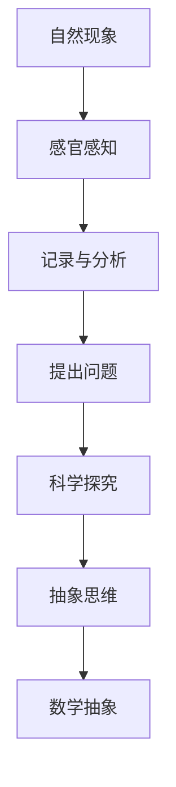
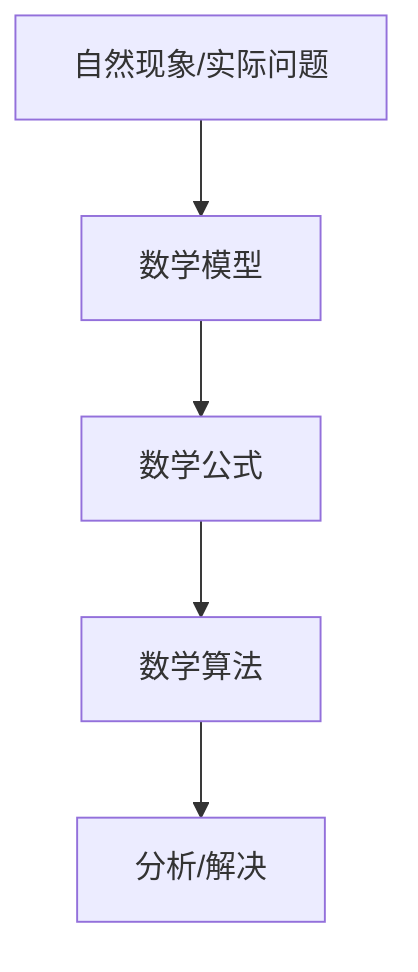

                 

# 从自然观察到数学抽象：映射之道

## 关键词
- 自然观察
- 数学抽象
- 抽象思维
- 科学探究
- 映射概念
- 计算机科学
- 工程设计
- 科技发展

## 摘要
本文旨在探讨从自然观察到数学抽象的转换过程，即映射之道。通过详细阐述自然观察的基本概念、数学抽象的基本原理和方法，以及映射在科技领域的广泛应用，本文揭示了自然现象与数学模型之间的内在联系，展示了映射之道在科学研究、计算机科学和工程领域的重要作用。文章最后，对映射之道在未来的发展趋势和在教育领域的应用进行了展望。

## 引言
自然观察是人类认识世界、理解自然的基本方式。从古代的哲学思考到现代的科学探究，自然观察一直是科学研究的重要方法。然而，随着科学的发展，人类逐渐认识到，直接观察到的自然现象往往只是表面现象，要深入理解自然规律，必须进行抽象和建模。这种从自然观察到数学抽象的转换，即映射之道，是科学探究的重要途径。

映射之道不仅仅是科学探究的方法，它在计算机科学、工程设计等领域也有着广泛的应用。本文将首先介绍自然观察的基本概念，然后深入探讨数学抽象的基本原理和方法，接着分析映射在科技领域的广泛应用，最后对映射之道在未来的发展趋势和在教育领域的应用进行展望。

## 第一部分：自然观察的初步探索

### 第1章：自然观察的基本概念

自然观察是指人类通过感官和仪器对自然界中的现象进行感知、记录和分析的过程。它是科学探究的起点，是获取知识的基础。

#### 1.1 自然观察的定义与重要性

自然观察的定义可以追溯到亚里士多德的《物理学》。亚里士多德认为，自然观察是通过感官来了解自然现象，这是认识世界的基本途径。在科学探究中，自然观察具有极其重要的地位。它不仅可以帮助我们发现自然规律，还可以验证科学理论的正确性。

#### 1.2 自然观察的方法与工具

自然观察的方法主要包括直接观察、实验观察和仪器观察。直接观察是通过肉眼或感官直接感知自然现象。实验观察是在控制条件下对自然现象进行观察，以排除干扰因素。仪器观察则是利用各种仪器设备对自然现象进行精细测量和记录。

自然观察的工具包括望远镜、显微镜、光谱仪、测距仪等。这些工具的发明和使用极大地扩展了人类的观察范围和精度。

#### 1.3 自然观察与科学探究的关系

自然观察是科学探究的起点。通过自然观察，我们可以发现自然现象，提出科学问题，进而进行科学研究。自然观察与科学探究之间存在着密切的联系。自然观察提供了科学探究的基础数据，而科学探究则对自然观察进行深入分析和解释，从而揭示自然规律。

### Mermaid流程图：自然观察到抽象思维的过程



### 第2章：从自然观察到抽象思维

自然观察虽然能够帮助我们认识自然现象，但要深入理解自然规律，还需要进行抽象思维。

#### 2.1 自然现象的抽象

自然现象的抽象是指将复杂的自然现象简化为简单的数学模型或概念。这种抽象有助于我们抓住自然现象的本质，从而更深入地理解自然规律。

#### 2.2 抽象思维的形成与发展

抽象思维是人类智能的重要组成部分。随着人类文明的发展，抽象思维也在不断演进。从古代的哲学思考到现代的科学理论，抽象思维始终是科学探究的重要工具。

#### 2.3 抽象思维在科学探究中的作用

抽象思维在科学探究中起着至关重要的作用。通过抽象思维，我们可以将复杂的问题简化为简单的数学模型，从而更方便地进行分析和解决。抽象思维还是科学理论创新的重要手段，它可以帮助我们提出新的科学假设，推动科学理论的发展。

### Python代码示例：自然现象的抽象

```python
# 抽象自然现象为简单的数学模型
def natural_phenomenon_abstract(temperature):
    if temperature < 0:
        return "冷"
    elif temperature >= 0 and temperature < 20:
        return "凉爽"
    elif temperature >= 20 and temperature < 30:
        return "温暖"
    else:
        return "热"

# 测试
print(natural_phenomenon_abstract(-5))  # 输出：冷
print(natural_phenomenon_abstract(15))  # 输出：凉爽
print(natural_phenomenon_abstract(25))  # 输出：温暖
print(natural_phenomenon_abstract(35))  # 输出：热
```

## 第二部分：数学抽象的探索与实践

### 第3章：数学抽象的基本概念

数学抽象是指将自然现象或实际问题转化为数学模型或数学语言的过程。数学抽象是科学探究的重要工具，它使得复杂的自然现象和实际问题变得可分析和可计算。

#### 3.1 数学抽象的定义与特点

数学抽象的定义可以概括为：将自然现象或实际问题转化为数学模型或数学语言的过程。数学抽象具有以下几个特点：

1. **简化性**：数学抽象将复杂的自然现象简化为简单的数学模型，使得问题更加清晰和可处理。
2. **普适性**：数学抽象可以应用于各种领域，具有广泛的适用性。
3. **精确性**：数学抽象提供了精确的数学描述，使得问题的分析和解决更加精确。
4. **可计算性**：数学抽象使得问题变得可计算，从而可以通过计算机等工具进行求解。

#### 3.2 数学抽象的基本形式

数学抽象的基本形式包括数学模型、数学公式和数学算法等。数学模型是对自然现象或实际问题的数学描述，数学公式是对数学模型的数学表达，数学算法是解决问题的数学方法。

#### 3.3 数学抽象的价值与意义

数学抽象在科学探究、工程设计和计算机科学等领域具有极高的价值。通过数学抽象，我们可以更深入地理解自然规律，更高效地解决实际问题，从而推动科技的发展和进步。

### Mermaid流程图：数学抽象的基本过程



### 第4章：数学抽象的方法与应用

数学抽象的方法多种多样，常见的包括归纳法、类比法、构造法等。不同的方法适用于不同的场景和问题。

#### 4.1 基本数学抽象方法

1. **归纳法**：通过观察和分析具体实例，归纳出一般性的结论。
2. **类比法**：通过比较不同领域的现象或问题，找到相似之处，从而进行抽象。
3. **构造法**：通过构造数学模型来描述自然现象或实际问题。

#### 4.2 数学抽象在解决实际问题中的应用

数学抽象在解决实际问题中具有广泛的应用。以下是一个例子：

**问题**：某公司每天生产的苹果数量随时间变化，如下表所示：

| 时间（天） | 苹果数量（吨） |
| --------- | ------------ |
| 1         | 10           |
| 2         | 12           |
| 3         | 15           |
| 4         | 18           |
| 5         | 22           |

请使用数学抽象方法，描述苹果数量的变化规律。

**解决方案**：

1. **归纳法**：观察数据，发现苹果数量每天增加2吨。
2. **类比法**：将苹果数量与时间类比，将其视为线性增长。
3. **构造法**：构造一个线性函数模型，表示苹果数量与时间的关系。

```python
# 构造线性函数模型
def apple_production(day):
    return 10 + 2 * (day - 1)

# 测试
print(apple_production(1))  # 输出：10
print(apple_production(2))  # 输出：12
print(apple_production(3))  # 输出：15
print(apple_production(4))  # 输出：18
print(apple_production(5))  # 输出：22
```

#### 4.3 数学抽象在科学研究中的运用

数学抽象在科学研究中的运用非常广泛。以下是一个例子：

**问题**：研究某星球上的引力场。

**解决方案**：

1. **抽象引力场**：将引力场视为一种数学模型，如泊松方程。
2. **求解方程**：使用数学方法求解泊松方程，得到引力场的分布。

$$
\nabla^2 \phi = 4\pi G \rho
$$

其中，$\phi$ 表示引力场强度，$G$ 表示引力常数，$\rho$ 表示质量密度。

### 第5章：数学抽象与自然观察的结合

数学抽象与自然观察密切相关，两者相辅相成。通过自然观察，我们可以发现自然现象，然后通过数学抽象，将自然现象转化为数学模型，从而深入理解自然规律。

#### 5.1 自然观察与数学抽象的相互促进

自然观察提供了数学抽象的基础数据，而数学抽象则为自然观察提供了理论支持和工具。两者相互促进，共同推动科学的发展。

#### 5.2 数学抽象在自然观察中的应用案例

以下是一个应用案例：

**问题**：研究某地降雨量与温度之间的关系。

**解决方案**：

1. **自然观察**：收集降雨量和温度的数据。
2. **数学抽象**：将降雨量和温度视为变量，建立线性回归模型。

$$
\text{降雨量} = a \times \text{温度} + b
$$

其中，$a$ 和 $b$ 为回归系数。

3. **模型求解**：使用最小二乘法求解回归系数。

```python
import numpy as np

# 数据
temperatures = [20, 22, 25, 28, 30]
rainfalls = [10, 12, 15, 18, 22]

# 最小二乘法求解回归系数
a = np.linalg.lstsq(np.vstack((temperatures, np.ones(len(temperatures)))).T, rainfalls, rcond=None)[0][0]
b = np.linalg.lstsq(np.vstack((temperatures, np.ones(len(temperatures))))

