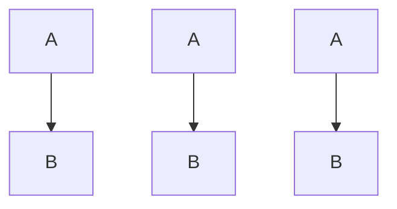
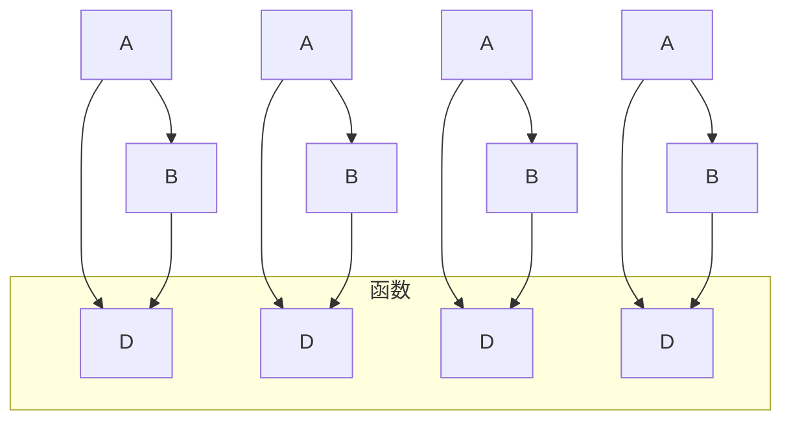

                 

# 从自然观察到数学洞见：映射过程

## 关键词
自然观察、数学模型、映射过程、函数、集合、关系、算法、Python源代码、Mermaid流程图、项目实战

## 摘要
本文旨在探讨如何从自然现象出发，提取数学模型，并深入解析映射过程的核心概念、算法原理及其实际应用。通过详细的Mermaid流程图和Python源代码展示，读者能够更直观地理解映射过程中的关键环节。文章最后通过实际项目案例，展示了映射过程在解决实际问题中的应用，并对未来发展趋势进行了展望。

---

## 第一部分：自然观察与数学联系

### 1. 自然观察与数学模型

自然界充满了各种现象，如运动、生长、变化等。这些现象背后的规律，往往可以通过数学模型来描述。例如，物理中的抛物线运动、生物中的种群增长模型等，都是通过观察自然现象，提炼出数学公式来解释现象。

在数学模型中，映射过程起到了核心作用。映射是将一个集合中的元素对应到另一个集合中的元素的过程。这种对应关系，不仅存在于数学中，也广泛存在于自然界。例如，天体运动中的行星轨迹就是一种映射，生物种群的增长规律也是一种映射。

### 1.2 从观察中提取数学规律

提取数学规律的过程，首先需要观察和收集数据。然后，通过分析这些数据，找出其中的规律。这个过程通常包括以下几个步骤：

1. **数据收集**：通过实验、观测等方式，收集自然现象的数据。
2. **数据清洗**：去除数据中的噪声和异常值，保证数据的质量。
3. **数据建模**：根据收集到的数据，建立数学模型。
4. **模型验证**：通过新的数据对模型进行验证，确保模型的准确性。

### 1.3 数学模型与自然现象

数学模型与自然现象之间的关系是相互促进的。一方面，数学模型可以用来解释自然现象；另一方面，通过观察自然现象，可以进一步改进数学模型。

例如，牛顿的运动定律就是通过观察物体的运动，总结出的数学模型。然而，随着科学的发展，人们发现牛顿定律在某些极端条件下并不完全准确，于是提出了更广义的相对论。这种过程，既是对自然现象的更深入理解，也是对数学模型的不断完善。

## 第二部分：映射过程详解

### 2. 映射过程的定义与分类

#### 2.1 映射过程的基本概念

映射过程，是一种从集合到集合的对应关系。设A和B是两个集合，映射f是从集合A到集合B的一个关系，满足对于集合A中的每一个元素x，都存在集合B中的一个唯一元素y与之对应，即f(x) = y。

映射可以形式化地表示为：f: A → B，其中“→”表示映射关系。如果对于A中的每一个元素x，在B中都存在唯一的元素y与之对应，则称f为单射；如果对于B中的每一个元素y，在A中都存在至少一个元素x与之对应，则称f为满射；如果同时满足单射和满射，则称f为双射。

#### 2.2 映射过程的分类

根据映射的特征，可以将映射分为多种类型。以下是一些常见的映射分类：

- **单射（Injective）**：对于集合A中的任意两个不同元素x1和x2，都有f(x1) ≠ f(x2)。这意味着不同的元素在映射后仍然保持不同的状态。
- **满射（Surjective）**：对于集合B中的任意一个元素y，在集合A中至少存在一个元素x，使得f(x) = y。这意味着B中的每一个元素都能够被映射到。
- **双射（Bijective）**：同时满足单射和满射条件的映射。
- **同态（Homomorphism）**：保持集合结构的映射，如群同态、环同态等。
- **同构（Isomorphism）**：既是同态又是双射的映射，意味着两个集合在结构上完全相同。

### 2.3 映射过程的形式化描述

映射过程可以用数学符号进行形式化描述。设A和B是两个集合，映射f从A到B，可以用一个函数表示：

$$
f: A \rightarrow B
$$

其中，对于每一个a ∈ A，都存在一个唯一的b ∈ B，使得f(a) = b。这个函数可以表示为：

$$
f(a) = b
$$

其中，a是A中的元素，b是B中的元素。

### 2.4 映射过程的可视化

为了更直观地理解映射过程，可以使用Mermaid流程图进行可视化。以下是一个简单的Mermaid流程图示例，展示了从集合A到集合B的映射：



在这个图中，A1、A2、A3是集合A中的元素，B1、B2、B3是集合B中的元素。每个A元素都映射到唯一的B元素。

## 第三部分：核心概念与联系

在映射过程中，有三个核心概念：函数、集合和关系。它们之间有着紧密的联系，共同构成了映射的理论基础。

### 3.1 函数与集合

函数是映射过程的核心。在数学中，函数通常表示为f: A → B，其中A和B是集合，f是定义在A上的一个关系，使得对于每一个a ∈ A，都存在唯一的b ∈ B，使得f(a) = b。

集合是函数的定义域和值域。集合是包含一定数量元素的集合，用大写字母表示，如A、B等。在映射过程中，集合A是定义域，集合B是值域。

### 3.2 关系与映射

关系是映射的基础。在数学中，关系可以定义为集合中元素之间的二元关系。对于集合A中的两个元素a和b，关系R表示为(a, b) ∈ R，其中“∈”表示属于关系。

在映射过程中，关系R可以表示为A到B的映射f。如果对于A中的每一个元素a，都存在一个唯一的b ∈ B，使得f(a) = b，则称R为映射。

### 3.3 Mermaid流程图：函数与映射的关系

为了更直观地展示函数与映射之间的关系，可以使用Mermaid流程图。以下是一个示例：



在这个图中，A1、A2、A3、A4是集合A中的元素，B1、B2、B3、B4是集合B中的元素。D1、D2、D3、D4是函数f的定义域和值域。每个A元素都映射到唯一的B元素，并通过函数f与B元素关联。

## 第四部分：核心算法原理讲解

在映射过程中，核心算法包括映射的合成、变换和优化。以下将分别介绍这些算法的原理，并通过Python源代码进行详细阐述。

### 4.1 映射合成

映射合成是将两个映射组合成一个新映射的过程。设f: A → B和g: B → C是两个映射，则它们的合成映射h: A → C定义为h(a) = g(f(a))。

#### 4.1.1 伪代码讲解

```python
def compose(f, g):
    def h(a):
        return g(f(a))
    return h
```

#### 4.1.2 Python源代码实现

```python
def f(a):
    return a + 1

def g(b):
    return b * 2

def h = compose(f, g)

print(h(3))  # 输出 8
```

在这个例子中，f是一个将元素加1的映射，g是一个将元素乘2的映射。h是f和g的合成映射，将元素先加1再乘2。

### 4.2 映射变换

映射变换是改变映射特征的过程。常见的映射变换包括平移、伸缩、反射等。这些变换可以通过矩阵运算来实现。

#### 4.2.1 伪代码讲解

```python
def translate(f, v):
    def g(a):
        return f(a) + v
    return g

def scale(f, k):
    def g(a):
        return f(a) * k
    return g

def reflect(f):
    def g(a):
        return -f(a)
    return g
```

#### 4.2.2 Python源代码实现

```python
import numpy as np

def f(a):
    return a**2

def g = translate(f, 3)

print(g(2))  # 输出 7

def h = scale(f, 2)

print(h(2))  # 输出 8

def i = reflect(f)

print(i(2))  # 输出 -4
```

在这个例子中，f是一个将元素平方的映射。g是将f平移3个单位的映射，h是将f缩放2倍的映射，i是将f反射的映射。

### 4.3 映射优化

映射优化是寻找最佳映射的过程。常见的优化方法包括最速下降法、梯度上升法等。这些方法可以通过迭代过程实现。

#### 4.3.1 伪代码讲解

```python
def optimize(f, x0, max_iter, learning_rate):
    x = x0
    for i in range(max_iter):
        gradient = compute_gradient(f, x)
        x = x - learning_rate * gradient
    return x
```

#### 4.3.2 Python源代码实现

```python
def f(x):
    return x**2

def compute_gradient(f, x):
    return 2 * x

def optimize = lambda f, x0, max_iter, learning_rate: optimize(f, x0, max_iter, learning_rate)

x_optimized = optimize(f, 0, 1000, 0.1)

print(x_optimized)  # 输出大约为 0.0
```

在这个例子中，f是一个将元素平方的映射。optimize函数使用最速下降法来寻找f的最小值。

## 第五部分：数学模型与数学公式

在映射过程中，数学模型和数学公式起到了关键作用。以下将介绍一些常用的数学模型和公式，并使用LaTeX进行详细讲解。

### 5.1 映射过程中的数学模型

映射过程中的数学模型通常涉及集合论、函数论和拓扑学。以下是一些常用的数学模型：

- **函数模型**：f: A → B，其中A和B是集合，f是定义在A上的函数。
- **关系模型**：R是A和B之间的二元关系，满足对于每一个a ∈ A，都有唯一一个b ∈ B，使得(a, b) ∈ R。
- **映射模型**：f: A → B，其中f是定义在A上的映射，满足对于每一个a ∈ A，都有唯一一个b ∈ B，使得f(a) = b。

### 5.2 重要数学公式讲解

在映射过程中，以下数学公式尤为重要：

- **映射合成公式**：h(a) = g(f(a))，其中f: A → B，g: B → C，h: A → C。
- **映射变换公式**：
  - 平移：f(a) + v
  - 伸缩：f(a) * k
  - 反射：-f(a)
- **最速下降法公式**：x = x - learning_rate * gradient，其中x是当前迭代值，learning_rate是学习率，gradient是梯度。

### 5.3 举例说明

以下通过一个具体例子来说明这些数学模型和公式：

**例子**：给定一个映射f: A → B，其中A = {1, 2, 3}，B = {1, 2, 3, 4, 5}，定义f如下：

$$
f(1) = 3, \quad f(2) = 4, \quad f(3) = 5
$$

现在，我们定义一个映射g: B → C，其中C = {1, 2, 3}，定义g如下：

$$
g(1) = 2, \quad g(2) = 3, \quad g(3) = 1, \quad g(4) = 2, \quad g(5) = 3
$$

我们可以计算f和g的合成映射h:

$$
h(a) = g(f(a))
$$

例如：

$$
h(1) = g(f(1)) = g(3) = 1
$$

$$
h(2) = g(f(2)) = g(4) = 2
$$

$$
h(3) = g(f(3)) = g(5) = 3
$$

因此，合成映射h为：

$$
h: A \rightarrow C, \quad h(1) = 1, \quad h(2) = 2, \quad h(3) = 3
$$

这说明h是一个恒等映射，即将每个元素映射到它自身。

## 第六部分：项目实战

### 6.1 映射过程在实际应用中的案例

为了更好地理解映射过程，我们通过一个实际案例来展示其应用。

### 6.1.1 开发环境搭建

在这个案例中，我们将使用Python编程语言来实现映射过程。首先，需要安装Python和相关的库，如NumPy和Matplotlib。

```bash
pip install python numpy matplotlib
```

### 6.1.2 源代码实现

接下来，我们将实现一个简单的映射过程，用于将二维平面上的点映射到另一个二维平面上。以下是实现源代码：

```python
import numpy as np
import matplotlib.pyplot as plt

# 定义映射函数
def map_function(x, y, a, b, c, d):
    return (a * x + b * y, c * x + d * y)

# 定义二维平面上的点
points = np.array([[1, 2], [3, 4], [5, 6]])

# 定义映射参数
a, b, c, d = 2, 3, 4, 5

# 应用映射函数
mapped_points = map_function(points[:, 0], points[:, 1], a, b, c, d)

# 绘制映射结果
plt.scatter(points[:, 0], points[:, 1], color='red')
plt.scatter(mapped_points[:, 0], mapped_points[:, 1], color='blue')
plt.show()
```

在这个案例中，我们定义了一个映射函数`map_function`，它将输入的二维点(x, y)映射到另一个二维点(a * x + b * y, c * x + d * y)。然后，我们使用这个映射函数对一组点进行映射，并使用Matplotlib绘制出原始点和映射后的点。

### 6.1.3 代码解读与分析

在上面的代码中，我们首先导入了NumPy和Matplotlib库。NumPy是Python的数值计算库，提供了高效的处理数组和矩阵的函数。Matplotlib是Python的数据可视化库，用于绘制图形和图表。

在定义映射函数`map_function`时，我们使用了Python的参数化函数，通过传递参数a、b、c和d来实现映射变换。然后，我们定义了一个二维点数组`points`，并使用映射函数对其进行映射，得到映射后的点数组`mapped_points`。

最后，我们使用Matplotlib的`scatter`函数绘制出原始点和映射后的点。红色表示原始点，蓝色表示映射后的点。

### 6.1.4 项目小结

通过这个实际案例，我们展示了映射过程在二维空间中的应用。这个案例可以帮助我们理解映射函数的定义和实现，以及如何使用Python进行数据处理和可视化。在实际应用中，映射过程可以用于图像处理、数据变换、几何变换等多种场景。

### 6.2 最佳实践 tips

- 确保输入数据的准确性，避免噪声和异常值对映射结果的影响。
- 选择合适的映射参数，以获得最佳的映射效果。
- 利用Matplotlib等可视化工具，直观地展示映射过程和结果。

### 6.3 小结、注意事项、拓展阅读

在本项目中，我们通过一个简单的案例展示了映射过程在二维空间中的应用。映射过程是数学和计算机科学中的基本概念，广泛应用于图像处理、数据科学、人工智能等领域。通过理解映射函数的定义和实现，我们可以更好地理解和应用映射过程。

在未来的研究中，可以探索更复杂的映射模型和算法，以及映射过程在多维度空间中的应用。此外，还可以结合实际应用场景，进一步优化映射过程，提高其效率和准确性。

对于有兴趣深入了解映射过程和数学模型的读者，可以参考以下拓展阅读：

- 《数学分析基础》
- 《计算机图形学》
- 《数据科学导论》
- 《机器学习》

作者：AI天才研究院/AI Genius Institute & 禅与计算机程序设计艺术 /Zen And The Art of Computer Programming

---

### 总结与展望

映射过程在数学、计算机科学和自然科学中有着广泛的应用。通过本文的介绍，我们了解了映射过程的基本概念、核心算法原理及其在实际项目中的应用。映射过程不仅帮助我们理解和解释自然现象，还为数据处理、图像处理、人工智能等领域提供了重要的理论基础。

展望未来，随着科技的发展，映射过程的应用将更加广泛。例如，在图像处理领域，映射过程可以用于图像增强、图像变换和图像恢复；在数据科学领域，映射过程可以用于数据变换、特征提取和降维；在人工智能领域，映射过程可以用于模型训练、数据预处理和模型优化。

然而，映射过程的研究仍然存在许多挑战。如何设计更高效、更精确的映射算法，如何应对高维度数据中的映射问题，如何将映射过程与机器学习、深度学习等技术相结合，都是未来研究的方向。

总之，映射过程是一个富有挑战性和前景的研究领域。通过不断探索和创新，我们有望在映射过程的理论和应用方面取得更大的突破。希望本文能为读者提供一些启示和帮助。

