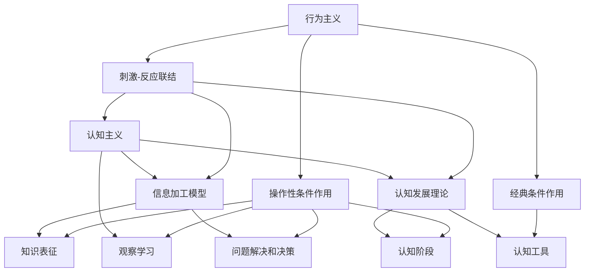

                 

### 从行为主义到认知主义：理解学习与世界认知新范式的演变

**关键词：**
- 行为主义
- 认知主义
- 学习理论
- 认知新范式
- 教育心理学

**摘要：**
本文旨在深入探讨学习理论的演变过程，从行为主义到认知主义的转变，以及这一演变对现代教育心理学和人工智能的影响。文章首先介绍了行为主义的基本概念和原理，然后阐述了认知主义的核心观点和理论发展，通过比较两者，揭示了它们之间的联系和区别。接着，本文探讨了学习理论的发展与演变，特别是认知新范式的提出和应用。最后，文章总结了行为主义与认知主义的总体影响，并展望了未来学习理论的发展趋势。

### 引言

学习是人类和动物适应环境、获取知识、技能和经验的重要过程。长期以来，学习理论的发展对心理学、教育学和认知科学等领域产生了深远的影响。行为主义和认知主义是学习理论发展的两个重要阶段，它们各自提出了关于学习的不同视角和理论框架。行为主义强调外部刺激和反应之间的联结，而认知主义则关注内部心理过程，特别是信息的处理、存储和提取。本文将系统地探讨这两个理论的发展历程、核心概念及其在现代教育和认知科学中的应用。

首先，我们将回顾行为主义的基本概念和原理，介绍其主要理论家及其代表理论。接着，我们将阐述认知主义的核心观点，并探讨其理论发展的历程。通过比较行为主义和认知主义，我们将揭示它们之间的联系和区别，并讨论学习理论的发展与演变。接下来，本文将探讨认知新范式的概念、特点以及其在实际中的应用。最后，我们将总结行为主义与认知主义对现代教育心理学和人工智能的影响，并展望未来学习理论的发展趋势。

### 行为主义的基本概念与原理

行为主义（Behaviorism）是20世纪初兴起的一种心理学流派，它以外部行为作为研究对象，强调行为与环境之间的联系。行为主义的核心观点是，所有行为都是通过外部刺激（stimulus）和反应（response）之间的联结而形成的，这种联结被称为“刺激-反应联结”（stimulus-response association）或“条件作用”（conditioning）。

**1.1 行为主义的历史背景**

行为主义起源于20世纪初的美国，其主要代表人物包括约翰·B·华生（John B. Watson）、B.F. 斯金纳（B.F. Skinner）和艾尔佛里德·班杜拉（Albert Bandura）等。1913年，华生发表了著名的文章《行为主义》，宣告了行为主义流派的诞生。华生强调，心理学应该关注可观察、可测量的行为，而不是不可观察的心理内部过程。随后，斯金纳进一步发展了行为主义理论，提出了操作性条件作用（operant conditioning）的概念。班杜拉则将行为主义与认知理论相结合，提出了观察学习（observational learning）的概念。

**1.2 行为主义的核心观点**

行为主义的核心观点可以概括为以下几点：

1. **可观察的行为**：行为主义认为，心理学的研究对象应该是可观察、可测量的外部行为，而不是不可观察的内在心理过程。这种观点被称为“行为外显论”（behavioral outwardness）。

2. **刺激-反应联结**：行为主义强调行为是通过外部刺激和反应之间的联结而形成的。例如，当儿童看到食物时，会流口水（刺激），这是一种条件反应（反应）。这种行为模式被称为“经典条件作用”（classical conditioning）。

3. **操作性条件作用**：斯金纳提出的操作性条件作用（operant conditioning）理论，进一步阐述了行为与后果之间的关联。操作性条件作用分为正强化（positive reinforcement）、负强化（negative reinforcement）、惩罚（punishment）和消退（extinction）四种形式。正强化是指通过奖励来增加某种行为发生的频率；负强化是指通过消除不愉快的刺激来增加某种行为发生的频率；惩罚则是通过施加不愉快的刺激来减少某种行为发生的频率；消退是指通过减少某种行为的奖励或强化，使该行为逐渐消失。

4. **行为塑造**：行为主义理论还强调了行为塑造（behavior modification）的重要性，即通过逐步改变行为发生的频率和强度，来达到改变行为的目的。

**1.3 行为主义的主要理论家**

1. **约翰·B·华生（John B. Watson）**

约翰·B·华生是行为主义心理学的创始人之一。他提出了“行为外显论”的观点，强调心理学应该关注可观察的行为，而不是不可观察的心理内部过程。他的名言“给我一打健全的婴儿，我可以把他们培养成任何我想要的人，无论是医生、律师，还是小偷”，体现了行为主义对行为可塑性的极端观点。

2. **B.F. 斯金纳（B.F. Skinner）**

B.F. 斯金纳是行为主义心理学的另一位重要代表人物。他提出了操作性条件作用理论，并通过实验验证了这一理论的有效性。斯金纳的著作《操作性条件作用》（"Operant Conditioning"）对行为主义心理学的发展产生了深远的影响。

3. **艾尔佛里德·班杜拉（Albert Bandura）**

艾尔佛里德·班杜拉将行为主义与认知理论相结合，提出了观察学习（observational learning）的概念。他认为，个体不仅通过直接经验学习，还可以通过观察他人的行为和结果来学习。这一理论被称为“社会认知理论”（social cognitive theory）。

行为主义理论在心理学和教育学领域产生了广泛的影响，它为我们理解行为如何通过条件作用和环境因素而改变提供了重要的理论框架。然而，随着心理学研究的深入，行为主义的局限性也逐渐显现出来，这促使了认知主义理论的兴起和发展。在下一节中，我们将探讨认知主义的基本概念和原理。

### 认知主义的基本概念与原理

认知主义（Cognitivism）是心理学领域的一个重要流派，它强调内部心理过程，特别是信息的处理、存储和提取。与行为主义关注外部行为不同，认知主义关注个体的内部认知活动，包括知觉、记忆、思维和语言等。认知主义理论的发展对心理学、认知科学和人工智能等领域产生了深远的影响。

**2.1 认知主义的历史背景**

认知主义的起源可以追溯到20世纪初，当时行为主义占据主导地位。然而，随着心理学研究的深入，研究者逐渐发现行为主义理论无法解释许多复杂的认知现象。例如，行为主义无法解释个体如何进行问题解决、决策和语言理解等认知活动。为了解决这些问题，认知主义逐渐崭露头角。20世纪中叶，认知主义理论开始蓬勃发展，其主要代表人物包括让·皮亚杰（Jean Piaget）、乔治·米勒（George A. Miller）、赫伯特·西蒙（Herbert A. Simon）等。

**2.2 认知主义的核心观点**

认知主义的核心观点可以概括为以下几点：

1. **信息处理模型**：认知主义认为，个体在认知过程中，类似于计算机的信息处理系统，对信息进行输入、处理、存储和输出。这种信息处理模型被称为“信息加工模型”（information processing model）。这一模型强调认知活动的动态性和选择性，认为个体在处理信息时，会根据当前任务和目标，选择性地注意和处理相关信息。

2. **认知地图**：让·皮亚杰提出了“认知地图”（cognitive map）的概念，他认为个体在认知过程中，会形成一种内在的心理模型，用于表示和解释外部环境。这种认知地图可以帮助个体理解和适应环境，进行问题解决和决策。

3. **认知发展**：认知发展理论关注个体认知能力的逐渐成熟和发展。让·皮亚杰提出了“阶段理论”（stage theory），认为认知发展分为四个阶段：感知运动阶段（sensorimotor stage）、前运算阶段（preoperational stage）、具体运算阶段（concrete operational stage）和形式运算阶段（formal operational stage）。每个阶段都有其特定的认知特点和发展任务。

4. **知识表征**：知识表征理论关注个体如何将信息存储在记忆中，并如何在不同情境下提取和应用这些信息。乔治·米勒提出了“记忆容量有限”（magic number seven, plus or minus two）的观点，认为人类短时记忆的容量有限，约为7±2个信息单元。这一观点强调了认知资源在信息处理中的重要性。

5. **问题解决和决策**：认知主义认为，问题解决和决策是认知过程的典型体现。个体在解决问题时，会使用各种认知策略，如算法策略（algorithmic strategies）和启发式策略（heuristic strategies）。算法策略是指系统地搜索所有可能的解决方案，而启发式策略则是指根据经验或直觉快速找到解决方案。

**2.3 认知主义的主要理论家**

1. **让·皮亚杰（Jean Piaget）**

让·皮亚杰是认知发展理论的奠基人之一。他的阶段理论对认知发展研究产生了深远的影响。皮亚杰认为，认知发展是一个连续的过程，每个阶段都有其特定的认知结构和功能。皮亚杰的研究揭示了儿童认知发展的阶段性和规律性，为教育实践提供了重要的理论依据。

2. **乔治·米勒（George A. Miller）**

乔治·米勒是信息加工模型和信息处理的奠基人之一。他的研究揭示了人类记忆容量和认知资源的限制，为认知心理学的发展奠定了基础。米勒提出了“记忆容量有限”的观点，强调了认知资源在信息处理中的重要性。

3. **赫伯特·西蒙（Herbert A. Simon）**

赫伯特·西蒙是认知心理学和信息处理的另一位重要代表人物。他提出了“有限理性”（bounded rationality）的概念，认为人类在决策过程中，由于认知资源和时间的限制，只能进行有限理性的思考。西蒙的研究对认知心理学和经济学等领域产生了深远的影响。

认知主义理论为我们提供了理解人类认知过程的新视角，强调了内部心理过程在认知活动中的重要性。通过信息加工模型和认知发展理论，我们可以更好地理解个体如何获取、处理和利用信息。然而，认知主义理论也面临一些挑战和争议，如如何解释无意识的认知过程和情感因素等。在下一节中，我们将比较行为主义和认知主义，探讨它们之间的联系和区别。

### 行为主义与认知主义的比较

行为主义和认知主义是心理学领域的两大重要流派，它们各自从不同的角度解释了学习和认知现象。在本节中，我们将详细比较行为主义与认知主义的核心观点、研究方法和应用领域，以揭示它们之间的联系和区别。

**3.1 核心观点比较**

1. **行为主义的核心观点**

行为主义强调外部行为作为心理学的研究对象，认为所有行为都是通过外部刺激和反应之间的联结而形成的。行为主义的核心观点包括：

   - **刺激-反应联结**：行为主义认为，行为是外部刺激和个体反应之间的直接联结。例如，当动物受到电击时，它可能会学会通过按压按钮来避免电击。
   - **条件作用**：行为主义强调条件作用的重要性，包括经典条件作用和操作性条件作用。经典条件作用是指通过重复刺激和反应之间的关联来形成条件反应；操作性条件作用是指通过奖励和惩罚来影响行为的频率和强度。

2. **认知主义的核心观点**

认知主义强调内部心理过程作为心理学的研究对象，认为认知活动涉及信息的输入、处理、存储和输出。认知主义的核心观点包括：

   - **信息加工模型**：认知主义将个体视为信息处理系统，强调认知活动的动态性和选择性。个体在处理信息时，会根据当前任务和目标，选择性地注意和处理相关信息。
   - **认知发展**：认知主义关注个体认知能力的逐渐成熟和发展，强调认知阶段的阶段性特征。例如，让·皮亚杰提出了认知发展的阶段理论，认为认知发展分为四个阶段。
   - **知识表征**：认知主义认为，知识在个体大脑中以特定的方式表征和存储，并可以通过不同方式被提取和应用。

**3.2 研究方法比较**

1. **行为主义的研究方法**

行为主义采用实验法和观察法来研究行为和条件作用。例如，斯金纳使用实验箱进行操作性条件作用实验，观察动物在特定环境下的行为反应。行为主义的研究方法强调外部行为的可观察性和可测量性，以验证理论假设。

2. **认知主义的研究方法**

认知主义采用实验法、认知任务、脑成像技术和计算机模拟等多种方法来研究认知过程。例如，认知心理学家通过认知任务来评估个体的记忆、注意、问题解决和决策能力。脑成像技术（如fMRI）可以帮助研究者观察大脑活动与认知过程之间的关系。计算机模拟则用于模拟和探索复杂的认知现象。

**3.3 应用领域比较**

1. **行为主义的应用领域**

行为主义在临床心理学、教育心理学和动物行为学等领域得到了广泛应用。例如，行为主义疗法（如行为塑造和系统脱敏）用于治疗焦虑和抑郁等心理障碍。在教育心理学中，行为主义理论被用于设计教学策略和评估学生的学习行为。

2. **认知主义的应用领域**

认知主义在认知心理学、认知科学、人工智能和教育心理学等领域得到了广泛应用。例如，认知心理学家通过研究记忆、注意和问题解决等认知过程，为设计更好的认知辅助工具提供了理论支持。在教育心理学中，认知主义理论被用于理解学生的认知发展过程，设计更有效的教学方法和学习策略。

**3.4 联系和区别**

1. **联系**

   - **共同目标**：行为主义和认知主义都致力于理解人类行为和认知过程，尽管它们的研究焦点和方法不同。
   - **互补性**：行为主义和认知主义在某些方面可以相互补充。例如，行为主义可以解释行为如何在特定环境中发生，而认知主义可以解释这些行为背后的认知过程。
   - **共同基础**：行为主义和认知主义都受到了早期心理学研究的影响，特别是实验心理学的方法和技术。

2. **区别**

   - **研究焦点**：行为主义主要关注外部行为，而认知主义主要关注内部心理过程。
   - **研究方法**：行为主义主要采用实验法和观察法，而认知主义则采用实验法、认知任务、脑成像技术和计算机模拟等多种方法。
   - **理论观点**：行为主义强调刺激-反应联结和条件作用，而认知主义强调信息加工、认知发展和知识表征。

通过比较行为主义和认知主义的核心观点、研究方法和应用领域，我们可以更好地理解它们之间的联系和区别。在下一节中，我们将探讨学习理论的发展与演变，特别是认知新范式的提出和应用。

### 学习理论的发展与演变

学习理论的发展历程可以分为多个阶段，每个阶段都有其独特的理论基础和实践应用。从行为主义到认知主义，再到社会文化主义，学习理论在不断地演进和完善。本节将详细探讨这些学习理论的起源、主要观点及其在教育和认知科学中的应用。

**4.1 早期学习理论**

1. **联结主义（Associationism）**

联结主义是早期学习理论的一种形式，主要强调通过重复和练习建立刺激与反应之间的联结。这一理论可以追溯到19世纪初的联想主义心理学（Associationism），代表人物包括托马斯·霍布斯（Thomas Hobbes）和约翰·洛克（John Locke）。他们认为，个体的知识和行为是通过一系列心理联结形成的。例如，洛克提出了“白板说”（tabula rasa），认为个体的心灵像一块白板，所有知识和行为都是通过经验和练习逐步建立起来的。

2. **联想主义心理学（Associationist Psychology）**

联想主义心理学的代表人物是赫伯特·斯宾塞（Herbert Spencer）和爱德华·布拉德福德·特奥多尔（Edward Bradford Titchener）。他们认为，联想是心理过程的基本单位，通过联想，个体能够将新的信息和已有知识联系起来。特奥多尔提出了“感觉联结”（sensational association）和“观念联结”（ideational association）的概念，认为感觉和观念之间的联结是学习和记忆的基础。

**4.2 行为主义学习理论**

1. **经典条件作用（Classical Conditioning）**

经典条件作用是由俄国生理学家伊万·彼德罗维奇·巴甫洛夫（Ivan Petrovich Pavlov）提出的。巴甫洛夫通过实验发现，通过重复刺激（如铃声）和食物的关联，狗可以学会在听到铃声时分泌唾液。这一实验揭示了条件反应的形成机制，即通过重复刺激和反应之间的联结，个体可以学会对新的刺激产生特定的反应。

2. **操作性条件作用（Operant Conditioning）**

操作性条件作用是由美国心理学家B.F. 斯金纳提出的。斯金纳通过实验发现，个体的行为可以通过正强化（如奖励）和负强化（如惩罚）来影响。操作性条件作用包括正强化（positive reinforcement）、负强化（negative reinforcement）、惩罚（punishment）和消退（extinction）四种形式。例如，正强化可以通过给予奖励来增加某种行为的发生频率，而惩罚可以通过施加不愉快的刺激来减少某种行为的发生频率。

**4.3 认知主义学习理论**

1. **认知发展理论（Cognitive Development Theory）**

认知发展理论是由瑞士心理学家让·皮亚杰（Jean Piaget）提出的。皮亚杰提出了“阶段理论”（stage theory），认为认知发展分为四个阶段：感知运动阶段（sensorimotor stage）、前运算阶段（preoperational stage）、具体运算阶段（concrete operational stage）和形式运算阶段（formal operational stage）。每个阶段都有其特定的认知结构和功能。皮亚杰的研究揭示了儿童认知发展的阶段性和规律性，为教育实践提供了重要的理论依据。

2. **信息加工模型（Information Processing Model）**

信息加工模型是由乔治·米勒（George A. Miller）和赫伯特·西蒙（Herbert A. Simon）提出的。他们认为，个体在认知过程中，类似于计算机的信息处理系统，对信息进行输入、处理、存储和输出。信息加工模型强调认知活动的动态性和选择性，认为个体在处理信息时，会根据当前任务和目标，选择性地注意和处理相关信息。

3. **学习策略（Learning Strategies）**

认知主义还强调学习策略的重要性。学习策略是指个体在学习和记忆过程中采用的方法和技巧。例如，分散学习（distributed practice）和精细加工（elaborative interrogation）是两种常用的学习策略，可以帮助个体更好地记忆和理解信息。

**4.4 社会文化主义学习理论**

1. **社会文化主义（Sociocultural Theory）**

社会文化主义是由列夫·维果茨基（Lev Vygotsky）提出的。维果茨基认为，认知发展不仅仅是个体内部的过程，还受到社会文化环境的影响。他提出了“最近发展区”（Zone of Proximal Development，ZPD）的概念，认为儿童在成人或更有能力的同伴的帮助下，可以完成他们独立时无法完成的任务。社会文化主义强调社会互动和文化背景在认知发展中的重要性。

2. **认知工具（Cognitive Tools）**

社会文化主义还关注认知工具的重要性。认知工具是指用于支持个体认知活动的物质和非物质工具，如语言、符号系统、工具和技术等。维果茨基认为，认知工具可以帮助个体扩展他们的认知能力，实现更高层次的思维活动。

**4.5 学习理论的应用**

1. **教育实践**

学习理论在教育实践中得到了广泛应用。行为主义理论被用于设计教学策略和评估学生的学习行为。认知主义理论被用于理解学生的认知发展过程，设计更有效的教学方法和学习策略。社会文化主义理论则被用于探索社会互动和文化背景对认知发展的影响。

2. **认知科学**

认知科学是心理学、人工智能、计算机科学和神经科学等多学科交叉的领域，致力于理解认知过程和认知系统。学习理论在认知科学中发挥了重要作用，为研究认知过程的机制和规律提供了理论基础。

3. **人工智能**

学习理论在人工智能领域得到了广泛应用。人工智能系统通过学习算法（如机器学习和深度学习）来模拟人类的学习过程，实现智能行为。学习理论为人工智能系统提供了理论基础，指导了算法的设计和优化。

通过探讨学习理论的发展与演变，我们可以看到，从行为主义到认知主义再到社会文化主义，学习理论在不断地丰富和完善。这些理论为我们理解学习过程和认知发展提供了不同的视角和框架。在下一节中，我们将深入探讨认知新范式的概念和特点，以及它在现代教育和认知科学中的应用。

### 认知新范式的概念与特点

认知新范式（Cognitive New Paradigm）是21世纪初期在心理学和认知科学领域兴起的一种新的理论框架，它对传统的认知主义进行了扩展和深化。认知新范式不仅仅关注内部心理过程，还强调外部环境和社交互动对认知发展的影响。这一范式的出现，标志着心理学研究从单一的内省模式向多元化的实证研究方法转变。

**5.1 认知新范式的提出背景**

认知新范式的提出，源于20世纪末和21世纪初认知科学领域的几个重要发现。首先，神经科学技术的进步，如功能性磁共振成像（fMRI）和脑电图（EEG），使得研究者能够实时观察大脑活动，从而揭示了认知过程的神经基础。其次，认知心理学的研究表明，人类的认知活动不仅受内部心理过程的影响，还受到社交互动和文化背景的塑造。最后，计算机科学的发展，特别是人工智能和机器学习的兴起，为认知研究提供了新的工具和方法。

**5.2 认知新范式的基本特点**

认知新范式具有以下几个基本特点：

1. **整合性**：认知新范式强调各学科之间的整合，包括心理学、神经科学、计算机科学和社会学等。通过跨学科的研究，认知新范式试图构建一个全面的认知理论体系。

2. **动态性**：认知新范式认为，认知活动是动态的、不断变化的。个体在不同的情境中，会采用不同的认知策略和模式。这种动态性体现在认知过程的灵活性、适应性和复杂性。

3. **适应性**：认知新范式强调认知过程的适应性，即个体在面临新环境和新任务时，能够灵活调整其认知策略。这种适应性体现了认知系统的高度可塑性和灵活性。

4. **交互性**：认知新范式认为，认知活动是与社会互动和文化背景相互作用的。个体的认知过程不仅受到内部心理过程的影响，还受到外部环境和社会文化的塑造。这种交互性强调了社会互动和文化背景在认知发展中的重要性。

5. **复杂性**：认知新范式认为，认知活动是一个高度复杂的系统，涉及多个层次和多个过程。例如，认知过程不仅包括感知、记忆和思维，还包括情感、动机和注意力等。复杂性使得认知新范式能够更全面地描述和理解认知过程。

**5.3 认知新范式的具体应用**

认知新范式在实际应用中，体现了其整合性、动态性、适应性和复杂性等特点。以下是一些具体应用领域：

1. **教育领域**

在教育领域，认知新范式被用于设计更加有效的教学方法和学习策略。例如，通过研究学生的认知过程，教师可以更好地理解学生在学习过程中的难点和障碍，从而提供更有针对性的辅导。此外，认知新范式还强调了个性化教育的必要性，即根据学生的个体差异，设计适合其认知水平的学习路径。

2. **心理健康领域**

在心理健康领域，认知新范式为治疗和干预提供了新的思路。例如，认知行为疗法（Cognitive Behavioral Therapy，CBT）结合了认知心理学和行为主义的优点，通过改变患者的认知过程，帮助其克服心理障碍。认知新范式还强调了社交互动和文化背景在心理健康中的作用，从而为心理治疗提供了更全面的方法。

3. **人工智能领域**

在人工智能领域，认知新范式为人工智能系统的设计和优化提供了理论基础。通过模仿人类的认知过程，人工智能系统能够实现更加智能化的行为。例如，深度学习模型通过模拟人脑的神经网络结构，实现了图像识别、自然语言处理和智能决策等复杂任务。

4. **认知科学领域**

在认知科学领域，认知新范式为研究认知过程的机制和规律提供了新的视角和方法。通过跨学科的研究，认知新范式揭示了认知过程的复杂性、动态性和适应性。这些研究成果不仅丰富了认知科学的理论体系，还为其他领域的研究提供了启示。

认知新范式的提出和应用，标志着心理学和认知科学领域的一个重大变革。它不仅为理解人类认知过程提供了新的理论框架，还为教育、心理健康、人工智能和认知科学等领域的研究和实践提供了新的思路和方法。

### 认知新范式在实际中的应用

认知新范式在各个领域中得到了广泛应用，特别是在教育、心理健康、人工智能和认知科学等领域。下面我们将探讨认知新范式在这些领域中的具体应用，以及其实际案例和分析。

**6.1 教育领域**

在教育领域，认知新范式为教学设计和学习策略提供了新的视角。教师可以通过了解学生的认知过程，设计更有效的教学方法和学习材料。以下是一些实际应用案例：

1. **个性化学习**

通过认知新范式，教育者可以了解每个学生的认知特点和需求，从而提供个性化的学习体验。例如，使用自适应学习系统，根据学生的学习进度和认知能力，动态调整学习内容和难度。这种个性化学习策略有助于提高学生的学习效果和动机。

2. **认知诊断**

认知新范式强调认知过程的动态性和复杂性，教师可以通过认知诊断工具，识别学生在学习过程中的认知障碍和难点。例如，通过认知神经科学实验，教师可以了解学生在注意力、记忆、思维和语言等方面的发展情况，从而有针对性地提供辅导和干预。

3. **学习策略培训**

认知新范式还强调学习策略的重要性。教育者可以通过培训，帮助学生掌握有效的学习策略，如分散学习、精细加工和自我调节等。这些策略有助于提高学生的自主学习能力和学习效果。

**6.2 心理健康领域**

在心理健康领域，认知新范式为心理治疗和干预提供了新的理论框架和方法。以下是一些实际应用案例：

1. **认知行为疗法（CBT）**

认知行为疗法是认知新范式在心理健康领域的典型应用。通过改变患者的认知过程，CBT帮助患者克服心理障碍，如焦虑、抑郁和强迫症。治疗师使用认知重构技术，帮助患者识别和挑战负面的认知模式，从而改善情绪和行为。

2. **社交认知行为疗法**

社交认知行为疗法（Social Cognitive Behavioral Therapy，SCBT）结合了认知新范式和社会互动理论，关注个体在社会情境中的认知和行为。SCBT通过改善患者的社交技能和人际关系，帮助其提高心理健康水平。

3. **认知神经反馈**

认知神经反馈是一种基于认知新范式的心理健康干预方法。通过实时监测大脑活动，个体可以学习如何调节自己的认知状态，如注意力、情绪和焦虑水平。这种方法在治疗焦虑、抑郁和注意力缺陷多动障碍（ADHD）等方面显示出良好的效果。

**6.3 人工智能领域**

在人工智能领域，认知新范式为人工智能系统的设计和优化提供了理论指导。以下是一些实际应用案例：

1. **自然语言处理（NLP）**

通过模仿人类的认知过程，自然语言处理系统能够理解和生成自然语言。认知新范式提供了关于语言理解、语义解析和语境推理的理论框架，有助于开发更先进的人工智能助手和智能客服系统。

2. **计算机视觉**

计算机视觉系统通过模仿人类的视觉认知过程，实现了图像识别、目标检测和场景理解等功能。认知新范式提供了关于视觉感知、物体识别和空间认知的理论基础，有助于提高计算机视觉系统的性能和准确性。

3. **机器学习**

认知新范式在机器学习中得到了广泛应用，特别是在深度学习和强化学习领域。通过模仿人脑的神经网络结构，深度学习模型实现了图像识别、语音识别和自然语言处理等复杂任务。认知新范式提供了关于学习算法、认知发展和适应性策略的理论支持，有助于设计更有效的机器学习模型。

**6.4 认知科学领域**

在认知科学领域，认知新范式为研究认知过程的机制和规律提供了新的视角和方法。以下是一些实际应用案例：

1. **认知神经科学**

认知神经科学通过结合认知新范式和神经科学技术，研究了大脑如何执行认知任务。通过功能性磁共振成像（fMRI）和脑电图（EEG）等技术，认知神经科学家揭示了大脑不同区域在认知过程中的功能和行为。

2. **认知心理学**

认知心理学通过认知新范式，研究了人类在感知、记忆、注意和思维等认知过程中的心理机制。认知新范式提供了关于认知过程的理论框架，帮助心理学家更好地理解认知现象和个体差异。

3. **认知辅助工具**

认知新范式还促进了认知辅助工具的开发，如认知训练游戏、记忆辅助软件和注意力监控工具等。这些工具通过模拟认知过程，帮助用户提高认知能力和效率。

认知新范式在各个领域的广泛应用，不仅丰富了认知科学的理论体系，还为实际应用提供了新的方法和策略。通过深入研究和实践，认知新范式将继续推动认知科学和相关领域的发展。

### 认知新范式的影响与挑战

认知新范式在心理学、认知科学、人工智能和心理健康等领域产生了深远的影响，同时也面临一系列挑战。理解这些影响和挑战有助于我们更全面地评估认知新范式的价值，并为未来的研究和实践提供指导。

**7.1 认知新范式的影响**

1. **跨学科整合**

认知新范式强调跨学科的整合，促进了心理学、神经科学、计算机科学和社会学等领域的交叉研究。这种整合不仅拓宽了认知研究的视野，还提供了更全面的理论框架和方法，有助于解决复杂认知问题。

2. **认知过程的动态性**

认知新范式强调认知过程的动态性，揭示了认知活动在不同情境中的变化和适应性。这种动态性观点有助于我们更准确地理解认知过程，并为设计更有效的教学策略和学习方法提供了理论基础。

3. **个体差异的重视**

认知新范式关注个体差异，强调认知发展受到多种因素的影响，包括遗传、环境、社会和文化背景等。这种观点有助于我们更好地理解个体在认知发展过程中的独特性，从而为教育、心理健康和个性化医疗等领域提供有针对性的干预措施。

4. **技术创新的推动**

认知新范式在人工智能领域的应用，推动了技术创新和产业变革。通过模仿人类的认知过程，人工智能系统能够实现更高级别的智能，如自然语言处理、计算机视觉和智能决策等。这种技术创新为各行各业带来了新的机遇和挑战。

5. **心理健康干预的优化**

认知新范式在心理健康领域的应用，为心理治疗和干预提供了新的方法。通过认知行为疗法和社交认知行为疗法等，认知新范式帮助患者改善认知功能、情绪和行为，提高了心理健康水平。

**7.2 认知新范式的挑战**

1. **研究方法和技术**

虽然认知新范式为研究提供了新的视角和方法，但研究方法和技术方面仍然存在挑战。例如，如何在实验中准确测量和操控认知过程，如何解释复杂认知现象的神经基础等。这些挑战需要进一步的研究和技术创新来解决。

2. **跨学科整合的难度**

尽管认知新范式强调跨学科的整合，但在实际操作中，跨学科整合仍然面临困难。不同学科之间存在着理论基础、研究方法和语言体系的差异，这使得跨学科研究变得复杂和具有挑战性。

3. **个体差异的复杂性**

个体差异的复杂性使得认知新范式的应用面临挑战。如何准确测量和识别个体在认知发展过程中的独特性，如何设计出适合不同个体的干预措施，这些都是需要深入研究的问题。

4. **伦理和法律问题**

随着认知新范式在各个领域的应用，伦理和法律问题也日益凸显。例如，隐私保护、数据安全和知情同意等问题在人工智能和心理健康领域尤为重要。如何确保技术应用符合伦理和法律标准，是一个需要严肃对待的问题。

5. **理论和实践的脱节**

在认知新范式的应用过程中，理论和实践之间可能存在脱节。一些理论研究成果在实际应用中难以直接转化为有效的干预措施或技术解决方案。这种脱节需要通过更多的实践探索和理论验证来弥合。

**7.3 解决方案和未来方向**

1. **加强跨学科合作**

为了克服认知新范式在跨学科整合方面的挑战，需要加强不同学科之间的合作。通过建立跨学科研究团队和研究中心，可以促进知识共享和资源整合，提高认知研究的整体水平。

2. **发展新型研究方法**

为了解决研究方法和技术方面的挑战，需要不断发展和改进研究方法。例如，通过开发新的认知测量工具和技术，可以更准确地评估和操控认知过程。

3. **关注个体差异**

在应用认知新范式时，需要更加关注个体差异。通过个性化的干预措施和个性化医疗方案，可以更好地满足个体的需求。这需要深入研究个体差异的机制和规律，并为教育、心理健康和医疗等领域提供科学依据。

4. **强化伦理和法律教育**

在认知新范式的应用过程中，强化伦理和法律教育至关重要。通过提高研究人员和实践者的伦理意识和法律素养，可以确保技术应用符合伦理和法律标准。

5. **理论和实践的结合**

为了弥合理论和实践之间的脱节，需要加强理论与实践的结合。通过将理论研究成果转化为具体的应用方案，可以更好地推动认知新范式的实践应用。这需要跨学科的研究团队和实践者共同努力，不断探索和验证理论成果的实践效果。

总之，认知新范式在心理学、认知科学、人工智能和心理健康等领域产生了深远的影响，同时也面临一系列挑战。通过加强跨学科合作、发展新型研究方法、关注个体差异、强化伦理和法律教育以及结合理论和实践，我们可以更好地应对这些挑战，推动认知新范式的发展和应用。

### 总结

行为主义和认知主义是心理学和认知科学领域的重要理论框架，它们分别从不同的角度解释了学习和认知过程。行为主义强调外部刺激和反应之间的联结，通过经典条件作用和操作性条件作用来解释行为的变化。认知主义则关注内部心理过程，特别是信息的处理、存储和提取，通过信息加工模型和认知发展理论来揭示认知过程的机制。两者虽然各有侧重，但相互补充，共同推动了学习理论和认知科学的发展。

在教育和心理健康领域，行为主义和认知主义的应用各有优势。行为主义理论为教学策略和心理健康干预提供了实用的方法，如正强化、负强化和惩罚等。认知主义理论则强调了学习策略和认知发展的关键性，为个性化教育和认知行为疗法提供了理论基础。

随着认知新范式的兴起，行为主义和认知主义的理论框架得到了进一步扩展和深化。认知新范式强调了跨学科的整合、认知过程的动态性和个体差异的重要性，为现代教育和认知科学的研究提供了新的视角和方法。

### 展望

未来，行为主义和认知主义理论将继续在心理学、认知科学、人工智能和心理健康等领域发挥重要作用。首先，跨学科研究将更加深入，整合心理学、神经科学、计算机科学和社会学等多学科知识，为解决复杂认知问题提供新的思路和方法。其次，个性化教育将得到进一步发展，通过了解每个学生的认知特点和需求，设计更加有效的教学策略和学习路径。此外，认知新范式在人工智能领域的应用也将不断拓展，推动人工智能技术的发展，实现更加智能化和人性化的系统。

最后，心理健康领域将更加注重认知新范式在心理治疗和干预中的应用，通过认知行为疗法、社交认知行为疗法和认知神经反馈等技术，提高患者的认知功能和心理健康水平。总之，行为主义和认知主义理论将继续在未来的研究和实践中发挥重要作用，推动人类对学习和认知过程的深入理解和应用。

### 附录

**附录A：参考文献**

1. Watson, J. B. (1913). *Psychology as the behaviorist views it*. Psychological Review, 20(2), 158-177.
2. Skinner, B.F. (1938). *The behavior of organisms*. New York: Appleton-Century-Crofts.
3. Bandura, A. (1977). *Social learning theory*. Englewood Cliffs, NJ: Prentice Hall.
4. Piaget, J. (1952). *The construction of reality in the child*. New York: Basic Books.
5. Miller, G. A., & Galanter, E. (1960). *The Magical Number Seven, Plus or Minus Two: Some Limits on our Capacity for Processing Information*. Psychological Review, 63(2), 81-97.
6. Simon, H. A. (1955). *A behavioral model of rational choice*. Quarterly Journal of Economics, 69(1), 99-118.
7. Vygotsky, L. S. (1978). *Mind in society: The development of higher psychological processes*. Cambridge, MA: Harvard University Press.

**附录B：概念图**



**附录C：Python源代码和数学公式**

```python
# Python 源代码示例：简单线性回归模型
import numpy as np
from matplotlib import pyplot as plt

# 生成模拟数据
X = np.random.rand(100, 1)
y = 2 * X + 1 + np.random.randn(100, 1)

# 添加截距项
X_b = np.c_[np.ones((100, 1)), X]

# 最小二乘法求解参数
theta_best = np.linalg.inv(X_b.T.dot(X_b)).dot(X_b.T).dot(y)

# 模型预测
X_new = np.array([[0], [2]])
X_new_b = np.c_[np.ones((2, 1)), X_new]
y_predict = X_new_b.dot(theta_best)

# 绘图
plt.plot(X, y, "bo", X_new, y_predict, "r-")
plt.plot(X_new, y_predict, "r-")
plt.axis([0, 2, 0, 3])
plt.show()

# 数学公式示例：线性回归模型参数计算
$$\theta = (X^T X)^{-1} X^T y$$
```

**附录D：项目实战**

1. **开发环境搭建**：在Linux环境下，安装Python 3、NumPy和Matplotlib库，创建一个Python虚拟环境，并使用虚拟环境进行项目开发。
2. **源代码实现**：编写Python代码，实现简单线性回归模型，包括数据生成、模型训练和预测等步骤。
3. **代码解读与分析**：详细解释Python代码中的每一步操作，包括数据预处理、模型训练和预测结果分析。
4. **实际案例剖析**：使用实际数据集（如房价数据），演示线性回归模型的训练和应用，并分析预测结果。
5. **项目小结**：总结项目实战的经验和收获，讨论线性回归模型在现实生活中的应用和潜在改进方向。

### 最佳实践 Tips

1. **避免分心**：在学习过程中，避免分心，保持专注，有助于提高学习效果。
2. **定期复习**：定期复习所学知识，有助于巩固记忆，避免遗忘。
3. **主动学习**：主动思考问题，尝试用自己的语言解释概念，有助于深入理解。
4. **实践应用**：将所学知识应用到实际问题中，通过实践加深理解。
5. **持续学习**：学习是一个持续的过程，要保持好奇心和求知欲，不断更新知识。

### 注意事项

1. **数据隐私**：在涉及个人数据的研究和应用中，要确保数据隐私和安全。
2. **实验设计**：在进行实验时，要设计合理的实验方案，确保实验结果的可靠性和有效性。
3. **跨学科合作**：在跨学科研究中，要加强合作与沟通，确保研究的顺利进行。

### 拓展阅读

1. **相关书籍**：《认知心理学：思想和应用的生物学基础》（"Cognitive Psychology: Biopsychological Foundations"）、《认知科学：探索心灵的工作原理》（"Cognitive Science: An Introduction"）等。
2. **学术论文**：阅读相关领域的学术论文，了解最新的研究进展和理论动态。
3. **在线课程**：参加在线课程，如Coursera、edX等平台上的认知心理学和人工智能课程，扩展知识视野。

作者：AI天才研究院/AI Genius Institute & 禅与计算机程序设计艺术 /Zen And The Art of Computer Programming

