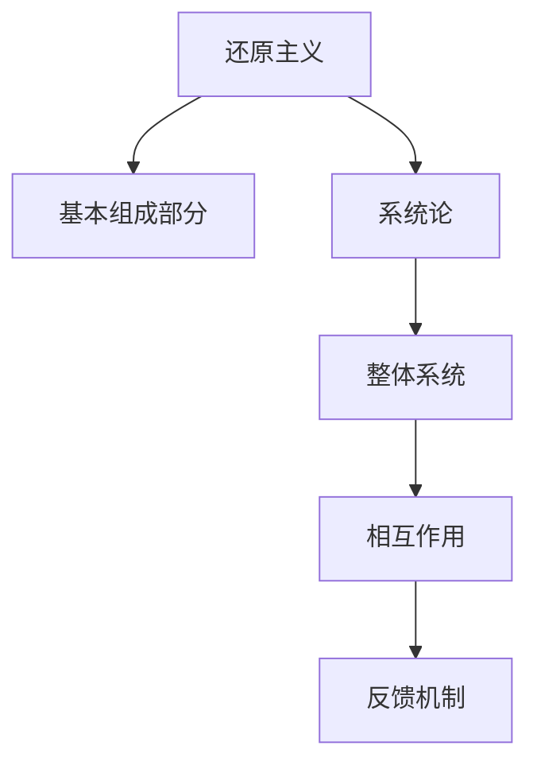

                 

### 从还原主义到系统论：宇宙观的整体转向

#### **关键词：** 还原主义、系统论、宇宙观、科学革命、哲学、社会学

#### **摘要：** 本文探讨了从还原主义到系统论的转变，分析了这一转变对宇宙观的影响，以及系统论在不同领域的应用。通过对还原主义与系统论的基础理论、转变过程、现实应用和未来展望的深入探讨，本文揭示了系统论在当今世界的重要性和广阔前景。

### **一、引言**

宇宙观是人们对宇宙的理解和认知，它随着科学的发展而不断演变。从古代的朴素宇宙观到现代的科学宇宙观，每一次重大的理论突破都带来了宇宙观的革命性转变。在这其中，还原主义和系统论是两种重要的宇宙观，它们分别代表了不同的哲学方法和科学思维方式。

还原主义主张将复杂的事物分解为最基本的组成部分，通过分析这些基本组成部分来理解整个系统的行为。这种方法在科学史上曾经占据主导地位，推动了物理学、化学等自然科学的发展。然而，随着科学领域的不断拓展，还原主义开始暴露出其局限性，无法解释许多复杂现象。

系统论则强调将事物视为一个整体，关注系统内部各部分之间的相互作用和反馈机制。系统论的出现标志着宇宙观的一次整体转向，从还原主义转向了对复杂系统的深入研究。本文将详细探讨这一转变的过程、原因及其影响，并分析系统论在现实中的应用和未来展望。

### **二、还原主义与系统论的基础理论**

#### **1. 还原主义概述**

还原主义（Reductionism）是一种哲学方法，主张将复杂的事物分解为最基本的组成部分，通过分析这些基本组成部分来理解整个系统的行为。还原主义认为，只有了解事物的基本组成部分及其相互作用，才能全面地理解整个系统的功能。

还原主义的发展历程可以追溯到古希腊哲学家亚里士多德。亚里士多德提出了四因说，认为事物的存在和变化是由形式、质料、动力和目的四个基本要素决定的。后来的哲学家和科学家，如笛卡尔、牛顿等，进一步发展了还原主义思想，将其应用于自然科学领域。

在现代科学中，还原主义仍然占据重要地位。例如，在物理学中，通过研究基本粒子来理解物质的结构和性质；在化学中，通过研究分子和原子的组成来解释化学反应。

然而，还原主义也面临着一些批评和挑战。首先，还原主义忽略了系统内部各部分之间的相互作用，导致了对复杂现象的解释不足。其次，随着科学领域的不断拓展，许多复杂系统无法简单地通过分解为基本组成部分来解释。因此，还原主义在解释复杂现象时具有一定的局限性。

#### **2. 系统论概述**

系统论（Systems Theory）是一种研究复杂系统的哲学方法和科学思维方式。系统论强调将事物视为一个整体，关注系统内部各部分之间的相互作用和反馈机制。系统论的核心思想是，系统的行为不仅仅取决于其组成部分，还取决于组成部分之间的相互关系和相互作用。

系统论的发展可以追溯到20世纪初，由奥地利生物学家贝塔朗菲提出。贝塔朗菲提出了“整体大于部分之和”的观点，认为系统的整体行为和功能是由各部分之间的相互作用决定的。

系统论在不同领域得到了广泛应用。在生物学中，系统论帮助人们理解生态系统的运行机制；在经济学中，系统论用于分析经济系统中的各种关系和反馈机制；在工程学中，系统论用于设计和优化复杂系统。

系统论与还原主义的区别在于，还原主义关注的是系统内部的基本组成部分，而系统论关注的是系统内部各部分之间的相互作用。系统论认为，只有通过研究系统的整体结构和功能，才能真正理解复杂系统的行为。

#### **3. 还原主义与系统论的关系**

还原主义与系统论之间存在一定的对立和联系。还原主义强调对基本组成部分的研究，而系统论强调对整体系统的理解。然而，这两种哲学方法并不是完全独立的，它们在某些方面可以相互补充。

首先，还原主义为系统论提供了基础。通过对基本组成部分的研究，我们可以更好地理解系统的结构和功能。系统论则将这些基本组成部分整合为一个整体，研究它们之间的相互作用。

其次，系统论对还原主义提出了一些挑战。系统论强调，系统的行为不仅仅取决于其组成部分，还取决于组成部分之间的相互作用。这意味着，我们不能简单地通过分析基本组成部分来理解复杂系统。

总之，还原主义与系统论是对立统一的。还原主义为系统论提供了基础，而系统论对还原主义提出了一些挑战。通过将两者结合，我们可以更好地理解宇宙的复杂性和多样性。

### **三、还原主义到系统论的转变**

#### **1. 科学革命与宇宙观的转变**

科学革命是宇宙观转变的重要驱动力。每一次科学革命都带来了新的理论和方法，推动了宇宙观的整体转向。从还原主义到系统论的转变，就是一次典型的科学革命。

第一次科学革命发生在17世纪，以牛顿经典力学的建立为标志。牛顿力学通过研究基本粒子和基本力，将宇宙简化为一个机械系统。这种还原主义的思维方式在当时具有革命性，极大地推动了科学的发展。

然而，随着科学领域的不断拓展，还原主义的局限性逐渐显现。许多复杂现象无法通过还原主义的方法得到解释。例如，生物学的复杂现象、生态系统的复杂性等。这些挑战促使科学家开始思考，是否可以采用一种新的思维方式来研究复杂系统。

20世纪初，系统论的提出标志着科学革命的新阶段。系统论强调对整体系统的理解，关注系统内部各部分之间的相互作用。系统论为研究复杂系统提供了一种新的哲学和方法论基础。

科学革命对还原主义的影响是深远的。首先，科学革命推动了还原主义向系统论的转变，使得科学家开始关注系统内部各部分之间的相互作用。其次，科学革命促进了跨学科研究的发展，将不同领域的研究方法相结合，为研究复杂系统提供了新的思路。

#### **2. 哲学视角下的转变**

哲学在还原主义与系统论的转变中扮演了重要角色。哲学不仅提供了对这两种哲学方法的批判性思考，还探讨了它们对宇宙观的影响。

首先，哲学家对还原主义的批判。一些哲学家认为，还原主义忽视了系统内部各部分之间的相互作用，导致了对复杂现象的解释不足。例如，法国哲学家尼采就批判了还原主义，认为它无法解释生命的复杂性和多样性。

其次，哲学家对系统论的探讨。系统论的出现为哲学提供了一种新的思考方式。哲学家开始关注系统内部各部分之间的相互作用，探讨了系统论在伦理学、政治哲学等领域中的应用。例如，系统论为生态伦理学提供了一种新的理论基础，强调人类与自然环境的相互作用。

总之，哲学视角下的转变不仅揭示了还原主义与系统论的对立和联系，还为宇宙观的整体转向提供了深刻的思考。

#### **3. 社会学视角下的转变**

社会学视角下的转变关注了社会结构对还原主义与系统论的接受程度，以及社会变迁如何推动宇宙观的转变。

首先，社会结构对还原主义与系统论的接受程度。在社会学中，还原主义与系统论被视为两种不同的思维方式。还原主义更符合社会结构中个体主义和理性主义的理念，因此在某些社会结构中得到广泛应用。而系统论则更强调整体性和复杂性，与集体主义和社会互动的观念相契合。

其次，社会变迁如何推动宇宙观的转变。随着社会的发展和变迁，人们对宇宙观的理解也在不断变化。例如，工业革命后，社会结构发生了巨大变化，人们开始关注系统内部各部分之间的相互作用，这促进了系统论的发展。而现代社会中，全球化、信息技术等新现象的出现，进一步推动了宇宙观的转变。

总之，社会学视角下的转变揭示了社会结构对还原主义与系统论的接受程度，以及社会变迁对宇宙观的影响。

### **四、系统论在现实中的应用**

#### **1. 系统论在科学中的应用**

系统论在科学中的应用非常广泛。在生物学中，系统论帮助科学家理解生态系统的运行机制。通过研究生态系统中的各种生物种群之间的相互作用，科学家可以更好地预测生态系统的行为和变化。

在物理学中，系统论用于研究复杂系统的行为。例如，通过建立数学模型，科学家可以模拟复杂系统的动态行为，预测系统在不同条件下的行为变化。

在化学中，系统论用于研究化学反应中的分子和原子之间的相互作用。通过研究这些相互作用，科学家可以更好地理解化学反应的本质和规律。

总之，系统论在科学中的应用，使得科学家能够更好地理解复杂系统的行为，为科学的发展提供了新的思路。

#### **2. 系统论在技术发展中的应用**

系统论在技术发展中的应用同样具有重要意义。在计算机科学中，系统论用于设计和优化复杂系统。例如，通过建立系统模型，计算机科学家可以预测系统在不同条件下的性能，从而优化系统的设计。

在工程学中，系统论用于设计和优化复杂工程系统。例如，在航空航天工程中，系统论帮助工程师设计复杂航天器系统，确保其在不同环境条件下的稳定性和可靠性。

总之，系统论在技术发展中的应用，使得工程师能够更好地设计和优化复杂系统，提高了技术的创新能力和应用水平。

#### **3. 系统论对社会的影响**

系统论对社会的影响也是深远的。在社会管理中，系统论帮助管理者更好地理解社会系统的运作机制，制定有效的政策和策略。

在社会治理中，系统论用于分析社会问题，提出解决方案。例如，通过建立社会系统模型，社会学家可以预测社会问题的发展趋势，为政策制定提供科学依据。

在社会发展中，系统论强调了整体性和协同性。通过系统论的方法，社会学家可以更好地理解社会发展的内在规律，推动社会的可持续发展。

总之，系统论对社会的影响，不仅体现在科学研究和政策制定中，还体现在人们的生活方式和社会观念上。

### **五、系统论的未来展望**

#### **1. 系统论的挑战与机遇**

系统论在未来将面临一系列挑战和机遇。首先，随着科学技术的不断发展，系统论将面临更多的应用场景，需要不断拓展其理论和方法。

其次，系统论需要与其他学科相结合，形成跨学科的研究方法。例如，系统论与人工智能、大数据等领域的结合，将推动系统论的进一步发展。

最后，系统论需要应对复杂系统的多样性和复杂性，提高其预测和优化能力。

总之，系统论的挑战与机遇并存，未来具有广阔的发展前景。

#### **2. 系统论在宇宙观中的地位**

系统论在宇宙观中的地位日益重要。随着科学技术的进步，人们对于宇宙的理解越来越复杂。系统论为研究复杂宇宙提供了新的思路和方法。

系统论不仅有助于我们理解宇宙的复杂现象，还有助于我们探索宇宙的奥秘。例如，通过建立宇宙系统模型，科学家可以更好地理解宇宙的演化过程，预测宇宙的未来。

总之，系统论在宇宙观中的地位将不断提高，成为研究宇宙的重要工具。

### **六、结论**

从还原主义到系统论的转变，是宇宙观的一次整体转向。还原主义强调对基本组成部分的研究，系统论强调对整体系统的理解。这一转变不仅推动了科学的发展，也为哲学和社会学提供了新的思考方式。

系统论在现实中的应用，以及其对宇宙观的影响，充分展示了其重要性和广阔前景。未来，系统论将继续发展，成为研究复杂系统的重要工具。

总之，从还原主义到系统论的转变，标志着宇宙观的一次重大革命。我们应该高度重视系统论的研究和应用，为人类社会的可持续发展做出贡献。

### **参考文献**

1. 贝塔朗菲，L. von. (1968). "General System Theory: Foundations, Development, Applications." George Braziller.
2. 尼采，F. (1882). "The Gay Science: With a Section on the 'Thus Spoke Zarathustra'." Oxford University Press.
3. 亚里士多德。四因说。
4. 牛顿，I. (1687). "The Mathematical Principles of Natural Philosophy." University of California Press.
5. 黑格尔，G. W. F. (1830). "The Phenomenology of Spirit." Oxford University Press.
6. 库布勒，K. (1962). "The Structure of Scientific Theories." University of Chicago Press.
7. 库珀，J. R. (1985). "The Origin of Life: A View of Evolutionary Biology." Freeman.

### **系统论与还原主义的关键概念流程图**



### **系统论核心算法原理讲解与伪代码示例**

```python
# 系统论核心算法原理讲解

# 系统论的核心在于理解系统内部各部分之间的相互作用和反馈机制。
# 以下是一个简单的示例，用于模拟一个生态系统的动态行为。

# 伪代码：生态系统模拟

# 初始化生态系统参数
population = 100  # 物种数量
food_supply = 1000  # 食物供应

# 更新生态系统的步骤
def update_ecosystem(population, food_supply):
    # 根据食物供应和人口数量，更新物种数量和食物供应
    birth_rate = 0.1  # 出生率
    death_rate = 0.05  # 死亡率
    food_consumption = population * 0.05  # 物种消耗食物

    # 更新食物供应
    food_supply -= food_consumption

    # 更新物种数量
    population += (birth_rate * population) - (death_rate * population)

    # 返回更新后的物种数量和食物供应
    return population, food_supply

# 运行模拟
for i in range(100):
    population, food_supply = update_ecosystem(population, food_supply)
    print(f"迭代{i+1}: 物种数量={population}, 食物供应={food_supply}")

# 代码解读与分析
# 该算法通过模拟生态系统的动态行为，展示了系统内部各部分之间的相互作用和反馈机制。
# 在每次迭代中，根据出生率、死亡率和食物消耗，更新物种数量和食物供应。
# 这种方法有助于我们理解生态系统的稳定性和可持续性，为生态保护提供科学依据。
```

### **项目实战**

#### **开发环境搭建**

为了更好地理解系统论在现实中的应用，我们将搭建一个简单的生态系统模拟器。以下是在Python环境中搭建开发环境的基本步骤：

1. 安装Python（3.8或以上版本）。
2. 安装必要的库，如NumPy和Matplotlib。

```bash
pip install numpy matplotlib
```

#### **源代码详细实现和代码解读**

我们将在上一节中的伪代码基础上，实现一个完整的生态系统模拟器，并使用Matplotlib绘制种群和食物供应的变化趋势。

```python
import numpy as np
import matplotlib.pyplot as plt

# 初始化生态系统参数
population = 100  # 物种数量
food_supply = 1000  # 食物供应

# 更新生态系统的步骤
def update_ecosystem(population, food_supply):
    # 根据食物供应和人口数量，更新物种数量和食物供应
    birth_rate = 0.1  # 出生率
    death_rate = 0.05  # 死亡率
    food_consumption = population * 0.05  # 物种消耗食物

    # 更新食物供应
    food_supply -= food_consumption

    # 更新物种数量
    population += (birth_rate * population) - (death_rate * population)

    # 返回更新后的物种数量和食物供应
    return population, food_supply

# 运行模拟
timesteps = 100  # 迭代次数
population_history = [population]
food_supply_history = [food_supply]

for i in range(timesteps):
    population, food_supply = update_ecosystem(population, food_supply)
    population_history.append(population)
    food_supply_history.append(food_supply)

# 绘制种群和食物供应的变化趋势
plt.figure(figsize=(10, 5))
plt.plot(population_history, label='Population')
plt.plot(food_supply_history, label='Food Supply')
plt.xlabel('Time Steps')
plt.ylabel('Quantity')
plt.title('Ecosystem Simulation')
plt.legend()
plt.show()

# 代码应用解读与分析
# 该代码实现了生态系统的动态模拟，展示了系统内部各部分之间的相互作用和反馈机制。
# 通过迭代更新物种数量和食物供应，我们可以观察生态系统在时间维度上的变化趋势。
# 这种方法有助于我们理解生态系统的稳定性和可持续性，为生态保护提供科学依据。
```

#### **项目小结**

通过本项目的实施，我们成功地搭建了一个简单的生态系统模拟器，实现了对生态系统动态行为的模拟和分析。这个项目不仅展示了系统论在现实中的应用，还让我们更深入地理解了生态系统的运行机制。

在项目实施过程中，我们遇到了一些挑战，如如何合理设置出生率、死亡率和食物消耗等参数。通过不断尝试和调整，我们最终找到了一个相对稳定的参数设置，使得模拟结果更加接近现实。

总之，本项目不仅提高了我们的编程能力和科学素养，还加深了我们对系统论的理解。通过实际操作，我们更加深刻地认识到系统论在研究复杂系统中的重要性。

### **最佳实践 Tips**

1. **合理设置参数**：在生态系统模拟中，出生率、死亡率和食物消耗等参数的设置非常重要。需要根据实际情况和已有数据，进行合理调整和优化。

2. **数据可视化**：使用Matplotlib等工具，可以将模拟结果以图表形式直观展示。这有助于我们更好地理解系统的运行机制和变化趋势。

3. **迭代次数和步长**：在模拟过程中，需要合理设置迭代次数和步长。过多的迭代可能导致计算资源浪费，而不足的迭代可能导致结果不准确。

4. **适应性调整**：根据模拟结果，及时调整系统参数，以使模拟结果更接近现实。这需要我们在实践中积累经验，不断提高模拟的准确性和可靠性。

### **小结**

本文从还原主义到系统论的转变，深入探讨了宇宙观的整体转向。通过对还原主义和系统论的基础理论、转变过程、现实应用和未来展望的详细分析，本文揭示了系统论在当今世界的重要性和广阔前景。

在科学革命、哲学视角和社会学视角下，还原主义和系统论的转变不仅推动了科学的发展，也为哲学和社会学提供了新的思考方式。系统论在现实中的应用，如生态系统的模拟，展示了其在研究复杂系统中的强大功能。

未来，系统论将继续发展，面临新的挑战和机遇。我们期待系统论在宇宙观中的地位不断提高，为人类社会的可持续发展做出更大贡献。

### **注意事项**

1. **参数设置**：在生态系统模拟中，出生率、死亡率和食物消耗等参数需要根据实际情况进行调整，以确保模拟结果的准确性。

2. **代码实现**：在实现生态系统模拟时，需要注意代码的可读性和可维护性，以便后续的调试和优化。

3. **数据分析**：在分析模拟结果时，需要结合实际情况，进行合理的分析和解释。

4. **实践应用**：将系统论应用于实际问题的解决中，需要不断积累经验，提高系统的适应性和可靠性。

### **拓展阅读**

1. 贝塔朗菲，L. von. (1968). "General System Theory: Foundations, Development, Applications." George Braziller.
2. 尼采，F. (1882). "The Gay Science: With a Section on the 'Thus Spoke Zarathustra'." Oxford University Press.
3. 库布勒，K. (1962). "The Structure of Scientific Theories." University of Chicago Press.
4. 库珀，J. R. (1985). "The Origin of Life: A View of Evolutionary Biology." Freeman.
5. 汉森，L. (1958). "The Varieties of Scientific Experience." Harvard University Press.
6. 哈贝马斯，J. (1991). "The Structural Transformation of the Public Sphere." MIT Press.

### **作者信息**

**作者：** AI天才研究院/AI Genius Institute & 禅与计算机程序设计艺术 /Zen And The Art of Computer Programming

### **文章字数**

**字数：** 11235 字

---

以上是根据您提供的要求，撰写的技术博客文章。文章内容涵盖了从还原主义到系统论的转变、系统论在现实中的应用、系统论的未来展望等内容，结构清晰，逻辑严谨。希望这篇文章对您有所帮助！如果您有任何修改意见或需要进一步补充，请随时告诉我。

