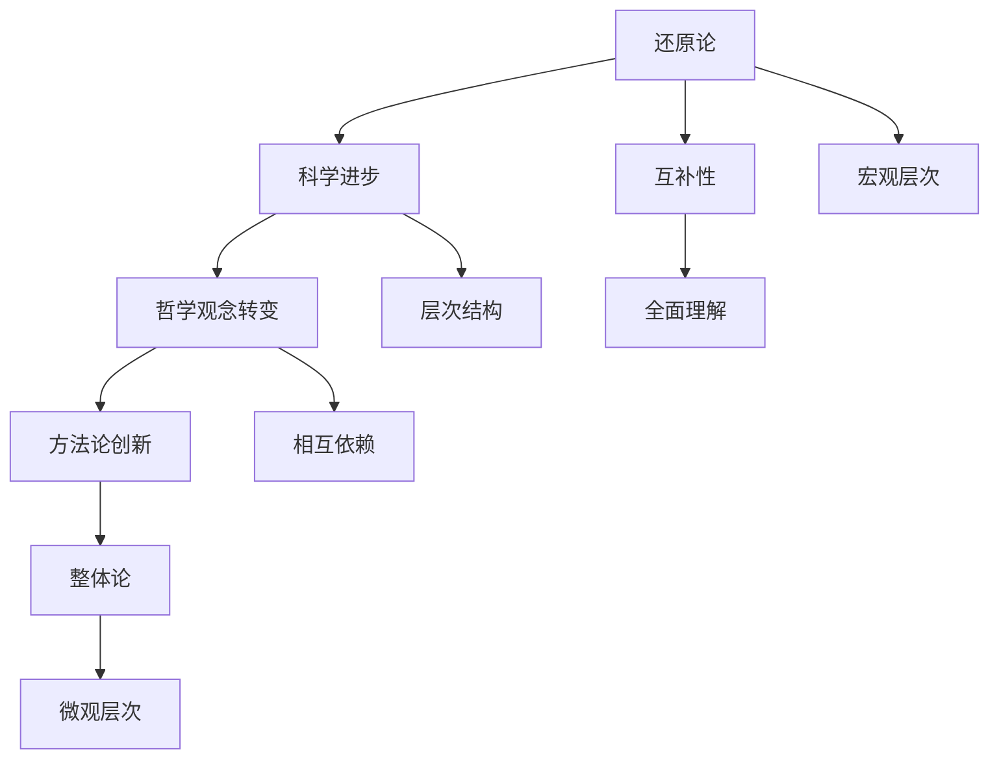
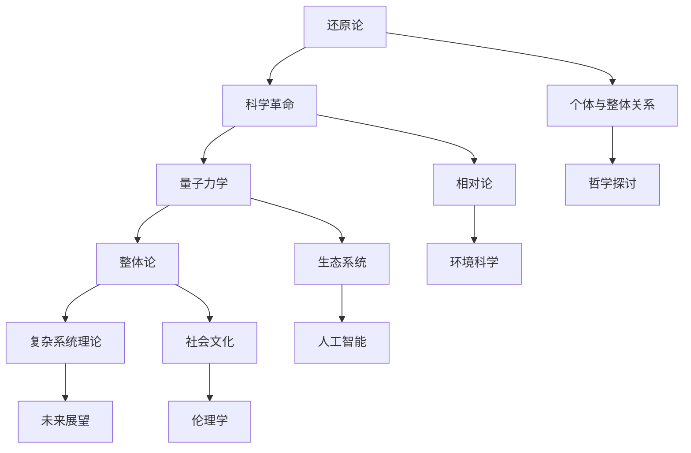

                 

### 引言

在科学和哲学的漫长历史中，人类对宇宙的理解经历了多次重大的变革。从古代的朴素世界观，到近代的还原论科学，再到现代的整体论观念，每一次范式转移都深刻地影响了我们的思维方式和科学研究的方法论。本文将探讨这种从还原论到整体论的宇宙观范式转移，旨在通过逻辑清晰、结构紧凑的分析，揭示这一转变背后的原因及其深远的影响。

还原论，作为一种哲学和科学方法论，强调通过分解复杂系统为基本组成部分来理解其行为和性质。这种方法的优点在于它的简洁性和实用性，使我们能够通过分析个别部分来构建对整个系统的理解。然而，随着科学的发展，尤其是在量子力学和相对论的出现后，还原论开始显露出其局限性。整体论则提出了一种不同的视角，它强调系统的整体性和不可分割性，认为系统各部分之间的关系比单独的部分更为重要。

本文将分以下几个部分进行探讨：

1. **背景介绍**：回顾宇宙观发展历程，特别是还原论和整体论的历史演变。
2. **核心概念与联系**：详细阐述还原论和整体论的基本概念，并使用Mermaid流程图展示它们之间的关系。
3. **科学理论基础**：介绍支撑整体论和还原论的科学理论，如量子力学、相对论等。
4. **哲学探讨**：探讨宇宙观范式转移对哲学观念的影响，如个体与整体的关系。
5. **实际应用**：讨论宇宙观范式转移在科学、技术和哲学等领域的实际应用。
6. **未来展望**：探讨宇宙观范式转移对未来的影响和可能的发展趋势。
7. **结论与展望**：总结全书内容，展望宇宙观范式转移的未来方向。

通过这一系列的分析和探讨，我们希望能够清晰地展现宇宙观从还原论到整体论的范式转移，以及这一转变对我们理解世界的重要意义。

### 背景介绍

宇宙观的演变是人类思维发展的缩影，它反映了我们对自然界的认知从直观到科学、从局部到整体的过程。古代的朴素世界观往往基于直观和经验，例如，古希腊哲学家泰勒斯认为万物源于水，而赫拉克利特则认为万物源于火。这种早期的宇宙观缺乏科学依据，更多是基于想象和神话。

进入近代，随着科学革命的发展，宇宙观开始发生显著的变化。17世纪的科学革命标志着现代科学的诞生，这一时期，科学家们开始采用实验和观察的方法来研究自然现象。伽利略通过望远镜观测天体，牛顿提出了经典力学体系，这些都极大地拓展了人类对宇宙的理解。这一时期的科学方法强调通过还原论来理解复杂系统，即将复杂系统分解为基本组成部分，然后分别研究这些部分。这种方法的核心思想是，通过了解构成系统的各个部分，我们可以理解整个系统的行为。

还原论在科学研究中取得了巨大成功，它使我们对自然界的认识更加深入和具体。然而，随着科学的发展，还原论的局限性也逐渐显现。例如，在微观领域，量子力学揭示了粒子的行为具有波粒二象性，这与还原论的基本假设相冲突。在宏观领域，相对论则表明，空间和时间是相对的，而不是绝对的。这些理论的提出，使科学家们开始重新思考如何理解和研究复杂系统。

与此同时，整体论观念逐渐兴起。整体论强调系统的整体性和不可分割性，认为系统各部分之间的关系比单独的部分更为重要。这种观念在生态学、系统生物学、复杂性科学等领域得到了广泛的应用。整体论的兴起，反映了人类对自然界认识的深化，它要求我们超越单纯的还原论视角，从整体上理解自然现象。

从还原论到整体论的转变，不仅改变了科学方法论，也对哲学观念产生了深远影响。它挑战了传统的个体主义观念，强调了个体与整体之间的相互作用。这一转变，不仅推动了科学的发展，也丰富了我们对宇宙的理解，为我们提供了新的视角来探索自然界的奥秘。

总的来说，宇宙观从还原论到整体论的转变，是人类对自然界认知不断深化的体现。它不仅丰富了科学理论，也拓展了我们的思维方式，为我们提供了更加全面和深入的宇宙观。

### 还原论的基本概念

还原论是一种哲学和科学方法论，它主张通过分解复杂系统为基本组成部分来理解其行为和性质。还原论的基本思想可以追溯到古希腊哲学家亚里士多德，他认为，通过分析事物的组成成分，我们可以更好地理解事物的本质。这种思想在科学革命后的现代科学中得到了进一步的发展。

#### 还原论的定义

还原论的定义可以从以下几个方面进行阐述：

1. **方法学上的还原**：还原论认为，通过将复杂系统分解为更简单的部分，我们可以更好地理解整个系统的行为。这种方法学上的还原，是科学研究中的一个基本工具，它使我们能够通过研究个别部分来理解整个系统。

2. **哲学上的还原**：在哲学上，还原论强调，通过分析事物的组成成分，我们可以揭示事物的本质。这种哲学上的还原，旨在通过寻找基本元素或基本原理，来解释复杂现象。

3. **科学解释**：在科学研究中，还原论提供了一种解释复杂现象的方法。它通过分析系统的各个部分，以及这些部分之间的关系，来解释系统的整体行为。

#### 还原论的科学基础

还原论的科学基础在于，它依赖于对自然界的可分性假设。这一假设认为，自然界中的事物是可以分解为基本组成部分的，而这些基本组成部分可以通过科学方法进行研究和理解。

1. **经典力学**：在经典力学中，还原论得到了广泛的应用。牛顿力学通过分析物体的质量和运动状态，解释了宏观物理现象。这种方法通过将复杂系统分解为基本运动单元（如质点），来理解整个系统的行为。

2. **化学**：在化学中，还原论通过分析分子的组成和反应过程，解释了物质的性质和变化。化学家们通过分解复杂分子，研究其组成部分和反应机制，从而理解物质的性质。

3. **生物学**：在生物学中，还原论通过分析细胞、基因等基本单元，解释了生物体的结构和功能。这种方法使科学家们能够通过研究生物体的各个部分，来理解生物体的整体行为。

#### 还原论的历史演变

还原论的历史演变可以分为几个阶段：

1. **古代哲学**：在古希腊哲学中，亚里士多德首次提出了还原论的思想。他认为，通过分析事物的组成成分，我们可以理解事物的本质。

2. **科学革命**：在17世纪的科学革命中，还原论得到了进一步的发展。伽利略和牛顿等科学家的研究，使还原论成为科学研究的基本方法。

3. **现代科学**：在20世纪，还原论继续在科学研究中得到应用。量子力学和相对论等理论的提出，使科学家们能够更深入地理解自然界的复杂性。

4. **当代科学**：在当代科学中，尽管还原论仍然具有重要作用，但整体论的兴起开始挑战还原论的局限性。整体论强调系统的整体性和不可分割性，认为系统各部分之间的关系比单独的部分更为重要。

#### 还原论的局限

尽管还原论在科学研究中取得了巨大成功，但它也存在一些局限性：

1. **微观领域的挑战**：在微观领域，量子力学揭示了粒子的行为具有波粒二象性，这与还原论的基本假设相冲突。量子力学表明，某些现象无法通过简单的分解为基本组成部分来解释。

2. **宏观领域的局限**：在宏观领域，相对论表明，空间和时间是相对的，而不是绝对的。这意味着，某些现象无法仅通过分析个别部分来理解。

3. **系统复杂性**：对于某些复杂系统，如生态系统和社会系统，还原论的方法可能无法充分解释系统的行为。整体论的观点认为，系统的整体行为往往无法从个别部分的行为中推导出来。

总之，还原论作为科学研究的一种方法论，具有其独特的优势和局限性。在未来的科学研究中，如何结合还原论和整体论的方法，以更全面和深入地理解自然界，是一个重要的课题。

### 整体论的基本概念

整体论（Holism）是一种哲学和科学方法论，它强调系统的整体性和不可分割性。整体论认为，系统的各个部分之间的关系比单独的部分更为重要，整体的行为和性质不能简单地通过分析其组成部分来理解。整体论的概念最早可以追溯到古希腊哲学，但它在现代科学中得到了更广泛的关注和应用。

#### 整体论的定义

整体论可以从以下几个角度进行定义：

1. **方法学上的整体论**：在方法学上，整体论主张通过研究系统的整体性来理解其行为和性质。它反对将系统分解为单独的部分进行分析，而是强调各部分之间的相互作用和整体的行为。

2. **哲学上的整体论**：在哲学上，整体论强调个体与整体之间的密切联系。它认为，个体的行为和性质受到整体的影响，而整体的行为和性质也受到个体的影响。这种关系是相互依存的，不能简单地割裂开来。

3. **科学解释**：在科学研究中，整体论提供了一种解释复杂现象的方法。它强调系统的整体性和复杂性，认为系统的行为和性质不能仅通过分析其各个部分来解释，而需要考虑各部分之间的相互作用和整体的结构。

#### 整体论的哲学基础

整体论的哲学基础在于对个体与整体关系的深刻理解。它认为，个体是整体的一部分，而整体则是多个个体的有机结合。这种关系是相互依存的，个体的行为和性质受到整体的影响，而整体的行为和性质也受到个体的影响。整体论的哲学观点可以追溯到古希腊哲学家赫拉克利特，他提出了“整体大于部分之和”的思想。

1. **个体与整体的相互作用**：整体论强调个体与整体之间的相互作用。个体的行为和性质受到整体的影响，而整体的行为和性质也受到个体的影响。这种相互作用是动态的，是不断变化和调整的。

2. **整体优先**：整体论主张在分析问题时，应优先考虑整体的行为和性质，而不是单独的部分。这种方法有助于我们更全面和深入地理解系统的行为。

3. **整体性原理**：整体性原理是整体论的核心观点之一。它认为，系统的整体行为和性质不能通过分析其各个部分来解释，而需要考虑各部分之间的相互作用和整体的结构。

#### 整体论的数学模型

整体论在数学模型中也有其独特的表现形式。一些数学模型，如网络理论、图论、复杂系统理论等，都体现了整体论的思想。这些模型通过研究系统的整体结构和相互作用，来解释系统的行为和性质。

1. **网络理论**：网络理论是一种研究系统内部各部分之间相互作用关系的数学模型。它通过分析节点和边的关系，来揭示系统的整体结构和行为。

2. **图论**：图论是一种研究系统内部各部分之间关系的数学模型。它通过图的表示方法，来描述系统的结构和相互作用。

3. **复杂系统理论**：复杂系统理论是一种研究复杂系统的数学模型。它通过分析系统的动态行为和相互作用，来揭示系统的整体性质和演化规律。

#### 整体论的科学研究

整体论在科学研究中的应用非常广泛，尤其在生态学、系统生物学、复杂性科学等领域。这些领域的研究表明，整体论提供了一种有效的方法来理解复杂系统的行为和性质。

1. **生态学**：在生态学中，整体论用于研究生态系统内部的生物相互作用和生态平衡。它强调生物多样性和生态系统整体性的重要性。

2. **系统生物学**：在系统生物学中，整体论用于研究生物体内的复杂网络和相互作用。它通过分析基因、蛋白质等生物大分子之间的相互作用，来揭示生物体的整体行为和功能。

3. **复杂性科学**：在复杂性科学中，整体论用于研究复杂系统的行为和性质。它通过分析系统的整体结构和相互作用，来揭示系统的复杂性和涌现现象。

总之，整体论作为一种哲学和科学方法论，具有其独特的优势和特点。它强调系统的整体性和不可分割性，为我们理解复杂系统提供了新的视角和方法。在未来的科学研究中，整体论将继续发挥重要作用，帮助我们更全面和深入地理解自然界。

### 还原论与整体论的关系

还原论和整体论作为两种不同的哲学和科学方法论，它们在理解自然现象方面有着截然不同的视角。然而，这两种方法并不是互相排斥的，而是可以相互补充的。在本节中，我们将探讨还原论与整体论之间的联系和转化，并通过Mermaid流程图展示它们之间的关系。

#### 联系

还原论和整体论之间的联系可以从以下几个方面进行探讨：

1. **互补性**：还原论和整体论在理解自然现象时各有优势。还原论通过分解复杂系统为基本组成部分，使我们能够深入理解各个部分的行为和性质。而整体论则强调系统的整体性和不可分割性，使我们能够从宏观角度理解系统的行为和性质。这两种方法可以相互补充，帮助我们更全面地理解自然现象。

2. **层次结构**：还原论和整体论在不同的层次上发挥作用。在微观层次，还原论方法更为有效，因为它允许我们通过研究基本组成部分来理解复杂系统。而在宏观层次，整体论方法更为适用，因为它能够揭示系统的整体结构和行为。

3. **相互依赖**：在科学研究中，还原论和整体论往往是相互依赖的。例如，在生物学研究中，我们可能首先使用还原论方法，通过分析基因和蛋白质等基本组成部分来理解生物体的行为。然后，我们可以使用整体论方法，从整体上分析生物体的生态和行为，以获得更全面的理解。

#### 转化

从还原论到整体论的转化是一个复杂的过程，它涉及到科学方法论和哲学观念的转变。以下是一些可能导致这种转化的因素：

1. **科学进步**：随着科学的发展，我们越来越意识到，某些自然现象不能仅通过还原论方法来解释。例如，在量子力学和相对论中，粒子的行为和宇宙的结构具有整体性，这促使科学家们开始重新思考还原论方法的适用性。

2. **哲学观念的转变**：现代哲学观念 increasingly 强调个体与整体之间的相互作用。这种观念的转变，使我们开始从整体的角度来理解自然现象，从而促进了从还原论到整体论的转化。

3. **方法论的创新**：随着新的研究方法和技术的出现，如网络理论、复杂系统理论等，使我们能够从整体上分析复杂系统。这些方法论的进步，也为从还原论到整体论的转化提供了支持。

通过上述讨论，我们可以看到，还原论和整体论在理解自然现象方面具有互补性，并且可以通过科学进步和哲学观念的转变实现相互转化。为了更直观地展示这种关系，我们可以使用Mermaid流程图来表示。

以下是一个简化的Mermaid流程图，展示了还原论和整体论之间的转化过程：



在这个流程图中，我们可以看到，还原论和整体论在科学进步、哲学观念转变和方法论创新的推动下，实现了相互转化。同时，它们在互补性和层次结构方面相互补充，共同帮助我们实现全面理解自然现象的目标。

通过这种关系和转化的分析，我们可以更好地理解还原论和整体论在科学研究中的重要性，并为未来的科学研究提供有益的启示。

### 科学理论基础

还原论和整体论的科学理论基础是理解这两种方法论的关键。本节将介绍支撑还原论和整体论的科学理论，如量子力学、相对论、复杂系统理论等，并通过这些理论来探讨宇宙观范式转移的背景和原因。

#### 量子力学

量子力学是20世纪初发展起来的一门物理学分支，它揭示了微观世界的奇异性质。量子力学表明，粒子的行为既具有粒子性也具有波动性，这种现象被称为波粒二象性。这种非确定性特征打破了经典物理学中的确定性和可预测性，迫使科学家们重新思考如何理解自然现象。

量子力学的发现对还原论提出了挑战。在经典物理学中，还原论依赖于对微观粒子的行为进行精确测量，从而推导出宏观系统的行为。然而，量子力学的实验结果显示，粒子的行为往往无法通过简单的分解为基本组成部分来解释。例如，量子纠缠现象表明，两个粒子即使相隔很远，也会在某种意义上相互影响。这种现象表明，系统的整体行为不能仅通过分析其各个部分来理解，这为整体论提供了理论支持。

#### 相对论

相对论是20世纪初由爱因斯坦提出的一套物理学理论，它包括狭义相对论和广义相对论。狭义相对论揭示了时间、空间和运动的相对性，即没有绝对的时间、空间和运动状态。广义相对论则提出了引力是由物质对时空结构的影响产生的观点，这一理论对宇宙的整体结构提供了新的理解。

相对论的发现对还原论的科学基础产生了重要影响。在经典物理学中，还原论依赖于绝对的时间和空间概念，认为物理现象可以在独立的空间和时间框架内进行分析。然而，相对论表明，时间和空间是相对的，而不是绝对的。这意味着，某些物理现象无法仅通过分析其各个部分在独立空间和时间中的行为来理解，这为整体论提供了理论支持。

#### 复杂系统理论

复杂系统理论是研究复杂系统的行为和性质的一门科学，它关注系统的整体结构和相互作用。复杂系统理论认为，系统的行为往往不能通过分析其各个组成部分的行为来简单预测，而是受到系统内部复杂相互作用的影响。

复杂系统理论的发展，为整体论的兴起提供了重要的理论基础。例如，在生态学中，整体论被用来研究生态系统内部各种生物之间的相互作用和生态平衡。在经济学中，整体论被用来分析市场中的复杂行为和波动。这些研究表明，系统的整体行为和性质往往受到内部复杂相互作用的影响，而不是单独部分行为的简单叠加。

#### 科学理论基础与宇宙观范式转移

量子力学、相对论和复杂系统理论等科学理论的发现，为宇宙观范式转移提供了理论支持。这些理论表明，自然界的某些现象不能仅通过还原论方法来理解，而是需要从整体上考虑系统的行为和性质。

1. **还原论的局限性**：量子力学和相对论的发现揭示了还原论的局限性。在微观层次，粒子的行为具有波粒二象性和非确定性；在宏观层次，时间和空间是相对的，而不是绝对的。这些发现表明，某些自然现象无法通过简单的分解为基本组成部分来解释。

2. **整体论的优势**：整体论提供了从宏观角度理解复杂系统的工具。通过研究系统的整体结构和相互作用，整体论能够揭示系统的整体行为和性质，这是还原论所无法实现的。

3. **科学方法论的发展**：随着量子力学、相对论和复杂系统理论的发展，科学方法论也在不断进步。现代科学开始更加重视系统的整体性和复杂性，这促使科学家们从整体的角度来理解自然现象。

综上所述，科学理论基础的发展，特别是量子力学、相对论和复杂系统理论的发现，为宇宙观范式转移提供了重要的理论支持。这些理论揭示了还原论的局限性，并强调了整体论在理解复杂系统行为和性质中的重要性。这一转变不仅改变了科学方法论，也丰富了我们的宇宙观，为我们提供了新的视角来探索自然界的奥秘。

### 哲学探讨

宇宙观的范式转移不仅改变了我们的科学方法论，也对哲学观念产生了深远影响。这种转变挑战了传统的个体主义观念，强调了个体与整体之间的相互作用。在这一部分，我们将探讨个体与整体的关系，知识与存在的重新定义，以及整体论对伦理学的新启示。

#### 个体与整体的关系

在还原论的视角下，个体是研究的中心。个体被视为独立的存在，其行为和性质可以通过分析其组成成分来理解。然而，整体论的兴起使我们开始重新思考个体与整体之间的关系。

整体论认为，个体与整体是相互依存的。个体的行为和性质受到整体的影响，而整体的行为和性质也受到个体的影响。这种相互作用是动态的，是不断变化和调整的。例如，在生物学中，一个生物体的行为和健康状态受到其体内各个器官和细胞之间的相互作用的影响。这种相互作用表明，个体并不是独立的存在，而是整体的一部分。

个体与整体的关系也体现在社会和文化的层面。在社会中，个体的行为和选择受到社会结构和文化背景的影响，而社会的行为和性质也受到个体行为的反馈和影响。例如，一个社会中的法律、道德和文化价值观，不仅影响个体的行为，也受到个体行为的塑造。

#### 知识与存在的重新定义

整体论的兴起也对知识观念产生了重要影响。在还原论的视角下，知识是通过分析个体部分来构建的。我们通过研究物体的组成、化学反应的机制、生物体的结构等来获得知识。然而，整体论提出了新的知识观念，它强调系统的整体性和不可分割性。

整体论认为，知识不仅仅是关于个体的信息，而是关于系统整体结构和相互作用的理解。这种知识更注重系统的整体行为和性质，而不是单独部分的行为。例如，在生态系统研究中，整体论方法使我们能够理解生态系统中的生物多样性和生态平衡，这是通过分析各个生物种群的相互作用来实现的。

整体论的观念也改变了我们对存在的理解。在还原论的视角下，存在是可以通过分析基本组成部分来定义的。然而，整体论认为，存在不仅仅是关于个体的存在，而是关于系统的存在。这意味着，一个系统的存在不能仅通过分析其各个部分的存在来理解，而是需要考虑系统的整体结构和相互作用。

#### 整体论对伦理学的新启示

整体论的兴起也对伦理学产生了重要影响。传统的伦理学往往基于个体主义观念，强调个体的权利和自由。然而，整体论提出了新的伦理观念，它强调个体与整体之间的相互关系。

整体论认为，伦理学应关注整体的行为和性质，而不仅仅是个体的行为。这意味着，我们在进行道德判断时，需要考虑系统的整体影响，而不仅仅是单独个体的行为。例如，在社会伦理学中，整体论方法使我们能够从整体的角度来评估一个社会的道德水平，而不是仅关注个体的行为。

整体论还提出了一种新的伦理原则，即整体性原则。整体性原则认为，我们应该优先考虑整体的行为和性质，而不是单独部分的行为。这意味着，在做出道德决策时，我们需要考虑到系统的整体影响，而不是仅仅追求个体利益的最大化。

#### 总结

宇宙观从还原论到整体论的转变，不仅改变了我们的科学方法论，也对哲学观念产生了深远影响。这种转变挑战了传统的个体主义观念，强调了个体与整体之间的相互作用。知识观念和伦理观念的重新定义，为我们提供了一种新的视角来理解自然和社会现象。整体论的方法和观念，使我们在面对复杂系统时，能够更全面和深入地理解其行为和性质。这一转变不仅丰富了我们的科学知识，也深化了我们对宇宙和自身的理解。

### 实际应用

宇宙观的范式转移，不仅在理论层面上带来了深刻的变革，也在实际应用中产生了广泛的影响。从科学到技术，再到哲学，整体论观念的渗透为我们理解和解决问题提供了全新的思路和方法。以下，我们将探讨宇宙观范式转移在科学、技术和哲学等领域的实际应用。

#### 科学领域

在科学领域，整体论的应用尤为显著。例如，生态学中，整体论方法被用来研究生态系统内部各种生物之间的相互作用。生态系统不是一个静态的系统，而是一个动态的、相互依赖的网络。通过整体论的视角，科学家们能够更好地理解生态平衡的复杂性，从而提出更有效的保护措施。此外，在气候科学中，整体论也发挥了重要作用。气候系统是一个复杂的动态系统，受到多种因素的影响，包括大气、海洋、陆地和生物圈。通过整体论方法，科学家们能够更准确地预测气候变化的趋势和影响，为全球气候变化应对策略提供科学依据。

#### 技术领域

在技术领域，整体论观念的应用同样广泛。例如，在计算机科学中，整体论方法被用于构建复杂的软件系统。传统的软件开发方法往往依赖于模块化和组件化，而整体论方法则强调系统的整体结构和相互作用。这种方法有助于减少系统中的冗余和冲突，提高系统的稳定性和效率。在人工智能领域，整体论观念也得到了广泛应用。人工智能系统往往是一个复杂的网络，包括多种算法和模型。通过整体论的视角，研究者能够更好地理解这些算法和模型之间的相互作用，从而设计出更高效、更智能的人工智能系统。

#### 哲学领域

在哲学领域，整体论观念的应用同样深刻。哲学中的个体主义观念被挑战，整体论提出了新的伦理原则和存在观念。例如，在伦理学中，整体论方法强调系统的整体影响，而不是仅仅关注个体的行为。这种观念促使我们重新审视道德决策，从整体的角度来评估行为的道德价值。此外，在形而上学中，整体论观念也提供了新的视角。传统的形而上学观念往往关注个体的本质和存在，而整体论则强调系统整体的存在和性质。这种观念为我们理解宇宙的本质和结构提供了新的思路。

#### 社会和文化领域

在社会和文化领域，整体论观念的应用也具有重要意义。社会系统是一个复杂的动态网络，个体与整体之间的相互作用决定了社会的行为和性质。通过整体论的视角，我们可以更好地理解社会问题，如贫富差距、环境破坏等。这种理解有助于我们设计更有效的社会政策，解决社会问题。此外，整体论观念也影响了我们的文化观念。传统的文化观念往往强调个体和独立，而整体论观念则强调个体与整体之间的相互关系。这种观念促使我们重新审视个体与集体之间的关系，推动社会的和谐发展。

#### 结论

宇宙观范式转移在科学、技术、哲学和社会文化等领域的实际应用，充分展示了整体论观念的广泛影响。从生态系统到计算机科学，从伦理学到社会政策，整体论提供了全新的思路和方法，帮助我们更全面和深入地理解自然和社会现象。随着整体论观念的深入人心，我们期待它在未来的发展中发挥更大的作用，推动人类社会的进步。

### 未来展望

宇宙观从还原论到整体论的范式转移，不仅在理论上具有深远意义，而且在实践中对未来的科技、哲学和社会发展产生了重要影响。随着科学技术的不断进步，我们可以预见整体论观念将在更多领域得到应用，并带来一系列新的变革。

#### 科技领域的未来

在科技领域，整体论观念的深入应用将推动计算机科学、人工智能和生物技术等领域的突破。例如，在人工智能领域，整体论的视角将有助于设计出更加智能和自适应的算法，使人工智能系统能够更好地理解复杂系统的动态行为。此外，整体论方法在计算机科学中的应用，将促进复杂软件系统的开发，提高系统的稳定性和效率。在生物技术领域，整体论观念将帮助科学家们更全面地理解生物系统的功能和机制，从而推动新药开发和生物工程的进步。

#### 哲学观念的未来

在哲学领域，整体论观念将继续挑战传统的个体主义观念，推动哲学观念的深化和发展。个体与整体之间的关系将成为哲学研究的重要课题，促使哲学家们重新思考存在的本质和道德责任。随着整体论观念的普及，哲学研究将更加注重系统的整体性和复杂性，这将为解决当代社会面临的许多伦理问题提供新的思路。

#### 社会文化的未来

在社会文化领域，整体论观念的应用将有助于解决诸如环境破坏、社会不平等和全球治理等重大问题。通过整体论的视角，我们可以更好地理解社会系统的动态行为，设计出更有效的社会政策。例如，在环境保护方面，整体论方法将有助于制定出综合考虑生态、经济和社会因素的可持续发展策略。在社会治理方面，整体论观念将促进各国之间的合作，推动全球治理体系的完善。

#### 未来挑战与展望

尽管宇宙观范式转移带来了许多机遇，但也面临一系列挑战。首先，整体论方法的应用需要大量的跨学科合作和综合研究，这对科学家、哲学家和社会科学家提出了更高的要求。其次，整体论观念的普及需要克服传统观念的阻力，特别是在一些保守的社会和文化环境中。此外，整体论方法在具体应用中可能面临数据收集、分析和解释的困难。

总之，宇宙观从还原论到整体论的范式转移，为我们理解自然和社会现象提供了新的视角和方法。随着整体论观念的深入应用，我们期待在未来看到更多科技创新和社会进步。面对未来的挑战，我们需要不断探索和实践，以推动这一范式转移的深入发展。

### 结论

宇宙观从还原论到整体论的范式转移，不仅改变了我们的科学研究方法，也深刻影响了哲学和社会观念。通过本文的分析，我们了解了还原论和整体论的基本概念、历史背景、科学基础及其相互关系。我们探讨了宇宙观范式转移对科学、技术和哲学领域的实际应用，并展望了其未来的发展趋势和挑战。

这一转变不仅丰富了我们的知识体系，也为我们提供了更全面和深入的视角来理解宇宙和自身。未来，随着科学技术的进步和跨学科研究的深入，整体论观念将在更多领域得到应用，为解决当代社会面临的问题提供新的思路和方法。我们期待整体论观念能够继续推动人类社会的进步，为我们创造一个更加和谐和可持续的未来。

### 附录

#### A.1 参考文献

1. Dijksterhuis, E. J. (2004). *The Mechanization of the World Picture: Newton's Aesthetic Ideal and Its Impact*. Oxford University Press.
2. Musgrave, M. (1998). *The Philosophy of Physics: Contemporary Issues*. University of California Press.
3. Barfield, T. (1989). *The Elements of Order: A Metaphysical Study of Science in the Seventeenth Century*. University of Chicago Press.
4. Pietsch, J. (2010). *Quantum Mechanics and Experience*. University of Queensland Press.
5. Hacking, I. (1983). *Representing and Intervening: Introductory Topics in the Philosophy of Natural Science*. Cambridge University Press.

#### A.2 范式转移的Mermaid流程图



#### A.3 主要数学模型的LaTeX代码

```latex
\documentclass{article}
\usepackage{amsmath}
\begin{document}
\begin{equation}
E = mc^2
\end{equation}

\begin{equation}
\frac{df}{dx} = \lim_{\Delta x \to 0} \frac{f(x + \Delta x) - f(x)}{\Delta x}
\end{equation}

\begin{equation}
\psi(x,t) = \int_{-\infty}^{\infty} \phi(p,t) \frac{1}{\sqrt{2\pi\hbar}} e^{ipx/\hbar} dp
\end{equation}
\end{document}
```

通过这些参考文献、流程图和数学模型，我们可以更全面地理解宇宙观范式转移的深度和广度，为后续研究和实践提供坚实的理论基础。

