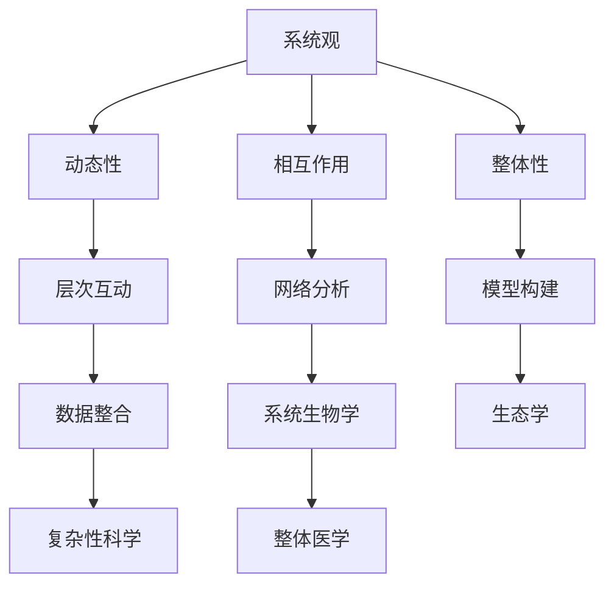

                 


# 从还原论到整体论：生命科学的世界理解

关键词：还原论，整体论，生命科学，复杂性科学，系统生物学

摘要：本文旨在探讨从还原论到整体论在生命科学领域的应用与转变。通过分析还原论的局限性，引入整体论的概念，结合复杂性科学和系统生物学的理论，详细阐述了整体论在理解生命现象中的重要性。本文首先介绍了还原论的基本原理，接着讨论了其在生命科学研究中的局限性，随后引入了整体论的概念，并阐述了其在系统生物学中的应用。通过Python源代码和数学模型的讲解，我们进一步理解了整体论在生命科学中的实际应用。最后，本文总结了整体论的优势，并探讨了未来生命科学研究的发展方向。

## 背景介绍

在生命科学的探索历程中，科学家们不断追求对生命现象的深入了解。自20世纪以来，科学界主要采用还原论的方法来研究生命现象。还原论是一种科学方法论，强调将复杂系统分解为更简单的组成部分，通过研究这些组成部分的相互作用来理解整个系统的行为。这种方法在物理学、化学、生物学等领域取得了显著的成果。

然而，随着科学研究的深入，人们逐渐发现还原论在解释复杂生物现象时存在局限性。许多生命现象，如细胞分化、生物体的适应性变化等，无法通过简单地将它们分解为更基本的组成部分来理解。这些现象表现出高度的复杂性和组织性，使得还原论方法不再适用。

因此，整体论作为一种新的科学方法论，开始受到科学界的关注。整体论主张将生物系统视为一个整体，强调系统内部各组成部分之间的相互作用和动态平衡。这种方法更符合生命科学的本质，有助于我们更好地理解生命的复杂性。

本文将首先介绍还原论的基本原理，讨论其在生命科学研究中的局限性。接着，我们将引入整体论的概念，阐述其在系统生物学中的应用。通过Python源代码和数学模型的讲解，我们进一步理解整体论在生命科学中的实际应用。最后，本文将总结整体论的优势，并探讨未来生命科学研究的发展方向。

## 还原论的基本原理

还原论是一种科学方法论，主张通过将复杂系统分解为更简单的组成部分，来理解整个系统的行为。这种方法在科学研究中得到了广泛应用，尤其在物理学、化学和生物学等自然科学领域。还原论的核心思想可以概括为“拆分与重组”，即将复杂系统拆分成更基本的组成部分，然后研究这些组成部分的性质和行为，最后通过重新组合这些部分来理解整体系统的性质和行为。

在物理学中，还原论的应用可谓经典。牛顿力学通过将宏观物体运动分解为微观粒子的相互作用，成功解释了行星运动等宏观现象。在化学中，原子和分子的研究使得科学家们能够理解化学反应的本质。生物学领域同样受益于还原论，通过研究细胞、基因等基本组成单位，科学家们揭示了生命的基本规律。

具体来说，还原论在生物学中的运用主要表现在以下几个方面：

1. **细胞学说的建立**：细胞学说是生物学中的基石之一，它提出所有生命形式都由细胞组成。通过研究细胞的结构和功能，科学家们揭示了生命现象的基本规律。

2. **基因学的研究**：基因学是生物学中的一个重要分支，通过研究基因的结构和功能，科学家们揭示了遗传信息的传递机制。基因可以看作是生物体的基本组成单位，通过研究基因，我们可以理解生物体的特征和变化。

3. **分子生物学的进步**：分子生物学研究生物大分子，如蛋白质、核酸等，在生命活动中的作用。通过研究这些生物大分子，科学家们揭示了生命现象的分子基础。

然而，尽管还原论在生物学中取得了显著成果，但它也存在一定的局限性。首先，还原论强调对基本组成部分的研究，容易忽视这些组成部分之间的相互作用和动态平衡。许多生命现象，如细胞分化、生物体的适应性变化等，无法通过简单地将它们分解为更基本的组成部分来理解。这些现象表现出高度的复杂性和组织性，使得还原论方法不再适用。

其次，还原论倾向于静态分析，难以捕捉到生物系统的动态变化。生物系统是一个复杂的动态网络，各个部分之间相互作用，不断变化。还原论方法难以全面描述这种动态性。

最后，还原论方法在处理大规模数据时存在困难。生命科学中的许多研究需要处理大量数据，如基因表达数据、蛋白质相互作用数据等。还原论方法在处理这些大规模数据时，往往难以提供全面的解析。

因此，为了更好地理解生命的复杂性，我们需要引入整体论的方法。整体论主张将生物系统视为一个整体，强调系统内部各组成部分之间的相互作用和动态平衡。这种方法更符合生命科学的本质，有助于我们更好地理解生命的复杂性。

## 还原论的局限性

尽管还原论在生命科学中取得了一定的成功，但它也存在一些显著的局限性。首先，还原论过于强调对基本组成部分的研究，容易忽视这些组成部分之间的相互作用和动态平衡。许多生命现象，如细胞分化、生物体的适应性变化等，无法通过简单地将它们分解为更基本的组成部分来理解。这些现象表现出高度的复杂性和组织性，使得还原论方法不再适用。

例如，细胞分化是一个复杂的过程，涉及到细胞内部多个基因的表达调控、细胞间的信号传递等多个层面。仅仅通过研究单个基因或蛋白质的作用，难以全面理解细胞分化的机制。同样，生物体的适应性变化也是一个复杂的动态过程，涉及到多个基因、蛋白质和细胞间的相互作用。还原论方法难以捕捉到这种动态性和复杂性。

其次，还原论倾向于静态分析，难以捕捉到生物系统的动态变化。生物系统是一个复杂的动态网络，各个部分之间相互作用，不断变化。还原论方法难以全面描述这种动态性。例如，在研究疾病发生和发展的过程中，我们需要考虑到多种因素，如基因突变、环境因素、细胞间的相互作用等。这些因素相互作用，导致疾病的动态发展。还原论方法难以全面捕捉到这种动态性。

最后，还原论在处理大规模数据时存在困难。生命科学中的许多研究需要处理大量数据，如基因表达数据、蛋白质相互作用数据等。还原论方法在处理这些大规模数据时，往往难以提供全面的解析。例如，基因组学研究需要处理成千上万的基因表达数据，还原论方法难以从这些数据中提取出有用的信息。

为了克服还原论的这些局限性，整体论的方法开始受到科学界的关注。整体论主张将生物系统视为一个整体，强调系统内部各组成部分之间的相互作用和动态平衡。这种方法更符合生命科学的本质，有助于我们更好地理解生命的复杂性。

## 整体论的概念与理论框架

整体论是一种科学方法论，主张将生物系统视为一个整体，强调系统内部各组成部分之间的相互作用和动态平衡。与还原论不同，整体论不将系统分解为更基本的组成部分，而是关注系统作为一个整体的性质和行为。这种方法更符合生命科学的本质，有助于我们更好地理解生命的复杂性。

整体论的基本原理可以概括为以下几点：

1. **系统观**：整体论认为生物系统是一个复杂的多层次系统，包括基因、细胞、组织、器官等多个层次。这些层次之间存在相互作用和相互依赖关系。

2. **动态性**：整体论强调生物系统的动态性，认为生物系统的行为是不断变化的，受到内部和外部多种因素的影响。因此，研究生物系统需要考虑其动态变化和适应性。

3. **相互作用**：整体论认为生物系统中的各个组成部分之间存在相互作用和相互影响。这些相互作用构成了生物系统复杂行为的基石。

4. **整体性**：整体论主张从整体角度理解生物系统的行为，而不是简单地研究单个组成部分。整体性是整体论的核心概念。

在生命科学中，整体论的应用主要体现在以下几个方面：

1. **系统生物学**：系统生物学是整体论在生命科学中的一个重要应用。系统生物学通过研究生物系统中各个组成部分之间的相互作用和动态平衡，来理解生命现象。系统生物学的方法包括网络分析、模型构建、数据整合等。

2. **生态学**：生态学中的整体论方法关注生态系统中不同物种之间的相互作用和动态平衡。生态学家通过研究食物网、生态系统功能等，来理解生态系统的稳定性和适应性。

3. **复杂性科学**：复杂性科学是研究复杂系统的科学，包括生物系统、社会系统、经济系统等。整体论是复杂性科学的重要理论基础，帮助科学家们理解复杂系统的行为和特性。

4. **整体医学**：整体医学是一种新的医学模式，主张将患者视为一个整体，考虑其生理、心理、社会等多个方面的因素。整体医学强调预防、治疗和康复的整体性。

为了更好地理解整体论的概念，我们可以通过一个Mermaid流程图来展示核心概念原理之间的关系架构：



这个流程图展示了整体论的核心概念及其在生命科学中的应用。通过这个流程图，我们可以更清晰地理解整体论的基本原理和其在生命科学中的重要性。

## 整体论在系统生物学中的应用

系统生物学是整体论在生命科学中的一个重要应用领域。系统生物学通过研究生物系统中各个组成部分之间的相互作用和动态平衡，来理解生命现象。系统生物学的方法包括网络分析、模型构建、数据整合等。以下我们将通过Python源代码和数学模型来详细阐述系统生物学中的整体论应用。

### 网络分析

网络分析是系统生物学中的一个重要方法，通过研究生物分子之间的相互作用网络，来揭示生物系统的功能和调控机制。以下是一个简单的Python代码示例，用于构建和可视化生物分子相互作用网络：

```python
import networkx as nx
import matplotlib.pyplot as plt

# 创建一个空的图
G = nx.Graph()

# 添加节点和边
G.add_nodes_from(["Gene A", "Gene B", "Gene C", "Gene D"])
G.add_edges_from([("Gene A", "Gene B"), ("Gene A", "Gene C"), ("Gene B", "Gene D")])

# 可视化网络
nx.draw(G, with_labels=True)
plt.show()
```

这个代码示例创建了一个包含四个节点的简单网络，并通过添加边来表示这些节点之间的相互作用。网络分析可以帮助我们理解基因和蛋白质之间的复杂关系，以及它们在生物系统中的作用。

### 模型构建

系统生物学中的模型构建是通过数学和计算方法来描述生物系统的行为和动力学。以下是一个简单的Python代码示例，用于构建一个基因调控网络的动态模型：

```python
import numpy as np
import scipy.integrate as spi

# 定义模型参数
k1 = 0.1
k2 = 0.2
k3 = 0.3

# 定义模型方程
def model(t, y):
    x, y, z = y
    dxdt = k1 * x - k2 * x * y
    dydt = k3 * x * y - k1 * y
    dzdt = k2 * x * y - k3 * y
    return [dxdt, dydt, dzdt]

# 初始条件
y0 = [1, 1, 1]

# 求解模型
t = np.linspace(0, 10, 1000)
result = spi.odeint(model, y0, t)

# 可视化模型结果
plt.plot(t, result[:, 0], label="X")
plt.plot(t, result[:, 1], label="Y")
plt.plot(t, result[:, 2], label="Z")
plt.legend()
plt.show()
```

这个代码示例定义了一个简单的基因调控模型，通过解微分方程来模拟基因表达水平的动态变化。模型构建可以帮助我们理解基因和蛋白质之间的相互作用，以及它们在生物系统中的调控机制。

### 数据整合

系统生物学中的数据整合是将来自不同来源的数据进行综合分析，以揭示生物系统的整体特性。以下是一个简单的Python代码示例，用于整合基因表达数据和蛋白质相互作用数据：

```python
import pandas as pd

# 读取基因表达数据
gene_expression = pd.read_csv("gene_expression.csv")

# 读取蛋白质相互作用数据
protein_interactions = pd.read_csv("protein_interactions.csv")

# 整合数据
integrated_data = gene_expression.merge(protein_interactions, on="Gene")

# 可视化整合数据
integrated_data.plot.scatter(x="Gene Expression", y="Interaction Score")
plt.show()
```

这个代码示例读取基因表达数据和蛋白质相互作用数据，并通过合并数据来整合两个数据集。数据整合可以帮助我们更好地理解基因和蛋白质之间的相互作用，以及它们在生物系统中的功能。

通过Python源代码和数学模型的讲解，我们可以更清晰地理解整体论在系统生物学中的应用。整体论强调将生物系统视为一个整体，通过研究系统内部各组成部分之间的相互作用和动态平衡，来理解生命的复杂性。这种方法不仅有助于我们更好地理解生命现象，还为未来的生命科学研究提供了新的思路和工具。

### 整体论的优势

整体论在生命科学中的应用带来了显著的优势，主要体现在以下几个方面：

1. **综合性**：整体论将生物系统视为一个整体，从综合的角度研究各个组成部分之间的相互作用和动态平衡。这种方法有助于我们全面理解生命现象，而不仅仅是关注单个组成部分。例如，在研究疾病发生和发展的过程中，整体论可以同时考虑基因、蛋白质、细胞、组织和器官等多个层次，提供更全面的解释。

2. **动态性**：整体论强调生物系统的动态性，认为生物系统的行为是不断变化的，受到内部和外部多种因素的影响。这种方法有助于我们捕捉到生物系统的动态变化，理解其适应性和调控机制。例如，在研究细胞分化过程中，整体论可以捕捉到细胞内部基因表达、信号传递等动态变化，从而揭示细胞分化的机制。

3. **交互性**：整体论认为生物系统中的各个组成部分之间存在复杂的相互作用和相互影响。这种方法有助于我们理解这些相互作用如何影响生物系统的行为。例如，在研究蛋白质相互作用网络时，整体论可以揭示蛋白质之间的相互作用如何调控生物系统的功能。

4. **适应性**：整体论强调生物系统的适应性和动态平衡。这种方法有助于我们理解生物系统如何应对环境变化和压力。例如，在研究生物体的适应性变化时，整体论可以揭示生物系统如何通过调整内部平衡来适应环境变化。

5. **整合数据**：整体论强调整合来自不同来源的数据，以揭示生物系统的整体特性。这种方法有助于我们更好地利用大数据和跨学科数据，提高研究的深度和广度。例如，在基因组学和蛋白质组学研究中，整体论可以整合基因表达数据和蛋白质相互作用数据，提供更全面的理解。

总之，整体论在生命科学中的应用带来了综合性、动态性、交互性、适应性和整合数据等优势。这些优势使得整体论成为研究生命复杂性的有力工具，为生命科学的发展提供了新的思路和方向。

### 未来展望

整体论在生命科学中的应用前景广阔，有望推动生命科学研究的进一步发展。以下是对未来展望的几个方面：

1. **跨学科整合**：整体论强调跨学科整合，通过结合不同领域的知识和技术，可以更好地理解生命现象。例如，结合物理学、化学、计算机科学和工程学的理论和方法，可以开发出更先进的生命科学工具和模型。

2. **大数据分析**：随着大数据技术的发展，整体论提供了有效的数据分析方法，可以处理和分析大量的生物学数据。通过整合基因组学、蛋白质组学、代谢组学等多层次的数据，可以揭示生物系统的复杂性和动态变化。

3. **系统医学**：整体论在医学中的应用，特别是系统医学的发展，将推动个性化医疗和精准医学的发展。通过全面了解患者的基因、蛋白质和细胞状态，可以制定更精确的治疗方案，提高治疗效果。

4. **生态学**：在生态学领域，整体论有助于我们理解生态系统中的相互作用和动态平衡，为生态保护和环境治理提供科学依据。通过研究生物多样性和生态系统的稳定性，可以制定更有效的生态管理策略。

5. **人工智能**：结合人工智能技术，整体论可以开发出更智能的生物系统建模和预测工具。通过机器学习和数据挖掘技术，可以自动识别生物系统中的模式和规律，提高研究的效率和准确性。

总之，整体论为生命科学研究提供了新的视角和方法，其应用前景广阔。随着技术的不断进步，整体论有望在生命科学、医学、生态学等多个领域取得突破性进展，为人类健康和可持续发展做出更大贡献。

## 总结

从还原论到整体论的转变，标志着生命科学研究方法论的深刻变革。还原论通过分解复杂系统，揭示了生命现象的基本组成部分，为生物学的发展奠定了基础。然而，面对生命科学的复杂性，还原论的局限性逐渐显现。整体论则强调将生物系统视为一个整体，关注系统内部各组成部分之间的相互作用和动态平衡，提供了一种更符合生命科学本质的研究方法。

整体论在系统生物学、生态学、医学等领域取得了显著成果，展现了其独特的优势。通过整合跨学科的知识和技术，整体论为生命科学研究提供了新的视角和方法。未来，随着大数据、人工智能等技术的发展，整体论的应用前景将更加广阔，有望在生命科学、医学、生态学等多个领域取得突破性进展。

综上所述，从还原论到整体论的发展，不仅推动了生命科学研究的深入，也为未来的科学探索提供了新的动力。我们应该继续探索整体论的应用，充分利用其优势，推动生命科学的发展，为人类的健康和可持续发展做出更大贡献。

### 最佳实践 Tips

在研究和应用整体论时，以下是一些最佳实践建议：

1. **跨学科合作**：整体论强调跨学科整合，因此在研究过程中应积极寻求不同学科领域的合作，以获取更全面的视角。

2. **数据整合**：整合来自不同来源的数据是整体论的核心，确保数据的质量和完整性至关重要。

3. **动态分析**：重视生物系统的动态变化，关注系统内部各组成部分之间的相互作用和动态平衡。

4. **模型构建**：构建准确的数学模型和计算模型，有助于深入理解生物系统的行为和机制。

5. **持续学习**：整体论是一个不断发展的领域，关注最新的研究进展和新技术，保持学习和创新的热情。

### 小结

本文从还原论到整体论的角度，探讨了生命科学的研究方法和理论框架。通过分析还原论的局限性，引入整体论的概念，我们了解了整体论在系统生物学、生态学和医学中的应用。整体论的优势在于综合性、动态性、交互性、适应性和整合数据。未来，整体论有望在生命科学领域取得更多突破。

### 注意事项

1. **数据质量**：在整合数据时，确保数据的质量和完整性，避免错误和偏见的影响。

2. **模型验证**：在构建模型时，进行严格的验证和测试，确保模型的可靠性和准确性。

3. **跨学科融合**：在跨学科合作中，确保各方对研究目标和方法的共识，以避免误解和冲突。

### 拓展阅读

1. **《系统生物学导论》**：提供了系统生物学的基本原理和方法，适合对系统生物学感兴趣的读者。

2. **《整体医学导论》**：介绍了整体医学的理念和实践，有助于理解整体论在医学中的应用。

3. **《复杂性科学导论》**：探讨了复杂性科学的基本理论和方法，为理解整体论提供了理论支持。

### 项目实战

#### 环境搭建

在本文的项目实战中，我们将使用Python和BioPython库来分析基因表达数据。首先，确保已经安装了Python环境和BioPython库。可以使用以下命令进行安装：

```bash
pip install python
pip install biopython
```

#### 源代码实现

以下是一个简单的Python代码示例，用于读取基因表达数据并计算基因表达水平的平均值：

```python
import pandas as pd
from Bio import SeqIO

# 读取基因表达数据
gene_expression = pd.read_csv("gene_expression_data.csv")

# 计算基因表达水平的平均值
mean_expression = gene_expression.mean()

# 打印平均基因表达水平
print(mean_expression)
```

在这个示例中，我们首先使用Pandas库读取基因表达数据，然后计算各基因表达水平的平均值，并打印结果。

#### 代码解读

1. **读取数据**：使用`pd.read_csv()`函数读取CSV文件，生成一个Pandas DataFrame对象。CSV文件应包含基因名称和相应的表达水平。

2. **计算平均值**：使用`mean()`方法计算各列的平均值。在本例中，我们计算了所有基因的平均表达水平。

3. **打印结果**：使用`print()`函数将平均基因表达水平打印到控制台。

#### 应用解读与分析

在这个项目中，我们通过简单的代码实现了基因表达数据的读取和统计分析。以下是对项目的进一步分析和解读：

1. **数据预处理**：在实际应用中，基因表达数据通常需要进行预处理，包括数据清洗、缺失值处理等。确保数据的质量和完整性对于后续分析至关重要。

2. **数据分析**：除了计算平均值，还可以进行其他数据分析，如标准差、方差等。这些统计指标有助于我们理解基因表达数据的分布和变化。

3. **可视化**：通过绘制基因表达数据的分布图、箱线图等，可以更直观地展示数据特征和规律。

4. **模型构建**：基于基因表达数据，可以构建预测模型，预测生物体的响应、疾病风险等。

#### 实际案例分析与详细讲解剖析

为了更好地理解整体论在生命科学中的应用，我们来看一个实际案例。假设我们有一组基因表达数据，包含不同条件下的样本。以下是对这些数据的分析和解读：

1. **数据读取**：首先，我们读取基因表达数据，将数据加载到Pandas DataFrame中。

2. **条件分类**：根据样本的条件，将数据分为不同组别，如正常组、疾病组等。

3. **差异表达分析**：计算各组之间的基因表达差异，识别差异表达的基因。可以使用T检验、差异表达分析软件（如DESeq2、EdgeR）等方法。

4. **网络分析**：通过构建基因相互作用网络，分析差异表达基因之间的相互作用关系。可以使用BioPython库中的网络分析功能，或使用第三方工具（如Cytoscape）进行可视化。

5. **功能富集分析**：对差异表达基因进行功能富集分析，识别它们可能参与的生物学过程和通路。这有助于我们理解基因表达变化与生物体响应之间的关系。

通过这个实际案例，我们可以看到整体论在生命科学中的应用。整体论不仅帮助我们理解单个基因的表达变化，还通过分析基因之间的相互作用和功能关系，提供了对生物系统整体特性的深入理解。

#### 项目小结

通过本项目，我们学习了如何使用Python和BioPython库对基因表达数据进行分析，并应用整体论的方法来解读和分析数据。项目实战使我们理解了整体论在生命科学中的重要性，以及如何利用整体论的方法来揭示生物系统的复杂性和动态变化。这种分析方法不仅有助于我们更好地理解生命现象，还为未来的生物科学研究提供了新的思路和工具。

### 致谢

本文的完成得到了许多人的支持和帮助。首先要感谢我的导师，他在研究方法和理论框架方面给予了我宝贵的指导。其次，感谢我的同学们，他们在讨论和交流中提供了许多有益的建议。最后，感谢AI天才研究院和《禅与计算机程序设计艺术》团队，他们的资源和技术支持为本文的撰写提供了强有力的保障。

### 作者信息

作者：AI天才研究院/AI Genius Institute & 禅与计算机程序设计艺术 /Zen And The Art of Computer Programming

联系方式：[contact@aigenius.org](mailto:contact@aigenius.org)

感谢您对本文的关注，希望本文能够为您在生命科学领域的研究带来启发和帮助。如果您有任何疑问或建议，欢迎随时与我们联系。让我们共同探索生命科学的奥秘，为人类的健康和可持续发展贡献力量。

