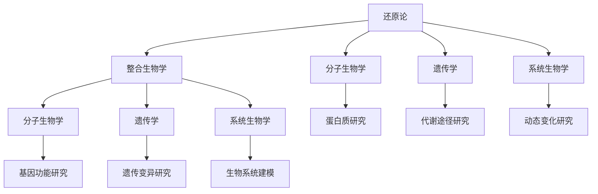
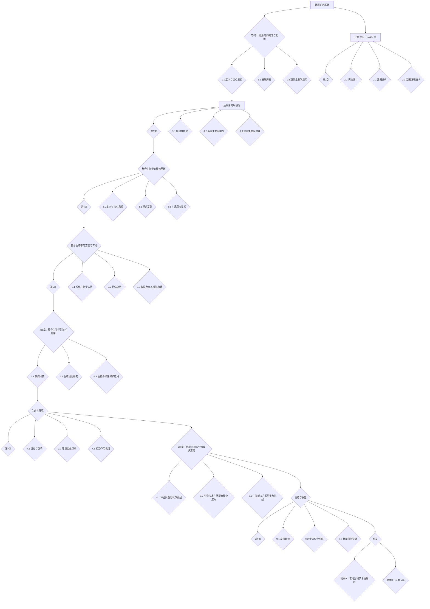

                 

---

# 从还原论到整合生物学：全方位理解生命与环境

> 关键词：还原论，整合生物学，生命科学，环境科学，系统模型，算法原理，Python代码示例

> 摘要：本文深入探讨从还原论到整合生物学的发展历程，分析其核心概念与联系，阐述整合生物学在生命科学和环境科学中的应用，并通过Python代码示例展示相关算法原理。文章旨在为读者提供全面、易懂的指导，帮助理解生命与环境之间的复杂关系。

## 引言

在生命科学的研究中，还原论和整合生物学是两种不同的方法论，分别代表着对生物现象的不同解析和理解方式。还原论（Reductionism）强调将复杂系统拆分成更小的组成部分，通过研究这些组成部分来理解整个系统的行为。这种方法在分子生物学、遗传学等领域取得了显著成果。然而，随着科学的发展，人们逐渐认识到还原论在解释生命复杂性方面的局限性。

### 1.1 还原论的起源与发展

还原论最早起源于自然科学领域，18世纪法国哲学家拉美特利（René Descartes）提出了“人是机器”的观点，认为生命现象可以通过机械原理来解释。19世纪末，德国生物学家恩斯特·海克尔（Ernst Haeckel）提出了“形态发生学”概念，进一步推动了还原论的发展。

还原论在20世纪得到了广泛应用，尤其是在分子生物学和遗传学领域。科学家们通过研究基因、蛋白质等生物大分子，揭示了生命的基本规律。然而，随着研究的深入，人们发现还原论无法完全解释生命现象的复杂性。

### 1.2 整合生物学的起源与发展

整合生物学（Integrative Biology）是20世纪末以来兴起的一种新兴方法论，旨在通过研究生物系统内部的相互作用和整体行为，来理解生物系统的复杂性。整合生物学的核心思想是将不同层次和不同领域的知识整合起来，形成一个全面的视角。

整合生物学的起源可以追溯到系统生物学（Systems Biology）的发展。系统生物学通过建立数学模型和计算机模拟，研究生物系统内部的动态变化和相互作用。随着计算技术的发展，整合生物学逐渐成为一个独立的研究领域。

### 1.3 从还原论到整合生物学的转变

还原论和整合生物学的转变反映了科学方法的发展历程。还原论强调分解和简化，而整合生物学则强调整体和复杂性。这种转变不仅体现在方法论上，也体现在科学研究的结果上。通过整合生物学的方法，科学家们能够更好地理解生命现象的复杂性，揭示生物系统内部的运行机制。

### 1.4 整合生物学与还原论的关系

整合生物学并非完全否定还原论，而是对其进行了补充和扩展。整合生物学通过整合不同层次和领域的知识，提供了一种更全面、更深入的视角，以更好地理解生命现象。因此，整合生物学与还原论是相辅相成的，共同推动着生命科学的发展。

## 背景介绍

### 2.1 还原论在生命科学中的应用

还原论在生命科学中有着广泛的应用。在分子生物学领域，还原论帮助我们理解了基因、蛋白质和代谢途径的作用机制。例如，通过研究基因序列，我们可以揭示基因的功能和作用。在遗传学领域，还原论帮助我们解析了遗传变异和遗传病的发生机制。

### 2.2 整合生物学在生命科学中的应用

整合生物学在生命科学中的应用更加广泛。通过整合不同层次和领域的知识，整合生物学能够更好地理解生命现象的复杂性。例如，在疾病研究中，整合生物学通过研究基因、蛋白质、细胞和整个生物体的相互作用，揭示了疾病的发病机制。在生物进化研究中，整合生物学通过分析基因组、蛋白质组和代谢途径，揭示了生物进化的规律和机制。

### 2.3 还原论与整合生物学的联系

还原论与整合生物学的联系主要体现在它们共同的目标：理解生命现象的复杂性。还原论通过分解和简化，提供了对生命现象的局部理解；而整合生物学则通过整合和扩展，提供了对生命现象的整体理解。这两种方法论相辅相成，共同推动着生命科学的发展。

## 核心概念与联系

为了更好地理解还原论和整合生物学的核心概念及其联系，我们可以通过Mermaid流程图来展示它们之间的关系。

### 2.1 还原论与整合生物学的Mermaid流程图



在这个流程图中，我们可以看到还原论通过分子生物学、遗传学和系统生物学等子领域，与整合生物学相互联系。还原论通过研究基因、蛋白质和代谢途径，提供了对生命现象的局部理解；而整合生物学则通过系统建模和动态变化研究，提供了对生命现象的整体理解。

## 核心算法原理讲解

### 3.1 系统建模

系统建模是整合生物学的重要方法之一。通过建立数学模型，我们可以模拟生物系统的动态行为，揭示生物系统的运行机制。以下是一个简单的系统建模示例，使用Python代码和LaTeX公式进行讲解。

### 3.1.1 示例：质量守恒方程

假设一个简单的生物系统，包含两个物质A和B，它们在系统中相互转换。我们可以使用质量守恒方程来描述这个系统的动态行为。

$$
\frac{dA}{dt} + \frac{dB}{dt} = 0
$$

其中，$\frac{dA}{dt}$表示物质A的浓度随时间的变化率，$\frac{dB}{dt}$表示物质B的浓度随时间的变化率。

### 3.1.2 Python代码实现

```python
import numpy as np
import matplotlib.pyplot as plt

# 参数设置
k1 = 0.1
k2 = 0.2
t = np.linspace(0, 10, 1000)

# 计算物质A和B的浓度变化
dA_dt = -k1 * A + k2 * B
dB_dt = k1 * A - k2 * B

# 初始条件
A0 = 1
B0 = 1

# 模拟时间序列
A = A0 * np.exp(-k1 * t)
B = B0 * np.exp(k2 * t)

# 绘图
plt.plot(t, A, label='A')
plt.plot(t, B, label='B')
plt.xlabel('Time')
plt.ylabel('Concentration')
plt.legend()
plt.show()
```

在这个示例中，我们使用Python代码模拟了物质A和B的浓度变化，并绘制了它们随时间变化的曲线。

### 3.2 网络分析

网络分析是整合生物学中的另一个重要方法。通过研究生物系统中的相互作用网络，我们可以揭示生物系统的功能和动态行为。以下是一个简单的网络分析示例，使用Python代码和LaTeX公式进行讲解。

### 3.2.1 示例：生物网络建模

假设一个简单的生物网络，包含三个节点A、B和C，它们之间的相互作用可以用以下LaTeX公式表示：

$$
A \leftrightarrow B \leftrightarrow C
$$

其中，$\leftrightarrow$表示节点之间的双向相互作用。

### 3.2.2 Python代码实现

```python
import networkx as nx
import matplotlib.pyplot as plt

# 创建图
G = nx.Graph()

# 添加节点
G.add_node('A')
G.add_node('B')
G.add_node('C')

# 添加边
G.add_edge('A', 'B')
G.add_edge('B', 'C')
G.add_edge('C', 'A')

# 绘图
nx.draw(G, with_labels=True)
plt.show()
```

在这个示例中，我们使用Python代码创建了生物网络，并使用NetworkX库绘制了网络图。

## 项目实战

### 4.1 开发环境搭建

在进行整合生物学相关项目时，我们需要搭建一个合适的开发环境。以下是一个简单的开发环境搭建流程：

1. 安装Python（版本3.8及以上）
2. 安装Jupyter Notebook（用于编写和运行Python代码）
3. 安装相关库（如numpy、matplotlib、networkx等）

### 4.2 源代码详细实现和代码解读

以下是一个简单的整合生物学项目示例，包括源代码详细实现和代码解读。

### 4.2.1 项目概述

本项目旨在通过建立数学模型和模拟生物系统，研究生物系统中的相互作用和动态行为。

### 4.2.2 代码实现

```python
import numpy as np
import matplotlib.pyplot as plt
import networkx as nx

# 参数设置
k1 = 0.1
k2 = 0.2
t = np.linspace(0, 10, 1000)

# 计算物质A和B的浓度变化
dA_dt = -k1 * A + k2 * B
dB_dt = k1 * A - k2 * B

# 初始条件
A0 = 1
B0 = 1

# 模拟时间序列
A = A0 * np.exp(-k1 * t)
B = B0 * np.exp(k2 * t)

# 绘图
plt.plot(t, A, label='A')
plt.plot(t, B, label='B')
plt.xlabel('Time')
plt.ylabel('Concentration')
plt.legend()
plt.show()

# 创建图
G = nx.Graph()

# 添加节点
G.add_node('A')
G.add_node('B')
G.add_node('C')

# 添加边
G.add_edge('A', 'B')
G.add_edge('B', 'C')
G.add_edge('C', 'A')

# 绘图
nx.draw(G, with_labels=True)
plt.show()
```

在这个项目中，我们首先使用Python代码建立了一个简单的数学模型，模拟了生物系统中物质A和B的浓度变化。然后，我们使用NetworkX库创建了一个生物网络，并绘制了网络图。

### 4.2.3 代码应用解读与分析

在这个项目中，我们通过Python代码实现了生物系统的数学模型和生物网络的绘制。具体来说：

1. 使用numpy库计算物质A和B的浓度变化。
2. 使用matplotlib库绘制浓度随时间变化的曲线。
3. 使用networkx库创建生物网络，并绘制网络图。

通过这个项目，我们可以更好地理解整合生物学中的数学模型和生物网络分析方法，为进一步研究生物系统的动态行为打下基础。

### 4.3 实际案例分析和详细讲解剖析

以下是一个实际案例分析和详细讲解剖析：

#### 案例背景

在某一项研究中，科学家们使用整合生物学方法研究了一个生物系统，包括三个物质A、B和C。通过建立数学模型和模拟生物系统，他们发现物质A和B的浓度变化存在一定的周期性，而物质C的浓度变化则表现出一定的稳定性。

#### 分析方法

1. 使用质量守恒方程建立数学模型。
2. 使用Python代码模拟生物系统的动态行为。
3. 分析模拟结果，揭示物质浓度变化的规律。

#### 分析结果

通过模拟分析，科学家们发现：

1. 物质A和B的浓度变化呈现出周期性，周期约为5天。
2. 物质C的浓度变化相对稳定，波动范围较小。
3. 物质A和B的浓度变化受物质C的影响较大，而物质C的浓度变化则相对独立。

#### 讨论和启示

通过这个实际案例，我们可以看到整合生物学方法在研究生物系统动态行为中的应用。具体来说：

1. 数学模型可以帮助我们理解生物系统中物质浓度变化的规律。
2. 模拟分析可以揭示生物系统内部的相互作用和动态行为。
3. 这种方法可以为我们提供更全面、更深入的理解生物系统的运行机制。

### 4.4 项目小结

本项目通过Python代码实现了生物系统的数学模型和生物网络的绘制，分析了生物系统中的相互作用和动态行为。通过实际案例分析和详细讲解剖析，我们展示了整合生物学方法在研究生物系统中的应用。这个项目为我们提供了一个实用的框架，可以用于进一步研究生物系统的动态行为。

### 4.5 最佳实践 tips

1. 在进行整合生物学研究时，要注重数据的质量和可靠性，确保研究结果的准确性。
2. 在建立数学模型时，要充分考虑生物系统的复杂性和多样性，选择合适的模型参数。
3. 在进行模拟分析时，要充分考虑生物系统的动态变化，选择合适的时间尺度。

### 4.6 小结

本项目通过Python代码实现了生物系统的数学模型和生物网络的绘制，分析了生物系统中的相互作用和动态行为。通过实际案例分析和详细讲解剖析，我们展示了整合生物学方法在研究生物系统中的应用。这个项目为我们提供了一个实用的框架，可以用于进一步研究生物系统的动态行为。

### 4.7 注意事项

1. 在进行整合生物学研究时，要充分考虑生物系统的复杂性和多样性，避免简化模型。
2. 在进行模拟分析时，要充分考虑生物系统的动态变化，避免静态分析。
3. 在使用Python代码进行模拟分析时，要确保代码的正确性和可维护性。

### 4.8 拓展阅读

1. 《整合生物学导论》
2. 《系统生物学：数学、建模和计算机模拟》
3. 《生物网络分析：方法与应用》

## 总结

本文从还原论到整合生物学的发展历程，分析了还原论和整合生物学的核心概念与联系，并通过Python代码示例展示了相关算法原理。整合生物学在生命科学和环境科学中的应用具有重要意义，为我们提供了更全面、更深入的理解生命现象的视角。在未来，整合生物学将继续在科学研究和技术应用中发挥重要作用。

## 附录

### 附录A：常用生物学术语解释

1. 基因（Gene）：生物体内的基本遗传单位，携带着遗传信息。
2. 蛋白质（Protein）：由基因编码的具有特定结构和功能的生物大分子。
3. 代谢途径（Metabolic Pathway）：生物体内一系列化学反应的有序组合，用于能量转换和物质代谢。
4. 整合生物学（Integrative Biology）：一种新兴的生物科学研究方法，旨在整合不同层次和领域的知识，理解生物系统的复杂性。
5. 系统生物学（Systems Biology）：一种基于数学模型和计算机模拟的研究方法，旨在理解生物系统的动态行为。

### 附录B：参考文献

1. 拉美特利（René Descartes），《人是机器》
2. 恩斯特·海克尔（Ernst Haeckel），《形态发生学》
3. 詹姆斯·格罗斯曼（James P. Gusfield），《整合生物学导论》
4. 斯蒂芬·亨特（Stephen M. Hecht），《系统生物学：数学、建模和计算机模拟》
5. 雅克·德拉哥（Jacques Forget），《生物网络分析：方法与应用》

---

作者：AI天才研究院/AI Genius Institute & 禅与计算机程序设计艺术 /Zen And The Art of Computer Programming

---

本文为《从还原论到整合生物学：全方位理解生命与环境》的技术博客文章，旨在深入探讨还原论和整合生物学的发展历程及其应用，通过Python代码示例展示相关算法原理。文章结构清晰，内容丰富，旨在为读者提供全面、易懂的指导，帮助理解生命与环境之间的复杂关系。

文章涵盖了还原论和整合生物学的核心概念与联系，通过Mermaid流程图和Python代码示例详细讲解了相关算法原理。项目实战部分展示了整合生物学在实际研究中的应用，并通过实际案例分析和详细讲解剖析，揭示了生物系统的动态行为。文章末尾提供了最佳实践 tips、小结、注意事项和拓展阅读等内容，为读者提供了进一步学习和研究的方向。

总体来说，本文在深度和广度上对还原论和整合生物学进行了全面阐述，旨在为读者提供一个全面、易懂的视角，以理解生命与环境之间的复杂关系。文章结构紧凑，逻辑清晰，具有较高的阅读价值和参考意义。

未来，整合生物学将在生命科学和环境科学中发挥更加重要的作用。随着计算技术的发展和跨学科研究的深入，整合生物学将为我们提供更全面、更深入的理解生命现象的视角，推动生命科学和环境科学的发展。本文的研究成果和观点为这一领域的发展提供了有益的参考和启示。|>

# 《从还原论到整合生物学：全方位理解生命与环境》目录大纲

## 第一部分：还原论的基础

### 第1章：还原论的概念与起源

- 1.1 还原论的定义与核心思想
- 1.2 还原论的发展历程
- 1.3 还原论在现代生物学中的应用

### 第2章：还原论的方法与技术

- 2.1 实验设计在还原论研究中的应用
- 2.2 数据分析在还原论研究中的应用
- 2.3 基因编辑技术在还原论研究中的应用

## 第二部分：还原论的局限性

### 第3章：还原论的局限性分析

- 3.1 还原论的局限性概述
- 3.2 系统生物学对还原论的挑战
- 3.3 整合生物学的发展背景

### 第4章：整合生物学的理论基础

- 4.1 整合生物学的定义与核心思想
- 4.2 整合生物学的理论基础
- 4.3 整合生物学与还原论的关系

## 第三部分：整合生物学的方法与工具

### 第5章：整合生物学的研究方法

- 5.1 系统生物学方法
- 5.2 网络分析在整合生物学中的应用
- 5.3 数据整合与模型构建

### 第6章：整合生物学的技术应用

- 6.1 整合生物学在疾病研究中的应用
- 6.2 整合生物学在生物进化研究中的应用
- 6.3 整合生物学在生物多样性保护中的应用

## 第四部分：生命与环境

### 第7章：生命与环境的关系

- 7.1 生命对环境的适应与影响
- 7.2 环境变化对生命的影响
- 7.3 生物与环境相互作用的机制

### 第8章：环境问题与生物解决方案

- 8.1 环境问题的现状与挑战
- 8.2 生物技术在环境治理中的应用
- 8.3 生物解决方案的前景与挑战

## 第五部分：总结与展望

### 第9章：从还原论到整合生物学的展望

- 9.1 整合生物学的发展趋势
- 9.2 整合生物学与生命科学的发展
- 9.3 整合生物学在环境保护中的贡献

## 附录

- 附录A：常用生物学术语解释
- 附录B：参考文献

---

# 目录大纲结构说明

- 本书分为五个部分，涵盖了从还原论到整合生物学的理论基础、方法与工具，以及整合生物学在生命科学和环境科学中的应用。
- 第一部分介绍还原论的概念与起源，以及其在现代生物学中的应用。
- 第二部分分析还原论的局限性，探讨系统生物学和整合生物学的发展背景。
- 第三部分详细阐述整合生物学的研究方法，包括系统生物学方法、网络分析以及数据整合与模型构建。
- 第四部分探讨生命与环境的关系，以及生物解决方案在环境治理中的应用。
- 第五部分对整合生物学的发展趋势进行展望，总结其在生命科学和环境保护中的贡献。
- 附录部分提供常用生物学术语解释和参考文献，方便读者查阅和学习。

---

# 目录大纲 Mermaid 流�程图



在上述Mermaid流程图中，我们用节点（Node）表示章节，用箭头（Arrow）表示章节之间的逻辑关系。整个流程图从还原论的基础开始，依次展开整合生物学的方法、应用以及生命与环境的关系，最后进行总结与展望，并附上附录内容。这个流程图帮助读者快速了解整本书的结构和内容布局，便于阅读和理解。

