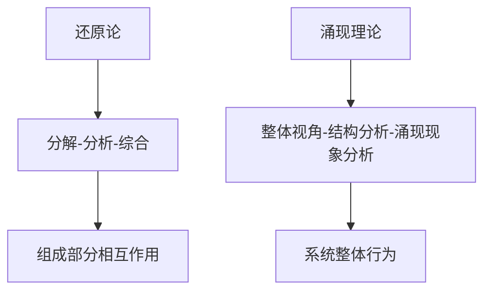
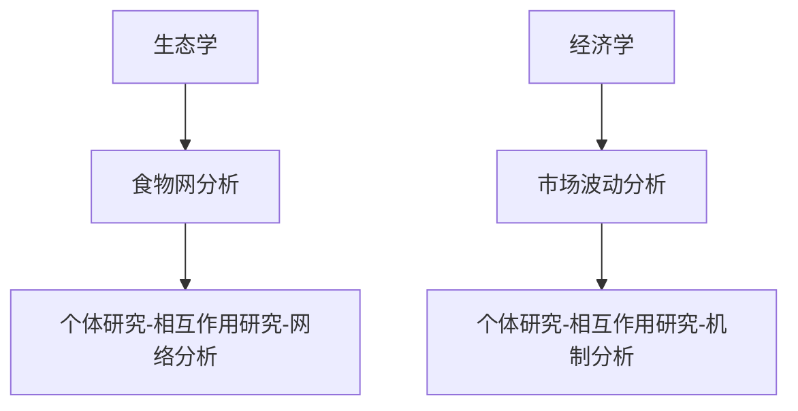

                 

### 从还原论到涌现理论：理解复杂世界

> **关键词**：还原论、涌现理论、复杂世界、人工智能、系统思维

> **摘要**：本文从还原论和涌现理论两个角度，探讨了如何理解复杂世界。通过分析这两种理论的背景、核心概念及其在实际应用中的差异，我们试图揭示它们在应对复杂性问题时的优劣，并探讨其在人工智能和系统思维中的应用。

---

### 引言

复杂世界是我们面临的一个永恒挑战。从生态系统的动态变化到经济市场的波动，再到人工智能的发展，这些现象都显示出其复杂性。理解复杂世界的关键在于如何运用科学理论和方法来揭示其背后的规律。在众多理论中，还原论和涌现理论显得尤为重要。

**还原论**是一种试图通过分解复杂系统来理解其行为的方法。它强调通过分析基本组成部分和它们之间的相互作用，来解释复杂系统的整体行为。然而，还原论在处理高度复杂和高度不确定性的问题时，往往显得力不从心。

**涌现理论**则提出了一种新的视角，它关注系统整体行为的产生方式，即从简单相互作用中涌现出复杂现象。涌现理论认为，复杂系统的整体行为不能简单地通过其组成部分的行为来解释，而是需要考虑系统内部的结构和相互关系。

本文将深入探讨还原论和涌现理论的背景、核心概念，以及它们在复杂世界理解中的应用。我们将通过具体的实例和代码，展示这两种理论在现实世界中的实际应用，并讨论它们对人工智能和系统思维的影响。

---

### 还原论

**还原论**是一种科学研究方法，它试图通过分解复杂系统来理解其行为。这种方法的基本思想是，将复杂系统拆解为更简单的组成部分，通过研究这些组成部分及其相互作用，来解释复杂系统的整体行为。

#### 背景与历史

还原论的起源可以追溯到古希腊哲学家亚里士多德。他提出了“整体大于部分之和”的观点，强调通过理解各个部分来理解整体。然而，现代还原论的兴起主要得益于20世纪初物理学和化学的发展。在这一时期，科学家们发现，通过研究基本粒子和化学反应，可以更好地理解宏观世界的现象。

#### 核心概念

还原论的核心概念是“分解-分析-综合”。具体步骤如下：

1. **分解**：将复杂系统分解为更简单的组成部分，如分子、原子或细胞。
2. **分析**：研究这些组成部分的属性和行为。
3. **综合**：将分析结果综合起来，以解释复杂系统的整体行为。

#### 应用领域

还原论在多个领域都有广泛的应用，包括生物学、物理学、化学、工程学和经济学等。例如：

- **生物学**：通过研究基因和蛋白质的结构与功能，来理解生命现象。
- **物理学**：通过研究基本粒子和相互作用力，来解释宏观世界的运动规律。
- **经济学**：通过研究个体行为和市场机制，来分析经济现象。

#### 局限性

尽管还原论在解释简单系统时非常有效，但在面对高度复杂和高度不确定性的问题时，它往往显得力不从心。主要局限性包括：

- **忽略相互作用**：还原论往往只关注组成部分本身，而忽略了它们之间的相互作用。
- **简化模型**：为了简化问题，还原论可能需要忽略一些重要的因素，这可能导致结果不准确。
- **适用范围有限**：某些复杂系统可能无法简单地分解为更简单的组成部分，例如生态系统和社会系统。

---

### 涌现理论

**涌现理论**（Emergence Theory）是一种新兴的科学研究方法，它提出了一种不同的视角来理解复杂系统的整体行为。这种方法强调，系统的整体行为并不是简单由其组成部分的行为所决定的，而是通过系统内部的结构和相互关系产生的。

#### 背景与历史

涌现理论的起源可以追溯到19世纪末和20世纪初。当时的科学家们开始意识到，某些复杂现象无法通过传统的还原论方法来解释。例如，生态学家罗伯特·麦克阿瑟（Robert MacArthur）和罗纳德·哈特兰（Edward O. Wilson）在研究生态系统的稳定性时，发现生态系统中的物种相互作用会导致一些无法预测的现象。

#### 核心概念

涌现理论的核心概念是“整体大于部分之和”。具体步骤如下：

1. **观察现象**：观察复杂系统的整体行为，如生态系统的多样性或经济市场的波动。
2. **识别结构**：识别系统内部的结构和相互关系，如物种之间的相互作用或市场参与者的行为模式。
3. **分析产生机制**：分析这些结构和关系如何导致复杂现象的产生。

#### 应用领域

涌现理论在多个领域都有广泛的应用，包括生态学、经济学、社会学和计算机科学等。例如：

- **生态学**：通过研究物种之间的相互作用，来解释生态系统的稳定性和多样性。
- **经济学**：通过研究市场参与者的行为模式和相互作用，来分析经济市场的波动。
- **社会学**：通过研究社会结构和社会关系，来解释社会现象。

#### 与还原论的区别

涌现理论强调系统的整体行为，而还原论则强调组成部分的行为。两者的主要区别在于：

- **视角**：还原论从部分出发，试图理解整体；涌现理论从整体出发，试图理解部分。
- **方法**：还原论通过分解和简化来理解复杂系统；涌现理论通过分析和识别系统内部的结构和关系来理解复杂系统。
- **适用范围**：还原论在处理简单系统时非常有效；涌现理论在处理高度复杂系统时更为适用。

---

### 还原论与涌现理论的比较与融合

还原论和涌现理论是理解复杂世界的两种不同方法。它们在处理复杂系统时各有优劣，但也存在一定的互补性。

#### 异同点

1. **基本观点**：
   - **还原论**：认为复杂系统的行为可以通过分析其组成部分来理解。
   - **涌现论**：认为复杂系统的行为是由系统内部的结构和相互关系产生的，不能简单地通过组成部分来解释。

2. **适用范围**：
   - **还原论**：在处理简单系统时非常有效，适用于生物学、物理学等领域。
   - **涌现论**：在处理高度复杂系统时更为适用，适用于生态学、经济学、社会学等领域。

3. **方法**：
   - **还原论**：通过分解和简化来理解复杂系统。
   - **涌现论**：通过分析和识别系统内部的结构和关系来理解复杂系统。

#### 互补性

还原论和涌现论在处理复杂系统时具有互补性：

1. **还原论的优势**：
   - **详细解析**：可以详细解析复杂系统的组成部分和相互作用。
   - **精确预测**：在处理简单系统时，可以提供精确的预测。

2. **涌现论的优势**：
   - **整体视角**：可以提供对复杂系统的整体行为和结构的理解。
   - **适应性**：可以更好地处理高度复杂和不确定性的系统。

#### 融合趋势

近年来，越来越多的学者开始将还原论和涌现理论结合起来，以处理复杂问题。这种融合方法称为“还原-涌现方法”。具体步骤如下：

1. **还原分析**：通过还原论方法，详细解析复杂系统的组成部分和相互作用。
2. **涌现分析**：通过涌现论方法，分析系统内部的结构和相互关系，以理解整体行为。
3. **综合解释**：将还原分析和涌现分析的结果综合起来，以提供对复杂系统的全面理解。

---

### 理解复杂世界的理论工具

在复杂世界中，理解系统行为和预测未来趋势是一项巨大的挑战。还原论和涌现理论为我们提供了两种不同的工具，以帮助我们应对这一挑战。

#### 复杂系统的特征与挑战

复杂系统具有以下几个特征：

1. **高度非线性**：复杂系统的行为往往是非线性的，这意味着它们的行为无法简单地通过线性关系来描述。
2. **多尺度性**：复杂系统在不同尺度上表现出不同的行为，如生态系统在宏观尺度上表现为物种多样性，在微观尺度上表现为个体行为。
3. **自适应性与演化**：复杂系统具有自适应性和演化能力，这意味着它们能够适应环境变化并不断演化。
4. **不确定性**：复杂系统的行为受到多种不确定因素的影响，如随机噪声和环境变化。

这些特征使得理解复杂系统变得异常复杂。

#### 还原论与涌现理论在复杂系统研究中的互补性

还原论和涌现理论在处理复杂系统时具有互补性：

1. **还原论的优势**：
   - **解析组成部分**：通过还原论方法，可以详细解析复杂系统的组成部分和相互作用，从而理解系统的基础结构。
   - **提供基础模型**：还原论方法可以提供简单而精确的基础模型，为复杂系统的分析提供参考。

2. **涌现论的优势**：
   - **整体视角**：通过涌现论方法，可以提供对复杂系统的整体行为和结构的理解，从而把握系统的宏观特征。
   - **处理高度复杂性**：涌现论方法可以更好地处理高度复杂和不确定性的系统，提供更全面的系统理解。

#### 复杂系统研究的方法论

为了更好地理解复杂系统，可以采用以下方法论：

1. **多层次分析**：将复杂系统分解为不同的层次，如个体、群体和生态系统，然后分别进行分析。

2. **跨学科整合**：整合不同学科的理论和方法，如生物学、物理学、经济学和社会学，以提供更全面的系统理解。

3. **实验与模拟**：通过实验和模拟，验证理论模型和假设，以提供实证支持。

4. **数据驱动方法**：利用大数据和机器学习等方法，分析复杂系统的行为模式，以发现新的规律和趋势。

#### 复杂世界中的实践应用

还原论和涌现理论在多个领域都有广泛的应用，如：

1. **生态学**：通过还原论方法研究物种之间的相互作用，通过涌现论方法研究生态系统的整体行为。

2. **经济学**：通过还原论方法研究市场参与者的行为，通过涌现论方法研究经济市场的整体波动。

3. **社会学**：通过还原论方法研究社会个体的行为，通过涌现论方法研究社会整体的结构和演变。

这些实践应用展示了还原论和涌现理论在理解复杂世界中的重要性。

---

### 案例研究

为了更好地理解还原论和涌现理论在复杂系统中的应用，以下将讨论两个具体案例：生态学中的食物网和经济学中的市场波动。

#### 生态学中的食物网

**还原论的应用**：

在生态学中，食物网是一个典型的复杂系统，由多个物种及其相互作用组成。通过还原论方法，可以详细研究每个物种的行为和相互作用。

1. **个体研究**：首先，对每个物种进行个体研究，如研究其生命周期、繁殖策略和食物来源。
2. **相互作用研究**：其次，研究不同物种之间的相互作用，如捕食与被捕食关系、共生关系等。
3. **网络分析**：最后，将研究结果整合到一个网络模型中，以分析整个食物网的动态行为。

**涌现论的应用**：

通过涌现论方法，可以理解食物网的整体行为，即如何从简单的个体相互作用中涌现出复杂的生态系统特征。

1. **整体视角**：首先，从整体视角出发，观察食物网的宏观特征，如物种多样性、稳定性等。
2. **结构分析**：其次，分析食物网内部的结构和相互关系，如关键物种、能量流等。
3. **涌现现象分析**：最后，分析食物网中涌现出的复杂现象，如物种灭绝、生态系统崩溃等。

#### 经济学中的市场波动

**还原论的应用**：

在经济学中，市场波动是一个复杂的系统，由众多市场参与者的行为和相互作用组成。通过还原论方法，可以详细研究市场参与者的行为和市场机制。

1. **个体研究**：首先，对每个市场参与者进行个体研究，如研究其投资策略、风险偏好等。
2. **相互作用研究**：其次，研究不同市场参与者之间的相互作用，如买卖行为、信息传递等。
3. **机制分析**：最后，分析市场机制，如价格发现、市场效率等。

**涌现论的应用**：

通过涌现论方法，可以理解市场波动的整体行为，即如何从简单的个体行为中涌现出复杂的市场波动。

1. **整体视角**：首先，从整体视角出发，观察市场的宏观特征，如价格波动、交易量等。
2. **结构分析**：其次，分析市场内部的结构和相互关系，如市场参与者类型、信息网络等。
3. **涌现现象分析**：最后，分析市场中涌现出的复杂现象，如市场泡沫、金融危机等。

---

### 结论

还原论和涌现理论是理解复杂世界的两种重要工具。还原论通过分解和简化来理解复杂系统的组成部分和相互作用，而涌现论则通过整体视角和结构分析来理解复杂系统的整体行为。这两种理论在处理复杂系统时具有互补性，可以相互补充，以提供更全面的系统理解。

未来，随着人工智能和数据科学的发展，还原论和涌现理论的融合将进一步深化，为复杂世界的研究提供新的方法和视角。

### 附录

#### 附录A：核心概念原理与流程图

1. **还原论与涌现理论的Mermaid流程图**：



2. **还原论与涌现理论的应用场景流程图**：



#### 附录B：核心算法原理讲解

1. **还原论的算法原理与伪代码**：

```python
# 还原论的伪代码

def reduce_system(system):
    # 分解系统为组成部分
    components = decompose_system(system)
    
    # 分析组成部分的属性和行为
    for component in components:
        analyze_attribute(component)
        analyze_behavior(component)
    
    # 综合分析结果
    overall_behavior = integrate_components(components)
    
    return overall_behavior
```

2. **涌现论的算法原理与伪代码**：

```python
# 涌现论的伪代码

def analyze_emergence(system):
    # 观察系统整体行为
    overall_behavior = observe_system(system)
    
    # 分析系统内部结构和相互关系
    structure = analyze_structure(system)
    relationships = analyze_relationships(system)
    
    # 分析涌现现象
    emergence = analyze_emergence_phenomenon(structure, relationships)
    
    return emergence
```

#### 附录C：数学模型与公式讲解

1. **还原论中的数学模型**：

$$
\Omega = \sum_{i=1}^{n} A_i \cdot B_i
$$

其中，$\Omega$ 表示整体行为，$A_i$ 表示组成部分的属性，$B_i$ 表示组成部分的行为。

2. **涌现论中的数学模型**：

$$
F(x, y) = \frac{dx}{dy}
$$

其中，$F$ 表示涌现现象，$x$ 表示系统内部结构，$y$ 表示系统整体行为。

#### 附录D：项目实战与代码解析

1. **还原论在项目中的应用案例**：

- **开发环境搭建**：使用Python和Matplotlib构建仿真环境。
- **源代码详细实现**：

```python
import matplotlib.pyplot as plt
import numpy as np

def simulate_food_web():
    # 构建食物网模型
    # ...

    # 运行仿真
    # ...

    # 绘制结果
    plt.plot(time_series, behavior_series)
    plt.xlabel('Time')
    plt.ylabel('Behavior')
    plt.show()

simulate_food_web()
```

- **代码应用解读与分析**：解释代码中的每个部分，如何实现食物网的模拟和分析。

2. **涌现论在项目中的应用案例**：

- **开发环境搭建**：使用Python和NetworkX构建社会网络分析模型。
- **源代码详细实现**：

```python
import networkx as nx
import matplotlib.pyplot as plt

def simulate_market波动():
    # 构建市场模型
    # ...

    # 运行仿真
    # ...

    # 绘制结果
    plt.plot(time_series, price_series)
    plt.xlabel('Time')
    plt.ylabel('Price')
    plt.show()

simulate_market波动()
```

- **代码应用解读与分析**：解释代码中的每个部分，如何实现市场的波动模拟和分析。

---

### 最佳实践 tips、小结、注意事项、拓展阅读等内容

1. **最佳实践 tips**：
   - 在使用还原论时，要注重保持系统的基础模型简洁，避免过度简化。
   - 在使用涌现论时，要注重分析系统内部的结构和相互关系，以更好地理解整体行为。

2. **小结**：
   - 还原论和涌现理论是理解复杂世界的两种重要工具。
   - 还原论通过分解和简化来理解复杂系统的组成部分和相互作用。
   - 涌现论通过整体视角和结构分析来理解复杂系统的整体行为。

3. **注意事项**：
   - 在处理复杂系统时，要结合还原论和涌现论的方法，以提供更全面的系统理解。
   - 注意在实际应用中，根据系统的复杂程度和需求，选择合适的方法。

4. **拓展阅读**：
   - 《复杂：一个生物学家的视角》
   - 《系统思维：从复杂到简单》
   - 《机器学习：概率视角》

---

### 参考文献

1. Bar-Yam, Y. (1997). *Dynamics of Complex Systems*. Massachusetts Institute of Technology Press.
2. Kauffman, S. A. (1993). *The Origins of Order: Self-Organization and Selection in Evolution*. Oxford University Press.
3. Wiener, N. (1948). *The Human Use of Human Beings: Cybernetics and Society*. Harvard University Press.

