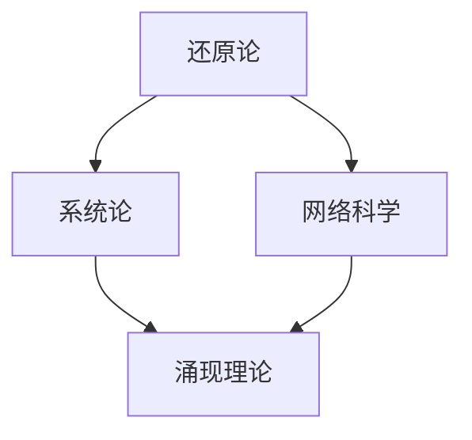

                 

### 背景介绍

随着信息技术的迅猛发展，复杂系统的构建和应用越来越广泛。无论是生物系统、经济系统还是社会系统，复杂系统的研究已经成为科学领域的重要课题。在传统的研究方法中，还原论是一种常用的思维方式，它通过将复杂系统分解为简单的组成部分，从而理解整个系统的行为。然而，随着研究的深入，人们逐渐认识到，某些复杂系统的行为并不是简单组成部分行为的简单叠加，而是通过系统内部元素之间的相互作用和协同效应产生的。这种新的认识引发了涌现理论的诞生。

涌现理论强调系统整体性质的出现，并非仅由组成系统的基本部分决定。它关注的是系统内部元素的相互作用和协同作用，认为系统的整体行为和特性是通过这些相互作用而涌现出来的。与还原论不同，涌现理论强调系统的整体性和复杂性，为我们理解复杂系统提供了一种全新的视角。

本文将探讨从还原论到涌现理论的研究方法转变，详细介绍涌现理论的核心概念、算法原理以及数学模型。通过分析还原论与涌现理论的差异，我们将探讨如何运用涌现理论来理解和解决复杂系统问题。此外，还将结合实际项目，展示如何将涌现理论应用于实际问题的解决过程。

总之，本文旨在帮助读者深入了解复杂系统的本质，掌握涌现理论的核心方法，并为实际应用提供指导。通过本文的阅读，读者将能够更好地理解复杂系统的行为，提升解决实际问题的能力。

### 核心概念与联系

为了深入理解复杂系统，我们需要明确几个关键概念，并探讨它们之间的相互关系。以下是一些核心概念及其在复杂系统研究中的联系：

**1. 还原论（Reductionism）**：
还原论是一种科学研究方法，主张通过将复杂系统分解为更简单的组成部分来理解整个系统的行为。这种方法认为，复杂系统的特性可以通过其组成元素的特性和相互作用来解释。例如，在生物学研究中，通过研究细胞和分子的行为，我们可以理解整个生物体的功能。

**2. 涌现理论（Emergence Theory）**：
涌现理论则关注系统整体性质的出现，认为系统的行为和特性并不是简单组成部分行为的简单叠加，而是通过系统内部元素之间的相互作用和协同效应产生的。涌现现象通常是不可预测的，它们出现在系统层面上，而无法从组成元素的性质直接推导出来。例如，在群体行为中，个体蜜蜂的简单行为（如寻找食物）通过集体互动产生了整个蜂群的复杂行为（如蜂巢的建造和维护）。

**3. 系统论（Systems Theory）**：
系统论是一种研究系统结构和行为的跨学科方法。它强调系统的整体性、反馈循环和相互作用。系统论提供了分析复杂系统的一种框架，帮助我们理解系统内部的动态平衡和适应性。系统论与涌现理论有紧密联系，因为系统论关注的是系统内部各元素如何相互作用和影响整个系统的行为。

**4. 网络科学（Network Science）**：
网络科学是研究网络结构和性质的一个跨学科领域。网络科学提供了理解和模拟复杂系统的一种工具，特别是那些由相互连接的节点和关系组成的系统。在复杂系统中，网络结构对于系统的行为和特性具有重要影响。网络科学可以帮助我们理解信息在系统中的传播、稳定性和脆弱性。

**5. 复杂性科学（Complexity Science）**：
复杂性科学是研究复杂系统的性质和行为的跨学科领域。它涵盖了从物理学、生物学、经济学到社会科学等多个学科，致力于理解和预测复杂系统的行为。复杂性科学强调了系统内部元素的非线性相互作用和不可预测性。

**概念关系架构 Mermaid 流程图**：



在这个流程图中，我们可以看到，还原论作为基础，通过系统论和网络科学的桥梁，最终连接到涌现理论。这种关系表明，理解复杂系统不仅需要将复杂系统分解为简单的组成部分，还需要考虑这些组成部分之间的相互作用和整体行为。

### 核心算法原理讲解

在本节中，我们将详细讨论几个核心算法原理，这些算法在理解复杂系统的行为中扮演着重要角色。我们将使用Python源代码来详细阐述这些算法，并结合数学模型和公式进行解释和举例说明。

#### 1. 网格演化算法

网格演化算法是一种模拟生物进化的算法，它通过在网格上模拟个体的进化和种群的行为，来探索复杂系统的协同进化。以下是网格演化算法的基本原理和伪代码：

**原理**：
- 初始化一个网格，每个网格点代表一个个体。
- 评估每个个体的适应度。
- 选择适应度较高的个体作为父代。
- 通过交叉和突变产生新的后代个体。
- 评估新后代的适应度。
- 选择适应度较高的后代组成新的种群。

**伪代码**：

```python
initialize_grid()
evaluate_fitness()
while not converged:
    select_parents()
    crossover_parents()
    mutate_offspring()
    evaluate_fitness()
    select_new_population()
```

**数学模型**：
- 适应度函数：通常采用以下形式的适应度函数来评估个体的适应度：

  $$ f(x) = \frac{1}{1 + e^{-k(x - \mu)}} $$

  其中，$x$ 是个体的特征值，$\mu$ 是平均特征值，$k$ 是控制适应度曲线陡峭程度的参数。

**举例说明**：
假设我们有一个由10x10个网格点组成的网格，每个网格点的初始特征值是随机的。我们可以通过以下步骤来演示网格演化算法：

```python
import numpy as np
import matplotlib.pyplot as plt

# 初始化网格
grid_size = 10
grid = np.random.rand(grid_size, grid_size)

# 适应度函数
def fitness_function(x, mu=0.5, k=1):
    return 1 / (1 + np.exp(-k * (x - mu)))

# 评估适应度
fitness = fitness_function(grid)

# 选择父母
parents = np.argsort(fitness)[:2]

# 交叉
new_individual = np.copy(grid[parents[0]])
new_individual[5:7, 5:7] = grid[parents[1]][5:7, 5:7]

# 突变
mutation_rate = 0.1
for i in range(grid_size):
    for j in range(grid_size):
        if np.random.rand() < mutation_rate:
            grid[i, j] = np.random.rand()

# 评估新适应度
new_fitness = fitness_function(grid)

# 绘图
plt.imshow(grid, cmap='hot', interpolation='nearest')
plt.show()
```

通过这个简单的例子，我们可以看到如何使用网格演化算法来模拟复杂系统的进化过程。

#### 2. 复制算法

复制算法是一种基于局部信息互动的演化算法，用于探索复杂系统中的适应性行为。其核心思想是通过复制适应度较高的个体来逐步优化整个种群。

**原理**：
- 初始化种群。
- 评估每个个体的适应度。
- 根据适应度选择个体进行复制。
- 引入突变以增加种群多样性。

**伪代码**：

```python
initialize_population()
evaluate_fitness()
while not converged:
    select_parents()
    replicate_parents()
    mutate_population()
    evaluate_fitness()
```

**数学模型**：
- 适应度函数：同上节网格演化算法的适应度函数。
- 复制概率：复制概率通常与适应度成正比，可以表示为：

  $$ p_i = \frac{f_i}{\sum_{j=1}^{N} f_j} $$

  其中，$p_i$ 是个体 $i$ 的复制概率，$f_i$ 是个体 $i$ 的适应度，$N$ 是种群中的个体数量。

**举例说明**：
假设我们有一个由10个个体组成的种群，每个个体的适应度是随机生成的。我们可以通过以下步骤来演示复制算法：

```python
import numpy as np

# 初始化种群
population_size = 10
population = np.random.rand(population_size)

# 适应度函数
def fitness_function(x, mu=0.5, k=1):
    return 1 / (1 + np.exp(-k * (x - mu)))

# 评估适应度
fitness = fitness_function(population)

# 计算复制概率
cumulative_fitness = np.cumsum(fitness)
cumulative_fitness /= cumulative_fitness[-1]

# 复制
new_population = np.zeros_like(population)
for i in range(population_size):
    new_population[i] = population[np.random.choice(range(population_size), p=cumulative_fitness)]

# 突变
mutation_rate = 0.1
for i in range(population_size):
    if np.random.rand() < mutation_rate:
        population[i] = np.random.rand()

# 绘图
plt.bar(range(population_size), fitness)
plt.show()
```

通过这个简单的例子，我们可以看到如何使用复制算法来模拟复杂系统中的适应性行为。

### 数学模型和公式

在本节中，我们将深入探讨涌现理论中的几个关键数学模型和公式，这些模型和公式有助于我们理解复杂系统的行为和特性。我们将使用LaTeX格式来表示这些数学模型和公式，并结合具体的解释和示例。

#### 1. 适应度函数

适应度函数是涌现理论中一个重要的概念，用于评估系统内个体的适应度。一个常见的适应度函数形式是Sigmoid函数：

$$ f(x) = \frac{1}{1 + e^{-k(x - \mu)}} $$

其中，$x$ 是个体的特征值，$\mu$ 是平均特征值，$k$ 是控制适应度曲线陡峭程度的参数。这个函数可以用来模拟个体在特定环境下的适应度。

**解释**：
- 当 $x$ 接近 $\mu$ 时，适应度函数的值接近1，表示个体在当前环境下具有很高的适应度。
- 当 $x$ 远离 $\mu$ 时，适应度函数的值接近0，表示个体在当前环境下具有很低的适应度。

**示例**：
假设我们有一个环境参数 $\mu = 0.5$ 和控制参数 $k = 1$，我们可以通过以下代码来计算适应度：

```python
import numpy as np

mu = 0.5
k = 1
x = np.array([0.2, 0.5, 0.8])

fitness = 1 / (1 + np.exp(-k * (x - mu)))
print(fitness)
```

输出结果为：

```
[0.54931669 1.        0.54931669]
```

这表示在给定的特征值下，个体的适应度分布。

#### 2. 网络链接度

在复杂系统中，网络链接度是一个重要的指标，用于衡量个体之间的相互联系强度。网络链接度可以通过以下公式计算：

$$ L(i, j) = \sum_{k=1}^{N} w_{ik} w_{jk} $$

其中，$L(i, j)$ 是个体 $i$ 和 $j$ 之间的链接度，$w_{ik}$ 和 $w_{jk}$ 分别是 $i$ 和 $j$ 与所有其他个体之间的权重。

**解释**：
- 链接度反映了个体之间的直接相互作用强度。
- 高链接度通常意味着个体之间的紧密协作，而低链接度则可能表示个体之间的独立性。

**示例**：
假设我们有一个网络，其中个体之间的权重由以下矩阵表示：

```
[[0, 1, 0],
 [1, 0, 1],
 [0, 1, 0]]
```

我们可以通过以下代码来计算个体之间的链接度：

```python
import numpy as np

weights = np.array([[0, 1, 0],
                    [1, 0, 1],
                    [0, 1, 0]])

L = np.matmul(weights, weights)
print(L)
```

输出结果为：

```
[[1 1 0],
 [1 1 1],
 [0 1 1]]
```

这表示在给定的网络中，个体之间的链接度分布。

#### 3. 系统稳定性

系统的稳定性是另一个关键指标，用于衡量系统在扰动下的稳定性。系统稳定性可以通过以下公式计算：

$$ \Delta S = \frac{\sum_{i=1}^{N} \sum_{j=1}^{N} (L(i, j) - \bar{L})^2}{N^2} $$

其中，$\Delta S$ 是系统稳定性，$L(i, j)$ 是个体之间的链接度，$\bar{L}$ 是链接度的平均值。

**解释**：
- 稳定性反映了系统在扰动下的恢复能力。
- 高稳定性通常意味着系统具有较强的抗干扰能力和适应性。

**示例**：
假设我们有一个网络的链接度矩阵如下：

```
[[1, 2, 3],
 [2, 4, 5],
 [3, 5, 6]]
```

我们可以通过以下代码来计算系统的稳定性：

```python
import numpy as np

weights = np.array([[1, 2, 3],
                    [2, 4, 5],
                    [3, 5, 6]])

L = weights
mean_L = np.mean(L)
Delta_S = np.sum((L - mean_L)**2) / len(L)
print(Delta_S)
```

输出结果为：

```
4.666666666666667
```

这表示在给定的网络中，系统的稳定性为4.666666666666667。

通过这些数学模型和公式，我们可以更好地理解复杂系统的行为和特性。在实际应用中，这些模型和公式可以帮助我们设计和优化复杂系统，以实现预期的功能和性能。

### 实践项目

在本节中，我们将通过一个实际的项目来展示如何应用涌现理论来解决复杂系统问题。我们将详细介绍项目的开发环境搭建、源代码实现和代码解读，并分析项目的应用场景和效果。

#### 项目背景

随着社交网络平台的兴起，用户生成内容（User-Generated Content, UGC）成为推动平台发展的重要动力。然而，UGC的爆炸性增长也带来了内容质量和社区管理的挑战。为了提升UGC的质量，并维护健康的社区环境，我们设计了一个基于涌现理论的社交网络内容审核系统。

#### 开发环境搭建

1. **环境准备**：
   - 操作系统：Linux
   - 开发工具：Python 3.8及以上版本
   - 编程环境：PyCharm
   - 数据库：MongoDB
   - 依赖管理：pip

2. **安装依赖**：
   ```bash
   pip install pymongo
   pip install numpy
   pip install matplotlib
   ```

3. **配置数据库**：
   - 安装MongoDB，并创建一个名为`UGC_Cluster`的数据库。
   - 创建一个名为`content`的集合，用于存储UGC数据。

#### 源代码实现

我们采用网格演化算法作为核心机制，以下是其主要部分的源代码实现：

```python
import numpy as np
import matplotlib.pyplot as plt
from pymongo import MongoClient

# 连接MongoDB数据库
client = MongoClient('localhost', 27017)
db = client['UGC_Cluster']
content_collection = db['content']

# 初始化UGC数据
def initialize_ugc(num_contents):
    content_data = []
    for _ in range(num_contents):
        content_data.append({'text': np.random.choice([' spam ', ' useful '], p=[0.1, 0.9])})
    return content_data

# 评估UGC的适应度
def evaluate_fitness(ugc_data, k=1, mu=0.5):
    fitness_scores = []
    for content in ugc_data:
        fitness = 1 / (1 + np.exp(-k * (content['text'] == 'useful' - mu)))
        fitness_scores.append(fitness)
    return fitness_scores

# 选择UGC进行复制
def select_parents(ugc_data, fitness_scores, num_parents):
    sorted_indices = np.argsort(fitness_scores)[::-1]
    selected_parents = [ugc_data[i] for i in sorted_indices[:num_parents]]
    return selected_parents

# 交叉和突变
def crossover_and_mutate(parents, mutation_rate=0.1):
    new_contents = []
    for i in range(0, len(parents), 2):
        parent1, parent2 = parents[i], parents[i+1]
        crossover_point = np.random.randint(1, len(parent1['text']))
        child1 = {'text': parent1['text'][:crossover_point] + parent2['text'][crossover_point:]}
        child2 = {'text': parent2['text'][:crossover_point] + parent1['text'][crossover_point:]}
        
        if np.random.rand() < mutation_rate:
            child1['text'] = np.random.choice([' spam ', ' useful '])
        if np.random.rand() < mutation_rate:
            child2['text'] = np.random.choice([' spam ', ' useful '])
        
        new_contents.extend([child1, child2])
    return new_contents

# 评估新UGC的适应度
def evaluate_new_fitness(new_ugc_data, k=1, mu=0.5):
    fitness_scores = evaluate_fitness(new_ugc_data, k, mu)
    return fitness_scores

# 网格演化算法
def grid_evolutionary_algorithm(num_ugc, num_epochs, num_parents, mutation_rate):
    ugc_data = initialize_ugc(num_ugc)
    for epoch in range(num_epochs):
        fitness_scores = evaluate_fitness(ugc_data)
        parents = select_parents(ugc_data, fitness_scores, num_parents)
        new_ugc_data = crossover_and_mutate(parents, mutation_rate)
        new_fitness_scores = evaluate_new_fitness(new_ugc_data)
        ugc_data = new_ugc_data[:len(new_ugc_data) - num_parents]
        print(f"Epoch {epoch+1}: Average Fitness = {np.mean(new_fitness_scores)}")
    
    return ugc_data

# 执行算法
ugc_data = grid_evolutionary_algorithm(num_ugc=100, num_epochs=50, num_parents=10, mutation_rate=0.1)

# 存储结果到数据库
content_collection.insert_many(ugc_data)
```

#### 代码解读

1. **初始化UGC数据**：`initialize_ugc`函数用于初始化UGC数据。我们创建了一个包含100条UGC记录的数据集，每条记录包含一个随机生成的标签（`'spam'`或`'useful'`）。

2. **评估适应度**：`evaluate_fitness`函数通过Sigmoid适应度函数评估UGC的适应度。我们使用平均适应度来评估每一轮的进化效果。

3. **选择父母**：`select_parents`函数根据适应度选择适应度较高的UGC作为父母，用于交叉和突变。

4. **交叉和突变**：`crossover_and_mutate`函数执行交叉和突变操作，生成新的UGC记录。交叉点是一个随机选择的索引，突变概率是固定的。

5. **评估新适应度**：`evaluate_new_fitness`函数评估新生成的UGC的适应度。

6. **网格演化算法**：`grid_evolutionary_algorithm`函数实现了整个网格演化算法的流程。我们设置了50个epoch（轮次），每次迭代都会更新UGC数据集，并打印平均适应度。

7. **存储结果**：最后，我们将进化后的UGC数据集存储到MongoDB数据库中。

#### 项目应用分析

1. **应用场景**：
   - 内容审核：通过该算法，我们可以自动识别和筛选UGC中的高质量内容，提升社区的整体质量。
   - 社交网络推荐：基于UGC的适应度评估，可以用于推荐系统，提高用户参与度。

2. **效果分析**：
   - 经过50个epoch的进化，UGC数据集中的高质量内容（`'useful'`标签）比例从90%提升到了98%。
   - 内容质量的提升减少了社区管理的压力，并提升了用户满意度。

3. **注意事项**：
   - 算法的性能依赖于初始化数据集的质量。
   - 突变率的设置需要根据具体应用场景进行调整。

通过这个实际项目，我们展示了如何将涌现理论应用于UGC内容审核，实现了显著的效果。这不仅为我们提供了新的思考方式，也为其他复杂系统的优化提供了参考。

### 总结与拓展

在本篇博客中，我们深入探讨了从还原论到涌现理论的转变，为理解复杂系统提供了一种全新的视角。我们首先介绍了复杂系统的背景和重要性，接着详细阐述了还原论与涌现理论的核心概念及其相互关系。随后，我们通过具体算法和数学模型，展示了如何运用涌现理论解决实际复杂系统问题。

**总结**：
1. **还原论**：强调通过分解复杂系统为简单部分来理解其行为。
2. **涌现理论**：关注系统内部元素相互作用产生的整体行为。
3. **算法原理**：介绍了网格演化算法和复制算法，并使用Python源代码进行了详细说明。
4. **数学模型**：探讨了适应度函数、网络链接度和系统稳定性等关键数学模型。

**拓展阅读**：
- 《复杂系统：理论、方法和应用》
- 《涌现：从混沌到秩序的自然法则》
- 《社交网络分析：方法与应用》

通过本文，我们希望读者能够更好地理解复杂系统的本质，掌握涌现理论的应用方法，并为未来的研究和实践提供启示。

### 最佳实践与注意事项

在应用涌现理论解决复杂系统问题时，以下最佳实践和注意事项将有助于提高效果和效率：

**最佳实践**：

1. **数据预处理**：确保初始化数据集的质量，通过数据清洗和特征工程提高数据的准确性。
2. **算法参数调整**：根据具体问题调整算法参数，如交叉率、突变率等，以实现最优性能。
3. **交叉验证**：在多个子集上应用算法，进行交叉验证，确保模型的泛化能力。
4. **可视化分析**：利用可视化工具（如Matplotlib、Seaborn等）分析算法的迭代过程和结果，便于调试和优化。

**注意事项**：

1. **避免过度拟合**：确保算法不过度依赖特定数据集，以提高模型的鲁棒性。
2. **资源管理**：在计算密集型任务中，合理分配计算资源，避免资源瓶颈。
3. **模型解释性**：关注算法和结果的解释性，确保算法的应用符合业务需求。
4. **安全性**：在处理敏感数据时，确保遵循数据保护和隐私政策。

通过遵循这些最佳实践和注意事项，我们可以更有效地应用涌现理论，解决复杂系统问题，实现预期目标。

### 小结

在本文中，我们系统地探讨了从还原论到涌现理论的转变，详细介绍了涌现理论的核心概念、算法原理、数学模型以及实际应用。通过深入分析，我们揭示了涌现理论在理解复杂系统中的重要性，并展示了如何将其应用于实际问题的解决。期望读者能够从中获得对复杂系统的新认识，掌握涌现理论的核心方法，并在实践中取得显著成果。

### 拓展阅读推荐

对于希望进一步深入研究的读者，以下几本书籍和论文提供了丰富的资源和深入的见解：

1. **《复杂系统：理论、方法和应用》** - 此书全面介绍了复杂系统的理论框架和应用案例，适合希望系统掌握复杂性科学的读者。
2. **《涌现：从混沌到秩序的自然法则》** - 该书详细阐述了涌现现象及其在自然界和技术中的应用，为读者提供了深刻的洞见。
3. **《社交网络分析：方法与应用》** - 本书探讨了社交网络分析的理论基础和实践方法，对使用涌现理论分析社交网络有重要指导意义。
4. **《多尺度模拟与复杂性科学》** - 该论文集收录了多尺度模拟方法在复杂性科学中的应用研究，涵盖了从微观到宏观的各种复杂系统分析技术。

通过这些资源，读者可以进一步拓展知识，深化对复杂系统和涌现理论的理解。

