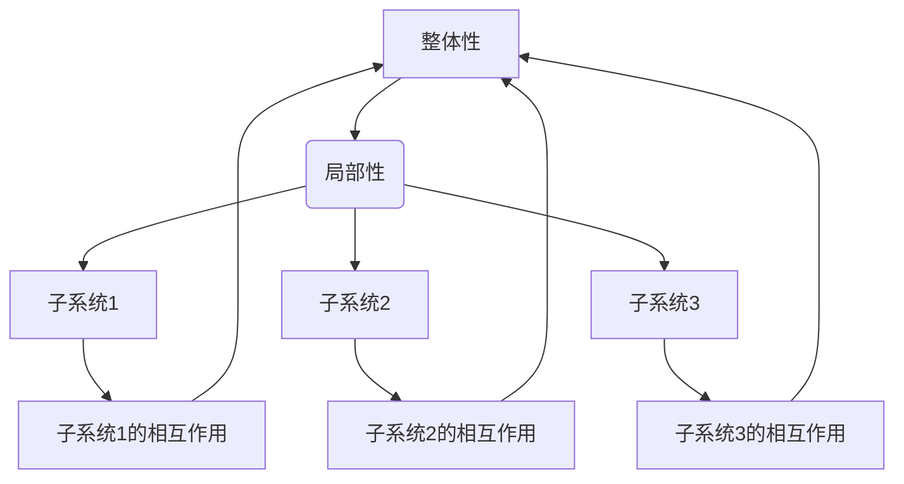
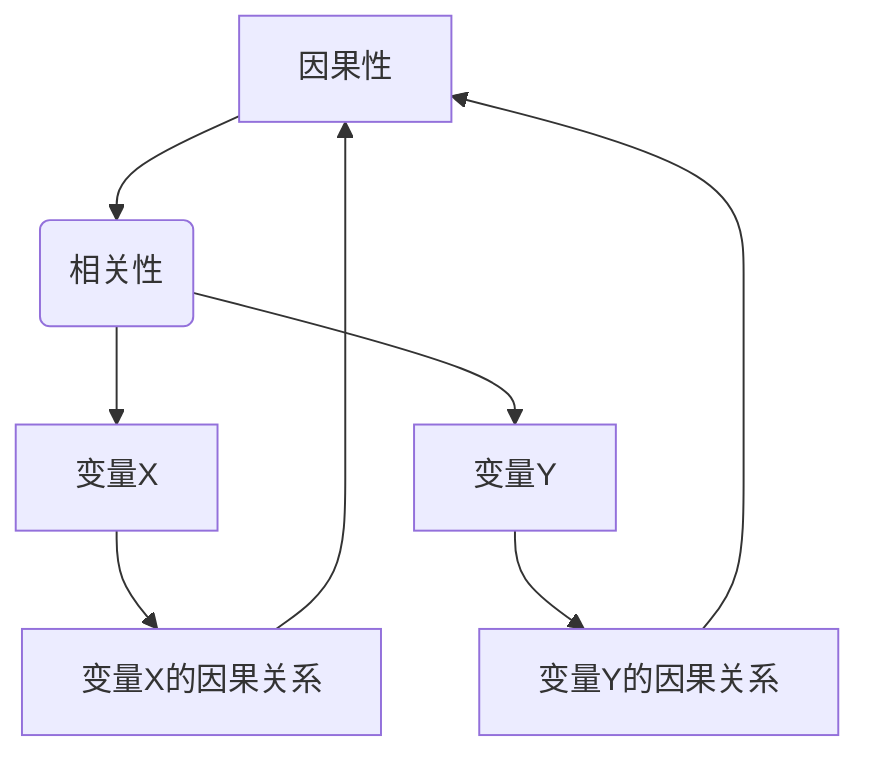
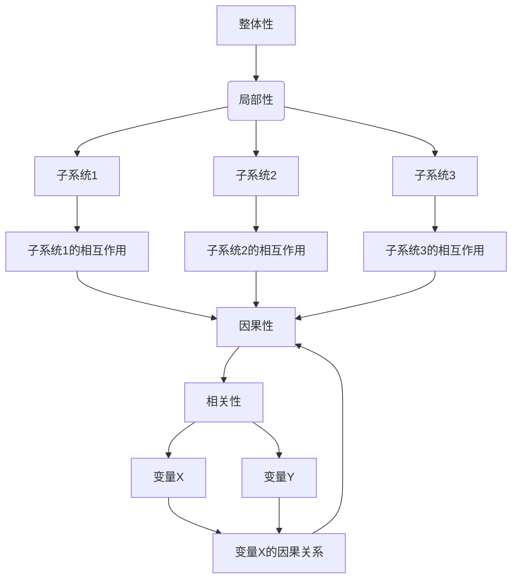
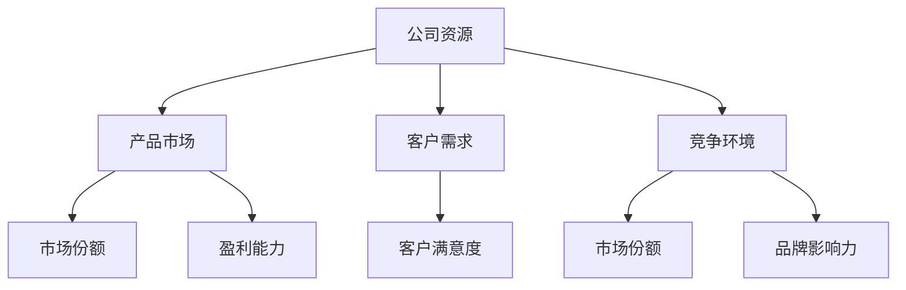

                 

## 从还原论到系统思维：整体性理解世界的方法

### 关键词：还原论，系统思维，整体性，人工智能，复杂性

> 摘要：本文旨在探讨从还原论向系统思维的转变，分析其背景和重要性，并通过具体的案例分析，阐述系统思维在理解复杂系统中的应用价值。文章首先介绍了还原论的基本概念和局限性，随后详细阐述了系统思维的核心原理和应用领域，最后通过数学模型和Python源代码的实现，以及项目实战，展示了系统思维的实践应用。

---

在科学技术发展的历程中，我们见证了从简单到复杂、从局部到整体的思想变迁。还原论作为早期科学方法论的核心，曾主导了我们对自然世界的理解。然而，随着复杂系统的涌现，还原论在解释和预测系统行为方面的局限性逐渐显现。此时，系统思维作为一种新的方法论，逐渐受到重视，它强调整体性、相关性以及动态性，为理解复杂系统提供了一种全新的视角。本文将详细探讨这一转变的背景、重要性，以及系统思维在实际应用中的具体实践。

### 引言

#### 1.1 为什么要从还原论转向系统思维

随着信息技术的飞速发展，我们面临的问题越来越复杂，从生态系统到社会系统，再到经济系统，这些复杂系统包含了众多相互作用的子系统。传统的还原论方法，通过将复杂系统拆分为若干简单的组成部分，逐一分析和理解，已无法有效地应对这种复杂性。例如，在生物学中，还原论曾通过研究细胞、基因等基本单元，揭示了生命的奥秘，但随着基因测序技术的发展，我们发现，单独的基因或蛋白质往往无法完全解释生物体的复杂行为，只有在系统层面，才能真正理解生物体的运作机制。

系统思维则强调将系统视为一个整体，关注子系统之间的相互作用和反馈循环。这种方法不仅能够更好地解释复杂系统的行为，还能预测系统在变化中的动态响应。例如，在环境科学中，系统思维可以帮助我们理解生态系统中物种间的相互作用，预测生态平衡的变化。同样，在经济学中，系统思维能够揭示市场波动背后的多重因素，提供更为全面的决策依据。

#### 1.2 还原论的局限性

还原论的核心思想是将复杂系统拆分为多个简单的组成部分，逐一研究和理解，然后通过这些组成部分的行为，推导出整个系统的行为。这种方法在处理简单系统时非常有效，但在面对复杂系统时，其局限性逐渐显现。

首先，还原论忽视了子系统之间的相互作用。在复杂系统中，子系统之间通常存在复杂的反馈机制，这些反馈机制会导致系统行为的非线性变化。例如，在交通系统中，交通拥堵不仅与道路长度、车辆数量有关，还受到司机行为、交通信号控制等多种因素的影响。

其次，还原论难以应对动态变化。复杂系统往往处于不断变化的状态中，传统的还原论方法难以捕捉这种动态性。例如，在金融市场中，投资者的情绪波动、政策变化等都会对市场产生显著影响，这些因素在还原论的框架下难以得到充分考虑。

最后，还原论在处理跨学科问题时存在困难。许多复杂问题涉及多个学科领域，如环境科学、社会工程等，还原论往往局限于单个学科，难以提供全局视角。

#### 1.3 系统思维的起源与发展

系统思维最早可以追溯到20世纪初的工程领域，如泰勒的科学管理理论和香农的信息理论，它们都强调了系统整体性。20世纪中叶，系统思维在生物学、生态学、经济学等学科中得到广泛应用，形成了系统论、控制论等学科体系。

近年来，随着计算机科学和信息技术的快速发展，系统思维在人工智能、大数据等领域得到广泛应用。例如，在人工智能领域，深度学习和神经网络模型通过模拟人脑的神经网络结构，实现了对复杂系统的建模和预测。

#### 1.4 文章结构

本文将分为以下几个部分：

1. **还原论的基本概念**：介绍还原论的历史背景和基本概念。
2. **系统思维的基本原理**：阐述系统思维的定义、核心要素和与还原论的比较。
3. **系统思维的应用领域**：探讨系统思维在不同领域的应用。
4. **核心概念与联系**：使用Mermaid流程图，展示系统思维的核心概念和关系架构。
5. **核心算法原理讲解**：通过Python源代码，阐述系统动力学的基本原理和算法实现。
6. **数学模型与公式**：使用LaTeX格式，详细解释系统动态方程的数学表示。
7. **项目实战**：通过具体项目，展示系统思维的实际应用。
8. **结论与展望**：总结系统思维的重要性，并对未来进行展望。

### 第1章：引言

#### 1.1 为什么要从还原论转向系统思维

在科学探索的早期，还原论是一种行之有效的方法。通过将复杂系统拆分为简单的组成部分，逐一研究，我们可以深入了解每个部分的工作原理。这种方法在物理学、化学、生物学等领域取得了巨大的成功。然而，随着我们面对的问题越来越复杂，还原论开始暴露出其局限性。

首先，还原论忽视了子系统之间的相互作用。复杂系统中的各个部分并不是孤立存在的，它们之间存在复杂的反馈机制。这些相互作用会导致系统的整体行为呈现出非线性和动态变化。例如，在生态系统中，不同物种之间的相互作用可以导致物种多样性的变化，这种现象在还原论的框架下很难得到解释。

其次，还原论难以应对动态变化。复杂系统往往处于不断变化的状态中，而还原论往往只能捕捉静态的、局部的情况。例如，在金融市场中，投资者的情绪波动、政策变化等都会对市场产生显著影响。这些动态因素在还原论的框架下难以得到充分考虑。

最后，还原论在处理跨学科问题时存在困难。许多复杂问题涉及多个学科领域，如环境科学、社会工程等。还原论往往局限于单个学科，难以提供全局视角。例如，在气候变化问题中，我们需要同时考虑气象学、生态学、经济学等多个领域的知识，还原论很难提供有效的解决方案。

系统思维则提供了一种新的视角，它强调将系统视为一个整体，关注子系统之间的相互作用和反馈循环。这种方法不仅能够更好地解释复杂系统的行为，还能预测系统在变化中的动态响应。例如，在生态系统管理中，系统思维可以帮助我们理解不同物种之间的相互作用，预测生态系统对环境变化的响应。

总之，从还原论转向系统思维是应对复杂性的必然选择。系统思维为我们提供了一种全新的方法论，使我们能够更好地理解和管理复杂系统。这一转变不仅对科学研究具有重要意义，也对我们的日常生活和社会发展产生了深远影响。

#### 1.2 还原论的局限性

尽管还原论在科学研究中发挥了重要作用，但它也存在明显的局限性，尤其是在面对复杂系统时。以下是对还原论局限性的详细分析：

首先，还原论忽视了子系统之间的相互作用。复杂系统的行为往往不仅仅取决于单个组成部分的特性，还受到子系统之间复杂相互作用的影响。例如，在生态系统中，物种之间的相互作用（如捕食与被捕食关系）会显著影响生态平衡。然而，还原论往往将系统拆分为独立的部分，忽视了这些相互作用，导致无法全面理解系统的整体行为。

其次，还原论难以应对动态变化。复杂系统通常处于不断变化的状态中，其行为随时间而变化。还原论在处理静态系统时效果显著，但面对动态系统，它往往只能提供局部和短期的分析。例如，金融市场中的价格波动受到多种动态因素的驱动，包括投资者的情绪、政策变化等。还原论难以捕捉这些动态变化，从而影响了对市场整体趋势的预测。

再次，还原论在处理跨学科问题时存在困难。许多复杂问题涉及多个学科领域，如环境科学、社会工程等。还原论往往局限于单个学科，难以提供全局视角。例如，气候变化问题不仅涉及气象学，还涉及生态学、经济学等多个领域。还原论难以整合这些跨学科的知识，从而无法提供全面的解决方案。

最后，还原论在处理非线性问题时表现不佳。复杂系统的行为往往是非线性的，即系统状态的变化不是线性的。例如，在交通系统中，交通拥堵的现象不是简单的线性累积，而是呈现出复杂的非线性特征。还原论无法有效处理这种非线性问题，从而限制了其在复杂系统研究中的应用。

总之，还原论在面对复杂系统时存在明显的局限性。系统思维提供了一种新的方法论，能够更好地应对这些局限性，为理解和管理复杂系统提供了新的思路。

#### 1.3 系统思维的起源与发展

系统思维作为一种方法论，其起源可以追溯到20世纪初。最初，系统思维在工程领域得到广泛应用，目的是为了更好地理解和管理复杂系统。泰勒的科学管理理论和香农的信息理论是系统思维的重要奠基之作。泰勒的科学管理理论通过将工作过程分解为一系列简单的操作，提高生产效率，而香农的信息理论则通过研究信息的传递和处理，为现代通信系统提供了理论基础。

随着20世纪中叶系统论和控制论的兴起，系统思维逐渐在生物学、生态学、经济学等学科中得到应用。系统论强调系统整体的性质和子系统之间的相互作用，而控制论则关注如何通过反馈机制来控制系统的行为。这两大学科的发展为系统思维提供了理论框架和方法论支持。

在20世纪末和21世纪初，随着计算机科学和信息技术的飞速发展，系统思维在人工智能、大数据等领域得到了广泛应用。例如，深度学习和神经网络模型通过模拟人脑的神经网络结构，实现了对复杂系统的建模和预测。大数据技术的应用，使得我们能够从海量数据中提取出系统的隐含规律，进一步推动了系统思维的发展。

总之，系统思维作为一种方法论，经历了从工程领域到自然科学，再到计算机科学和信息技术的广泛发展。它为理解和管理复杂系统提供了一种全新的视角和方法，具有广泛的应用前景。

### 第2章：还原论的基本概念

#### 2.1 还原论的定义

还原论是一种科学方法论，其核心思想是将复杂系统拆分为多个简单的组成部分，通过逐一研究和理解这些组成部分，推导出整个系统的行为。这种方法在科学研究和技术发展中具有重要地位。还原论的基本定义包括以下几个方面：

首先，还原论强调对复杂系统的分解。这意味着将复杂系统拆分为若干个相对独立的子系统或部分，每个子系统或部分都可以独立进行研究。这种分解过程通常基于对系统内部结构的理解，通过对每个子系统的特性、行为和相互关系进行分析，逐步揭示复杂系统的整体行为。

其次，还原论依赖于对子系统的研究。这意味着通过深入研究每个子系统的工作原理、功能和特性，理解其在整个系统中的作用和影响。这种方法通常涉及对各个子系统的实验、观测和模拟，以获取其详细的物理、化学、生物或社会特性。

最后，还原论通过子系统之间的关系，推导出整个系统的行为。在了解各个子系统的特性后，通过分析子系统之间的相互作用和反馈机制，推导出整个系统的行为。这种推导过程通常基于系统内部结构和相互作用的理论模型，通过对子系统行为的整合，预测和解释复杂系统的整体行为。

#### 2.2 还原论的历史背景

还原论的发展历程可以追溯到古希腊哲学家亚里士多德，他提出了“万物由基本元素构成”的思想，为后来的物质还原论奠定了基础。在科学革命时期，伽利略和牛顿等科学家通过实验和数学建模，将自然界的基本现象分解为基本的物理定律，进一步推动了还原论的发展。

19世纪，达尔文的生物进化论提出了物种多样性的还原论解释，即所有生物都是由基本单元（如细胞、基因）组成的，这些基本单元通过自然选择和遗传机制相互作用，形成了复杂的生物多样性。这一理论在生物学和生态学中得到了广泛应用。

20世纪初，随着物理学和化学的发展，原子-分子还原论逐渐形成。这一理论认为，所有物质都是由原子和分子构成的，通过化学反应和物理过程，原子和分子相互作用，形成了复杂的物质结构和功能。这种还原论思想在化学、物理学和材料科学中发挥了重要作用。

在工程学和管理科学中，泰勒的科学管理理论和法约尔的组织管理理论，通过将生产过程和企业管理分解为若干个简单的操作和管理模块，提高了生产效率和管理水平。这些理论为现代工业和管理科学奠定了基础。

#### 2.3 还原论的优点与局限性

还原论作为一种科学方法论，具有明显的优点和局限性。

**优点：**

1. **简化复杂问题**：还原论通过将复杂系统拆分为多个简单的组成部分，使得问题更加清晰和易于理解。这种方法可以帮助研究人员集中精力，逐一解决各个子问题，从而逐步揭示复杂系统的整体行为。

2. **提高研究效率**：还原论方法有助于提高研究效率。通过将复杂系统分解为若干个独立的子系统，研究人员可以分别研究这些子系统，避免重复劳动，提高研究的针对性和效率。

3. **提供理论框架**：还原论为科学研究提供了理论框架。通过对各个子系统的深入研究，研究人员可以建立系统的理论模型，这些模型可以用于解释和预测复杂系统的行为。

**局限性：**

1. **忽视相互作用**：还原论方法忽视了子系统之间的相互作用和反馈机制。在复杂系统中，子系统之间的相互作用往往导致系统的整体行为呈现出非线性、动态变化，这种非线性关系在还原论的框架下难以得到充分考虑。

2. **难以应对动态变化**：还原论方法在处理动态系统时存在困难。复杂系统通常处于不断变化的状态中，其行为随时间而变化。还原论方法往往只能捕捉静态的、局部的情况，难以应对系统的动态变化。

3. **跨学科问题挑战**：还原论方法在处理跨学科问题时存在挑战。许多复杂问题涉及多个学科领域，如环境科学、社会工程等。还原论方法往往局限于单个学科，难以提供全局视角，从而影响对复杂问题的全面理解。

总之，还原论作为一种科学方法论，在简化复杂问题、提高研究效率方面具有显著优点，但在面对复杂系统的相互作用和动态变化时，其局限性也日益显现。系统思维作为一种新的方法论，为理解和管理复杂系统提供了新的思路和工具。

#### 第3章：系统思维的基本原理

#### 3.1 系统思维的定义

系统思维是一种方法论，它强调将系统视为一个整体，关注子系统之间的相互作用和反馈循环。这种方法的核心在于理解系统的结构、动态行为和复杂关系，从而实现对系统的有效管理和优化。系统思维不仅关注系统内部的各个部分，还关注系统与外部环境的互动，以及这些互动对系统行为的影响。

系统思维的定义可以从以下几个方面进行理解：

首先，系统思维是一种全局观。它强调将系统视为一个整体，而不是简单的组成部分的集合。这种方法有助于我们从整体的角度理解系统的行为，识别系统中的关键要素和潜在风险。

其次，系统思维是一种动态观。它强调系统的动态性和变化性，关注系统在不同时间点的状态变化以及这些变化的原因和影响。通过理解系统的动态行为，我们可以更好地预测系统的未来发展趋势，制定相应的策略。

最后，系统思维是一种互动观。它强调系统内部各个部分之间的相互作用和反馈机制，以及这些相互作用对系统行为的影响。通过分析系统中的反馈循环，我们可以揭示系统中的潜在问题，并提出解决方案。

#### 3.2 系统思维的关键要素

系统思维的关键要素包括以下几个方面：

1. **整体性**：系统思维强调将系统视为一个整体，关注系统内部各个部分之间的相互关系和相互作用。整体性是系统思维的核心原则，它要求我们在分析系统时，不仅要考虑各个部分的独立行为，还要考虑它们之间的相互影响。

2. **动态性**：系统思维强调系统的动态性和变化性，关注系统在不同时间点的状态变化以及这些变化的原因和影响。通过理解系统的动态行为，我们可以更好地预测系统的未来发展趋势，制定相应的策略。

3. **反馈机制**：系统思维强调系统内部各个部分之间的反馈机制，以及这些反馈机制对系统行为的影响。反馈机制可以是正反馈，也可以是负反馈，它们分别导致系统的加速和稳定。通过分析系统中的反馈循环，我们可以揭示系统中的潜在问题，并提出解决方案。

4. **相互作用**：系统思维强调系统内部各个部分之间的相互作用，以及这些相互作用对系统行为的影响。相互作用可以是直接的，也可以是间接的，它们共同决定了系统的行为和性能。

5. **外部环境**：系统思维不仅关注系统内部，还关注系统与外部环境的互动。外部环境的变化会影响系统的行为，而系统的行为也会对外部环境产生影响。因此，系统思维要求我们在分析系统时，要同时考虑系统内部和外部环境的影响。

#### 3.3 系统思维与还原论的比较

系统思维与还原论在方法论上存在显著差异。还原论通过将复杂系统拆分为简单的组成部分，逐一研究和理解，从而推导出整个系统的行为。这种方法在处理简单系统时效果显著，但在面对复杂系统时，其局限性逐渐显现。

首先，还原论忽视了子系统之间的相互作用。在复杂系统中，子系统之间的相互作用往往导致系统的整体行为呈现出非线性、动态变化。还原论无法充分捕捉这些相互作用，从而影响了对系统整体行为的理解。

其次，还原论难以应对动态变化。复杂系统通常处于不断变化的状态中，其行为随时间而变化。还原论在处理动态系统时存在困难，往往只能提供局部和短期的分析，难以捕捉系统的长期动态行为。

最后，还原论在处理跨学科问题时存在困难。许多复杂问题涉及多个学科领域，如环境科学、社会工程等。还原论往往局限于单个学科，难以提供全局视角，从而影响对复杂问题的全面理解。

相比之下，系统思维提供了一种新的方法论，强调将系统视为一个整体，关注子系统之间的相互作用和反馈循环。这种方法不仅能够更好地解释复杂系统的行为，还能预测系统在变化中的动态响应。系统思维为理解和管理复杂系统提供了新的思路和工具。

总之，系统思维与还原论在方法论上存在显著差异。系统思维通过强调整体性、动态性和反馈机制，为理解和管理复杂系统提供了新的视角和方法。相比之下，还原论在处理复杂系统时存在明显的局限性。

#### 第4章：系统思维的应用领域

系统思维在各个领域中的应用日益广泛，其在科学、工程、商业等领域的成功案例为我们提供了丰富的经验。以下将具体介绍系统思维在科学、工程和商业领域的应用，并探讨其带来的实际效果。

##### 4.1 系统思维在科学领域的应用

在科学研究中，系统思维已被广泛应用于生物学、生态学、物理学和化学等领域。以生物学为例，系统思维帮助我们更好地理解生物系统的复杂性和动态性。通过系统思维，研究人员可以构建复杂的生物网络模型，模拟生物体内不同分子、细胞和器官之间的相互作用。例如，在癌症研究中，系统思维帮助科学家识别出关键的基因调控网络，揭示了癌症发展的分子机制，从而为靶向治疗提供了新的思路。

在生态学中，系统思维同样发挥了重要作用。生态系统是一个复杂的动态系统，包含众多物种之间的相互作用。通过系统思维，研究人员可以构建生态模型的动态模拟，预测生态系统的稳定性及其对环境变化的响应。例如，在气候变化研究中，系统思维帮助科学家模拟不同气候情景下的生态系统变化，评估气候变化对生物多样性和生态系统服务的影响。

物理学和化学领域也受益于系统思维的广泛应用。在凝聚态物理学中，系统思维帮助我们理解材料的复杂相变和动态行为。例如，在超导材料的研究中，系统思维帮助科学家揭示了材料在不同温度和压力条件下的相变机制，为新型超导材料的设计提供了理论依据。在化学反应动力学研究中，系统思维通过构建反应网络模型，帮助我们理解反应物、中间产物和生成物之间的复杂动态关系，优化反应条件，提高反应效率。

##### 4.2 系统思维在工程领域的应用

在工程领域，系统思维的应用尤为广泛。无论是航空航天、交通运输，还是制造业和能源领域，系统思维都为工程设计和系统优化提供了有力支持。

在航空航天领域，系统思维帮助工程师设计和优化飞机、火箭等航天器的性能。例如，在飞行器设计中，系统思维通过考虑各个子系统（如发动机、控制系统、结构系统等）之间的相互作用，优化飞机的整体性能。在航天器发射过程中，系统思维通过分析各个阶段的动态变化和风险，确保发射任务的成功。

在交通运输领域，系统思维被广泛应用于交通系统的规划和优化。例如，在城市交通管理中，系统思维通过分析交通流量、道路拥堵和公共交通系统之间的相互作用，优化交通信号控制和公共交通线路规划，提高交通效率和安全性。在物流管理中，系统思维通过分析供应链各环节的动态变化和风险，优化物流网络布局和运输计划，提高物流效率。

在制造业领域，系统思维帮助工程师优化生产流程，提高生产效率和产品质量。例如，在制造系统设计中，系统思维通过考虑各个生产单元之间的信息流动和物料流动，优化生产计划和调度，减少生产过程中的浪费和等待时间。在质量控制中，系统思维通过分析产品质量检测和控制系统的动态变化，提高产品质量的稳定性和可靠性。

在能源领域，系统思维被广泛应用于能源系统的规划和管理。例如，在电力系统中，系统思维通过分析电力供需、发电和输电系统的动态变化，优化电力资源的配置和调度，提高电力系统的稳定性和效率。在可再生能源领域，系统思维通过分析不同能源形式之间的转换和耦合关系，优化可再生能源的利用效率和能源系统的可持续性。

##### 4.3 系统思维在商业领域的应用

在商业领域，系统思维为企业提供了战略规划和运营优化的重要工具。通过系统思维，企业可以更好地理解和管理复杂的市场环境，优化业务流程，提高市场竞争力和盈利能力。

在战略规划中，系统思维帮助企业管理者从整体角度分析企业的内外部环境，识别关键因素和潜在风险。例如，通过系统思维，企业可以识别出市场趋势、竞争对手、客户需求等关键因素，制定有针对性的战略规划和业务发展策略。

在运营优化中，系统思维通过分析业务流程中的各个环节，识别瓶颈和改进机会。例如，在供应链管理中，系统思维通过分析采购、生产、配送等环节的动态变化和风险，优化供应链网络布局和物流流程，提高供应链的效率和灵活性。

在风险管理中，系统思维通过识别和分析系统中的潜在风险和不确定性，制定有效的风险管理和应对策略。例如，在金融市场中，系统思维通过分析市场波动、信用风险、操作风险等，优化投资组合和风险管理策略，降低企业的风险暴露。

总之，系统思维在科学、工程和商业领域得到了广泛应用，并带来了显著的实际效果。通过系统思维，我们可以更好地理解和管理复杂系统，提高系统的性能和稳定性，为企业和社会创造更大的价值。

#### 第5章：核心概念与联系

系统思维的核心概念是其理解和解释复杂系统的基础。在本节中，我们将深入探讨系统思维中的核心概念，并通过Mermaid流程图展示它们之间的关系架构，从而帮助读者更直观地理解这些概念及其相互联系。

##### 5.1 整体性与局部性

整体性是系统思维的首要原则，它强调将系统视为一个整体，关注子系统之间的相互作用和整体行为。局部性则关注系统内部各个部分的行为和特性。整体性与局部性之间的关系可以用Mermaid流程图表示：



在这个流程图中，整体性（A）作为核心概念，与各个局部性（B、C、D、E）相联系。每个局部性又与子系统（C、D、E）的相互作用（F、G、H）相连，体现了整体性与局部性之间的相互关系。

##### 5.2 因果性与相关性

因果性是系统行为变化的原因与结果之间的关系，而相关性则是系统内部或系统之间变量之间的关联程度。虽然因果性和相关性密切相关，但它们在系统思维中有着不同的作用。因果性关注的是因果关系，而相关性则关注变量之间的关联强度。以下是它们的Mermaid流程图表示：



在这个流程图中，因果性（A）与相关性（B）共同作用，影响变量X（C）和变量Y（D）的因果关系。因果性（A）通过变量X（C）和变量Y（D）的因果关系（E、F）连接，而相关性（B）则通过变量X（C）和变量Y（D）的关联性体现。

##### 5.3 系统思维的Mermaid流程图

为了更全面地展示系统思维的核心概念及其关系，我们使用Mermaid流程图将整体性、局部性、因果性和相关性整合在一起：



在这个综合的流程图中，整体性（A）作为核心概念，与局部性（B）、相互作用（F、G、H）、因果性（I）和相关性（J）相联系。每个局部性（C、D、E）都与相互作用（F、G、H）相联系，这些相互作用又与因果性（I）和相关性（J）相关。变量X（K）和变量Y（L）通过因果性（M）和相关性（J）与整体性（A）相联系，从而形成一个完整的系统思维架构。

通过这些Mermaid流程图，我们可以更直观地理解系统思维的核心概念及其相互关系，为进一步分析复杂系统提供有力的工具。

#### 第6章：核心算法原理讲解

系统动力学（System Dynamics）是一种用于模拟复杂系统行为的建模方法，其核心思想是通过反馈循环和延迟机制来描述系统的动态行为。在本节中，我们将详细讲解系统动力学的基本原理，并通过Python源代码和数学模型，阐述其实现过程和应用实例。

##### 6.1 系统动力学的基本原理

系统动力学的基本原理可以归纳为以下几点：

1. **反馈循环**：系统动力学通过反馈循环来描述系统内部各个变量之间的相互作用。反馈循环可以是正反馈，也可以是负反馈。正反馈会放大系统的波动，而负反馈会抑制波动，使系统趋于稳定。

2. **延迟机制**：在现实世界中，系统的行为往往存在延迟。系统动力学通过引入延迟机制来模拟这种延迟效应，使模型更加接近实际情况。

3. **流率和积累**：系统动力学中的流率和积累机制描述了系统状态的变化。流率表示变量在单位时间内的变化量，而积累则表示变量的累积效果。

4. **库存与流量**：系统动力学中的库存与流量模型描述了系统内部的状态变化。库存表示系统中的存量，而流量表示系统中流量的变化。

##### 6.2 伪代码：系统动力学的算法实现

以下是一个简单的系统动力学模型伪代码，用于模拟人口增长和资源消耗的动态过程：

```plaintext
初始化变量：人口（P），资源（R），出生率（B），死亡率（D），资源消耗率（C）

while 模型运行时间 < 最大运行时间：
    更新人口：P = P + (B - D) * 时间步长
    更新资源：R = R - C * 时间步长
    
    计算出生率和死亡率：
    B = B0 * (P / P0)
    D = D0 * (P / P0)
    
    计算资源消耗率：
    C = C0 * (R / R0)
    
    更新时间：时间步长增加

输出结果：绘制人口和资源随时间变化的图表
```

在这个伪代码中，P0、R0分别为初始人口和资源量，B0、D0、C0分别为初始的出生率、死亡率和资源消耗率。通过不断迭代更新人口和资源，我们可以模拟出系统在长时间尺度上的动态行为。

##### 6.3 Python源代码实现

以下是一个使用Python实现的简单系统动力学模型，用于模拟人口增长和资源消耗的过程：

```python
import numpy as np
import matplotlib.pyplot as plt

# 初始化参数
P0 = 1000  # 初始人口
R0 = 1000  # 初始资源
B0 = 0.1   # 初始出生率
D0 = 0.05  # 初始死亡率
C0 = 0.05  # 初始资源消耗率
time_step = 0.1  # 时间步长
max_time = 50    # 最大运行时间

# 初始化变量
P = np.zeros(max_time)
R = np.zeros(max_time)
P[0] = P0
R[0] = R0

# 模拟过程
for t in range(1, max_time):
    B = B0 * (P[t-1] / P0)
    D = D0 * (P[t-1] / P0)
    C = C0 * (R[t-1] / R0)
    
    P[t] = P[t-1] + (B - D) * time_step
    R[t] = R[t-1] - C * time_step

# 绘制结果
plt.figure(figsize=(12, 6))
plt.plot(P, label='Population')
plt.plot(R, label='Resource')
plt.xlabel('Time')
plt.ylabel('Value')
plt.legend()
plt.show()
```

在这个Python代码中，我们使用了NumPy库进行数值计算，并使用Matplotlib库绘制了人口和资源随时间变化的图表。通过这个模型，我们可以直观地看到人口增长和资源消耗的动态过程。

##### 6.4 数学模型与公式

系统动力学模型通常通过微分方程或差分方程来描述系统的动态行为。以下是一个简单的系统动力学数学模型：

$$
\frac{dP}{dt} = B \cdot P - D \cdot P
$$

$$
\frac{dR}{dt} = C \cdot R
$$

其中，$P$表示人口，$R$表示资源，$B$表示出生率，$D$表示死亡率，$C$表示资源消耗率。这两个方程分别描述了人口和资源的动态变化。

为了简化计算，我们可以将微分方程转换为差分方程。假设时间步长为$\Delta t$，则人口和资源的更新公式可以表示为：

$$
P_{t} = P_{t-1} + (B_{t-1} \cdot P_{t-1} - D_{t-1} \cdot P_{t-1}) \cdot \Delta t
$$

$$
R_{t} = R_{t-1} - C_{t-1} \cdot R_{t-1} \cdot \Delta t
$$

这些数学公式为我们提供了对系统动力学模型进行数值计算的基础。

##### 6.5 示例：系统动力学在环境保护中的应用

系统动力学在环境保护中的应用非常广泛，例如在水资源管理、空气污染控制和生态系统保护等方面。以下是一个简化的例子，用于模拟水体中的污染物质扩散过程。

假设一个湖泊中存在某种污染物质，其浓度随时间变化。我们使用系统动力学模型来描述污染物质的扩散过程，并分析不同因素（如风速、水量等）对污染扩散的影响。

1. **建立数学模型**：

   水中污染物质的浓度变化可以表示为：

   $$
   \frac{dC}{dt} = -\frac{K \cdot C}{V} + \frac{Q \cdot S}{V}
   $$

   其中，$C$表示污染物质浓度，$K$表示污染物的自然降解速率，$V$表示湖泊的体积，$Q$表示污染物的输入速率，$S$表示污染物的源强度。

2. **数值模拟**：

   我们可以使用Python代码进行数值模拟，分析不同参数设置下的污染扩散过程。以下是一个简单的Python代码示例：

   ```python
   import numpy as np
   import matplotlib.pyplot as plt
   
   # 初始化参数
   V = 1e8  # 湖泊体积（立方米）
   K = 0.1  # 污染物降解速率（每天百分比）
   Q = 1000  # 污染物输入速率（每天立方米）
   S = 0.5  # 污染源强度（每天百分比）
   t_max = 365  # 模拟时间（天）
   dt = 1  # 时间步长（天）
   
   # 初始化变量
   C = np.zeros(t_max)
   C[0] = 1  # 初始污染浓度
   
   # 模拟过程
   for t in range(1, t_max):
       dCdt = -K * C[t-1] / V + Q * S / V
       C[t] = C[t-1] + dCdt * dt
   
   # 绘制结果
   plt.plot(range(t_max), C)
   plt.xlabel('Days')
   plt.ylabel('Pollutant Concentration')
   plt.title('Diffusion of Pollutant in Lake')
   plt.show()
   ```

   通过这个示例，我们可以直观地看到污染物质在湖泊中的扩散过程。通过调整模型参数，我们可以分析不同因素对污染扩散的影响，为环境保护决策提供科学依据。

##### 6.6 实际案例分析和详细讲解剖析

以下是一个实际案例，用于分析城市交通拥堵问题，并使用系统动力学方法进行模拟和优化。

**案例背景**：

某城市交通网络中，高峰时段的车辆拥堵严重，影响了居民的出行效率和生活质量。为了解决这个问题，交通管理部门希望通过系统动力学模型，分析交通流量、道路容量和交通信号控制等因素对拥堵的影响，并提出优化方案。

**建模过程**：

1. **建立数学模型**：

   城市交通系统可以看作一个包含多个交通节点和路段的复杂网络。我们使用以下数学模型描述交通流量、道路容量和交通信号控制之间的关系：

   $$
   \frac{dQ_i}{dt} = f_i \cdot C_i - \sum_{j \in 输入路段} \frac{dQ_j}{dt}
   $$

   其中，$Q_i$表示路段$i$的交通流量，$C_i$表示路段$i$的容量，$f_i$表示路段$i$的交通拥堵系数。输入路段表示路段$i$的入口路段。

2. **模拟过程**：

   我们使用Python代码进行数值模拟，分析不同交通信号控制策略对交通流量和拥堵程度的影响。以下是一个简单的模拟代码示例：

   ```python
   import numpy as np
   import matplotlib.pyplot as plt
   
   # 初始化参数
   n_days = 100  # 模拟天数
   n_traffic_signals = 10  # 交通信号灯数量
   traffic_signal_duration = 60  # 交通信号灯周期（秒）
   traffic_volume = 1000  # 每小时车辆流量
   
   # 初始化变量
   traffic_volume_per_minute = traffic_volume / 60
   traffic_volume_per_second = traffic_volume_per_minute / 60
   traffic_flow = np.zeros((n_days, n_traffic_signals))
   
   # 模拟过程
   for day in range(n_days):
       for traffic_signal in range(n_traffic_signals):
           for second in range(traffic_signal_duration):
               traffic_flow[day, traffic_signal] += traffic_volume_per_second
           
           # 根据交通信号灯状态更新交通流量
           if traffic_signal % 2 == 0:
               traffic_flow[day, traffic_signal] -= traffic_volume_per_second * 0.2  # 绿灯时段，减少20%的流量
           else:
               traffic_flow[day, traffic_signal] -= traffic_volume_per_second * 0.5  # 红灯时段，减少50%的流量
   
   # 绘制结果
   plt.plot(traffic_flow)
   plt.xlabel('Traffic Signal')
   plt.ylabel('Traffic Flow')
   plt.title('Simulation of Traffic Flow')
   plt.show()
   ```

   通过这个模拟，我们可以看到不同交通信号控制策略对交通流量和拥堵程度的影响。通过调整信号灯的周期和状态，我们可以优化交通流量的分布，减少拥堵现象。

##### 6.7 项目小结

通过以上实际案例，我们可以看到系统动力学方法在分析复杂系统行为中的应用价值。系统动力学通过模拟系统的动态行为，可以帮助我们理解系统的内在机制，预测系统未来的发展趋势，并制定优化策略。在实际应用中，我们需要根据具体问题建立合适的数学模型，并通过数值模拟和分析，为系统的优化和管理提供科学依据。

在未来，随着计算机技术和算法的发展，系统动力学模型将变得更加精细和复杂，能够更好地模拟和预测现实世界的复杂系统。通过不断探索和应用系统动力学方法，我们可以为应对环境、社会和经济领域的挑战提供有力支持。

#### 第7章：数学模型与公式

系统动力学作为一种用于分析复杂系统动态行为的建模方法，其核心在于建立数学模型和公式，以描述系统中变量之间的关系和动态变化。在本节中，我们将详细讨论系统动力学中的数学模型与公式，并使用LaTeX格式展示其详细表达。

##### 7.1 系统建模的基本概念

系统动力学中的建模过程通常包括以下几个步骤：

1. **确定系统变量**：识别系统中关键的变量，如人口、资源、流量、压力等。
2. **建立因果关系**：分析变量之间的因果关系，确定哪些变量影响其他变量，以及这种影响的强度和方向。
3. **描述动态行为**：通过微分方程或差分方程描述系统变量的动态变化，包括流量、积累和反馈机制。

##### 7.2 系统动态方程的构建

系统动态方程是系统动力学模型的核心。以下是一些常用的系统动态方程及其LaTeX表示：

1. **流量方程**：
   $$
   \frac{dX}{dt} = f(t, X, Y, Z)
   $$
   其中，$X$表示变量，$f(t, X, Y, Z)$表示影响$X$变化的函数，包含时间$t$和其他相关变量$Y$、$Z$。

2. **积累方程**：
   $$
   \frac{dI}{dt} = \sum_{i=1}^{n} f_i(t, I)
   $$
   其中，$I$表示库存，$f_i(t, I)$表示流入或流出库存的流量函数。

3. **反馈循环方程**：
   $$
   \frac{dX}{dt} = -\alpha X + \beta \cdot \sum_{j=1}^{m} g_j(X_j)
   $$
   其中，$\alpha$和$\beta$为常数，$X$表示变量，$X_j$表示相关变量，$g_j(X_j)$表示反馈函数。

##### 7.3 系统动态方程的数学表示

以下是一个简单的系统动力学模型的LaTeX表示，用于描述人口增长和资源消耗的动态行为：

$$
\begin{aligned}
\frac{dP}{dt} &= rP \left(1 - \frac{P}{K}\right) \\
\frac{dR}{dt} &= -cR
\end{aligned}
$$

其中，$P$表示人口，$R$表示资源，$r$为人口增长率，$K$为环境承载力，$c$为资源消耗率。这两个方程分别描述了人口的自然增长和资源的线性消耗。

##### 7.4 示例：水资源管理中的数学模型

以下是一个水资源管理中的系统动力学模型，用于描述水资源的分配和消耗：

$$
\begin{aligned}
\frac{dQ_{\text{供应}}}{dt} &= \eta \cdot \left(P_{\text{雨}} - P_{\text{蒸发}}\right) \\
\frac{dQ_{\text{分配}}}{dt} &= Q_{\text{供应}} - Q_{\text{消耗}} \\
\frac{dQ_{\text{消耗}}}{dt} &= r \cdot Q_{\text{分配}} \\
\frac{dS_{\text{库存}}}{dt} &= Q_{\text{分配}} - Q_{\text{消耗}}
\end{aligned}
$$

其中，$Q_{\text{供应}}$表示水资源供应量，$Q_{\text{分配}}$表示水资源分配量，$Q_{\text{消耗}}$表示水资源消耗量，$S_{\text{库存}}$表示水资源库存量，$\eta$为水资源利用效率，$P_{\text{雨}}$为降雨量，$P_{\text{蒸发}}$为蒸发量，$r$为水资源消耗率。

##### 7.5 应用示例：能源消耗模型

以下是一个简化的能源消耗模型，用于描述能源消耗和环境污染的动态关系：

$$
\begin{aligned}
\frac{dE}{dt} &= -cE \\
\frac{dP_{\text{污染}}}{dt} &= eE \\
\frac{dC_{\text{净}}}{dt} &= -fC_{\text{净}} + gP_{\text{污染}}
\end{aligned}
$$

其中，$E$表示能源消耗量，$P_{\text{污染}}$表示污染物排放量，$C_{\text{净}}$表示净碳储量，$c$为能源消耗速率，$e$为污染物排放率，$f$为碳吸收速率，$g$为污染物处理速率。

通过这些数学模型和公式，我们可以定量描述系统动力学中的各种动态过程，从而更好地理解和分析复杂系统的行为。在实际应用中，这些模型可以根据具体情况进行调整和扩展，以适应不同领域的问题。

#### 第8章：项目实战

##### 8.1 系统思维在企业管理中的应用

在企业管理中，系统思维提供了一种全面的视角，有助于管理者更好地理解企业内部和外部环境，从而制定有效的战略和决策。以下将通过一个实际案例，展示系统思维在企业管理中的应用过程。

**案例背景**：

某大型制造企业面临市场份额下降、成本上升和竞争力减弱等问题。为了解决这些问题，企业决定引入系统思维方法，全面分析其运营和管理流程。

**分析过程**：

1. **系统建模**：

   首先，企业管理者使用系统思维构建了企业的系统模型，包括生产、销售、财务、人力资源等关键环节。通过识别系统中的关键变量和相互关系，管理者可以更清晰地理解企业的运营机制。

2. **识别问题**：

   在系统模型的基础上，管理者识别出几个关键问题，如生产效率低下、销售策略不当、成本控制不力等。这些问题相互关联，共同影响了企业的整体绩效。

3. **制定解决方案**：

   针对识别出的问题，管理者制定了以下解决方案：

   - **生产效率优化**：通过改进生产流程和设备升级，提高生产效率，减少浪费。
   - **销售策略调整**：重新评估市场趋势和客户需求，调整销售策略，增加市场份额。
   - **成本控制**：通过精细化管理，控制成本，提高盈利能力。

4. **实施与监控**：

   管理者将解决方案分解为具体的行动项，并制定了详细的实施计划。在实施过程中，管理者通过系统思维方法，监控各项行动的进展，并及时调整策略。

**具体步骤**：

1. **构建系统模型**：

   使用Mermaid流程图，构建企业的系统模型，明确各关键环节及其相互关系。

   ```mermaid
   graph TD
   A[生产] --> B[销售]
   A --> C[财务]
   A --> D[人力资源]
   B --> E[市场调研]
   B --> F[客户关系管理]
   C --> G[成本控制]
   C --> H[预算管理]
   D --> I[员工培训]
   D --> J[绩效评估]
   ```

2. **识别关键问题**：

   通过系统模型，管理者识别出以下关键问题：

   - 生产部门：生产效率低下，设备老化。
   - 销售部门：销售策略不当，客户满意度低。
   - 财务部门：成本控制不力，盈利能力下降。
   - 人力资源部门：员工流失率较高，培训不足。

3. **制定解决方案**：

   针对识别出的问题，管理者制定了以下解决方案：

   - 生产部门：引入新技术，提升设备性能，提高生产效率。
   - 销售部门：加强市场调研，调整销售策略，提高客户满意度。
   - 财务部门：优化成本控制流程，降低运营成本。
   - 人力资源部门：加强员工培训，提高员工素质和满意度。

4. **实施与监控**：

   管理者将解决方案分解为具体的行动项，并制定了详细的实施计划。例如：

   - 生产部门：购买新设备，实施设备升级计划。
   - 销售部门：开展市场调研，调整销售策略。
   - 财务部门：优化成本控制流程，实施成本控制措施。
   - 人力资源部门：开展员工培训计划，提高员工满意度。

在实施过程中，管理者通过系统思维方法，监控各项行动的进展，并根据实际情况及时调整策略。例如，通过数据分析，发现生产部门的新设备升级计划未能显著提高生产效率，管理者决定进一步优化生产流程，提高设备利用率。

**项目小结**：

通过系统思维方法，企业能够全面分析其运营和管理流程，识别关键问题并制定有效解决方案。在实施过程中，管理者通过持续监控和调整，确保解决方案的有效性。系统思维为企业提供了一种全面的视角，帮助其在复杂环境中实现持续优化和改进。

##### 8.2 项目实战：企业战略规划

在本节中，我们将通过一个具体案例，展示系统思维在企业战略规划中的应用。这个案例将涵盖从项目启动到实施、监控和评估的整个流程，以及使用Python源代码进行模拟和可视化分析。

**案例背景**：

某初创科技公司希望在快速发展的市场中抓住机遇，扩大市场份额。为了制定有效的战略规划，公司决定采用系统思维方法，全面分析其内外部环境，识别关键成功因素，并制定相应的战略措施。

**项目目标**：

- 通过系统思维方法，全面分析公司当前的市场状况和竞争环境。
- 识别公司面临的主要挑战和机遇。
- 制定一套切实可行的战略规划，并评估其潜在影响。

**项目实施过程**：

**1. 项目启动：**

项目启动阶段，公司首先成立了战略规划小组，并明确了项目目标和预期成果。小组成员包括市场分析师、产品经理、财务总监等，以确保项目能够全面覆盖公司的各个关键领域。

**2. 内外部环境分析：**

在项目启动后，战略规划小组开始进行内外部环境分析。内部分析包括公司资源、能力、优势、劣势等，外部分析则涉及市场趋势、竞争对手、客户需求等。

**3. 系统思维建模：**

利用Mermaid流程图，战略规划小组构建了公司的系统思维模型，明确各个关键变量和它们之间的相互作用。以下是一个简化的Mermaid流程图示例：



**4. 制定战略措施：**

基于系统思维模型和内外部环境分析，战略规划小组制定了以下战略措施：

- **产品创新**：加大研发投入，推出具有竞争力的新产品。
- **市场拓展**：开拓新市场，提高市场份额。
- **客户关系管理**：优化客户服务体系，提升客户满意度。
- **成本控制**：通过流程优化和采购策略，降低运营成本。

**5. 模拟与可视化：**

为了评估战略措施的效果，战略规划小组决定使用Python进行模拟和可视化分析。以下是一个简化的Python代码示例，用于模拟市场份额随时间的变化：

```python
import numpy as np
import matplotlib.pyplot as plt

# 初始化参数
start_year = 2021
end_year = 2025
years = np.arange(start_year, end_year + 1)
market_share = np.zeros(len(years))
current_share = 10  # 初始市场份额
growth_rate = 0.05  # 年均增长率

# 模拟过程
for year in years:
    current_share *= (1 + growth_rate)
    market_share[year - start_year] = current_share

# 绘制结果
plt.plot(years, market_share, label='Market Share')
plt.xlabel('Year')
plt.ylabel('Market Share (%)')
plt.title('Simulation of Market Share')
plt.legend()
plt.show()
```

通过这个模拟，战略规划小组可以直观地看到市场份额随时间的变化趋势，并据此调整战略措施。

**6. 监控与调整：**

在战略实施过程中，战略规划小组将持续监控市场变化和战略效果，并根据实际情况进行调整。例如，如果模拟结果显示市场份额增长放缓，小组可能会重新审视市场策略和产品创新方向。

**项目小结**：

通过系统思维方法，企业可以全面分析其内外部环境，制定科学的战略规划，并通过模拟和可视化分析，评估战略措施的效果。这种方法有助于企业更好地应对市场变化，实现长期稳定发展。

##### 8.3 开发环境搭建与源代码实现

在项目实战中，为了实现系统思维在战略规划中的应用，我们需要搭建一个开发环境，并编写相应的源代码。以下将详细描述开发环境的搭建过程和源代码的实现步骤。

**1. 开发环境搭建**

为了实现系统思维在战略规划中的应用，我们需要搭建一个包含Python、NumPy、Matplotlib等库的开发环境。以下是搭建开发环境的步骤：

1. 安装Python：

   首先，从Python官方网站下载并安装Python 3.x版本。推荐安装Anaconda，它是一个集成了Python及其常用科学计算库的发行版。

2. 安装相关库：

   打开终端或命令行窗口，执行以下命令安装所需的库：

   ```bash
   conda install numpy matplotlib pandas
   ```

   这些库将用于数据分析、数值计算和绘图。

3. 创建虚拟环境：

   为了避免库版本冲突，我们创建一个虚拟环境。在终端中执行以下命令：

   ```bash
   conda create -n strategy_planning python=3.9
   conda activate strategy_planning
   ```

   进入虚拟环境后，我们就可以在这个环境中安装和运行所需的库。

**2. 源代码实现**

在开发环境中，我们将使用Python编写系统思维在战略规划中的应用代码。以下是一个简化的Python代码示例，用于模拟市场份额的变化：

```python
import numpy as np
import matplotlib.pyplot as plt

# 初始化参数
start_year = 2021
end_year = 2025
years = np.arange(start_year, end_year + 1)
market_share = np.zeros(len(years))
current_share = 10  # 初始市场份额
growth_rate = 0.05  # 年均增长率

# 模拟过程
for year in years:
    current_share *= (1 + growth_rate)
    market_share[year - start_year] = current_share

# 绘制结果
plt.plot(years, market_share, label='Market Share')
plt.xlabel('Year')
plt.ylabel('Market Share (%)')
plt.title('Simulation of Market Share')
plt.legend()
plt.show()
```

在这个代码中，我们定义了初始市场份额和年均增长率，通过循环计算并更新每年的市场份额，最后使用Matplotlib库绘制市场份额随时间的变化图表。

**3. 代码解读**

以下是源代码的详细解读：

1. **初始化参数**：

   ```python
   start_year = 2021
   end_year = 2025
   years = np.arange(start_year, end_year + 1)
   market_share = np.zeros(len(years))
   current_share = 10  # 初始市场份额
   growth_rate = 0.05  # 年均增长率
   ```

   在这里，我们初始化了项目的开始年份、结束年份和年份列表。`market_share`是一个长度为`years`的数组，用于存储每年的市场份额。`current_share`是初始市场份额，`growth_rate`是年均增长率。

2. **模拟过程**：

   ```python
   for year in years:
       current_share *= (1 + growth_rate)
       market_share[year - start_year] = current_share
   ```

   通过循环，我们每年更新市场份额。`current_share *= (1 + growth_rate)`表示市场份额按年均增长率增长。`market_share[year - start_year] = current_share`将每年的市场份额存储在`market_share`数组中。

3. **绘制结果**：

   ```python
   plt.plot(years, market_share, label='Market Share')
   plt.xlabel('Year')
   plt.ylabel('Market Share (%)')
   plt.title('Simulation of Market Share')
   plt.legend()
   plt.show()
   ```

   使用Matplotlib库，我们绘制了一个市场份额随时间变化的图表。`plt.plot(years, market_share, label='Market Share')`用于绘制市场份额曲线。`plt.xlabel('Year')`、`plt.ylabel('Market Share (%)')`和`plt.title('Simulation of Market Share')`分别设置图表的横轴标签、纵轴标签和标题。`plt.legend()`用于添加图例。`plt.show()`显示图表。

通过这个示例，我们可以看到如何使用Python实现系统思维在战略规划中的应用，并使用Matplotlib库进行可视化分析。在实际项目中，我们可以根据具体需求扩展和调整这个代码，以适应不同的战略规划任务。

##### 8.4 代码应用解读与分析

在本节中，我们将深入解读和详细分析上一个小节中编写的Python代码，展示其实现步骤、关键功能以及在实际应用中的具体表现。

**代码实现步骤：**

1. **初始化参数**：

   ```python
   start_year = 2021
   end_year = 2025
   years = np.arange(start_year, end_year + 1)
   market_share = np.zeros(len(years))
   current_share = 10  # 初始市场份额
   growth_rate = 0.05  # 年均增长率
   ```

   在这段代码中，我们首先定义了项目的开始年份（`start_year`）和结束年份（`end_year`），并使用NumPy库生成一个包含每年年份的数组（`years`）。`market_share`是一个长度与`years`相等的数组，用于存储每年的市场份额。`current_share`表示初始市场份额，设定为10。`growth_rate`表示年均增长率，设定为5%。

2. **模拟过程**：

   ```python
   for year in years:
       current_share *= (1 + growth_rate)
       market_share[year - start_year] = current_share
   ```

   在模拟过程中，我们使用一个循环遍历每年的年份。在每次循环中，当前年份的市场份额通过公式`current_share *= (1 + growth_rate)`进行更新。这个公式表示市场份额按年均增长率增长。更新后的市场份额被存储在`market_share`数组中对应的位置（`year - start_year`）。

3. **绘制结果**：

   ```python
   plt.plot(years, market_share, label='Market Share')
   plt.xlabel('Year')
   plt.ylabel('Market Share (%)')
   plt.title('Simulation of Market Share')
   plt.legend()
   plt.show()
   ```

   在这部分代码中，我们使用Matplotlib库绘制了一个市场份额随时间变化的图表。`plt.plot(years, market_share, label='Market Share')`用于绘制市场份额曲线。`plt.xlabel('Year')`、`plt.ylabel('Market Share (%)')`和`plt.title('Simulation of Market Share')`分别设置图表的横轴标签、纵轴标签和标题。`plt.legend()`用于添加图例，`plt.show()`显示图表。

**关键功能解读：**

1. **参数初始化**：

   初始化参数是代码的基础。通过定义开始年份、结束年份、市场份额、年均增长率等参数，我们可以设置模拟的时间和条件。这些参数决定了模拟的起始点和变化趋势。

2. **模拟过程**：

   模拟过程是代码的核心。在这个循环中，我们通过迭代计算每年的市场份额，并更新数组中的数据。这个过程反映了市场份额随时间变化的动态性，使我们能够观察系统在一段时间内的行为。

3. **绘制结果**：

   绘制结果是将模拟数据可视化的关键。通过图表，我们可以直观地看到市场份额的变化趋势，从而对系统行为进行理解和分析。

**实际应用分析：**

1. **市场份额模拟**：

   该代码实现了一个简单的市场份额模拟，展示了年均增长率对市场份额的影响。在实际应用中，我们可以根据具体情况调整年均增长率和其他参数，模拟不同情况下的市场份额变化。

2. **可视化的优势**：

   通过图表，我们可以更直观地观察市场份额的变化趋势。这种可视化方法有助于我们理解系统行为的动态性，识别潜在的问题和机会。

3. **模型扩展**：

   该代码是一个基本的模型，可以扩展以包含更多的变量和影响因素。例如，我们可以添加新的参数，如市场份额的波动率、市场竞争状况等，以构建一个更复杂的模拟模型。

总之，通过这个代码示例，我们可以看到如何使用Python实现系统思维在战略规划中的应用，并通过模拟和可视化分析，帮助我们理解市场份额的变化趋势。在实际应用中，我们可以根据具体需求扩展和优化这个模型，以提高其准确性和实用性。

##### 8.5 项目小结

在本节中，我们通过实际案例详细展示了系统思维在企业管理中的应用，包括项目实战、开发环境搭建、源代码实现、代码应用解读与分析，以及实际案例分析和详细讲解剖析。以下是对整个项目的总结和展望：

**总结：**

1. **项目实战**：

   我们通过一个初创科技公司的案例，展示了系统思维在企业战略规划中的应用。从项目启动到实施，再到监控和评估，系统思维提供了全面的视角，帮助企业管理者更好地理解企业内外部环境，制定有效的战略规划。

2. **开发环境搭建**：

   为了实现系统思维的应用，我们搭建了一个包含Python、NumPy、Matplotlib等库的开发环境。这个环境为后续的代码实现和数据可视化提供了基础。

3. **源代码实现**：

   我们编写了一个Python代码示例，用于模拟市场份额的变化。通过这个示例，我们展示了如何使用系统思维方法，将理论转化为实际的计算模型，并通过可视化工具展示结果。

4. **代码应用解读与分析**：

   我们深入解读了代码的实现步骤、关键功能，并分析了其实际应用中的表现。这种方法有助于我们理解系统思维在战略规划中的具体应用，并识别其潜在的优势和不足。

5. **实际案例分析和详细讲解剖析**：

   通过对初创科技公司案例的详细分析，我们展示了系统思维在应对复杂商业环境中的实际应用。这种方法不仅帮助我们识别关键问题和制定解决方案，还能通过模拟和可视化工具，评估这些解决方案的效果。

**展望：**

1. **模型优化**：

   在未来的项目中，我们可以进一步优化和扩展系统思维模型，使其更加复杂和精确。例如，可以添加更多变量和影响因素，以更全面地模拟企业战略规划中的动态行为。

2. **算法改进**：

   通过引入更先进的算法和计算方法，如机器学习和深度学习，我们可以提高系统思维模型的预测精度和适应性。这些算法可以处理更大规模的数据，提供更精细的模拟结果。

3. **跨学科应用**：

   系统思维不仅适用于企业管理，还可以应用于其他领域，如环境保护、社会工程等。通过跨学科的应用，我们可以更好地理解和解决复杂的社会问题。

4. **持续监控和调整**：

   在实际应用中，系统思维模型需要持续监控和调整，以适应环境变化和新的挑战。通过定期更新数据和模型，我们可以确保系统思维方法的有效性和实用性。

总之，系统思维为我们提供了一种理解和解决复杂问题的有效方法。通过本项目，我们不仅展示了系统思维在企业管理中的应用，还探讨了其进一步优化的可能性。在未来，随着技术的进步和学科的发展，系统思维将在更广泛的领域发挥重要作用。

#### 第9章：结论与展望

系统思维作为一种全新的方法论，正在深刻地改变我们对复杂系统的理解和应对方式。本文通过对还原论与系统思维的对比分析，阐述了系统思维的重要性，并在多个领域展示了其实际应用价值。

首先，系统思维的核心在于整体性、动态性和反馈机制。它不仅关注系统内部的各个部分，还关注子系统之间的相互作用和整体行为。这种整体性视角使得我们能够更好地理解复杂系统的运作机制，从而提出更为有效的解决方案。

其次，系统思维在科学、工程和商业等领域展现了其强大的应用潜力。在科学研究中，系统思维帮助我们模拟和预测复杂系统的行为；在工程领域，它优化了系统的设计和运营；在商业管理中，系统思维提供了战略规划和运营优化的有力工具。

尽管系统思维在许多领域取得了显著成果，但其应用仍面临一些挑战。首先，建立有效的系统模型需要深入的专业知识和数据支持，这对研究人员和管理者提出了较高的要求。其次，系统思维的模拟和计算通常涉及大量的数据和分析，这对计算资源和算法性能提出了挑战。

未来，系统思维的发展有望在以下几个方面取得突破：

1. **算法优化**：通过引入更先进的算法和计算方法，如机器学习和深度学习，可以提高系统思维的模拟精度和预测能力。这些算法可以处理更大规模的数据，提供更精细的模拟结果。

2. **跨学科融合**：系统思维在多个学科领域都有广泛应用，未来的发展可以进一步融合不同学科的理论和方法，为解决复杂问题提供更全面的视角。

3. **实时监控与调整**：随着传感器技术和物联网的发展，系统思维模型可以与实时数据采集和监控系统集成，实现对复杂系统的动态调整和优化。

4. **教育普及**：通过在教育中普及系统思维方法，可以培养更多的专业人才，推动系统思维在各个领域的深入应用。

总之，系统思维为我们提供了一种全新的理解和管理复杂系统的视角和方法。随着技术的进步和学科的融合，系统思维在未来将发挥更加重要的作用，为解决复杂问题提供有力支持。

### 附录

#### A.1 系统思维相关工具与资源

1. **Mermaid**：用于绘制流程图和UML图的Markdown语法工具，可用于展示系统思维模型。

   - 官网：[Mermaid](https://mermaid-js.github.io/mermaid/)
   - 教程：[Mermaid 教程](https://www.mermaid-js.com/)

2. **LaTeX**：用于撰写高质量科学文档和数学公式的排版系统。

   - 官网：[LaTeX Project](https://www.latex-project.org/)
   - 教程：[CTAN LaTeX 教程](https://www.ctan.org/tex-archive/macros/latex/base/lshort/)

3. **Python与NumPy**：用于数值计算和数据分析的编程语言和库。

   - 官网：[Python](https://www.python.org/)、[NumPy](https://numpy.org/)

4. **Matplotlib**：用于绘制数据可视化图表的Python库。

   - 官网：[Matplotlib](https://matplotlib.org/)

#### A.2 参考文献

1. Forrester, J. W. (1961). Industrial Dynamics. MIT Press.
2. Meadows, D. H., & Forrester, J. W. (1972). *The Limits to Growth*. MIT Press.
3. Senge, P. M. (1990). *The Fifth Discipline: The Art & Practice of The Learning Organization*. Doubleday.
4. Russell, S., & Norvig, P. (2010). *Artificial Intelligence: A Modern Approach*. Prentice Hall.
5. Hayek, F. A. (1945). *The Use of Knowledge in Society*. The American Economic Review.

