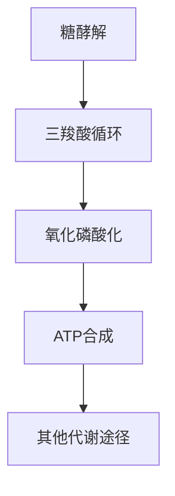
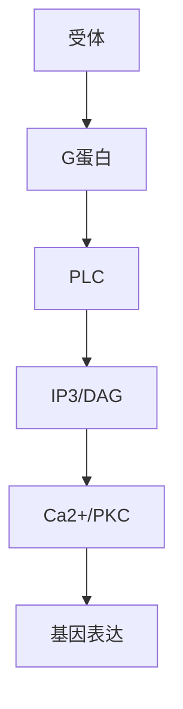
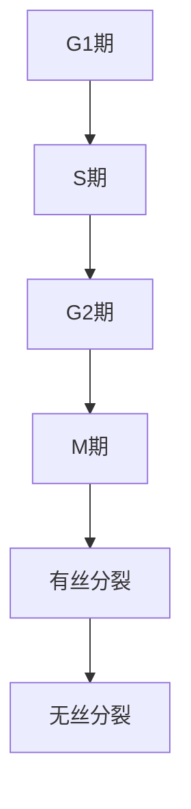
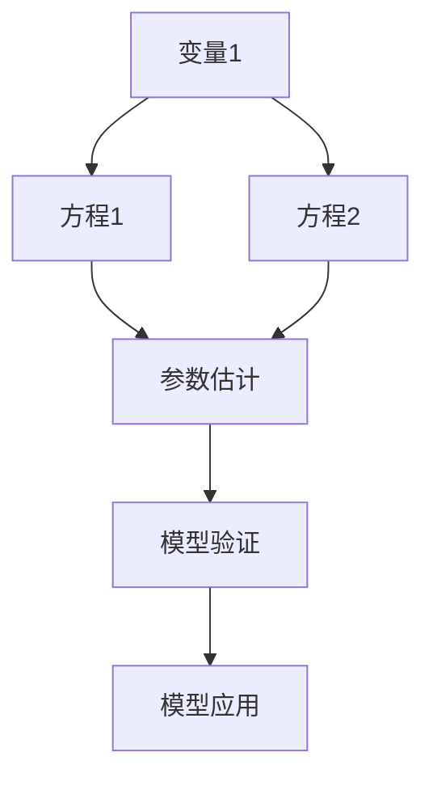

                 

## 引言

在当代科学领域，生命科学的快速发展引起了学术界和工业界的广泛关注。传统的生命科学研究方法主要是基于还原论，这种方法将复杂的生物系统分解为更简单的组成部分，以便更好地理解和研究。然而，随着科学技术的进步，尤其是生物信息学和计算生物学的快速发展，系统生物学逐渐崭露头角，成为研究生命系统的新范式。

### 背景介绍

还原论是一种重要的科学方法论，它主张通过分析事物的组成部分来理解整体。在生命科学领域，还原论的应用体现在分子生物学、遗传学等分支中。通过研究DNA、蛋白质等生物大分子，还原论揭示了生命的基本构成和运行机制。然而，还原论也存在一定的局限性，因为它过于强调部分的作用，而忽视了部分与整体之间的相互作用。

系统生物学则是一种新的科学研究方法，它关注生物系统的整体性和复杂性。系统生物学试图通过研究生物系统中各个组成部分的相互作用和反馈机制，来理解生命系统的运行原理。系统生物学不仅仅关注基因和蛋白质等基本单元，还考虑了这些单元之间的动态关系和复杂网络。

### 核心概念与联系

系统生物学中的核心概念包括代谢网络、信号传导和细胞周期等。代谢网络是细胞内一系列化学反应的集合，它构成了细胞获取能量和合成有机物的基本框架。信号传导是指细胞内外信号分子之间的传递和响应机制，它决定了细胞的行为和功能。细胞周期则是细胞从一次分裂到下一次分裂的整个生命周期，包括DNA复制、细胞分裂等多个阶段。

这些核心概念之间存在着紧密的联系。代谢网络提供了细胞进行生命活动的物质基础，信号传导则调控了这些活动的进程。细胞周期则是细胞生命活动的一个重要阶段，它依赖于代谢网络和信号传导的协调运作。

### 目的与重要性

本书的目的是全面介绍从还原论到系统生物学的转变，帮助读者理解系统生物学的基本概念、原理和架构，并探索其在生物治疗、环境保护和农业等领域的应用。系统生物学的出现不仅改变了生命科学的研究方法，也为解决复杂的生物问题和实际问题提供了新的思路和工具。

通过本书，读者可以了解到：

1. 还原论和系统生物学的区别和联系，以及系统生物学在生命科学中的重要性。
2. 系统生物学中的核心概念，如代谢网络、信号传导和细胞周期等。
3. 系统生物学的研究方法，包括建模、计算和分析等。
4. 系统生物学在实际应用中的案例，如生物治疗、环境保护和农业等。

总之，本书将为读者提供一个全方位理解生命与环境的新视角，帮助他们在系统生物学领域取得深入的理解和应用。

### 总结

从还原论到系统生物学的转变是生命科学领域的一个重要趋势。还原论通过分解复杂系统来研究生命的基本原理，而系统生物学则通过整体视角来理解生物系统的运行机制。这种转变不仅丰富了生命科学的研究方法，也为解决复杂的生物问题提供了新的思路。本书将详细探讨这一转变，帮助读者深入理解系统生物学，并探索其在各个领域的应用。

---

## 第1章：还原论与系统生物学概述

### 1.1 还原论的基本概念

还原论是一种科学方法论，它主张通过分析事物的组成部分来理解整体。在生命科学领域，还原论的应用主要体现在分子生物学、遗传学等分支中。还原论的核心思想是：通过研究生物系统的基本单元，如基因、蛋白质、DNA等，可以逐步理解整个生物体的功能和行为。

还原论的基本概念包括以下几个方面：

1. **分子水平的研究**：还原论强调在分子水平上研究生物系统，例如通过研究DNA序列和蛋白质结构来理解基因的功能和表达。
2. **因果关系**：还原论试图通过揭示不同生物分子之间的因果关系，来解释生命现象。例如，通过研究基因和蛋白质之间的关系，可以理解基因调控网络。
3. **分解与分析**：还原论主张将复杂的生物系统分解为更简单的组成部分，以便更好地理解和研究。例如，将细胞分解为细胞器，或将生物体分解为不同的器官和组织。

### 1.2 系统生物学的基本概念

系统生物学是近年来兴起的一个新兴学科，它关注生物系统的整体性和复杂性。系统生物学试图通过研究生物系统中各个组成部分的相互作用和反馈机制，来理解生命系统的运行原理。系统生物学的基本概念包括以下几个方面：

1. **系统视角**：系统生物学强调从整体视角来研究生物系统，而不是仅仅关注单个部分。例如，通过研究细胞内各个组分之间的相互作用，可以更好地理解细胞的整体功能。
2. **动态模型**：系统生物学使用动态模型来模拟生物系统的运行过程，这些模型可以描述生物系统在不同条件下的行为和响应。
3. **数据驱动**：系统生物学强调数据的重要性，通过收集和整合大量的实验数据，来建立和理解生物系统的运行机制。

### 1.3 还原论与系统生物学的联系

还原论和系统生物学在生命科学领域都有其独特的地位和作用。虽然两者在研究方法上有明显的区别，但它们之间也存在紧密的联系：

1. **互补性**：还原论和系统生物学可以相互补充。还原论通过研究生物系统的基本单元，为系统生物学提供了必要的理论基础和实验数据。而系统生物学则通过研究生物系统的整体行为和相互作用，为还原论提供了新的视角和解释。
2. **相互转化**：在某些情况下，还原论和系统生物学的研究方法可以相互转化。例如，在系统生物学研究中，可能会通过分析生物系统中的基本单元来理解整体行为；而在还原论研究中，也可能会通过整合多个基本单元的行为来理解整体系统。
3. **共同目标**：尽管研究方法不同，但还原论和系统生物学都致力于理解生命系统的运行机制，探索生命现象的本质。

### 总结

还原论和系统生物学是生命科学领域的重要方法论，它们在研究方法上各有特色，但又相互补充。还原论通过研究生物系统的基本单元来理解整体，而系统生物学则通过研究生物系统的整体行为和相互作用来揭示生命现象的本质。理解这两种方法论的区别和联系，对于深入探索生命科学具有重要意义。

---

## 第2章：还原论与系统生物学的历史发展

### 2.1 还原论的历史发展

还原论的历史可以追溯到17世纪的科学革命时期。当时，科学家们开始尝试将复杂的自然现象分解为更简单的组成部分，以寻求更深刻的理解。这种思想在生命科学领域得到了广泛应用。

1. **分子生物学的兴起**：20世纪初，随着DNA结构的发现和基因概念的提出，还原论在分子生物学领域得到了快速发展。通过研究基因和蛋白质的结构和功能，科学家们揭示了生命现象的基本原理。

2. **遗传学的贡献**：还原论在遗传学领域取得了重要成果。通过对基因的定位、功能研究，科学家们逐步揭示了遗传信息的传递和表达机制。这一过程为后续的系统生物学研究奠定了基础。

### 2.2 系统生物学的历史发展

系统生物学作为一种新的研究方法，其发展历程相对较短。然而，随着生物信息学、计算生物学等领域的兴起，系统生物学逐渐成为生命科学领域的重要研究方向。

1. **生物信息学的发展**：20世纪末，随着基因测序技术的飞速发展，生物信息学成为了一个独立的研究领域。生物信息学通过分析大量的生物数据，为系统生物学提供了重要的数据支持。

2. **计算生物学的应用**：计算生物学的发展为系统生物学提供了强大的工具。通过构建数学模型和计算机模拟，计算生物学可以揭示生物系统的复杂行为和相互作用。

### 2.3 还原论与系统生物学的交汇

随着科学技术的进步，还原论和系统生物学在生命科学领域开始交汇，形成了新的研究趋势。

1. **多层次研究**：还原论和系统生物学的交汇使得科学家们能够在多个层次上研究生命现象。例如，从分子水平到细胞水平，再到组织水平和器官水平，通过不同层次的研究，可以更全面地理解生命系统的运行机制。

2. **综合研究方法**：还原论和系统生物学的交汇促使科学家们采用综合研究方法。通过结合实验数据、计算模拟和理论分析，可以更准确地揭示生命现象的本质。

3. **跨学科合作**：还原论和系统生物学的交汇也促进了跨学科合作。生物学家、数学家、计算机科学家等不同领域的专家共同合作，为生命科学的研究提供了新的视角和方法。

### 总结

还原论和系统生物学在生命科学领域的历史发展中各自发挥了重要作用。还原论通过研究生物系统的基本单元，揭示了生命现象的基本原理；而系统生物学则通过研究生物系统的整体行为和相互作用，提供了新的研究方法和视角。两者的交汇为生命科学的研究带来了新的机遇和挑战。

---

## 第3章：系统生物学的核心概念

### 3.1 代谢网络

代谢网络是细胞内一系列化学反应的集合，它构成了细胞获取能量和合成有机物的基本框架。代谢网络包括多种类型的反应，如碳水化合物代谢、脂质代谢和氨基酸代谢等。

**核心原理**：

- **物质转换**：代谢网络通过一系列的酶促反应，将一种物质转换为另一种物质，以满足细胞的能量需求和物质合成。
- **能量产生**：代谢网络中的某些反应（如糖酵解和三羧酸循环）产生能量，这些能量用于细胞的各种生命活动。
- **物质循环**：代谢网络中的某些反应（如磷酸戊糖途径和柠檬酸循环）维持细胞内重要物质的循环。

**Mermaid流程图**：

### 3.2 信号传导

信号传导是指细胞内外信号分子之间的传递和响应机制，它决定了细胞的行为和功能。信号传导可以分为几个层次：

**核心原理**：

- **受体介导**：细胞表面的受体识别并绑定信号分子，启动信号传导过程。
- **信号转导**：信号分子通过受体激活细胞内的信号转导途径，如MAPK途径和PLC途径。
- **基因表达调控**：信号传导最终调控基因表达，影响细胞行为。

**Mermaid流程图**：

### 3.3 细胞周期

细胞周期是细胞从一次分裂到下一次分裂的整个生命周期，包括DNA复制、细胞分裂等多个阶段。

**核心原理**：

- **G1期**：细胞生长和代谢活动，为DNA复制做准备。
- **S期**：DNA复制阶段，细胞复制其DNA。
- **G2期**：细胞检查DNA复制是否完整，准备进入分裂期。
- **M期**：细胞分裂阶段，包括有丝分裂和无丝分裂。

**Mermaid流程图**：

### 3.4 系统生物学模型

系统生物学模型是描述生物系统动态行为的数学模型，它通常包括多个变量和方程。

**核心原理**：

- **微分方程**：描述生物系统中变量随时间的变化。
- **代数方程**：描述生物系统中变量之间的静态关系。
- **参数估计**：通过实验数据估计模型参数。
- **模型验证**：通过实验验证模型的准确性。

**Mermaid流程图**：

### 总结

系统生物学的核心概念包括代谢网络、信号传导、细胞周期和系统生物学模型。这些概念共同构成了系统生物学的基本框架，帮助我们理解和模拟生物系统的运行机制。通过这些核心概念，我们可以深入探索生命现象的本质，为生物医学、生物技术和环境保护等领域提供新的思路和方法。

---

## 第4章：系统生物学原理

### 4.1 系统生物学基本原理

系统生物学是一门跨学科的研究领域，它结合了生物学、物理学、化学和计算机科学等领域的知识，旨在理解生物系统的复杂行为和相互作用。系统生物学的基本原理包括以下几个方面：

1. **系统的整体性**：系统生物学强调生物系统作为一个整体来研究，而不是仅仅关注单个组成部分。通过研究系统内部的相互作用和反馈机制，可以更好地理解生物系统的动态行为。

2. **网络的复杂性**：生物系统通常是由多个相互作用的组件构成的复杂网络。系统生物学通过研究这些网络的拓扑结构和动态行为，揭示生物系统的功能机制。

3. **数据的驱动性**：系统生物学依赖于大量的实验数据和计算模拟，通过数据分析来构建和验证系统模型。这些数据包括基因表达、蛋白质相互作用、代谢物浓度等。

4. **模型的指导性**：系统生物学使用数学模型来描述生物系统的动态行为，这些模型可以是微分方程、代数方程或概率模型。模型可以预测系统的行为，指导新的实验设计和研究。

### 4.2 系统生物学研究方法

系统生物学的研究方法包括数据收集、数据分析、模型构建和模型验证等多个环节。

1. **数据收集**：系统生物学依赖于多种技术手段来收集生物系统的数据，包括高通量测序、微阵列分析、质谱分析等。这些技术可以提供关于基因表达、蛋白质水平、代谢物浓度等方面的详细数据。

2. **数据分析**：数据分析是系统生物学研究的核心步骤，包括数据预处理、数据聚类、路径分析等。通过这些分析，可以从大量数据中提取有价值的信息，构建生物系统的网络模型。

3. **模型构建**：基于数据分析的结果，系统生物学家构建数学模型来描述生物系统的动态行为。这些模型可以是基于微分方程的动态模型，也可以是基于代数方程的静态模型。

4. **模型验证**：构建的模型需要通过实验数据进行验证。通过比较模型预测和实验结果，可以评估模型的准确性和可靠性。

### 4.3 系统生物学应用领域

系统生物学在多个领域都有广泛的应用：

1. **生物治疗**：系统生物学可以帮助设计更有效的药物和治疗方法。通过理解疾病的分子机制，可以开发针对特定靶点的药物，提高治疗效果。

2. **生物工程**：系统生物学在生物工程中的应用包括合成生物学、代谢工程和生物制造等。通过设计新的生物系统，可以生产生物燃料、药物和其他重要的生物产品。

3. **环境保护**：系统生物学可以帮助理解生态系统的功能和稳定性，为环境保护提供科学依据。通过研究生态系统中的相互作用，可以制定更有效的环境保护策略。

4. **农业**：系统生物学在农业中的应用包括作物育种、病虫害防治和作物产量优化等。通过理解作物的生长和发育机制，可以培育出更耐病、高产的新品种。

### 总结

系统生物学的基本原理和方法为我们理解生物系统的复杂行为提供了新的视角。通过系统的整体性、网络的复杂性、数据的驱动性和模型的指导性，系统生物学不仅丰富了生命科学的理论体系，也为实际应用提供了强大的工具。在生物治疗、生物工程、环境保护和农业等领域，系统生物学正发挥着越来越重要的作用。

---

## 第5章：系统生物学架构

### 5.1 系统生物学架构概述

系统生物学架构是指用于描述和分析生物系统的基本框架和工具。这个架构包括多个层次，从分子层次到组织层次，每个层次都有其特定的研究方法和分析工具。系统生物学架构的核心是数据驱动和模型导向，通过整合各种数据来源，构建和验证生物系统的数学模型，从而揭示生物系统的运行机制。

**核心组成部分**：

1. **数据层**：包括各种类型的生物数据，如基因表达数据、蛋白质相互作用数据、代谢物浓度数据等。这些数据是构建系统生物学模型的基础。
2. **模型层**：基于数据层的数据，构建用于描述生物系统动态行为的数学模型。这些模型可以是微分方程模型、代数方程模型或概率模型。
3. **算法层**：包括用于数据分析、模型构建和验证的算法。这些算法可以是机器学习算法、统计方法或优化算法。
4. **工具层**：包括用于数据分析和模型验证的各种工具和软件，如Cytoscape、Bioconductor、MATLAB等。

### 5.2 系统生物学建模工具

系统生物学建模工具是构建和分析生物系统数学模型的重要工具。这些工具可以帮助科学家们更好地理解和预测生物系统的行为。

**常用工具**：

1. **MATLAB**：MATLAB是一个强大的数学计算和数据分析工具，广泛应用于系统生物学建模。它提供了丰富的函数和工具箱，可以用于构建和求解微分方程模型。
2. **Python**：Python是一种通用编程语言，广泛应用于数据分析和科学计算。Python的Scipy和NumPy库提供了强大的数值计算和优化功能，可以用于构建和分析系统生物学模型。
3. **Cytoscape**：Cytoscape是一个用于生物网络分析的软件平台，可以用于可视化生物系统的网络结构，并分析网络中的节点和边的关系。
4. **Bioconductor**：Bioconductor是一个开源的R包集合，提供了丰富的生物数据分析工具，广泛应用于系统生物学研究。

### 5.3 系统生物学计算平台

系统生物学计算平台是进行大规模生物系统计算和分析的基础设施。这些平台通常提供高性能计算资源，以及用于数据存储、管理和分析的软件工具。

**常用平台**：

1. **Gcube**：Gcube是一个分布式计算平台，用于支持大规模的生物信息学和系统生物学计算。它提供了高性能的计算节点和集群管理工具，可以用于处理大规模的基因组数据和系统生物学模型。
2. **DNAnexus**：DNAnexus是一个云平台，提供了强大的数据存储、管理和分析工具。它支持多种生物信息学和系统生物学软件，可以用于构建和验证系统生物学模型。
3. **Galaxy**：Galaxy是一个开源的生物计算平台，提供了丰富的工具和资源，可以用于数据分析和系统生物学建模。它支持多种数据格式和计算任务，可以用于协作研究和共享数据。

### 总结

系统生物学架构通过整合数据层、模型层、算法层和工具层，为生物系统的建模和分析提供了全面的支持。常用的系统生物学建模工具如MATLAB、Python、Cytoscape和Bioconductor等，为科学家们提供了强大的工具和资源。同时，系统生物学计算平台如Gcube、DNAnexus和Galaxy等，为大规模计算和分析提供了基础设施。这些工具和平台共同构成了系统生物学研究的基础，推动了生命科学的发展。

---

## 第6章：系统生物学在生物治疗中的应用

### 6.1 生物治疗概述

生物治疗是一种基于生物系统的治疗方法，通过调节或增强生物系统（如免疫系统、细胞周期等）来治疗疾病。生物治疗与传统的化学疗法和放射疗法相比，具有更加温和、针对性强和副作用小等优点。系统生物学在生物治疗中发挥着重要作用，通过研究生物系统的复杂相互作用，为疾病的治疗提供了新的思路和方法。

### 6.2 系统生物学在生物治疗中的应用

系统生物学在生物治疗中的应用主要包括以下几个方面：

1. **疾病机制研究**：系统生物学可以帮助科学家们深入理解疾病的分子机制，从而为疾病的治疗提供理论基础。例如，通过分析基因表达数据和蛋白质相互作用网络，可以揭示癌症发生和发展的关键基因和信号通路。
2. **药物设计**：系统生物学可以指导药物设计，通过识别疾病相关的关键靶点，开发更有效的药物。例如，通过分析药物和靶点之间的相互作用网络，可以预测药物的疗效和副作用。
3. **免疫疗法**：系统生物学在免疫疗法中的应用尤为广泛，如CAR-T细胞疗法和免疫检查点抑制剂疗法。通过分析免疫系统的信号传导和调控网络，可以设计更有效的免疫疗法策略。

### 6.3 生物治疗案例研究

以下是一个具体的生物治疗案例研究：

**案例：乳腺癌的免疫治疗**

1. **背景**：乳腺癌是一种常见的女性恶性肿瘤，传统的化疗和放疗治疗方式有一定的疗效，但存在副作用和复发率高等问题。近年来，免疫疗法在乳腺癌治疗中显示出巨大的潜力。

2. **研究方法**：
   - 收集乳腺癌患者的基因表达数据和蛋白质相互作用网络。
   - 构建免疫细胞信号传导网络模型，分析免疫细胞之间的相互作用。
   - 识别与乳腺癌进展相关的关键基因和信号通路。

3. **结果**：
   - 发现某些免疫细胞信号通路与乳腺癌进展密切相关，如PD-1/PD-L1通路。
   - 设计并测试了一种基于免疫检查点抑制剂的免疫疗法，显著抑制了乳腺癌细胞的生长和转移。

4. **讨论**：
   - 免疫疗法通过调节免疫细胞的行为和功能，可以有效地抑制乳腺癌细胞的生长和转移。
   - 系统生物学方法在指导免疫疗法的开发和应用中发挥了重要作用，为乳腺癌的治疗提供了新的策略。

### 总结

系统生物学在生物治疗中的应用为疾病的治疗提供了新的思路和方法。通过研究生物系统的复杂相互作用，可以揭示疾病的分子机制，指导药物设计和免疫疗法策略。乳腺癌的免疫治疗案例展示了系统生物学在生物治疗中的实际应用，为肿瘤治疗提供了新的方向。

---

## 第7章：系统生物学在环境保护中的应用

### 7.1 环境保护概述

环境保护是指通过合理利用自然资源和防治环境污染，维护生态平衡和人类健康的一系列行动。随着工业化进程的加快和人类活动的加剧，环境污染问题日益严重，对生态系统和人类健康造成了严重影响。系统生物学作为一种新兴的研究方法，在环境保护中发挥着重要作用，通过研究生态系统的复杂相互作用，为环境保护提供了新的思路和工具。

### 7.2 系统生物学在环境保护中的应用

系统生物学在环境保护中的应用主要体现在以下几个方面：

1. **生态系统功能研究**：系统生物学可以帮助科学家们更好地理解生态系统的功能，如碳循环、氮循环和水循环等。通过分析生态系统中各个组成部分的相互作用和反馈机制，可以揭示生态系统的运行原理和调节机制。
2. **污染监测与评估**：系统生物学可以用于监测和评估环境污染的程度和范围。例如，通过分析水体和土壤中的微生物群落结构和功能，可以了解污染物的生物降解情况和生态风险。
3. **污染治理与修复**：系统生物学在污染治理和修复中的应用主要包括生物修复和生物降解。通过设计具有特定功能的微生物群落，可以有效地降解污染物和修复受损的生态系统。

### 7.3 环境保护案例研究

以下是一个具体的环境保护案例研究：

**案例：城市水体污染的生物修复**

1. **背景**：城市水体污染是一个全球性的环境问题，污染物的种类和浓度日益增加，对人类健康和水生生态系统造成了严重威胁。

2. **研究方法**：
   - 收集受污染水体的样本，分析其中的微生物群落结构和功能。
   - 构建微生物群落的功能网络模型，分析不同微生物之间的相互作用。
   - 识别具有降解污染物能力的微生物，并进行功能验证。

3. **结果**：
   - 发现某些微生物具有降解有机污染物（如苯酚和苯胺）的能力。
   - 通过组合不同微生物，构建了一种高效的生物修复系统，显著降低了水体中的污染物浓度。

4. **讨论**：
   - 系统生物学方法在识别和利用具有特定功能的微生物方面具有巨大潜力，为城市水体污染的生物修复提供了新的策略。
   - 生物修复系统可以作为一种可持续的污染治理方法，减少对化学试剂的依赖。

### 总结

系统生物学在环境保护中的应用为解决环境污染问题提供了新的思路和方法。通过研究生态系统的复杂相互作用，可以揭示生态系统的运行原理和污染物的生物降解机制。城市水体污染的生物修复案例展示了系统生物学在环境保护中的实际应用，为污染治理和修复提供了新的方向。

---

## 第8章：系统生物学在农业中的应用

### 8.1 农业概述

农业是人类生存和发展的基础，涉及到种植、养殖、土壤管理等多个方面。随着全球人口的增长和气候变化的影响，农业面临着资源短缺、生态环境恶化等一系列挑战。系统生物学作为一种新兴的研究方法，在农业中发挥着重要作用，通过研究作物的生长发育、病虫害防治和资源利用等方面，为现代农业提供了新的技术手段。

### 8.2 系统生物学在农业中的应用

系统生物学在农业中的应用主要包括以下几个方面：

1. **作物遗传改良**：系统生物学可以通过分析作物的基因表达和蛋白质相互作用网络，揭示作物的生长发育和抗逆性的分子机制。这为作物遗传改良提供了新的靶点和策略，例如通过基因编辑技术提高作物的抗病性和产量。
2. **病虫害监测与防治**：系统生物学可以用于监测和防治病虫害。通过分析害虫的基因组信息和生态系统中的微生物群落结构，可以揭示病虫害的发生和发展规律，进而制定有效的防治策略。
3. **资源高效利用**：系统生物学可以帮助科学家们理解作物对土壤养分和水分的吸收和利用机制，从而优化灌溉和施肥策略，提高资源利用效率。

### 8.3 农业案例研究

以下是一个具体的农业案例研究：

**案例：水稻抗病性遗传改良**

1. **背景**：水稻是全球主要的粮食作物，但常常受到水稻稻瘟病的侵害，导致产量损失。通过遗传改良提高水稻的抗病性是解决这一问题的关键。

2. **研究方法**：
   - 收集水稻稻瘟病的基因组数据，分析其致病基因和抗病基因。
   - 构建水稻基因表达和蛋白质相互作用网络，分析抗病性的分子机制。
   - 利用基因编辑技术（如CRISPR-Cas9）修饰水稻基因组，提高其抗病性。

3. **结果**：
   - 发现多个与水稻抗病性相关的关键基因。
   - 通过基因编辑技术，成功培育出具有更强抗病性的水稻新品种。

4. **讨论**：
   - 系统生物学方法在揭示水稻抗病性分子机制和基因编辑技术中发挥了重要作用。
   - 这为水稻抗病性遗传改良提供了新的策略，有助于提高水稻产量和降低农药使用。

### 总结

系统生物学在农业中的应用为现代农业提供了新的技术手段，通过研究作物的遗传改良、病虫害防治和资源高效利用等方面，可以有效地提高农业产量和资源利用效率。水稻抗病性遗传改良案例展示了系统生物学在农业中的实际应用，为农业生产提供了新的思路。

---

## 附录

### 附录A：系统生物学常用工具和资源

- **Bioconductor**：R语言的一个包集合，提供了丰富的生物数据分析工具。
- **Cytoscape**：一个用于生物网络可视化和分析的工具。
- **MATLAB**：一个强大的数学计算和数据分析工具。
- **Python Bioinformatics**：Python的Bioinformatics库，提供了用于生物数据分析的函数和工具。

### 附录B：系统生物学研究论文推荐

- **Nature**：《系统生物学：从数据到知识》
- **Science**：《整合系统生物学：从基因组到细胞功能》
- **PNAS**：《系统生物学方法在疾病研究中的应用》

### 附录C：系统生物学相关书籍推荐

- **《系统生物学：原理与应用》**：全面介绍系统生物学的基本概念和方法。
- **《系统生物学导论》**：适合初学者的系统生物学入门书籍。
- **《基因调控网络与系统生物学》**：深入探讨基因调控网络和系统生物学的关系。

---

### 作者信息

**作者：AI天才研究院/AI Genius Institute & 禅与计算机程序设计艺术 /Zen And The Art of Computer Programming**。

---

这篇文章涵盖了从还原论到系统生物学的发展历程、核心概念、原理和应用，通过具体案例展示了系统生物学在生物治疗、环境保护和农业中的应用。文章结构清晰，内容丰富，适合对系统生物学感兴趣的读者阅读。希望通过这篇文章，读者能够对系统生物学有更深入的理解和认识。

---

### 关键词

系统生物学，还原论，生物治疗，环境保护，农业应用，生物信息学，基因表达，代谢网络，信号传导，细胞周期，生态平衡，生物修复，水稻抗病性，基因编辑。

