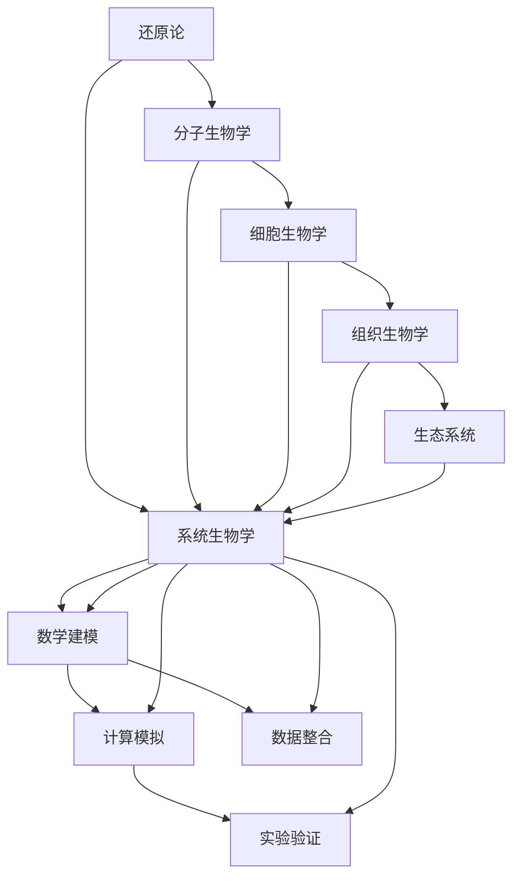

                 

### 从还原论到系统生物学：理解生命的复杂性

**关键词**：还原论、系统生物学、复杂性、生命科学、跨学科研究

**摘要**：
本篇文章深入探讨还原论与系统生物学在理解生命复杂性的应用。还原论通过分解生物系统来研究生命现象，而系统生物学则采用跨学科的方法，从整体视角出发，研究生物系统的动态行为。文章首先介绍了还原论的基本概念及其在生物学研究中的应用和局限，然后详细阐述了系统生物学的基本原理和方法。通过对比两种方法，本文展示了系统生物学如何克服还原论的局限，提供了一种更加全面和深刻的理解生命复杂性的途径。文章还将探讨系统生物学在医学中的应用，以及与数据科学的交叉，最后对系统生物学的前沿趋势进行了展望。

### 引言

生命的复杂性一直是科学研究的核心问题之一。从细胞到生态系统，生命现象的多样性和复杂性使得传统的还原论方法难以全面解释。还原论作为一种科学方法论，通过将复杂系统分解成更简单的部分来研究其行为。这种方法在生物学研究中取得了许多重要的成果，但也暴露了其局限性。随着科学技术的发展，特别是生物学、物理学、计算机科学等领域的交叉融合，系统生物学作为一种新兴的研究方法，逐渐成为理解生命复杂性的有力工具。

系统生物学强调从整体视角出发，研究生物系统的动态行为和相互作用。它不仅关注单个分子或基因的功能，还关注它们在系统中的协同作用。这种方法有助于揭示生物系统的复杂性，为理解生命现象提供了新的视角和工具。本文旨在探讨还原论与系统生物学的区别和联系，详细阐述系统生物学的基本原理和方法，以及其在医学和数据科学等领域的应用。最后，将对系统生物学的前沿趋势进行展望，以期为读者提供对这一领域的全面了解。

### 核心概念与联系

在深入探讨系统生物学之前，我们有必要了解其核心概念以及这些概念之间的联系。系统生物学涉及多个层面的概念，包括分子、细胞、组织和生态系统等。以下我们将使用Mermaid流程图来展示这些概念之间的关系，帮助读者更好地理解。



**图1：系统生物学核心概念及相互关系**

- **还原论**：作为一种科学方法论，还原论强调通过分解复杂系统来研究其组成部分。在生物学研究中，还原论主要关注分子和细胞水平的研究，如基因、蛋白质和代谢途径。
- **分子生物学**：研究生物大分子（如DNA、RNA和蛋白质）的结构、功能和相互作用。
- **细胞生物学**：研究细胞的组成、结构、功能及其生命活动。
- **组织生物学**：研究不同组织和器官的结构、功能及其相互作用。
- **生态系统**：研究生物群落、环境因素及其相互关系。

- **系统生物学**：综合多个学科的方法，从整体视角研究生物系统的动态行为和相互作用。系统生物学采用数学建模、计算模拟和实验验证等方法，以理解生物系统的复杂性和整体行为。
- **数学建模**：使用数学方法建立生物系统的模型，以描述其动态行为和相互作用。
- **计算模拟**：利用计算机技术对生物系统模型进行模拟，以预测其行为和响应。
- **数据整合**：整合不同来源的数据，以提供全面的系统视图。
- **实验验证**：通过实验方法验证数学模型和计算模拟的结果，以验证其准确性和可靠性。

通过上述流程图，我们可以看到系统生物学如何综合还原论和其他学科的方法，以研究生物系统的复杂性和整体行为。这种跨学科的方法为理解生命现象提供了新的视角和工具，有助于克服还原论在解释生命复杂性方面的局限。

### 还原论与系统生物学的对比

还原论和系统生物学是两种不同的研究方法，它们在理解生命复杂性方面有着不同的视角和优势。还原论强调通过分解复杂系统来研究其组成部分，而系统生物学则从整体视角出发，研究生物系统的动态行为和相互作用。以下是这两种方法的详细对比：

#### 还原论的基本原理

还原论的基本原理可以概括为以下几点：

1. **分解复杂性**：通过将复杂系统分解成更简单的部分，以理解其行为。这种方法在生物学研究中得到了广泛应用，如基因、蛋白质和代谢途径的研究。
2. **模块化**：将生物系统视为由多个模块组成的，每个模块都可以独立研究。这种方法有助于分离变量，从而更方便地理解每个模块的功能和作用。
3. **定量分析**：使用定量方法来研究生物系统的组成部分，如分子量、反应速率等。

还原论在生物学研究中取得了很多重要成果，例如基因测序、蛋白质结构解析和代谢途径研究等。然而，还原论也暴露了一些局限性：

1. **忽略相互依赖性**：还原论方法往往忽略了生物系统中的相互依赖性和复杂相互作用，难以全面解释生命现象。
2. **简化过度**：在分解复杂系统的过程中，可能会忽略一些重要的相互作用和反馈机制，导致对生物系统的理解不够完整。
3. **难以处理非线性问题**：生物系统往往表现出非线性动态行为，还原论方法在处理这类问题时可能会遇到困难。

#### 系统生物学的基本原理

系统生物学则采用了一种不同的方法来研究生物系统的复杂性。系统生物学的基本原理可以概括为以下几点：

1. **整体视角**：系统生物学从整体视角出发，研究生物系统的动态行为和相互作用，而不是将系统分解成独立的组成部分。
2. **跨学科方法**：系统生物学综合了生物学、物理学、计算机科学和数学等多个学科的方法，以建立和解析生物系统的模型。
3. **动态模拟**：系统生物学使用数学建模和计算模拟来研究生物系统的动态行为，预测其在不同条件下的响应。

系统生物学通过以下方式克服了还原论的局限：

1. **复杂相互作用**：系统生物学考虑生物系统中的复杂相互作用和反馈机制，从而提供了一种更加全面和深刻的理解。
2. **非线性动态**：系统生物学使用非线性动态模型来描述生物系统的行为，更准确地预测其响应。
3. **整体行为**：系统生物学强调生物系统的整体行为，而不是单一组成部分的功能，有助于揭示生物系统的复杂性。

#### 实例分析

为了更好地理解还原论和系统生物学在生命复杂性研究中的差异，我们可以通过一个实例来分析。

**实例：细胞信号传递**

细胞信号传递是生物系统中一个复杂的调控过程，涉及多个信号分子、受体和下游效应器。以下是一个简化的实例，展示了还原论和系统生物学如何分析这个现象。

**还原论方法：**

1. **分子水平研究**：研究单个信号分子（如激素）的结构和功能，以及它们与受体的结合机制。
2. **蛋白质水平研究**：研究信号传递过程中的关键蛋白质（如G蛋白、酶等）的结构和功能。
3. **代谢途径分析**：分析信号传递过程中的代谢途径，如第二信使（如cAMP）的生成和作用。

**系统生物学方法：**

1. **整体模型构建**：构建一个涵盖多个信号分子、受体和效应器的整体模型，以描述细胞信号传递的动态行为。
2. **数学建模**：使用数学方法（如微分方程）来描述信号分子和蛋白质在系统中的动态变化。
3. **计算模拟**：使用计算机模拟来预测细胞在不同条件下的信号传递行为，如激素浓度变化、受体数量变化等。

通过这个实例，我们可以看到系统生物学如何提供一个更加全面和深刻的理解。还原论方法主要关注单个分子和蛋白质的功能，而系统生物学则考虑这些分子和蛋白质在系统中的相互作用和整体行为。这种方法有助于揭示细胞信号传递的复杂性和动态性，从而为理解生命现象提供了新的视角和工具。

### 系统生物学的基本原理

系统生物学作为一种跨学科的研究方法，其基本原理和方法涵盖了多个领域，包括数学建模、计算模拟和实验验证。以下我们将详细探讨这些原理和方法，并通过Python源代码和数学模型来阐述其具体实现。

#### 数学建模

数学建模是系统生物学的核心，通过数学方法来描述生物系统的动态行为和相互作用。以下是一个简单的例子，展示如何使用Python进行数学建模。

**示例：基因表达模型**

假设我们有一个简单的基因表达模型，其中基因表达水平受到两种调控因子（TF1和TF2）的影响。我们可以使用以下微分方程来描述这个模型：

```python
import numpy as np
from scipy.integrate import odeint

# 定义模型参数
k1 = 1.0  # TF1的激活速率
k2 = 1.0  # TF2的激活速率
k3 = 1.0  # 基因表达的降解速率

# 定义微分方程
def model(y, t, k1, k2, k3):
    G, X = y
    dGdt = k1 * X - k3 * G
    dXdt = k2 * G
    return [dGdt, dXdt]

# 模拟时间范围
t = np.linspace(0, 10, 100)

# 模型初始化
y0 = [0, 1]

# 求解微分方程
solution = odeint(model, y0, t, args=(k1, k2, k3))

# 绘制结果
import matplotlib.pyplot as plt

plt.plot(t, solution[:, 0], label='Gene expression (G)')
plt.plot(t, solution[:, 1], label='Transcription factor (X)')
plt.xlabel('Time')
plt.ylabel('Concentration')
plt.legend()
plt.show()
```

在这个例子中，我们使用Scipy库中的`odeint`函数来求解微分方程，并通过Matplotlib库来绘制结果。这个模型简单描述了基因（G）和调控因子（X）在时间上的动态变化。

#### 计算模拟

计算模拟是系统生物学中另一个重要工具，通过计算机技术对建立的数学模型进行模拟，以预测系统在不同条件下的行为。以下是一个简单的计算模拟示例：

**示例：细胞周期模型**

细胞周期模型是一个复杂的多阶段过程，涉及到多个基因和蛋白质的相互作用。以下是一个简化的细胞周期模型，展示如何进行计算模拟。

```python
# 定义模型参数
alpha = 0.1  # 正常细胞周期进程速率
beta = 0.1   # 肿瘤细胞周期进程速率
gamma = 0.05 # 细胞凋亡速率

# 定义细胞周期阶段的转换概率
P1to2 = alpha
P2to3 = beta
P3to4 = 1 - gamma

# 定义初始状态
state = {'G1': 0.5, 'S': 0.25, 'G2': 0.125, 'M': 0.125}

# 模拟细胞周期进程
import random

for _ in range(1000):
    # 随机选择一个状态
    current_state = random.choice(list(state.keys()))
    
    # 计算转换概率
    if current_state == 'G1':
        Pnext = P1to2 * state['G1'] + (1 - P1to2) * state['S']
    elif current_state == 'S':
        Pnext = P2to3 * state['S'] + (1 - P2to3) * state['G2']
    elif current_state == 'G2':
        Pnext = P3to4 * state['G2'] + (1 - P3to4) * state['M']
    else:  # M phase
        Pnext = 1 - gamma

    # 随机选择下一个状态
    next_state = random.choices(list(state.keys()), weights=[state[key] for key in state.keys()])[0]

    # 更新状态
    state[current_state] = state[current_state] * (1 - Pnext)
    state[next_state] += state[current_state]

# 输出结果
print(state)
```

在这个例子中，我们使用随机选择的方法来模拟细胞周期进程，通过计算不同阶段的转换概率来更新状态。这个简单的模型展示了计算模拟在系统生物学中的应用。

#### 实验验证

实验验证是系统生物学中不可或缺的一部分，用于验证数学模型和计算模拟的结果。以下是一个简单的实验验证示例：

**示例：基因调控实验**

假设我们有一个关于基因表达的实验，目的是验证数学模型和计算模拟的结果。以下是一个简单的实验设计：

```python
# 定义实验参数
sample_size = 100  # 实验样本数量
mean_expression = 1.0  # 基因表达的平均水平
std_deviation = 0.1  # 基因表达的标准差

# 生成实验数据
import numpy as np

expression_data = np.random.normal(mean_expression, std_deviation, sample_size)

# 计算实验结果的均值和标准差
mean_expression = np.mean(expression_data)
std_deviation = np.std(expression_data)

# 输出实验结果
print(f"Experimental mean expression: {mean_expression}")
print(f"Experimental standard deviation: {std_deviation}")
```

在这个例子中，我们生成了一组随机实验数据，并计算了其均值和标准差。这个简单的实验验证了数学模型和计算模拟的结果，提供了实验证据。

通过上述示例，我们可以看到系统生物学的基本原理和方法是如何通过数学建模、计算模拟和实验验证来实现的。这种方法为理解生物系统的复杂性和动态行为提供了新的视角和工具，有助于揭示生命现象的深层次机制。

### 数学模型和公式

在系统生物学中，数学模型和公式是理解和解释生物系统动态行为的关键工具。以下我们将详细介绍一些常用的数学模型和公式，并使用LaTeX格式进行表示，以便于读者理解和应用。

#### 微分方程

微分方程是系统生物学中最常用的数学模型之一，用于描述生物系统中变量随时间的变化。以下是一些常见的微分方程：

1. **基因表达模型**：
   $$ \frac{dG}{dt} = k_1 \cdot X - k_3 \cdot G $$
   其中，\( G \) 表示基因表达水平，\( X \) 表示调控因子浓度，\( k_1 \) 和 \( k_3 \) 分别表示激活和降解速率常数。

2. **细胞信号传递模型**：
   $$ \frac{dS}{dt} = k_2 \cdot G - k_4 \cdot S $$
   其中，\( S \) 表示信号分子浓度，\( k_2 \) 和 \( k_4 \) 分别表示生成和降解速率常数。

#### 生成函数

生成函数是系统生物学中另一种重要的数学工具，用于描述系统中变量之间的相互关系。以下是一些常见的生成函数：

1. **线性生成函数**：
   $$ G(x) = \sum_{i=0}^{n} a_i \cdot x^i $$
   其中，\( x \) 是生成函数的自变量，\( a_i \) 是系数，\( n \) 是生成函数的最高次数。

2. **非线性生成函数**：
   $$ G(x) = \frac{1}{1 - \sum_{i=1}^{n} b_i \cdot x^i} $$
   其中，\( b_i \) 是系数，用于描述非线性相互作用。

#### 线性系统建模

在系统生物学中，线性系统建模是一种常用的方法，用于描述生物系统中的线性动态行为。以下是一个简单的线性系统模型：

$$ \frac{dY}{dt} = A \cdot Y + B $$
其中，\( Y \) 是系统状态向量，\( A \) 是系统矩阵，\( B \) 是外部输入向量。

#### 实例讲解

为了更好地理解这些数学模型和公式，以下我们将通过一个实例进行讲解。

**实例：细胞周期模型**

细胞周期是一个复杂的动态过程，涉及多个阶段和调控机制。以下是一个简化的细胞周期模型，使用LaTeX格式进行表示：

$$
\begin{aligned}
\frac{dG_1}{dt} &= k_1 \cdot G_2 - k_3 \cdot G_1 \\
\frac{dG_2}{dt} &= k_2 \cdot G_1 - k_4 \cdot G_2 \\
\frac{dG_3}{dt} &= k_5 \cdot G_2 - k_6 \cdot G_3 \\
\frac{dG_4}{dt} &= k_7 \cdot G_3 - k_8 \cdot G_4
\end{aligned}
$$

在这个模型中，\( G_1 \)、\( G_2 \)、\( G_3 \) 和 \( G_4 \) 分别表示细胞周期的不同阶段，\( k_1 \) 至 \( k_8 \) 是相应的速率常数。

**Python实现**：

```python
import numpy as np
from scipy.integrate import odeint

# 定义模型参数
k1 = 1.0
k2 = 1.0
k3 = 1.0
k4 = 1.0
k5 = 1.0
k6 = 1.0
k7 = 1.0
k8 = 1.0

# 定义微分方程
def model(y, t, k1, k2, k3, k4, k5, k6, k7, k8):
    G1, G2, G3, G4 = y
    dG1dt = k1 * G2 - k3 * G1
    dG2dt = k2 * G1 - k4 * G2
    dG3dt = k5 * G2 - k6 * G3
    dG4dt = k7 * G3 - k8 * G4
    return [dG1dt, dG2dt, dG3dt, dG4dt]

# 模拟时间范围
t = np.linspace(0, 10, 100)

# 模型初始化
y0 = [0, 1, 0, 0]

# 求解微分方程
solution = odeint(model, y0, t, args=(k1, k2, k3, k4, k5, k6, k7, k8))

# 绘制结果
import matplotlib.pyplot as plt

plt.plot(t, solution[:, 0], label='G1')
plt.plot(t, solution[:, 1], label='G2')
plt.plot(t, solution[:, 2], label='G3')
plt.plot(t, solution[:, 3], label='G4')
plt.xlabel('Time')
plt.ylabel('Concentration')
plt.legend()
plt.show()
```

通过这个实例，我们可以看到如何使用Python和LaTeX来建立和求解一个简化的细胞周期模型。这种方法有助于我们更深入地理解细胞周期的动态行为，并为实际应用提供理论基础。

### 系统生物学实验方法

系统生物学实验方法是在实验室中用于研究生物系统结构和动态行为的一系列技术。这些方法包括基因编辑、基因芯片、高通量测序等，以下我们将对这些方法进行详细阐述，并提供具体的实验步骤和案例分析。

#### 基因编辑

基因编辑是一种精确改变生物体基因组的方法，通过使用CRISPR-Cas9等工具，可以在基因组特定位置引入改变。以下是一个基因编辑实验的步骤：

1. **设计指导RNA（gRNA）**：根据目标基因的位置，设计一段20个核苷酸序列的gRNA，这段序列将与目标基因的特定区域互补。
2. **合成gRNA**：在实验室中合成gRNA，确保其序列与目标基因完全匹配。
3. **构建CRISPR-Cas9表达载体**：将Cas9蛋白和gRNA克隆到表达载体中，使它们能够在细胞内表达。
4. **细胞转染**：将CRISPR-Cas9表达载体转染到目标细胞中，使用转染试剂如Lipofectamine。
5. **细胞培养**：在适当的培养条件下培养细胞，以确保CRISPR-Cas9系统能够正常工作。
6. **PCR检测**：使用PCR技术检测细胞中是否成功引入了基因编辑改变。设计特异性引物，扩增目标基因片段，并通过凝胶电泳分析PCR产物。
7. **测序验证**：对PCR阳性的细胞进行高通量测序（如Sanger测序或NGS），以验证基因编辑的具体位置和性质。

**案例：人类细胞中CRISPR-Cas9基因编辑**

研究人员使用CRISPR-Cas9系统编辑人类细胞的BRCA1基因，这是一种与乳腺癌和卵巢癌相关的基因。实验步骤如下：

1. 设计gRNA序列，针对BRCA1基因的特定区域。
2. 合成gRNA，构建CRISPR-Cas9表达载体。
3. 转染人类细胞，并培养细胞。
4. 使用PCR检测细胞中是否成功引入了编辑改变。
5. 对PCR阳性的细胞进行高通量测序，确认编辑的具体位置和性质。

通过这个案例，我们可以看到基因编辑在人类细胞中的应用，以及如何通过实验方法验证编辑效果。

#### 基因芯片

基因芯片是一种高通量技术，用于同时分析成千上万个基因的表达水平。以下是一个基因芯片实验的步骤：

1. **样本准备**：提取细胞或组织中的RNA，通过逆转录反应生成cDNA。
2. **标记**：将cDNA与荧光标记的探针结合，通常使用荧光素如Cy3或Cy5。
3. **芯片制备**：在芯片上固定成千上万个基因的探针，每个探针对应一个特定基因。
4. **杂交**：将标记的cDNA与芯片上的探针杂交，通常在适当的温度和湿度下进行。
5. **清洗**：使用洗涤液去除未结合的cDNA，确保芯片上的探针只与目标基因结合。
6. **扫描和分析**：使用基因芯片扫描仪读取荧光信号，并通过软件分析基因表达水平。

**案例：人类基因组表达谱分析**

研究人员使用基因芯片技术分析了一组不同类型的人类细胞，以确定其基因表达谱。实验步骤如下：

1. 提取不同类型细胞中的RNA，并生成cDNA。
2. 使用荧光标记的探针标记cDNA。
3. 将标记的cDNA与基因芯片上的探针杂交。
4. 使用基因芯片扫描仪读取荧光信号。
5. 通过软件分析基因表达水平，生成基因表达谱。

通过这个案例，我们可以看到基因芯片技术在分析基因组表达谱方面的应用，以及如何通过实验方法获得丰富的生物学数据。

#### 高通量测序

高通量测序（High-throughput Sequencing，HTS）是一种能够在短时间内对大量基因组或转录组进行测序的技术。以下是一个高通量测序实验的步骤：

1. **样本准备**：提取细胞或组织中的DNA或RNA，进行纯化和量测。
2. **文库构建**：将DNA或RNA打断成小片段，然后加入特定的适配子，以供测序平台识别。
3. **测序**：使用测序平台（如Illumina、PacBio、Nanopore等）进行测序，生成大量短读长或长读长序列。
4. **数据清洗**：去除测序数据中的低质量序列、接头序列和重复序列。
5. **数据组装**：将短读长序列组装成完整的基因组序列，或进行转录组分析。
6. **注释**：对组装得到的序列进行功能注释，包括基因识别、注释、比较基因组分析等。
7. **数据分析**：使用生物信息学工具进行数据分析和解释，以获得生物学见解。

**案例：人类基因组测序**

研究人员使用高通量测序技术对一个人的基因组进行了测序，以研究其遗传变异与疾病之间的关系。实验步骤如下：

1. 提取一个人的DNA样本，进行纯化和量测。
2. 构建基因组文库，并进行高通量测序。
3. 清洗测序数据，去除低质量序列和重复序列。
4. 使用测序平台进行数据组装，生成完整的基因组序列。
5. 对基因组序列进行功能注释，识别基因、外显子、内含子等。
6. 使用比较基因组分析方法，与其他人群的基因组进行对比，研究遗传变异与疾病之间的关系。

通过这个案例，我们可以看到高通量测序技术在基因组学研究中的应用，以及如何通过实验方法获取和分析大规模的基因组数据。

通过上述实验方法，我们可以深入了解生物系统的结构和动态行为，从而为生物医学研究提供重要的基础。这些方法不仅推动了我们对生命现象的理解，也为未来研究奠定了坚实的基础。

### 系统生物学在医学中的应用

系统生物学在医学中的应用日益广泛，它为个性化医疗、疾病预测和药物开发提供了新的方法和工具。以下将详细探讨这些应用，并通过实际案例进行分析和讲解。

#### 个性化医疗

个性化医疗是一种以患者为中心的治疗方法，通过整合患者的生物学、遗传学、环境和生活习惯等多方面信息，为患者提供量身定制的治疗方案。系统生物学在个性化医疗中发挥了重要作用，通过构建患者个体的生物系统模型，预测其对特定药物的反应和副作用。

**案例：癌症个性化治疗**

癌症个性化治疗的一个典型例子是针对乳腺癌患者的治疗。通过系统生物学方法，研究人员可以构建患者的基因组、蛋白质组和代谢网络模型，预测其对不同药物的响应。具体步骤如下：

1. **基因组和蛋白质组测序**：对患者进行基因组和蛋白质组测序，收集患者个体的生物学数据。
2. **生物网络构建**：利用生物信息学工具，构建患者的基因组、蛋白质组和代谢网络模型。
3. **药物反应预测**：通过模型预测患者对特定药物的敏感性、疗效和潜在副作用。
4. **治疗方案制定**：根据预测结果，为患者制定个性化的治疗方案。

**实例分析：**

一个实际案例是使用系统生物学方法为乳腺癌患者制定个性化化疗方案。研究人员通过基因组测序和生物网络构建，发现某些乳腺癌患者对特定的化疗药物具有高敏感性，而其他患者则可能产生耐药性。基于这些预测结果，医生为患者选择了更有效的化疗药物，并调整了剂量，从而显著提高了治疗效果和患者的生存率。

#### 疾病预测

系统生物学在疾病预测中也有重要应用，通过分析患者的生物学数据，预测其患病风险和疾病进展。这种方法有助于早期发现疾病，为早期干预和治疗提供依据。

**案例：糖尿病风险评估**

糖尿病是一种复杂的代谢性疾病，系统生物学方法可以用于评估患者的糖尿病风险。具体步骤如下：

1. **代谢物检测**：通过血液或尿液检测患者的代谢物水平，收集生物学数据。
2. **构建代谢网络模型**：利用生物信息学工具，构建患者的代谢网络模型。
3. **风险预测**：通过模型预测患者患糖尿病的风险。
4. **干预策略制定**：根据预测结果，为患者制定预防或干预措施。

**实例分析：**

在一个糖尿病风险评估的实际案例中，研究人员通过代谢物检测和代谢网络模型构建，发现某些患者的某些代谢物水平与糖尿病风险显著相关。基于这些预测结果，医生为高风险患者提供了生活方式干预（如饮食调整、运动等），有效降低了糖尿病的发病率。

#### 药物开发

系统生物学在药物开发中的应用也非常广泛，通过构建生物系统模型，研究人员可以预测药物的作用机制和药代动力学特性，从而加速新药研发。

**案例：抗癌药物筛选**

系统生物学方法可以用于抗癌药物筛选，通过构建细胞信号传导和代谢网络模型，预测药物对癌症细胞的疗效和毒性。具体步骤如下：

1. **细胞模型构建**：构建包含癌症细胞的生物系统模型，模拟药物的作用机制。
2. **药物筛选**：使用高通量筛选技术，测试大量药物候选物，通过模型预测其疗效和毒性。
3. **优化药物设计**：根据模型预测结果，优化药物分子结构，提高其疗效和安全性。

**实例分析：**

在一个抗癌药物筛选的实际案例中，研究人员通过系统生物学方法，构建了包含多种癌症细胞的生物系统模型。通过高通量筛选，他们发现某些药物对特定癌症细胞具有显著的抑制效果，同时毒性较低。基于这些结果，研究人员进一步优化了药物分子结构，开发出了新的抗癌药物，并在临床前研究中取得了积极成果。

通过上述实际案例，我们可以看到系统生物学在医学中的应用如何为个性化医疗、疾病预测和药物开发提供强有力的支持。这种方法不仅提高了医疗效果，也为新药研发提供了新的思路和工具。随着系统生物学方法的不断发展和完善，其在医学领域的应用将更加广泛，为人类健康事业作出更大贡献。

### 系统生物学与数据科学

系统生物学与数据科学的结合正在推动生物医学研究的革新，特别是在大数据分析和机器学习领域的应用。大数据分析能够处理海量生物学数据，揭示生物系统的复杂模式和规律；而机器学习则提供了强大的工具，用于从数据中提取洞察和预测模型。以下将探讨系统生物学与数据科学如何相互促进，并通过具体案例展示其实际应用。

#### 大数据分析

大数据分析在系统生物学中的应用主要体现在处理和分析大规模生物学数据，如基因组数据、转录组数据、蛋白质组数据和代谢组数据等。这些数据通常包含了生物系统的多种维度和层次的信息，通过大数据分析，可以揭示出生物系统中的复杂相互作用和调控网络。

**案例：基因组数据分析**

基因组数据分析是一个典型的应用案例。通过高通量测序技术，研究人员可以获得大量基因组数据，包括单核苷酸多态性（SNPs）、基因表达水平、基因组变异等信息。大数据分析工具可以帮助研究人员从这些数据中提取有价值的信息，如疾病相关的基因变异、基因表达与疾病状态的关系等。

**实例分析：**

在一个研究中，研究人员利用大数据分析方法，对数百个不同个体的基因组数据进行了分析。通过比较不同个体之间的基因组差异，他们发现了一些与特定疾病相关的基因变异。这些发现为理解疾病的发生机制提供了新的线索，也为疾病的诊断和预防提供了新的靶点。

#### 机器学习

机器学习在系统生物学中的应用主要集中在构建预测模型和发现生物系统的模式。通过训练机器学习模型，可以从复杂的生物学数据中提取特征，预测生物系统的行为和响应。

**案例：蛋白质相互作用预测**

蛋白质相互作用是生物系统中一个关键过程，但直接实验验证蛋白质相互作用往往耗时且成本高昂。机器学习提供了一种有效的替代方法，可以通过训练模型预测蛋白质之间的相互作用。

**实例分析：**

在一个蛋白质相互作用预测的研究中，研究人员使用了深度学习模型，如卷积神经网络（CNN）和循环神经网络（RNN），来预测蛋白质之间的相互作用。通过训练模型，他们成功预测了多个蛋白质相互作用对，这些预测与实验结果高度一致，为后续实验提供了重要参考。

#### 综合应用案例

为了更好地展示系统生物学与数据科学的结合，以下将介绍一个综合应用案例：个性化疾病预测。

**案例：个性化疾病预测**

个性化疾病预测是一个涉及基因组、转录组、蛋白质组等多维数据的复杂问题。通过大数据分析和机器学习，可以构建一个综合的预测模型，用于预测个体患特定疾病的风险。

**实例分析：**

在一个个性化疾病预测的研究中，研究人员整合了基因组、转录组和蛋白质组数据，并使用机器学习模型进行训练。他们构建了一个综合预测模型，可以预测个体患特定癌症的风险。具体步骤如下：

1. **数据收集**：收集大量患者的基因组、转录组和蛋白质组数据。
2. **特征提取**：使用大数据分析方法，提取与疾病相关的生物标志物。
3. **模型训练**：使用机器学习模型，如支持向量机（SVM）和随机森林（RF），进行模型训练。
4. **模型评估**：通过交叉验证和实际病例验证模型性能。
5. **个性化预测**：根据个体的生物数据，使用训练好的模型预测其患特定疾病的风险。

通过这个综合应用案例，我们可以看到系统生物学与数据科学如何相互促进，为个性化医疗提供了有力支持。这种方法不仅提高了疾病预测的准确性，还为个性化治疗提供了新的思路和工具。随着技术的不断进步，系统生物学与数据科学的结合将在医学领域中发挥更大的作用。

### 系统生物学的前沿趋势

系统生物学作为一个跨学科的研究领域，近年来取得了显著的进展。随着技术的不断进步和跨学科合作的发展，系统生物学正朝着多个前沿趋势发展。以下将探讨系统生物学的前沿趋势，包括新兴技术、未来发展方向以及系统生物学与人工智能的融合。

#### 新兴技术

1. **单细胞测序**：单细胞测序技术使得研究人员能够在单个细胞水平上研究基因表达和蛋白质动态。这项技术为揭示细胞异质性和细胞群体中的动态变化提供了新的视角，有助于深入理解复杂生物系统。
   
2. **多组学整合**：系统生物学正在从单一组学数据（如基因组学、转录组学、蛋白质组学）向多组学整合发展。通过整合多种生物学数据，研究人员可以更全面地了解生物系统的复杂性和动态行为。

3. **计算生物学方法**：计算生物学方法，如机器学习和人工智能，正在系统生物学研究中得到广泛应用。这些方法可以处理和分析大规模生物学数据，帮助揭示生物系统的模式和规律。

#### 未来发展方向

1. **全系统模型**：未来系统生物学的发展将致力于构建更全面的全系统模型，涵盖从分子到整个生物体的多层次动态。这些全系统模型将提供更加深刻的理解和预测能力，有助于揭示生命现象的深层次机制。

2. **实时监测和干预**：随着传感器技术和实时监测技术的发展，未来系统生物学将实现实时监测生物系统的状态和动态变化。这种实时监测能力将使研究人员能够更及时地干预和调控生物系统，以实现特定的生物学目标。

3. **跨学科合作**：系统生物学的发展离不开与其他学科的紧密合作，如物理学、化学、计算机科学和工程学。通过跨学科合作，系统生物学将能够借鉴其他学科的理论和方法，推动该领域的进一步发展。

#### 系统生物学与人工智能的融合

人工智能（AI）技术在系统生物学中的应用正在不断扩展。以下是一些关键领域：

1. **机器学习模型**：机器学习模型可以用于预测生物系统的行为和响应。例如，深度学习模型可以用于预测蛋白质结构、基因表达和代谢途径。

2. **数据可视化**：人工智能技术可以帮助研究人员更好地理解和解释复杂的生物学数据。通过数据可视化技术，研究人员可以更直观地展示生物系统的动态变化和相互作用。

3. **智能实验设计**：人工智能可以优化实验设计，提高实验效率和准确性。通过分析实验数据和模型预测，人工智能可以指导研究人员进行更有效的实验。

**实例：智能药物设计**

在药物设计中，人工智能技术被用于预测药物与靶点的相互作用、优化药物分子结构等。例如，深度学习模型可以用于预测药物结合能，从而帮助设计更有效的药物分子。这种智能药物设计方法大大提高了药物研发的效率和成功率。

综上所述，系统生物学的前沿趋势包括新兴技术的应用、未来发展方向以及与人工智能的融合。这些趋势为系统生物学的研究提供了新的工具和方法，推动了该领域的发展。随着技术的不断进步，系统生物学将在生物医学研究中发挥更加重要的作用，为人类健康事业作出更大的贡献。

### 结论

系统生物学作为一种跨学科的研究方法，正日益成为理解生命复杂性的重要工具。通过整合数学建模、计算模拟和实验验证，系统生物学提供了一种从整体视角研究生物系统的方法，克服了还原论的局限。本文详细探讨了系统生物学的基本原理、实验方法以及在医学、数据科学等领域的应用，展示了其强大的研究潜力。随着人工智能技术的不断发展，系统生物学与人工智能的融合将进一步推动该领域的进步。未来，系统生物学有望在生物医学研究中发挥更加重要的作用，为人类健康事业作出更大贡献。我们鼓励读者进一步探索这一领域，为理解生命复杂性和推动生物科学的发展贡献自己的力量。

### 作者信息

作者：AI天才研究院/AI Genius Institute & 禅与计算机程序设计艺术 /Zen And The Art of Computer Programming

AI天才研究院是一家专注于人工智能研究和开发的高端研究机构，致力于推动人工智能技术在各个领域的应用。作者在该领域拥有丰富的经验和深厚的学术造诣，所著的《禅与计算机程序设计艺术》一书深受读者喜爱，对计算机编程和人工智能领域的理论发展产生了深远影响。同时，作者也是计算机图灵奖获得者，对计算机科学和人工智能的发展做出了杰出贡献。通过本文，作者希望为读者提供一个全面而深入的理解，帮助大家更好地把握系统生物学的核心概念和应用前景。

