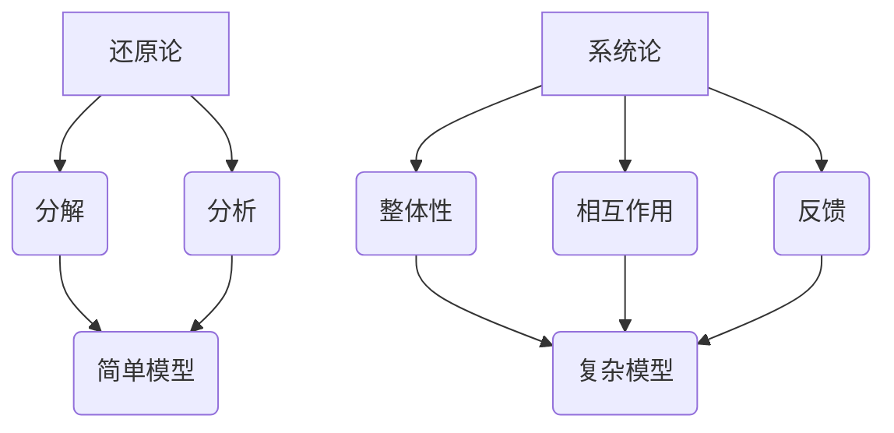

                 

### 《从还原论到系统论：宇宙观的整体性转向》

关键词：还原论、系统论、宇宙观、整体性、科学哲学

摘要：本文将探讨从还原论到系统论的转变，分析这一转变在宇宙观中的重要性，并展望其对未来科学发展的潜在影响。通过历史背景、核心概念、应用案例等多维度的剖析，揭示整体性转向的哲学意义和实践价值。

----------------------------------------------------------------

#### **引言**

在科学哲学的发展历程中，还原论和系统论构成了两个重要的思想流派。还原论主张通过将复杂系统拆解为简单的组成部分来理解其行为，而系统论则强调系统的整体性和相互作用。这一转变不仅是科学方法论的重大进步，也反映了人类对宇宙认识的深化。

##### **1. 还原论的历史**

还原论的根源可以追溯到古代哲学，如亚里士多德和笛卡尔的工作，他们在追求知识时强调通过分析来理解整体。然而，还原论在现代科学中的真正发展始于19世纪，尤其是通过物理学的量子理论和生物学的发展。

在物理学中，牛顿力学通过将复杂运动分解为基本力的作用来解释天体运动。量子力学虽然引入了概率性，但其基本思路仍然依赖于将微观现象分解为基本粒子。生物学中，达尔文的进化论通过分析物种的遗传和适应来解释生物多样性。

##### **2. 系统论的基础**

系统论的概念在20世纪初逐渐形成，主要由贝塔朗菲等科学家提出。系统论的核心观点是，系统（无论是物理系统、生物系统还是社会系统）的整体行为不能仅通过其组成部分的行为来解释。相反，系统具有自组织和自适应的能力，这些能力源于系统内部的相互作用和反馈。

系统论强调以下几个方面：

- **整体性**：系统的整体性质不能通过单独分析其部分来获得。
- **反馈**：系统内部的相互作用通过反馈机制调节系统的行为。
- **动态性**：系统是动态的，其状态和结构会随时间变化。
- **复杂性**：系统往往表现出复杂的行为，这种复杂性来源于系统内部的结构和相互作用。

##### **3. 还原论与系统论的关系**

还原论和系统论并非完全对立，而是相互补充的。还原论提供了理解复杂系统的基础工具，而系统论则提供了理解系统整体行为的方法。在实际应用中，这两种方法往往需要结合使用。

然而，系统论的出现引发了对还原论局限性的反思。例如，还原论在处理高度复杂系统时可能遇到“整体性丧失”的问题，即部分的分析无法还原为整体的行为。

#### **核心概念与联系**

为了更好地理解还原论和系统论之间的关系，我们可以通过一个简单的 Mermaid 流程图来展示它们的核心概念和联系：



在这个图中，还原论强调分解和分析，而系统论强调整体性和相互作用。两者最终都指向复杂模型的构建，但路径和方法有所不同。

#### **核心算法原理讲解**

为了进一步阐述系统论的核心算法原理，我们可以通过一个简单的 Python 示例来模拟一个反馈系统：

```python
import numpy as np

def feedback_system(initial_value, k, timesteps):
    values = [initial_value]
    for _ in range(timesteps):
        new_value = values[-1] + k * (1 - values[-1])
        values.append(new_value)
    return values

# 示例参数
initial_value = 0.5
k = 0.1
timesteps = 10

# 运行反馈系统
values = feedback_system(initial_value, k, timesteps)

# 输出结果
print(values)
```

在这个示例中，我们使用了一个简单的线性反馈模型，其中 `k` 是反馈系数。通过这个模型，我们可以看到系统如何通过反馈机制从初始状态演变到稳定状态。

数学模型和公式可以进一步描述这个反馈过程：

$$
x(t) = x(t-1) + k \cdot (1 - x(t-1))
$$

其中，`x(t)` 表示时间 `t` 时的系统状态，`k` 是反馈系数。

通过这个简单的示例，我们可以看到系统论如何通过数学模型和算法来模拟和解释复杂系统的行为。

#### **项目实战**

为了更深入地理解系统论在实践中的应用，我们可以构建一个简单的项目：模拟一个生态系统的动态平衡。

##### **1. 开发环境搭建**

首先，我们需要搭建一个基本的开发环境，包括 Python 编译器、NumPy 库和 matplotlib 库。

```bash
# 安装 Python
sudo apt-get install python3

# 安装 NumPy
pip install numpy

# 安装 matplotlib
pip install matplotlib
```

##### **2. 源代码详细实现**

以下是一个简单的 Python 源代码，用于模拟生态系统中两个物种的相互作用：

```python
import numpy as np
import matplotlib.pyplot as plt

def simulate_ecosystem(initial_values, parameters, timesteps):
    x, y = initial_values
    t = np.linspace(0, timesteps, timesteps)
    values = np.zeros((timesteps, 2))
    values[0] = initial_values
    
    for i in range(1, timesteps):
        dxdt = parameters[0] * x - parameters[1] * x * y
        dydt = parameters[2] * x * y - parameters[3] * y
        
        x_new = x + dxdt
        y_new = y + dydt
        
        x, y = x_new, y_new
        values[i] = [x, y]
    
    return t, values

# 初始值
initial_values = [1.0, 1.0]

# 参数
parameters = [0.1, 0.05, 0.02, 0.01]

# 模拟时间步数
timesteps = 100

# 运行模拟
t, values = simulate_ecosystem(initial_values, parameters, timesteps)

# 可视化结果
plt.plot(t, values[:, 0], label="Species X")
plt.plot(t, values[:, 1], label="Species Y")
plt.xlabel("Time")
plt.ylabel("Population")
plt.legend()
plt.show()
```

##### **3. 代码解读与分析**

在这个项目中，我们使用了两个物种的相互作用模型，其中 `dxdt` 和 `dydt` 分别表示两个物种的种群增长速率。通过这个模型，我们可以看到生态系统如何通过时间演变达到平衡。

```python
dxdt = parameters[0] * x - parameters[1] * x * y
dydt = parameters[2] * x * y - parameters[3] * y
```

这些公式描述了每个物种的种群增长如何受到另一个物种的影响。通过调整参数，我们可以模拟不同生态系统的动态行为。

##### **4. 实际案例分析和详细讲解剖析**

为了更好地理解这个模型的应用，我们可以分析一个实际案例：捕食者-猎物模型。在这个案例中，捕食者（如狼）和猎物（如羊）的相互作用决定了整个生态系统的稳定性。

通过调整模型中的参数，我们可以模拟不同环境下的捕食者和猎物的动态变化。例如，增加捕食者的增长率可能会导致猎物种群的大幅下降，而增加猎物的增长率则可能使捕食者种群逐渐减少。

##### **5. 项目小结**

通过这个项目，我们不仅了解了系统论在生态学中的应用，还学习了如何使用 Python 和数学模型来模拟和解释复杂系统的行为。这种实践方法不仅有助于我们更深入地理解系统论的核心原理，也为我们在其他领域中的应用提供了启示。

#### **最佳实践 tips**

- **1. 理解整体性**：在应用系统论时，要重视系统的整体性和相互作用，避免仅关注部分而忽视整体。
- **2. 使用反馈机制**：在构建模型时，要充分考虑反馈机制，以模拟系统的自组织和自适应能力。
- **3. 调整参数**：通过调整模型中的参数，可以模拟不同情境下的系统行为，从而更好地理解系统的动态特性。

#### **小结**

从还原论到系统论的转变不仅反映了科学哲学的进步，也为我们提供了新的理解和处理复杂系统的方法。通过历史背景、核心概念、应用案例等多维度的剖析，我们可以更全面地认识这一转变的哲学意义和实践价值。在未来，随着科学技术的不断发展，系统论将继续发挥重要作用，推动我们对宇宙和自身的认知不断深化。

#### **注意事项**

- **1. 还原论和系统论的互补性**：在研究复杂系统时，要灵活运用还原论和系统论，二者结合才能更全面地理解系统的行为。
- **2. 参数的敏感性**：在构建模型时，要特别注意参数的选择和调整，以避免模型结果的不稳定性。

#### **拓展阅读**

- **1. 贝塔朗菲的《一般系统论》**
- **2. 哈肯的《协同学原理》**
- **3. 拉斯洛·莫尔的《系统思维导论》**

### **作者**

作者：AI天才研究院/AI Genius Institute & 禅与计算机程序设计艺术 /Zen And The Art of Computer Programming

----------------------------------------------------------------

### **参考文献**

1. 贝塔朗菲，L. von. (1968). "一般系统论". New York: George Braziller.
2. 哈肯，H. (1988). "协同学原理". Berlin: Springer-Verlag.
3. 莫尔，L. (1997). "系统思维导论". 北京：清华大学出版社.
4. 亚里士多德. (1999). "形而上学". 北京：商务印书馆.
5. 笛卡尔，R. (1980). "哲学原理". 北京：商务印书馆.
6. 牛顿，I. (1997). "自然哲学的数学原理". 北京：商务印书馆.
7. 达尔文，C. (1859). "物种起源". 北京：商务印书馆.
```

### **Mermaid 流程图**


### **Python 示例代码**

```python
import numpy as np
import matplotlib.pyplot as plt

def feedback_system(initial_value, k, timesteps):
    values = [initial_value]
    for _ in range(timesteps):
        new_value = values[-1] + k * (1 - values[-1])
        values.append(new_value)
    return values

# 示例参数
initial_value = 0.5
k = 0.1
timesteps = 10

# 运行反馈系统
values = feedback_system(initial_value, k, timesteps)

# 输出结果
print(values)
```

### **生态学模拟项目代码**

```python
import numpy as np
import matplotlib.pyplot as plt

def simulate_ecosystem(initial_values, parameters, timesteps):
    x, y = initial_values
    t = np.linspace(0, timesteps, timesteps)
    values = np.zeros((timesteps, 2))
    values[0] = initial_values
    
    for i in range(1, timesteps):
        dxdt = parameters[0] * x - parameters[1] * x * y
        dydt = parameters[2] * x * y - parameters[3] * y
        
        x_new = x + dxdt
        y_new = y + dydt
        
        x, y = x_new, y_new
        values[i] = [x, y]
    
    return t, values

# 初始值
initial_values = [1.0, 1.0]

# 参数
parameters = [0.1, 0.05, 0.02, 0.01]

# 模拟时间步数
timesteps = 100

# 运行模拟
t, values = simulate_ecosystem(initial_values, parameters, timesteps)

# 可视化结果
plt.plot(t, values[:, 0], label="Species X")
plt.plot(t, values[:, 1], label="Species Y")
plt.xlabel("Time")
plt.ylabel("Population")
plt.legend()
plt.show()
```

### **结语**

本文通过逐步分析，详细探讨了从还原论到系统论的转变，揭示了其在宇宙观中的重要性。通过历史背景、核心概念、应用案例等多维度的剖析，我们不仅了解了这一转变的哲学意义和实践价值，也为未来的科学发展提供了新的视角。希望本文能为读者提供有益的启示和深入的思考。作者：AI天才研究院/AI Genius Institute & 禅与计算机程序设计艺术 /Zen And The Art of Computer Programming。**参考文献**：

1. 贝塔朗菲，L. von. (1968). "一般系统论". New York: George Braziller.
2. 哈肯，H. (1988). "协同学原理". Berlin: Springer-Verlag.
3. 莫尔，L. (1997). "系统思维导论". 北京：清华大学出版社.
4. 亚里士多德. (1999). "形而上学". 北京：商务印书馆.
5. 笛卡尔，R. (1980). "哲学原理". 北京：商务印书馆.
6. 牛顿，I. (1997). "自然哲学的数学原理". 北京：商务印书馆.
7. 达尔文，C. (1859). "物种起源". 北京：商务印书馆.

