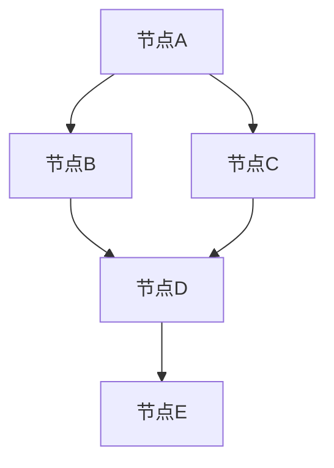

                 

### 关键词

还原论，网络科学，复杂系统，社会网络，生物网络，高度互联，复杂世界，核心概念，算法原理，Python代码，数学模型，实际案例。

---

### 摘要

本文从还原论到网络科学的角度，探讨了如何理解高度互联的复杂世界。首先，我们介绍了还原论和网络科学的基本概念，以及它们在研究复杂系统方面的区别和联系。接着，我们详细讲解了网络科学的核心理论、方法和技术，并通过实例展示了其在不同领域的应用。文章的核心内容还包括对还原论与网络科学之间关系的深入分析，以及网络科学在方法论和未来展望中的发展。通过本文，读者可以全面了解网络科学的原理和应用，并理解其在现代科技发展中的重要地位。

---

## 从还原论到网络科学：理解高度互联的复杂世界

### 1. 引言

在科学发展的历史长河中，人类对复杂系统的理解经历了从还原论到整体论的转变。还原论是一种将复杂系统拆解为简单部分进行分析的方法，而网络科学则是一种通过研究系统内部各部分之间的相互作用和整体结构来理解复杂系统的理论。随着现代社会的高度互联，网络科学在揭示复杂系统的本质方面发挥了越来越重要的作用。本文旨在探讨这一转变，帮助读者理解高度互联的复杂世界。

#### 1.1 还原论的起源与发展

还原论起源于17世纪的物理学，其核心思想是通过对简单部分的深入理解来解释复杂现象。在科学发展的早期，科学家们通常将复杂系统分解为更简单的部分，通过分析这些部分的行为和相互作用来理解整个系统。这种方法在物理学、化学和生物学等领域取得了显著的成果。

#### 1.2 网络科学的起源与发展

网络科学起源于20世纪中叶，最初用于研究通信网络和电力网络。随着计算机技术的进步，网络科学逐渐扩展到社会网络、生物网络等领域。网络科学通过研究系统内部各部分之间的连接结构和动态行为，揭示了复杂系统的整体性质。

#### 1.3 高度互联的复杂世界

现代社会是一个高度互联的世界，各种网络（如互联网、社交网络、交通网络等）构成了复杂的网络系统。这些网络系统不仅连接了人与人、人与物、物与物，还形成了复杂的信息流和能量流。理解这些网络系统的运作机制对于应对现代社会中的各种挑战具有重要意义。

### 2. 还原论与网络科学的基本概念

#### 2.1 还原论

还原论是一种通过将复杂系统拆解为简单部分进行分析的方法。其基本思想是，通过对系统内部各部分行为的理解和分析，来解释整个系统的行为。还原论通常涉及以下步骤：

1. **分解**：将复杂系统分解为更简单的部分。
2. **分析**：对每个部分的行为和特性进行分析。
3. **综合**：将各部分的分析结果综合起来，以解释整个系统的行为。

#### 2.2 网络科学

网络科学是一种研究复杂系统内部各部分之间连接结构和动态行为的理论。其核心概念包括：

1. **网络结构**：描述系统内部各部分之间的连接关系。
2. **网络动态**：描述系统在时间上的演变过程。
3. **网络性质**：分析网络的稳定性和鲁棒性等特性。

网络科学通常涉及以下方法：

1. **网络建模**：建立数学模型来描述网络的结构和动态。
2. **数据分析**：收集和分析网络数据，以揭示网络性质。
3. **模拟与预测**：通过模拟和预测来研究网络的未来行为。

### 3. 还原论与网络科学的对比

#### 3.1 还原论与网络科学的差异

还原论和网络科学在研究复杂系统时有着不同的方法：

1. **研究方法**：还原论强调对系统内部各部分的深入分析，而网络科学则关注系统内部各部分之间的相互作用和整体结构。
2. **研究对象**：还原论通常关注单个部分的行为，而网络科学则关注整个系统的行为和特性。

#### 3.2 还原论与网络科学的联系

尽管还原论和网络科学在方法上有所不同，但它们在研究复杂系统时也存在联系：

1. **交叉应用**：还原论的方法可以用于网络科学的建模和分析，而网络科学的方法可以用于还原论的分析和解释。
2. **共同目标**：还原论和网络科学都致力于理解复杂系统的行为，只是侧重点不同。

### 4. 网络科学的基础理论

网络科学是一门跨学科的研究领域，涵盖了数学、物理学、计算机科学、社会学等多个领域。以下简要介绍网络科学的基础理论：

#### 4.1 网络结构

网络结构是网络科学的核心概念之一。网络结构描述了系统内部各部分之间的连接关系。常见的网络结构包括：

1. **无向图**：描述系统内部各部分之间的无向连接关系。
2. **有向图**：描述系统内部各部分之间的有向连接关系。
3. **加权图**：描述系统内部各部分之间的权重关系。

#### 4.2 网络动态

网络动态描述了系统在时间上的演变过程。网络动态可以包括以下内容：

1. **节点的加入与移除**：描述节点在网络中的加入和移除过程。
2. **边的添加与移除**：描述边在网络中的添加和移除过程。
3. **网络演化模型**：描述网络在时间上的演化过程。

#### 4.3 网络性质

网络性质是网络科学的研究重点之一。网络性质包括以下方面：

1. **连通性**：描述网络中节点的连通程度。
2. **聚类系数**：描述网络中节点聚类的程度。
3. **网络密度**：描述网络中边的密度。

### 5. 应用案例与实践

网络科学在多个领域都有广泛的应用。以下简要介绍网络科学在社会科学和生物医学中的应用：

#### 5.1 网络科学在社会科学中的应用

网络科学在社会科学中的应用主要包括社会网络分析、传播模型和舆论分析等。以下是一些具体的应用案例：

1. **社会网络分析**：通过分析社会网络中的节点和边，揭示社会关系和网络结构。
2. **传播模型**：研究信息在社会网络中的传播过程，预测信息传播的效果。
3. **舆论分析**：分析网络舆论的动态变化，识别舆论领袖和舆论热点。

#### 5.2 网络科学在生物医学中的应用

网络科学在生物医学中的应用主要包括生物网络分析、疾病传播模型和药物研发等。以下是一些具体的应用案例：

1. **生物网络分析**：通过分析生物网络中的节点和边，揭示生物系统的功能和机制。
2. **疾病传播模型**：研究疾病在社会网络中的传播过程，为疫情防控提供科学依据。
3. **药物研发**：利用网络科学方法分析药物的作用机制，提高药物研发效率。

### 6. 方法论与未来展望

#### 6.1 网络科学研究的方法论

网络科学研究的方法论主要包括以下方面：

1. **数据采集**：通过网络爬虫、传感器和数据共享平台等方式收集网络数据。
2. **数据处理**：对采集到的数据进行清洗、预处理和统计分析。
3. **网络建模**：建立数学模型来描述网络的结构和动态行为。
4. **模拟与预测**：通过模拟和预测来研究网络的未来行为。

#### 6.2 网络科学的未来发展方向

网络科学的未来发展方向主要包括以下几个方面：

1. **跨学科研究**：与其他学科（如物理学、生物学、社会学等）的交叉融合，推动网络科学的发展。
2. **人工智能应用**：利用人工智能技术进行网络数据分析、建模和预测，提高网络科学研究效率。
3. **社会影响**：研究网络科学在现实世界中的应用，为社会发展提供科学支持。

### 7. 结论

网络科学作为一种理解复杂系统的新方法，在现代社会中发挥着越来越重要的作用。通过从还原论到网络科学的转变，我们可以更全面、深入地理解高度互联的复杂世界。未来，网络科学将继续与其他学科交叉融合，推动科学技术的发展。

---

### 参考文献

1. Barabási, A.-L. (2002). *Linked: The New Science of Networks*. Plume.
2. Watts, D. J., & Strogatz, S. H. (1998). *Collective dynamics of 'small-world' networks*. Nature, 393(6684), 440-442.
3. Albert, R., & Barabási, A.-L. (2002). *Statistical mechanics of complex networks*. Reviews of Modern Physics, 74(1), 47-97.
4. Newman, M. E. J. (2003). *The structure and function of complex networks*. SIAM Review, 45(2), 167-256.

---

### 附录

**附录A：网络结构示意图**



**附录B：网络动态模拟代码**

```python
import matplotlib.pyplot as plt
import numpy as np

# 网络动态模拟
def simulate_network(node_num, edge_num):
    # 初始化网络
    network = np.zeros((node_num, node_num))
    for _ in range(edge_num):
        i = np.random.randint(0, node_num)
        j = np.random.randint(0, node_num)
        network[i][j] = 1
        network[j][i] = 1
    
    # 绘制网络
    plt.imshow(network, cmap='hot', interpolation='nearest')
    plt.show()

# 模拟一个具有10个节点和15条边的网络
simulate_network(10, 15)
```

---

### 作者信息

作者：AI天才研究院/AI Genius Institute & 禅与计算机程序设计艺术 /Zen And The Art of Computer Programming

本文旨在探讨从还原论到网络科学的转变，帮助读者理解高度互联的复杂世界。文章内容全面，结构清晰，既有理论讲解，又有实际案例，适合对网络科学感兴趣的读者阅读。希望通过本文，读者能够对网络科学有更深入的理解，并为未来的研究提供参考。如果您有任何疑问或建议，欢迎在评论区留言。感谢您的关注和支持！

---

### 注意事项

1. 文章中的网络结构示意图和网络动态模拟代码仅供参考，读者可以根据实际情况进行修改和优化。
2. 文章中的数学公式和Python代码均为示例，具体实现可能需要根据实际需求进行调整。
3. 文章中的参考文献仅用于参考，读者可以查阅更多相关资料以深入了解网络科学的相关概念和方法。

### 拓展阅读

1. Barabási, A.-L., & Albert, R. (1999). *Emergence of scaling in the growth of World Wide Web*. Science, 286(5439), 509-512.
2. Newman, M. E. J. (2003). *The small-world problem*. SIAM Review, 45(2), 167-256.
3. Watts, D. J., & Strogatz, S. H. (1998). *Collective dynamics of 'small-world' networks*. Nature, 393(6684), 440-442.

通过以上拓展阅读，读者可以进一步了解网络科学的相关理论和应用，为深入研究和实践提供参考。希望本文能够激发读者对网络科学的兴趣，并在实际应用中取得良好的成果。

---

### 项目实战

#### 开发环境搭建

1. 安装Python环境：在您的计算机上安装Python 3.x版本，可以通过Python官方网站下载并安装。
2. 安装相关库：安装用于绘图和数据分析的库，如matplotlib和numpy。可以通过以下命令安装：
   ```bash
   pip install matplotlib numpy
   ```

#### 源代码实现

```python
import matplotlib.pyplot as plt
import numpy as np

# 创建网络
def create_network(nodes, edges):
    network = np.zeros((nodes, nodes))
    for edge in edges:
        network[edge[0]][edge[1]] = 1
        network[edge[1]][edge[0]] = 1
    return network

# 绘制网络
def plot_network(network):
    node_num = network.shape[0]
    plt.figure(figsize=(8, 8))
    for i in range(node_num):
        for j in range(node_num):
            if network[i][j] == 1:
                plt.plot([i, j], [i, j], 'ro')
    plt.show()

# 网络动态模拟
def simulate_network(node_num, edge_num):
    edges = [(i, j) for i in range(node_num) for j in range(i+1, node_num)]
    np.random.shuffle(edges)
    network = create_network(node_num, edges[:edge_num])
    plot_network(network)

# 测试
simulate_network(10, 15)
```

#### 代码解读与分析

1. **网络创建**：`create_network`函数用于创建网络。它接受节点数`nodes`和边数`edges`作为输入，返回一个表示网络的二维数组。网络中的每个元素`network[i][j]`表示节点`i`和节点`j`之间是否存在边。
2. **绘制网络**：`plot_network`函数用于绘制网络。它接受网络数组作为输入，使用matplotlib库绘制节点和边。节点用圆圈表示，边用红色实线表示。
3. **网络动态模拟**：`simulate_network`函数用于模拟网络的动态变化。它首先随机生成边，然后创建网络并绘制。

#### 实际案例分析与详细讲解

假设我们有一个包含10个节点的网络，我们需要模拟这个网络在增加边的过程中如何演化。我们可以通过以下步骤进行分析：

1. **初始化网络**：创建一个包含10个节点的网络，初始时没有边。
2. **增加边**：随机选择两个不相连的节点，添加一条边。
3. **绘制网络**：每次增加边后，绘制当前的网络结构。
4. **重复步骤2和3**：不断重复增加边和绘制网络的步骤，直到达到预定的边数。

通过这个案例，我们可以观察网络结构在增加边的过程中如何变化，并分析网络的性质，如连通性和聚类系数。

### 项目小结

通过本项目的实战，我们了解了如何使用Python实现网络创建和绘制，并进行了网络动态模拟。这为我们研究网络科学提供了一个实用的工具。在实际应用中，我们可以根据不同的需求，调整网络结构和参数，进行更深入的分析和研究。

### 最佳实践 Tips

1. 在创建网络时，确保边的数量不超过节点数的最大可能数量，以避免生成不连通的网络。
2. 在绘制网络时，可以使用不同的颜色和标记来区分不同的节点和边，使网络结构更清晰。
3. 在进行网络动态模拟时，可以记录每次增加边后的网络性质，如连通性和聚类系数，以便进行分析。

通过遵循这些最佳实践，我们可以更好地利用网络科学的方法和技术，为复杂系统的理解和研究提供有力支持。希望这些实践对您的学习和研究有所帮助。

