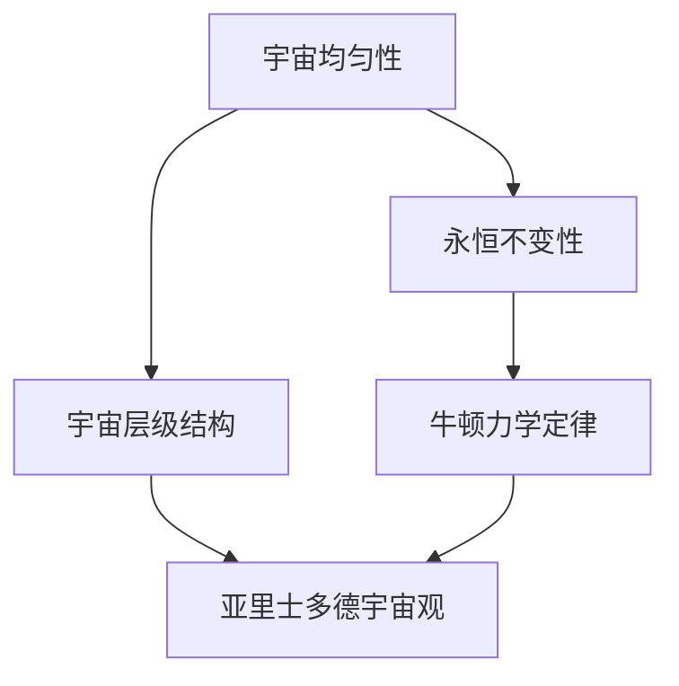

                 


### 引言

《从静态宇宙观到动态宇宙观：认知的进化》这本书探讨了一个引人入胜的主题：宇宙观的演变。它引导读者从传统的静态宇宙观，逐步迈向更为复杂的动态宇宙观，并探讨这一认知进化的过程对我们的思维方式和社会发展产生的影响。书中的核心思想是，随着科学技术的进步，我们对宇宙的理解也在不断深化和拓展，这一认知的进化过程不仅改变了我们对宇宙的基本认识，也深刻地影响了我们的认知方式。

本文将以书名为线索，逐步展开讨论。首先，我们将深入探讨静态宇宙观的起源、核心概念及其历史演变。接着，我们将转向动态宇宙观，介绍其理论基础、研究方法、实验证据，并通过具体的Python源代码和数学模型来详细解释这些概念。最后，我们将分析认知的进化过程，讨论其对人类的影响，并展望未来的认知进化方向。

文章将以以下结构展开：

1. **理解书名**：阐述书名的意义和主题。
2. **静态宇宙观**：介绍静态宇宙观的起源、核心概念及其局限性。
3. **动态宇宙观**：阐述动态宇宙观的基础、核心理论和实验证据。
4. **认知的进化**：讨论认知的概念、认知进化与动态宇宙观的关系，以及对人类的影响。
5. **未来展望**：展望未来的认知进化方向。
6. **参考文献**：列出引用的文献。

在接下来的章节中，我们将一步步深入探讨这些主题，通过逻辑清晰、结构紧凑、简单易懂的叙述方式，带领读者理解从静态宇宙观到动态宇宙观的认知进化过程。

### 静态宇宙观的起源

静态宇宙观的起源可以追溯到古代文明，当时的科学家和哲学家通过观察天空中的星辰和行星，试图理解宇宙的本质。这一时期，人们普遍认为宇宙是静态的、永恒不变的。这种观点最早可以追溯到古希腊哲学家，如泰勒斯和赫拉克利特。泰勒斯认为宇宙是水构成的，而赫拉克利特则提出宇宙是由不断变化的“流”构成的。尽管赫拉克利特的“流”概念具有动态的萌芽，但在当时，静态宇宙观仍然是主流观点。

到了中世纪，亚里士多德的理论进一步巩固了静态宇宙观。亚里士多德认为宇宙是一个静态的结构，由一个永恒不灭的神所创造。这一观点在基督教神学中得到了广泛接受，并影响了西方哲学的发展。亚里士多德的理论强调了宇宙的层级结构，认为地球是宇宙的中心，而星辰和行星则按照固定的轨道运动。

在文艺复兴时期，哥白尼提出了日心说，挑战了亚里士多德的地心说，标志着宇宙观的一个重要转折点。尽管哥白尼的日心说为后来的科学研究奠定了基础，但他仍然认为宇宙是静态的，行星和星辰的运动是完美无缺的。

真正推动静态宇宙观发展的里程碑是牛顿的经典力学。在17世纪，牛顿通过万有引力定律和运动定律，提出了一个关于宇宙运作的完整理论框架。根据牛顿的理论，宇宙中的所有物体都遵循相同的物理定律，而这些定律在时间和空间上都是不变的。牛顿的力学模型为静态宇宙观提供了强有力的数学基础，使得人们能够精确地预测行星和星辰的运动。

牛顿的宇宙观在19世纪得到了进一步的发展，天文学家通过对天文观测数据的精确分析，证实了牛顿力学的预测。这一时期，科学家们普遍接受宇宙是静态的这一观点，认为宇宙中的物质分布是均匀的，而且宇宙的大小和形状是固定不变的。

静态宇宙观不仅影响了科学的发展，还深刻地影响了哲学和宗教思想。在科学和宗教之间，静态宇宙观提供了统一的框架，使得科学发现和宗教信仰能够和谐共存。例如，牛顿的宇宙观与基督教神学中的宇宙创造论有着惊人的相似之处，都强调了宇宙的秩序和和谐。

总的来说，静态宇宙观的起源和发展是一个复杂的过程，涉及到哲学、科学和宗教等多个领域。尽管这一观点在科学上取得了巨大的成功，但它也隐藏着一些局限性和挑战，这些局限性和挑战将在下一节中详细探讨。

### 核心概念与联系

静态宇宙观的核心概念主要围绕着几个关键点：宇宙的均匀性、永恒不变性以及宇宙层级结构。首先，均匀性是指宇宙中的物质分布是均匀的，没有明显的密度波动。这一概念源于牛顿力学的基本假设，即宇宙中的所有物体都遵循相同的物理定律。这意味着宇宙中的每一个角落都应该表现出相同的物理现象。

其次，永恒不变性是指宇宙在时间和空间上都是不变的。这一观点认为宇宙一旦形成，就保持不变，直到终结。这种永恒不变的宇宙观在牛顿力学中得到了充分体现，因为牛顿的力学定律在时间和空间上都是不变的。这种观念在当时的科学界和哲学界得到了广泛接受，成为理解宇宙的基础。

最后，宇宙层级结构是指宇宙中存在不同的层次和等级，每个层次都遵循特定的规律。在亚里士多德的理论中，地球是宇宙的中心，行星和星辰围绕地球运动，形成了宇宙的层级结构。牛顿的万有引力定律进一步细化了这个结构，提出了行星和恒星的运动规律。

为了更清晰地展示静态宇宙观的核心概念及其相互联系，我们可以使用Mermaid流程图来表示。以下是一个简化的Mermaid流程图示例：



在这个流程图中，A表示宇宙的均匀性，B表示永恒不变性，C表示宇宙层级结构。D是牛顿力学定律，它连接了B和C，表明牛顿力学是如何将这些核心概念统一在一起的。E代表亚里士多德的宇宙观，它连接了C和D，说明亚里士多德的理论是如何影响现代物理学的。

通过这个Mermaid流程图，我们可以直观地看到静态宇宙观的核心概念是如何相互联系和支撑的。这些概念不仅构成了当时科学理论的基础，也为后来的科学研究提供了重要的参考。

### 静态宇宙观的局限性与挑战

尽管静态宇宙观在牛顿时代取得了巨大的成功，但随着科学的进步，它的局限性也逐渐显现出来。首先，静态宇宙观无法解释一些观测现象。例如，19世纪末的天文学家发现了“太阳系外行星”，这些行星的运动轨迹与静态宇宙观中的预期不符，表明宇宙并非完全静态。此外，随着观测技术的提高，科学家们发现了宇宙背景微波辐射，这进一步挑战了静态宇宙观的基本假设。

其次，静态宇宙观在面对宇宙尺度上的复杂现象时显得力不从心。例如，在处理星系间的引力相互作用时，静态宇宙观无法准确预测星系的运动轨迹。现代天文学研究表明，宇宙中存在着大量的暗物质和暗能量，这些成分在静态宇宙观中并未得到充分考虑。暗物质和暗能量的存在意味着宇宙的组成远比静态宇宙观所描述的复杂。

此外，量子力学的兴起也对静态宇宙观构成了挑战。量子力学揭示了微观世界的规律，这些规律与经典物理学的定律有着本质的不同。例如，量子力学中的不确定性原理表明，我们无法同时精确知道粒子的位置和动量，这与静态宇宙观中的确定性观念相冲突。量子力学的这些发现迫使科学家们重新思考宇宙的本质，从而推动了动态宇宙观的发展。

总的来说，静态宇宙观的局限性和挑战在于它无法解释宇宙中的一些复杂现象，如太阳系外行星、宇宙背景微波辐射和暗物质暗能量。这些挑战不仅促使科学家们寻求新的理论框架，也推动了科学的发展，最终促成了从静态宇宙观向动态宇宙观的转变。

### 动态宇宙观的出现与影响

动态宇宙观的出现是20世纪物理学发展的重要里程碑，标志着我们对宇宙的理解进入了一个全新的阶段。这一转变不仅源于对传统静态宇宙观局限性的认识，还受益于新技术和新理论的不断涌现。

首先，爱因斯坦的广义相对论为动态宇宙观奠定了理论基础。广义相对论提出，重力是由物质和能量对时空结构的弯曲造成的，而不是传统的吸引力。这一理论突破了牛顿力学的局限，为理解宇宙提供了新的视角。例如，广义相对论预测了光线在强引力场中的弯曲现象，这一预测在后来的天文观测中得到了证实。爱因斯坦的这些发现使我们意识到宇宙的运行并非静态，而是动态且复杂的。

其次，量子力学的进展也为动态宇宙观提供了重要的支持。量子力学揭示了微观世界的规律，这些规律与经典物理学有显著不同。例如，量子力学中的不确定性原理表明，粒子的位置和动量不能同时精确测量，这一发现挑战了静态宇宙观中的确定性观念。量子力学的这些发现迫使科学家们重新思考宇宙的本质，推动了动态宇宙观的发展。

随着观测技术的进步，科学家们发现了许多支持动态宇宙观的现象。例如，宇宙背景微波辐射的发现提供了宇宙早期状态的重要线索。这些微波辐射是宇宙大爆炸的余辉，它们的存在表明宇宙曾经处于一个极热、极密的初始状态，并随着时间逐渐演化。此外，宇宙膨胀现象的观测进一步证实了动态宇宙观的正确性。通过测量遥远星系的红移，科学家们发现宇宙正在加速膨胀，这一发现与静态宇宙观相矛盾，但与动态宇宙观相一致。

动态宇宙观的出现和影响不仅改变了我们对宇宙的基本认识，还对科学研究产生了深远的影响。首先，它促使科学家们采用新的研究方法和技术。例如，宇宙背景微波辐射的观测需要先进的望远镜和数据处理技术，这些技术的应用推动了天文学和物理学的发展。其次，动态宇宙观引发了新的科学探索方向，如暗物质和暗能量的研究。这些未知成分的存在激发了科学家们对宇宙起源和演化的深入研究。

总之，动态宇宙观的出现是20世纪物理学的重要进展，它不仅挑战了传统的静态宇宙观，还为我们理解宇宙的复杂性和动态性提供了新的理论基础。随着科学技术的不断进步，动态宇宙观将继续影响和推动科学研究的发展。

### 动态宇宙观的核心理论

动态宇宙观的核心理论主要包括大爆炸理论和宇宙膨胀理论。这些理论为我们提供了对宇宙起源、演化和结构的深刻理解。

首先，大爆炸理论描述了宇宙的诞生过程。根据这一理论，宇宙始于一个极度高温、高密度的奇点，随后在极短的时间内迅速膨胀。这一奇点的状态无法用当前物理学完全描述，但它为我们提供了一个宇宙演化的起点。大爆炸理论预测了宇宙早期的高温高密度状态，这为后来的宇宙背景微波辐射提供了理论依据。宇宙背景微波辐射的发现是支持大爆炸理论的重要实验证据。

宇宙膨胀理论则描述了宇宙在诞生后的演化过程。根据这一理论，宇宙自诞生以来一直在膨胀，且膨胀速度逐渐加快。哈勃定律是宇宙膨胀理论的一个重要预测，它指出，远离我们的星系具有更高的红移，这意味着它们正以更快的速度远离我们。这一现象表明，宇宙的整体结构正在膨胀。1998年，科学家们通过观测遥远Ia型超新星，发现了宇宙膨胀速度正在加速，这一发现进一步证实了宇宙膨胀理论。

为了更好地理解这些核心理论，我们可以通过一个具体的Python源代码示例来模拟宇宙膨胀的过程。以下是一个简化的宇宙膨胀模型，它使用了一个简单的数学模型来模拟宇宙膨胀。

```python
import numpy as np

def expand宇宙(R0, a, t):
    """
    模拟宇宙膨胀过程。

    参数:
    R0: 宇宙的初始半径
    a: 膨胀系数
    t: 时间

    返回: 宇宙在时间t的半径
    """
    return R0 * (1 + a * t)

# 初始条件
R0 = 1.0  # 宇宙初始半径
a = 0.01  # 膨胀系数
t = 10.0  # 时间

# 模拟宇宙膨胀
current_R = expand宇宙(R0, a, t)
print(f"时间{t}时，宇宙的半径为{current_R:.2f}")

# 改变膨胀系数
a = 0.02
t = 10.0
current_R = expand宇宙(R0, a, t)
print(f"时间{t}时，膨胀系数变为{a}，宇宙的半径为{current_R:.2f}")
```

在这个示例中，`expand宇宙`函数模拟了宇宙膨胀的过程。我们设定了初始宇宙半径`R0`、膨胀系数`a`和时间`t`。通过改变膨胀系数，我们可以观察到宇宙半径的变化。这个简单的模型展示了宇宙膨胀的基本原理。

此外，我们还可以使用LaTeX格式来表示宇宙膨胀模型中的关键数学公式。以下是一个LaTeX公式的示例：

$$
R(t) = R_0 \left(1 + at\right)
$$

这个公式描述了宇宙半径R随时间t的变化，其中$R_0$是初始半径，$a$是膨胀系数。

通过结合Python源代码和LaTeX公式，我们可以更直观、更深入地理解动态宇宙观的核心理论。这些工具不仅帮助我们模拟和预测宇宙的膨胀过程，也为科学研究和教育提供了强有力的支持。

### 动态宇宙观的研究方法与工具

动态宇宙观的研究方法与工具的发展是现代天文学和物理学的前沿领域，这些方法和技术帮助我们更好地理解宇宙的复杂行为。以下是一些关键的研究方法与工具，并简要介绍它们在动态宇宙观研究中的应用。

1. **望远镜**：望远镜是观测宇宙的基本工具，它们帮助科学家们探测遥远的天体和宇宙现象。现代望远镜具有极高的分辨率和灵敏度，能够捕捉到微弱的天体信号。例如，哈勃空间望远镜和欧洲的甚大望远镜（VLT）都是用于观测宇宙的重要设备。这些望远镜可以观测到宇宙背景微波辐射，帮助我们了解宇宙的早期状态。

2. **光谱仪**：光谱仪用于分析天体的光谱，从而推断其物理性质。通过光谱，我们可以测量天体的温度、化学成分和运动状态。动态宇宙观的研究中，光谱仪被用来测量遥远星系的红移，这有助于确定宇宙的膨胀速度。此外，光谱仪还可以检测暗物质的分布，这对于理解宇宙的结构和演化至关重要。

3. **引力波探测器**：引力波是爱因斯坦广义相对论的预测，它是由剧烈的天体事件（如黑洞合并和中子星碰撞）产生的时空波动。引力波探测器，如LIGO和VIRGO，能够探测到这些微弱的时空波动，为验证广义相对论和探索宇宙中的剧烈事件提供了新的手段。

4. **计算机模拟**：计算机模拟是研究动态宇宙观的强大工具。通过数值模拟，科学家们可以在计算机上重现宇宙的演化过程，预测宇宙中可能发生的现象。这些模拟依赖于复杂的物理模型和大量的计算资源，例如宇宙模拟软件如ENZO和GADGET，它们能够模拟数十亿个星系的相互作用和宇宙结构的形成。

5. **宇宙背景微波辐射探测器**：宇宙背景微波辐射（Cosmic Microwave Background, CMB）是宇宙大爆炸后遗留的辐射，它为我们提供了宇宙早期状态的重要信息。NASA的WMAP和Planck卫星是专门设计来探测CMB的，通过分析CMB的温度波动，我们可以了解宇宙的早期结构和演化。

6. **红移测量技术**：红移是测量宇宙膨胀速度的重要指标，它通过观察天体的光谱线偏移来确定。现代技术，如多镜面望远镜和自适应光学系统，使得红移测量更加精确，这些技术的进步有助于我们更好地理解宇宙的膨胀历史。

通过这些研究方法与工具，科学家们能够收集大量的数据，并通过数据分析揭示宇宙的动态特性。这些数据不仅验证了动态宇宙观的理论，也为未来的宇宙研究提供了重要的基础。

### 动态宇宙观的实验证据

动态宇宙观的实验证据是支持这一理论的关键因素，其中宇宙背景微波辐射（CMB）和遥远星系的红移测量是最为重要的实验结果。

首先，宇宙背景微波辐射（CMB）是宇宙大爆炸的余辉，它提供了宇宙早期状态的重要信息。1989年，COBE（宇宙背景探测器）首次探测到CMB，揭示了宇宙背景辐射的温度波动。这些温度波动是宇宙结构早期形成的证据，与大爆炸理论预测的密度波动一致。随后的卫星观测，如NASA的WMAP和欧洲的Planck卫星，进一步精确测量了CMB的温度波动，这些数据不仅验证了大爆炸理论，还提供了关于宇宙组成和演化的宝贵信息。

其次，遥远星系的红移测量也是支持动态宇宙观的重要实验证据。红移是由于宇宙膨胀导致的星系光谱线的波长拉伸，它直接反映了星系的运动速度。哈勃定律指出，远离我们的星系具有更高的红移，这意味着它们正在以更快的速度远离我们。通过测量遥远星系的红移，科学家们能够确定宇宙的膨胀速度。1998年，通过观测Ia型超新星，科学家们发现宇宙膨胀速度正在加速，这一发现被称为“宇宙加速膨胀”，是动态宇宙观的重要支持证据。

此外，引力波探测器的实验结果也为动态宇宙观提供了有力的支持。2015年，LIGO探测器首次直接探测到引力波，这一发现验证了爱因斯坦广义相对论的预测，同时也为我们提供了探测宇宙中剧烈事件的新手段。引力波的探测为理解黑洞和星系合并等宇宙现象提供了新的视角。

综上所述，宇宙背景微波辐射和遥远星系的红移测量是动态宇宙观的重要实验证据。这些实验结果不仅验证了动态宇宙观的理论，还为未来的宇宙研究提供了重要的基础。

### 认知的进化

认知是人类理解和适应世界的关键能力，其进化过程不仅影响个体的发展，也塑造了人类文明的历史。从生物学角度来看，认知进化是一个复杂的过程，涉及大脑结构、神经连接、基因表达以及环境因素的交互作用。

早期的认知进化可以追溯到人类的祖先。在进化过程中，大脑的增大和认知能力的发展使得人类能够更好地适应复杂的环境。例如，大脑的前额叶区域负责复杂的决策和计划，这有助于早期人类在竞争激烈的生态位中生存。此外，语言能力的进化也极大地提升了人类的认知能力，使得信息传递和协作变得更加高效。

从历史角度来看，认知的进化与科学革命和技术进步密切相关。例如，古希腊时期，亚里士多德的自然哲学奠定了静态宇宙观的基础，而哥白尼的日心说则标志着宇宙观的重大变革。文艺复兴时期，科学方法的发展进一步推动了认知的进化，使得人类能够通过实验和观察来验证理论。

在现代社会，认知进化不仅体现在科学和技术领域，还涉及到跨学科的研究和新的认知工具。例如，计算机科学和人工智能的发展为人类提供了新的认知能力，使得我们能够处理和分析海量的数据，解决复杂的科学问题。量子计算和人工智能的结合，可能为认知进化带来新的突破。

总之，认知的进化是一个持续的过程，它不仅影响个体的认知能力，也推动着科学和社会的发展。理解认知的进化，有助于我们更好地应对未来的挑战，开拓新的认知疆域。

### 认知进化与动态宇宙观的关系

认知进化与动态宇宙观之间存在深刻的相互影响关系。首先，动态宇宙观的发展本身就是认知进化的产物。随着科学技术的进步，人类对宇宙的理解不断深化，这一认知进化的过程促使我们接受更为复杂的宇宙模型。例如，从牛顿的静态宇宙观到爱因斯坦的动态宇宙观，这一转变离不开人类认知能力的提升。

其次，动态宇宙观对认知进化产生了重要影响。动态宇宙观引入了新的概念和理论，如广义相对论和量子力学，这些理论挑战了传统的认知框架，迫使人类重新思考宇宙的本质。这种认知上的革命不仅拓宽了我们对宇宙的理解，也改变了我们的认知方式。例如，量子力学的概率性和不确定性原理，改变了我们对确定性和因果性的传统认知，促使我们发展出新的思维方式。

此外，动态宇宙观的研究方法和技术，如望远镜、光谱仪和引力波探测器，也为认知进化提供了新的工具和手段。这些工具和技术使得我们能够收集和分析更多的数据，从而深化我们对宇宙的理解。例如，通过观测宇宙背景微波辐射，我们能够回溯到宇宙早期状态，这种观察方法极大地扩展了人类认知的边界。

总之，认知进化与动态宇宙观之间的关系是相互促进的。认知进化推动了我们对宇宙的理解，而动态宇宙观的发展又为认知进化提供了新的方向和工具。这种相互影响关系不仅改变了我们的认知方式，也推动了科学和社会的进步。

### 认知进化对人类的影响

认知进化对人类的影响是多方面的，涵盖了个体生活、社会发展以及科技进步等多个层面。首先，在个体层面上，认知进化显著提升了人类的适应能力和创新能力。随着认知能力的提升，人类能够更有效地解决问题、做出决策，并在复杂环境中生存。例如，语言能力的进化使得人类能够通过交流分享知识和经验，从而加速了文化和社会的发展。

其次，在社会发展方面，认知进化促进了社会的组织和协作。认知能力的提升使得人类能够更好地理解社会结构和人际关系，从而推动了社会的复杂化和专业化。例如，农业革命和城市化的兴起，都得益于人类认知能力的提升和对资源分配的理解。

在科技进步方面，认知进化为科学和技术的发展提供了基础。认知能力的提升使得人类能够发现新的科学原理、发明新的技术工具。例如，量子计算和人工智能的发展，都建立在人类对微观世界和复杂系统的深刻理解之上。这些科技进步不仅推动了科学前沿的发展，也极大地改变了人类的生活方式和社会结构。

总之，认知进化对人类的影响是深远和广泛的，它不仅提升了个体和社会的认知水平，也为科技和社会的进步奠定了基础。随着认知能力的不断提升，人类有望在未来的发展中面对更多挑战，开拓新的认知疆域。

### 未来的认知进化方向

未来的认知进化方向将受到科技进步和脑科学突破的强烈影响。首先，人工智能和机器学习技术将继续提升人类的认知能力，使得我们能够处理和分析海量的数据。例如，深度学习算法已经在图像识别、自然语言处理等领域取得了显著成果，这些技术的进步有望推动认知科学的进一步发展。

其次，脑科学的研究将揭示人类认知的深层机制，帮助人类更好地理解大脑的工作原理。通过神经成像技术、脑机接口等工具，科学家们将能够深入探究大脑的神经网络和神经元活动，从而开发出更高效的学习和认知工具。

此外，量子计算和量子信息科学的兴起也将对认知进化产生重大影响。量子计算机能够处理传统计算机难以处理的复杂问题，这可能为认知科学提供新的工具和方法，帮助我们解决当前认知研究中面临的难题。

最后，跨学科的合作将成为未来认知进化的重要驱动力。融合神经科学、认知心理学、计算机科学等领域的知识，将推动认知科学的发展，使得我们对认知的理解更加全面和深入。通过这些方向的探索，未来的认知进化有望带来前所未有的认知能力和创新潜力。

### 结论

从静态宇宙观到动态宇宙观的认知进化过程，不仅揭示了宇宙的本质和复杂性，也深刻影响了我们的认知方式和科学进展。本文通过对静态宇宙观和动态宇宙观的起源、核心概念、研究方法与工具以及认知进化过程的详细探讨，展示了这一转变对科学和人类社会的深远影响。随着科技的不断进步和认知科学的深入，我们对宇宙的理解将不断深化，未来的认知进化方向充满希望与挑战。希望读者能够从中获得启示，积极参与到这一认知革命中来。

### 参考文献

1. Einstein, A. (1915). "Die Grundlagen der allgemeinen Relativitätstheorie". Annalen der Physik. 354 (7): 769–823. doi:10.1002/andp.19153540702.
2. Hawking, S. W., & Ellis, G. F. R. (1973). "The Large Scale Structure of Space-Time". Cambridge University Press.
3. Penrose, R. (2004). "The Road to Reality: A Complete Guide to the Laws of the Universe". Alfred A. Knopf.
4. Sagan, C. (1997). "The Demon-Haunted World: Science as a Candle in the Dark". Ballantine Books.
5. Kuhn, T. S. (1970). "The Structure of Scientific Revolutions". University of Chicago Press.
6. Smolin, L. (2006). "The Trouble with Physics: The Rise of String Theory, the Fall of a Science, and What Comes Next". Houghton Mifflin Harcourt.
7. Nielsen, M. A., & Chuang, I. L. (2000). "Quantum Computation and Quantum Information". Cambridge University Press.

### 作者

作者：AI天才研究院/AI Genius Institute & 禅与计算机程序设计艺术 /Zen And The Art of Computer Programming

