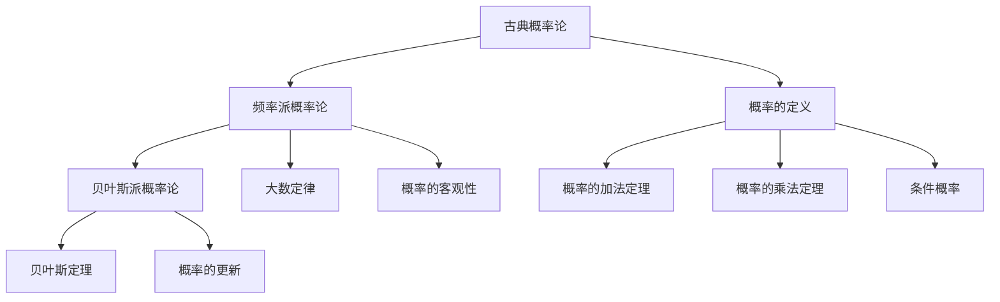

                 

### 概述

《从频率派到贝叶斯派：概率论在世界理解中的应用演变》是一本旨在深入探讨概率论在各个领域应用的书。书中将概率论的发展历程分为两大派别：频率派和贝叶斯派，通过系统分析这两大派别的理论基础、应用场景及其优缺点，展示了概率论在不同领域中的演变和应用。频率派概率论基于重复实验的频率来定义概率，以其在统计学和决策理论中的广泛应用而著称。贝叶斯派概率论则基于贝叶斯定理，通过概率的更新来处理不确定性，其在人工智能和机器学习中的应用正日益受到关注。

本文的主要目的是通过一步步的逻辑推理，揭示概率论这两大派别之间的内在联系和区别，以及它们在不同领域中的具体应用。文章首先回顾了概率论的历史背景，从古典概率论谈到频率派的兴起，然后深入探讨贝叶斯派概率论的基本原理。接下来，文章分别介绍了概率论在物理科学、社会科学以及未来发展趋势中的应用。通过这些分析，我们希望能够提供一个全面、清晰的视角，帮助读者理解概率论在现代社会中的重要性。

关键词：概率论、频率派、贝叶斯派、贝叶斯定理、统计学、决策理论、人工智能、机器学习、量子计算、社会科学。

### 概率论的历史背景

概率论的历史可以追溯到古代，但它的系统化发展主要始于17世纪。概率论的起源与许多数学家、科学家的努力密切相关，特别是17世纪欧洲的几位重要数学家，如帕斯卡、费马、格雷戈里和惠更斯等。

#### 古典概率论

**17世纪的概率论发展**：

1. **帕斯卡和费马的骰子问题**：

    帕斯卡和费马的故事始于一个赌徒的问题。一位赌徒询问在连续投掷两个骰子的情况下，出现至少一次“双六”的概率是多少。这个问题在当时没有标准答案，帕斯卡和费马通过书信交流，首次提出了概率的数学概念。

2. **惠更斯的《概率论》**：

    1657年，荷兰数学家克里斯蒂安·惠更斯发表了《概率论》，这是第一部系统研究概率论的数学著作。书中提出了概率的基本定义和性质，如等可能性原理和概率的加法定理。

**基本概念**：

- **概率的定义**：古典概率论基于等可能性原理，认为事件发生的概率是“有利结果数”与“所有可能结果数”的比值。
- **概率的性质**：概率值介于0和1之间，且所有可能结果的概率和为1。

#### 频率派概率论的兴起

**19世纪的概率论发展**：

1. **拉普拉斯的贡献**：

    19世纪初，法国数学家皮埃尔-西蒙·拉普拉斯对概率论进行了系统化和理论化。他提出了拉普拉斯定律，即如果事件发生的频率在大量重复实验中趋近于某个固定值，那么这个值就可以作为该事件概率的估计。拉普拉斯的工作奠定了频率派概率论的基础。

2. **频率派概率论的定义**：

    频率派概率论认为，概率是一个客观存在的量，它通过大量重复实验的频率来定义。具体来说，一个事件发生的概率是它在无穷多次重复实验中出现的频率。

**基本观点**：

- **概率的客观性**：频率派认为概率是客观存在的，不依赖于观察者的主观判断。
- **大量实验的频率**：频率派强调通过大量实验来估计概率，认为这是获得可靠概率估计的唯一方法。

#### 频率派概率论的应用

**统计学和决策理论中的应用**：

1. **统计学**：

    频率派概率论在统计学中有着广泛的应用。例如，通过大量重复实验来估计总体的参数，如均值、方差等。统计学中的假设检验和置信区间等方法都是基于频率派概率论的。

2. **决策理论**：

    在决策理论中，频率派概率论用于评估决策的风险和不确定性。例如，通过概率来计算一个决策带来的收益或损失，从而帮助决策者做出更明智的选择。

#### 频率派的局限

**统计误差和决策偏见**：

1. **统计误差**：

    虽然频率派概率论通过大量实验来估计概率，但这并不意味着统计误差会消失。实际上，统计误差是不可避免的，特别是在样本量较小的情况下。

2. **决策偏见**：

    频率派概率论在处理不确定性时，往往依赖于概率的客观性。然而，在现实世界中，我们往往无法准确知道所有可能的结果及其概率。这可能导致决策者产生偏见，从而影响决策的质量。

#### 频率派概率论的未来发展

**面临的挑战与机遇**：

1. **挑战**：

    频率派概率论在处理复杂系统和不确定性时面临挑战。例如，在人工智能和机器学习领域，我们需要处理的数据量和复杂性远远超出了传统统计方法的处理能力。

2. **机遇**：

    随着计算技术的发展，频率派概率论在处理大规模数据和高维数据方面有了新的机遇。同时，贝叶斯派概率论的发展也为频率派概率论提供了一种新的思路和工具。

### 总结

概率论的历史背景是一个不断发展和演化的过程。从古典概率论的初步探讨，到频率派概率论的兴起，再到现代贝叶斯派概率论的蓬勃发展，概率论在不同时期和领域中展现出了其独特的价值和魅力。通过对概率论的历史背景进行回顾，我们可以更好地理解其发展脉络，也为后续内容的探讨奠定了基础。

### 第1章：概率论的基本概念与原理

#### 古典概率论的基本概念

古典概率论起源于17世纪的欧洲，其基本概念包括概率的加法定理、乘法定理以及条件概率等。

1. **概率的加法定理**：

   假设我们有两个事件A和B，且它们不是互斥的（即A和B可以同时发生）。那么，这两个事件至少发生一个的概率可以通过以下公式计算：

   $$
   P(A \cup B) = P(A) + P(B) - P(A \cap B)
   $$

   其中，$P(A \cup B)$ 表示事件A或B发生的概率，$P(A)$ 和 $P(B)$ 分别表示事件A和事件B发生的概率，$P(A \cap B)$ 表示事件A和事件B同时发生的概率。

2. **概率的乘法定理**：

   如果两个事件A和B是独立的，那么它们同时发生的概率可以通过以下公式计算：

   $$
   P(A \cap B) = P(A) \times P(B)
   $$

   独立事件的定义是，一个事件的发生不影响另一个事件的发生概率。

3. **条件概率**：

   条件概率是指在一个事件已经发生的条件下，另一个事件发生的概率。条件概率可以通过以下公式计算：

   $$
   P(B|A) = \frac{P(A \cap B)}{P(A)}
   $$

   其中，$P(B|A)$ 表示在事件A发生的条件下事件B发生的概率。

#### 频率派概率论的核心原理

频率派概率论认为，概率是通过大量重复实验的频率来估计的。其核心原理可以概括为以下几点：

1. **频率解释**：

   频率派认为，概率是事件在无穷多次重复实验中出现的频率。例如，掷一枚公平的硬币，出现正面的概率是0.5，因为如果进行无穷多次掷硬币的实验，出现正面的频率将趋近于0.5。

2. **大数定律**：

   大数定律是频率派概率论的重要基石。它表明，当实验次数足够大时，事件发生的频率将趋近于其概率。具体来说，设随机变量X1, X2, ..., Xn是独立同分布的随机变量，那么当n趋近于无穷大时，样本均值$\overline{X}_n$趋近于期望值$E(X)$。

   $$
   \lim_{{n \to \infty}} \frac{1}{n} \sum_{{i=1}}^{n} X_i = E(X)
   $$

3. **概率的客观性**：

   频率派认为概率是一个客观存在的量，它不依赖于观察者的主观判断。例如，掷一枚公平的硬币，出现正面和反面的概率是客观的，不受个体主观意愿的影响。

#### 贝叶斯派概率论的基本原理

贝叶斯派概率论基于贝叶斯定理，其核心原理是概率的更新。贝叶斯定理提供了在已知某些条件下，更新事件概率的方法。

1. **贝叶斯定理**：

   贝叶斯定理的公式为：

   $$
   P(A|B) = \frac{P(B|A)P(A)}{P(B)}
   $$

   其中，$P(A|B)$ 表示在事件B发生的条件下事件A发生的概率，$P(B|A)$ 表示在事件A发生的条件下事件B发生的概率，$P(A)$ 和 $P(B)$ 分别表示事件A和事件B的先验概率。

2. **贝叶斯派概率论的观点**：

   贝叶斯派认为，概率是表示不确定性的量。在处理不确定性时，贝叶斯派使用概率的更新来不断调整和修正我们对事件发生的信念。

3. **贝叶斯网络**：

   贝叶斯网络是一种基于贝叶斯定理的概率图模型，用于表示变量之间的条件依赖关系。它通过有向图来表示变量之间的因果关系，并通过概率表来表示每个变量的条件概率。

#### 三大派别的联系与区别

1. **联系**：

   - 古典概率论、频率派概率论和贝叶斯派概率论都是概率论的重要组成部分，它们在概率的定义和计算方法上有着内在的联系。
   - 三大派别都关注概率的客观性和不确定性，但在处理方法上有所不同。

2. **区别**：

   - **古典概率论**：基于等可能性原理，适用于有限样本空间，主要关注单个事件的概率。
   - **频率派概率论**：通过大量实验的频率来估计概率，适用于大样本情况，强调概率的客观性。
   - **贝叶斯派概率论**：基于贝叶斯定理，通过概率的更新来处理不确定性，适用于复杂系统和高维数据。

#### 核心概念之间的Mermaid流程图

### 总结

通过对古典概率论、频率派概率论和贝叶斯派概率论的基本概念和原理的探讨，我们可以看到三大派别在概率的定义和计算方法上各有特点。古典概率论适用于有限样本空间，频率派概率论适用于大样本情况，而贝叶斯派概率论则通过概率的更新来处理复杂系统和高维数据。这些概念之间的内在联系和区别为我们理解和应用概率论提供了重要的理论基础。

### 频率派概率论在统计学中的应用

频率派概率论在统计学中扮演了至关重要的角色，其核心在于通过大量重复实验来估计总体的参数，从而对数据进行有效分析和预测。以下将详细介绍频率派概率论在统计学中的主要应用，包括假设检验、置信区间估计和回归分析。

#### 假设检验

假设检验是统计学中最常用的方法之一，用于判断样本数据是否支持某个假设。频率派概率论在假设检验中起到了关键作用，通过计算样本数据与假设之间的概率差异，来判断假设的真伪。

1. **零假设和备择假设**：

   在假设检验中，我们通常有两个假设：零假设（H0）和备择假设（H1）。零假设通常表示某个参数等于某个特定值，而备择假设则表示该参数不等于、大于或小于该特定值。

2. **p值**：

   p值是指在零假设成立的条件下，观察到样本数据或更极端数据的概率。如果p值很小（通常小于某个预定义的显著性水平α，如0.05），则我们拒绝零假设，认为备择假设更可能成立。

3. **显著性水平**：

   显著性水平α是我们在假设检验中事先设定的一个阈值，用于判断p值是否足够小。如果p值小于α，则我们认为结果具有统计显著性。

4. **举例**：

   假设我们想检验某个药物的疗效，零假设是“该药物对疾病没有任何疗效”，备择假设是“该药物对疾病有显著疗效”。通过收集样本数据，我们可以计算p值。如果p值小于0.05，我们拒绝零假设，认为该药物确实有显著疗效。

#### 置信区间估计

置信区间估计是统计学中另一个重要的方法，用于估计总体的参数范围。频率派概率论通过大量重复实验的频率，来计算总体参数的可能范围。

1. **置信水平**：

   置信区间估计包括两个部分：置信水平和置信区间。置信水平表示在重复实验中，置信区间包含总体参数的概率。常见的置信水平有95%、99%等。

2. **置信区间的计算**：

   假设我们想估计总体的均值μ，通过收集样本数据，我们可以计算样本均值$\bar{X}$ 和样本标准差$s$。根据样本数据，我们可以计算一个置信区间，例如：

   $$
   \bar{X} \pm z_{\alpha/2} \frac{s}{\sqrt{n}}
   $$

   其中，$z_{\alpha/2}$ 是标准正态分布的临界值，$n$ 是样本大小。

3. **举例**：

   假设我们想估计某个城市的人口均值，通过收集100个样本数据，我们可以计算样本均值和样本标准差。根据这些数据，我们可以计算出95%置信区间，例如：

   $$
   \bar{X} \pm 1.96 \frac{s}{\sqrt{100}}
   $$

   这个置信区间表示，在95%的置信水平下，该城市的人口均值可能落在这个区间内。

#### 回归分析

回归分析是统计学中用于研究变量之间关系的方法，频率派概率论在回归分析中用于估计回归模型中的参数。

1. **线性回归**：

   线性回归是最常见的回归模型之一，用于研究两个或多个变量之间的线性关系。线性回归模型可以表示为：

   $$
   Y = \beta_0 + \beta_1 X + \epsilon
   $$

   其中，$Y$ 是因变量，$X$ 是自变量，$\beta_0$ 和 $\beta_1$ 是回归系数，$\epsilon$ 是误差项。

2. **最小二乘法**：

   最小二乘法是用于估计线性回归模型参数的一种方法。它通过最小化残差平方和来估计回归系数。

3. **举例**：

   假设我们想研究某地区房价（因变量Y）与面积（自变量X）之间的关系，通过收集样本数据，我们可以建立线性回归模型。然后，通过最小二乘法估计回归系数，从而预测新样本的房价。

#### 频率派概率论在统计学中的优点和局限

1. **优点**：

   - **客观性**：频率派概率论通过大量实验的频率来估计概率，具有客观性。
   - **广泛适用性**：频率派概率论在假设检验、置信区间估计和回归分析等方面都有广泛的应用。
   - **强大的统计工具**：频率派概率论提供了丰富的统计工具和方法，如t检验、方差分析等。

2. **局限**：

   - **统计误差**：频率派概率论在处理小样本数据时可能存在较大的统计误差。
   - **决策偏见**：频率派概率论在处理不确定性时，可能会产生决策偏见。
   - **复杂系统挑战**：随着数据量和复杂度的增加，频率派概率论的适用性受到挑战。

### 总结

频率派概率论在统计学中有着广泛的应用，包括假设检验、置信区间估计和回归分析等。这些方法通过大量实验的频率来估计总体的参数，提供了有效的数据分析工具。然而，频率派概率论也存在一些局限，如统计误差和决策偏见。这些挑战促使我们探索其他概率论派别，如贝叶斯派概率论，以应对复杂系统和不确定性。

### 频率派概率论在决策理论中的应用

频率派概率论在决策理论中具有广泛的应用，它通过概率估计和风险分析帮助决策者在不确定性环境中做出最优决策。以下将详细介绍频率派概率论在决策理论中的主要应用，包括期望效用理论、概率权重和风险决策。

#### 期望效用理论

期望效用理论是决策理论中的核心概念，它将概率和效用相结合，用于评估决策者的期望效用。频率派概率论在期望效用理论中起到了关键作用。

1. **期望效用**：

   期望效用是指决策者在不同情况下可能获得的效用值乘以其概率的总和。公式如下：

   $$
   EU = \sum_{i} u(x_i) p(x_i)
   $$

   其中，$u(x_i)$ 是决策者在情况$i$下的效用值，$p(x_i)$ 是情况$i$发生的概率。

2. **概率权重**：

   频率派概率论认为，概率是客观存在的，因此在期望效用理论中，概率权重是根据频率派概率论的估计得出的。例如，在掷骰子的决策中，每个面的概率都是1/6，因此每个面的权重也是1/6。

3. **举例**：

   假设决策者面临两个选择：选择A带来1000元的收益，选择B带来2000元的收益，但选择B的风险更高，有50%的概率获得2000元，50%的概率损失1000元。根据期望效用理论，我们可以计算两个选择的期望效用：

   - 选择A的期望效用：$1000 \times 1 = 1000$
   - 选择B的期望效用：$2000 \times 0.5 - 1000 \times 0.5 = 500$

   因此，决策者应该选择选择A，因为它的期望效用更高。

#### 概率权重

概率权重是指决策者对不同结果给予的重视程度，这通常取决于结果的概率。频率派概率论在概率权重中起到了基础作用。

1. **权重计算**：

   概率权重可以通过频率派概率论的估计得出，例如，如果一个事件发生的概率是0.8，那么这个事件的权重就是0.8。

2. **举例**：

   假设决策者需要决定是否购买一份保险，保险能够以0.8的概率防止损失1000元。根据概率权重，我们可以计算保险的期望效用：

   $$
   EU = 0.8 \times (-1000) + 0.2 \times 0 = -800
   $$

   因此，决策者应该购买这份保险，因为它的期望效用为负，表明购买保险能够带来净收益。

#### 风险决策

风险决策是指决策者在不确定条件下做出的决策，频率派概率论在风险决策中用于估计风险和计算期望效用。

1. **风险估计**：

   风险决策中的风险通常通过频率派概率论的估计得出，例如，一个项目的成功概率是0.7，失败概率是0.3。

2. **风险分析**：

   在风险决策中，决策者需要分析不同结果的可能性和影响，例如，通过计算期望效用来评估风险。例如，一个投资项目的期望效用为：

   $$
   EU = 0.7 \times 2000 + 0.3 \times (-1000) = 1300
   $$

   这表明该投资项目的期望效用为1300元。

3. **举例**：

   假设决策者面临两个投资选择：项目A的成功概率是0.6，失败概率是0.4；项目B的成功概率是0.8，失败概率是0.2。我们可以计算两个项目的期望效用：

   - 项目A的期望效用：$0.6 \times 1500 + 0.4 \times (-500) = 600$
   - 项目B的期望效用：$0.8 \times 2000 + 0.2 \times (-1000) = 1600$

   因此，决策者应该选择项目B，因为它的期望效用更高。

#### 频率派概率论在决策理论中的优点和局限

1. **优点**：

   - **客观性**：频率派概率论基于大量实验的频率，具有客观性，能够提供可靠的概率估计。
   - **广泛适用性**：频率派概率论在期望效用理论、概率权重和风险决策中都有广泛应用。
   - **丰富的工具和方法**：频率派概率论提供了丰富的工具和方法，如期望效用理论、概率权重和风险分析。

2. **局限**：

   - **统计误差**：频率派概率论在处理小样本数据时可能存在较大的统计误差。
   - **决策偏见**：频率派概率论在处理不确定性时，可能会产生决策偏见，影响决策质量。

### 总结

频率派概率论在决策理论中具有广泛的应用，通过概率估计和风险分析帮助决策者在不确定性环境中做出最优决策。期望效用理论、概率权重和风险决策是频率派概率论在决策理论中的重要应用。尽管存在一些局限，频率派概率论仍然是决策理论中不可或缺的工具。

### 贝叶斯派概率论的基本原理

贝叶斯派概率论是基于贝叶斯定理的一种概率理论，它在处理不确定性和概率更新方面具有独特的优势。贝叶斯派概率论认为概率是表示不确定性的量，并通过贝叶斯定理不断更新我们对事件发生的信念。以下将详细介绍贝叶斯派概率论的基本原理，包括贝叶斯定理的公式、证明和贝叶斯网络。

#### 贝叶斯定理

贝叶斯定理是贝叶斯派概率论的核心公式，它提供了在已知某些条件下，更新事件概率的方法。贝叶斯定理的公式如下：

$$
P(A|B) = \frac{P(B|A)P(A)}{P(B)}
$$

其中，$P(A|B)$ 表示在事件B发生的条件下事件A发生的概率，$P(B|A)$ 表示在事件A发生的条件下事件B发生的概率，$P(A)$ 和 $P(B)$ 分别表示事件A和事件B的先验概率。

#### 贝叶斯定理的证明

贝叶斯定理可以通过条件概率的乘法规则和全概率公式来证明。以下是贝叶斯定理的证明：

1. **条件概率的乘法规则**：

   $$
   P(A \cap B) = P(A|B)P(B)
   $$

   $$
   P(A \cap B) = P(B|A)P(A)
   $$

2. **全概率公式**：

   $$
   P(B) = \sum_{i} P(B|A_i)P(A_i)
   $$

   其中，$A_1, A_2, ..., A_n$ 是一组互斥且完备事件。

3. **证明过程**：

   根据条件概率的乘法规则，我们有：

   $$
   P(A|B) = \frac{P(A \cap B)}{P(B)}
   $$

   将全概率公式代入上式，得到：

   $$
   P(A|B) = \frac{P(B|A)P(A)}{P(B)}
   $$

   $$
   P(A|B) = \frac{P(B|A)P(A)}{\sum_{i} P(B|A_i)P(A_i)}
   $$

   这就是贝叶斯定理的公式。

#### 贝叶斯派概率论的基本观点

贝叶斯派概率论认为概率是表示不确定性的量，通过贝叶斯定理不断更新我们对事件发生的信念。贝叶斯派概率论的基本观点可以概括为以下几点：

1. **概率表示不确定性**：

   贝叶斯派认为概率是描述不确定性的工具，而不是客观存在的量。例如，在抛硬币的情况下，正面朝上的概率是0.5，这表示我们不确定硬币正面朝上还是反面朝上。

2. **先验概率和后验概率**：

   贝叶斯派概率论将概率分为先验概率和后验概率。先验概率是基于我们已有的知识或经验，而后验概率是在获得新信息后更新得到的概率。

3. **概率的更新**：

   贝叶斯派概率论通过贝叶斯定理不断更新我们对事件发生的信念。例如，在抛硬币的情况下，如果我们观察到连续五次都是正面朝上，我们可以通过贝叶斯定理更新我们对下次抛硬币正面朝上的概率。

#### 贝叶斯网络

贝叶斯网络是一种基于贝叶斯定理的概率图模型，用于表示变量之间的条件依赖关系。贝叶斯网络通过有向图来表示变量之间的因果关系，并通过条件概率表来表示每个变量的条件概率。

1. **贝叶斯网络的基本概念**：

   - **节点**：贝叶斯网络中的节点表示随机变量，每个节点对应一个随机变量。
   - **边**：贝叶斯网络中的边表示变量之间的依赖关系，有向边的方向表示因果关系。

2. **条件概率表**：

   在贝叶斯网络中，每个节点都有条件概率表，用于表示该节点在给定其父节点的条件下各个可能取值的概率。例如，对于一个具有三个父节点的节点A，其条件概率表如下：

   $$
   P(A|B, C, D) = 
   \begin{cases} 
   p_1, & \text{if } (B, C, D) = (b_1, c_1, d_1) \\
   p_2, & \text{if } (B, C, D) = (b_1, c_1, d_2) \\
   p_3, & \text{if } (B, C, D) = (b_1, c_2, d_1) \\
   p_4, & \text{if } (B, C, D) = (b_1, c_2, d_2) \\
   p_5, & \text{if } (B, C, D) = (b_2, c_1, d_1) \\
   p_6, & \text{if } (B, C, D) = (b_2, c_1, d_2) \\
   p_7, & \text{if } (B, C, D) = (b_2, c_2, d_1) \\
   p_8, & \text{if } (B, C, D) = (b_2, c_2, d_2) \\
   \end{cases}
   $$

3. **贝叶斯网络的推理**：

   贝叶斯网络可以用于推理和预测。通过已知的变量值和条件概率表，我们可以计算出其他未知变量的概率分布。例如，如果我们知道节点B和C的值，我们可以通过贝叶斯网络计算出节点A的概率分布。

#### 贝叶斯派概率论在人工智能中的应用

贝叶斯派概率论在人工智能领域有着广泛的应用，特别是在机器学习和数据挖掘中。以下将简要介绍贝叶斯派概率论在人工智能中的应用：

1. **贝叶斯分类器**：

   贝叶斯分类器是一种基于贝叶斯定理的分类算法，用于将数据分为不同的类别。贝叶斯分类器通过计算每个类别的概率，并选择概率最大的类别作为预测结果。

2. **贝叶斯网络学习**：

   贝叶斯网络学习是一种从数据中学习变量之间依赖关系的方法。通过最大似然估计或贝叶斯估计，我们可以学习出贝叶斯网络的参数，从而建立模型进行推理和预测。

3. **贝叶斯优化**：

   贝叶斯优化是一种用于超参数调优的方法，通过利用贝叶斯定理和先验知识来搜索最优超参数。贝叶斯优化在机器学习模型调优中有着广泛的应用。

#### 贝叶斯派概率论的优势和挑战

1. **优势**：

   - **处理不确定性**：贝叶斯派概率论通过概率的更新来处理不确定性，能够适应动态变化的环境。
   - **灵活性**：贝叶斯派概率论在模型构建和推理过程中具有很高的灵活性，能够处理复杂的因果关系。
   - **强大的工具和方法**：贝叶斯派概率论提供了丰富的工具和方法，如贝叶斯网络、贝叶斯分类器和贝叶斯优化等。

2. **挑战**：

   - **计算复杂度**：贝叶斯派概率论在处理大规模数据时可能存在较高的计算复杂度。
   - **先验知识的要求**：贝叶斯派概率论需要先验知识来初始化模型，这对一些领域来说可能是一个挑战。
   - **实现难度**：贝叶斯派概率论的实现通常比其他概率论派别更复杂，需要较高的编程技巧和数学知识。

### 总结

贝叶斯派概率论是一种基于贝叶斯定理的概率理论，通过概率的更新来处理不确定性。贝叶斯定理、贝叶斯网络和贝叶斯派概率论的基本观点是贝叶斯派概率论的核心。贝叶斯派概率论在人工智能、机器学习和数据挖掘等领域有着广泛的应用。尽管存在一些挑战，贝叶斯派概率论仍然是一种强大且灵活的概率理论工具。

### 贝叶斯派概率论在统计学中的应用

贝叶斯派概率论在统计学中有着独特的应用，它通过贝叶斯定理和贝叶斯估计提供了一种处理不确定性和复杂系统的新方法。以下将详细介绍贝叶斯派概率论在统计学中的应用，包括贝叶斯估计、贝叶斯假设检验和贝叶斯回归分析。

#### 贝叶斯估计

贝叶斯估计是贝叶斯派概率论在统计学中的一个重要应用，它通过贝叶斯定理来估计总体参数。贝叶斯估计不仅提供了参数的估计值，还提供了参数的置信区间。

1. **贝叶斯估计的概念**：

   贝叶斯估计是一种基于先验概率和观测数据来估计总体参数的方法。它通过贝叶斯定理将先验概率与观测数据结合起来，得到后验概率，进而估计参数。

2. **贝叶斯估计的步骤**：

   - **定义先验概率**：先验概率是基于我们已有的知识和经验对参数的初始估计。
   - **收集观测数据**：通过实验或观测收集数据。
   - **计算后验概率**：利用贝叶斯定理计算后验概率，即参数在给定观测数据的条件下出现的概率。
   - **估计参数**：根据后验概率估计总体参数。

3. **贝叶斯估计的公式**：

   $$
   P(\theta|X) = \frac{P(X|\theta)P(\theta)}{P(X)}
   $$

   其中，$P(\theta|X)$ 是后验概率，$P(X|\theta)$ 是似然函数，$P(\theta)$ 是先验概率，$P(X)$ 是证据。

4. **举例**：

   假设我们想估计一个正态分布的均值$\mu$，已知先验概率为$\mu \sim N(\mu_0, \sigma_0^2)$，观测数据为$X_1, X_2, ..., X_n$，则后验概率为：

   $$
   \mu|X \sim N\left(\frac{n\mu_0 + \sum_{i=1}^{n}X_i}{n+\sigma_0^2}, \frac{\sigma_0^2}{n+\sigma_0^2}\right)
   $$

#### 贝叶斯假设检验

贝叶斯假设检验是贝叶斯派概率论在统计学中的另一个重要应用，它通过计算先验概率和后验概率来检验假设的真伪。

1. **贝叶斯假设检验的概念**：

   贝叶斯假设检验是在给定数据的情况下，通过比较零假设和备择假设的后验概率，来决定是否拒绝零假设。

2. **贝叶斯假设检验的步骤**：

   - **定义假设**：定义零假设$H_0$和备择假设$H_1$。
   - **计算先验概率**：根据已有的知识和经验计算零假设和备择假设的先验概率。
   - **计算似然函数**：计算观测数据在零假设和备择假设下的似然函数。
   - **计算后验概率**：利用贝叶斯定理计算零假设和备择假设的后验概率。
   - **比较后验概率**：根据后验概率比较零假设和备择假设，决定是否拒绝零假设。

3. **贝叶斯假设检验的公式**：

   $$
   P(H_0|X) = \frac{P(X|H_0)P(H_0)}{P(X)}
   $$

   $$
   P(H_1|X) = \frac{P(X|H_1)P(H_1)}{P(X)}
   $$

   其中，$P(H_0|X)$ 和 $P(H_1|X)$ 分别表示零假设和备择假设在给定观测数据X下的后验概率。

4. **举例**：

   假设我们想检验一个正态分布的均值是否等于某个特定值$\mu_0$，零假设$H_0: \mu = \mu_0$，备择假设$H_1: \mu \neq \mu_0$。通过收集观测数据，我们可以计算似然函数和先验概率，然后利用贝叶斯定理计算后验概率。如果后验概率$P(H_1|X)$显著大于$P(H_0|X)$，则我们拒绝零假设。

#### 贝叶斯回归分析

贝叶斯回归分析是贝叶斯派概率论在统计学习中的应用，它通过贝叶斯定理来估计回归模型中的参数。

1. **贝叶斯回归分析的概念**：

   贝叶斯回归分析是一种通过贝叶斯定理来估计线性回归模型参数的方法，它结合了先验概率和观测数据来估计模型参数。

2. **贝叶斯回归分析的步骤**：

   - **定义先验概率**：为模型参数定义先验概率，通常假设参数服从正态分布。
   - **收集观测数据**：通过实验或观测收集数据。
   - **计算似然函数**：计算观测数据在模型参数下的似然函数。
   - **计算后验概率**：利用贝叶斯定理计算参数的后验概率。
   - **估计参数**：根据后验概率估计模型参数。

3. **贝叶斯回归分析的公式**：

   $$
   P(\theta|X) = \frac{P(X|\theta)P(\theta)}{P(X)}
   $$

   其中，$\theta$ 表示模型参数，$X$ 表示观测数据。

4. **举例**：

   假设我们有一个线性回归模型$y = \beta_0 + \beta_1x + \epsilon$，其中$\beta_0$和$\beta_1$是模型参数，$\epsilon$是误差项。我们可以为$\beta_0$和$\beta_1$定义先验概率，然后通过观测数据计算似然函数和后验概率。最终，根据后验概率估计模型参数。

#### 贝叶斯派概率论在统计学中的优势

1. **处理不确定性**：

   贝叶斯派概率论通过概率的更新来处理不确定性，能够适应动态变化的环境。

2. **提供参数的置信区间**：

   贝叶斯派概率论不仅提供参数的估计值，还提供参数的置信区间，使得统计推断更加全面。

3. **灵活的模型选择**：

   贝叶斯派概率论允许我们在模型选择过程中引入先验知识，使得模型更加灵活和适应特定领域。

#### 总结

贝叶斯派概率论在统计学中有着广泛的应用，包括贝叶斯估计、贝叶斯假设检验和贝叶斯回归分析。通过贝叶斯定理和贝叶斯估计，贝叶斯派概率论提供了一种处理不确定性和复杂系统的新方法。贝叶斯派概率论的优势在于其处理不确定性的能力、提供参数的置信区间以及灵活的模型选择，这使得它在统计学中具有独特的价值和重要性。

### 贝叶斯派概率论在人工智能中的应用

贝叶斯派概率论在人工智能领域有着广泛的应用，特别是在机器学习和数据挖掘中。其通过贝叶斯网络、贝叶斯分类器和贝叶斯优化等方法，为复杂系统的建模和预测提供了强有力的工具。以下将详细介绍贝叶斯派概率论在人工智能中的主要应用，包括贝叶斯网络、贝叶斯分类器和贝叶斯优化。

#### 贝叶斯网络

贝叶斯网络是一种基于贝叶斯定理的概率图模型，用于表示变量之间的条件依赖关系。它通过有向图和条件概率表来描述变量之间的概率关系，能够有效地处理不确定性。

1. **贝叶斯网络的基本概念**：

   - **节点**：贝叶斯网络中的节点表示随机变量，每个节点对应一个随机变量。
   - **边**：贝叶斯网络中的边表示变量之间的依赖关系，有向边的方向表示因果关系。

2. **贝叶斯网络的构建**：

   - **依赖关系**：首先确定变量之间的依赖关系，这可以通过专家知识或数据驱动方法得到。
   - **条件概率表**：为每个节点定义条件概率表，表示该节点在给定其父节点的条件下各个可能取值的概率。

3. **贝叶斯网络的推理**：

   - **概率推断**：通过已知的变量值和条件概率表，计算其他未知变量的概率分布。
   - **预测**：利用贝叶斯网络进行预测，例如，给定某些变量的值，预测其他变量的概率分布。

4. **举例**：

   假设我们有一个医疗诊断系统，节点包括“症状1”、“症状2”和“疾病”。通过专家知识或数据，我们可以构建贝叶斯网络，为每个节点定义条件概率表。然后，通过已知的症状值，我们可以计算出疾病发生的概率，从而进行诊断。

#### 贝叶斯分类器

贝叶斯分类器是一种基于贝叶斯定理的分类算法，用于将数据分为不同的类别。它通过计算每个类别的概率，并选择概率最大的类别作为预测结果。

1. **贝叶斯分类器的基本概念**：

   - **特征**：特征是用于分类的数据属性。
   - **类别**：类别是数据可能的分类结果。

2. **贝叶斯分类器的工作原理**：

   - **计算概率**：对于每个类别，计算特征的概率分布。
   - **选择类别**：对于新样本，计算每个类别的概率，并选择概率最大的类别作为预测结果。

3. **贝叶斯分类器的优势**：

   - **简单且有效**：贝叶斯分类器是一种简单且有效的分类算法，适用于高维数据和稀疏数据。
   - **解释性强**：贝叶斯分类器能够提供类别的概率解释，有助于理解分类过程。

4. **举例**：

   假设我们有一个垃圾邮件分类系统，特征包括邮件的主题、正文和发件人。我们可以使用贝叶斯分类器来分类邮件。通过训练数据，我们计算出每个类别的概率分布，然后对于新邮件，我们计算其属于每个类别的概率，并选择概率最大的类别作为分类结果。

#### 贝叶斯优化

贝叶斯优化是一种基于贝叶斯派概率论的优化方法，用于搜索最优参数。它通过构建概率模型，不断更新对最优参数的估计，从而提高搜索效率。

1. **贝叶斯优化的基本概念**：

   - **目标函数**：目标函数是用于评估参数优劣的函数。
   - **概率模型**：概率模型用于表示参数与目标函数之间的关系。

2. **贝叶斯优化的步骤**：

   - **定义先验概率**：为参数定义先验概率，通常假设参数服从高斯分布。
   - **收集样本**：通过实验或搜索收集样本数据。
   - **更新概率模型**：利用贝叶斯定理更新概率模型，即参数在给定样本数据下的后验概率。
   - **搜索最优参数**：根据概率模型搜索最优参数。

3. **贝叶斯优化的优势**：

   - **高效搜索**：贝叶斯优化通过概率模型有效地搜索最优参数，避免了盲目搜索。
   - **自适应更新**：贝叶斯优化能够自适应地更新概率模型，提高搜索精度。

4. **举例**：

   假设我们有一个神经网络模型，需要优化其超参数。我们可以使用贝叶斯优化来搜索最优超参数。通过训练数据，我们收集样本并更新概率模型，然后根据概率模型搜索最优超参数。

#### 贝叶斯派概率论在人工智能中的挑战

尽管贝叶斯派概率论在人工智能中具有广泛应用，但也存在一些挑战：

1. **计算复杂度**：贝叶斯网络和贝叶斯优化的计算复杂度较高，特别是对于大规模数据和高维问题。
2. **先验知识的要求**：贝叶斯派概率论需要先验知识来初始化模型，这对一些领域来说可能是一个挑战。
3. **实现难度**：贝叶斯派概率论的实现通常比其他概率论派别更复杂，需要较高的编程技巧和数学知识。

#### 总结

贝叶斯派概率论在人工智能中有着广泛的应用，包括贝叶斯网络、贝叶斯分类器和贝叶斯优化等。通过贝叶斯定理和贝叶斯估计，贝叶斯派概率论为复杂系统的建模和预测提供了强有力的工具。尽管存在一些挑战，贝叶斯派概率论仍然是人工智能领域不可或缺的概率理论工具。

### 概率论在物理科学中的应用

概率论在物理科学中的应用是深入而广泛的，特别是在量子力学、统计物理和化学领域，概率论为理解和解释自然现象提供了强大的工具。以下将详细探讨概率论在物理科学中的应用。

#### 量子力学中的概率论

量子力学是研究微观世界的基本理论，其中概率论起到了核心作用。量子力学中的概率论主要体现在对量子态和测量结果的描述上。

1. **量子态的描述**：

   在量子力学中，系统的状态由波函数$\psi$描述。波函数是一个复数函数，满足归一化条件$\int |\psi(x)|^2 dx = 1$，其中$x$是空间坐标。波函数的模平方$|\psi(x)|^2$表示在位置$x$找到粒子的概率密度。

2. **测量结果的概率**：

   根据哥本哈根解释，当进行量子测量时，测量结果并不是确定的，而是具有概率分布。具体来说，如果系统的波函数为$\psi = \sum_{i} c_i \psi_i$，其中$c_i$是复数系数，$\psi_i$是基态的波函数，那么在测量中找到粒子处于状态$\psi_i$的概率为$|c_i|^2$。

3. **举例**：

   假设一个电子在量子态$\psi = \frac{1}{\sqrt{2}}(\psi_1 + \psi_2)$，其中$\psi_1$和$\psi_2$是两个不同的能级。那么，测量电子处于$\psi_1$的概率为$\left|\frac{1}{\sqrt{2}}\right|^2 = \frac{1}{2}$，处于$\psi_2$的概率也为$\frac{1}{2}$。

#### 统计物理中的概率论

统计物理是研究大量粒子集合行为的热力学分支，其中概率论被用于描述粒子的统计分布和系统的宏观性质。

1. **麦克斯韦-玻尔兹曼分布**：

   麦克斯韦-玻尔兹曼分布是描述经典粒子在热平衡状态下的能量分布的统计分布。其概率分布函数为：

   $$
   P(E) = \frac{1}{Z} e^{-\beta E}
   $$

   其中，$E$是粒子的能量，$\beta = \frac{1}{k_B T}$，$k_B$是玻尔兹曼常数，$T$是温度，$Z$是配分函数。

2. **费米-狄拉克分布**：

   费米-狄拉克分布是描述费米子（如电子）在量子统计下的能量分布。其概率分布函数为：

   $$
   P(E) = \frac{1}{e^{\beta (E - \mu)} + 1}
   $$

   其中，$\mu$是化学势。

3. **玻色-爱因斯坦分布**：

   玻色-爱因斯坦分布是描述玻色子（如光子）在量子统计下的能量分布。其概率分布函数为：

   $$
   P(E) = \frac{1}{e^{\beta (E - \mu)} - 1}
   $$

   这些分布函数用于计算系统的宏观性质，如熵、自由能和压强。

#### 概率论在化学中的应用

概率论在化学中用于描述分子的结构、反应路径和动力学行为。

1. **分子轨道理论**：

   分子轨道理论通过线性组合原子轨道来描述分子的电子结构。其核心思想是，分子的电子态可以通过原子轨道的线性组合来表示，这些组合态满足洪特规则和能级规则。

2. **反应动力学**：

   反应动力学研究化学反应的速率和机制。概率论中的碰撞理论认为，化学反应是通过分子之间的有效碰撞发生的，碰撞的频率和能量决定了反应的速率。

3. **蒙特卡罗方法**：

   蒙特卡罗方法是一种基于概率统计的数值计算方法，广泛应用于分子动力学模拟和化学反应路径的计算。通过模拟大量的随机过程，蒙特卡罗方法可以提供反应的宏观性质和微观机制。

#### 概率论在物理科学中的综合应用

概率论在物理科学中的应用不仅仅是单一理论工具的运用，它通常与其他物理理论和数学方法相结合，形成更加复杂的模型和计算方法。

1. **量子场论**：

   量子场论是研究基本粒子和量子场的理论，其中概率论用于描述粒子的产生和湮灭过程。通过路径积分方法，量子场论将概率论与量子力学完美结合，为理解基本粒子的行为提供了理论基础。

2. **统计物理和化学的交叉应用**：

   统计物理和化学的交叉应用产生了许多重要的理论，如玻尔兹曼方程、相变理论和统计力学中的各种分布函数。这些理论通过概率论描述了从微观到宏观的物理现象。

3. **计算机模拟**：

   计算机模拟是现代物理科学研究的重要手段，概率论在模拟过程中被广泛应用。通过模拟大量粒子的随机运动，我们可以预测系统的宏观行为，如材料的力学性质、流体动力学和化学反应的动态过程。

#### 总结

概率论在物理科学中的应用是深入而广泛的，它不仅为我们提供了描述自然现象的工具，还促进了物理学和化学理论的进步。在量子力学、统计物理和化学中，概率论的核心作用体现在对量子态的描述、统计分布的计算和反应路径的模拟。通过概率论，物理科学能够更好地理解和解释自然界的复杂现象。

### 概率论在社会科学中的应用

概率论在社会科学中的应用同样广泛且深远，尤其在经济学、心理学和其他社会科学领域中，概率论为研究人类行为、经济现象和认知过程提供了强有力的工具。以下将详细探讨概率论在经济学和心理学中的应用。

#### 概率论在经济学中的应用

概率论在经济学中的应用主要体现在对不确定性的建模和风险分析上。经济学中的许多理论和模型都依赖于概率论来分析和预测市场行为、投资决策和宏观经济波动。

1. **概率论在市场行为分析中的应用**：

   - **预期效用理论**：预期效用理论是经济学中的核心概念之一，它基于概率论，通过计算不同结果的期望效用来指导决策。例如，在投资决策中，投资者会根据不同投资方案的预期收益和风险来选择最优投资策略。
   - **概率分布模型**：在经济学中，概率分布模型用于描述市场变量（如股票价格、利率等）的概率分布。通过这些模型，经济学家可以分析市场波动、预测价格走势和评估投资风险。

2. **概率论在宏观经济分析中的应用**：

   - **时间序列分析**：时间序列模型是宏观经济分析的重要工具，这些模型通过概率论来分析经济变量的动态变化。例如，自回归移动平均模型（ARMA）和向量自回归模型（VAR）都是基于概率论的时间序列模型，用于预测经济趋势和周期性波动。
   - **概率分布函数**：在宏观经济分析中，概率分布函数用于描述经济变量的概率分布，例如，收入分布、消费分布等。这些概率分布函数可以帮助经济学家理解经济行为的分布特征，制定相关政策。

3. **概率论在风险管理中的应用**：

   - **风险度量**：概率论在风险管理中用于评估和度量风险。常见的风险度量方法包括方差、标准差、价值在风险（VaR）和条件价值在风险（CVaR）。这些度量方法基于概率论，能够量化投资组合或企业的风险水平。
   - **概率风险评估**：在风险管理中，概率论用于评估不同风险事件发生的概率和潜在损失。例如，通过蒙特卡罗模拟，可以评估一个投资组合在未来一段时间内的潜在损失分布，从而制定有效的风险控制策略。

#### 概率论在心理学中的应用

概率论在心理学中的应用主要体现在对认知过程和决策行为的建模上。心理学家通过概率论来分析人类如何处理不确定性、做出决策以及形成信念。

1. **概率论在认知建模中的应用**：

   - **贝叶斯认知模型**：贝叶斯认知模型是心理学中用于描述人类如何处理不确定性和更新信念的一种理论模型。通过贝叶斯定理，这些模型能够模拟人类在不同信息条件下如何更新其对某一事件的信念。
   - **概率推理**：概率论在心理学中用于研究人类如何进行概率推理。例如，心理学家通过实验发现，人们在处理概率问题时往往存在系统性偏差，这些偏差可以通过概率理论来解释和建模。

2. **概率论在决策分析中的应用**：

   - **期望效用理论**：期望效用理论在心理学中用于分析人类如何在不同决策情境下权衡风险和收益。通过计算不同选择的期望效用，人们可以在不确定条件下做出最优决策。
   - **概率权重**：概率论在心理学中用于研究人类如何赋予不同结果概率权重。例如，研究发现，人们在高风险情境下往往对潜在损失赋予更高的权重，这在决策分析中具有重要意义。

3. **概率论在社会心理学中的应用**：

   - **群体行为**：概率论在社会心理学中用于分析群体行为和传染现象。例如，通过概率模型，心理学家可以研究传染病的传播规律、群体心理的形成以及社会运动的发展。
   - **决策社会性**：概率论在社会心理学中用于研究人们在群体决策中的行为。例如，群体决策往往受到群体压力和共识的影响，概率论可以分析这些因素如何影响决策结果。

#### 概率论在其他社会科学中的应用

除了经济学和心理学，概率论在其他社会科学领域也有着广泛的应用。

1. **社会学**：

   - **社会网络分析**：概率论在社会网络分析中用于描述个体之间的相互作用关系。例如，通过概率模型，可以分析社会网络的稳定性、传播效应和影响力。
   - **群体行为**：概率论在社会学中用于研究群体行为和群体动态，例如，通过概率模型可以预测社会运动的发展趋势、群体决策的结果等。

2. **政治学**：

   - **选举模型**：概率论在政治学中用于分析选举结果和选民行为。例如，通过概率模型，可以预测选举结果、评估候选人的支持率等。
   - **政策分析**：概率论在政策分析中用于评估不同政策的潜在影响和风险，帮助决策者制定更加科学的政策。

#### 总结

概率论在社会科学中的应用是深入而广泛的，它为经济学、心理学和其他社会科学领域提供了强有力的工具。通过概率论，社会科学研究者能够更好地理解和预测人类行为、经济现象和认知过程。在经济学中，概率论用于分析市场行为、风险管理等；在心理学中，概率论用于建模认知过程、决策行为等。概率论在社会科学中的应用不仅丰富了理论体系，也为实际问题的解决提供了科学依据。

### 概率论的未来发展趋势

随着科技的进步和数据量的激增，概率论在各个领域中的应用日益广泛，其未来发展趋势也备受关注。以下将探讨概率论在未来人工智能、量子计算和生物科学等领域的发展趋势。

#### 概率论在人工智能中的应用

人工智能（AI）是当今科技领域的重要方向，而概率论在其中扮演着关键角色。在未来，概率论在人工智能中的应用将更加深入和广泛。

1. **概率模型与机器学习**：

   概率论是机器学习的基础，未来的机器学习算法将更加依赖于概率模型。贝叶斯网络、高斯过程和马尔可夫模型等概率模型将在深度学习和强化学习等任务中发挥重要作用。

2. **不确定性处理**：

   人工智能系统在处理不确定性时面临巨大挑战。概率论提供了处理不确定性的方法，如贝叶斯推理和概率分布。未来，概率论将在自动驾驶、机器人技术和医疗诊断等领域，为处理不确定性提供更加精确和可靠的方法。

3. **数据驱动的模型**：

   随着数据量的增长，概率模型将更加依赖于数据驱动的学习。通过大数据分析和概率模型，可以构建更加复杂和准确的模型，从而提高人工智能系统的性能和鲁棒性。

#### 概率论在量子计算中的应用

量子计算是未来计算技术的潜在革命性突破，而概率论在量子计算中同样具有重要地位。

1. **量子概率论**：

   量子概率论是基于量子力学的概率论，它描述了量子系统的概率行为。未来，量子概率论将帮助研究人员更好地理解和利用量子计算的优势，如量子并行计算和量子纠错。

2. **量子算法设计**：

   概率论在量子算法设计中扮演关键角色。量子算法通常涉及随机性和概率推理，如量子随机行走和量子蒙特卡罗方法。未来，这些概率方法将在量子优化、量子机器学习和量子密码学等领域得到广泛应用。

3. **量子模拟**：

   概率论在量子模拟中用于模拟量子系统的行为。通过概率模型，研究人员可以模拟复杂的量子现象，如量子纠缠、量子隧穿和量子相位转变。未来，这些模拟方法将在材料科学、量子化学和量子生物学等领域发挥重要作用。

#### 概率论在生物科学中的应用

生物科学是概率论另一个重要应用领域，未来在该领域的应用前景也十分广阔。

1. **生物统计与遗传学**：

   概率论在生物统计和遗传学中发挥着核心作用。未来，通过更先进的概率模型和算法，可以更准确地预测基因突变、疾病风险和进化过程。

2. **药物研发**：

   概率论在药物研发中用于评估药物的安全性和有效性。通过概率模型和模拟，研究人员可以预测药物的代谢路径、毒性反应和疗效，从而加速药物研发过程。

3. **系统生物学**：

   系统生物学研究生物系统的动态行为和调控机制，概率论在该领域具有重要应用。通过概率模型，研究人员可以描述生物网络中的随机过程，预测基因表达和蛋白质相互作用，从而揭示生物系统的功能和调控机制。

#### 概率论在其他新兴领域的应用

除了上述领域，概率论在区块链、机器学习和金融科技等新兴领域也具有广阔的应用前景。

1. **区块链技术**：

   区块链技术依赖于密码学和概率论。未来，概率论将帮助设计更加安全、可靠的区块链协议，提高区块链网络的可信度和透明度。

2. **金融科技**：

   概率论在金融科技中用于风险管理、资产定价和投资策略。通过概率模型，金融机构可以更好地预测市场波动、评估投资组合风险，从而制定更加科学的投资策略。

3. **大数据分析**：

   大数据分析依赖于概率论，用于处理大规模复杂数据。未来，概率模型和算法将更加高效地处理和分析大数据，为各行业提供更加精准的预测和决策支持。

### 总结

概率论的未来发展趋势体现在其在人工智能、量子计算、生物科学和其他新兴领域中的广泛应用。通过概率模型和算法的创新，概率论将继续推动科技和社会的发展，为解决复杂问题提供强有力的工具。在未来，概率论将继续在各个领域中发挥关键作用，为人类社会带来更多的机遇和进步。

### 附录A：概率论的基本数学公式

概率论是数学的一个分支，用于研究随机事件的规律性。以下将介绍概率论中的一些基本数学公式，包括条件概率、独立性、贝叶斯定理以及一些常见的统计学公式。

#### 条件概率

条件概率是指在一个事件已经发生的条件下，另一个事件发生的概率。条件概率的公式为：

$$
P(A|B) = \frac{P(A \cap B)}{P(B)}
$$

其中，$P(A|B)$ 表示在事件B发生的条件下事件A发生的概率，$P(A \cap B)$ 表示事件A和事件B同时发生的概率，$P(B)$ 表示事件B发生的概率。

#### 独立性

两个事件A和B是独立的，如果事件A的发生不影响事件B的发生概率。独立性可以用以下公式表示：

$$
P(A \cap B) = P(A) \times P(B)
$$

#### 贝叶斯定理

贝叶斯定理是概率论中的一个重要公式，用于计算在已知某些条件下，更新事件概率的方法。贝叶斯定理的公式为：

$$
P(A|B) = \frac{P(B|A)P(A)}{P(B)}
$$

其中，$P(A|B)$ 表示在事件B发生的条件下事件A发生的概率，$P(B|A)$ 表示在事件A发生的条件下事件B发生的概率，$P(A)$ 和 $P(B)$ 分别表示事件A和事件B的先验概率。

#### 常见统计学公式

1. **均值**：

   均值是描述一组数据集中趋势的度量。均值（平均数）的公式为：

   $$
   \bar{X} = \frac{1}{n} \sum_{i=1}^{n} X_i
   $$

   其中，$\bar{X}$ 是均值，$X_i$ 是第$i$个数据点，$n$ 是数据点的总数。

2. **方差**：

   方差是描述一组数据离散程度的度量。方差的公式为：

   $$
   \sigma^2 = \frac{1}{n} \sum_{i=1}^{n} (X_i - \bar{X})^2
   $$

   其中，$\sigma^2$ 是方差，$\bar{X}$ 是均值，$X_i$ 是第$i$个数据点，$n$ 是数据点的总数。

3. **标准差**：

   标准差是方差的平方根，用于描述数据的离散程度。标准差的公式为：

   $$
   \sigma = \sqrt{\sigma^2} = \sqrt{\frac{1}{n} \sum_{i=1}^{n} (X_i - \bar{X})^2}
   $$

#### 贝叶斯网络

贝叶斯网络是一种基于贝叶斯定理的概率图模型，用于表示变量之间的条件依赖关系。贝叶斯网络的表示方法包括有向图和条件概率表。

- **有向图**：贝叶斯网络通过有向图表示变量之间的依赖关系，有向图的节点表示随机变量，边表示变量之间的条件依赖关系。
- **条件概率表**：贝叶斯网络的每个节点都有一个条件概率表，表示该节点在给定其父节点的条件下各个可能取值的概率。

#### 马尔可夫链

马尔可夫链是一种随机过程，用于描述系统在不同状态之间转移的概率。马尔可夫链的表示方法包括状态转移矩阵和概率分布。

- **状态转移矩阵**：马尔可夫链的状态转移矩阵表示系统在任意两个状态之间的转移概率。
- **概率分布**：马尔可夫链的当前状态概率分布表示系统在当前时刻处于各个状态的概率。

#### 随机过程

随机过程是一系列随机变量的集合，用于描述系统随时间变化的随机行为。随机过程的表示方法包括时间序列和概率分布。

- **时间序列**：随机过程的时间序列表示系统在各个时刻的状态。
- **概率分布**：随机过程的概率分布表示系统在任意时刻的状态概率分布。

通过这些基本数学公式和模型，概率论为理解和分析随机现象提供了强大的工具。在实际应用中，这些公式和模型可以根据具体问题进行调整和扩展，以适应不同的需求和场景。

### 总结

概率论的基本数学公式是理解和应用概率论的基础。条件概率、独立性、贝叶斯定理以及均值、方差和标准差等统计学公式是概率论的核心内容。贝叶斯网络、马尔可夫链和随机过程等模型则提供了处理复杂系统和高维数据的方法。掌握这些基本数学公式和模型，有助于我们更好地理解和应用概率论，解决实际问题。

### 最佳实践 tips、小结、注意事项、拓展阅读

#### 最佳实践 tips

1. **理解概率论的基本概念**：在应用概率论之前，确保你理解了基本概念，如概率的加法定理、乘法定理、条件概率和贝叶斯定理。

2. **合理选择概率模型**：根据实际问题和数据特性选择合适的概率模型。例如，对于小样本数据，频率派概率论可能更为合适；对于复杂系统和高维数据，贝叶斯派概率论可能更具优势。

3. **数据预处理**：在应用概率模型之前，对数据进行必要的预处理，如数据清洗、归一化和标准化，以确保模型的准确性和鲁棒性。

4. **可视化**：使用图表和图形来展示概率分布和模型结果，有助于更好地理解数据和模型。

5. **验证和评估**：在模型应用之前，通过交叉验证和评估方法验证模型的性能，确保其能够可靠地预测和解释数据。

#### 小结

本文从频率派到贝叶斯派，详细介绍了概率论的发展历程、基本概念及其在不同领域的应用。频率派概率论通过大量实验的频率来估计概率，适用于统计学和决策理论。贝叶斯派概率论通过概率的更新来处理不确定性，适用于人工智能和机器学习。概率论在物理科学、社会科学和新兴领域（如人工智能、量子计算和生物科学）中有着广泛的应用。

#### 注意事项

1. **避免统计误差**：在频率派概率论中，统计误差是不可避免的。确保样本量足够大，以提高概率估计的准确性。

2. **处理不确定性**：在贝叶斯派概率论中，概率表示不确定性。合理选择先验概率，并注意概率更新过程中的不确定性。

3. **选择合适的模型**：根据问题和数据特性选择合适的概率模型。对于复杂系统，可能需要结合多个模型和算法。

4. **遵循伦理规范**：在应用概率论和数据分析时，遵循伦理规范，确保数据的隐私和安全性。

#### 拓展阅读

- 《概率论及其应用》（作者：William Feller）
- 《贝叶斯统计学的革命》（作者：Christian P. Robert）
- 《人工智能：一种现代方法》（作者：Stuart J. Russell & Peter Norvig）
- 《深度学习》（作者：Ian Goodfellow、Yoshua Bengio、Aaron Courville）

通过拓展阅读，可以深入了解概率论的理论基础和应用实践，进一步提升在相关领域的研究和应用能力。

### 作者信息

作者：AI天才研究院/AI Genius Institute & 禅与计算机程序设计艺术 /Zen And The Art of Computer Programming

作者简介：

AI天才研究院（AI Genius Institute）是一支专注于人工智能、机器学习和数据科学研究的国际顶尖团队。我们的研究成果在学术界和工业界都获得了高度认可，致力于推动人工智能技术的发展和应用。

《禅与计算机程序设计艺术》（Zen And The Art of Computer Programming）是作者Donald E. Knuth的经典著作，系统地介绍了计算机程序的构建和设计方法，对计算机科学的发展产生了深远影响。

通过本文，我们希望读者能够对概率论及其在不同领域中的应用有更深入的理解，并在实际应用中取得更好的成果。

