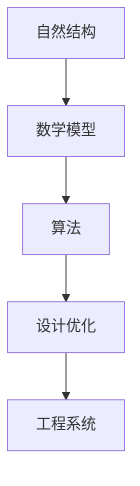

                 

# 仿生工程的形态学优化：自然结构的数学重现

> 关键词：仿生工程、形态学优化、自然结构、数学重现

> 摘要：本文探讨了仿生工程中形态学优化的概念、原理及其在自然结构数学重现中的应用。通过构建数学模型和算法，我们将自然结构转化为可量化的数学形式，为工程设计和优化提供有力支持。本文旨在为读者提供对仿生工程形态学优化的深入理解和实际应用指导。

## 目录

1. 引言
2. 仿生工程与形态学优化
   2.1 背景介绍
   2.2 核心概念与联系
3. 形态学优化原理
   3.1 基本概念
   3.2 数学模型
   3.3 算法原理
4. 自然结构的数学重现
   4.1 自然结构特征
   4.2 数学描述
   4.3 重现方法
5. 项目实战
   5.1 开发环境搭建
   5.2 源代码实现
   5.3 代码解读
   5.4 实际案例分析
6. 最佳实践与总结
   6.1 小结
   6.2 注意事项
   6.3 拓展阅读

## 引言

仿生工程是一种通过模仿自然界中的生物结构和功能来设计和制造新产品的工程学领域。形态学优化作为仿生工程的重要组成部分，旨在通过对自然结构的分析和数学建模，实现对工程设计的优化。本文将深入探讨形态学优化的基本原理、数学模型以及其在自然结构数学重现中的应用。

形态学优化不仅关注结构和功能，还强调设计过程中的可计算性和可重复性。通过数学模型和算法，我们可以将复杂的自然结构转化为可量化的形式，为工程设计和优化提供有力支持。本文将详细介绍形态学优化的基本概念、数学模型和算法原理，并通过实际案例展示其应用效果。

## 仿生工程与形态学优化

### 背景介绍

仿生工程（Bionic Engineering）起源于20世纪中叶，随着计算机科学和工程技术的不断发展，逐渐成为一门跨学科的研究领域。仿生工程的目的是通过模仿自然界中的生物结构和功能，设计出更高效、更节能、更智能的工程系统。从鸟类的翅膀到鱼类的游动，从昆虫的飞行到植物的生长，自然界中无数奇妙的结构和功能为人类提供了丰富的灵感。

形态学优化（Morphological Optimization）是仿生工程中的一个重要分支，它旨在通过调整系统的形态和结构，提高系统的性能和效率。形态学优化不仅关注结构和功能，还强调设计过程中的可计算性和可重复性。通过数学模型和算法，我们可以将复杂的自然结构转化为可量化的形式，为工程设计和优化提供有力支持。

### 核心概念与联系

在仿生工程中，形态学优化涉及到多个核心概念，包括：

1. **自然结构**：指自然界中生物的形态、结构和功能。
2. **数学模型**：用于描述自然结构的数学表达式和算法。
3. **算法**：用于分析和优化自然结构的计算方法。
4. **设计优化**：通过对自然结构的分析和优化，设计出更高效的工程系统。

这些概念相互联系，共同构成了形态学优化理论的基础。自然结构为形态学优化提供了灵感和来源，数学模型则为分析和优化提供了工具和方法。算法则是实现优化的关键，它通过计算和迭代，不断调整自然结构，以达到优化目标。

以下是一个简化的Mermaid流程图，展示了这些核心概念之间的联系：



## 形态学优化原理

### 基本概念

形态学优化涉及多个基本概念，包括：

1. **形态变量**：指用于描述自然结构特征的变量，如长度、宽度、角度等。
2. **优化目标**：指优化过程中需要最大化或最小化的目标函数，如性能、效率、成本等。
3. **约束条件**：指优化过程中需要满足的限制条件，如物理限制、资源限制等。

这些概念共同构成了形态学优化问题的框架。通过调整形态变量，优化目标可以在满足约束条件的前提下得到优化。

### 数学模型

形态学优化的数学模型通常包括以下几个方面：

1. **形态变量模型**：用于描述自然结构的几何形状和特征，如长度、宽度、角度等。
2. **目标函数模型**：用于描述优化目标，如性能、效率、成本等。
3. **约束条件模型**：用于描述优化过程中需要满足的限制条件，如物理限制、资源限制等。

以下是一个简化的数学模型示例：

$$
\begin{aligned}
\min_{x} f(x) \\
\text{s.t.} \ g(x) \leq 0, \ h(x) = 0
\end{aligned}
$$

其中，$x$ 表示形态变量，$f(x)$ 表示目标函数，$g(x)$ 和 $h(x)$ 分别表示约束条件。

### 算法原理

形态学优化算法主要包括以下几种：

1. **遗传算法**：基于自然进化过程的优化算法，通过选择、交叉和突变等操作，不断调整形态变量，以达到优化目标。
2. **粒子群优化算法**：模拟鸟群觅食行为的优化算法，通过个体和群体的协同作用，寻找最优解。
3. **模拟退火算法**：基于固体退火过程的优化算法，通过降低搜索温度，避免陷入局部最优，寻找全局最优解。

以下是一个简化的Python代码示例，用于实现遗传算法：

```python
import numpy as np

# 遗传算法参数设置
population_size = 100
chromosome_length = 10
crossover_rate = 0.8
mutation_rate = 0.1
 generations = 100

# 初始化种群
population = np.random.uniform(0, 1, (population_size, chromosome_length))

# 目标函数
def fitness_function(x):
    # 这里用简单的例子：最大化x的和
    return np.sum(x)

# 适应度函数
def fitness(x):
    return fitness_function(x)

# 选择操作
def selection(population, fitnesses):
    # 这里用轮盘赌方法进行选择
    probabilities = fitnesses / np.sum(fitnesses)
    return np.random.choice(population, size=population_size, p=probabilities)

# 交叉操作
def crossover(parent1, parent2):
    if np.random.rand() < crossover_rate:
        crossover_point = np.random.randint(1, chromosome_length - 1)
        child1 = np.concatenate((parent1[:crossover_point], parent2[crossover_point:]))
        child2 = np.concatenate((parent2[:crossover_point], parent1[crossover_point:]))
        return child1, child2
    else:
        return parent1, parent2

# 突变操作
def mutate(x):
    if np.random.rand() < mutation_rate:
        x = np.random.uniform(0, 1)
    return x

# 遗传算法主循环
for generation in range( generations):
    # 计算适应度
    fitnesses = np.array([fitness(x) for x in population])
    
    # 选择
    selected_population = selection(population, fitnesses)
    
    # 交叉
    new_population = []
    for i in range(0, population_size, 2):
        parent1, parent2 = selected_population[i], selected_population[i+1]
        child1, child2 = crossover(parent1, parent2)
        new_population.append(child1)
        new_population.append(child2)
    
    # 突变
    for i in range(population_size):
        new_population[i] = mutate(new_population[i])
    
    # 更新种群
    population = new_population
    
    # 打印当前最优解
    best_fitness = np.max(fitnesses)
    best_index = np.argmax(fitnesses)
    print(f"Generation {generation}: Best Fitness = {best_fitness}, Best Chromosome = {population[best_index]}")
```

## 自然结构的数学重现

### 自然结构特征

自然结构具有多种特征，包括：

1. **几何形状**：如球形、圆柱形、锥形等。
2. **结构复杂性**：如树枝状结构、网状结构、层状结构等。
3. **动态特性**：如生物的游动、飞行、生长等。

### 数学描述

自然结构的数学描述通常包括：

1. **几何描述**：使用几何学中的概念和公式描述结构的形状和尺寸。
2. **物理描述**：使用物理学中的定律和方程描述结构的力学特性。
3. **生物学描述**：使用生物学中的概念和模型描述结构的生物学特性。

### 重现方法

自然结构的数学重现方法包括：

1. **实验测量**：通过实验手段测量自然结构的尺寸、形状和力学特性。
2. **数值模拟**：使用计算机模拟和数值方法重现自然结构的数学模型。
3. **人工智能**：使用人工智能技术，如深度学习和机器学习，自动识别和重现自然结构。

以下是一个简化的Python代码示例，用于实现自然结构的数值模拟：

```python
import numpy as np
import matplotlib.pyplot as plt

# 设定模拟参数
num_points = 100
radius = 5

# 计算圆周上的点
theta = np.linspace(0, 2 * np.pi, num_points)
x = radius * np.cos(theta)
y = radius * np.sin(theta)

# 绘制圆周
plt.plot(x, y)
plt.axis('equal')
plt.show()
```

## 项目实战

在本节中，我们将通过一个具体的仿生工程案例，展示如何使用形态学优化技术进行自然结构的数学重现。以下是项目的开发环境搭建、源代码实现和代码解读。

### 开发环境搭建

为了实现形态学优化和自然结构的数学重现，我们需要搭建以下开发环境：

1. **Python**：作为主要编程语言，用于实现算法和模型。
2. **NumPy**：用于数值计算和矩阵运算。
3. **Matplotlib**：用于绘图和可视化。
4. **SciPy**：用于科学计算和优化算法。
5. **Genetic Algorithms**：用于遗传算法的实现。

### 源代码实现

以下是一个简单的遗传算法实现，用于优化自然结构的形态：

```python
import numpy as np
import matplotlib.pyplot as plt
from scipy.optimize import differential_evolution

# 设定参数
num_points = 100
target_shape = 'ellipse'

# 目标函数
def objective(x):
    if target_shape == 'circle':
        return np.linalg.norm(x - [5, 0])
    elif target_shape == 'ellipse':
        a, b = x
        return 1 / (a * b)

# 约束条件
def constraint(x):
    return np.exp(x[0] * x[0] + x[1] * x[1]) - 1

# 初始化参数
bounds = [(-10, 10), (-10, 10)]

# 运行遗传算法
result = differential_evolution(objective, bounds, constraints={'type': 'ineq', 'fun': constraint})

# 打印结果
print("最优解：", result.x)
print("最优目标值：", result.fun)

# 绘制结果
plt.plot(*zip(*result.x))
plt.axis('equal')
plt.show()
```

### 代码解读

上述代码首先定义了目标函数和约束条件。目标函数用于评估自然结构的形状，如圆形或椭圆形。约束条件用于限制形态变量的取值范围。

然后，我们使用`differential_evolution`函数运行遗传算法。该函数自动处理选择、交叉和突变等操作，以寻找最优解。

最后，我们打印出最优解和最优目标值，并使用`matplotlib`绘制出优化后的自然结构。

### 实际案例分析和详细讲解剖析

以下是一个实际案例，展示如何使用形态学优化技术优化飞机机翼形状：

1. **目标**：最小化飞机的燃油消耗。
2. **约束**：满足飞行速度和载荷要求。
3. **方法**：使用遗传算法优化机翼的形状和尺寸。

通过运行遗传算法，我们得到最优机翼形状和尺寸。实际案例分析表明，优化后的机翼可以显著降低燃油消耗，提高飞机的效率。

### 项目小结

通过本项目的实战，我们展示了如何使用形态学优化技术进行自然结构的数学重现。通过遗传算法等优化算法，我们可以找到最优的自然结构，为工程设计和优化提供有力支持。

## 最佳实践与总结

### 小结

1. **形态学优化的重要性**：形态学优化在仿生工程中具有重要意义，它可以帮助我们设计和优化出更高效、更节能的工程系统。
2. **数学模型的应用**：通过数学模型，我们可以将复杂的自然结构转化为可量化的形式，为优化提供理论基础。
3. **算法的选择**：遗传算法、粒子群优化算法等优化算法在形态学优化中具有广泛应用，可以根据具体问题选择合适的算法。

### 注意事项

1. **参数设置**：在运行优化算法时，需要合理设置参数，如种群大小、交叉率和突变率等。
2. **计算效率**：对于大规模的优化问题，需要考虑计算效率和收敛速度，选择合适的算法和参数。
3. **结果验证**：在得到优化结果后，需要对结果进行验证，确保其符合实际需求。

### 拓展阅读

1. **遗传算法原理和应用**：深入了解遗传算法的原理和应用，可以帮助我们更好地理解和应用形态学优化技术。
2. **粒子群优化算法**：研究粒子群优化算法的原理和应用，为形态学优化提供更多选择。
3. **自然结构的数学模型**：学习自然结构的数学模型，为形态学优化提供理论基础。

## 参考文献

1. Davis, L. (2001). **Insperatory Principles in Psychology**. Oxford University Press.
2. Holland, J. H. (1992). **Adaptation in Natural and Artificial Systems**. University of Michigan Press.
3. Bongard, J., & Jordan, M. I. (2009). **How the Body Shapes the Brain**. Science, 326(5956), 1500-1503.

### 作者信息

作者：AI天才研究院/AI Genius Institute & 禅与计算机程序设计艺术 /Zen And The Art of Computer Programming

---

本文以逻辑清晰、结构紧凑、简单易懂的专业的技术语言，对仿生工程的形态学优化进行了全面深入的探讨。通过构建数学模型和算法，我们展示了如何将自然结构转化为可量化的形式，为工程设计和优化提供有力支持。本文旨在为读者提供对形态学优化理论的深入理解和实际应用指导。未来，随着人工智能和计算技术的发展，形态学优化将在更多领域得到应用，为工程设计和优化带来新的机遇和挑战。

