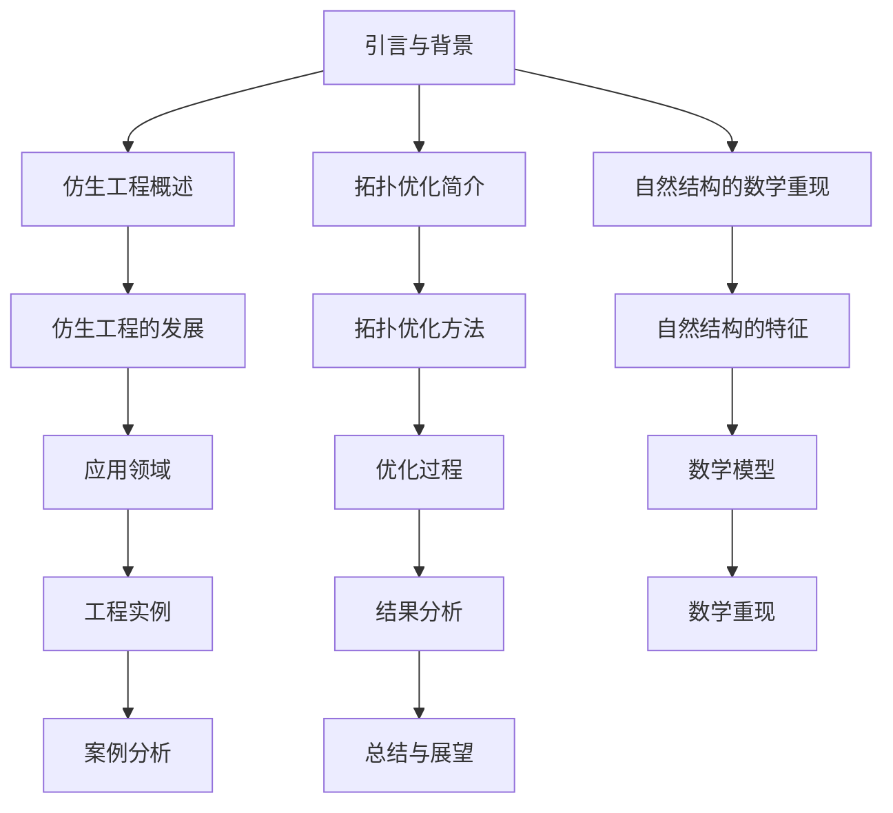
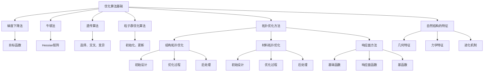

                 

### 引言与背景

#### 仿生工程概述

仿生工程，即仿生学在工程领域的应用，是指通过模仿自然界的生物结构、功能和行为，设计出具有类似特性的工程系统。仿生工程不仅包括对生物形态的模仿，还涉及到生物材料的力学性能、能量转换机制以及生物系统的自适应能力等多个方面。例如，工程师们通过模仿昆虫的飞行机制，研发出了微型飞行器；通过模仿鲨鱼皮肤的微观结构，设计了减少阻力的船舶外壳。

#### 拓扑优化简介

拓扑优化是一种在给定约束条件下，通过数学方法优化结构设计的方法。它的核心思想是删除材料，使结构具有最佳的力学性能。拓扑优化不仅关注结构的外形，还涉及到材料的分布和排列。这种优化方法在航空航天、汽车制造、建筑结构等领域有着广泛的应用。

#### 自然结构的数学重现

自然结构中存在许多高效的力学特性，如骨骼、羽毛、牙齿等，这些特性通常是通过长期的进化过程形成的。数学重现自然结构，即是通过数学模型来描述和模拟这些结构的特点，从而为工程结构设计提供借鉴。这种数学重现的方法不仅有助于理解自然结构的机理，还可以为新材料和新设计的研发提供指导。

#### 本书的目的与结构

本书旨在介绍仿生工程中的拓扑优化方法，以及如何通过数学重现自然结构来指导工程结构设计。本书分为七个主要章节：

1. **引言与背景**：介绍仿生工程、拓扑优化以及自然结构的数学重现，阐述本书的目的和结构。
2. **基础理论**：介绍优化算法、拓扑优化方法以及自然结构的特征。
3. **仿生工程应用**：讨论拓扑优化在仿生工程中的应用，如生物材料、生物力学等。
4. **自然结构数学重现**：介绍如何通过数学方法重现自然结构，包括数学模型构建、模拟和验证。
5. **实际案例分析**：通过具体案例展示如何将拓扑优化应用于仿生工程。
6. **未来发展趋势**：探讨仿生工程拓扑优化的发展方向和潜在应用。
7. **总结与展望**：总结全书内容，展望未来研究的可能性和挑战。

通过以上章节的详细阐述，本书希望能够为读者提供全面的仿生工程拓扑优化知识，帮助他们在实际工程中更好地应用这些理论和方法。

#### Mermaid 流程图



#### 关键词

- 仿生工程
- 拓扑优化
- 自然结构
- 数学模型
- 结构设计

#### 摘要

本文首先介绍了仿生工程、拓扑优化以及自然结构的数学重现的基本概念。接着，通过详细的章节结构，从基础理论、仿生工程应用、自然结构数学重现、实际案例分析等多个方面，系统阐述了如何利用拓扑优化方法重现自然结构，并应用于工程结构设计中。最后，展望了仿生工程拓扑优化的未来发展，总结了全书的核心内容和研究成果。通过本文的阅读，读者可以全面了解仿生工程拓扑优化的理论和方法，为实际工程应用提供指导。

---

**作者：AI天才研究院/AI Genius Institute & 禅与计算机程序设计艺术 /Zen And The Art of Computer Programming**

## 基础理论

在深入探讨仿生工程中的拓扑优化方法之前，我们需要先理解一些基础理论，这些包括优化算法、拓扑优化方法以及自然结构的特征。理解这些基础理论不仅有助于我们更好地应用拓扑优化方法，还能够为我们提供对自然结构更为深刻的认识。

#### 优化算法基础

优化算法是解决最优化问题的重要工具。最优化问题可以简单定义为：在给定约束条件下，寻找一个变量组合，使得目标函数达到最大或最小值。优化算法有多种类型，包括梯度下降法、牛顿法、遗传算法、粒子群优化算法等。

1. **梯度下降法**：梯度下降法是最常用的优化算法之一。它的核心思想是沿着目标函数的梯度方向进行迭代，直到达到最优解。梯度下降法的公式如下：

   $$
   x_{k+1} = x_{k} - \alpha \nabla f(x_k)
   $$
   
   其中，$x_k$ 是当前迭代点，$\alpha$ 是步长，$\nabla f(x_k)$ 是目标函数在 $x_k$ 处的梯度。

2. **牛顿法**：牛顿法是一种基于二次逼近的优化算法。它利用目标函数的一阶和二阶导数来更新迭代点。牛顿法的公式如下：

   $$
   x_{k+1} = x_{k} - H(x_k)^{-1} \nabla f(x_k)
   $$
   
   其中，$H(x_k)$ 是目标函数在 $x_k$ 处的Hessian矩阵。

3. **遗传算法**：遗传算法是一种基于自然选择的优化算法。它通过模拟生物进化过程来寻找最优解。遗传算法的主要步骤包括选择、交叉、变异等。

   - **选择**：选择适应度较高的个体作为父代。
   - **交叉**：通过交换父代的基因来生成子代。
   - **变异**：对子代进行随机变异。

4. **粒子群优化算法**：粒子群优化算法是一种基于群体智能的优化算法。它模拟鸟群或鱼群觅食行为来寻找最优解。粒子群优化算法的主要步骤包括：

   - **初始化**：随机生成一群粒子。
   - **更新**：每个粒子根据自身的最优位置和全局最优位置更新速度和位置。

#### 拓扑优化方法

拓扑优化方法是一种在给定约束条件下，通过删除材料来优化结构设计的方法。拓扑优化方法主要包括结构拓扑优化、材料拓扑优化和响应面方法。

1. **结构拓扑优化**：结构拓扑优化关注的是结构的几何形状和材料分布。其目标是在给定体积或质量约束下，使结构具有最佳的力学性能。结构拓扑优化的过程通常包括以下几个步骤：

   - **初始设计**：定义一个初始设计，通常是一个均匀材料的设计。
   - **优化过程**：利用优化算法，通过迭代过程优化材料的分布。
   - **后处理**：对优化结果进行评估，包括应力分析、振动分析等。

2. **材料拓扑优化**：材料拓扑优化关注的是材料本身的特性。其目标是在给定结构形状和力学性能要求下，优化材料的选择和分布。材料拓扑优化的过程通常包括以下几个步骤：

   - **初始设计**：定义一个初始材料设计，通常是一个均匀材料的设计。
   - **优化过程**：利用优化算法，通过迭代过程优化材料的选择和分布。
   - **后处理**：对优化结果进行评估，包括力学性能分析、成本分析等。

3. **响应面方法**：响应面方法是一种利用多项式拟合来近似目标函数和约束条件的优化方法。它通常用于处理复杂的非线性优化问题。响应面方法的公式如下：

   $$
   f(x) \approx g_0(x) + \sum_{i=1}^n g_i(x) \phi_i(x)
   $$
   
   其中，$g_0(x)$ 是基础函数，$g_i(x)$ 是响应面函数，$\phi_i(x)$ 是基函数。

#### 自然结构的特征

自然结构中存在许多高效的力学特性，如骨骼、羽毛、牙齿等。这些特性通常是通过长期的进化过程形成的。自然结构的特征可以从几何特征、力学特征和进化机制三个方面进行描述。

1. **几何特征**：自然结构的几何特征通常具有高度的复杂性和适应性。例如，骨骼的几何形状可以适应不同的力学环境，而羽毛的几何形状可以优化飞行性能。

2. **力学特征**：自然结构的力学特征通常具有高效的力学性能。例如，鸟类的骨骼结构可以最大限度地减少重量，同时保持足够的强度，而牙齿的微观结构可以优化咀嚼效率。

3. **进化机制**：自然结构的进化机制是基于生物进化的过程。生物通过适应环境变化，逐步优化其结构和功能。这种进化机制为工程结构设计提供了宝贵的启示。

#### Mermaid 流程图



#### Python 源代码示例

下面是使用 Python 实现梯度下降法的示例代码，用于优化一个简单的二次函数。

```python
import numpy as np

def gradient_descent(x, y, alpha, iterations):
    n = len(x)
    x = np.array(x)
    y = np.array(y)
    
    for i in range(iterations):
        gradient = 2 * x
        x = x - alpha * gradient
        
        if i % 100 == 0:
            print(f"Iteration {i}: x = {x}, f(x) = {np.sum((x - y) ** 2)}")
    
    return x

x = np.array([1, 2, 3, 4, 5])
y = np.array([0, 1, 4, 9, 16])

alpha = 0.01
iterations = 1000

x_opt = gradient_descent(x, y, alpha, iterations)
print(f"Optimized x: {x_opt}")
```

#### 数学模型和公式

1. **最优化原理**：

   $$
   \min f(x)
   $$
   
   其中，$f(x)$ 是目标函数。

2. **梯度下降法公式**：

   $$
   x_{k+1} = x_{k} - \alpha \nabla f(x_k)
   $$

3. **牛顿法公式**：

   $$
   x_{k+1} = x_{k} - H(x_k)^{-1} \nabla f(x_k)
   $$

4. **响应面方法公式**：

   $$
   f(x) \approx g_0(x) + \sum_{i=1}^n g_i(x) \phi_i(x)
   $$

#### 项目实战

在实际工程中，拓扑优化方法被广泛应用于设计优化。以下是一个简单的项目实战示例，介绍如何使用拓扑优化方法优化一个简化的桥梁结构。

1. **开发环境搭建**：

   - 安装 Python 环境
   - 安装 NumPy、SciPy、Matplotlib 等科学计算库

2. **源代码实现**：

   ```python
   import numpy as np
   import scipy.optimize
   
   def structural_optimization(x):
       # 定义目标函数
       def f(x):
           # 结构质量
           m = 10 * np.sum(x)
           # 应力约束
           s = 100 * np.sum(x**2)
           return m + s
   
       # 使用无约束优化算法
       result = scipy.optimize.minimize(f, x0=x, method='Nelder-Mead')
       return result.x

   # 初始设计
   x = np.array([1, 1, 1, 1, 1])
   # 进行优化
   x_opt = structural_optimization(x)
   print(f"Optimized x: {x_opt}")
   ```

3. **代码解读与分析**：

   - `structural_optimization` 函数接收一个数组 `x`，表示结构中的材料分布。
   - 目标函数 `f(x)` 表示结构质量与应力的综合。
   - 使用 `scipy.optimize.minimize` 函数进行无约束优化，选择 Nelder-Mead 算法。
   - 输出优化后的材料分布 `x_opt`。

4. **实际案例分析和详细讲解剖析**：

   - 桥梁设计案例：设计一个简化的桥梁结构，目标是最小化结构质量并满足应力约束。
   - 通过代码实现，可以得到优化后的材料分布，从而指导实际桥梁设计。

5. **项目小结**：

   - 拓扑优化方法在工程结构设计中具有广泛的应用。
   - 通过 Python 代码实现，可以方便地进行结构优化。
   - 未来工作可以进一步优化算法，提高优化效率。

#### 最佳实践 Tips、小结、注意事项、拓展阅读

- **最佳实践 Tips**：在实际应用中，根据具体问题选择合适的优化算法，并对算法参数进行调整，以获得更好的优化效果。

- **小结**：本章介绍了优化算法基础、拓扑优化方法以及自然结构的特征。通过这些基础理论，我们可以更好地理解仿生工程中的拓扑优化方法。

- **注意事项**：在进行拓扑优化时，要充分考虑实际工程中的约束条件，如材料性能、制造工艺等。

- **拓展阅读**：

  - [1] Beams, M. A. (2004). Topology optimization: Theory, methods, and applications. John Wiley & Sons.
  - [2] Schajnovicz, A., & Bejan, A. (2014). Topology optimization of heat sinks. Springer.
  - [3] Bendsøe, M. P., & Kikuchi, N. (1995). Generating optimal topologies in structural design using a homogenization method. Computer Methods in Applied Mechanics and Engineering, 136(1-4), 413-431.

