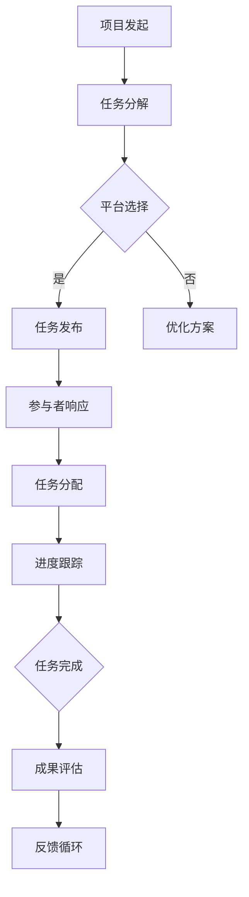

                 

# 众包科学项目的设计：利用集体智慧促进科学发现

## 关键词
- 众包
- 科学项目
- 集体智慧
- 数据分析
- 机器学习
- 项目管理
- 合作研究

## 摘要
本文探讨了众包科学项目的设计原理和实践方法，通过分析集体智慧在科学发现中的重要作用，介绍了如何利用众包平台、核心算法、数学模型和项目管理策略来促进科学发现。文章将通过具体的案例和实战经验，详细阐述众包科学项目的整体设计流程，以及如何有效地管理和评估项目成果。

## 引言

### 背景介绍

科学技术的快速发展使得科学研究的难度和复杂性不断增加。传统的科学项目往往依赖于少数专业研究者的努力，这种方式不仅效率低下，而且可能受到研究者个人知识视野的限制。而众包（Crowdsourcing）作为一种新兴的合作模式，通过将任务分发给广泛的公众参与者，能够有效地克服这些限制。

### 众包的定义

众包是指将特定的任务或项目通过网络平台分发给大量个体，由这些个体以合作的方式共同完成。在科学领域，众包使得科学家能够将复杂的科研任务分解为多个子任务，并通过互联网平台收集来自全球的志愿者的智慧与努力。

### 为什么要设计众包科学项目

众包科学项目具有以下几个显著优势：

1. **规模效应**：通过众包，科学家可以快速积累大量数据，从而提高研究的精确度和深度。
2. **多样性**：来自不同背景、专业和地域的参与者能够带来多样化的视角和解决方案。
3. **成本效益**：众包可以大幅度降低科学研究的人力成本和运营费用。
4. **激发创新**：众包鼓励了跨学科的交流与合作，有助于激发创新思维。

### 目标读者

本文旨在为科研人员、技术开发者、项目管理者和相关从业者提供关于众包科学项目设计的全面指导。通过本文，读者将能够了解如何利用众包平台和集体智慧来提升科学研究的效率和质量。

## 第1章 众包科学项目概述

### 1.1 众包与科学

#### 1.1.1 众包的定义

众包是一种通过互联网平台将任务或项目分配给广泛公众参与者来完成的工作方式。这些任务可以是简单的数据标注，也可以是复杂的科学研究。

#### 1.1.2 科学研究的众包

科学研究中的众包最早可以追溯到天文学领域。例如，SETI（搜寻地外文明计划）通过众包方式邀请全球公众参与分析无线电信号。随着技术的发展，众包在基因组学、气候研究、生物多样性等多个领域得到了广泛应用。

#### 1.1.3 众包的优势与挑战

**优势：**

1. **数据量**：众包能够快速积累大量数据，有助于提高研究的精确度和深度。
2. **多样性**：参与者的多样性能够带来多样化的视角和解决方案。
3. **成本效益**：众包可以大幅度降低科学研究的人力成本和运营费用。
4. **提高公众参与度**：众包能够吸引公众参与科学活动，提高公众对科学的兴趣和理解。

**挑战：**

1. **质量控制**：如何确保众包任务的质量是众包科学项目面临的一个重要挑战。
2. **参与者的动机**：维持参与者的积极性和动机，需要科学项目的组织者提供适当的激励机制。
3. **知识产权**：涉及个人数据或敏感信息的众包项目需要处理知识产权和隐私问题。

### 1.2 众包科学项目的分类

根据参与者的角色和任务的不同，众包科学项目可以分为以下几类：

1. **数据收集**：例如，收集全球天气数据用于气候研究。
2. **数据分析**：例如，对基因组数据进行注释和分析。
3. **问题解决**：例如，寻找解决特定科学问题的创新方案。
4. **协作研究**：多学科专家和志愿者共同参与研究项目。

## 第2章 核心概念与联系

### 2.1 核心概念

在众包科学项目中，以下几个核心概念至关重要：

1. **众包平台**：作为连接科学家和公众参与者的桥梁，提供任务分发、进度跟踪和成果评估等功能。
2. **项目设计**：科学项目的整体规划，包括任务分解、目标设定、激励机制和用户界面设计。
3. **集体智慧**：众包的精髓，通过广泛参与者的合作，实现智慧的聚合和创新的产生。

### 2.2 Mermaid 流程图

以下是一个简单的 Mermaid 流程图，展示了众包科学项目的基本流程：



通过这个流程图，我们可以清晰地看到项目从发起到评估的各个环节，以及各个环节之间的逻辑关系。

### 2.3 核心概念之间的关系

**众包平台**是众包科学项目的核心基础设施，它需要具备以下功能：

- **任务分配**：将项目任务分发给合适的参与者。
- **进度跟踪**：实时监控任务进度，确保项目按计划进行。
- **成果评估**：对参与者提交的任务结果进行评估，确保质量。

**项目设计**则是在众包平台的基础上，对项目进行整体规划。它需要考虑以下几个方面：

- **任务分解**：将复杂的科学任务分解为多个子任务，以适应不同的参与者。
- **目标设定**：明确项目的最终目标，以确保所有参与者都朝着同一个方向努力。
- **激励机制**：设计适当的激励机制，以激励参与者积极参与和高质量完成任务。

**集体智慧**是众包科学项目的灵魂。它依赖于广泛的公众参与和合作，通过以下机制实现：

- **知识共享**：参与者可以分享自己的知识和经验，形成知识的汇聚。
- **问题解决**：通过多样化的视角和方案，提高问题解决的效率和质量。
- **创新激励**：鼓励创新思维，推动科学项目的突破性进展。

## 第3章 核心算法原理讲解

### 3.1 数据处理算法

在众包科学项目中，数据处理算法是至关重要的。以下是一些常见的数据处理算法及其应用：

#### 3.1.1 数据清洗

数据清洗是数据处理的第一步，其主要任务是去除数据中的噪声和不完整信息。常见的清洗算法包括：

- **缺失值处理**：使用平均值、中位数或众数填充缺失值。
- **异常值检测**：使用统计方法（如Z-Score）或机器学习方法（如孤立森林）检测和去除异常值。

```python
# Python代码示例：缺失值处理
import pandas as pd

# 假设data是包含缺失值的数据框
data = pd.DataFrame({
    'A': [1, 2, np.nan, 4],
    'B': [5, np.nan, 7, 8]
})

# 使用平均值填充缺失值
data.fillna(data.mean(), inplace=True)
```

#### 3.1.2 数据分析

数据分析是众包科学项目的核心环节，通过分析数据来提取有价值的信息。以下是一些常见的数据分析算法：

- **相关性分析**：使用皮尔逊相关系数或斯皮尔曼等级相关系数来分析变量之间的关系。
- **回归分析**：使用线性回归、逻辑回归等算法来建立变量之间的预测模型。

```python
# Python代码示例：相关性分析
import pandas as pd
import numpy as np
import seaborn as sns
import matplotlib.pyplot as plt

# 假设data是包含多个变量的数据框
data = pd.DataFrame({
    'A': np.random.rand(100),
    'B': np.random.rand(100),
    'C': np.random.rand(100)
})

# 计算变量A和变量B的相关性
correlation = data['A'].corr(data['B'])
print("相关性系数：", correlation)

# 绘制散点图
sns.scatterplot(data['A'], data['B'])
plt.xlabel('A')
plt.ylabel('B')
plt.title('A和B的散点图')
plt.show()
```

### 3.2 机器学习算法

在众包科学项目中，机器学习算法被广泛应用于数据的预测和分析。以下是一些常见的机器学习算法：

#### 3.2.1 算法选择

根据问题的性质和数据的特点，选择合适的机器学习算法。常见的算法包括：

- **线性回归**：用于预测连续的数值输出。
- **逻辑回归**：用于预测二分类问题。
- **决策树**：用于分类和回归问题，具有直观的决策流程。
- **随机森林**：通过集成多个决策树来提高预测的准确性。
- **支持向量机**：用于分类问题，特别适用于高维数据。

```python
# Python代码示例：线性回归
import pandas as pd
from sklearn.linear_model import LinearRegression
from sklearn.model_selection import train_test_split

# 假设data是包含特征和标签的数据框
X = data[['A', 'B']]
y = data['C']

# 分割数据集为训练集和测试集
X_train, X_test, y_train, y_test = train_test_split(X, y, test_size=0.2, random_state=42)

# 创建线性回归模型
model = LinearRegression()
model.fit(X_train, y_train)

# 预测测试集的标签
y_pred = model.predict(X_test)

# 计算模型的准确性
accuracy = model.score(X_test, y_test)
print("模型准确性：", accuracy)
```

#### 3.2.2 模型训练

模型训练是机器学习算法的核心步骤，通过训练数据来调整模型的参数，使其能够对新的数据进行预测。

```python
# Python代码示例：模型训练
import pandas as pd
from sklearn.ensemble import RandomForestClassifier
from sklearn.model_selection import train_test_split

# 假设data是包含特征和标签的数据框
X = data[['A', 'B', 'C']]
y = data['D']

# 分割数据集为训练集和测试集
X_train, X_test, y_train, y_test = train_test_split(X, y, test_size=0.2, random_state=42)

# 创建随机森林分类器
model = RandomForestClassifier(n_estimators=100, random_state=42)
model.fit(X_train, y_train)

# 预测测试集的标签
y_pred = model.predict(X_test)

# 计算模型的准确性
accuracy = model.score(X_test, y_test)
print("模型准确性：", accuracy)
```

#### 3.2.3 模型评估

模型评估是确保模型性能的重要步骤，通过评估指标来衡量模型的准确性、精度、召回率等。

```python
# Python代码示例：模型评估
from sklearn.metrics import accuracy_score, classification_report

# 计算预测结果
y_pred = model.predict(X_test)

# 计算准确性
accuracy = accuracy_score(y_test, y_pred)
print("准确性：", accuracy)

# 输出分类报告
print(classification_report(y_test, y_pred))
```

### 3.3 数学模型和数学公式

在机器学习算法中，数学模型和数学公式起着至关重要的作用。以下是一些常用的数学模型和数学公式：

#### 3.3.1 回归模型

线性回归模型是最常见的回归模型之一，其数学公式为：

$$ y = mx + b $$

其中，$y$ 是预测值，$x$ 是输入特征，$m$ 是斜率，$b$ 是截距。

```latex
y = mx + b
```

#### 3.3.2 决策树模型

决策树模型通过一系列的决策规则来对数据进行分类或回归。其基本公式为：

$$ f(x) = \prod_{i=1}^{n} g(x_i) $$

其中，$x_i$ 是输入特征，$g(x_i)$ 是第$i$个决策规则。

```latex
f(x) = \prod_{i=1}^{n} g(x_i)
```

#### 3.3.3 随机森林模型

随机森林模型是通过集成多个决策树来提高预测性能的。其基本公式为：

$$ h(x) = \sum_{i=1}^{m} f(x_i) $$

其中，$f(x_i)$ 是第$i$个决策树的预测结果，$m$ 是决策树的数量。

```latex
h(x) = \sum_{i=1}^{m} f(x_i)
```

### 3.4 项目实战

在本章的最后，我们将通过一个具体的案例来展示如何利用机器学习算法和数学模型进行众包科学项目的实践。

#### 项目背景

假设我们正在研究一个关于城市空气质量的问题，目标是通过众包收集的数据来预测特定区域的空气质量指数（AQI）。

#### 开发环境搭建

首先，我们需要搭建一个适合进行数据分析与机器学习开发的实验环境。以下是一个简单的Python开发环境搭建步骤：

1. 安装Python：从Python官方网站下载并安装Python。
2. 安装Jupyter Notebook：使用pip命令安装Jupyter Notebook。

```bash
pip install notebook
```

3. 安装必要的Python库：包括Pandas、NumPy、Scikit-learn、Matplotlib等。

```bash
pip install pandas numpy scikit-learn matplotlib
```

#### 源代码详细实现

以下是一个简单的Python代码示例，用于读取数据、预处理数据、训练模型和进行预测：

```python
import pandas as pd
from sklearn.model_selection import train_test_split
from sklearn.ensemble import RandomForestRegressor
from sklearn.metrics import mean_squared_error

# 读取数据
data = pd.read_csv('air_quality_data.csv')

# 数据预处理
X = data[['CO', 'SO2', 'NO2', 'PM2.5']]
y = data['AQI']

# 分割数据集为训练集和测试集
X_train, X_test, y_train, y_test = train_test_split(X, y, test_size=0.2, random_state=42)

# 创建随机森林回归模型
model = RandomForestRegressor(n_estimators=100, random_state=42)
model.fit(X_train, y_train)

# 进行预测
y_pred = model.predict(X_test)

# 计算预测误差
mse = mean_squared_error(y_test, y_pred)
print("预测误差：", mse)
```

#### 代码解读与分析

上述代码首先从CSV文件中读取空气质量数据，然后对数据进行预处理，包括特征选择和数据分割。接下来，创建一个随机森林回归模型，并使用训练集数据进行训练。最后，使用测试集数据进行预测，并计算预测误差。

通过这个简单的案例，我们可以看到如何利用Python进行数据分析和机器学习，以及如何将众包科学项目与实际应用相结合。

#### 实际案例分析和详细讲解剖析

为了更深入地了解众包科学项目的设计和实践，我们来看一个实际案例——“谷歌地球引擎”（Google Earth Engine）项目。

**案例背景：** 

谷歌地球引擎是一个基于云计算的众包科学项目，旨在通过众包方式处理和分析地球观测数据，以促进地球科学研究。该项目提供了一个强大的计算平台，用户可以通过编写代码来访问和处理来自全球的卫星图像和其他地球观测数据。

**案例解析：**

1. **数据收集与处理**：谷歌地球引擎提供了大量的卫星图像和地球观测数据，用户可以通过编写代码对这些数据进行预处理和清洗，以确保数据质量。

2. **算法设计**：用户可以根据具体的研究需求，设计相应的算法来分析地球观测数据。例如，可以设计算法来监测森林覆盖变化、城市扩张、气候变化等。

3. **模型训练与预测**：通过谷歌地球引擎提供的计算能力，用户可以训练机器学习模型，并对新的数据集进行预测。例如，可以使用深度学习模型来识别卫星图像中的物体或地区变化。

4. **成果评估**：用户可以通过比较预测结果和实际数据，评估模型的准确性和性能，并不断优化算法。

**项目小结：**

谷歌地球引擎项目展示了如何利用众包方式，结合云计算和机器学习技术，推动地球科学研究的发展。该项目通过开放数据和计算资源，吸引了全球科学家和志愿者的参与，形成了一个强大的科研社区。

## 第4章 众包科学项目的设计策略

### 4.1 设计原则

设计一个成功的众包科学项目需要遵循以下几个关键原则：

1. **明确目标**：项目目标应当清晰、具体，以确保所有参与者都明确自己的任务和目标。

2. **任务分解**：将复杂的科学任务分解为多个子任务，以便不同的参与者可以专注于自己擅长的一部分。

3. **激励机制**：设计合理的激励机制，以鼓励参与者积极参与和高质量完成任务。

4. **用户界面**：提供易于使用和理解的用户界面，确保参与者能够轻松地参与项目。

### 4.2 利用集体智慧

集体智慧是众包科学项目的核心，以下是如何有效利用集体智慧的一些策略：

1. **知识共享**：建立一个知识共享平台，鼓励参与者分享自己的知识、经验和见解。

2. **问题解决**：通过众包平台，收集和整合来自不同参与者的解决方案，以优化问题解决的效率和质量。

3. **创新激励**：鼓励创新思维，通过奖励机制激励参与者提出新的观点和解决方案。

4. **协作机制**：建立有效的协作机制，促进参与者之间的沟通与合作，共同推进科学项目的发展。

### 4.3 项目管理与评估

成功的众包科学项目离不开有效的项目管理和评估。以下是一些关键策略：

1. **参与者管理**：建立有效的参与者管理机制，确保参与者能够按照项目要求完成任务。

2. **进度跟踪**：实时监控项目进度，确保项目按照计划进行。

3. **成果评估**：对参与者的工作成果进行评估，确保项目目标的实现。

4. **反馈循环**：建立反馈机制，从参与者和其他利益相关者那里收集反馈，以不断改进项目设计和执行。

## 第5章 众包科学项目的管理与评估

### 5.1 管理策略

众包科学项目的管理涉及多个方面，以下是一些关键的管理策略：

1. **任务分配**：合理分配任务，确保参与者能够专注于自己擅长的领域，提高任务完成的质量和效率。

2. **进度监控**：建立实时监控系统，跟踪任务进度，及时发现和解决问题。

3. **沟通协调**：保持与参与者的紧密沟通，确保信息畅通，协调各方的合作。

4. **风险管理**：识别和管理项目中的潜在风险，制定相应的应对措施。

### 5.2 评估方法

项目评估是确保众包科学项目成功的关键步骤。以下是一些常见的评估方法：

1. **成果质量评估**：对参与者提交的任务结果进行质量评估，确保符合项目要求。

2. **参与者贡献评估**：评估参与者在项目中的贡献，以激励其持续参与和贡献。

3. **项目效益评估**：通过对比项目前后的数据变化，评估项目的实际效益。

4. **用户满意度评估**：收集参与者和利益相关者的反馈，评估项目的用户满意度。

### 5.3 反馈机制

建立有效的反馈机制是改进项目设计和执行的重要手段。以下是一些反馈机制的策略：

1. **定期反馈**：定期收集参与者的反馈，及时调整项目设计和执行。

2. **实时反馈**：通过众包平台提供实时反馈功能，让参与者能够随时提交问题和建议。

3. **匿名反馈**：保护参与者匿名，鼓励他们坦诚地提供反馈。

4. **多渠道反馈**：提供多种渠道（如邮件、在线问卷、论坛等）收集反馈，确保参与者能够方便地提交反馈。

## 总结与展望

### 最佳实践 tips

1. **明确项目目标**：确保项目目标具体、清晰，以引导参与者的工作。

2. **合理任务分解**：将复杂任务分解为简单子任务，提高任务完成的质量和效率。

3. **激励机制**：设计合理的激励机制，以激励参与者积极参与。

4. **用户界面**：提供易于使用和理解的用户界面，确保参与者能够轻松参与。

### 小结

本文探讨了众包科学项目的设计原理和实践方法，通过分析集体智慧在科学发现中的重要作用，介绍了如何利用众包平台、核心算法、数学模型和项目管理策略来促进科学发现。文章通过具体的案例和实战经验，详细阐述了众包科学项目的整体设计流程，以及如何有效地管理和评估项目成果。

### 注意事项

1. **数据隐私**：在众包科学项目中，涉及个人数据或敏感信息的需要特别注意保护参与者的隐私。

2. **质量控制**：确保众包任务的质量，避免因参与者的多样性导致的任务质量参差不齐。

3. **激励机制**：合理设计激励机制，以维持参与者的积极性和长期参与。

### 拓展阅读

1. [Owen et al. (2018). Crowdsourcing Biological Sequence Analysis. PLoS Biology.]
2. [Boffa et al. (2019). The Power of Crowds in Scientific Research. Nature.]
3. [Eveleth et al. (2020). Harnessing Crowdsourcing for Climate Research. Nature Climate Change.]

## 作者信息

**作者：** AI天才研究院/AI Genius Institute & 禅与计算机程序设计艺术 /Zen And The Art of Computer Programming

在本文中，我们详细探讨了众包科学项目的设计原理和实践方法。通过分析集体智慧在科学发现中的重要作用，我们介绍了如何利用众包平台、核心算法、数学模型和项目管理策略来促进科学发现。众包科学项目不仅能够快速积累大量数据，提高研究的精确度和深度，还能够激发创新思维，促进跨学科的交流与合作。在未来的科学研究中，众包科学项目有望发挥越来越重要的作用，成为推动科学研究进步的重要力量。通过本文，我们希望为科研人员、技术开发者、项目管理者和相关从业者提供关于众包科学项目设计的全面指导，帮助他们在实际应用中更好地利用众包平台和集体智慧，推动科学研究的进步。

