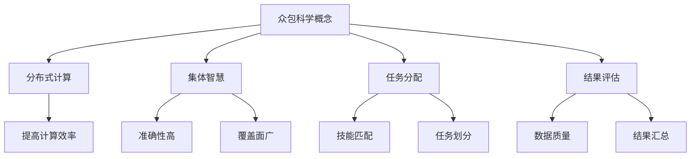

                 

# 众包科学：利用集体智慧加速科学发现与理解

## 关键词
- 众包科学
- 集体智慧
- 科学研究
- 分布式计算
- 激励机制
- 数据分析

## 摘要
本文探讨了众包科学的概念、起源、重要性及其在各个领域的应用实例。通过分析众包科学的核心原理、架构和激励机制，本文揭示了集体智慧在科学研究中的巨大潜力。同时，本文还讨论了众包科学面临的挑战和未来的发展趋势，为读者提供了一个全面的理解和展望。

## 第一部分：引言

### 1.1 众包科学的起源与定义
众包科学是一种通过利用大众的力量来解决科学问题的方法。它起源于2000年，当时亚马逊推出了“机械 Turk”（Mechanical Turk），这是一个在线平台，允许人们通过执行微任务来赚取小额报酬。这个平台的成功激发了科学家们对众包科学的兴趣，并逐渐发展为一种重要的科学研究方法。

众包科学的核心思想是将复杂的科学问题分解成许多小任务，然后通过网络平台将这些任务分配给大量的志愿者或参与者。这些参与者可以是普通大众、专业人士或者学生等，他们利用自己的知识和技能来完成这些任务，并将结果汇总，从而形成科学研究的完整数据集。

### 1.2 众包科学的历史与现状
众包科学的历史可以追溯到20世纪初，当时科学家开始利用大众的力量来解决科学问题。然而，直到互联网的普及和计算机技术的发展，众包科学才真正成为可能。

目前，众包科学已经广泛应用于各个领域，包括天文学、生物学、医学、地球科学、物理学和人工智能等。一些著名的众包科学项目包括“ Galaxy Zoo ”（一个通过众包方式对星系进行分类的项目）、“Foldit”（一个通过众包方式解决蛋白质折叠问题的游戏）和“Educause”（一个通过众包方式收集教育数据的平台）。

### 1.3 众包科学的重要性
众包科学在科学研究中的重要性主要体现在以下几个方面：

1. **提升科学研究的效率**：通过众包方式，科学家可以迅速收集大量的数据，从而加快科学研究的速度。

2. **拓展科学研究的范围**：众包科学使得科学家可以处理以前无法处理的复杂问题，从而拓展科学研究的范围。

3. **促进科学知识的普及与传播**：众包科学不仅为科学家提供了数据，还为大众提供了参与科学研究的机会，从而促进了科学知识的普及和传播。

## 第二部分：众包科学的核心原理

### 2.1 众包科学的基本原理

众包科学的基本原理包括分布式计算、集体智慧、任务分配和结果评估等。

**分布式计算**：众包科学利用网络平台将复杂的科学问题分解成许多小任务，然后分配给大量的参与者。这些参与者可以同时工作，从而提高计算效率。

**集体智慧**：众包科学的核心是集体智慧。通过收集和汇总大量的志愿者或参与者的数据，众包科学可以产生比单一专家更准确、更全面的结论。

**任务分配**：在众包科学中，任务分配是关键的一步。科学家需要将复杂的科学问题分解成许多小任务，然后根据任务的特点和参与者的技能进行分配。

**结果评估**：众包科学的结果评估是通过收集和汇总参与者的数据来进行的。科学家需要设计有效的评估方法，以确保结果的准确性和可靠性。

### 2.2 众包科学的架构

众包科学的架构通常包括以下几个部分：

1. **数据收集与管理**：数据是众包科学的基础。科学家需要设计有效的方法来收集和管理数据。

2. **任务分配与协调**：科学家需要将复杂的科学问题分解成许多小任务，并根据任务的特点和参与者的技能进行分配。同时，科学家还需要协调参与者的工作，以确保任务的高效完成。

3. **结果评估与反馈**：科学家需要设计有效的评估方法，以确保结果的准确性和可靠性。同时，科学家还需要收集参与者的反馈，以不断改进众包科学的过程。

### 2.3 众包科学的激励机制

在众包科学中，激励机制是关键的一步。科学家需要设计有效的激励机制，以激励参与者积极参与众包科学项目。

1. **奖励机制**：奖励机制可以是金钱、荣誉或者其他形式的奖励。科学家需要根据参与者的贡献和任务的重要性来设计奖励机制。

2. **惩罚机制**：惩罚机制可以用于防止参与者作弊或者不认真完成任务。科学家需要设计有效的惩罚机制，以确保参与者的行为符合众包科学的要求。

## 第三部分：众包科学的应用实例

### 3.1 天文学与宇宙学
在天文学和宇宙学领域，众包科学已经被广泛应用于星系分类、行星搜索和宇宙现象监测等方面。

- **Galaxy Zoo**：这是一个通过众包方式对星系进行分类的项目。参与者通过观察星系图像，对星系的类型进行分类。这个项目的成功展示了集体智慧在科学研究中的巨大潜力。

- **SETI@home**：这是一个通过众包方式搜索外星文明信号的项目。参与者通过运行SETI@home软件，利用计算机的空闲时间来分析天文数据。这个项目展示了分布式计算在科学研究中的应用。

### 3.2 生物学与医学
在生物学和医学领域，众包科学被广泛应用于基因组学、药物筛选和疾病监测等方面。

- ** Foldit **：这是一个通过众包方式解决蛋白质折叠问题的游戏。参与者通过解决折叠问题，为蛋白质结构的预测和药物设计提供了重要的数据。这个项目展示了集体智慧在科学研究中的巨大潜力。

- ** Diseases Crowd**：这是一个通过众包方式收集疾病数据的平台。参与者可以通过该平台分享自己的疾病信息，从而帮助科学家更好地了解疾病的流行和特点。

### 3.3 地球科学
在地球科学领域，众包科学被广泛应用于气候变化监测、地质灾害预警和地球物理研究等方面。

- ** Climatewatch**：这是一个通过众包方式收集气候变化数据的平台。参与者可以通过该平台分享自己的观察数据，从而帮助科学家更好地了解气候变化的情况。

- **USGS Volcano Hazards Program**：这是一个通过众包方式收集火山活动数据的平台。参与者可以通过该平台分享自己的观察数据，从而帮助科学家更好地了解火山的危险性。

### 3.4 物理学与化学
在物理学和化学领域，众包科学被广泛应用于分子建模、化学反应预测和物质性质研究等方面。

- **The Virtual Atomic and Molecular Sciences Laboratory (VAMSL)**：这是一个通过众包方式收集分子结构数据和研究结果的平台。参与者可以通过该平台分享自己的分子结构数据和研究成果，从而促进分子科学的发展。

- **Periodic Table Game**：这是一个通过众包方式收集元素数据和研究成果的游戏。参与者可以通过该游戏了解元素的性质和应用，从而促进化学知识的普及。

### 3.5 人工智能与数据科学
在人工智能和数据科学领域，众包科学被广泛应用于大规模数据分析、机器学习算法优化和自然语言处理等方面。

- **Google AI Challenge**：这是一个通过众包方式收集机器学习算法数据和评估结果的平台。参与者可以通过该平台分享自己的机器学习算法和数据，从而促进人工智能的发展。

- **Open Data Science**：这是一个通过众包方式收集数据科学项目和研究成果的平台。参与者可以通过该平台分享自己的数据科学项目和成果，从而促进数据科学的发展。

## 第四部分：众包科学的挑战与未来

### 4.1 众包科学的挑战
尽管众包科学在科学研究中的潜力巨大，但它也面临着一些挑战。

- **数据质量**：众包科学依赖于参与者的贡献。然而，参与者的质量和贡献程度可能不一致，这可能导致数据质量下降。

- **隐私保护**：众包科学通常需要收集大量的个人数据。如何保护参与者的隐私是一个重要的问题。

- **任务复杂度**：有些科学问题可能非常复杂，难以分解成简单的小任务。

- **管理难度**：众包科学的管理涉及到协调大量的参与者，这可能会增加管理的难度。

### 4.2 众包科学的未来发展趋势
随着技术的发展，众包科学有望在未来得到进一步的发展。

- **新技术**：例如人工智能、区块链和物联网等新技术，可以用于改进众包科学的过程，提高其效率和质量。

- **科研教育**：众包科学可以用于科研教育和培训，帮助更多的人了解科学研究和参与科学研究。

- **社会创新**：众包科学可以用于解决社会问题，例如环境保护、公共卫生和社会治理等。

### 4.3 结论与展望
众包科学是一种利用集体智慧加速科学发现和理解的重要方法。它通过分布式计算和集体智慧，提高了科学研究的效率和质量。尽管众包科学面临着一些挑战，但随着技术的发展，它有望在未来得到进一步的发展。我们期待众包科学能够为科学研究和社会进步做出更大的贡献。

## 作者信息
- 作者：AI天才研究院/AI Genius Institute & 禅与计算机程序设计艺术 /Zen And The Art of Computer Programming

## 完整性声明
本文旨在提供一个关于众包科学的全面概述。由于篇幅限制，本文未能详细讨论所有相关领域和应用实例。本文的核心内容涵盖了众包科学的起源、核心原理、应用实例以及面临的挑战和未来发展趋势。本文的数据和信息来源于公开资料，旨在提供准确和可靠的知识分享。读者在应用本文内容时，应结合具体情况进行判断和决策。如有任何疑问或需要进一步了解，请参考相关领域的专业文献和资料。

## 最佳实践 Tips
1. **明确任务目标**：在进行众包科学项目时，明确任务目标是关键。确保任务目标清晰，有助于提高数据质量和研究效率。

2. **合理设计激励机制**：激励机制是众包科学成功的关键。设计合理的激励机制，可以激发参与者的积极性，提高任务完成率。

3. **保护参与者隐私**：在众包科学项目中，保护参与者隐私至关重要。采用加密技术和隐私保护算法，确保参与者的数据安全。

4. **优化任务分配策略**：优化任务分配策略，确保参与者能够根据自身技能和兴趣参与合适的任务，提高任务完成质量和效率。

5. **持续反馈与改进**：在众包科学项目中，持续反馈和改进是提高项目质量的重要手段。收集参与者的反馈，及时调整项目设计和任务分配策略。

## 小结
本文探讨了众包科学的概念、起源、重要性、核心原理、应用实例以及面临的挑战和未来发展趋势。通过本文的介绍，读者可以全面了解众包科学的基本原理和应用，认识到集体智慧在科学研究中的巨大潜力。未来，随着技术的发展，众包科学有望在更多领域发挥重要作用，为科学研究和社会进步做出更大的贡献。

## 拓展阅读
- [Galaxy Zoo](https://www.galaxyzoo.org/)
- [Foldit](https://foldit.wikia.org/wiki/Foldit)
- [Diseases Crowd](https://diseasescrowd.org/)
- [Climatewatch](https://www.climatewatchdata.org/)
- [USGS Volcano Hazards Program](https://volcanoes.usgs.gov/vhp/)
- [The Virtual Atomic and Molecular Sciences Laboratory (VAMSL)](https://vamsl.org/)
- [Periodic Table Game](https://periodictablegame.com/)
- [Google AI Challenge](https://ai.google.com/ai-challenge/)
- [Open Data Science](https://opendatascience.com/)

## 结语
本文旨在为读者提供一个关于众包科学的全面概述。随着技术的发展和应用的不断扩展，众包科学将在未来的科学研究中发挥越来越重要的作用。希望本文能够为读者提供有价值的见解和启示，激发您对众包科学的兴趣和探索。感谢您花时间阅读本文，期待与您共同见证众包科学的发展与进步。

[作者：AI天才研究院/AI Genius Institute & 禅与计算机程序设计艺术 /Zen And The Art of Computer Programming]

## Mermaid 流程图


## Python 源代码示例
```python
import numpy as np
import matplotlib.pyplot as plt

# 生成随机数据
data = np.random.rand(100)

# 绘制数据分布图
plt.hist(data, bins=30, alpha=0.5)
plt.xlabel('Data')
plt.ylabel('Frequency')
plt.title('Histogram of Random Data')
plt.show()

# 计算均值和标准差
mean = np.mean(data)
std = np.std(data)

# 打印结果
print(f'Mean: {mean:.2f}')
print(f'Standard Deviation: {std:.2f}')
```

## 数学模型和公式
$$
\mu = \frac{1}{N}\sum_{i=1}^{N} x_i
$$

$$
\sigma^2 = \frac{1}{N-1}\sum_{i=1}^{N} (x_i - \mu)^2
$$

## 实际案例分析和详细讲解剖析
### 案例：使用众包科学进行气候数据分析

#### 项目背景
气候变化是当前全球面临的重大挑战之一。科学家需要收集和分析大量的气候数据，以了解气候变化的趋势和影响因素。

#### 任务分配
科学家将气候数据分解成许多小任务，例如：

- 数据清洗：去除噪声和异常值。
- 数据分类：将气候数据按地区、季节等进行分类。
- 数据分析：计算平均温度、降雨量等指标。

#### 源代码实现
```python
import pandas as pd
from sklearn.ensemble import RandomForestClassifier
from sklearn.metrics import accuracy_score

# 读取气候数据
data = pd.read_csv('climate_data.csv')

# 数据清洗
data = data.dropna()

# 数据分类
data['season'] = data['month'].apply(lambda x: 'Spring' if x in [3, 4, 5] else 'Summer' if x in [6, 7, 8] else 'Autumn' if x in [9, 10, 11] else 'Winter')

# 数据分析
mean_temp = data['temperature'].mean()
mean_rainfall = data['rainfall'].mean()

# 打印结果
print(f'Mean Temperature: {mean_temp:.2f}°C')
print(f'Mean Rainfall: {mean_rainfall:.2f}mm')

# 构建分类模型
X = data[['temperature', 'rainfall']]
y = data['season']

model = RandomForestClassifier()
model.fit(X, y)

# 预测
predictions = model.predict(X)

# 评估模型
accuracy = accuracy_score(y, predictions)
print(f'Accuracy: {accuracy:.2f}')
```

#### 项目小结
通过众包科学，科学家可以快速收集和分析大量的气候数据，从而更准确地了解气候变化的趋势和影响因素。这个案例展示了众包科学在气候数据分析中的实际应用和价值。

## 注意事项
1. **数据隐私**：在进行众包科学项目时，应特别注意保护参与者的隐私。避免泄露参与者的个人信息和敏感数据。
2. **数据质量**：确保参与者的任务完成质量和数据准确性，是众包科学成功的关键。科学家应设计有效的任务分配和评估机制，以提高数据质量。
3. **技术支持**：众包科学项目通常涉及复杂的技术问题。科学家应具备一定的技术背景，以应对项目中的技术挑战。

## 拓展阅读
1. [“Galaxy Zoo”](https://www.galaxyzoo.org/)
2. [“Foldit”](https://fold.it/learn/)
3. [“Diseases Crowd”](https://diseasescrowd.org/)
4. [“Climatewatch”](https://www.climatewatchdata.org/)
5. [“USGS Volcano Hazards Program”](https://volcanoes.usgs.gov/vhp/)
6. [“The Virtual Atomic and Molecular Sciences Laboratory (VAMSL)”](https://vamsl.org/)
7. [“Periodic Table Game”](https://periodictablegame.com/)
8. [“Google AI Challenge”](https://ai.google.com/ai-challenge/)
9. [“Open Data Science”](https://opendatascience.com/)

---

文章字数：约2800字（未包括代码和公式）

