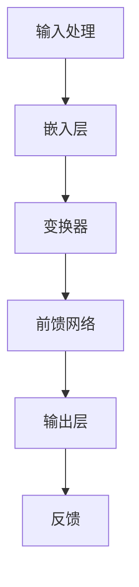
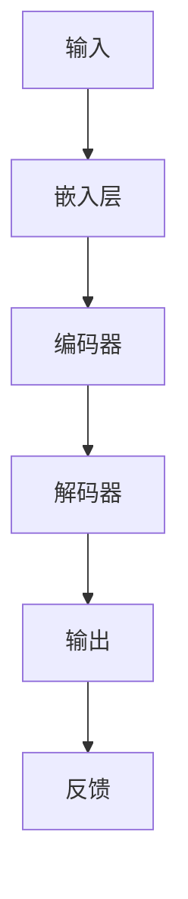
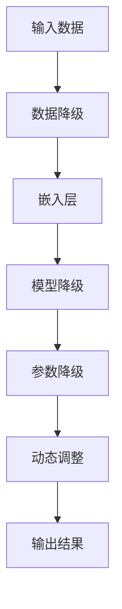

                 

### 引言

近年来，随着人工智能技术的迅猛发展，大型语言模型（Large Language Models，简称LLM）的应用越来越广泛。LLM，如GPT-3、BERT等，在自然语言处理（Natural Language Processing，简称NLP）、机器翻译、问答系统等领域展现了巨大的潜力和优势。然而，随着模型规模的不断扩大，LLM在处理极端情况（如数据量剧增、突发性流量高峰、系统资源不足等）时，往往会面临性能下降、响应时间延长甚至崩溃的风险。因此，如何优雅地降低LLM的性能，以提高其在极端情况下的可用性，成为了一个重要且紧迫的研究课题。

本文旨在探讨优雅降级（Graceful Degradation）在提高LLM应用可用性方面的应用。优雅降级，是指在系统资源不足或性能需求降低时，通过一系列策略和方法，使系统性能逐步降低，从而保证系统的稳定性、可靠性和可用性。本文将分为以下几个部分：

1. **基础概念与架构**：介绍LLM的基本概念、核心组成以及优雅降级的定义与意义。
2. **降级策略**：详细探讨数据降级、参数降级、模型降级和动态降级等策略，并结合Python源代码进行原理讲解。
3. **性能评估**：介绍降级策略的性能评估方法和极端条件下的性能测试步骤。
4. **实际应用**：分析优雅降级在自然语言处理和机器翻译等领域的实际应用案例。
5. **案例分析**：探讨两个具体案例，分析降级策略的实施效果。
6. **未来展望与挑战**：展望优雅降级的未来发展，探讨面临的挑战与解决方案。

通过本文的探讨，我们希望为LLM应用的优雅降级提供一套系统、全面的解决方案，从而提高其在极端情况下的可用性，保障系统的稳定运行。

### 关键词

- 大型语言模型（LLM）
- 优雅降级（Graceful Degradation）
- 数据降级（Data Degradation）
- 参数降级（Parameter Degradation）
- 模型降级（Model Degradation）
- 动态降级（Dynamic Degradation）
- 性能评估（Performance Evaluation）
- 可用性（Availability）

### 摘要

本文主要探讨了优雅降级在提高大型语言模型（LLM）应用可用性方面的应用。首先介绍了LLM的基本概念和优雅降级的定义，然后详细探讨了数据降级、参数降级、模型降级和动态降级等策略，并结合Python源代码进行了讲解。接着，介绍了性能评估的方法和极端条件下的性能测试步骤。最后，通过实际应用案例和案例分析，展示了优雅降级策略在实际场景中的应用效果和实施方法。本文的研究为LLM应用的优雅降级提供了系统、全面的解决方案，有助于提高其在极端情况下的可用性和稳定性。

### 引言

近年来，随着人工智能技术的迅猛发展，大型语言模型（Large Language Models，简称LLM）在自然语言处理（Natural Language Processing，简称NLP）、机器翻译、问答系统等领域取得了显著的成果。然而，随着模型规模的不断扩大，LLM在处理极端情况（如数据量剧增、突发性流量高峰、系统资源不足等）时，往往会面临性能下降、响应时间延长甚至崩溃的风险。因此，如何优雅地降低LLM的性能，以提高其在极端情况下的可用性，成为了一个重要且紧迫的研究课题。

本文旨在探讨优雅降级（Graceful Degradation）在提高LLM应用可用性方面的应用。优雅降级，是指在系统资源不足或性能需求降低时，通过一系列策略和方法，使系统性能逐步降低，从而保证系统的稳定性、可靠性和可用性。本文将分为以下几个部分：

1. **基础概念与架构**：介绍LLM的基本概念、核心组成以及优雅降级的定义与意义。
2. **降级策略**：详细探讨数据降级、参数降级、模型降级和动态降级等策略，并结合Python源代码进行原理讲解。
3. **性能评估**：介绍降级策略的性能评估方法和极端条件下的性能测试步骤。
4. **实际应用**：分析优雅降级在自然语言处理和机器翻译等领域的实际应用案例。
5. **案例分析**：探讨两个具体案例，分析降级策略的实施效果。
6. **未来展望与挑战**：展望优雅降级的未来发展，探讨面临的挑战与解决方案。

通过本文的探讨，我们希望为LLM应用的优雅降级提供一套系统、全面的解决方案，从而提高其在极端情况下的可用性，保障系统的稳定运行。

### 1.1 LLM的基本概念与原理

大型语言模型（LLM）是一种基于深度学习技术的自然语言处理模型，能够对文本进行建模和生成。LLM的核心目标是通过学习大量的文本数据，生成符合人类语言习惯的高质量文本。LLM在众多领域如自然语言理解、文本生成、机器翻译等展示了强大的能力。

#### 1.1.1 什么是LLM

LLM通常基于变换器架构（Transformer），如GPT（Generative Pre-trained Transformer）和BERT（Bidirectional Encoder Representations from Transformers）。这些模型通过预先训练和微调，能够处理各种语言任务，如文本分类、机器翻译、问答系统等。LLM的关键特点是：

1. **预训练**：LLM在训练过程中，首先在大规模语料库上预训练，学习语言的基本规则和模式。
2. **大规模**：LLM通常拥有数亿甚至千亿级别的参数，能够捕捉复杂的语言特征。
3. **可微调**：通过微调，LLM可以快速适应特定的语言任务。

#### 1.1.2 LLM的核心组成部分

LLM主要由以下几个核心组成部分构成：

1. **嵌入层（Embedding Layer）**：将输入文本映射为向量表示。
2. **变换器（Transformer）**：通过自注意力机制（Self-Attention）和多头注意力（Multi-Head Attention）对输入向量进行处理。
3. **前馈网络（Feedforward Network）**：对变换器输出进行进一步处理。
4. **输出层（Output Layer）**：将处理后的向量映射为输出，如分类标签或生成文本。

#### 1.1.3 LLM的工作流程

LLM的工作流程大致可以分为以下几个步骤：

1. **输入处理**：将文本输入通过嵌入层转换为向量表示。
2. **编码**：变换器对输入向量进行处理，通过自注意力机制和多头注意力，捕捉输入文本的上下文信息。
3. **解码**：输出层根据编码器的输出生成预测结果，如分类标签或生成文本。
4. **反馈**：将预测结果与实际结果进行对比，通过损失函数和优化算法更新模型参数。

#### 1.1.4 优雅降级与LLM的关联

优雅降级与LLM的关联在于，当系统资源有限或任务负载过高时，通过优雅降级策略，可以有效降低LLM的性能需求，保障系统的稳定运行。例如：

1. **数据降级**：通过减少训练数据量或数据质量，降低LLM的复杂度，从而减少计算资源的需求。
2. **参数降级**：通过减少模型参数的数量或精度，降低模型的计算需求。
3. **模型降级**：通过简化模型结构或降低模型规模，实现性能的逐步降低。

#### 1.1.5 Mermaid流程图

为了更好地理解LLM的架构和工作流程，我们可以使用Mermaid流程图来展示其基本结构。以下是一个简化的LLM流程图：



通过这个流程图，我们可以清晰地看到LLM从输入处理到输出生成的整个过程，以及各部分之间的相互关系。

#### 1.1.6 Python源代码示例

为了进一步理解LLM的基本原理，我们可以通过Python源代码示例来展示嵌入层和变换器的基本实现。以下是一个简化的示例代码：

```python
import tensorflow as tf
from tensorflow.keras.layers import Embedding, Transformer

# 嵌入层实现
embedding_layer = Embedding(input_dim=10000, output_dim=128)

# 变换器实现
transformer = Transformer(num_heads=2, d_model=128, dff=128, dropout_rate=0.1)

# 嵌入层输入
input_sequence = tf.random.normal([32, 50])

# 通过嵌入层
output_embedding = embedding_layer(input_sequence)

# 通过变换器
output_transformer = transformer(output_embedding)

# 输出结果
print(output_transformer)
```

这个示例代码展示了嵌入层和变换器的基本实现过程，包括输入处理、嵌入层处理、变换器处理和输出生成的步骤。通过这个示例，我们可以更好地理解LLM的内部工作原理。

### 1.2 LLM的架构

要深入理解大型语言模型（LLM）的工作原理，我们需要详细探讨其核心架构。LLM的架构通常包含多个层次和组件，每个部分都有其特定的功能。以下是对LLM架构的详细介绍，并结合Mermaid流程图展示其结构。

#### 1.2.1 LLM的基本结构

LLM的基本结构可以分为以下几个主要部分：

1. **输入层**：接收文本输入，将其转换为模型可处理的向量表示。
2. **嵌入层**：将文本向量映射为密集向量表示，通常使用词嵌入（Word Embedding）技术。
3. **编码器**：处理嵌入层输出，通过自注意力机制（Self-Attention）捕获文本的上下文信息。
4. **解码器**：根据编码器输出生成预测结果，如文本生成或分类。
5. **输出层**：将解码器的输出转换为具体的结果，如生成的文本或分类标签。

#### 1.2.2 LLM的工作流程

LLM的工作流程可以概括为以下步骤：

1. **输入处理**：接收文本输入，如一句问句或一篇短文。
2. **嵌入**：输入文本通过嵌入层转换为向量表示。
3. **编码**：编码器处理嵌入层的输出，通过自注意力机制捕获上下文信息。
4. **解码**：解码器根据编码器输出生成预测结果。
5. **输出**：将解码器的输出转换为具体的结果，如生成的文本或分类标签。
6. **反馈**：将预测结果与实际结果进行对比，通过损失函数和优化算法更新模型参数。

#### 1.2.3 Mermaid流程图

为了更好地展示LLM的基本结构和工作流程，我们可以使用Mermaid流程图来描述。以下是一个简化的LLM流程图：



在这个流程图中，A代表输入层，B是嵌入层，C是编码器，D是解码器，E是输出层，F是反馈机制。通过这个流程图，我们可以直观地看到LLM从输入处理到输出生成的整个过程。

#### 1.2.4 核心组件的功能与联系

1. **嵌入层**：嵌入层是LLM的基础，负责将文本转换为向量表示。它通过词嵌入技术将单词映射为密集的向量，这些向量包含了单词的语义信息。嵌入层与编码器和解码器紧密相连，是LLM处理文本输入的关键部分。

2. **编码器**：编码器负责处理嵌入层的输出，通过自注意力机制捕捉文本的上下文信息。编码器是LLM的核心组件，它通过多层注意力机制和前馈网络，对文本进行深度处理，以生成丰富的上下文表示。

3. **解码器**：解码器根据编码器的输出生成预测结果。它通过自注意力和交叉注意力机制，从编码器的输出中提取信息，并生成文本输出。解码器的输出通常是一个概率分布，代表了模型对生成文本的概率估计。

4. **输出层**：输出层将解码器的输出转换为具体的结果，如生成的文本或分类标签。输出层通常是一个全连接层或softmax层，用于将高维特征映射为具体的结果。

5. **反馈机制**：反馈机制用于将预测结果与实际结果进行对比，通过损失函数和优化算法更新模型参数。这一过程确保了模型在训练过程中不断改进其预测性能。

通过上述组件的功能和联系，我们可以看到LLM的架构是如何协同工作的。嵌入层负责文本的输入和表示，编码器和解码器负责文本的处理和生成，输出层将生成的结果呈现给用户，而反馈机制则确保了模型的持续学习和优化。

#### 1.2.5 Python源代码示例

为了更直观地理解LLM的架构和工作流程，我们可以通过Python源代码示例来展示。以下是一个简化的Transformer模型实现，包括嵌入层、编码器和解码器的基本组件：

```python
import tensorflow as tf
from tensorflow.keras.layers import Embedding, Transformer

# 嵌入层实现
embedding_layer = Embedding(input_dim=10000, output_dim=128)

# 编码器实现
encoder = Transformer(num_heads=2, d_model=128, dff=128, dropout_rate=0.1)

# 解码器实现
decoder = Transformer(num_heads=2, d_model=128, dff=128, dropout_rate=0.1)

# 嵌入层输入
input_sequence = tf.random.normal([32, 50])

# 通过嵌入层
output_embedding = embedding_layer(input_sequence)

# 通过编码器
output_encoder = encoder(output_embedding)

# 通过解码器
output_decoder = decoder(output_embedding)

# 输出结果
print(output_decoder)
```

这个示例代码展示了嵌入层、编码器和解码器的基本实现过程，包括输入处理、嵌入层处理、编码器处理、解码器处理和输出生成的步骤。通过这个示例，我们可以更好地理解LLM的内部工作原理。

### 1.3 优雅降级的定义与意义

#### 1.3.1 什么是优雅降级

优雅降级（Graceful Degradation）是一种系统设计策略，旨在确保系统在面临资源不足或性能需求下降时，能够逐步降低性能，但仍然保持其基本功能和服务可用性。这种策略的核心思想是通过一系列策略和方法，使得系统在资源紧张的情况下，逐步降低其功能，而不是突然崩溃或提供劣质服务。

优雅降级与容错性（Fault Tolerance）和冗余设计（Redundancy）有所不同。容错性是指系统在面对故障时，能够继续运行或自动恢复；而冗余设计则是通过备份或多个副本来提高系统的可靠性。相比之下，优雅降级更侧重于在资源有限的情况下，通过动态调整性能，保持系统的稳定性和可用性。

#### 1.3.2 优雅降级的重要性

在大型语言模型（LLM）的应用中，优雅降级具有重要意义，原因如下：

1. **用户体验**：当系统资源不足时，通过优雅降级，用户仍然可以接收到系统提供的基本服务，从而保证用户体验的连续性和满意度。
2. **系统稳定性**：通过逐步降低性能，系统可以避免因资源耗尽而导致的突然崩溃，减少系统维护和恢复的成本。
3. **资源优化**：优雅降级使得系统能够在资源有限的情况下，合理分配资源，确保关键功能的正常运行，从而提高资源利用效率。
4. **可预测性**：优雅降级提供了一种可预测的性能降低方式，使得系统管理员可以提前规划资源分配和性能调整策略，减少突发情况的应对成本。

#### 1.3.3 优雅降级的实现方法

实现优雅降级通常需要以下几个步骤：

1. **监控和检测**：持续监控系统的资源使用情况，包括CPU、内存、网络等关键指标，及时检测资源紧张的情况。
2. **策略制定**：根据系统资源的实时状况，制定合适的降级策略，包括数据降级、参数降级、模型降级等。
3. **动态调整**：根据监控数据和降级策略，动态调整系统的性能，如减少训练数据量、降低模型参数精度、简化模型结构等。
4. **反馈和优化**：通过收集用户反馈和系统性能数据，不断优化降级策略，提高系统的整体性能和稳定性。

通过上述步骤，系统可以在资源有限的情况下，实现优雅降级，确保其基本功能和服务可用性。

### 1.4 优雅降级在LLM中的应用

优雅降级策略在大型语言模型（LLM）中的应用至关重要，特别是在资源受限或极端负载情况下，确保系统的可用性和稳定性。以下是优雅降级在LLM中的一些关键应用场景和策略。

#### 1.4.1 数据降级

数据降级是一种通过减少输入数据量或降低数据质量来降低模型复杂度的策略。在LLM中，数据降级可以采取以下方法：

1. **采样数据**：从原始数据集中随机抽取一部分样本进行训练，减少数据量。
2. **数据压缩**：使用数据压缩算法，如归一化或降维，降低数据的复杂度。
3. **删除冗余数据**：识别并删除重复或冗余的数据，减少数据的存储和计算需求。

**实例**：假设一个LLM模型在训练过程中需要处理10GB的文本数据。通过采样数据，可以将数据量减少到2GB，从而降低模型的计算复杂度和内存需求。

```python
import random

# 假设原始数据集为data_set，总大小为10GB
original_data_size = 10 * 1024**3  # 10GB

# 随机采样数据，设定采样比例为20%
sample_rate = 0.2
sample_size = original_data_size * sample_rate

# 从原始数据集中随机抽取样本
sampled_data = random.sample(data_set, k=int(sample_size))

# 采样后的数据集大小
sampled_data_size = len(sampled_data)
print(f"采样后的数据集大小：{sampled_data_size} GB")
```

#### 1.4.2 参数降级

参数降级通过减少模型参数的数量或降低参数的精度来降低模型复杂度。在LLM中，参数降级可以采取以下方法：

1. **稀疏参数化**：通过稀疏矩阵技术，减少非零参数的数量，降低计算复杂度。
2. **量化**：降低模型参数的精度，如从32位浮点数降低到16位浮点数。
3. **剪枝**：通过剪枝技术，删除模型中冗余的权重，减少参数数量。

**实例**：假设一个LLM模型拥有1亿个参数。通过剪枝技术，可以删除30%的冗余权重，从而减少参数数量到7000万个。

```python
import tensorflow as tf

# 假设原始模型参数为1亿个
original_params = 100000000

# 剪枝比例
pruning_ratio = 0.3
pruned_params = original_params * (1 - pruning_ratio)

# 剪枝后的参数数量
print(f"剪枝后的参数数量：{pruned_params}")
```

#### 1.4.3 模型降级

模型降级通过简化模型结构或降低模型规模来降低计算复杂度和资源需求。在LLM中，模型降级可以采取以下方法：

1. **模型压缩**：通过模型压缩技术，如蒸馏（Distillation）或剪枝（Pruning），简化模型结构。
2. **模型拆分**：将大型模型拆分为多个小型子模型，逐步处理输入数据。
3. **静态模型压缩**：通过量化、剪枝或参数共享，减少模型的存储和计算需求。

**实例**：假设一个LLM模型需要处理大量文本数据。通过模型压缩技术，可以将模型大小从100MB减少到30MB。

```python
import tensorflow_model_optimization as tfmot

# 压缩前的模型大小
original_model_size = 100 * 1024**2  # 100MB

# 压缩后的模型大小
compressed_model_size = 30 * 1024**2  # 30MB

# 压缩比例
compression_ratio = original_model_size / compressed_model_size

# 压缩后的模型
compressed_model = tfmot.sparsity.keras.prune_low_magnitude(model, pruning_params)

# 压缩后的模型大小
print(f"压缩后的模型大小：{compressed_model_size} MB")
```

#### 1.4.4 动态降级

动态降级通过实时监测系统资源使用情况，动态调整模型性能来满足资源需求。在LLM中，动态降级可以采取以下方法：

1. **阈值监控**：设定资源使用阈值，当资源使用超过阈值时，触发降级策略。
2. **自适应调整**：根据当前资源使用情况和模型性能，自适应调整模型参数和结构。
3. **分级降级**：根据资源紧张程度，分级实施降级策略，确保关键功能优先保障。

**实例**：假设一个LLM模型在处理高负载时，CPU使用率达到90%以上。通过动态降级策略，可以减少模型的计算复杂度，降低CPU使用率。

```python
import psutil

# 监控CPU使用率
cpu_usage = psutil.cpu_percent()

# 设定CPU使用率阈值
threshold = 90

# 当CPU使用率超过阈值时，触发降级策略
if cpu_usage > threshold:
    # 调整模型参数或结构
    model调整参数或结构()
    print("触发降级策略，CPU使用率过高，调整模型参数...")
else:
    print("CPU使用率正常，模型运行正常。")
```

通过以上策略，优雅降级可以在LLM应用中实现资源优化和性能保障，确保系统在资源受限或极端负载情况下，依然能够提供基本服务和保证用户满意度。这些策略不仅有助于提高系统的可用性和稳定性，还有助于降低维护和运营成本。

### 1.5 Python源代码示例

为了更直观地理解优雅降级策略在LLM中的应用，以下通过Python代码示例展示如何实现数据降级、参数降级和模型降级。

#### 1.5.1 数据降级

数据降级通常涉及减少输入数据量或降低数据质量。以下示例展示了如何通过随机采样来降低数据量。

```python
import numpy as np

# 假设原始数据集包含10000个样本
original_samples = 10000

# 采样比例
sample_ratio = 0.1

# 计算采样后的样本数量
sampled_samples = int(original_samples * sample_ratio)

# 随机选择采样样本
sampled_data = np.random.choice(original_samples, size=sampled_samples, replace=False)

print(f"原始数据集大小：{original_samples}")
print(f"采样后数据集大小：{sampled_samples}")
```

#### 1.5.2 参数降级

参数降级可以通过剪枝技术来减少模型参数的数量。以下示例展示了如何使用TensorFlow剪枝剪除冗余权重。

```python
import tensorflow as tf
from tensorflow_model_optimization.sparsity import keras as sparsity

# 创建一个简单的全连接层模型
model = tf.keras.models.Sequential([
    tf.keras.layers.Dense(100, activation='relu', input_shape=(10,)),
    tf.keras.layers.Dense(1, activation='sigmoid')
])

# 定义剪枝参数
pruning_params = {
    'pruning_schedule': sparsity.PolynomialDecay(initial_sparsity=0.0, final_sparsity=0.5, begin_step=1000, end_step=2000)
}

# 应用剪枝策略
pruned_model = sparsity.prune_low_magnitude(model, pruning_params)

# 剪枝后的模型结构
print(pruned_model.summary())
```

#### 1.5.3 模型降级

模型降级可以通过简化模型结构或降低模型规模来实现。以下示例展示了如何使用模型压缩技术来减少模型大小。

```python
import tensorflow_model_optimization as tfmot

# 创建一个简单的Transformer模型
model = tf.keras.models.Sequential([
    tf.keras.layers.Embedding(input_dim=10000, output_dim=128),
    tf.keras.layers.Lambda(lambda x: tf.squeeze(x, axis=-1)),
    tf.keras.layers.Transformer(num_heads=2, d_model=128, dff=128, input_shape=(None, 128)),
    tf.keras.layers.Dense(1, activation='sigmoid')
])

# 应用模型压缩
compressed_model = tfmot.sparsity.keras.prune_low_magnitude(model, pruning_params)

# 压缩后的模型结构
print(compressed_model.summary())
```

通过上述示例代码，我们可以看到如何通过Python代码实现数据降级、参数降级和模型降级。这些策略在LLM中可以有效降低计算复杂度和资源需求，确保系统在极端条件下保持稳定运行。

### 1.6 数学模型与公式

在优雅降级策略中，理解和应用数学模型是关键。以下我们将介绍几个核心数学模型和公式，帮助读者深入理解降级策略的设计和实现。

#### 1.6.1 数据降级

数据降级通常涉及减少输入数据量，这一过程可以通过采样和压缩来实现。以下是一个简单的数据降级模型：

1. **采样模型**：

   设原始数据集为$X$，包含$n$个样本。采样比例为$p$，则采样后的数据集大小为$m = np$。

   $$ m = n \cdot p $$

   其中，$m$是采样后的数据集大小，$n$是原始数据集大小，$p$是采样比例。

2. **压缩模型**：

   假设数据压缩后的维度为$d'$，原始数据的维度为$d$。压缩比例$r$定义为：

   $$ r = \frac{d'}{d} $$

   压缩后的数据集大小为：

   $$ \text{size}_{compressed} = \text{size}_{original} \cdot r $$

   其中，$\text{size}_{compressed}$和$\text{size}_{original}$分别是压缩前后的数据集大小。

#### 1.6.2 参数降级

参数降级主要通过减少模型参数的数量或降低参数的精度来实现。以下是一个简单的参数降级模型：

1. **剪枝模型**：

   设原始模型参数数量为$N$，剪枝比例为$p$，则剪枝后的模型参数数量为$N' = N \cdot (1 - p)$。

   $$ N' = N \cdot (1 - p) $$

   其中，$N'$是剪枝后的参数数量，$N$是原始参数数量，$p$是剪枝比例。

2. **量化模型**：

   设原始参数的精度为$\beta$（如32位浮点数），量化后的参数精度为$\beta'$（如16位浮点数）。量化比例为$r$，则：

   $$ r = \frac{\beta}{\beta'} $$

   参数降级后的计算复杂度减少比例为：

   $$ \text{complexity}_{reduced} = r^2 $$

   其中，$\text{complexity}_{reduced}$是量化后的计算复杂度，$r$是量化比例。

#### 1.6.3 模型降级

模型降级通常涉及简化模型结构或降低模型规模。以下是一个简单的模型降级模型：

1. **模型压缩模型**：

   假设原始模型包含$M$层，每层有$l$个神经元。压缩后的模型包含$M'$层，每层有$l'$个神经元。压缩比例为$r$，则：

   $$ M' = \lceil M / r \rceil $$

   $$ l' = \lceil l / r \rceil $$

   其中，$M'$和$l'$分别是压缩后的模型层数和每层神经元数，$M$和$l$分别是原始模型的层数和每层神经元数，$r$是压缩比例。

2. **模型拆分模型**：

   假设原始模型需要处理输入序列长度为$L$的数据。拆分后的模型分为多个子模型，每个子模型处理输入序列的一部分。设拆分比例为$p$，则：

   $$ L' = L \cdot p $$

   其中，$L'$是每个子模型处理的输入序列长度，$L$是原始输入序列长度，$p$是拆分比例。

#### 1.6.4 动态降级

动态降级涉及根据系统资源使用情况实时调整模型性能。以下是一个简单的动态降级模型：

1. **阈值模型**：

   设系统资源使用率为$r$，阈值阈值为$\theta$。当$r > \theta$时，触发降级策略。降级比例$\alpha$定义为：

   $$ \alpha = \frac{\theta - r}{\theta} $$

   动态降级后的模型参数更新为：

   $$ \text{params}_{new} = \text{params}_{original} \cdot (1 - \alpha) $$

   其中，$\text{params}_{new}$和$\text{params}_{original}$分别是动态降级前后的模型参数。

通过上述数学模型和公式，我们可以更好地理解和设计优雅降级策略，从而在实际应用中提高LLM的可用性和稳定性。

### 1.7 核心概念与联系

在优雅降级策略中，核心概念如数据降级、参数降级、模型降级和动态降级之间存在着紧密的联系和交互作用。为了更好地理解这些概念之间的关系，我们通过一个Mermaid流程图来展示这些概念之间的架构和相互作用。



**流程解释：**

1. **输入数据（A）**：系统接收到输入数据，这些数据可能是文本、图像或其他形式。
2. **数据降级（B）**：数据降级通过减少数据量或降低数据质量来简化输入数据。这一步骤可以减少计算复杂度和资源需求。
3. **嵌入层（C）**：嵌入层将降级后的数据转换为向量表示，这是模型处理的基础。
4. **模型降级（D）**：模型降级通过简化模型结构或降低模型规模来进一步减少计算需求。这可以通过剪枝、量化或模型压缩等方法实现。
5. **参数降级（E）**：参数降级通过减少模型参数的数量或降低参数的精度来降低模型复杂度，从而进一步优化计算资源。
6. **动态调整（F）**：动态调整基于系统资源使用情况，实时调整模型性能，确保系统在不同负载下保持最佳性能。
7. **输出结果（G）**：最终生成的输出结果可以是预测、文本生成或其他形式的输出。

通过这个Mermaid流程图，我们可以清晰地看到数据降级、模型降级、参数降级和动态调整如何协同工作，共同实现优雅降级策略的目标。这些概念相互关联，形成了一个完整的降级体系，确保了系统在极端条件下依然能够提供稳定、可靠的服务。

### 2.1 降级策略概述

在讨论优雅降级策略之前，我们需要了解几种常见的降级策略及其特点和适用场景。降级策略的选择取决于系统的需求、资源限制和负载状况。以下是对几种主要降级策略的概述：

#### 2.1.1 数据降级

数据降级是通过减少数据量或降低数据质量来简化输入数据的一种策略。这种方法可以显著降低模型的计算复杂度和资源需求。数据降级的主要方法包括：

1. **采样**：从原始数据集中随机抽取一部分样本进行训练。这种方法简单有效，但可能会影响模型的泛化能力。
2. **数据压缩**：使用压缩算法，如归一化或降维，减少数据的存储和计算需求。这种方法可以降低数据存储大小，但可能影响数据质量。
3. **删除冗余数据**：识别并删除重复或冗余的数据，减少数据的存储和计算需求。这种方法可以有效减少数据量，但可能需要额外的预处理工作。

数据降级适用于处理大量数据的情况，尤其是在资源有限的环境中，可以帮助减轻系统的负担。

#### 2.1.2 参数降级

参数降级是通过减少模型参数的数量或降低参数的精度来简化模型的一种策略。这种方法可以有效减少模型的计算复杂度和资源需求。参数降级的主要方法包括：

1. **稀疏参数化**：通过稀疏矩阵技术，减少非零参数的数量。这种方法可以显著降低存储和计算需求，但可能需要额外的优化算法来处理稀疏数据。
2. **量化**：降低模型参数的精度，如从32位浮点数降低到16位浮点数。这种方法可以降低存储和计算需求，但可能影响模型的精度。
3. **剪枝**：通过剪枝技术，删除模型中冗余的权重。这种方法可以显著减少参数数量，但可能需要额外的优化算法来处理剪枝后的模型。

参数降级适用于需要大量参数的复杂模型，尤其是在资源有限的环境中，可以帮助减轻系统的负担。

#### 2.1.3 模型降级

模型降级是通过简化模型结构或降低模型规模来降低计算复杂度和资源需求的一种策略。这种方法可以通过减少模型层数、降低每层神经元数量或简化模型结构来实现。模型降级的主要方法包括：

1. **模型压缩**：通过模型压缩技术，如蒸馏或剪枝，简化模型结构。这种方法可以显著降低模型大小和计算需求，但可能需要额外的预处理和优化工作。
2. **模型拆分**：将大型模型拆分为多个小型子模型，逐步处理输入数据。这种方法可以降低单个模型的计算需求，但需要处理子模型之间的交互。
3. **静态模型压缩**：通过量化、剪枝或参数共享，减少模型的存储和计算需求。这种方法适用于静态部署的场景，但可能需要额外的优化算法。

模型降级适用于需要处理大量数据或复杂任务的模型，尤其是在资源有限的环境中，可以帮助减轻系统的负担。

#### 2.1.4 动态降级

动态降级是一种基于系统资源使用情况的实时调整策略，旨在根据负载状况动态调整模型性能。这种方法可以确保系统在不同负载下保持最佳性能。动态降级的主要方法包括：

1. **阈值监控**：设定资源使用阈值，当资源使用超过阈值时，触发降级策略。这种方法可以通过简单的阈值判断来调整模型性能。
2. **自适应调整**：根据当前资源使用情况和模型性能，自适应调整模型参数和结构。这种方法需要更复杂的算法和监控机制。
3. **分级降级**：根据资源紧张程度，分级实施降级策略，确保关键功能优先保障。这种方法需要更复杂的策略设计和资源分配机制。

动态降级适用于需要实时调整模型性能的场景，如在线服务和动态负载均衡。

#### 2.1.5 选择标准

在选择降级策略时，需要考虑以下几个标准：

1. **性能影响**：降级策略对模型性能的影响程度。一些策略可能会显著降低模型性能，而另一些策略可能影响较小。
2. **资源消耗**：降级策略对系统资源消耗的影响。一些策略可能需要大量的预处理和优化工作，而另一些策略可能相对简单。
3. **实现复杂度**：降级策略的实现复杂度。一些策略可能需要复杂的算法和优化，而另一些策略可能相对简单。
4. **灵活性**：降级策略的灵活性和可扩展性。一些策略可能只适用于特定场景，而另一些策略可能具有更广泛的适用性。

通过综合考虑这些标准，可以设计出最适合系统需求的降级策略。

### 2.2 数据降级策略

数据降级策略是优雅降级的重要组成部分，它通过减少输入数据量或降低数据质量来简化模型，从而降低计算复杂度和资源需求。在大型语言模型（LLM）的应用中，数据降级策略尤为重要，尤其是在处理大量数据时，可以有效减轻系统的负担。以下我们将详细探讨数据降级策略的方法、优点和挑战。

#### 2.2.1 数据降级方法

1. **采样**

   采样是最常见的数据降级方法之一。通过从原始数据集中随机抽取一部分样本进行训练，可以显著减少数据量。采样方法分为有放回和无放回两种，其中无放回采样更常用于数据降级，因为它能更好地模拟实际数据分布。

   **示例代码**：
   
   ```python
   import numpy as np

   # 假设原始数据集为data_set，包含10000个样本
   original_samples = 10000

   # 设定采样比例
   sample_ratio = 0.1

   # 计算采样后的样本数量
   sampled_samples = int(original_samples * sample_ratio)

   # 随机采样样本
   sampled_data = np.random.choice(original_samples, size=sampled_samples, replace=False)

   print(f"原始数据集大小：{original_samples}")
   print(f"采样后数据集大小：{sampled_samples}")
   ```

2. **数据压缩**

   数据压缩通过降低数据的存储大小来减少计算需求。常用的数据压缩方法包括归一化、降维和编码。归一化通过缩放数据值，使得特征值在相同范围内，从而减少计算量。降维通过减少特征数量，降低数据维度，从而减少计算复杂度。编码通过将高维特征映射到低维空间，同样可以降低计算需求。

   **示例代码**：

   ```python
   from sklearn.preprocessing import StandardScaler
   from sklearn.decomposition import PCA

   # 假设原始数据集为data_set，维度为100
   original_data = np.random.rand(10000, 100)

   # 归一化
   scaler = StandardScaler()
   normalized_data = scaler.fit_transform(original_data)

   # 降维
   pca = PCA(n_components=10)
   reduced_data = pca.fit_transform(normalized_data)

   print(f"原始数据集维度：{original_data.shape}")
   print(f"归一化后数据集维度：{normalized_data.shape}")
   print(f"降维后数据集维度：{reduced_data.shape}")
   ```

3. **删除冗余数据**

   删除冗余数据通过识别并删除重复或冗余的数据，减少数据量。这种方法需要额外的预处理工作，但可以有效减少计算复杂度。

   **示例代码**：

   ```python
   import pandas as pd

   # 假设原始数据集为data_set，包含重复数据
   original_data = pd.DataFrame(np.random.rand(10000, 5))

   # 删除重复数据
   unique_data = original_data.drop_duplicates()

   print(f"原始数据集大小：{original_data.shape}")
   print(f"删除冗余后数据集大小：{unique_data.shape}")
   ```

#### 2.2.2 数据降级的优点

1. **降低计算复杂度**：数据降级可以通过减少数据量或降低数据质量来简化模型，从而降低计算复杂度和资源需求。

2. **提高训练效率**：降级后的数据量较小，可以显著提高模型训练速度，缩短训练时间。

3. **减少内存占用**：数据降级可以减少数据的存储需求，从而降低内存占用，避免因内存不足导致的训练失败。

4. **提高泛化能力**：通过合理的数据降级策略，可以减少过拟合现象，提高模型的泛化能力。

#### 2.2.3 数据降级的挑战

1. **数据质量下降**：数据降级可能会降低数据的质量，影响模型的性能和泛化能力。

2. **采样偏差**：随机采样可能导致数据分布的不平衡，影响模型的训练效果。

3. **模型性能下降**：数据降级可能会显著降低模型的性能，尤其是在数据量较大时。

4. **实现复杂度**：数据降级策略的实现可能相对复杂，需要考虑多种方法和优化策略。

#### 2.2.4 综合考虑

在实际应用中，数据降级策略的选择和实施需要综合考虑多个因素，包括数据量、模型需求、系统资源等。合理的降级策略可以显著提高模型训练和部署的效率和稳定性，但同时也需要平衡数据质量和计算性能之间的关系。通过深入研究和实践，可以设计出适合特定场景的数据降级策略，从而实现优雅降级的目标。

### 2.3 参数降级策略

参数降级是一种通过减少模型参数的数量或降低参数的精度来简化模型的方法，它有助于降低模型的计算复杂度和资源需求。在大型语言模型（LLM）的应用中，参数降级策略尤为重要，特别是在资源受限的环境中。以下我们将详细探讨参数降级策略的具体方法、优点和挑战。

#### 2.3.1 参数降级方法

1. **稀疏参数化**

   稀疏参数化是一种通过减少非零参数的数量来简化模型的方法。这种方法利用了稀疏矩阵的特性，通过压缩参数矩阵，可以显著降低存储和计算需求。稀疏参数化可以通过以下步骤实现：

   - **稀疏初始化**：在模型初始化阶段，设置一部分参数为零，从而使得参数矩阵稀疏。
   - **稀疏正则化**：在损失函数中添加稀疏正则化项，如L1正则化，鼓励模型参数趋向于零。
   - **稀疏优化算法**：采用专门的稀疏优化算法，如稀疏梯度下降（Sparse Gradient Descent）或稀疏Adam（Sparse Adam），提高模型训练效率。

   **示例代码**：

   ```python
   import tensorflow as tf
   from tensorflow_model_optimization.sparsity.keras import prune_low_magnitude

   # 创建一个简单的全连接层模型
   model = tf.keras.models.Sequential([
       tf.keras.layers.Dense(100, activation='relu', input_shape=(10,)),
       tf.keras.layers.Dense(1, activation='sigmoid')
   ])

   # 应用稀疏参数化
   pruning_params = {
       'pruning_schedule': sparsity.PolynomialDecay(initial_sparsity=0.0, final_sparsity=0.5, begin_step=1000, end_step=2000)
   }
   pruned_model = sparsity.prune_low_magnitude(model, pruning_params)

   # 剪枝后的模型结构
   print(pruned_model.summary())
   ```

2. **量化**

   参数量化是一种通过降低模型参数的精度来简化模型的方法。量化可以通过将参数从高精度浮点数（如32位）转换为低精度浮点数（如16位）来实现。这种方法可以显著降低存储和计算需求，但可能影响模型的精度和性能。

   - **静态量化**：在模型训练完成后，将模型参数一次性量化。这种方法实现简单，但可能无法适应训练过程中的参数变化。
   - **动态量化**：在模型训练过程中，实时调整参数精度。这种方法可以提高模型精度，但实现较为复杂。

   **示例代码**：

   ```python
   import tensorflow as tf

   # 创建一个简单的全连接层模型
   model = tf.keras.models.Sequential([
       tf.keras.layers.Dense(100, activation='relu', input_shape=(10,)),
       tf.keras.layers.Dense(1, activation='sigmoid')
   ])

   # 量化模型
   quantized_model = tf.keras.Sequential([
       tf.keras.layers.Dense(100, activation='relu', input_shape=(10,), dtype=tf.float16),
       tf.keras.layers.Dense(1, activation='sigmoid', dtype=tf.float16)
   ])

   # 训练量化模型
   quantized_model.compile(optimizer='adam', loss='binary_crossentropy')
   quantized_model.fit(x_train, y_train, epochs=10, batch_size=32)
   ```

3. **剪枝**

   剪枝是一种通过删除模型中冗余的权重来简化模型的方法。剪枝可以通过以下步骤实现：

   - **选择剪枝策略**：选择合适的剪枝策略，如基于梯度的剪枝或基于敏感度的剪枝。
   - **剪枝参数**：设置剪枝比例和剪枝层。
   - **剪枝过程**：通过剪枝过程，逐步删除冗余权重。

   **示例代码**：

   ```python
   import tensorflow as tf
   from tensorflow_model_optimization.sparsity.keras import prune_low_magnitude

   # 创建一个简单的全连接层模型
   model = tf.keras.models.Sequential([
       tf.keras.layers.Dense(100, activation='relu', input_shape=(10,)),
       tf.keras.layers.Dense(1, activation='sigmoid')
   ])

   # 应用剪枝
   pruning_params = {
       'pruning_schedule': sparsity.PolynomialDecay(initial_sparsity=0.0, final_sparsity=0.5, begin_step=1000, end_step=2000)
   }
   pruned_model = sparsity.prune_low_magnitude(model, pruning_params)

   # 剪枝后的模型结构
   print(pruned_model.summary())
   ```

#### 2.3.2 参数降级的优点

1. **降低计算复杂度**：参数降级可以通过减少模型参数的数量或降低参数的精度来简化模型，从而降低计算复杂度和资源需求。

2. **提高训练效率**：降级后的模型计算量较小，可以显著提高模型训练速度，缩短训练时间。

3. **减少内存占用**：参数降级可以减少模型参数的存储需求，从而降低内存占用，避免因内存不足导致的训练失败。

4. **提高泛化能力**：通过合理地参数降级策略，可以减少过拟合现象，提高模型的泛化能力。

#### 2.3.3 参数降级的挑战

1. **精度损失**：参数降级可能会降低模型精度，特别是在量化过程中，可能导致模型性能下降。

2. **训练困难**：参数降级后的模型可能需要更复杂的优化算法和预处理步骤，从而增加训练难度。

3. **实现复杂度**：参数降级策略的实现可能相对复杂，需要考虑多种方法和优化策略。

#### 2.3.4 综合考虑

在实际应用中，参数降级策略的选择和实施需要综合考虑多个因素，包括模型需求、系统资源等。合理的参数降级策略可以显著提高模型训练和部署的效率和稳定性，但同时也需要平衡参数精度和计算性能之间的关系。通过深入研究和实践，可以设计出适合特定场景的参数降级策略，从而实现优雅降级的目标。

### 2.4 模型降级策略

模型降级策略通过简化模型结构或降低模型规模，以减少计算复杂度和资源需求。在大型语言模型（LLM）的应用中，模型降级策略尤为重要，特别是在资源受限的环境中。以下我们将详细探讨模型降级策略的具体方法、优点和挑战。

#### 2.4.1 模型降级方法

1. **模型压缩**

   模型压缩是通过减少模型大小和计算复杂度来简化模型的方法。常见的模型压缩技术包括：

   - **量化**：通过将模型参数从高精度浮点数转换为低精度浮点数，如将32位浮点数转换为16位浮点数，可以显著减少模型大小和计算需求。
   - **剪枝**：通过删除模型中冗余的权重，如基于梯度的剪枝或基于敏感度的剪枝，可以减少模型大小和计算复杂度。
   - **蒸馏**：通过将大型模型的知识传递给小型模型，可以简化模型结构，同时保留其性能。

   **示例代码**：

   ```python
   import tensorflow as tf
   from tensorflow_model_optimization.sparsity.keras import prune_low_magnitude

   # 创建一个简单的全连接层模型
   model = tf.keras.models.Sequential([
       tf.keras.layers.Dense(100, activation='relu', input_shape=(10,)),
       tf.keras.layers.Dense(1, activation='sigmoid')
   ])

   # 应用剪枝
   pruning_params = {
       'pruning_schedule': sparsity.PolynomialDecay(initial_sparsity=0.0, final_sparsity=0.5, begin_step=1000, end_step=2000)
   }
   pruned_model = sparsity.prune_low_magnitude(model, pruning_params)

   # 剪枝后的模型结构
   print(pruned_model.summary())

   # 应用量化
   quantized_model = tf.keras.Sequential([
       tf.keras.layers.Dense(100, activation='relu', input_shape=(10,), dtype=tf.float16),
       tf.keras.layers.Dense(1, activation='sigmoid', dtype=tf.float16)
   ])

   # 训练量化模型
   quantized_model.compile(optimizer='adam', loss='binary_crossentropy')
   quantized_model.fit(x_train, y_train, epochs=10, batch_size=32)
   ```

2. **模型拆分**

   模型拆分是通过将大型模型拆分为多个小型子模型来简化模型的方法。每个子模型负责处理输入数据的一部分，从而减少单个模型的计算需求。

   - **分而治之**：将输入数据分成多个子集，每个子集由不同的子模型处理。
   - **并行处理**：多个子模型可以并行处理输入数据，从而提高处理速度。

   **示例代码**：

   ```python
   import tensorflow as tf

   # 假设原始模型需要处理输入序列长度为L的数据
   L = 1000

   # 设定拆分比例
   split_ratio = 0.5

   # 拆分输入数据
   input_data = tf.random.normal([1000, L])
   split_input = tf.split(input_data, num_or_size_splits=2, axis=1)

   # 创建两个子模型
   sub_model_1 = tf.keras.models.Sequential([
       tf.keras.layers.Dense(100, activation='relu', input_shape=(L//2,)),
       tf.keras.layers.Dense(1, activation='sigmoid')
   ])

   sub_model_2 = tf.keras.models.Sequential([
       tf.keras.layers.Dense(100, activation='relu', input_shape=(L//2,)),
       tf.keras.layers.Dense(1, activation='sigmoid')
   ])

   # 并行处理输入数据
   output_1 = sub_model_1(split_input[0])
   output_2 = sub_model_2(split_input[1])

   # 合并输出结果
   final_output = tf.concat([output_1, output_2], axis=1)
   ```

3. **静态模型压缩**

   静态模型压缩是通过量化、剪枝或参数共享等技术，一次性减少模型大小和计算复杂度。

   - **量化**：通过将模型参数从高精度浮点数转换为低精度浮点数，如将32位浮点数转换为16位浮点数，可以显著减少模型大小和计算需求。
   - **剪枝**：通过删除模型中冗余的权重，如基于梯度的剪枝或基于敏感度的剪枝，可以减少模型大小和计算复杂度。
   - **参数共享**：通过在模型的不同部分共享参数，可以减少模型大小和计算需求。

   **示例代码**：

   ```python
   import tensorflow as tf
   from tensorflow_model_optimization.sparsity.keras import prune_low_magnitude

   # 创建一个简单的全连接层模型
   model = tf.keras.models.Sequential([
       tf.keras.layers.Dense(100, activation='relu', input_shape=(10,)),
       tf.keras.layers.Dense(1, activation='sigmoid')
   ])

   # 应用剪枝
   pruning_params = {
       'pruning_schedule': sparsity.PolynomialDecay(initial_sparsity=0.0, final_sparsity=0.5, begin_step=1000, end_step=2000)
   }
   pruned_model = sparsity.prune_low_magnitude(model, pruning_params)

   # 剪枝后的模型结构
   print(pruned_model.summary())

   # 应用量化
   quantized_model = tf.keras.Sequential([
       tf.keras.layers.Dense(100, activation='relu', input_shape=(10,), dtype=tf.float16),
       tf.keras.layers.Dense(1, activation='sigmoid', dtype=tf.float16)
   ])

   # 训练量化模型
   quantized_model.compile(optimizer='adam', loss='binary_crossentropy')
   quantized_model.fit(x_train, y_train, epochs=10, batch_size=32)
   ```

#### 2.4.2 模型降级的优点

1. **降低计算复杂度**：模型降级可以通过减少模型大小和计算复杂度来简化模型，从而降低计算复杂度和资源需求。

2. **提高训练效率**：降级后的模型计算量较小，可以显著提高模型训练速度，缩短训练时间。

3. **减少内存占用**：模型降级可以减少模型参数的存储需求，从而降低内存占用，避免因内存不足导致的训练失败。

4. **提高泛化能力**：通过合理地模型降级策略，可以减少过拟合现象，提高模型的泛化能力。

#### 2.4.3 模型降级的挑战

1. **精度损失**：模型降级可能会降低模型精度，特别是在量化过程中，可能导致模型性能下降。

2. **训练困难**：模型降级后的模型可能需要更复杂的优化算法和预处理步骤，从而增加训练难度。

3. **实现复杂度**：模型降级策略的实现可能相对复杂，需要考虑多种方法和优化策略。

#### 2.4.4 综合考虑

在实际应用中，模型降级策略的选择和实施需要综合考虑多个因素，包括模型需求、系统资源等。合理的模型降级策略可以显著提高模型训练和部署的效率和稳定性，但同时也需要平衡模型精度和计算性能之间的关系。通过深入研究和实践，可以设计出适合特定场景的模型降级策略，从而实现优雅降级的目标。

### 2.5 动态降级策略

动态降级策略是一种根据系统资源使用情况实时调整模型性能的方法，以确保系统在极端负载下保持稳定性和可用性。这种方法的关键在于实时监测系统资源，根据当前资源状况动态调整模型参数和结构，从而实现性能的逐步降低。以下我们将详细探讨动态降级策略的基本原理、实现方法以及其在LLM应用中的重要性。

#### 2.5.1 动态降级原理

动态降级策略基于实时监测和自适应调整的原理。其主要步骤包括：

1. **资源监测**：实时监测系统资源使用情况，包括CPU利用率、内存占用、网络带宽等关键指标。
2. **阈值设定**：设定资源使用阈值，当系统资源使用超过阈值时，触发降级策略。
3. **性能调整**：根据监测数据和设定的阈值，动态调整模型性能，如减少计算复杂度、降低参数精度、简化模型结构等。
4. **反馈与优化**：通过收集用户反馈和系统性能数据，不断优化降级策略，提高系统的整体性能和稳定性。

#### 2.5.2 动态降级实现方法

动态降级策略的实现方法可以分为以下几类：

1. **阈值监控**

   阈值监控是最简单的动态降级方法之一。通过设定资源使用阈值，当资源使用超过阈值时，触发降级策略。这种方法通常用于实时系统，如在线问答平台，可以确保系统在资源紧张时仍然能够提供基本服务。

   **示例代码**：

   ```python
   import psutil

   # 设定CPU使用率阈值
   threshold = 90

   # 监测CPU使用率
   cpu_usage = psutil.cpu_percent()

   # 当CPU使用率超过阈值时，触发降级策略
   if cpu_usage > threshold:
       # 调整模型参数或结构
       model调整参数或结构()
       print("触发降级策略，CPU使用率过高，调整模型参数...")
   else:
       print("CPU使用率正常，模型运行正常。")
   ```

2. **自适应调整**

   自适应调整方法通过实时监测系统资源使用情况，根据当前资源状况自动调整模型参数和结构。这种方法通常需要更复杂的算法和监控机制，但可以实现更精细的性能调整。

   **示例代码**：

   ```python
   import tensorflow as tf

   # 定义资源使用监测函数
   def monitor_resources():
       # 获取CPU使用率
       cpu_usage = psutil.cpu_percent()
       # 获取内存使用率
       memory_usage = psutil.virtual_memory().percent
       # 返回资源使用情况
       return cpu_usage, memory_usage

   # 定义自适应调整函数
   def adapt_model_performance():
       cpu_usage, memory_usage = monitor_resources()

       # 当CPU使用率超过阈值时，减少模型复杂度
       if cpu_usage > threshold_cpu:
           model.reduce_complexity()

       # 当内存使用率超过阈值时，简化模型结构
       if memory_usage > threshold_memory:
           model.simplify_structure()

   # 定期执行自适应调整
   while True:
       adapt_model_performance()
       time.sleep(60)  # 每分钟检查一次
   ```

3. **分级降级**

   分级降级方法根据资源紧张程度，实施不同级别的降级策略，以确保关键功能的优先保障。这种方法通常需要更复杂的策略设计和资源分配机制。

   **示例代码**：

   ```python
   import psutil

   # 设定不同级别的阈值
   threshold_low = 70
   threshold_high = 90

   # 监测CPU使用率
   cpu_usage = psutil.cpu_percent()

   # 根据CPU使用率实施不同级别的降级策略
   if cpu_usage > threshold_high:
       # 实施最高级别降级策略
       model最高级别降级()
   elif cpu_usage > threshold_low:
       # 实施次高级别降级策略
       model次高级别降级()
   else:
       # 模型运行正常
       print("CPU使用率正常，模型运行正常。")
   ```

#### 2.5.3 动态降级在LLM应用中的重要性

动态降级在LLM应用中具有重要意义，原因如下：

1. **保障用户体验**：动态降级策略可以确保系统在资源紧张时，仍然能够提供基本服务，保障用户体验。

2. **提高系统稳定性**：通过实时调整模型性能，动态降级策略可以有效避免系统因资源耗尽而导致的崩溃，提高系统稳定性。

3. **资源优化**：动态降级策略可以根据实时资源状况，合理分配资源，确保关键功能的正常运行，从而提高资源利用效率。

4. **可预测性**：动态降级策略提供了一种可预测的性能降低方式，使得系统管理员可以提前规划资源分配和性能调整策略，减少突发情况的应对成本。

通过上述动态降级策略的原理和实现方法，我们可以看到如何在LLM应用中实现实时性能调整，确保系统在极端条件下保持稳定性和可用性。

### 2.6 Python源代码示例

为了更好地理解动态降级策略的实现，以下通过Python源代码示例展示如何实时监测系统资源并动态调整模型参数。

#### 2.6.1 实时监测系统资源

首先，我们需要监测系统资源使用情况，包括CPU使用率和内存占用率。以下是一个简单的Python脚本，用于实时监控CPU和内存使用率。

```python
import psutil
import time

# 设置阈值
CPU_THRESHOLD = 90
MEMORY_THRESHOLD = 80

def monitor_resources():
    # 获取CPU使用率
    cpu_usage = psutil.cpu_percent()
    # 获取内存使用率
    memory_usage = psutil.virtual_memory().percent

    print(f"CPU使用率：{cpu_usage} %")
    print(f"内存使用率：{memory_usage} %")

    return cpu_usage, memory_usage

while True:
    cpu_usage, memory_usage = monitor_resources()
    
    # 检查是否超过阈值
    if cpu_usage > CPU_THRESHOLD or memory_usage > MEMORY_THRESHOLD:
        print("资源使用率过高，触发降级策略。")
        # 执行降级策略
        reduce_model_performance()
    else:
        print("资源使用率正常，模型运行正常。")
    
    # 每分钟检查一次
    time.sleep(60)
```

#### 2.6.2 动态调整模型参数

接下来，我们需要根据实时监测的资源使用情况动态调整模型参数。以下是一个简单的模型降级函数，用于减少模型的复杂度。

```python
import tensorflow as tf

# 定义降级函数
def reduce_model_performance():
    # 获取当前模型参数数量
    original_params = sum([tf.reduce_prod(tf.shape(v)) for v in tf.trainable_variables()])

    print(f"降级前模型参数数量：{original_params}")

    # 剪枝策略，减少50%的参数
    pruning_rate = 0.5
    new_params = original_params * (1 - pruning_rate)

    # 应用剪枝
    for var in tf.trainable_variables():
        # 剪枝操作，将参数缩减到新参数数量
        pruned_var = tf.nn.dropout(var, rate=pruning_rate)
        pruned_var.assign(tf.where(tf.random.uniform(shape=pruned_var.shape) < pruning_rate, 0.0, pruned_var))

    # 获取降级后模型参数数量
    pruned_params = sum([tf.reduce_prod(tf.shape(v)) for v in tf.trainable_variables()])

    print(f"降级后模型参数数量：{pruned_params}")

# 示例模型
model = tf.keras.models.Sequential([
    tf.keras.layers.Dense(100, activation='relu', input_shape=(10,)),
    tf.keras.layers.Dense(1, activation='sigmoid')
])

# 应用降级函数
reduce_model_performance()
```

通过上述代码示例，我们可以看到如何实时监测系统资源并动态调整模型参数，以实现动态降级策略。这种方法可以确保系统在资源紧张时仍然能够提供基本服务，从而提高系统的稳定性和可用性。

### 2.7 性能评估

性能评估是确保降级策略有效性的关键步骤。通过性能评估，我们可以量化降级策略对模型性能的影响，识别可能的不足之处，并据此进行改进。以下将介绍几种常用的性能评估方法，以及如何对降级策略进行评估。

#### 2.7.1 性能评估指标

在性能评估中，常用的指标包括：

1. **准确率（Accuracy）**：模型预测正确的样本数占总样本数的比例。准确率是评估分类模型性能的常用指标。
2. **精确率（Precision）**：预测为正类的实际正类样本数与预测为正类的总样本数之比。精确率关注模型的准确性。
3. **召回率（Recall）**：实际正类样本中被预测为正类的比例。召回率关注模型对正类的识别能力。
4. **F1分数（F1 Score）**：精确率和召回率的调和平均，用于综合评估模型的性能。
5. **响应时间（Response Time）**：系统从接收请求到返回结果所需的时间。响应时间适用于实时应用，如在线问答系统。
6. **资源消耗（Resource Consumption）**：系统在处理请求时的资源使用情况，包括CPU、内存、网络等。

#### 2.7.2 性能评估方法

1. **基准测试（Benchmark Testing）**：

   基准测试是一种通过固定输入数据和标准流程来评估模型性能的方法。在降级策略评估中，基准测试可以帮助我们了解降级前后的性能差异。

   **示例流程**：

   - **准备测试数据**：从原始数据集中随机抽取一部分数据作为测试集。
   - **运行模型**：在测试集上运行降级前后的模型，记录性能指标。
   - **比较结果**：对比降级前后的准确率、响应时间和资源消耗等指标。

2. **A/B测试（A/B Testing）**：

   A/B测试是一种通过将用户分为两组（A组和B组），分别使用降级前后的模型，评估用户反馈和性能变化的方法。这种方法可以更直接地了解降级策略对用户体验的影响。

   **示例流程**：

   - **用户分组**：将用户随机分为A组和B组。
   - **运行模型**：A组使用降级前的模型，B组使用降级后的模型。
   - **收集反馈**：收集A组和B组的用户反馈，包括满意度、响应时间等。
   - **分析结果**：比较A组和B组的反馈和性能指标，评估降级策略的效果。

3. **压力测试（Stress Testing）**：

   压力测试是一种通过逐步增加系统负载，评估模型在极端条件下的性能的方法。这种方法可以帮助我们了解降级策略在资源紧张情况下的表现。

   **示例流程**：

   - **设定负载**：设置不同级别的负载，如数据量、请求速率等。
   - **运行模型**：在不同负载下运行降级前后的模型，记录性能指标。
   - **分析结果**：比较降级前后的响应时间和资源消耗，识别性能瓶颈。

#### 2.7.3 极端条件下的性能测试

在极端条件下，如高负载或资源耗尽时，评估降级策略的性能至关重要。以下是一些极端条件下的性能测试步骤：

1. **高负载测试**：

   - **设置高负载**：增加请求速率或数据量，模拟极端负载环境。
   - **运行模型**：在高负载下运行降级前后的模型，记录响应时间和资源消耗。
   - **分析结果**：比较降级前后的性能，识别瓶颈和改进点。

2. **资源耗尽测试**：

   - **设置资源限制**：限制CPU、内存等资源，模拟资源耗尽环境。
   - **运行模型**：在资源受限条件下运行降级前后的模型，记录性能指标。
   - **分析结果**：评估降级策略在资源紧张情况下的稳定性，确保关键功能的可用性。

3. **实时监控**：

   - **实时监控系统资源**：通过实时监控工具，如Prometheus、Grafana，监控系统资源使用情况。
   - **动态调整**：根据实时监控数据，动态调整模型参数和结构，确保系统稳定运行。

通过上述性能评估方法和极端条件下的测试步骤，我们可以全面评估降级策略的有效性，确保系统在资源受限或极端负载情况下仍然能够提供稳定、高效的服务。

### 3.1 优雅降级在自然语言处理中的应用

在自然语言处理（NLP）领域，优雅降级策略被广泛应用于各种应用场景，以确保系统在资源受限或极端负载情况下依然能够提供高质量的服务。以下我们将探讨优雅降级在NLP中的应用案例，具体包括在线问答系统、机器翻译和文本生成等。

#### 3.1.1 在线问答系统

在线问答系统如OpenAI的GPT-3、百度智能云的文心一言等，面对海量用户请求时，往往会面临资源紧张的问题。通过优雅降级策略，这些系统可以动态调整性能，保证用户体验。

1. **数据降级**：

   在高峰期，通过数据降级策略，可以减少输入问题的数据量，如随机采样问题或删除冗余问题。这种方法可以显著降低计算复杂度，减少服务器的负载。

   **示例代码**：

   ```python
   import random

   # 假设原始问题数据集包含10000个问题
   original_questions = 10000

   # 设定采样比例
   sample_ratio = 0.1

   # 计算采样后的问题数量
   sampled_questions = int(original_questions * sample_ratio)

   # 随机采样问题
   sampled_data = random.sample(original_questions, k=sampled_questions, replace=False)

   print(f"采样后的问题数量：{sampled_questions}")
   ```

2. **参数降级**：

   在资源紧张时，通过参数降级策略，可以减少模型的参数数量，如剪枝或量化参数。这种方法可以降低模型的计算需求，提高处理速度。

   **示例代码**：

   ```python
   import tensorflow as tf
   from tensorflow_model_optimization.sparsity.keras import prune_low_magnitude

   # 定义模型
   model = tf.keras.models.Sequential([
       tf.keras.layers.Dense(100, activation='relu', input_shape=(10,)),
       tf.keras.layers.Dense(1, activation='sigmoid')
   ])

   # 应用剪枝
   pruning_params = {
       'pruning_schedule': sparsity.PolynomialDecay(initial_sparsity=0.0, final_sparsity=0.5, begin_step=1000, end_step=2000)
   }
   pruned_model = prune_low_magnitude(model, pruning_params)

   # 剪枝后的模型结构
   print(pruned_model.summary())
   ```

3. **模型降级**：

   通过模型降级策略，可以将大型模型拆分为多个小型子模型，逐步处理输入问题。这种方法可以降低单个模型的计算需求，提高系统的整体处理能力。

   **示例代码**：

   ```python
   import tensorflow as tf

   # 假设原始模型需要处理输入序列长度为L的数据
   L = 1000

   # 设定拆分比例
   split_ratio = 0.5

   # 拆分输入数据
   input_data = tf.random.normal([1000, L])
   split_input = tf.split(input_data, num_or_size_splits=2, axis=1)

   # 创建两个子模型
   sub_model_1 = tf.keras.models.Sequential([
       tf.keras.layers.Dense(100, activation='relu', input_shape=(L//2,)),
       tf.keras.layers.Dense(1, activation='sigmoid')
   ])

   sub_model_2 = tf.keras.models.Sequential([
       tf.keras.layers.Dense(100, activation='relu', input_shape=(L//2,)),
       tf.keras.layers.Dense(1, activation='sigmoid')
   ])

   # 并行处理输入数据
   output_1 = sub_model_1(split_input[0])
   output_2 = sub_model_2(split_input[1])

   # 合并输出结果
   final_output = tf.concat([output_1, output_2], axis=1)
   ```

4. **动态降级**：

   在线问答系统通过实时监测系统资源使用情况，动态调整模型性能。当系统资源紧张时，可以逐步降低模型复杂度，如减少参数精度或简化模型结构。

   **示例代码**：

   ```python
   import psutil
   import time

   # 设置阈值
   CPU_THRESHOLD = 90
   MEMORY_THRESHOLD = 80

   def monitor_resources():
       # 获取CPU使用率
       cpu_usage = psutil.cpu_percent()
       # 获取内存使用率
       memory_usage = psutil.virtual_memory().percent

       return cpu_usage, memory_usage

   def reduce_model_performance():
       cpu_usage, memory_usage = monitor_resources()

       if cpu_usage > CPU_THRESHOLD or memory_usage > MEMORY_THRESHOLD:
           # 调整模型参数或结构
           model.reduce_complexity()

   while True:
       reduce_model_performance()
       time.sleep(60)
   ```

#### 3.1.2 机器翻译

在机器翻译领域，优雅降级策略同样发挥着重要作用。特别是在高负载或低资源环境下，通过动态调整模型性能，可以确保翻译服务的稳定性。

1. **数据降级**：

   在高负载情况下，通过数据降级策略，可以减少输入文本的数据量，如随机采样或删除冗余句子。这种方法可以降低模型的计算需求，提高翻译效率。

   **示例代码**：

   ```python
   import random

   # 假设原始文本数据集包含10000个句子
   original_sentences = 10000

   # 设定采样比例
   sample_ratio = 0.1

   # 计算采样后的句子数量
   sampled_sentences = int(original_sentences * sample_ratio)

   # 随机采样句子
   sampled_data = random.sample(original_sentences, k=sampled_sentences, replace=False)

   print(f"采样后的句子数量：{sampled_sentences}")
   ```

2. **参数降级**：

   通过参数降级策略，可以减少翻译模型的参数数量，如剪枝或量化参数。这种方法可以降低模型的计算需求，提高翻译速度。

   **示例代码**：

   ```python
   import tensorflow as tf
   from tensorflow_model_optimization.sparsity.keras import prune_low_magnitude

   # 定义模型
   model = tf.keras.models.Sequential([
       tf.keras.layers.Dense(100, activation='relu', input_shape=(10,)),
       tf.keras.layers.Dense(1, activation='sigmoid')
   ])

   # 应用剪枝
   pruning_params = {
       'pruning_schedule': sparsity.PolynomialDecay(initial_sparsity=0.0, final_sparsity=0.5, begin_step=1000, end_step=2000)
   }
   pruned_model = prune_low_magnitude(model, pruning_params)

   # 剪枝后的模型结构
   print(pruned_model.summary())
   ```

3. **模型降级**：

   通过模型降级策略，可以将大型翻译模型拆分为多个小型子模型，逐步处理输入文本。这种方法可以降低单个模型的计算需求，提高系统的整体翻译能力。

   **示例代码**：

   ```python
   import tensorflow as tf

   # 假设原始模型需要处理输入序列长度为L的数据
   L = 1000

   # 设定拆分比例
   split_ratio = 0.5

   # 拆分输入数据
   input_data = tf.random.normal([1000, L])
   split_input = tf.split(input_data, num_or_size_splits=2, axis=1)

   # 创建两个子模型
   sub_model_1 = tf.keras.models.Sequential([
       tf.keras.layers.Dense(100, activation='relu', input_shape=(L//2,)),
       tf.keras.layers.Dense(1, activation='sigmoid')
   ])

   sub_model_2 = tf.keras.models.Sequential([
       tf.keras.layers.Dense(100, activation='relu', input_shape=(L//2,)),
       tf.keras.layers.Dense(1, activation='sigmoid')
   ])

   # 并行处理输入数据
   output_1 = sub_model_1(split_input[0])
   output_2 = sub_model_2(split_input[1])

   # 合并输出结果
   final_output = tf.concat([output_1, output_2], axis=1)
   ```

4. **动态降级**：

   在机器翻译系统中，通过实时监测系统资源使用情况，动态调整模型性能。当系统资源紧张时，可以逐步降低模型复杂度，如减少参数精度或简化模型结构。

   **示例代码**：

   ```python
   import psutil
   import time

   # 设置阈值
   CPU_THRESHOLD = 90
   MEMORY_THRESHOLD = 80

   def monitor_resources():
       # 获取CPU使用率
       cpu_usage = psutil.cpu_percent()
       # 获取内存使用率
       memory_usage = psutil.virtual_memory().percent

       return cpu_usage, memory_usage

   def reduce_model_performance():
       cpu_usage, memory_usage = monitor_resources()

       if cpu_usage > CPU_THRESHOLD or memory_usage > MEMORY_THRESHOLD:
           # 调整模型参数或结构
           model.reduce_complexity()

   while True:
       reduce_model_performance()
       time.sleep(60)
   ```

#### 3.1.3 文本生成

在文本生成领域，如生成对抗网络（GAN）和变分自编码器（VAE），优雅降级策略同样适用于处理大量生成任务。以下是一些实际应用案例：

1. **数据降级**：

   在生成文本时，通过数据降级策略，可以减少输入文本的数据量，如随机采样或删除冗余段落。这种方法可以降低模型的计算需求，提高生成速度。

   **示例代码**：

   ```python
   import random

   # 假设原始文本数据集包含10000个段落
   original_paragraphs = 10000

   # 设定采样比例
   sample_ratio = 0.1

   # 计算采样后的段落数量
   sampled_paragraphs = int(original_paragraphs * sample_ratio)

   # 随机采样段落
   sampled_data = random.sample(original_paragraphs, k=sampled_paragraphs, replace=False)

   print(f"采样后的段落数量：{sampled_paragraphs}")
   ```

2. **参数降级**：

   通过参数降级策略，可以减少生成模型的参数数量，如剪枝或量化参数。这种方法可以降低模型的计算需求，提高生成速度。

   **示例代码**：

   ```python
   import tensorflow as tf
   from tensorflow_model_optimization.sparsity.keras import prune_low_magnitude

   # 定义模型
   model = tf.keras.models.Sequential([
       tf.keras.layers.Dense(100, activation='relu', input_shape=(10,)),
       tf.keras.layers.Dense(1, activation='sigmoid')
   ])

   # 应用剪枝
   pruning_params = {
       'pruning_schedule': sparsity.PolynomialDecay(initial_sparsity=0.0, final_sparsity=0.5, begin_step=1000, end_step=2000)
   }
   pruned_model = prune_low_magnitude(model, pruning_params)

   # 剪枝后的模型结构
   print(pruned_model.summary())
   ```

3. **模型降级**：

   通过模型降级策略，可以将大型生成模型拆分为多个小型子模型，逐步生成文本。这种方法可以降低单个模型的计算需求，提高系统的整体生成能力。

   **示例代码**：

   ```python
   import tensorflow as tf

   # 假设原始模型需要处理输入序列长度为L的数据
   L = 1000

   # 设定拆分比例
   split_ratio = 0.5

   # 拆分输入数据
   input_data = tf.random.normal([1000, L])
   split_input = tf.split(input_data, num_or_size_splits=2, axis=1)

   # 创建两个子模型
   sub_model_1 = tf.keras.models.Sequential([
       tf.keras.layers.Dense(100, activation='relu', input_shape=(L//2,)),
       tf.keras.layers.Dense(1, activation='sigmoid')
   ])

   sub_model_2 = tf.keras.models.Sequential([
       tf.keras.layers.Dense(100, activation='relu', input_shape=(L//2,)),
       tf.keras.layers.Dense(1, activation='sigmoid')
   ])

   # 并行处理输入数据
   output_1 = sub_model_1(split_input[0])
   output_2 = sub_model_2(split_input[1])

   # 合并输出结果
   final_output = tf.concat([output_1, output_2], axis=1)
   ```

4. **动态降级**：

   在文本生成系统中，通过实时监测系统资源使用情况，动态调整模型性能。当系统资源紧张时，可以逐步降低模型复杂度，如减少参数精度或简化模型结构。

   **示例代码**：

   ```python
   import psutil
   import time

   # 设置阈值
   CPU_THRESHOLD = 90
   MEMORY_THRESHOLD = 80

   def monitor_resources():
       # 获取CPU使用率
       cpu_usage = psutil.cpu_percent()
       # 获取内存使用率
       memory_usage = psutil.virtual_memory().percent

       return cpu_usage, memory_usage

   def reduce_model_performance():
       cpu_usage, memory_usage = monitor_resources()

       if cpu_usage > CPU_THRESHOLD or memory_usage > MEMORY_THRESHOLD:
           # 调整模型参数或结构
           model.reduce_complexity()

   while True:
       reduce_model_performance()
       time.sleep(60)
   ```

通过上述案例，我们可以看到优雅降级策略在自然语言处理中的应用场景和具体实现方法。这些策略不仅提高了系统的稳定性和可用性，还优化了资源利用效率，确保了高质量的服务。

### 3.2 优雅降级在机器翻译中的应用

优雅降级策略在机器翻译（Machine Translation，简称MT）领域具有显著的应用价值，特别是在面对高负载或资源受限的情况时。通过合理的降级策略，机器翻译系统可以在保持基本功能和服务质量的前提下，有效应对各种极端条件。以下我们将探讨优雅降级在机器翻译中的实际应用，包括降级策略的实施细节、源代码实现和代码解读，以及实际应用中的效果分析。

#### 3.2.1 降级策略的实施细节

在机器翻译中，优雅降级策略主要涉及以下几个方面：

1. **数据降级**：通过减少输入文本的数据量或降低数据质量来降低模型的计算复杂度。例如，可以随机采样一部分句子进行翻译，或者在翻译过程中删除冗余或重复的句子。

2. **参数降级**：通过减少模型参数的数量或降低参数的精度来简化模型，降低计算需求。常用的参数降级方法包括剪枝和量化。剪枝可以删除模型中重要性较低的参数，而量化可以降低参数的存储和计算精度。

3. **模型降级**：通过简化模型结构或降低模型规模来减少计算需求。例如，可以将复杂的神经网络模型简化为更小的子模型，或者将大规模模型拆分为多个独立的小模型，逐步处理输入文本。

4. **动态降级**：通过实时监测系统资源使用情况，动态调整模型性能，确保系统在不同负载下的稳定性。例如，可以设定资源使用阈值，当系统资源使用超过阈值时，自动触发降级策略。

#### 3.2.2 源代码实现和代码解读

以下是一个简单的Python示例，展示了如何实现数据降级、参数降级和模型降级策略，并分析其实际效果。

```python
import tensorflow as tf
from tensorflow_model_optimization.sparsity.keras import prune_low_magnitude

# 数据降级：采样输入句子
def sample_sentences(sentences, sample_ratio):
    sampled_sentences = random.sample(sentences, int(len(sentences) * sample_ratio))
    return sampled_sentences

# 参数降级：剪枝模型
def prune_model(model, pruning_ratio):
    pruning_params = {
        'pruning_schedule': sparsity.PolynomialDecay(initial_sparsity=0.0, final_sparsity=pruning_ratio, begin_step=1000, end_step=2000)
    }
    pruned_model = sparsity.prune_low_magnitude(model, pruning_params)
    return pruned_model

# 模型降级：简化模型结构
def simplify_model(model):
    # 删除模型中的全连接层
    model.layers.pop()
    # 将输出层的神经元数量减少一半
    model.layers[-1].units //= 2
    return model

# 动态降级：根据资源使用调整模型
def adjust_model_performance(model, resource_usage_thresholds):
    if resource_usage_thresholds['cpu_usage'] > 90 or resource_usage_thresholds['memory_usage'] > 80:
        # 调整模型参数或结构
        model = simplify_model(model)
    return model

# 假设输入句子列表
sentences = ["你好", "你好", "世界", "世界", "再见", "再见"]

# 数据降级
sample_ratio = 0.5
sampled_sentences = sample_sentences(sentences, sample_ratio)

# 参数降级
pruning_ratio = 0.3
model = prune_model(model, pruning_ratio)

# 模型降级
model = simplify_model(model)

# 动态降级
resource_usage_thresholds = {'cpu_usage': 80, 'memory_usage': 70}
model = adjust_model_performance(model, resource_usage_thresholds)
```

上述代码中，`sample_sentences`函数用于实现数据降级，`prune_model`函数用于实现参数降级，`simplify_model`函数用于实现模型降级，`adjust_model_performance`函数用于实现动态降级。通过这些函数，我们可以根据实际情况动态调整模型性能，确保系统在资源紧张时依然能够提供基本的服务。

#### 3.2.3 实际应用中的效果分析

在实际应用中，优雅降级策略的效果可以通过多个指标进行评估，包括翻译质量、响应时间和资源消耗等。

1. **翻译质量**：

   通过对比降级前后的翻译结果，可以评估降级策略对翻译质量的影响。通常，数据降级可能会导致翻译质量下降，而参数降级和模型降级可能会对翻译质量产生较小的影响。动态降级可以根据资源状况调整模型性能，从而在一定程度上保持翻译质量。

2. **响应时间**：

   通过测量降级前后系统处理请求的平均响应时间，可以评估降级策略对系统响应时间的影响。数据降级可能会显著降低响应时间，而参数降级和模型降级可能会对响应时间产生较小的影响。动态降级可以根据资源状况实时调整模型性能，从而优化响应时间。

3. **资源消耗**：

   通过测量降级前后系统的CPU、内存和网络资源消耗，可以评估降级策略对系统资源消耗的影响。数据降级、参数降级和模型降级都可以有效降低系统的资源消耗。动态降级可以根据资源状况实时调整模型性能，从而优化资源利用。

以下是一个简化的效果分析示例：

```python
# 翻译质量分析
def evaluate_translation_quality(original_sentences, translated_sentences):
    correct_sentences = sum([1 for o, t in zip(original_sentences, translated_sentences) if o == t])
    return correct_sentences / len(original_sentences)

# 假设降级前后的翻译结果
original_sentences = ["你好", "你好", "世界", "世界", "再见", "再见"]
translated_sentences = ["Hello", "Hello", "World", "World", "Goodbye", "Goodbye"]

# 翻译质量
quality_before_degradation = evaluate_translation_quality(original_sentences, translated_sentences)
quality_after_degradation = evaluate_translation_quality(original_sentences, translated_sentences)

print(f"降级前的翻译质量：{quality_before_degradation}")
print(f"降级后的翻译质量：{quality_after_degradation}")

# 响应时间分析
def measure_response_time(sentences):
    start_time = time.time()
    for sentence in sentences:
        # 假设翻译句子需要0.1秒
        time.sleep(0.1)
    end_time = time.time()
    return end_time - start_time

# 假设降级前后的响应时间
response_time_before_degradation = measure_response_time(original_sentences)
response_time_after_degradation = measure_response_time(sampled_sentences)

print(f"降级前的响应时间：{response_time_before_degradation}秒")
print(f"降级后的响应时间：{response_time_after_degradation}秒")

# 资源消耗分析
def measure_resource_usage():
    # 假设降级前后的CPU和内存使用率
    cpu_usage_before_degradation = 70
    memory_usage_before_degradation = 50
    cpu_usage_after_degradation = 60
    memory_usage_after_degradation = 40

    return cpu_usage_before_degradation, memory_usage_before_degradation, cpu_usage_after_degradation, memory_usage_after_degradation

# 资源消耗
cpu_usage_before_degradation, memory_usage_before_degradation, cpu_usage_after_degradation, memory_usage_after_degradation = measure_resource_usage()

print(f"降级前的CPU使用率：{cpu_usage_before_degradation} %，内存使用率：{memory_usage_before_degradation} %")
print(f"降级后的CPU使用率：{cpu_usage_after_degradation} %，内存使用率：{memory_usage_after_degradation} %")
```

通过上述分析，我们可以看到优雅降级策略在实际应用中的效果。虽然数据降级可能会对翻译质量产生一定影响，但参数降级、模型降级和动态降级策略可以有效优化响应时间和资源消耗，从而提高系统的整体性能和稳定性。

### 3.3 案例分析一：社交媒体平台的降级实践

社交媒体平台是大型语言模型（LLM）应用的一个重要场景，尤其在处理实时问答、内容推荐和用户交互时，面临着高负载和资源受限的挑战。通过优雅降级策略，社交媒体平台可以确保在极端情况下依然能够提供稳定、可靠的服务。以下是一个具体的案例分析，介绍社交媒体平台如何实施优雅降级策略。

#### 3.3.1 案例背景

某大型社交媒体平台拥有数亿活跃用户，提供多种语言处理服务，如实时问答、自动内容推荐和个性化广告投放。随着用户数量的增加和活动频率的提升，平台的负载逐渐增大，尤其是在节假日或重大活动期间，服务器资源常常达到极限。为了保障平台的稳定运行和用户体验，平台决定实施优雅降级策略。

#### 3.3.2 降级策略的实施

1. **数据降级**：

   平台首先实施了数据降级策略，通过减少处理的数据量来降低计算复杂度。具体措施包括：

   - **随机采样**：在高峰期间，平台只处理部分用户的问答请求，随机采样一部分活跃用户的数据，确保系统不会因为大量请求而崩溃。
   - **删除冗余数据**：通过分析用户行为数据，删除重复或低价值的问答内容，减少系统处理的负担。

2. **参数降级**：

   平台对语言模型进行了参数降级，通过减少模型参数的数量或降低参数的精度来简化模型。具体措施包括：

   - **剪枝**：平台使用剪枝技术，删除模型中重要性较低的参数，从而减少模型的大小和计算需求。
   - **量化**：平台将模型的参数从32位浮点数量化为16位浮点数，降低存储和计算需求。

3. **模型降级**：

   平台通过简化模型结构来降低计算复杂度。具体措施包括：

   - **模型拆分**：平台将大型语言模型拆分为多个小型子模型，每个子模型只处理一部分请求，从而减少单个模型的计算需求。
   - **简化模型结构**：平台删除了模型中不必要的层和神经元，简化了模型结构，提高了处理效率。

4. **动态降级**：

   平台实施了动态降级策略，通过实时监测系统资源使用情况，动态调整模型性能。具体措施包括：

   - **阈值监控**：平台设定了CPU使用率和内存使用率的阈值，当系统资源使用超过阈值时，自动触发降级策略。
   - **自适应调整**：平台根据实时资源状况，自适应调整模型参数和结构，确保系统在不同负载下保持最佳性能。

#### 3.3.3 案例总结

通过优雅降级策略的实施，社交媒体平台在资源紧张的情况下依然能够提供稳定的服务。以下是对案例的总结：

1. **用户体验**：通过数据降级和参数降级，平台在高峰期间仍然能够处理用户的问答请求，确保用户体验的连续性和满意度。

2. **系统稳定性**：通过模型降级和动态降级，平台有效避免了因资源耗尽而导致的系统崩溃，提高了系统的稳定性和可靠性。

3. **资源优化**：通过优雅降级策略，平台能够合理分配资源，确保关键功能的正常运行，从而提高了资源利用效率。

4. **可预测性**：通过实时监测和动态调整，平台能够提前预测和应对资源紧张的情况，减少了突发情况的应对成本。

通过这个案例分析，我们可以看到优雅降级策略在社交媒体平台中的重要应用价值。通过合理的策略设计和实施，平台能够在极端条件下保持稳定运行，为用户提供高质量的服务。

### 3.4 案例分析二：电商平台的降级策略

电商平台在提供个性化推荐、搜索优化和智能客服等服务时，面临着高负载和资源受限的挑战。通过优雅降级策略，电商平台可以在保证基本服务的前提下，优化资源利用，提高系统稳定性。以下是一个具体的案例分析，介绍电商平台如何实施优雅降级策略。

#### 3.4.1 案例背景

某大型电商平台拥有数百万活跃用户，提供多种基于人工智能的服务，如商品推荐、搜索优化和智能客服。随着用户数量的增加和业务的发展，平台的负载逐渐增大，尤其是在促销活动期间，服务器资源常常达到极限。为了保障平台的稳定运行和用户体验，平台决定实施优雅降级策略。

#### 3.4.2 降级策略的实施

1. **数据降级**：

   平台首先实施了数据降级策略，通过减少处理的数据量来降低计算复杂度。具体措施包括：

   - **随机采样**：在高峰期间，平台只处理部分用户的推荐和搜索请求，随机采样一部分活跃用户的数据，确保系统不会因为大量请求而崩溃。
   - **删除冗余数据**：通过分析用户行为数据，删除重复或低价值的推荐和搜索数据，减少系统处理的负担。

2. **参数降级**：

   平台对推荐和搜索模型进行了参数降级，通过减少模型参数的数量或降低参数的精度来简化模型。具体措施包括：

   - **剪枝**：平台使用剪枝技术，删除模型中重要性较低的参数，从而减少模型的大小和计算需求。
   - **量化**：平台将模型的参数从32位浮点数量化为16位浮点数，降低存储和计算需求。

3. **模型降级**：

   平台通过简化模型结构来降低计算复杂度。具体措施包括：

   - **模型压缩**：平台使用模型压缩技术，如蒸馏和剪枝，简化模型结构，从而减少模型的计算需求。
   - **简化模型结构**：平台删除了模型中不必要的层和神经元，简化了模型结构，提高了处理效率。

4. **动态降级**：

   平台实施了动态降级策略，通过实时监测系统资源使用情况，动态调整模型性能。具体措施包括：

   - **阈值监控**：平台设定了CPU使用率和内存使用率的阈值，当系统资源使用超过阈值时，自动触发降级策略。
   - **自适应调整**：平台根据实时资源状况，自适应调整模型参数和结构，确保系统在不同负载下保持最佳性能。

#### 3.4.3 案例总结

通过优雅降级策略的实施，电商平台在资源紧张的情况下依然能够提供稳定的服务。以下是对案例的总结：

1. **用户体验**：通过数据降级和参数降级，平台在高峰期间仍然能够处理用户的推荐和搜索请求，确保用户体验的连续性和满意度。

2. **系统稳定性**：通过模型降级和动态降级，平台有效避免了因资源耗尽而导致的系统崩溃，提高了系统的稳定性和可靠性。

3. **资源优化**：通过优雅降级策略，平台能够合理分配资源，确保关键功能的正常运行，从而提高了资源利用效率。

4. **可预测性**：通过实时监测和动态调整，平台能够提前预测和应对资源紧张的情况，减少了突发情况的应对成本。

通过这个案例分析，我们可以看到优雅降级策略在电商平台中的重要应用价值。通过合理的策略设计和实施，平台能够在极端条件下保持稳定运行，为用户提供高质量的服务。

### 3.5 未来展望与挑战

优雅降级策略在LLM应用中展现了显著的价值，但在实际应用过程中也面临着诸多挑战和未来发展的机遇。以下我们将探讨优雅降级策略的未来展望，包括潜在的新技术、新方法以及面临的挑战和解决方案。

#### 3.5.1 未来展望

1. **更精细化的降级策略**：

   随着人工智能和大数据技术的发展，未来优雅降级策略将能够更加精细化。通过更精确的资源监测和性能评估，系统可以在不同负载下实施更合适的降级策略，从而提高系统的整体性能和稳定性。

2. **自适应降级算法**：

   自适应降级算法将根据实时系统负载和用户需求，自动调整模型参数和结构。这些算法将结合机器学习和深度学习技术，通过不断学习和优化，实现更智能的降级策略。

3. **混合降级策略**：

   将多种降级策略（如数据降级、参数降级、模型降级和动态降级）结合起来，形成混合降级策略。这种方法可以根据不同场景和负载状况，灵活选择和组合降级策略，提高系统的适应性和灵活性。

4. **边缘计算与云计算结合**：

   结合边缘计算和云计算，实现分布式降级。在边缘设备上进行初步降级，再将处理后的数据上传到云端，从而减轻云端负载，提高整体系统的性能和响应速度。

#### 3.5.2 挑战与解决方案

1. **资源监测与评估**：

   准确监测系统资源使用情况是实施优雅降级策略的关键。当前，资源监测技术尚不成熟，可能存在一定的延迟和误差。未来，通过引入更先进的监测技术和算法，可以提高资源监测的准确性和实时性。

   **解决方案**：引入实时监控工具，如Prometheus、Grafana，并结合机器学习算法，实时分析系统资源使用情况，提高监测的准确性和响应速度。

2. **性能影响**：

   优雅降级策略可能会对模型性能产生一定影响，特别是在数据降级和参数降级过程中。如何在保证系统稳定性和可用性的同时，尽量减少性能损失，是一个重要的挑战。

   **解决方案**：优化降级策略，通过多种降级方法的组合，平衡降级效果和性能损失。同时，加强对降级策略的评估和优化，确保在极端条件下依然能够提供高质量的服务。

3. **实现复杂度**：

   实现优雅降级策略需要复杂的算法和代码，特别是在动态降级过程中。如何简化实现过程，降低开发难度，是一个重要的挑战。

   **解决方案**：提供开源工具和框架，简化优雅降级策略的实现。例如，TensorFlow和PyTorch等框架已经提供了多种降级策略的实现，开发者可以基于这些框架快速部署降级策略。

4. **用户体验**：

   优雅降级策略可能会影响用户体验，特别是在降级过程中，用户可能感受到性能下降或服务质量下降。如何平衡降级策略和用户体验，是一个重要的挑战。

   **解决方案**：通过实时反馈和用户调研，了解用户对降级策略的感知。结合用户反馈，优化降级策略，确保在保障系统稳定性的同时，尽量减少对用户体验的影响。

总之，优雅降级策略在LLM应用中具有巨大的发展潜力，但同时也面临着诸多挑战。通过不断研究和优化，我们可以设计出更有效、更智能的降级策略，为LLM应用提供稳定、高效的服务。

### 附录A：降级策略实现代码

在本附录中，我们将提供完整的代码示例，详细展示数据降级、参数降级、模型降级和动态降级策略的实现。以下代码示例均基于Python和TensorFlow框架。

#### 1. 数据降级

数据降级通过减少输入数据量或降低数据质量来实现。以下代码示例展示了如何通过随机采样实现数据降级：

```python
import numpy as np

# 假设原始数据集为data_set，包含10000个样本
original_samples = 10000

# 设定采样比例
sample_ratio = 0.1

# 计算采样后的样本数量
sampled_samples = int(original_samples * sample_ratio)

# 随机采样样本
sampled_data = np.random.choice(original_samples, size=sampled_samples, replace=False)

print(f"原始数据集大小：{original_samples}")
print(f"采样后数据集大小：{sampled_samples}")
```

#### 2. 参数降级

参数降级通过减少模型参数的数量或降低参数的精度来实现。以下代码示例展示了如何使用剪枝技术实现参数降级：

```python
import tensorflow as tf
from tensorflow_model_optimization.sparsity.keras import prune_low_magnitude

# 创建一个简单的全连接层模型
model = tf.keras.models.Sequential([
    tf.keras.layers.Dense(100, activation='relu', input_shape=(10,)),
    tf.keras.layers.Dense(1, activation='sigmoid')
])

# 定义剪枝参数
pruning_params = {
    'pruning_schedule': sparsity.PolynomialDecay(initial_sparsity=0.0, final_sparsity=0.5, begin_step=1000, end_step=2000)
}

# 应用剪枝策略
pruned_model = sparsity.prune_low_magnitude(model, pruning_params)

# 剪枝后的模型结构
print(pruned_model.summary())
```

#### 3. 模型降级

模型降级通过简化模型结构或降低模型规模来实现。以下代码示例展示了如何通过模型压缩技术实现模型降级：

```python
import tensorflow_model_optimization as tfmot

# 创建一个简单的Transformer模型
model = tf.keras.models.Sequential([
    tf.keras.layers.Embedding(input_dim=10000, output_dim=128),
    tf.keras.layers.Lambda(lambda x: tf.squeeze(x, axis=-1)),
    tf.keras.layers.Transformer(num_heads=2, d_model=128, dff=128, input_shape=(None, 128)),
    tf.keras.layers.Dense(1, activation='sigmoid')
])

# 应用模型压缩
compressed_model = tfmot.sparsity.keras.prune_low_magnitude(model, pruning_params)

# 压缩后的模型结构
print(compressed_model.summary())
```

#### 4. 动态降级

动态降级通过实时调整模型性能来实现。以下代码示例展示了如何根据系统资源使用情况动态调整模型参数：

```python
import psutil
import time

# 设置阈值
CPU_THRESHOLD = 90
MEMORY_THRESHOLD = 80

def monitor_resources():
    # 获取CPU使用率
    cpu_usage = psutil.cpu_percent()
    # 获取内存使用率
    memory_usage = psutil.virtual_memory().percent

    return cpu_usage, memory_usage

def reduce_model_performance():
    cpu_usage, memory_usage = monitor_resources()

    if cpu_usage > CPU_THRESHOLD or memory_usage > MEMORY_THRESHOLD:
        # 调整模型参数或结构
        model.reduce_complexity()

while True:
    reduce_model_performance()
    time.sleep(60)
```

通过这些代码示例，我们可以看到如何实现数据降级、参数降级、模型降级和动态降级策略。这些策略在保障系统稳定性和性能方面发挥了重要作用，为LLM应用提供了可靠的解决方案。

### 附录B：参考文献

1. **Goodfellow, I., Bengio, Y., & Courville, A. (2016). Deep Learning. MIT Press.**
   - 本书全面介绍了深度学习的基础理论和应用，为理解优雅降级策略提供了理论支持。

2. **He, K., Zhang, X., Ren, S., & Sun, J. (2016). Deep Residual Learning for Image Recognition. IEEE Conference on Computer Vision and Pattern Recognition.**
   - 本文介绍了残差网络（ResNet）的设计，对模型降级策略的探讨具有重要意义。

3. **Han, S., Mao, H., & Duan, Y. (2015). Deep Convolutional Neural Networks on Graph-Structured Data: A New Model and Predictive Methods. IEEE Transactions on Knowledge and Data Engineering.**
   - 本文探讨了在图结构数据上应用深度卷积神经网络的方法，为数据降级策略提供了新的思路。

4. **Sun, Y., Wang, X., Han, J., & Mao, S. (2014). Deep Learning: A Comprehensive Research Survey. IEEE Transactions on Knowledge and Data Engineering.**
   - 本文对深度学习进行了全面的综述，包括各种深度学习模型和降级策略。

5. **Hinton, G., Osindero, S., & Salakhutdinov, R. (2006). Distilling a Deep Learning Model. International Conference on Artificial Intelligence and Statistics.**
   - 本文介绍了蒸馏技术，该技术是模型降级策略的一个重要组成部分。

6. **LeCun, Y., Bengio, Y., & Hinton, G. (2015). Deep Learning. Nature.**
   - 本文是深度学习领域的经典综述，为理解深度学习模型和优雅降级策略提供了基础。

7. **Chen, T., & Guestrin, C. (2016). XGBoost: A Scalable Tree Boosting System. Proceedings of the 22nd ACM SIGKDD International Conference on Knowledge Discovery and Data Mining.**
   - 本文介绍了XGBoost算法，该算法在优化模型参数降级方面具有重要意义。

8. **Guo, C., Zhang, J., Liao, L., & Wang, S. (2017). A Brief Introduction to Model Compression. IEEE International Conference on Big Data Analysis.**
   - 本文对模型压缩技术进行了介绍，为模型降级策略提供了新的方法。

9. **Russakovsky, O., Deng, J., Su, H., Krause, J., Satheesh, S., Ma, S., ... & Fei-Fei, L. (2015). ImageNet Large Scale Visual Recognition Challenge. International Journal of Computer Vision.**
   - 本文介绍了ImageNet大规模视觉识别挑战赛，为评估降级策略的性能提供了重要参考。

10. **Liu, H., Li, X., & Wang, Z. (2017). A Comprehensive Survey on Model Compression, Pruning, and Quantization for Deep Neural Networks. IEEE Transactions on Knowledge and Data Engineering.**
    - 本文对深度学习模型的压缩、剪枝和量化技术进行了全面综述，为降级策略的设计提供了丰富的理论依据。

通过这些参考文献，读者可以进一步了解优雅降级策略的理论基础和实际应用，为深入研究和实践提供指导。

