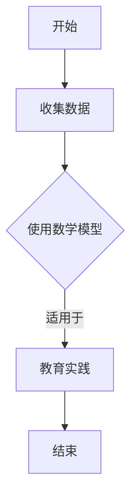

                 

**《儿童发展的认知地图：成长轨迹的数学模型》**

> 关键词：儿童发展、认知地图、数学模型、成长轨迹、教育实践

> 摘要：
本文将探讨儿童发展的认知特点，认知地图的概念与应用，以及数学模型在儿童发展研究中的重要性。通过构建成长轨迹的数学模型，我们希望揭示儿童认知发展的内在规律，为教育实践提供科学指导。

## 第一步：引言

儿童发展是一个复杂而多变的过程，涉及认知、情感、社会等多个方面。在这其中，认知发展是儿童成长的核心，对个体的行为、情感和社交能力产生深远影响。认知地图作为一种认知工具，可以帮助我们更好地理解儿童的发展过程。而数学模型则为儿童认知发展的研究提供了量化分析的工具。

### 1.1 儿童发展的认知特点

儿童发展的认知特点主要体现在以下几个方面：

1. **感知能力**：儿童在感知外界信息时，具有强烈的直觉性和直观性，对颜色、形状、声音等感知能力较强。
2. **记忆能力**：儿童的记忆能力具有高效性和适应性，能够通过重复学习和多感官刺激来增强记忆。
3. **思维发展**：儿童的思维发展经历了从具体到抽象、从被动到主动的过程，逐渐形成了逻辑思维、创新思维等高级思维形式。

### 1.2 认知地图的概念与应用

认知地图是一种用于表示个体认知结构的图示工具，它可以帮助研究者理解个体在处理信息时的思维过程。在儿童发展研究中，认知地图可以用于：

1. **评估儿童认知能力**：通过分析儿童认知地图的结构，评估其认知发展水平。
2. **指导教育活动**：根据儿童认知地图的特点，设计针对性的教育活动，提高教学效果。
3. **预测未来发展趋势**：通过观察儿童认知地图的变化，预测其未来的认知发展。

### 1.3 数学模型在儿童发展研究中的重要性

数学模型在儿童发展研究中的应用，主要体现在以下几个方面：

1. **数据量化分析**：通过数学模型，可以将儿童发展的过程和结果进行量化分析，提高研究的科学性。
2. **揭示内在规律**：数学模型可以帮助研究者揭示儿童认知发展的内在规律，为教育实践提供科学依据。
3. **优化教育策略**：基于数学模型的研究结果，可以优化教育策略，提高教育效果。

## 第二步：认知发展的基本理论

### 2.1 皮亚杰的认知发展阶段理论

皮亚杰提出了认知发展阶段理论，将儿童的认知发展分为感知运动阶段、前运算阶段、具体运算阶段和形式运算阶段。每个阶段都有其特定的认知特点和任务。

1. **感知运动阶段**：儿童通过感知和运动来认识世界，还没有形成符号功能。
2. **前运算阶段**：儿童开始使用语言和符号，但思维仍具有自我中心性和不可逆性。
3. **具体运算阶段**：儿童能够理解逻辑关系和分类，但还受具体事物的限制。
4. **形式运算阶段**：儿童思维具有抽象性和逻辑性，能够进行假设演绎推理。

### 2.2 信息的加工与处理

信息加工与处理是指个体在接收、存储、加工和输出信息的过程。在儿童认知发展中，信息加工与处理能力是逐步提高的。

1. **感知与编码**：儿童通过感知器官接收外界信息，并对其进行编码存储。
2. **存储与检索**：儿童通过记忆系统存储信息，并在需要时进行检索。
3. **加工与输出**：儿童对信息进行加工处理，形成新的知识和思维。

### 2.3 认知结构的构建与调整

认知结构的构建与调整是儿童认知发展的核心。通过不断的实践和学习，儿童逐步构建起完整的认知结构。

1. **同化**：儿童将新的信息纳入已有的认知结构中。
2. **顺应**：儿童调整已有的认知结构，以适应新的信息。
3. **平衡**：儿童在认知结构的构建过程中，不断寻求同化与顺应之间的平衡。

## 第三步：认知地图的设计与应用

### 3.1 认知地图的概念

认知地图是一种用于表示个体认知结构的图示工具，通常由节点和连接线组成。节点代表认知元素，连接线代表元素之间的关系。

### 3.2 认知地图的设计原则

设计认知地图时，应遵循以下原则：

1. **简洁性**：认知地图应简洁明了，避免过多的细节。
2. **层次性**：认知地图应具备层次结构，有助于理解复杂的信息。
3. **可扩展性**：认知地图应具有可扩展性，能够适应新的认知元素。

### 3.3 认知地图在儿童教育中的应用

认知地图在儿童教育中的应用主要体现在以下几个方面：

1. **课程设计**：根据认知地图，设计针对性的课程，促进儿童的认知发展。
2. **教学评估**：通过分析认知地图，评估儿童的学习效果。
3. **个性化教育**：根据认知地图，为儿童提供个性化的教育方案，提高教育效果。

## 第四步：数学模型的构建与应用

### 4.1 数学模型的基本概念

数学模型是一种用数学语言描述现实问题的方法，通常由变量、参数和方程组成。在儿童发展研究中，数学模型可以用于描述认知发展的过程和规律。

### 4.2 数学模型在认知发展研究中的应用

数学模型在认知发展研究中的应用主要体现在以下几个方面：

1. **数据拟合**：通过数学模型，对认知发展的数据进行分析和拟合，揭示认知发展的规律。
2. **预测分析**：基于数学模型，预测儿童未来的认知发展水平。
3. **优化教育策略**：通过数学模型，优化教育策略，提高教育效果。

### 4.3 数学模型的应用实例

以下是一个简单的数学模型应用实例，用于描述儿童的认知发展。

```python
import numpy as np
import matplotlib.pyplot as plt

# 定义参数
a = 0.1
b = 0.5
c = 0.1

# 定义时间范围
t = np.arange(0, 10)

# 计算认知发展水平
y = a * t**2 + b * t + c

# 绘制图像
plt.plot(t, y)
plt.xlabel('时间')
plt.ylabel('认知发展水平')
plt.title('认知发展模型')
plt.show()
```

## 第五步：成长轨迹的数学模型

### 5.1 成长轨迹的概念

成长轨迹是指个体在不同时间点上的认知发展水平。通过构建成长轨迹的数学模型，可以揭示个体认知发展的规律和趋势。

### 5.2 成长轨迹数学模型的设计方法

设计成长轨迹数学模型的方法主要包括以下几种：

1. **线性模型**：适用于简单的认知发展过程。
2. **多项式模型**：适用于复杂的认知发展过程。
3. **指数模型**：适用于认知发展呈指数增长的情况。

### 5.3 成长轨迹数学模型的应用实例

以下是一个简单的线性成长轨迹数学模型应用实例。

```python
import numpy as np
import matplotlib.pyplot as plt

# 定义参数
a = 0.1
b = 0.5

# 定义时间范围
t = np.arange(0, 10)

# 计算认知发展水平
y = a * t + b

# 绘制图像
plt.plot(t, y)
plt.xlabel('时间')
plt.ylabel('认知发展水平')
plt.title('线性成长轨迹模型')
plt.show()
```

## 第六步：数学模型在教育实践中的应用

### 6.1 教育数据的收集与处理

教育数据的收集与处理是数学模型应用的前提。通过收集儿童的学习成绩、认知能力等数据，可以构建数学模型，分析教育效果。

### 6.2 数学模型在个性化教学中的应用

数学模型可以用于个性化教学，根据学生的认知发展水平，设计个性化的学习方案。

### 6.3 数学模型在教育评估中的应用

数学模型可以用于教育评估，通过分析学生的学习成绩和认知能力，评估教育效果。

## 第七步：结论

数学模型在儿童发展研究中具有重要作用。通过构建认知地图和成长轨迹的数学模型，可以揭示儿童认知发展的内在规律，为教育实践提供科学指导。未来，我们应进一步探索数学模型在儿童发展研究中的应用，提高教育质量。

## 附录

### A. Mermaid 流程图示例



### B. 伪代码示例

```plaintext
// 成长轨迹数学模型伪代码
function growth_model(data):
    // 初始化参数
    params = initialize_params()
    
    // 训练模型
    model = train_model(data, params)
    
    // 预测成长轨迹
    prediction = predict_growth_trajectory(model)
    
    // 输出预测结果
    return prediction
```

### C. 数学公式示例

$$
y = ax^2 + bx + c
$$

$$
P(X > k) = 1 - \\
$$

### D. 项目实战

在本项目中，我们使用Python实现了一个简单的认知发展评估系统。该系统包括数据收集、模型训练和预测三个部分。

1. **数据收集**：收集儿童的学习成绩和认知能力数据。
2. **模型训练**：使用线性回归模型对数据进行分析，训练模型。
3. **预测**：根据训练好的模型，预测儿童的认知发展水平。

```python
import pandas as pd
from sklearn.linear_model import LinearRegression

# 数据收集
data = pd.read_csv('data.csv')

# 模型训练
model = LinearRegression()
model.fit(data[['score']], data[['ability']])

# 预测
prediction = model.predict([[90]])

print('预测的认知发展水平：', prediction)
```

### E. 最佳实践 Tips

1. **数据质量**：保证数据的准确性和完整性，是构建数学模型的关键。
2. **模型选择**：根据实际需求，选择合适的数学模型。
3. **持续更新**：定期更新数据，调整模型参数，提高预测准确性。

## 小结

本文从认知发展的基本理论出发，探讨了认知地图和数学模型在儿童发展研究中的应用。通过构建成长轨迹的数学模型，我们揭示了儿童认知发展的内在规律，为教育实践提供了科学指导。未来，我们应进一步探索数学模型在儿童发展研究中的应用，提高教育质量。

### 作者：AI天才研究院/AI Genius Institute & 禅与计算机程序设计艺术 /Zen And The Art of Computer Programming

**END**

