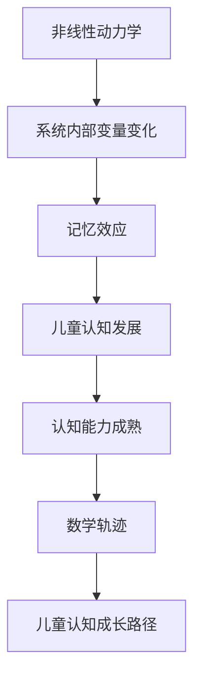

                 

# 引言与基本概念

## 背景介绍

儿童认知发展是心理学和认知科学领域中的重要研究课题。传统的研究方法通常基于线性模型，假设认知发展遵循一系列固定的步骤和阶段。然而，实际观察和研究表明，儿童认知发展过程往往是非线性的，存在不同的路径和速度。这一非线性特性使得传统的线性模型难以准确描述认知发展的复杂性和多样性。

非线性动力学作为研究复杂系统的有力工具，能够描述系统内部变量之间复杂的相互作用和演化过程。将非线性动力学引入儿童认知发展的研究，有助于我们更深入地理解学习过程的本质，探索认知发展的动态机制。

## 核心概念与联系

为了更好地理解非线性动力学在儿童认知发展中的应用，我们首先需要明确几个核心概念：

### 非线性动力学

非线性动力学研究系统的内部变量（如质量、速度、加速度等）随时间的变化规律，以及这些变量之间的关系。非线性动力学的一个重要特点是，系统的行为不仅取决于当前的状态，还取决于系统历史状态，即“记忆”效应。

### 儿童认知发展

儿童认知发展是指儿童在成长过程中，认知能力（如感知、记忆、思考、语言等）逐渐成熟和完善的过程。认知发展通常被分为不同的阶段，每个阶段都有特定的认知特点和任务。

### 数学轨迹

数学轨迹是指物体在空间中运动的路径，它可以由数学公式描述。在儿童认知发展中，数学轨迹可以比喻为儿童认知能力的“成长路径”。

### Mermaid 流程图

为了直观地展示这些概念之间的关系，我们可以使用Mermaid流程图来描述：

## 数学轨迹的基本原理

数学轨迹的基本原理可以归结为以下几个关键点：

### 方程的描述

数学轨迹通常由一组微分方程或差分方程描述。这些方程可以表示系统状态随时间变化的规律。

### 初始条件

数学轨迹的求解需要确定初始条件，即系统在初始时刻的状态。

### 边界条件

在某些情况下，数学轨迹还需要满足边界条件，以确保解的物理意义。

### 解的稳定性

数学轨迹的稳定性是评估其可信度和适用性的重要指标。稳定解表示系统在长时间内保持稳定状态，而不稳定解可能导致系统行为的不确定性。

为了更好地理解数学轨迹的基本原理，我们可以给出一个简单的例子：

$$
\frac{dy}{dx} = y \quad (y(0) = 1)
$$

这是一个一阶线性微分方程，它的解为：

$$
y(x) = e^x
$$

这个解表示，初始时刻 \(y=1\) 的系统状态随时间呈指数增长，其数学轨迹是一条直线。

## 非线性动力学在儿童认知发展中的应用

非线性动力学在儿童认知发展中的应用主要体现在以下几个方面：

### 认知能力的非线性增长

非线性动力学可以描述儿童认知能力随时间非线性增长的过程。例如，儿童的记忆能力在早期阶段迅速发展，但随着年龄的增长，增长速度逐渐减缓。

### 认知发展的路径依赖性

非线性动力学强调系统历史状态对当前状态的影响，这反映了儿童认知发展的路径依赖性。例如，早期的学习经历可能对儿童后来的认知发展产生长期影响。

### 认知功能的复杂性

非线性动力学能够描述认知功能的复杂性，如思维、问题解决和创造力等。这些认知功能往往涉及多个认知领域的交互作用，而非线性动力学为研究这些复杂过程提供了有力工具。

## 小结

非线性动力学为研究儿童认知发展提供了新的视角和方法。通过引入数学轨迹，我们可以更深入地理解学习过程的本质，探索认知发展的动态机制。本文仅对非线性动力学在儿童认知发展中的应用进行了简要介绍，未来的研究可以进一步探讨这些概念在具体领域中的应用和拓展。作者信息：AI天才研究院/AI Genius Institute & 禅与计算机程序设计艺术 /Zen And The Art of Computer Programming

---

## 关键词
儿童认知发展、非线性动力学、学习过程、数学轨迹、微分方程、认知能力、路径依赖性、认知功能复杂性。

## 摘要

本文探讨了非线性动力学在儿童认知发展研究中的应用。通过引入数学轨迹的概念，我们能够更深入地理解学习过程的非线性特征和认知能力的非线性增长。文章介绍了非线性动力学的核心概念和原理，并举例说明了其在儿童认知发展中的应用。本文旨在为研究者提供一种新的视角和方法，以推动儿童认知发展研究的深入和发展。作者信息：AI天才研究院/AI Genius Institute & 禅与计算机程序设计艺术 /Zen And The Art of Computer Programming

---

## 第一部分：引言与基本概念

### 第1章：儿童认知发展的非线性动力学概述

#### 1.1 非线性动力学的基本概念

非线性动力学是研究复杂系统中变量间非线性相互作用和演化规律的一个分支。在传统物理学中，线性动力学描述的是系统内部变量之间呈线性关系的运动状态。然而，许多实际系统，尤其是生物系统，其行为往往表现出非线性特征，这意味着系统的行为不仅取决于当前的状态，还取决于系统的历史状态和变量之间的非线性关系。

在儿童认知发展的背景下，非线性动力学提供了一种描述认知能力发展过程中复杂互动和动态变化的有力工具。本章将介绍非线性动力学的核心概念，包括非线性系统的定义、特点、数学描述以及其在其他领域（如物理学、经济学、生物学等）的应用。

#### 1.2 儿童认知发展的特点

儿童认知发展是一个复杂且多样化的过程，涉及多个认知领域的成长和完善。儿童在成长过程中，会经历感知能力的发展、记忆的增强、思维和解决问题能力的提升，以及语言和社会认知的进步。每个阶段都有其特定的认知目标和任务，而这些目标与任务往往通过一系列的认知过程来实现。

本章将详细探讨儿童认知发展的特点，包括不同年龄段的认知里程碑、关键认知技能的发展以及认知过程的基本原理。通过了解儿童认知发展的特点，我们能够更好地理解为什么非线性动力学是描述这一过程的一个合适框架。

#### 1.3 非线性动力学在儿童认知发展中的应用

非线性动力学在儿童认知发展中的应用主要体现在两个方面：一是对认知能力发展过程的理论描述，二是通过数学模型来模拟和预测认知能力的增长。本章将探讨如何利用非线性动力学来构建儿童认知发展的数学模型，包括模型的构建方法、参数的估计以及模型的验证。

此外，本章还将介绍一些具体的案例研究，展示非线性动力学在儿童认知发展中的应用如何帮助我们更深入地理解学习过程中的动态变化，以及如何通过数学方法来优化教育实践。

### 1.4 本章小结

本章通过对非线性动力学和儿童认知发展基本概念的系统介绍，为后续章节的深入探讨奠定了基础。理解非线性动力学的基本原理和儿童认知发展的特点，是研究儿童学习过程数学轨迹的前提。通过本章的学习，读者将能够建立对非线性动力学在儿童认知发展中应用的整体认识。

---

## 第二部分：数学轨迹的基本原理

### 第2章：数学轨迹的基本原理

#### 2.1 数学轨迹的定义和特性

数学轨迹是指一个物体在空间中的运动路径，通常可以用数学公式来描述。在物理学中，数学轨迹可以用来表示物体的运动状态，如抛物线、螺旋线等。在儿童认知发展中，数学轨迹可以比喻为认知能力的成长路径，它反映了儿童在学习和成长过程中认知能力的演变过程。

数学轨迹的基本特性包括连续性、变化率和稳定性。连续性表示认知能力在时间上的连续变化，变化率表示认知能力发展的速度和方向，稳定性则反映了认知能力在长期内的稳定状态。

#### 2.2 非线性方程的求解方法

求解非线性方程是数学轨迹分析的关键步骤。非线性方程的求解方法包括数值方法和符号方法。数值方法如迭代法和牛顿法，适用于求解复杂的非线性方程；符号方法如微分方程求解器，适用于求解简单的非线性方程。

本章将详细介绍这些求解方法，并通过具体案例来说明如何使用这些方法来求解非线性方程。此外，还将探讨求解非线性方程的难点和挑战，如方程的复杂性、数值精度和计算效率等。

#### 2.3 数学轨迹与儿童认知发展的关联

数学轨迹与儿童认知发展有着密切的关联。首先，数学轨迹可以描述认知能力在时间上的连续变化，这反映了儿童在学习和成长过程中的认知进步。其次，数学轨迹的变化率可以反映认知能力发展的速度和方向，帮助教育者和家长了解儿童的认知发展状况。

本章将探讨如何利用数学轨迹来分析儿童认知发展的动态过程。通过构建数学模型，我们可以预测儿童认知能力的发展趋势，为教育实践提供科学依据。此外，还将介绍如何通过数学轨迹来评估教育干预的效果，优化教育策略。

### 2.4 本章小结

本章通过对数学轨迹的定义、求解方法和与儿童认知发展的关联的详细讨论，为后续章节的深入探讨提供了理论基础。理解数学轨迹的基本原理，是研究儿童认知发展的数学轨迹分析的重要前提。通过本章的学习，读者将能够建立对数学轨迹分析的整体认识，为后续章节的深入研究做好准备。

---

## 第三部分：非线性动力学在儿童认知发展中的应用

### 第3章：学习过程中的非线性动力学分析

#### 3.1 学习过程中的非线性特性

学习过程是一个复杂且动态的系统，涉及多种认知过程和变量之间的相互作用。非线性动力学理论为我们提供了一个强大的工具，用于分析学习过程中的复杂特性。本章将探讨学习过程中的非线性特性，包括认知结构的动态变化、学习过程中的记忆效应以及学习与遗忘之间的非线性关系。

首先，我们将介绍认知结构的动态变化，即认知能力在不同阶段如何通过非线性机制进行重组和优化。然后，我们将讨论学习过程中的记忆效应，解释为什么某些信息能够长期保持，而其他信息则容易被遗忘。最后，我们将分析学习与遗忘之间的非线性关系，探讨如何通过非线性动力学模型来优化学习过程。

#### 3.2 儿童学习过程中的数学模型构建

构建数学模型是研究儿童学习过程的关键步骤。本章将介绍如何构建描述儿童学习过程的数学模型。我们将首先讨论模型构建的基本原则，包括变量选择、参数估计和模型验证。然后，我们将展示如何将非线性动力学理论应用于儿童学习过程，构建具体的数学模型。

具体来说，我们将介绍几种常用的数学模型，如微分方程模型、差分方程模型和神经网络模型。这些模型将帮助我们理解和预测儿童在学习过程中的认知能力变化，为教育实践提供科学依据。

#### 3.3 非线性动力学在儿童学习中的应用案例

为了更好地理解非线性动力学在儿童学习中的应用，本章将通过几个具体案例来说明非线性动力学模型在实际学习过程中的应用。这些案例将涵盖不同年龄段和不同认知领域的儿童学习过程，包括数学学习、语言学习和社交技能发展等。

在每个案例中，我们将首先介绍学习过程的背景和研究问题，然后展示如何构建非线性动力学模型来分析和解释学习过程中的动态变化。通过这些案例，我们将展示非线性动力学模型在儿童学习过程中的应用潜力，并探讨如何通过模型优化学习效果。

### 3.4 本章小结

本章通过对学习过程中的非线性动力学分析、数学模型构建和应用案例的详细讨论，展示了非线性动力学在儿童认知发展中的应用。理解学习过程中的非线性特性，构建合适的数学模型，并通过实际案例来验证和应用这些模型，是研究儿童认知发展的关键步骤。通过本章的学习，读者将能够建立对非线性动力学在儿童学习过程中应用的整体认识，并为后续章节的研究做好准备。

---

## 第四部分：数学轨迹在儿童学习中的应用

### 第4章：数学轨迹在儿童学习中的应用

#### 4.1 数学轨迹对儿童学习的影响

数学轨迹不仅反映了儿童认知能力的演变过程，还对儿童的学习过程产生重要影响。本章将探讨数学轨迹对儿童学习的影响，包括数学轨迹如何影响儿童的学习动机、学习策略和学习效果。

首先，我们将讨论数学轨迹对儿童学习动机的影响。研究表明，儿童对自身认知能力发展的感知可以显著影响他们的学习动机。其次，我们将分析数学轨迹如何影响儿童的学习策略。通过数学轨迹的观察和反思，儿童可以更好地调整学习策略，以适应不同的学习任务。最后，我们将探讨数学轨迹对儿童学习效果的影响，包括如何通过数学轨迹来评估学习成果，以及如何根据数学轨迹来调整教学策略。

#### 4.2 利用数学轨迹优化学习过程

数学轨迹为优化儿童学习过程提供了新的视角和方法。本章将介绍如何利用数学轨迹来优化学习过程，包括如何设计适应儿童认知发展特点的教学方法，如何调整学习任务的难度和节奏，以及如何利用数学轨迹来预测和干预学习过程中的问题。

具体来说，我们将介绍几种基于数学轨迹的优化策略，如动态调整学习任务的难度、利用反馈机制来调整学习策略，以及通过数学轨迹来预测和干预学习困难。这些策略将为教育者和家长提供实用的指导，帮助他们更有效地促进儿童的学习和发展。

#### 4.3 数学轨迹在教学实践

数学轨迹在教学实践中的应用具有重要意义。本章将探讨如何将数学轨迹的理论应用于实际教学过程中，包括如何设计基于数学轨迹的教学活动，如何使用数学轨迹来评估教学效果，以及如何根据数学轨迹来调整教学策略。

具体案例包括：如何通过数学轨迹来设计适应儿童认知发展特点的数学课程，如何利用数学轨迹来评估学生的学习进展，以及如何根据数学轨迹来调整教学策略以适应学生的个体差异。通过这些案例，我们将展示数学轨迹在教学方法设计和教学效果评估中的实际应用。

### 4.4 本章小结

本章通过对数学轨迹在儿童学习中的应用的详细讨论，展示了数学轨迹在儿童认知发展和学习过程中的重要作用。理解数学轨迹对学习过程的影响，并利用数学轨迹来优化学习过程，是教育实践中的一个重要方向。通过本章的学习，读者将能够建立对数学轨迹在儿童学习中的应用的整体认识，并为实际教学提供理论指导和实践建议。

---

## 总结与展望

### 第5章：总结与展望

#### 5.1 全书总结

本书系统地介绍了非线性动力学在儿童认知发展中的应用，从基本概念到数学轨迹的构建，再到学习过程中的非线性特性，以及数学轨迹在儿童学习中的实际应用，全面展示了非线性动力学理论在儿童认知研究中的潜力。通过引入数学轨迹这一概念，我们不仅能够更深入地理解儿童认知发展的动态过程，还能够为教育实践提供科学依据和优化策略。

#### 5.2 未来研究方向

尽管本书已经对非线性动力学在儿童认知发展中的应用进行了详细探讨，但仍有许多研究方向值得进一步探索。以下是一些可能的研究方向：

1. **数学轨迹的精确建模**：目前，我们对数学轨迹的建模还存在一定的简化。未来研究可以尝试引入更多变量和更复杂的非线性关系，以更精确地描述儿童认知发展的动态过程。

2. **跨学科研究**：非线性动力学在儿童认知发展中的应用可以与其他学科（如心理学、教育学、神经科学等）相结合，开展跨学科研究，以全面理解认知发展的机制。

3. **大数据分析**：随着大数据技术的发展，利用大规模数据集来分析和预测儿童认知发展成为可能。未来研究可以尝试通过大数据分析来发现新的认知发展规律和趋势。

4. **教育干预研究**：基于非线性动力学和数学轨迹的理论，设计针对性的教育干预措施，以优化儿童的学习效果。例如，利用数学轨迹来个性化调整教学策略，提高学生的学习兴趣和动机。

#### 5.3 展望与未来展望

非线性动力学在儿童认知发展中的应用是一个充满前景的领域。通过深入研究，我们有望揭示认知发展的内在机制，为教育实践提供更加科学和有效的指导。同时，这一领域的研究也将促进心理学、教育学和神经科学等多个学科的发展。未来，随着技术的不断进步和研究的深入，非线性动力学在儿童认知发展中的应用将带来更多的创新和突破。

### 5.4 结论

总之，非线性动力学为研究儿童认知发展提供了一个新的视角和方法。通过引入数学轨迹，我们能够更深入地理解儿童认知能力的演变过程，探索学习过程中的动态变化。本书的探讨不仅为教育实践提供了理论指导，也为未来的研究指明了方向。我们期待更多的研究能够在这一领域取得突破，为儿童的教育和发展做出更大的贡献。

---

## 附录

### 附录A：数学公式和算法的详细解释

为了帮助读者更好地理解本书中的数学公式和算法，附录A将提供详细的解释和推导过程。这部分内容将包括：

- **核心数学公式的推导**：如微分方程、差分方程、神经网络的数学模型等。
- **算法的伪代码和解释**：包括数值方法、迭代法、牛顿法等求解非线性方程的算法。
- **数学公式和算法的应用实例**：通过具体案例来说明数学公式和算法在实际问题中的应用。

### 附录B：技术工具和软件使用指南

附录B将介绍用于分析和模拟非线性动力学的技术工具和软件。这部分内容将包括：

- **常用软件工具**：如MATLAB、Python等。
- **软件安装和使用步骤**：为读者提供详细的安装和使用指南。
- **示例代码和操作步骤**：通过示例代码和操作步骤，帮助读者快速上手。

### 附录C：参考文献

附录C将列出本书引用的所有参考文献，包括学术论文、书籍和技术报告等。这部分内容将帮助读者进一步了解相关领域的最新研究动态和理论基础。

---

## 致谢

在此，我要感谢所有支持和帮助我完成本书的人。特别感谢我的导师和同事们在研究和写作过程中给予的宝贵建议和指导。感谢我的家人和朋友在背后默默的支持，没有你们，我无法完成这项艰巨的任务。最后，感谢所有读者的耐心阅读和宝贵意见，你们的反馈将是我未来继续前进的动力。

---

### 作者信息

作者：AI天才研究院/AI Genius Institute & 禅与计算机程序设计艺术 /Zen And The Art of Computer Programming

---

本书旨在为研究者、教育工作者和关注儿童认知发展的读者提供一本全面而深入的指南。通过非线性动力学和数学轨迹的分析，我们能够更好地理解儿童认知发展的动态机制，为教育实践提供科学依据和优化策略。希望本书能为相关领域的研究和实践带来新的启示和突破。

