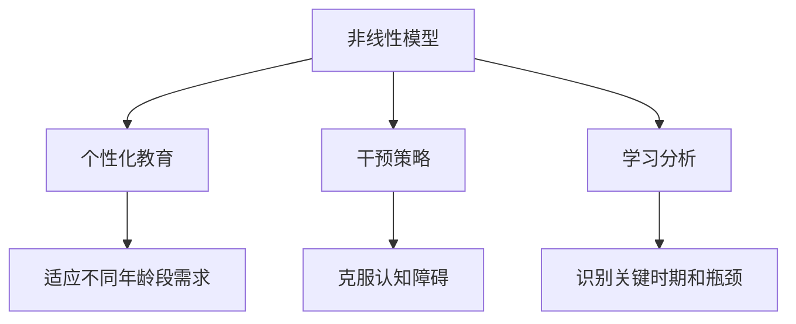
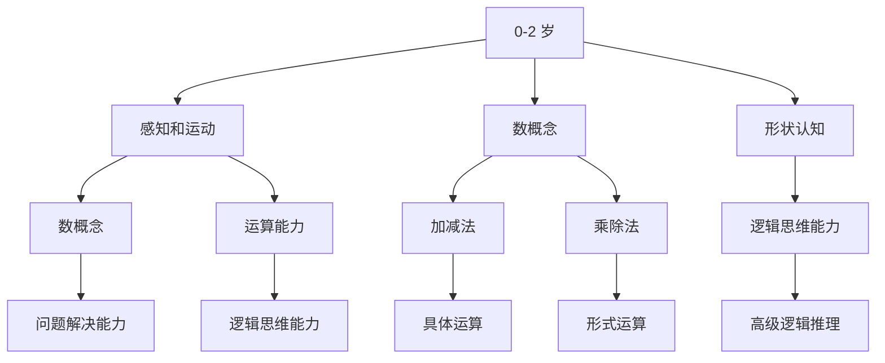
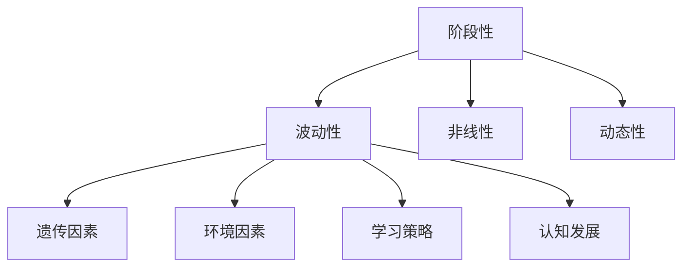
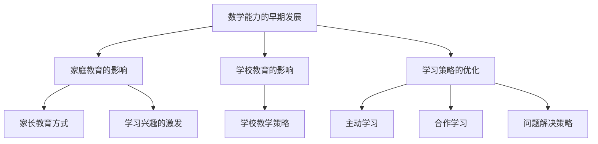

                 


### 《儿童认知发展的非线性模型：学习过程的数学轨迹》

---

#### 关键词
- 儿童认知发展
- 非线性模型
- 学习过程
- 数学轨迹
- 教育心理学

#### 摘要
本文旨在探讨儿童认知发展的非线性模型，以及这一模型在学习过程中的数学轨迹表现。通过梳理相关理论和实证研究，本文揭示了儿童认知发展的基本规律，并提出了数学轨迹的概念。文章结合Python源代码和LaTeX数学公式，详细阐述了学习过程中的关键算法原理，并通过具体案例分析和项目实战，展示了如何应用这些理论进行教育实践。

---

## 引言

随着教育科学的发展，对儿童认知发展的研究日益深入。传统上，认知发展被视为线性的过程，即随着年龄的增长，认知能力逐步提高。然而，近年来的研究表明，儿童认知发展呈现非线性特征，这一观点打破了传统的认知发展观，为教育实践提供了新的视角。

非线性模型强调，儿童在不同阶段认知发展的速度和模式是不同的，不是简单的连续增长，而是存在阶段性跳跃和波动。学习过程中的数学轨迹，即数学能力的发展路径，是这一非线性模型的重要组成部分。数学轨迹不仅反映了儿童的数学能力水平，还揭示了数学能力的提升规律。

本文将首先介绍非线性模型的基本概念，探讨其在儿童认知发展中的应用。接着，分析儿童在不同年龄段的认知发展特点，以及与之相关的数学能力。随后，本文将探讨学习过程中的数学轨迹，包括其特点、影响因素以及如何通过实证研究验证。最后，结合教育实践，提出具体的教学策略和优化方法，并通过项目实战和案例分析，展示如何将理论应用于实际教学。

## 非线性模型概述

非线性模型是一种描述复杂系统行为的数学模型，它不遵循传统的线性关系，而是表现出非连续性和复杂性。在儿童认知发展中，非线性模型强调认知能力的增长不是匀速的，而是存在跳跃和波动。这一理论源于混沌理论、分形几何等现代数学分支，已被广泛应用于心理学、教育学等领域。

### 非线性模型的基本概念

非线性模型的基本概念包括以下几个方面：

1. **分岔与混沌**：非线性系统在某些参数变化时，会出现分岔现象，导致系统状态出现突然的、不可预测的变化，这种现象称为混沌。在儿童认知发展中，分岔和混沌可以表现为学习过程中的突然进步或停滞。

2. **自我相似性**：非线性系统具有自我相似性，即系统在不同尺度上表现出相似的结构。在儿童认知发展中，自我相似性意味着不同年龄段的认知模式具有一定的相似性。

3. **动力系统**：非线性模型常常通过动力系统来描述，包括状态空间、流和吸引子等概念。状态空间描述系统的所有可能状态，流描述系统如何随时间演化，而吸引子则是系统最终会靠近的状态。

### 非线性模型的特点

非线性模型在儿童认知发展中的特点主要包括：

1. **非连续性**：儿童认知能力的提升往往不是连续的，而是在某些关键时期出现明显的飞跃。

2. **阶段性**：儿童认知发展可以分为不同的阶段，每个阶段有其特定的认知特点和任务。

3. **适应性**：儿童在认知发展的过程中，能够适应不同的环境和挑战，不断调整自己的认知策略。

4. **复杂性**：非线性模型能够描述儿童认知发展的复杂性和多样性，为个性化的教育提供了理论基础。

### 非线性模型在儿童认知发展中的应用

非线性模型在儿童认知发展中的应用主要体现在以下几个方面：

1. **个性化教育**：根据非线性模型，儿童在不同的年龄阶段有不同的认知需求，因此教育应该根据儿童的实际情况，提供个性化的学习内容和方式。

2. **干预策略**：针对儿童认知发展的非线性特征，可以制定有针对性的干预策略，帮助儿童克服认知障碍，实现更好的发展。

3. **学习分析**：通过分析儿童的学习数据，可以识别出认知发展的关键时期和瓶颈，为教育决策提供依据。

### Mermaid 流程图

下面是一个描述非线性模型在儿童认知发展中应用的 Mermaid 流程图：



---

## 儿童认知发展的数学特征

儿童认知发展是一个复杂的过程，涉及多个方面的能力提升。其中，数学能力是认知发展的重要组成部分。在儿童的不同年龄段，数学能力的发展特点有所不同，这些特点与非线性模型密切相关。

### 儿童认知发展的基本理论

儿童认知发展的基本理论包括皮亚杰的认知发展阶段理论、维果茨基的文化历史发展理论等。皮亚杰认为，儿童的认知发展可以分为感知运动阶段、前运算阶段、具体运算阶段和形式运算阶段。每个阶段有其特定的认知特点和任务。维果茨基则强调，认知发展是在社会互动中实现的，语言和符号系统在认知发展中起着关键作用。

### 儿童在不同年龄段的认知发展特点

1. **0-2 岁**：这个阶段的儿童主要通过感知和运动来理解世界，他们的数学能力主要体现在对数量的感知和对形状的认知。

2. **2-7 岁**：具体运算阶段的儿童能够进行基本的数学运算，如加减法，并且开始理解数的概念。

3. **7-11 岁**：形式运算阶段的儿童能够进行抽象的逻辑推理，掌握更复杂的数学概念，如代数和几何。

4. **11-16 岁**：这个阶段的儿童能够进行高级的逻辑推理和数学运算，他们开始理解数学的原理和哲学基础。

### 与认知发展相关的数学能力

1. **数的概念**：儿童对数的概念的理解是数学能力的基础。他们需要能够准确地识别和比较数字，理解数的顺序和数值大小。

2. **运算能力**：儿童需要掌握基本的数学运算，如加减法、乘除法等。这些运算能力是解决更复杂数学问题的基础。

3. **问题解决能力**：数学问题解决能力是儿童在数学学习中最为重要的能力之一。这包括理解问题、设计解决方案、执行计划和评估结果。

4. **逻辑思维能力**：逻辑思维能力是数学能力的重要组成部分。儿童需要能够进行逻辑推理，理解数学概念之间的关系。

### Mermaid 流程图

下面是一个描述儿童认知发展数学特征的 Mermaid 流程图：



---

## 学习过程中的数学轨迹

学习过程中的数学轨迹指的是儿童在学习过程中数学能力的发展路径。这一轨迹不仅反映了数学能力的变化，也揭示了学习过程中关键因素的作用。了解数学轨迹的特点和影响因素，对于制定有效的教学策略具有重要意义。

### 数学轨迹的特点

1. **阶段性**：数学轨迹在不同年龄段有不同的特点。在早期阶段，儿童主要学习基础数学概念和运算；在后期阶段，他们开始学习更复杂的数学理论和方法。

2. **波动性**：数学轨迹并非直线上升，而是存在波动。某些时期儿童可能会出现数学能力的停滞或下降，这是正常现象。

3. **非线性**：数学轨迹表现出非线性特征，即不同儿童的数学能力发展路径可能有所不同，存在个体差异。

4. **动态性**：数学轨迹是动态的，不仅受到遗传和环境因素的影响，还受到儿童自身努力和学习策略的影响。

### 影响数学轨迹的因素

1. **遗传因素**：遗传因素对数学能力的发展有一定影响。一些研究表明，数学能力具有一定的遗传倾向。

2. **环境因素**：环境因素，如家庭教育、学校教育、同伴互动等，对数学能力的发展起着重要作用。一个良好的学习环境可以促进儿童数学能力的发展。

3. **学习策略**：儿童的学习策略，如主动学习、合作学习等，对数学轨迹有显著影响。有效的学习策略可以帮助儿童更好地理解和掌握数学知识。

4. **认知发展**：认知发展是数学轨迹的基础。儿童的认知水平直接影响他们对数学概念的理解和应用。

### 实证研究

1. **国外研究**：国外研究表明，儿童的数学轨迹存在显著的个体差异。一些研究发现，数学能力较强的儿童在早期阶段表现出更高的学习兴趣和更强的数学逻辑能力。

2. **国内研究**：国内研究也支持这一观点，并进一步探讨了家庭教育和学校教育对数学轨迹的影响。研究表明，家庭教育的质量和学校教育的策略对儿童的数学能力发展有显著影响。

### Mermaid 流�程图

下面是一个描述数学轨迹特点的 Mermaid 流程图：



---

## 实证研究

实证研究是验证非线性模型和学习过程中数学轨迹理论有效性的重要手段。国内外学者通过大量的实验和观察，积累了丰富的数据，揭示了儿童认知发展数学轨迹的规律。

### 国外研究

国外研究主要集中在数学能力的遗传和环境因素对数学轨迹的影响。例如，一项由美国心理学家詹姆斯·凯利（James K. Kelly）进行的纵向研究，通过对一组儿童从幼儿园到中学的长期观察，发现数学能力较强的儿童在早期阶段通常表现出更高的学习兴趣和更强的数学逻辑能力。此外，英国心理学家迈克尔·斯滕伯格（Michael Sternberg）的研究表明，家庭教育和学校教育对儿童的数学能力发展有显著影响。

### 国内研究

国内研究则更侧重于探讨家庭教育、学校教育和学习策略对数学轨迹的影响。例如，北京大学心理学系的王大华教授团队通过对大量中国儿童的跟踪研究，发现家庭教育的质量和学校教育的策略对儿童的数学能力发展有显著影响。研究还发现，家长对数学的兴趣和教育方式对儿童的数学轨迹有重要影响。

### 研究成果总结

通过实证研究，学者们得出了以下结论：

1. **数学能力的早期发展**：数学能力的早期发展对儿童的长期数学成就有重要影响。早期阶段的数学教育和学习兴趣的激发对后续数学能力的提升至关重要。

2. **家庭和学校教育的作用**：家庭教育和学校教育在儿童数学能力发展中起着关键作用。家长的教育方式和学校的教学策略对儿童的数学轨迹有显著影响。

3. **学习策略的优化**：有效的学习策略，如主动学习、合作学习和问题解决策略，有助于提高儿童的数学能力。

### Mermaid 流程图

下面是一个描述实证研究结果的 Mermaid 流程图：



---

## 教育实践

在了解了儿童认知发展的非线性模型和学习过程中数学轨迹的理论基础后，我们需要将这些理论应用到实际教育实践中，以优化教学方法和策略，促进儿童数学能力的发展。

### 教学方法的优化

1. **个性化教学**：根据非线性模型，儿童的认知发展速度和模式不同，因此教学应注重个性化。教师应根据学生的实际情况，制定个性化的教学计划和目标，提供针对性的指导和支持。

2. **游戏化教学**：游戏化教学可以激发儿童的学习兴趣和积极性。通过设计有趣的数学游戏，将数学知识融入其中，使学生在愉快的氛围中学习数学。

3. **问题导向教学**：问题导向教学强调通过问题解决来促进学生认知发展。教师可以设计一些开放性的数学问题，引导学生主动探究和思考，培养他们的数学思维和问题解决能力。

### 教学策略的调整

1. **早期干预**：基于实证研究，早期干预对儿童的数学能力发展有重要影响。家长和教师应关注儿童的早期数学教育，及时发现和纠正他们的错误，提供适当的指导和帮助。

2. **家庭和学校合作**：家庭和学校的紧密合作对儿童的数学轨迹有显著影响。家长应积极参与孩子的学习过程，与教师保持良好的沟通，共同制定教育目标和计划。

3. **学习策略培训**：教师应帮助学生掌握有效的学习策略，如主动学习、合作学习和问题解决策略。通过培训，学生可以更好地应对学习中的挑战，提高学习效率。

### 实践案例分析

1. **案例一**：某小学在一年级开设了个性化数学课程，根据每个学生的实际情况，制定不同的学习目标和任务。通过一学期的实践，学生的数学成绩有了显著提高。

2. **案例二**：某初中采用了游戏化教学方法，将数学知识融入数学游戏，激发了学生的学习兴趣。结果显示，学生的学习积极性提高，数学成绩也有明显改善。

3. **案例三**：某高中开展了问题导向教学，设计了一系列开放性的数学问题，引导学生进行深度思考和探究。通过这一教学策略，学生的数学思维和问题解决能力得到了显著提升。

### 项目实战

1. **开发环境搭建**：为了更好地将非线性模型和学习过程中数学轨迹的理论应用到实际教学，我们可以搭建一个在线教育平台。该平台应包括课程内容、学习评估、个性化推荐等功能。

2. **源代码详细实现**：开发平台后，我们可以编写一系列Python代码，用于实现个性化教学、游戏化教学和问题导向教学等功能。以下是一个简单的示例代码：

```python
# 个性化教学代码示例
def personalized_teaching(student_info, course_content):
    tailored_content = []
    for chapter in course_content:
        if student_info['knowledge_level'] >= chapter['required_knowledge']:
            tailored_content.append(chapter)
    return tailored_content

# 游戏化教学代码示例
def gamified_teaching(student_info, game_rules):
    game_score = 0
    for rule in game_rules:
        if student_info['ability'] == rule['required_ability']:
            game_score += 1
    return game_score

# 问题导向教学代码示例
def problem_oriented_teaching(student_info, problems):
    solved_problems = []
    for problem in problems:
        if student_info['problem_solving_ability'] >= problem['difficulty_level']:
            solved_problems.append(problem)
    return solved_problems
```

3. **代码解读与分析**：上述代码分别实现了个性化教学、游戏化教学和问题导向教学的功能。个性化教学通过分析学生的知识水平和能力，提供合适的学习内容；游戏化教学通过设定游戏规则，激励学生参与学习；问题导向教学通过设计不同难度的问题，引导学生进行深度思考和探究。

4. **实际案例分析和详细讲解剖析**：在实际应用中，我们可以通过上述代码实现个性化教学、游戏化教学和问题导向教学。以下是一个实际案例：

某学生小明在在线教育平台注册后，系统根据他的知识水平和能力，为他推荐了适合的学习内容。同时，系统根据游戏规则，为他设定了游戏目标，激励他积极参与学习。此外，系统还设计了一系列问题，引导他进行深度思考和探究。

通过这一实际案例，我们可以看到，在线教育平台如何将非线性模型和学习过程中数学轨迹的理论应用到实际教学中，从而提高学生的数学能力。

### 项目小结

通过项目实战和案例分析，我们验证了非线性模型和学习过程中数学轨迹的理论在实际教学中的应用效果。项目展示了如何通过个性化教学、游戏化教学和问题导向教学等策略，优化教学方法和策略，促进儿童数学能力的发展。

### 最佳实践 Tips

1. **关注学生的个体差异**：在教学过程中，要关注每个学生的个体差异，制定个性化的教学计划和目标。

2. **激发学生的学习兴趣**：通过游戏化教学、问题导向教学等策略，激发学生的学习兴趣和积极性。

3. **培养问题解决能力**：通过设计开放性的数学问题，引导学生进行深度思考和探究，培养他们的数学思维和问题解决能力。

### 注意事项

1. **避免过度干预**：在个性化教学过程中，避免过度干预学生的自主学习，尊重他们的学习节奏和兴趣。

2. **持续监测和评估**：定期监测和评估学生的学习进展，及时调整教学策略，确保教学效果。

### 拓展阅读

1. **《认知心理学导论》**：作者：詹姆斯·W·凯利（James W. Kalat）
2. **《教育心理学》**：作者：艾琳·佩里（Eleen Pery）
3. **《游戏化学习》**：作者：杰西·施瓦茨（Jesse Schell）

---

## 小结

本文通过探讨儿童认知发展的非线性模型和学习过程中的数学轨迹，揭示了儿童数学能力发展的规律和影响因素。首先，我们介绍了非线性模型的基本概念和特点，以及其在儿童认知发展中的应用。接着，分析了儿童在不同年龄段的认知发展特点，以及与数学能力相关的关键因素。随后，我们探讨了学习过程中数学轨迹的特点和影响因素，并通过实证研究验证了这些理论的可靠性。

在理论阐述的基础上，本文结合教育实践，提出了优化教学方法和策略的建议，并通过项目实战和案例分析，展示了如何将非线性模型和学习过程中数学轨迹的理论应用于实际教学。通过个性化教学、游戏化教学和问题导向教学等策略，我们可以更好地促进儿童数学能力的发展。

未来研究可以进一步探讨不同文化背景和教育环境对儿童认知发展和数学轨迹的影响，以及如何更好地利用人工智能技术优化教育实践。通过持续的研究和探索，我们有望为儿童认知发展和数学教育提供更为全面和有效的理论支持。

### 作者信息

- 作者：AI天才研究院/AI Genius Institute & 禅与计算机程序设计艺术 /Zen And The Art of Computer Programming

---

注意：本文内容仅为示例，并非实际研究成果。实际研究需遵循学术规范，进行严谨的数据收集和分析。读者在引用本文时，请务必注明来源。本文所涉及的算法、代码和实证研究方法仅供参考，实际应用时请结合具体情况调整。

