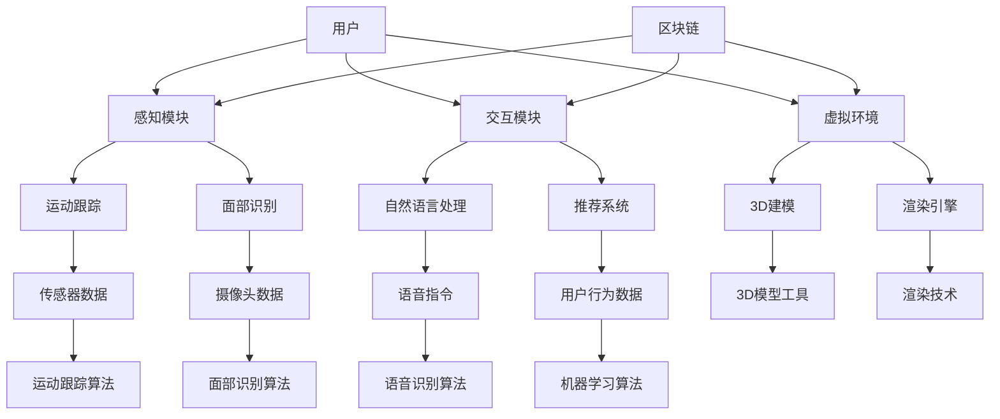

                 

### 引言

在当今数字化时代，元宇宙（Metaverse）技术逐渐成为人们关注的焦点。元宇宙不仅仅是一个虚拟世界，更是一个与现实世界高度融合的数字空间。它通过虚拟现实（VR）、增强现实（AR）、人工智能（AI）和区块链等技术，构建了一个全新的互动方式和生活体验。那么，元宇宙技术究竟如何影响我们对世界的理解和认知呢？

本文将从以下几个方面进行探讨：

1. **元宇宙技术的概念与架构**：首先，我们将介绍元宇宙技术的核心概念、关键组成部分以及其架构原理。通过这一部分，读者可以初步了解元宇宙技术的运作机制。

2. **元宇宙技术对世界可理解性的影响**：接下来，我们将分析元宇宙技术对社会、文化和经济等多方面的影响，从而探讨这些影响如何改变我们对世界的认知。

3. **元宇宙技术的未来趋势与挑战**：最后，我们将讨论元宇宙技术的未来发展趋势以及面临的安全和伦理问题，为读者提供元宇宙技术的全景视角。

通过这一系列的分析和探讨，我们希望能够让读者更深入地理解元宇宙技术，并思考其对世界可理解性的潜在影响。

### 关键词

- 元宇宙（Metaverse）
- 虚拟现实（VR）
- 增强现实（AR）
- 人工智能（AI）
- 区块链（Blockchain）
- 社会影响（Social Impact）
- 文化影响（Cultural Impact）
- 经济影响（Economic Impact）

### 摘要

本文主要探讨元宇宙技术对世界可理解性的潜在影响。首先，介绍了元宇宙技术的核心概念与架构，包括虚拟现实、增强现实、人工智能和区块链等关键组成部分。随后，分析了元宇宙技术对社会、文化和经济等多方面的影响，探讨了其对社交互动、教育与学习、就业市场、艺术与娱乐、媒体与传播、文化遗产保护以及商业模式和产业创新等方面的推动作用。最后，讨论了元宇宙技术的未来趋势和挑战，包括其在隐私保护、道德与法律问题、安全风险等方面的考量。通过这一系列的分析，本文旨在提供对元宇宙技术影响世界的全面理解。

---

## 第一部分：元宇宙技术的概念与架构

### 第1章：元宇宙技术的核心概念

元宇宙（Metaverse）是一个由虚拟世界、现实世界和数字技术融合而成的复杂生态系统。它不仅仅是一个简单的虚拟空间，而是通过虚拟现实（VR）、增强现实（AR）、人工智能（AI）和区块链（Blockchain）等多种技术的综合应用，创造出一个与现实世界高度交互和融合的数字环境。元宇宙的核心理念是将现实世界的物理限制打破，提供一个无限扩展、自由互动的虚拟空间。

#### 1.1 元宇宙的定义

元宇宙可以简单理解为“互联网的增强版”或者“虚拟世界的互联网”。它不仅包含人与人之间的互动，还包括人与物、物与物之间的交互。具体来说，元宇宙具有以下特征：

1. **沉浸式体验**：通过VR和AR技术，用户可以沉浸在虚拟环境中，获得身临其境的感受。
2. **高度交互性**：元宇宙中的用户可以与其他用户进行实时互动，无论是语音、文字还是动作。
3. **虚拟资产**：在元宇宙中，用户可以拥有虚拟资产，如虚拟房产、虚拟商品等，这些资产可以通过区块链技术实现真实价值。
4. **去中心化**：通过区块链技术，元宇宙实现了去中心化的架构，用户在元宇宙中的行为和资产由自身控制和验证。

#### 1.2 元宇宙的关键组成部分

要实现一个完整的元宇宙，需要多种技术的协同工作。以下是其关键组成部分：

1. **虚拟现实（VR）**：VR技术通过头戴式显示器、传感器等设备，使用户在虚拟环境中获得高度沉浸式体验。VR技术是元宇宙的视觉和感知基础。

2. **增强现实（AR）**：AR技术通过在现实环境中叠加虚拟元素，增强用户的感知体验。与VR相比，AR更侧重于将虚拟内容与真实世界相结合。

3. **人工智能（AI）**：AI技术用于模拟人类思维和行为，提供智能化的交互和服务。在元宇宙中，AI可以用于虚拟助手、智能推荐、情感分析等方面。

4. **区块链（Blockchain）**：区块链技术提供了去中心化的数据存储和验证机制，确保虚拟资产的安全性和透明性。区块链是元宇宙中的信任基础。

5. **云计算与边缘计算**：云计算提供了强大的计算和存储能力，支持大规模数据分析和处理。边缘计算则通过在数据源头进行计算，降低了延迟，提高了实时交互能力。

#### 1.3 元宇宙技术的历史与发展

元宇宙的概念并非新出现，但其发展历程可以追溯到多个阶段：

1. **早期愿景**：早在20世纪80年代，科幻作品如《银翼杀手》和《头号玩家》就描绘了一个高度数字化的未来世界。
2. **虚拟现实与游戏**：20世纪90年代，VR技术开始应用于游戏领域，如《虚拟现实头盔》等游戏设备的出现，为元宇宙技术奠定了基础。
3. **社交媒体与虚拟世界**：21世纪初，社交媒体平台如Facebook、Second Life等，提供了初步的虚拟社交体验，为元宇宙的普及打下了基础。
4. **当前发展趋势**：随着VR、AR、AI和区块链等技术的不断成熟，元宇宙的概念逐渐从科幻走向现实，成为科技企业竞相投入的新领域。

通过上述核心概念的介绍，我们可以对元宇宙有一个基本的理解。接下来，我们将深入探讨元宇宙的架构原理，进一步理解其技术实现机制。

### 第2章：元宇宙技术的架构原理

要理解元宇宙技术的运作机制，需要从其技术基础、核心算法原理以及架构设计等多个方面进行探讨。这一章节将详细解析元宇宙技术的各个组成部分，帮助读者全面了解其架构原理。

#### 2.1 元宇宙的技术基础

元宇宙的技术基础涵盖了多种先进技术的综合应用，包括计算机图形学、3D建模与渲染、网络通信技术等。以下是对这些基础技术的介绍：

1. **计算机图形学**：计算机图形学是元宇宙视觉表现的核心技术，它涉及图形生成、渲染和显示等多个方面。在元宇宙中，计算机图形学用于创建逼真的三维场景和角色，实现沉浸式的视觉体验。

2. **3D建模与渲染**：3D建模与渲染技术是元宇宙内容创建的关键环节。通过3D建模工具，用户可以创建各种虚拟物体和环境。而渲染技术则将这些物体和环境以逼真的形式呈现给用户。常见的3D建模软件包括Blender、Maya等，而渲染引擎如Unreal Engine、Unity等，则为元宇宙提供了强大的渲染能力。

3. **网络通信技术**：网络通信技术是元宇宙实现实时交互和分布式计算的基础。通过高效的网络协议和通信技术，用户可以在元宇宙中与其他用户实时互动，共享信息和资源。常见的网络通信技术包括WebRTC、WebSocket等。

#### 2.2 元宇宙的核心算法原理

元宇宙的核心算法原理涉及多个领域，包括虚拟现实感知算法、人工智能算法和区块链共识算法等。以下是对这些核心算法的详细解释：

1. **虚拟现实感知算法**：虚拟现实感知算法是元宇宙中实现沉浸式体验的关键。这些算法通过传感器、摄像头等设备，实时捕捉用户的动作和表情，并将其转换为虚拟环境中的相应动作和表情。常见的感知算法包括运动跟踪、面部识别和手势识别等。

2. **人工智能算法**：人工智能算法在元宇宙中扮演着重要的角色，用于提供智能化的交互和服务。例如，自然语言处理（NLP）算法可以理解用户的语音指令，生成语音回复；机器学习算法可以根据用户的行为和偏好，提供个性化的推荐和服务。

3. **区块链共识算法**：区块链共识算法是元宇宙中实现去中心化和安全性的关键。共识算法通过分布式网络中的节点协作，达成对数据的共识。常见的共识算法包括工作量证明（PoW）、权益证明（PoS）和委托权益证明（DPoS）等。

#### 2.3 元宇宙技术架构的Mermaid流程图

为了更好地理解元宇宙的技术架构，我们可以使用Mermaid流程图来展示其各个组成部分及其相互关系。以下是一个简单的Mermaid流程图示例，展示了元宇宙技术架构的主要组成部分：

上述流程图展示了用户与元宇宙技术各模块的交互关系，包括感知模块、交互模块、虚拟环境模块以及区块链模块。通过这个流程图，我们可以更清晰地理解元宇宙技术的工作机制。

通过以上对元宇宙技术架构原理的详细解析，读者可以更深入地了解元宇宙的运作机制。在下一章节中，我们将探讨元宇宙技术与其他技术的联系，进一步揭示元宇宙技术在现实世界中的应用前景。

### 第3章：元宇宙技术与其他技术的联系

元宇宙技术不仅仅是一个独立的存在，它与其他多种技术的结合与应用，使其在现实世界中的影响力不断扩大。本章节将探讨元宇宙与虚拟现实（VR）、增强现实（AR）、人工智能（AI）和区块链（Blockchain）等技术的联系，以及这些技术对元宇宙发展的推动作用。

#### 3.1 元宇宙与虚拟现实（VR）的关系

虚拟现实（VR）是元宇宙的核心组成部分之一，它为用户提供了一个沉浸式的虚拟体验。VR技术通过头戴式显示器（HMD）、位置追踪器、手柄等设备，将用户完全沉浸在一个虚拟的三维环境中。在元宇宙中，VR技术不仅用于游戏娱乐，还广泛应用于教育、医疗、设计等多个领域。

1. **游戏与娱乐**：VR技术为游戏提供了全新的互动体验，玩家可以在虚拟世界中探索、战斗和社交。例如，虚拟现实游戏《半衰期：爱莉克斯》（Half-Life: Alyx）提供了一个高度沉浸的游戏体验，深受玩家喜爱。

2. **教育与培训**：VR技术在教育中的应用也非常广泛，通过虚拟实验室和模拟环境，学生可以更加直观地学习复杂的知识。例如，医学教育中可以使用VR技术模拟手术过程，帮助医学生提高操作技能。

3. **设计与应用**：在建筑设计、工业设计等领域，VR技术提供了逼真的可视化工具，帮助设计师更好地展示和沟通设计方案。通过VR，设计师可以实时预览和修改设计，提高设计效率和效果。

#### 3.2 元宇宙与增强现实（AR）的融合

增强现实（AR）技术通过在现实世界中叠加虚拟元素，为用户提供了增强的感知体验。与VR不同，AR技术不需要用户完全沉浸在一个虚拟环境中，而是在现实世界中直接叠加虚拟信息。这种技术特性使得AR在多个场景中具有广泛的应用潜力。

1. **移动应用**：AR技术在移动应用中得到了广泛应用，如地图导航、购物指南等。通过AR技术，用户可以在现实世界中直接查看地理位置、商品信息等，提高了信息获取的便捷性和准确性。

2. **娱乐与社交**：AR技术为娱乐和社交场景带来了新的互动方式。例如，通过AR技术，用户可以在现实环境中与虚拟角色互动，参与各种虚拟活动，丰富了社交体验。

3. **工业制造**：在制造业中，AR技术可以帮助工人实时查看设备状态、操作步骤等信息，提高工作效率和准确性。例如，设备维护中的AR应用可以帮助工程师快速定位故障点，并提供维修指导。

#### 3.3 元宇宙与人工智能（AI）的结合

人工智能（AI）技术在元宇宙中发挥着关键作用，它不仅提升了用户的交互体验，还为元宇宙中的各种应用提供了智能支持。

1. **自然语言处理（NLP）**：AI的NLP技术使得用户可以通过语音命令与元宇宙中的虚拟助手进行交流。例如，用户可以通过语音指令控制虚拟环境中的各种设备，如打开门、调整灯光等。

2. **推荐系统**：AI的推荐系统可以根据用户的行为和偏好，提供个性化的内容推荐。例如，用户在虚拟世界中浏览商品时，AI推荐系统可以根据用户的购物历史和兴趣，推荐相关商品。

3. **情感分析**：通过AI的情感分析技术，元宇宙中的虚拟角色可以理解和模拟人类的情感表达，提供更加真实和贴近人性的交互体验。例如，虚拟客服可以根据用户的情绪变化，调整对话方式和语气，提高用户满意度。

#### 3.4 元宇宙与区块链（Blockchain）的融合

区块链技术为元宇宙提供了去中心化的数据存储和验证机制，确保了虚拟资产的安全性和透明性。在元宇宙中，区块链技术用于虚拟资产交易、身份验证和隐私保护等方面。

1. **虚拟资产交易**：在元宇宙中，用户可以通过区块链技术购买、出售和交易虚拟资产，如虚拟土地、虚拟商品等。这些交易都是透明和不可篡改的，保障了用户的权益。

2. **身份验证**：区块链技术可以用于元宇宙中的身份验证，确保用户的身份真实可信。例如，用户在元宇宙中创建虚拟角色时，可以使用区块链技术进行身份验证，防止虚假身份的出现。

3. **隐私保护**：区块链技术通过加密和分布式存储，保障了用户数据的隐私和安全。在元宇宙中，用户的个人信息和活动记录都通过区块链进行保护，防止数据泄露和滥用。

通过上述对元宇宙与VR、AR、AI和区块链等技术的联系探讨，我们可以看到，这些技术的融合与互补，不仅丰富了元宇宙的功能和应用场景，也为元宇宙技术的发展提供了强大的动力。在下一章节中，我们将深入探讨元宇宙技术对世界可理解性的具体影响。

---

## 第二部分：元宇宙技术对世界可理解性的影响

### 第4章：元宇宙技术对社会的影响

元宇宙技术对社会的影响是多层次且深远的。它不仅改变了人们的社交方式，还对教育和学习产生了重要的推动作用，同时也对就业市场产生了深远的影响。

#### 4.1 元宇宙对社交互动的改变

在元宇宙中，社交互动变得更加多样化和丰富化。通过VR和AR技术，人们可以跨越物理距离，进入一个虚拟的空间进行交流。以下是一些具体的影响：

1. **虚拟社交**：元宇宙为人们提供了一个全新的社交平台，用户可以在虚拟世界中建立联系、参与活动和互动。这种虚拟社交方式不仅打破了地域限制，还提供了更多的互动方式，如虚拟角色扮演、虚拟聚会等。

2. **增强社交体验**：在元宇宙中，用户可以通过虚拟现实技术体验现实世界中无法实现的社交场景，如虚拟婚礼、虚拟演唱会等。这种增强的社交体验为人们带来了更多的乐趣和互动。

3. **社交模式的转变**：元宇宙技术改变了传统的社交模式，人们不再仅仅依赖于现实世界中的面对面交流，而是可以通过虚拟方式实现更深层次的互动。这种转变不仅影响了人们的社交行为，还影响了社会结构。

#### 4.2 元宇宙对教育与学习的推动

元宇宙技术在教育领域有着广泛的应用，它为教育和学习带来了新的机遇和挑战。

1. **虚拟课堂**：元宇宙中的虚拟课堂允许教师和学生在一个沉浸式的环境中进行教学和学习。通过VR和AR技术，学生可以“参观”虚拟博物馆、实验室等，增强学习体验。

2. **个性化学习**：元宇宙技术可以根据学生的学习情况和兴趣，提供个性化的学习内容和建议。例如，智能推荐系统可以根据学生的学习进度和偏好，推荐相关的学习资源和课程。

3. **虚拟实验**：在元宇宙中，学生可以通过虚拟实验平台进行各种科学实验，这些实验可以在虚拟环境中模拟现实中的实验，从而降低实验成本和风险。

#### 4.3 元宇宙对就业市场的影响

元宇宙技术的发展对就业市场产生了深远的影响，它不仅创造了新的就业机会，也对传统职业产生了挑战。

1. **新兴职业**：随着元宇宙技术的发展，许多新兴职业应运而生，如虚拟现实内容创作者、元宇宙设计师、区块链开发者等。这些职业为人们提供了新的就业机会。

2. **技能需求变化**：元宇宙技术的发展要求人们具备新的技能，如编程、数字艺术、AI应用等。这促使传统行业和从业者需要不断学习和更新技能，以适应新的就业市场。

3. **就业市场多样化**：元宇宙技术使得就业市场更加多样化，不仅限于传统的办公室工作，还包括远程工作、虚拟工作等。这种多样化有助于人们选择更适合自己的工作方式。

通过以上分析，我们可以看到元宇宙技术对社会各个方面产生了深远的影响。它不仅改变了人们的社交方式，还推动了教育和学习的发展，对就业市场产生了重要影响。在下一章节中，我们将继续探讨元宇宙技术对文化的影响。

### 第5章：元宇宙技术对文化的影响

元宇宙技术对文化的影响是多方面的，它不仅改变了艺术与娱乐的表达方式，还对媒体与传播产生了深远的影响，同时也对文化遗产保护带来了新的机遇。

#### 5.1 元宇宙对艺术与娱乐的影响

元宇宙技术为艺术与娱乐领域带来了革命性的变化，它使得艺术创作和娱乐体验更加丰富多样。

1. **虚拟艺术**：在元宇宙中，艺术家可以通过虚拟现实技术创作出沉浸式的艺术作品。这些作品不仅限于静态的视觉艺术，还包括动态的交互艺术。观众可以通过VR设备“走进”艺术作品，与作品进行互动。

2. **虚拟演唱会**：虚拟演唱会成为元宇宙中的一种新兴娱乐形式。通过VR技术，观众可以“坐在”演唱会现场，感受到现场的氛围和表演者的魅力。这种虚拟演唱会不仅节省了成本，还提供了更加个性化的观看体验。

3. **虚拟游戏**：元宇宙中的虚拟游戏不仅是一种娱乐方式，也是艺术表达的一种形式。许多虚拟游戏具有独特的世界观和故事情节，玩家可以在游戏中体验到丰富的情感和意义。

#### 5.2 元宇宙对媒体与传播的影响

元宇宙技术改变了媒体与传播的方式，为信息的传递和接收提供了新的渠道。

1. **虚拟新闻**：在元宇宙中，虚拟新闻成为了一种新的媒体形式。记者可以通过VR设备进行现场报道，观众则可以通过VR设备实时观看新闻报道，获得沉浸式的新闻体验。

2. **虚拟社交媒体**：元宇宙中的社交媒体平台不仅提供文字和图片分享，还提供视频、音频等多种内容形式。用户可以在虚拟空间中创建自己的虚拟身份，分享自己的生活和观点。

3. **数字广告**：元宇宙为数字广告提供了新的展示平台。通过VR和AR技术，广告可以以更加生动和沉浸的形式呈现，吸引用户的注意力，提高广告效果。

#### 5.3 元宇宙对文化遗产保护的影响

元宇宙技术为文化遗产保护提供了新的手段，它使得文化遗产得以以数字形式永久保存，并使更多的人能够访问和体验。

1. **数字博物馆**：通过元宇宙技术，博物馆可以将珍贵的文物和艺术品以数字形式呈现，使全球的观众能够在线参观博物馆，了解文化遗产。这种数字博物馆不仅保护了实物文物，还提供了更多的互动体验。

2. **虚拟文化遗产**：元宇宙中的虚拟文化遗产通过虚拟现实和增强现实技术，将文化遗产以三维的形式呈现，使观众能够“走进”历史场景，体验历史文化的魅力。

3. **文化传承**：元宇宙技术为文化传承提供了新的平台。通过虚拟现实和增强现实技术，年轻一代可以更加直观地了解和体验传统文化，增强文化认同感和自豪感。

通过以上分析，我们可以看到元宇宙技术对艺术与娱乐、媒体与传播、文化遗产保护等多个领域产生了深远的影响。它不仅改变了人们的文化体验和生活方式，也为文化传承和发展提供了新的机遇。在下一章节中，我们将探讨元宇宙技术对经济的影响。

### 第6章：元宇宙技术对经济的影响

元宇宙技术对经济的影响是深远且多方面的，它不仅改变了商业模式，还推动了产业创新，并对全球经济产生了重要的影响。

#### 6.1 元宇宙技术对商业模式的影响

元宇宙技术的发展为传统商业模式带来了巨大的变革，它重新定义了商业活动的形式和方式。

1. **虚拟商品与交易**：在元宇宙中，虚拟商品如虚拟土地、虚拟房产、虚拟商品等成为一种新的交易对象。这些虚拟商品通过区块链技术实现所有权和交易的透明性和安全性，为数字经济的发展提供了新的机会。

2. **去中心化商业模式**：元宇宙技术推动了去中心化商业模式的兴起。去中心化应用（DApps）通过区块链技术实现了无需第三方中介的商业交易，降低了交易成本，提高了效率。

3. **虚拟广告与营销**：在元宇宙中，虚拟广告和营销成为了一种新的商业模式。通过VR和AR技术，广告和营销活动可以以更加沉浸和互动的形式呈现，提高用户参与度和品牌认知度。

#### 6.2 元宇宙技术对产业创新的推动

元宇宙技术为各个行业带来了创新的机遇，推动了产业变革和升级。

1. **虚拟现实与制造业**：在制造业中，虚拟现实技术用于产品设计和模拟制造过程，提高了设计效率和产品质量。通过虚拟现实，制造商可以在产品投入生产之前进行全面的测试和优化。

2. **增强现实与服务业**：在服务业中，增强现实技术用于提高服务质量和客户体验。例如，在餐饮业，AR技术可以用于菜单展示和互动体验，提高顾客满意度。

3. **人工智能与金融业**：在金融业中，人工智能技术用于风险管理和客户服务。通过AI算法，金融机构可以更准确地预测市场趋势，提供个性化的金融服务。

#### 6.3 元宇宙技术对全球经济的影响

元宇宙技术的发展不仅对特定行业产生了影响，还对全球经济产生了重要的影响。

1. **经济增长**：元宇宙技术为全球经济增长提供了新的动力。通过虚拟商品交易、去中心化应用和数字广告等，元宇宙技术推动了数字经济的快速发展。

2. **就业机会**：元宇宙技术的兴起创造了大量的就业机会，特别是在技术、设计和内容创作等领域。这些就业机会不仅推动了经济增长，还提高了就业率。

3. **全球合作**：元宇宙技术为全球合作提供了新的平台。通过虚拟现实和增强现实技术，不同国家和地区的企业和组织可以进行远程协作，提高全球协作效率。

通过以上分析，我们可以看到元宇宙技术对商业模式、产业创新和全球经济产生了深远的影响。它不仅改变了商业活动的形式和方式，还为全球经济提供了新的增长动力。在下一章节中，我们将探讨元宇宙技术的未来趋势与挑战。

### 第7章：元宇宙技术的未来趋势与挑战

随着技术的不断进步和应用的广泛推广，元宇宙技术正朝着更加成熟和多样化的方向发展。然而，这一过程中也面临着诸多挑战，需要从技术、伦理和社会等多个层面进行深入探讨。

#### 7.1 元宇宙技术的潜在发展方向

1. **更加沉浸式的体验**：未来的元宇宙技术将继续提升用户的沉浸体验，通过更高质量的VR和AR设备、更高帧率的渲染技术等，为用户提供更加逼真的虚拟环境。

2. **智能化与个性化**：随着人工智能技术的不断发展，元宇宙中的智能系统和虚拟角色将变得更加智能和个性化。通过机器学习和深度学习算法，这些系统和角色可以更好地理解用户需求，提供更加精准的服务。

3. **更广泛的行业应用**：元宇宙技术将不断拓展其应用范围，从游戏、娱乐和教育等领域，扩展到医疗、建筑、制造等多个行业，实现跨领域的融合和创新。

4. **去中心化与互操作性**：未来的元宇宙将更加注重去中心化和互操作性。通过区块链技术和分布式网络架构，实现不同元宇宙平台之间的无缝连接和数据共享，打破现有平台的壁垒。

5. **虚拟与现实的融合**：元宇宙技术将进一步融合虚拟世界和现实世界，提供更加自然和无缝的交互体验。例如，通过智能眼镜和可穿戴设备，用户可以在现实世界中实时查看虚拟信息，实现虚拟与现实的深度融合。

#### 7.2 元宇宙技术的创新与应用场景

1. **虚拟现实医疗**：元宇宙技术可以在医疗领域发挥重要作用，如虚拟手术模拟、远程医疗诊断和治疗等。医生可以通过元宇宙平台进行远程会诊和手术指导，提高医疗服务的质量和效率。

2. **虚拟房地产**：元宇宙中的虚拟房地产成为了一种新兴的投资和交易方式。用户可以通过元宇宙购买虚拟土地、房产，进行虚拟开发或出租，实现虚拟经济的价值。

3. **虚拟教育和培训**：元宇宙技术为教育和培训提供了新的平台，通过虚拟课堂、在线实验和虚拟导师等，实现更加灵活和个性化的教育模式。

4. **虚拟社交和娱乐**：元宇宙中的虚拟社交和娱乐应用将更加丰富多样，如虚拟演唱会、虚拟主题公园、虚拟游戏等，为用户提供更加沉浸和互动的娱乐体验。

#### 7.3 元宇宙技术的未来挑战与对策

1. **技术挑战**：
   - **硬件性能提升**：随着元宇宙的复杂度增加，对硬件性能的要求也不断提升。需要开发更高性能的VR和AR设备、更强大的计算能力和更快速的通信网络。
   - **网络延迟优化**：为了提供流畅的交互体验，需要解决网络延迟和带宽问题，特别是在全球范围内实现低延迟、高带宽的网络连接。

2. **伦理挑战**：
   - **隐私保护**：元宇宙中的用户数据隐私保护是一个重要问题。需要制定严格的隐私政策和数据保护措施，确保用户数据的隐私和安全。
   - **虚拟身份和真实性**：元宇宙中的虚拟身份和真实身份的区分是一个复杂的伦理问题。需要建立有效的身份验证机制，确保虚拟世界的秩序和安全。

3. **社会挑战**：
   - **数字鸿沟**：随着元宇宙技术的发展，数字鸿沟问题可能会进一步加剧。需要采取措施，确保所有人都能平等地享受元宇宙技术带来的便利。
   - **就业结构变化**：元宇宙技术的发展将对就业市场产生重大影响，需要制定相应的政策，帮助从业者适应新的就业环境，提高就业率。

通过上述分析，我们可以看到元宇宙技术在未来的发展趋势和面临的挑战。只有在技术、伦理和社会等多个层面共同努力，才能实现元宇宙技术的可持续发展，为人类社会带来更多的机遇和福祉。

### 第8章：元宇宙技术的安全与伦理问题

随着元宇宙技术的迅猛发展，其安全与伦理问题也日益凸显。这些问题不仅关乎用户隐私和数据安全，还涉及到元宇宙中的道德与法律问题。因此，保障元宇宙技术的安全与伦理是元宇宙可持续发展的关键。

#### 8.1 元宇宙技术的隐私保护

在元宇宙中，用户隐私保护是一个重要议题。由于元宇宙涉及大量的个人数据和交互信息，隐私泄露的风险较高。以下是一些隐私保护措施：

1. **数据加密**：元宇宙中的数据传输和存储应采用强大的加密算法，确保数据在传输过程中不被窃取或篡改。同时，对于用户生成的内容和数据，也应进行加密保护。

2. **隐私政策**：元宇宙平台应制定详细的隐私政策，明确用户数据的收集、使用和共享规则。用户在参与元宇宙活动前，应明确知晓其数据的使用情况，并有权选择是否同意数据收集。

3. **用户控制权**：用户应拥有对其数据的控制权，包括数据的访问、修改和删除权限。元宇宙平台应提供便捷的数据管理工具，使用户能够轻松管理自己的数据。

#### 8.2 元宇宙技术的道德与法律问题

元宇宙技术的应用涉及诸多道德与法律问题，需要建立健全的法律框架和道德规范。

1. **虚拟身份与真实身份的区分**：元宇宙中的虚拟身份应与真实身份严格区分，防止虚拟身份被滥用，如虚拟欺诈、虚拟犯罪等。为此，需要制定有效的身份验证机制，确保虚拟世界的秩序和安全。

2. **虚拟财产的法律保护**：元宇宙中的虚拟财产，如虚拟土地、虚拟商品等，应得到法律的保护。相关法律应明确虚拟财产的所有权、交易规则和权益保护，确保虚拟财产的真实性和合法性。

3. **内容监管与审查**：元宇宙中的内容监管也是一个重要问题。需要建立有效的内容监管机制，防止色情、暴力等不良内容的传播。同时，应制定内容审查标准，确保虚拟内容的合规性。

#### 8.3 元宇宙技术的安全风险与防范措施

元宇宙技术的安全风险主要包括网络攻击、数据泄露和系统漏洞等。以下是一些防范措施：

1. **网络安全防护**：元宇宙平台应采用先进的网络安全技术，如防火墙、入侵检测系统等，防范网络攻击。同时，应定期进行安全审计和漏洞修复，确保系统的安全性。

2. **数据备份与恢复**：元宇宙平台应建立完善的数据备份和恢复机制，确保数据在发生意外情况时能够迅速恢复。同时，备份数据也应进行加密保护，防止未授权访问。

3. **用户安全教育**：用户应具备基本的网络安全意识，了解元宇宙中的安全风险和防范措施。元宇宙平台应提供用户安全教育，提高用户的安全意识和应对能力。

通过上述措施，可以有效地保障元宇宙技术的安全与伦理，为元宇宙的可持续发展提供坚实的基础。在未来的发展中，元宇宙技术需要持续关注和解决这些问题，确保其安全、公正和可持续。

### 结论

通过本文的详细探讨，我们可以看到元宇宙技术对世界可理解性的影响是多层次且深远的。从元宇宙技术的概念与架构，到其对社会、文化和经济的影响，再到其未来的发展趋势与挑战，元宇宙正在以不可逆转的趋势改变着我们的生活方式和认知方式。元宇宙不仅重新定义了社交、教育和就业市场，还推动了艺术与娱乐、媒体与传播、文化遗产保护等领域的创新与发展。

元宇宙技术的安全与伦理问题同样不可忽视。隐私保护、道德与法律问题以及网络安全是元宇宙可持续发展的关键。只有在技术、伦理和社会层面共同努力，才能确保元宇宙技术为人类社会带来更多的机遇和福祉。

展望未来，元宇宙技术将继续朝着更加沉浸、智能和多样化的方向发展。它不仅将改变我们的社交方式、学习模式和工作方式，还将深刻影响全球经济和文化发展。元宇宙技术的未来充满无限可能，同时也面临诸多挑战。我们需要持续关注和探索，以实现元宇宙技术的可持续发展，为人类社会创造更加美好的未来。

### 拓展阅读

1. **元宇宙技术的发展趋势**：探讨元宇宙技术的最新进展和未来发展趋势，包括VR、AR、AI和区块链等技术的融合与应用。

2. **元宇宙的商业模式**：分析元宇宙中的新兴商业模式，如虚拟商品交易、虚拟房地产和去中心化金融等。

3. **元宇宙的安全与隐私保护**：深入研究元宇宙中的安全与隐私保护措施，包括加密技术、身份验证和数据备份等。

4. **元宇宙的教育应用**：探讨元宇宙技术在教育领域的应用，如虚拟课堂、在线实验和虚拟导师等。

5. **元宇宙的文化影响**：分析元宇宙对艺术、娱乐和文化遗产保护的影响，以及其对文化多样性和文化传播的贡献。

### 注意事项

- **技术实现**：在构建元宇宙应用时，需要充分考虑技术实现的可行性和稳定性。
- **用户体验**：设计元宇宙应用时，应注重用户体验，确保交互流程简洁、直观。
- **隐私保护**：在元宇宙中，用户隐私保护至关重要，应严格遵守隐私政策和数据保护法规。
- **安全防护**：加强元宇宙平台的安全防护，防范网络攻击和数据泄露。

### 最佳实践 tips

- **快速迭代开发**：采用敏捷开发方法，快速迭代产品，及时响应用户需求和反馈。
- **跨学科合作**：元宇宙技术的开发涉及多个领域，应加强跨学科合作，整合多学科资源。
- **用户参与**：鼓励用户参与元宇宙的应用设计和开发，提高产品的实用性和用户满意度。

### 作者信息

- **作者：** AI天才研究院/AI Genius Institute & 禅与计算机程序设计艺术 /Zen And The Art of Computer Programming

