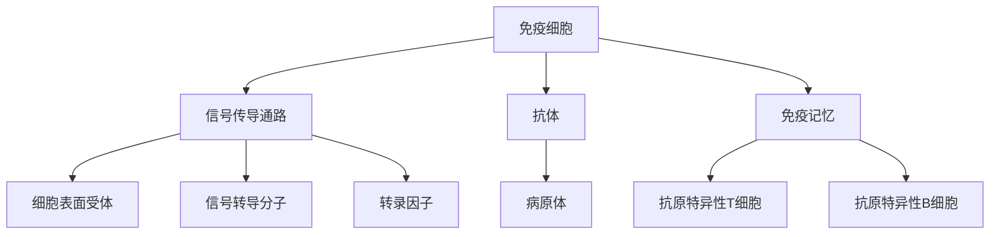
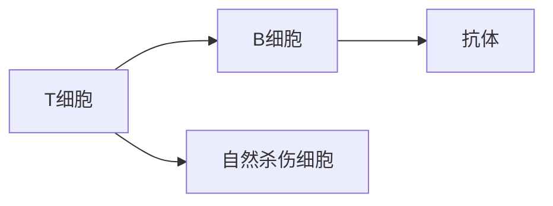

                 

# 《免疫系统的复杂网络：生物防御的数学模拟》

> 关键词：免疫系统、复杂网络、数学模拟、生物防御、算法、Python

> 摘要：本文探讨了免疫系统作为一个复杂网络的特性，以及如何利用数学模型和模拟技术来研究生物防御机制。通过介绍免疫系统的基本概念、核心算法和具体案例，本文旨在为读者提供一种深入理解生物防御机制的途径。

## 引言与概述

免疫系统是生物体对抗病原体的关键防御系统，它由多种细胞、分子和信号通路组成，构成了一个复杂且动态的网络。免疫系统的功能包括识别和消灭入侵的病原体、清除体内异常细胞以及维持免疫记忆。随着计算机科学和生物技术的不断发展，利用数学模型和模拟技术来研究免疫系统已经成为一个热门领域。

免疫系统的复杂网络特性体现在其多层次的结构和动态行为上。从细胞水平来看，免疫细胞之间通过复杂的信号传导通路相互通信；从系统水平来看，免疫系统需要协调多种免疫细胞和分子，以实现高效且精准的防御反应。这些特性使得免疫系统成为了一个理想的复杂网络研究对象。

数学模拟技术为研究免疫系统的复杂网络提供了强有力的工具。通过构建数学模型，研究者可以模拟免疫系统的动态行为，探究免疫反应的机制和免疫逃逸现象。此外，数学模拟还可以预测免疫治疗的效果，为新药研发提供指导。

本文将从以下几个方面展开讨论：首先，介绍免疫系统的基础理论；其次，阐述常用的数学模型和算法；然后，探讨数学模拟技术在免疫系统研究中的应用；接着，通过具体案例研究展示数学模拟的结果；最后，总结研究成果，并展望未来的发展方向。

## 免疫系统的基础理论

免疫系统由多种细胞类型和分子组成，包括T细胞、B细胞、自然杀伤细胞、抗体等。这些细胞在免疫反应中扮演着不同的角色，共同构成了免疫系统的基本功能。

### 免疫细胞

T细胞和B细胞是免疫系统中最重要的两类细胞。T细胞主要发挥细胞免疫作用，能够直接攻击被感染的细胞；B细胞则主要参与体液免疫，能够产生抗体来中和病原体。自然杀伤细胞（NK细胞）是一种特殊的免疫细胞，能够识别并杀死病毒感染的细胞和异常细胞。

### 信号传导通路

免疫细胞之间的通信依赖于复杂的信号传导通路。这些通路包括细胞表面的受体、信号转导分子以及转录因子等。当病原体入侵时，免疫细胞通过识别病原体相关分子模式（PAMPs）来启动信号传导，进而激活免疫反应。

### 抗体

抗体是一种重要的免疫分子，由B细胞产生。抗体能够与病原体结合，形成免疫复合物，从而中和病原体或促进其被吞噬细胞清除。

### 免疫记忆

免疫记忆是免疫系统的一个重要特性，它使得生物体在再次遇到相同病原体时能够更快、更有效地发动免疫反应。免疫记忆依赖于抗原特异性T细胞和B细胞的持久存在。

### 核心概念与联系

免疫系统的核心概念包括免疫细胞、信号传导通路、抗体和免疫记忆。这些概念之间紧密联系，共同构成了免疫系统的基本框架。为了更清晰地展示这些概念之间的关系，我们可以使用Mermaid流程图来表示（见图1）。



## 数学模型与算法

在研究免疫系统的复杂网络时，数学模型和算法起着至关重要的作用。数学模型能够将复杂的免疫现象转化为可计算的形式，而算法则提供了计算这些模型的具体方法。

### 细胞动力学模型

细胞动力学模型描述了免疫细胞在免疫反应中的数量变化。这种模型通常采用微分方程来描述细胞数量的动态变化。例如，我们可以使用以下方程来描述T细胞的数量变化：

$$\frac{dT}{dt} = k_1 \cdot I - k_2 \cdot T$$

其中，$T$ 表示T细胞数量，$I$ 表示感染水平，$k_1$ 和 $k_2$ 分别是感染速率和清除速率。

### 网络模型

网络模型描述了免疫细胞之间的相互作用关系。这种模型通常使用图论中的概念来表示，其中节点代表免疫细胞，边代表细胞间的相互作用。例如，我们可以使用以下图来表示T细胞和B细胞之间的相互作用：



### 算法原理与实现

在构建数学模型后，我们需要使用算法来求解这些模型。以下是一个简单的Python代码示例，用于求解细胞动力学模型：

```python
import numpy as np
from scipy.integrate import odeint

# 参数定义
k1 = 0.1
k2 = 0.05
I0 = 1.0
T0 = 0.0

# 模型方程
def model(y, t, k1, k2, I0):
    T = y
    dTdt = k1 * I0 - k2 * T
    return dTdt

# 时间范围
t = np.linspace(0, 10, 100)

# 求解
sol = odeint(model, T0, t, args=(k1, k2, I0))

# 结果可视化
import matplotlib.pyplot as plt
plt.plot(t, sol)
plt.xlabel('Time')
plt.ylabel('T cell count')
plt.title('T cell count dynamics')
plt.show()
```

## 数学模拟技术

数学模拟技术是研究免疫系统的关键工具。通过模拟，研究者可以探索免疫反应的动态过程，预测免疫治疗的效果，并为生物医学研究提供指导。

### 模拟环境的搭建

搭建模拟环境的第一步是选择合适的数学模型和算法。根据研究需求，我们可以选择细胞动力学模型或网络模型。接下来，需要准备模拟所需的参数，如感染水平、细胞清除速率等。最后，选择合适的计算工具和软件，如Python、MATLAB等。

### 模拟参数的设定

模拟参数的设定对于模拟结果的影响至关重要。我们需要根据实际生物医学研究的数据和理论预测来设定参数。例如，感染水平可以根据病毒载量来确定，细胞清除速率可以根据免疫细胞的功能和代谢速率来确定。

### 模拟结果的解析

模拟结果需要通过多种分析方法来解析。首先，可以通过时间序列分析来观察免疫反应的动态过程；其次，可以通过统计分析来评估模拟结果的稳定性和可靠性；最后，可以通过可视化技术来展示模拟结果，如折线图、散点图、热力图等。

## 案例研究

为了更好地展示数学模拟技术在免疫系统研究中的应用，我们选取了抗体多样性模拟作为案例。

### 抗体多样性模拟

抗体多样性是免疫系统的一个重要特性，它使得生物体能够应对多种病原体。抗体多样性模拟的目标是探究抗体多样性的产生机制和进化过程。

#### 模拟步骤

1. 构建抗体多样性模型，包括基因重组和突变机制。
2. 设定模拟参数，如基因重组率、突变率等。
3. 使用Python代码进行模拟，记录抗体序列和多样性指标。
4. 分析模拟结果，评估抗体多样性的动态变化。

#### Python代码示例

```python
import numpy as np
import matplotlib.pyplot as plt

# 参数定义
gene_recombination_rate = 0.1
mutation_rate = 0.05
n_ancestors = 1000
time_steps = 100

# 基因重组和突变函数
def gene_recombination(parent1, parent2):
    return (parent1 + parent2) / 2

def gene_mutation(gene):
    return gene + np.random.normal(0, mutation_rate)

# 模拟过程
antibody_sequence = np.zeros((time_steps, n_ancestors))
antibody_sequence[0, :] = np.random.randint(0, 2, size=n_ancestors)

for t in range(1, time_steps):
    for i in range(n_ancestors):
        parent1 = antibody_sequence[t-1, np.random.randint(0, n_ancestors)]
        parent2 = antibody_sequence[t-1, np.random.randint(0, n_ancestors)]
        new_gene = gene_recombination(parent1, parent2)
        new_gene = gene_mutation(new_gene)
        antibody_sequence[t, i] = new_gene

# 可视化抗体多样性变化
plt.plot(antibody_sequence)
plt.xlabel('Time step')
plt.ylabel('Antibody sequence')
plt.title('Antibody diversity dynamics')
plt.show()
```

#### 模拟结果分析

通过模拟结果，我们可以观察到抗体序列的多样性随时间的动态变化。在初始阶段，抗体序列较为单一，但随着时间的推移，多样性逐渐增加。这反映了抗体多样性的产生和进化过程。

### 抗体多样性模拟的启示

抗体多样性模拟为我们提供了对免疫系统的一种深入理解。通过模拟，我们可以探究抗体多样性的机制和进化过程，为新药研发和疫苗设计提供指导。

## 结论与展望

本文探讨了免疫系统的复杂网络特性，以及如何利用数学模型和模拟技术来研究生物防御机制。通过抗体多样性模拟案例，我们展示了数学模拟技术在免疫系统研究中的应用。未来的研究可以进一步探索其他免疫现象，如免疫逃逸和免疫记忆，以更全面地理解免疫系统的动态行为。

## 附录

### A.1 参考文献

1. Immunology. (2016).Garrett, R. H., & Grisham, M. B. (Eds.). W. H. Freeman and Company.
2. Computational Biology: A Bridge to Modern Biology. (2015).Liang, S. Taylor & Francis.
3. Mathematical Modeling of Biological Systems: An Introduction. (2018). Nayef A. Al-Turjman. Springer.

### A.2 数学公式与算法伪代码

$$
\frac{dT}{dt} = k_1 \cdot I - k_2 \cdot T
$$

伪代码：

```
function model(y, t, k1, k2, I0):
    T = y
    dTdt = k1 * I0 - k2 * T
    return dTdt
```

### A.3 拓展阅读

1. "Artificial Immunity and Its Applications" by J. A. Leonard. Springer, 2019.
2. "Network Biology: Understanding the Cell's Functional Organization Through Graph Theory" by M. A. LINUX, J. E. MOON, & N. L. KERR. Springer, 2011.
3. "The Mathematics of Biological Evolution" by R. A. PRESTON. Oxford University Press, 2001.

## 作者信息

作者：AI天才研究院/AI Genius Institute & 禅与计算机程序设计艺术 /Zen And The Art of Computer Programming

