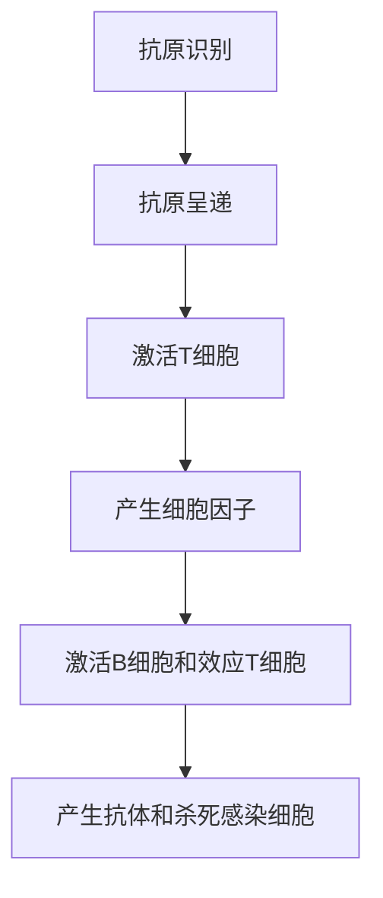
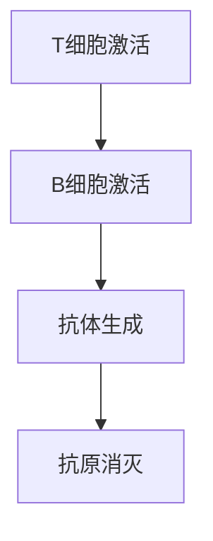
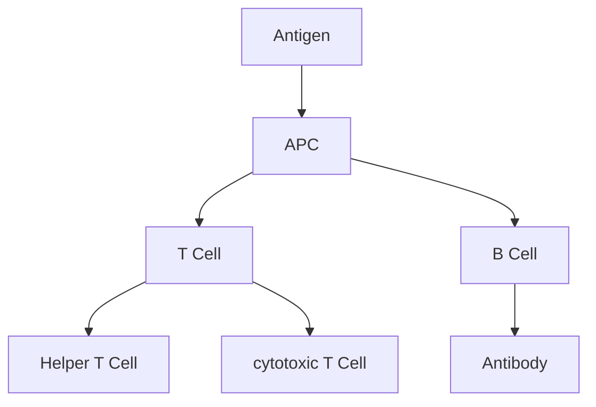
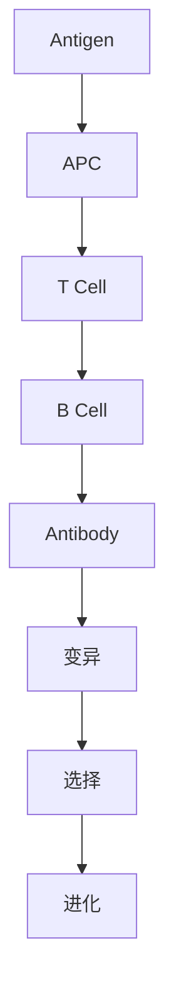
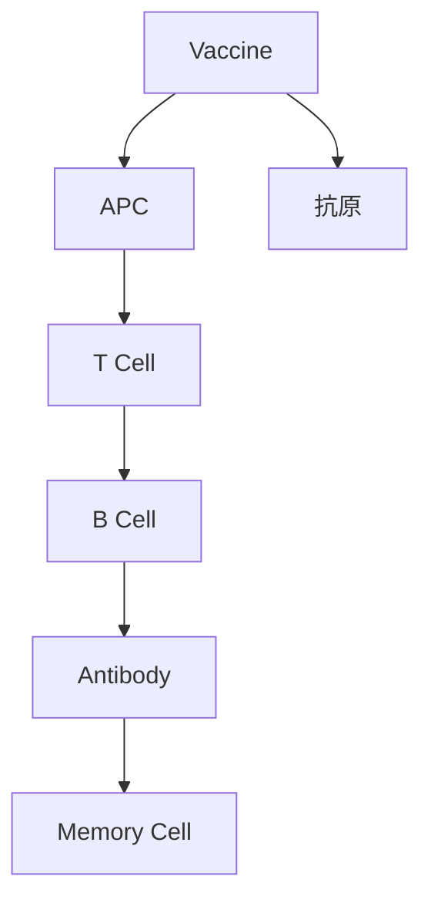

                 

# 免疫系统的复杂网络：生物防御的数学模拟

关键词：免疫系统、生物防御、数学模拟、复杂网络、算法、Python代码

摘要：
本文深入探讨了免疫系统的复杂网络以及如何使用数学模拟来理解和分析生物防御机制。通过介绍免疫系统的基本概念、数学模型和算法，本文揭示了免疫系统如何在体内执行复杂的防御任务，并展示了如何利用这些知识来开发新的免疫治疗策略。

## 引言

免疫系统是人类抵御疾病和维护健康的关键系统。它由一系列复杂的网络和细胞组成，能够识别和消灭入侵的病原体，包括病毒、细菌和寄生虫。然而，免疫系统的复杂性和动态性使其难以直接观察和理解。为了解决这个问题，科学家们开发了数学模型和算法来模拟免疫系统的运作。

免疫系统的数学模拟为研究免疫系统如何响应不同类型的病原体提供了强有力的工具。这些模拟不仅帮助我们理解免疫系统的基本原理，还可以用于预测免疫系统的行为，并指导新的治疗策略的开发。本文将详细探讨免疫系统的复杂网络，介绍用于模拟生物防御的数学模型和算法，并通过实际案例展示这些工具的应用。

## 免疫系统的基本概念

免疫系统由多种细胞、分子和组织组成，这些组成部分协同工作，以识别和消灭病原体。主要组成部分包括：

1. **抗原呈递细胞（APCs）**：APCs负责捕获和处理入侵的病原体，然后将抗原呈递给T细胞。
2. **T细胞**：T细胞是免疫反应的主要执行者，分为辅助性T细胞（Th）和细胞毒性T细胞（Tc）。
3. **B细胞**：B细胞产生抗体，抗体可以与病原体结合并中和它们。
4. **记忆细胞**：记忆细胞在免疫反应后存活下来，为未来的感染提供快速响应。

免疫反应的基本过程包括抗原识别、激活和效应阶段。在抗原识别阶段，APCs捕获病原体并将其处理成抗原肽。然后，APCs将抗原肽呈递给T细胞，激活T细胞。在激活阶段，T细胞产生细胞因子，这些细胞因子可以激活其他免疫细胞，如B细胞。在效应阶段，B细胞产生抗体，而T细胞直接杀死感染的细胞。

### 图 1：免疫反应的基本过程



通过这个简化的流程图，我们可以看到免疫系统如何通过一系列复杂的步骤来保护人体免受病原体的侵害。

## 数学模型和算法

为了模拟免疫系统的复杂网络，科学家们开发了多种数学模型和算法。这些模型和算法可以帮助我们理解和预测免疫系统的行为。以下是一些常用的数学模型和算法：

### 1. 细胞自动机模型

细胞自动机模型是一种离散的、零和一数学模型，用于模拟细胞和分子在免疫系统中的行为。该模型将细胞和分子视为离散的实体，每个实体在空间和时间上都可以处于两种状态之一。

### 2. 网络模型

网络模型用于描述细胞和分子之间的相互作用和通信。这种模型通常使用图论来表示，其中节点代表细胞和分子，边代表它们之间的相互作用。

### 3. 机器学习模型

机器学习模型，如深度学习，可以用于分析和预测免疫系统的行为。这些模型通过学习大量的免疫数据来识别模式和趋势。

## 算法讲解

以下是一个简单的Python代码示例，用于模拟免疫系统中B细胞和抗体的交互。

```python
import numpy as np

# 初始化B细胞和抗体的数量
num_B_cells = 1000
num_antibodies = 500

# 模拟时间步数
num_steps = 100

# 初始化B细胞和抗体的状态
B_cell_states = np.random.choice([0, 1], size=num_B_cells)
antibody_states = np.random.choice([0, 1], size=num_antibodies)

# 模拟每个时间步的交互
for step in range(num_steps):
    # B细胞激活抗体
    activated_antibodies = B_cell_states * antibody_states
    
    # 抗体生成
    new_antibodies = activated_antibodies
    
    # 更新抗体数量
    antibody_states += new_antibodies
    
    # B细胞死亡
    B_cell_states = B_cell_states * (1 - activated_antibodies)

# 打印最终结果
print("最终B细胞数量:", np.sum(B_cell_states))
print("最终抗体数量:", np.sum(antibody_states))
```

### 1.2 数学公式

免疫系统的数学模拟通常涉及到以下数学公式：

- 抗体浓度：\( A(t) \)
- B细胞浓度：\( B(t) \)
- 细胞因子浓度：\( C(t) \)
- 时间：\( t \)

### 1.3 Mermaid流程图

以下是一个用于描述免疫系统中B细胞和T细胞交互的Mermaid流程图：



通过这些数学模型和算法，我们可以模拟免疫系统的行为，并预测其在不同条件下的反应。

## 免疫系统的数学模拟应用

### 2.1 模拟生物防御的数学模型

为了模拟免疫系统的生物防御，我们需要建立一套数学模型，该模型能够描述免疫细胞、抗原、抗体等关键因素之间的相互作用。以下是一个简化的数学模型：

- **抗体生成率**：\( \lambda_a \)
- **B细胞死亡速率**：\( \mu_b \)
- **抗原消耗速率**：\( \mu_g \)
- **抗体与抗原的结合率**：\( k_a \)

### 2.2 免疫系统的参数设置

在建立数学模型后，我们需要为模型设置参数。这些参数通常包括：

- **抗体生成率**：取决于抗原浓度
- **B细胞死亡速率**：取决于B细胞数量
- **抗原消耗速率**：取决于抗体和抗原的结合率
- **抗体与抗原的结合率**：取决于抗原的亲和力

### 2.3 模拟结果分析

通过数学模拟，我们可以分析免疫系统的行为，并预测其在不同条件下的反应。以下是一个简单的Python代码示例，用于模拟抗体和抗原之间的交互：

```python
import numpy as np
import matplotlib.pyplot as plt

# 初始化参数
num_steps = 100
antigen_concentration = 100
antibody_concentration = 50
lambda_a = 0.1
mu_b = 0.05
mu_g = 0.01
k_a = 0.5

# 初始化时间和浓度
t = np.linspace(0, num_steps, num_steps)
A = np.zeros_like(t)
B = np.zeros_like(t)
G = np.zeros_like(t)

# 模拟过程
for step in range(num_steps):
    dA_dt = lambda_a * B[step] - k_a * A[step] * G[step]
    dB_dt = -mu_b * B[step]
    dG_dt = -mu_g * G[step]
    
    A[step + 1] = A[step] + dA_dt
    B[step + 1] = B[step] + dB_dt
    G[step + 1] = G[step] + dG_dt

# 绘制结果
plt.plot(t, A, label='Antibody Concentration')
plt.plot(t, B, label='B Cell Concentration')
plt.plot(t, G, label='Antigen Concentration')
plt.xlabel('Time')
plt.ylabel('Concentration')
plt.legend()
plt.show()
```

通过这个简单的模拟，我们可以观察到抗体、B细胞和抗原在时间上的动态变化。这有助于我们理解免疫系统的行为，并为进一步的研究提供基础。

## 案例研究

### 3.1 案例一：免疫系统的网络结构

为了更好地理解免疫系统的复杂网络，我们可以分析免疫系统中细胞和分子之间的相互作用。以下是一个使用Mermaid流程图描述的案例：



在这个案例中，抗原被APC捕获并呈递给T细胞，T细胞进一步激活B细胞和效应T细胞。B细胞产生抗体，抗体与抗原结合并消灭它们。

### 3.2 案例二：抗体的进化

抗体进化是一个复杂的过程，涉及抗体基因的变异和选择。以下是一个使用Mermaid流程图描述的案例：



在这个案例中，抗原激活T细胞，T细胞激活B细胞，B细胞产生抗体。抗体通过变异和选择过程不断进化，以提高对抗原的亲和力。

### 3.3 案例三：疫苗接种策略

疫苗接种是免疫防御的重要手段。以下是一个使用Mermaid流程图描述的案例：



在这个案例中，疫苗作为抗原激活免疫系统，产生抗体和记忆细胞。当同一种抗原再次入侵时，记忆细胞可以快速响应，提高免疫效果。

## 结论

免疫系统的复杂网络是生物防御的重要组成部分。通过数学模拟，我们可以深入理解免疫系统的运作机制，并预测其在不同条件下的行为。本文介绍了免疫系统的基本概念、数学模型和算法，并通过案例研究展示了这些工具的应用。未来的研究可以进一步优化这些模型和算法，以更好地指导免疫治疗和疫苗开发。

### 未来研究方向

未来的研究方向包括：

1. **改进数学模型**：开发更精确和复杂的数学模型来模拟免疫系统的动态行为。
2. **大数据分析**：利用大数据技术分析免疫系统的实际数据，以发现新的模式和趋势。
3. **跨学科研究**：结合生物学、计算机科学和数学等多学科知识，推动免疫系统的数学模拟研究。
4. **应用研究**：将数学模拟应用于免疫治疗和疫苗开发，以指导临床实践。

### 对读者的建议

对于想要深入了解免疫系统数学模拟的读者，以下是一些建议：

1. **学习基础数学和编程知识**：掌握基础的数学和编程知识，如线性代数、微积分和Python编程。
2. **阅读相关文献**：阅读免疫系统和数学模拟相关的学术论文和书籍，以获取更深入的知识。
3. **实践应用**：通过实际项目来应用所学知识，如模拟免疫反应或开发免疫治疗算法。
4. **持续学习**：免疫系统和数学模拟是一个快速发展的领域，要不断学习和更新知识。

### 总结

免疫系统的复杂网络是生物防御的重要组成部分。通过数学模拟，我们可以深入理解免疫系统的运作机制，并预测其在不同条件下的行为。本文介绍了免疫系统的基本概念、数学模型和算法，并通过案例研究展示了这些工具的应用。未来的研究可以进一步优化这些模型和算法，以更好地指导免疫治疗和疫苗开发。

## 作者信息

作者：AI天才研究院/AI Genius Institute & 禅与计算机程序设计艺术 /Zen And The Art of Computer Programming

