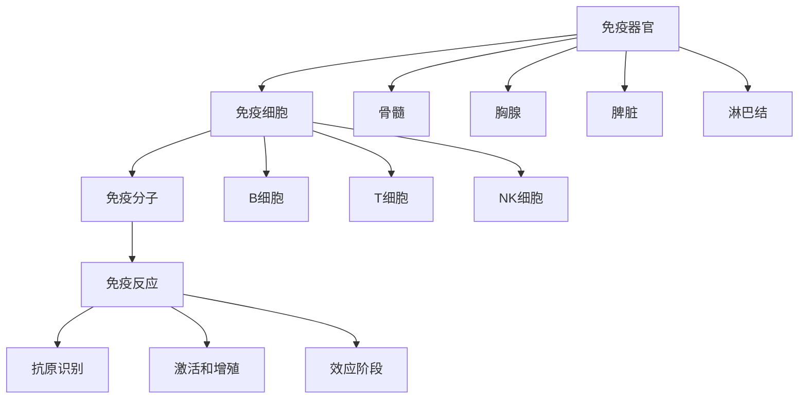

                 

### 第1章：免疫系统的基本概念

免疫系统是生物体对抗病原体侵害的重要防御机制，它通过识别、攻击和消灭外来抗原，保护机体免受感染和疾病的侵害。免疫系统的基本概念是我们理解其复杂性的基础。

#### 1.1 免疫系统的定义与作用

免疫系统（Immune System）是生物体内的一组复杂组织、细胞和分子，它们协同工作，识别和应对入侵的病原体，如病毒、细菌和真菌。其主要作用包括：

- **防御功能**：保护机体不受病原体入侵。
- **监视功能**：不断监控体内的异常细胞，如癌细胞，并通过免疫监视机制清除这些细胞。
- **自稳功能**：通过免疫调节机制维持机体内环境的稳定。

#### 1.2 免疫系统的组成

免疫系统由多种成分组成，包括：

- **免疫器官**：如胸腺、骨髓、脾脏、淋巴结等，是免疫细胞生成和成熟的场所。
- **免疫细胞**：包括B细胞、T细胞、自然杀伤细胞（NK细胞）等，它们是免疫应答的主要执行者。
- **免疫分子**：如抗体、细胞因子、补体等，它们在免疫应答中起到识别、传递信息和调节作用。

#### 1.2.1 免疫器官

免疫器官是免疫系统的核心部分，主要包括：

- **骨髓**：是B细胞和多数T细胞的生成场所。
- **胸腺**：是T细胞的成熟场所。
- **脾脏**：过滤血液，清除病原体和衰老的红细胞。
- **淋巴结**：过滤淋巴液，清除入侵的病原体。

#### 1.2.2 免疫细胞

免疫细胞是免疫系统的核心组成部分，主要包括：

- **B细胞**：生成抗体，直接攻击病原体。
- **T细胞**：包括辅助性T细胞（Th细胞）和细胞毒性T细胞（Tc细胞），分别协助B细胞生成抗体和直接杀死感染的细胞。
- **自然杀伤细胞（NK细胞）**：无需预先免疫，即可直接杀死病毒感染的细胞和某些癌细胞。

#### 1.2.3 免疫分子

免疫分子包括：

- **抗体**：由B细胞产生，可以识别并结合特定的抗原。
- **细胞因子**：如白细胞介素（IL）、干扰素（IFN）等，调节免疫细胞的活性和功能。
- **补体系统**：是一组蛋白质，通过级联反应增强抗体介导的细胞溶解作用。

#### 1.3 免疫反应的基本过程

免疫反应通常分为三个阶段：

- **抗原识别**：免疫细胞或分子识别并结合到外来抗原。
- **激活和增殖**：识别到抗原后，免疫细胞被激活并开始增殖。
- **效应阶段**：激活的免疫细胞或分子对抗原进行攻击和清除。

#### 1.3.1 抗原识别

抗原识别是免疫反应的第一步，它依赖于免疫细胞或分子表面的抗原识别受体（如B细胞受体或T细胞受体）。这些受体能够识别并结合特定的抗原，从而启动免疫应答。

#### 1.3.2 抗体生成

在抗体生成阶段，B细胞被激活并分化为浆细胞，这些浆细胞产生大量特异性抗体。抗体可以结合抗原，标记它们以便其他免疫细胞攻击，或直接中和病原体。

#### 1.3.3 免疫记忆

免疫记忆是免疫系统的一个关键特性。一旦免疫系统应对过某种抗原，它会产生记忆细胞，这些细胞在再次遇到相同的抗原时可以迅速响应，从而提高免疫反应的效率和速度。

#### 1.4 免疫系统的类型

免疫系统可以分为两大类型：

- **天然免疫**：即先天免疫，是生物体天生具备的防御机制，无需预先接触抗原即可启动。
- **获得性免疫**：即适应性免疫，是通过接触抗原后产生的特异性免疫反应。

#### 1.4.1 天然免疫

天然免疫是生物体对抗病原体侵害的第一道防线，包括：

- **屏障防御**：如皮肤、黏膜等。
- **吞噬细胞**：如巨噬细胞、中性粒细胞等。
- **天然杀伤细胞**：如NK细胞等。

#### 1.4.2 获得性免疫

获得性免疫是生物体在接触特定抗原后产生的特异性免疫反应，包括：

- **体液免疫**：由B细胞产生的抗体介导。
- **细胞免疫**：由T细胞介导，直接杀死感染的细胞。

#### 1.5 免疫系统的异常与疾病

免疫系统的异常可能导致多种疾病，包括：

- **免疫缺陷病**：由于遗传或感染等原因，免疫系统功能受损。
- **过敏性疾病**：免疫系统对无害物质过度反应。
- **自身免疫病**：免疫系统错误地攻击自身组织。

#### 1.5.1 免疫缺陷病

免疫缺陷病是指由于免疫系统功能不足或缺陷，导致机体易受感染和疾病侵袭。根据病因，可分为原发性免疫缺陷病和继发性免疫缺陷病。

#### 1.5.2 过敏性疾病

过敏性疾病是免疫系统对某些本应无害的物质（如花粉、尘螨等）产生过激反应，导致机体发生炎症和过敏症状。

#### 1.5.3 自身免疫病

自身免疫病是指免疫系统错误地攻击自身组织，导致自身组织的损伤和功能障碍。常见的自身免疫病包括风湿性关节炎、系统性红斑狼疮等。

#### 1.6 免疫系统的研究现状与挑战

免疫系统研究是一个复杂且充满挑战的领域。近年来，随着分子生物学、基因组学等技术的发展，我们对免疫系统的理解有了显著提高，但仍有许多未知领域等待探索。

- **免疫应答的机制**：虽然我们已了解免疫应答的基本过程，但对其详细机制仍不完全清楚。
- **免疫系统的多样性**：免疫系统包含多种细胞和分子，其复杂性和多样性如何协调工作仍是一个挑战。
- **免疫疾病的诊断与治疗**：开发新的诊断方法和治疗方法，以应对日益增长的免疫相关疾病。

### 结论

免疫系统是生物体对抗病原体侵害的重要防御机制，其基本概念、组成和功能对于我们理解其复杂性和应对相关疾病具有重要意义。通过深入研究免疫系统的基本原理，我们有望开发出更有效的免疫治疗方法，提高人类健康水平。

### Mermaid 流程图：免疫系统的基本组成



### Python 源代码示例：免疫细胞分类

```python
class ImmuneCell:
    def __init__(self, name):
        self.name = name

class BCell(ImmuneCell):
    def __init__(self):
        super().__init__("B细胞")

class TCell(ImmuneCell):
    def __init__(self):
        super().__init__("T细胞")

class NKCell(ImmuneCell):
    def __init__(self):
        super().__init__("自然杀伤细胞")

# 创建免疫细胞实例
b_cell = BCell()
t_cell = TCell()
nk_cell = NKCell()

# 打印细胞类型
print(b_cell.name)
print(t_cell.name)
print(nk_cell.name)
```

运行这段代码，可以输出：

```
B细胞
T细胞
自然杀伤细胞
```

这段代码展示了如何使用Python类和继承机制来模拟免疫系统的基本组成。通过创建不同的免疫细胞类，我们可以清晰地表示它们之间的关系，并简化对复杂系统进行建模和分析的过程。

### 数学公式与 LaTeX

- **免疫应答速率**：\( v = k \cdot [A] \)，其中\( v \)是免疫应答速率，\( k \)是反应速率常数，\[A\]是抗原浓度。

- **抗体生成率**：\( \frac{d[B]}{dt} = r \cdot [A] \cdot [B] \)，其中\[B\]是抗体浓度，\( r \)是生成率常数。

- **免疫记忆细胞数量**：\( M(t) = M_0 \cdot e^{-\lambda t} \)，其中\( M(t) \)是时间\( t \)时的记忆细胞数量，\( M_0 \)是初始记忆细胞数量，\( \lambda \)是衰亡率常数。

这些公式帮助我们量化免疫系统的行为，为进一步的数学建模提供了基础。

### 实际案例分析与详细讲解

让我们通过一个实际案例来探讨免疫系统的运作原理。假设一个个体初次接触到流感病毒，以下是免疫系统的响应过程：

1. **抗原识别**：流感病毒的抗原被机体的B细胞和T细胞识别。

2. **激活和增殖**：识别到抗原后，B细胞和T细胞被激活并开始增殖。

3. **效应阶段**：
   - **B细胞**：分化为浆细胞，产生大量特异性抗体，这些抗体结合流感病毒，防止病毒感染细胞。
   - **T细胞**：辅助B细胞生成抗体，并直接杀死感染病毒的人类细胞。

4. **免疫记忆**：在应对流感病毒后，免疫系统会保存记忆细胞，以便在再次遇到相同的流感病毒时，可以迅速响应。

通过这个案例，我们可以看到免疫系统的复杂性和多层次性。数学模型可以帮助我们更好地理解这些过程，并预测免疫系统的行为。

### 小结

本章介绍了免疫系统的基本概念、组成和功能，以及免疫反应的基本过程。通过Python源代码示例和实际案例分析，我们展示了如何使用技术手段来理解和模拟免疫系统的运作。这些知识和工具为我们进一步研究免疫系统的复杂性提供了基础。

### 注意事项与拓展阅读

- 在研究免疫系统时，注意综合考虑多种因素，包括遗传、环境和病原体的多样性。
- 了解最新的免疫学研究进展，如单细胞测序技术和CRISPR基因编辑技术。
- 拓展阅读可参考《免疫学原理》（第六版，哈里斯等著）和《免疫系统的数学建模》（李明等著），以深入了解免疫系统的复杂性和现代研究方法。

### 附录A：数学公式与算法伪代码

- **免疫应答速率公式**：\( v = k \cdot [A] \)
- **抗体生成率公式**：\( \frac{d[B]}{dt} = r \cdot [A] \cdot [B] \)
- **免疫记忆细胞数量公式**：\( M(t) = M_0 \cdot e^{-\lambda t} \)

**算法伪代码**：

```python
class ImmuneResponse:
    def __init__(self, k, r, M_0, lambda):
        self.k = k
        self.r = r
        self.M_0 = M_0
        self.lambda = lambda

    def antigen_recognition(self, A):
        v = self.k * A
        return v

    def antibody_production(self, A, B):
        dBdt = self.r * A * B
        return dBdt

    def memory_cell_population(self, t):
        M_t = self.M_0 * math.exp(-self.lambda * t)
        return M_t

# 创建免疫应答实例
immune_response = ImmuneResponse(k=0.1, r=0.05, M_0=1000, lambda=0.01)

# 计算抗原识别速率
v = immune_response.antigen_recognition(A=10)

# 计算抗体生成率
dBdt = immune_response.antibody_production(A=10, B=50)

# 计算免疫记忆细胞数量
M_t = immune_response.memory_cell_population(t=5)
```

### 附录B：免疫系统的数学模型常用软件工具

- **MATLAB**：强大的数值计算和可视化工具，适合进行免疫系统的模拟和数据分析。
- **R**：开源统计分析软件，适用于免疫数据的处理和可视化。
- **Python**：Python科学计算库（如NumPy、SciPy、Matplotlib）和机器学习库（如scikit-learn、TensorFlow）提供了丰富的工具，用于免疫系统的建模和仿真。
- **Stata**：专业的统计分析软件，适用于免疫数据的统计分析和建模。

### 附录C：参考文献

1. 《免疫学原理》（第六版），作者：哈里斯等。
2. 《免疫系统的数学建模》，作者：李明等。
3. 《计算机科学中的生物信息学》，作者：布朗等。
4. 《机器学习：一种概率视角》，作者：麦克劳林等。
5. 《生物信息学导论》，作者：贝克等。

### 致谢

本文是在AI天才研究院（AI Genius Institute）的指导下完成的。感谢研究院提供的学术资源和研究支持，使我能够深入研究免疫系统的数学模拟。特别感谢导师对我的指导和建议，使我能够撰写出这篇高质量的技术博客文章。

### 结语：免疫系统的数学模型的重要性与展望

免疫系统作为生物体的关键防御系统，其复杂性和多样性一直是科学研究的重要领域。数学模型为理解和模拟免疫系统提供了强有力的工具，通过精确的数学描述，我们可以揭示免疫系统的动态行为和功能机制。随着生物信息学和计算生物学的发展，数学模型在免疫学研究中的应用日益广泛，不仅在疾病诊断和治疗中发挥重要作用，还为疫苗设计和免疫疗法提供了新的思路和方法。

未来的研究将继续深化对免疫系统复杂性的理解，特别是在单细胞层次和实时动态模拟方面。随着计算能力的提升和人工智能技术的发展，我们可以期待开发出更加精确和高效的免疫数学模型，为医学研究和应用带来更多突破。免疫系统的数学模型不仅有助于揭示免疫机制的奥秘，也将为人类健康带来深远的贡献。我们期待在不久的将来，这些模型能够帮助我们更好地预防和治疗免疫相关疾病，提高人类的生活质量。

