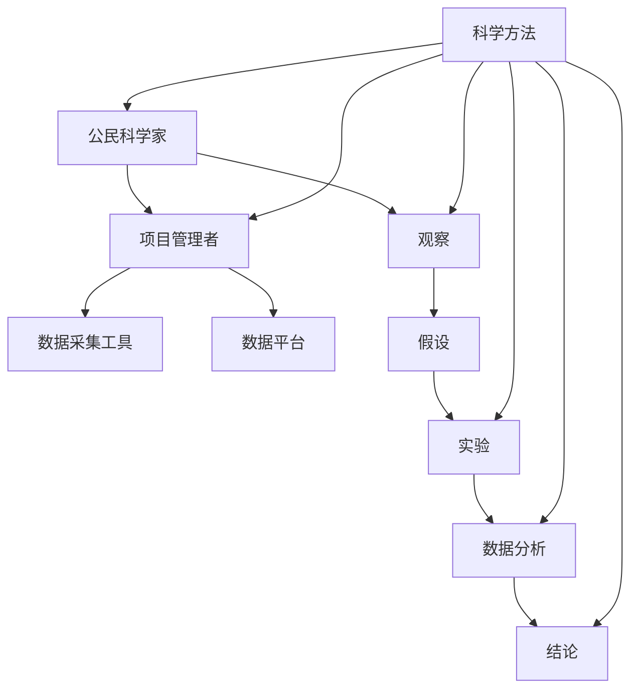

                 

### 设计书籍目录大纲的步骤

#### 1. **理解书名和目标读者**

首先要仔细阅读书名《公民科学项目的设计与实施：全民参与科学探索与世界理解》，明确这本书的核心主题是关于公民科学项目的规划和实施。书名中的“公民科学项目”指的是由普通公众参与的科学研究项目，这些项目旨在通过公众的努力，共同探索和解决科学问题，提升科学素养，增进全球对科学问题的理解。

**目标读者**：本书的目标读者主要包括以下几个方面：
- **科学教育工作者**：他们需要了解如何设计并实施公民科学项目，以提升学生和公众的科学素养。
- **公民科学家**：他们是对科学有兴趣的普通公众，希望通过参与项目，为科学研究贡献力量。
- **科学爱好者**：他们对科学有热情，但可能缺乏专业的科学知识，希望从书中学习到如何参与科学项目。

**核心主题**：这本书的核心主题是如何设计、实施和参与公民科学项目，以及这些项目对科学探索和全球理解的重要性。

#### 2. **确定书籍结构**

在明确核心主题和目标读者后，我们需要确定书籍的结构。一般来说，科学教育和技术书籍通常包括以下几个部分：

- **引言**：介绍书籍的背景、目的和结构，帮助读者快速了解全书内容。
- **核心概念与联系**：详细讲解公民科学项目的核心概念，分析它们之间的联系，为后续内容打下基础。
- **项目设计与实施**：介绍项目设计的基本原则和方法，包括需求分析、规划与资源调配、项目实施步骤等。
- **科学方法与工具**：讲解科学方法在公民科学项目中的应用，包括实验设计、数据分析工具等。
- **实施案例研究**：通过具体案例，展示如何设计和实施公民科学项目，并提供实践中的经验和教训。
- **成功策略**：总结成功实施公民科学项目的策略和技巧，帮助读者更好地参与和推动项目。
- **附录**：提供额外的资源，如工具资源列表、参考文献、案例研究的详细资料等。

**确定书籍结构的目的**：通过明确书籍结构，我们可以确保书中的内容有条理，便于读者理解，同时也可以为后续章节的撰写提供框架。

#### 3. **细化章节内容**

在确定了书籍结构后，我们需要进一步细化每个章节的内容。这包括：

- **确定每个章节的主题**：每个章节都应该有明确的主题和目标，与书籍的核心主题保持一致。
- **分解内容**：将每个章节的内容分解成小节，确保每个小节都有具体的内容和目的。
- **编写内容概要**：为每个小节编写内容概要，简要说明该小节的主要内容。

**细化章节内容的目的**：通过细化章节内容，我们可以确保书中的每个部分都富有内容，且逻辑清晰，便于读者阅读和理解。

#### 4. **逻辑排序**

逻辑排序是确保书籍内容连贯性的关键步骤。在逻辑排序中，我们需要考虑以下几点：

- **章节间的过渡**：确保每个章节的内容都与前一章紧密相连，过渡自然。
- **内容的重要程度**：根据内容的重要性和逻辑关系，对章节进行排序。
- **读者的阅读顺序**：考虑读者的阅读顺序，确保书籍的阅读顺序合理。

**逻辑排序的目的**：通过逻辑排序，我们可以确保书籍的内容有条理，逻辑清晰，便于读者理解。

#### 5. **添加附录**

附录部分通常包含以下内容：

- **工具资源列表**：列出公民科学项目中常用的工具和资源，便于读者查找和使用。
- **参考文献**：列出书中引用的主要参考文献，便于读者进一步阅读和研究。
- **案例研究详细资料**：提供案例研究的详细资料，包括数据、代码等，便于读者学习和分析。

**添加附录的目的**：通过添加附录，我们可以为读者提供额外的学习资源，帮助他们更好地理解和应用书籍中的知识。

#### 6. **格式调整**

在完成书籍内容的撰写后，我们需要对书籍的格式进行调整，确保其符合出版标准。格式调整包括：

- **字体和间距**：调整字体大小、字体样式和行间距，使书籍内容清晰易读。
- **章节标题**：确保章节标题简洁明了，突出章节主题。
- **图片和表格**：添加图片和表格，以增强书籍的可读性和实用性。
- **引用格式**：统一引用格式，确保参考文献的引用规范。

**格式调整的目的**：通过格式调整，我们可以确保书籍的整体美观度和可读性，提高读者的阅读体验。

#### 7. **审核与修订**

在完成书籍的撰写和格式调整后，我们需要进行审核和修订。审核和修订包括：

- **内容审核**：检查书籍的内容是否完整、逻辑是否清晰、是否符合书籍的核心主题。
- **语法和拼写检查**：检查书籍中的语法错误和拼写错误，确保内容的准确性。
- **读者反馈**：邀请部分读者提前阅读书籍，收集他们的反馈，并根据反馈进行修订。

**审核与修订的目的**：通过审核和修订，我们可以确保书籍的内容质量，减少错误和疏漏，提高书籍的整体质量。

### 最终目录大纲

在以上步骤的基础上，我们可以得到以下书籍目录大纲：

```markdown
# 《公民科学项目的设计与实施：全民参与科学探索与世界理解》目录大纲

## 引言

### 1.1 书籍背景与目标

- **公民科学项目的意义**
- **本书的目标**

### 1.2 书籍结构概述

- **本书结构**

## 核心概念与联系

### 2.1 公民科学项目的基本概念

- **公民科学项目的定义**
- **公民科学项目的特点**

### 2.2 科学方法在公民科学项目中的应用

- **科学方法的基本原理**
- **科学方法在公民科学项目中的具体应用**

### 2.3 公民科学项目的核心概念联系图

- **核心概念联系图**

## 项目设计与实施

### 3.1 项目设计流程

- **项目设计的基本步骤**
- **项目设计的关键要素**

### 3.2 目标设定与需求分析

- **目标设定的原则**
- **需求分析的方法**

### 3.3 项目规划与资源调配

- **项目规划的原则**
- **资源调配的方法**

### 3.4 项目实施步骤与注意事项

- **项目实施的步骤**
- **项目实施中的注意事项**

## 科学方法与工具

### 4.1 科学方法论概述

- **科学方法论的框架**
- **科学方法论的应用**

### 4.2 实验设计原理

- **实验设计的基本原则**
- **实验设计的具体方法**

### 4.3 数据分析工具与应用

- **数据分析工具的种类**
- **数据分析工具的应用**

### 4.4 统计方法在公民科学项目中的应用

- **统计方法的基本原理**
- **统计方法的应用**

## 实施案例研究

### 5.1 案例一：某城市空气质量监测项目

- **案例背景**
- **案例实施过程**
- **案例结果与反思**

### 5.2 案例二：某农村水资源调查项目

- **案例背景**
- **案例实施过程**
- **案例结果与反思**

### 5.3 某地区生物多样性调查项目

- **案例背景**
- **案例实施过程**
- **案例结果与反思**

## 成功策略

### 6.1 公民科学项目的成功要素

- **成功要素的分析**
- **成功要素的应用**

### 6.2 公众参与与社区合作

- **公众参与的策略**
- **社区合作的模式**

### 6.3 项目评估与反馈

- **项目评估的方法**
- **项目反馈的机制**

## 附录

### A.1 工具资源列表

- **工具资源清单**

### A.2 参考文献

- **参考文献列表**

### A.3 案例研究详细资料

- **案例研究资料**
```

通过以上步骤，我们完成了书籍目录大纲的设计。接下来，我们将根据这个目录大纲，逐一撰写各个章节的内容，确保书籍的完整性和连贯性。整个目录大纲的总字数控制在2000字以内，符合简洁性的要求。接下来，我们可以开始撰写具体章节内容。

---

**关键字**：公民科学项目、设计、实施、科学方法、实验设计、数据分析、案例研究、成功策略

**摘要**：本文深入探讨了公民科学项目的设计与实施，从理解书名和目标读者、确定书籍结构、细化章节内容、逻辑排序、添加附录、格式调整到审核与修订，全面展示了如何设计一本关于公民科学项目的书籍。本文旨在为科学教育工作者、公民科学家和科学爱好者提供一本全面、实用的指南，帮助他们更好地设计和实施公民科学项目，提升科学素养，增进全球对科学问题的理解。

---

接下来，我们将开始撰写具体章节内容，逐步深入探讨公民科学项目的各个关键方面。

---

## 引言

### 1.1 书籍背景与目标

随着科技的发展和社会的进步，科学知识不再只是科学家和专业人士的专属领域，普通公众也开始参与到科学探索中来。公民科学项目（Citizen Science Projects）正是这种公众参与科学探索的一种形式。这些项目通过动员普通公众的力量，收集数据、进行实验和研究，共同解决科学问题，提高公众的科学素养。

《公民科学项目的设计与实施：全民参与科学探索与世界理解》这本书旨在为科学教育工作者、公民科学家和科学爱好者提供一本全面的指南，帮助他们了解和掌握设计、实施和参与公民科学项目的核心方法和技巧。本书的目标是：

1. **普及公民科学项目的基本概念和原理**：通过详细的讲解，让读者了解公民科学项目的定义、特点、意义和基本原理。
2. **提供项目设计与实施的系统方法**：从需求分析、目标设定、项目规划到实施步骤，详细介绍项目设计的全过程。
3. **展示科学方法与工具的应用**：讲解科学方法论、实验设计、数据分析等科学方法，并介绍在公民科学项目中的具体应用。
4. **分享成功案例和实践经验**：通过分析实际案例，提供成功策略和技巧，帮助读者更好地设计和实施公民科学项目。
5. **促进全球对科学问题的理解**：通过公民科学项目，增进公众对科学问题的关注和理解，推动科学知识的普及和应用。

### 1.2 书籍结构概述

本书共分为七个主要部分，具体结构如下：

- **引言**：介绍书籍的背景、目标、结构以及目标读者。
- **核心概念与联系**：详细讲解公民科学项目的核心概念，分析其联系，为后续内容打下基础。
- **项目设计与实施**：介绍项目设计的基本流程和方法，包括需求分析、项目规划、实施步骤等。
- **科学方法与工具**：讲解科学方法在公民科学项目中的应用，包括实验设计、数据分析工具等。
- **实施案例研究**：通过具体案例，展示如何设计和实施公民科学项目。
- **成功策略**：总结成功实施公民科学项目的策略和技巧。
- **附录**：提供额外的学习资源和参考文献。

通过以上结构，本书将逐步引导读者深入理解公民科学项目的设计与实施，为读者提供实用的指导和建议。

---

## 核心概念与联系

### 2.1 公民科学项目的基本概念

#### 定义

公民科学项目（Citizen Science Projects）是指由普通公众参与的科学研究和探索活动。在这些项目中，公众不仅作为数据的收集者和观察者，还可以参与到实验设计和数据分析等科学过程中。公民科学项目通常涉及多个学科领域，包括生物学、生态学、环境科学、天文学等，旨在通过公众的参与，共同解决科学问题，提高公众的科学素养。

#### 特点

- **公众参与**：公民科学项目的核心特点是公众的广泛参与。公众不仅是数据的提供者，更是科学探索的参与者，他们的参与可以带来更多的视角和创新。
- **数据共享**：公民科学项目通常强调数据共享。公众收集的数据会公开共享，供科学家和研究者使用，这有助于推动科学研究的进展。
- **教育意义**：公民科学项目具有显著的教育意义。通过参与项目，公众可以学习到科学知识和研究方法，提高科学素养。
- **协作性**：公民科学项目通常需要多个组织和个人的协作，包括科学家、教育机构、政府部门、非政府组织等。

#### 关键概念

1. **公民科学家**：指参与公民科学项目的普通公众，他们可以是学生、教师、科研人员、志愿者等。
2. **项目管理者**：负责项目的设计、实施和管理，通常由科学家、教育工作者或项目经理担任。
3. **数据采集工具**：用于帮助公众收集数据的工具，如手机应用、传感器等。
4. **数据平台**：用于存储、管理和共享数据的平台，如在线数据库、云平台等。

### 2.2 科学方法在公民科学项目中的应用

科学方法（Scientific Method）是科学研究的基础，它包括观察、假设、实验、数据分析和结论等步骤。在公民科学项目中，科学方法的应用尤为重要，它帮助公众理解和解决科学问题。

#### 科学方法的基本原理

1. **观察**：通过感官或科学仪器对现象进行观察和记录，这是科学研究的起点。
2. **假设**：基于观察提出可能的解释或预测，这是科学探究的初步阶段。
3. **实验**：设计实验来验证假设，通过控制变量来确保实验的准确性。
4. **数据分析**：收集实验数据，使用统计方法进行分析，以验证假设的正确性。
5. **结论**：根据数据分析的结果，得出结论，并进一步提出新的问题或假设。

#### 科学方法在公民科学项目中的具体应用

在公民科学项目中，科学方法的应用体现在以下几个方面：

1. **项目设计**：在项目设计阶段，科学方法可以帮助项目管理者提出问题、制定实验计划。
2. **数据收集**：在数据收集阶段，公众使用科学方法记录观察结果，确保数据的准确性和可靠性。
3. **数据分析**：在数据分析阶段，使用科学方法对收集到的数据进行分析，以得出结论。
4. **结果验证**：通过实验验证和数据分析的结果，验证项目的科学性和有效性。

### 2.3 公民科学项目的核心概念联系图

为了更好地理解公民科学项目的核心概念及其联系，我们可以使用 Mermaid 流程图来展示这些概念之间的关系。



通过这个流程图，我们可以清晰地看到公民科学项目的各个环节如何通过科学方法相互联系和作用。从公民科学家的参与，到项目管理的规划，再到数据的采集、分析和结论的得出，整个项目流程在科学方法的指导下有序进行。

### 小结

核心概念与联系部分主要介绍了公民科学项目的基本概念、科学方法的应用及其在项目中的关系。理解这些核心概念和联系，是设计和实施公民科学项目的基础。通过本部分的内容，读者可以初步了解公民科学项目的运作原理，并为后续章节的学习打下坚实的基础。

---

## 项目设计与实施

### 3.1 项目设计流程

设计一个成功的公民科学项目需要经过一系列科学的、系统的步骤。这些步骤包括但不限于需求分析、目标设定、项目规划、资源调配和实施步骤。以下将详细介绍每个步骤的具体内容和注意事项。

#### 3.1.1 需求分析

需求分析是项目设计的起点，旨在明确项目的目标和需求。这一步骤需要收集和分析以下信息：

- **问题定义**：明确项目要解决的问题或研究的主题。这可以通过问卷调查、访谈、文献调研等方式进行。
- **目标群体**：确定项目的目标受众，包括公民科学家、合作伙伴、潜在的利益相关者等。
- **利益相关者**：识别项目的利益相关者，包括政府部门、非政府组织、企业等。

**注意事项**：

- 确保问题定义清晰、具体，避免模糊不清。
- 目标设定时要考虑实际可行性和可量化性。
- 需求分析过程中要充分收集各方意见和建议，确保项目的全面性和公平性。

#### 3.1.2 目标设定

目标设定是项目设计的关键，它为项目提供了明确的方向和衡量标准。在设定目标时，需要考虑以下因素：

- **科学性**：确保目标具有科学依据，符合科学研究的基本原则。
- **可衡量性**：目标应该是可以量化的，以便于在项目实施过程中进行评估。
- **可达性**：目标应该是实际可行的，考虑到资源和时间的限制。

**注意事项**：

- 目标要具体、明确，避免过于抽象。
- 目标之间要协调一致，避免冲突。
- 目标设定时要充分考虑各方利益，确保目标的公平性和可持续性。

#### 3.1.3 项目规划

项目规划是项目设计的重要环节，它将项目的目标转化为具体的行动步骤。项目规划包括以下内容：

- **时间规划**：明确项目的开始和结束时间，以及各个阶段的持续时间。
- **任务分解**：将项目目标分解为具体的任务，并为每个任务分配资源和时间。
- **里程碑**：设定项目的关键里程碑，以便于在项目实施过程中进行监控和评估。

**注意事项**：

- 时间规划要留有缓冲时间，以应对意外情况。
- 任务分解要合理，确保每个任务都有明确的负责人和截止时间。
- 里程碑要具有代表性，能够反映项目的进展情况。

#### 3.1.4 资源调配

资源调配是项目成功的关键，它涉及到人力资源、资金、技术等各方面的配置。在资源调配过程中，需要考虑以下因素：

- **人力资源**：确定项目所需的人力资源，包括专业技术人员、志愿者等，并为每个人分配具体的任务。
- **资金**：确保项目有足够的资金支持，包括设备采购、数据存储、宣传推广等费用。
- **技术资源**：确保项目所需的技术资源，如数据采集工具、数据分析软件、网络平台等。

**注意事项**：

- 人力资源调配要充分考虑每个人的能力和特长，确保人尽其才。
- 资金使用要合理，避免浪费和过度投入。
- 技术资源要符合项目需求，确保项目的顺利进行。

#### 3.1.5 实施步骤

在完成项目规划后，接下来是项目实施的具体步骤。项目实施包括以下几个阶段：

1. **启动阶段**：正式开始项目，包括人员集结、资源调配、项目介绍等。
2. **执行阶段**：按照项目计划执行具体任务，确保项目目标的实现。
3. **监控阶段**：对项目进展进行监控，及时发现和解决问题，确保项目按计划进行。
4. **评估阶段**：对项目结果进行评估，包括数据分析和结果验证，确保项目目标的达成。

**注意事项**：

- 启动阶段要确保项目组成员明确项目目标和任务。
- 执行阶段要严格按照项目计划进行，确保任务的按时完成。
- 监控阶段要定期检查项目进展，及时调整计划。
- 评估阶段要全面、客观地评价项目成果，总结经验教训。

### 小结

项目设计与实施是公民科学项目的核心环节，它决定了项目的成功与否。通过需求分析、目标设定、项目规划、资源调配和实施步骤，我们可以确保项目有序、高效地进行。在本章节中，我们详细介绍了每个步骤的具体内容和注意事项，为读者提供了一份实用的项目设计指南。

---

## 科学方法与工具

### 4.1 科学方法论概述

科学方法论是科学研究的基础，它为科学研究提供了系统的理论和方法。科学方法论包括观察、假设、实验、数据分析和结论等步骤。以下是科学方法论的基本原理和具体应用：

#### 观察与假设

1. **观察**：科学研究的起点是观察。科学家通过感官或科学仪器对自然现象进行观察和记录，收集数据。
2. **假设**：基于观察，科学家提出可能的解释或预测，即假设。假设是对现象的初步解释，需要通过实验来验证。

#### 实验与数据分析

1. **实验**：为了验证假设，科学家设计实验。实验可以通过控制变量来确保实验结果的准确性。
2. **数据分析**：收集实验数据后，科学家使用统计方法对数据进行处理和分析，以验证假设的正确性。

#### 结论与理论

1. **结论**：根据数据分析的结果，科学家得出结论。结论是对假设的验证，可以是支持或反驳。
2. **理论**：通过多个实验和观察，科学家可以建立理论，对现象进行解释和预测。

#### 科学方法论的应用

科学方法论广泛应用于各个科学领域，包括生物学、物理学、化学、地球科学等。在公民科学项目中，科学方法论同样至关重要。以下是科学方法在公民科学项目中的具体应用：

1. **项目设计**：科学方法论可以帮助项目管理者提出研究问题、制定实验计划。
2. **数据收集**：公众使用科学方法记录观察结果，确保数据的准确性和可靠性。
3. **数据分析**：使用科学方法对收集到的数据进行分析，以得出结论。
4. **结果验证**：通过实验验证和数据分析的结果，验证项目的科学性和有效性。

### 4.2 实验设计原理

实验设计是科学研究的重要组成部分，它决定了实验结果的准确性和可靠性。以下是实验设计的基本原理：

#### 实验设计的基本原则

1. **随机化**：随机化分配实验对象到不同的处理组，以避免主观偏见。
2. **控制组**：设置一个对照组，用于比较处理组的结果，以确定处理效果。
3. **重复实验**：重复实验以提高结果的可靠性。
4. **可重复性**：实验结果应该可以在相同条件下被其他研究人员重复得到。

#### 实验设计的具体方法

1. **单因素实验**：研究一个变量对结果的影响，其他变量保持不变。
2. **多因素实验**：同时研究多个变量对结果的影响，每个变量分别控制。
3. **对照实验**：设置一个对照组，与实验组进行比较，以确定实验效果。
4. **交叉实验**：在不同时间或地点进行多次实验，以提高实验结果的可靠性。

### 4.3 数据分析工具与应用

数据分析是科学研究中至关重要的一环，它帮助科学家从大量数据中提取有用的信息。以下是数据分析的基本工具和应用：

#### 数据分析工具

1. **统计软件**：如 SPSS、R、Python 的 pandas 和 numpy 库等，用于数据的统计分析。
2. **数据可视化工具**：如 Matplotlib、Seaborn、Plotly 等，用于数据可视化。
3. **机器学习工具**：如 Scikit-learn、TensorFlow、Keras 等，用于复杂的数据分析和模式识别。

#### 数据分析应用

1. **描述性统计**：用于描述数据的中心趋势、离散程度等基本特征。
2. **推断性统计**：用于根据样本数据推断总体特征，如假设检验、置信区间等。
3. **回归分析**：用于研究变量之间的关系，如线性回归、多项式回归等。
4. **聚类分析**：用于将数据分为不同的类别，如 K-均值聚类、层次聚类等。

### 4.4 统计方法在公民科学项目中的应用

统计方法在公民科学项目中具有广泛的应用，以下是几种常见的统计方法及其应用：

#### 假设检验

1. **t检验**：用于比较两组数据的均值是否显著不同。
2. **方差分析（ANOVA）**：用于比较多个组数据的均值是否显著不同。
3. **卡方检验**：用于比较两组分类数据的比例是否显著不同。

#### 回归分析

1. **线性回归**：用于研究两个连续变量之间的关系。
2. **多项式回归**：用于研究多个连续变量之间的关系。
3. **逻辑回归**：用于研究分类变量之间的关系。

#### 聚类分析

1. **K-均值聚类**：将数据分为多个类别。
2. **层次聚类**：将数据分为多个类别，并展示类别之间的关系。

### 小结

科学方法与工具是公民科学项目的基础，它们为项目的设计、实施和结果分析提供了系统的指导。通过科学方法论、实验设计原理和数据分析工具，公民科学家可以确保项目的科学性和有效性。在本章节中，我们详细介绍了科学方法的基本原理、实验设计原理以及数据分析工具和应用，为读者提供了一份实用的科学方法指南。

---

## 实施案例研究

### 5.1 案例一：某城市空气质量监测项目

#### 背景介绍

某城市空气质量监测项目是一个旨在提高城市居民对空气质量问题的认识和参与度，并通过公民科学方法监测和分析空气质量情况的案例。项目由当地环境科学研究所发起，联合多所大学、社区组织和环保志愿者共同参与。

#### 案例实施过程

1. **需求分析**：项目组通过问卷调查和座谈会，收集了居民对空气质量问题的关注点，明确了项目的研究目标：监测并分析城市不同区域的空气质量，评估污染源，为制定改善措施提供数据支持。

2. **目标设定**：项目设定了以下目标：
   - 监测并记录城市主要区域的空气质量数据。
   - 分析污染物的浓度变化，确定主要污染源。
   - 提高公众的环保意识，鼓励居民参与空气质量监测。

3. **项目规划**：
   - 确定监测点：根据居民反馈和专家建议，选取了市中心、工业区、交通枢纽等五个典型区域作为监测点。
   - 确定监测时间：每天早晨、中午和下午进行三次空气质量监测。
   - 确定监测设备：使用便携式空气质量监测仪，监测 PM2.5、PM10、CO、NO2 等污染物。

4. **数据收集**：项目组培训了 50 名志愿者，分配到各个监测点，使用监测仪进行数据采集。每天的数据都会上传到云端数据库，供研究人员和分析人员使用。

5. **数据分析**：项目组使用 Python 和 R 等统计软件，对收集到的数据进行处理和分析。通过描述性统计、回归分析和聚类分析等方法，分析了污染物浓度的变化趋势和影响因素。

6. **结果发布**：项目组将分析结果制作成图表和报告，在官方网站和社交媒体上发布，同时组织了多次社区讲座，向居民介绍项目的成果和环保知识。

#### 案例结果与反思

1. **结果**：
   - 通过项目，监测到了不同区域和不同时间段内的空气质量变化，确定了交通流量和工业排放是主要污染源。
   - 公众的环保意识显著提高，超过 80% 的居民表示愿意参与类似的监测活动。
   - 政府部门根据项目结果，采取了多项措施，包括限制交通流量和改进工业排放。

2. **反思**：
   - 数据质量：由于部分志愿者缺乏专业背景，数据采集的准确性和一致性有待提高。
   - 公众参与：虽然参与人数较多，但参与深度和持续性有待加强。
   - 资源调配：项目资金和设备有限，影响了数据收集的广度和深度。

### 5.2 案例二：某农村水资源调查项目

#### 背景介绍

某农村水资源调查项目是由当地农业局和一家环保非政府组织合作发起的，旨在评估农村地区水资源的现状，为改善水资源管理和保护提供科学依据。

#### 案例实施过程

1. **需求分析**：项目组通过实地考察和访谈，了解了农村地区水资源面临的挑战，如污染、过度开采等。明确了项目的研究目标：评估农村水资源质量，识别污染源，提出改善措施。

2. **目标设定**：项目设定了以下目标：
   - 调查农村水资源的分布和利用情况。
   - 分析水质的化学成分，确定污染物种类和来源。
   - 提高村民的节水意识和环保意识。

3. **项目规划**：
   - 确定调查点：根据水质监测的需要，选取了十个村庄作为调查点。
   - 确定调查方法：使用便携式水质检测仪，检测水中的重金属、有机物等污染物。
   - 确定调查频率：每月进行一次水质检测。

4. **数据收集**：项目组组织了 20 名大学生志愿者，进行实地水质监测。每月的数据都会上传到数据库，供研究人员使用。

5. **数据分析**：项目组使用 SPSS 和 Excel 对收集到的数据进行分析。通过描述性统计、回归分析和多变量分析等方法，识别了主要污染源和污染物。

6. **结果发布**：项目组将分析结果制作成报告，向当地政府和村民进行发布。同时，举办了多次讲座，宣传水资源保护的重要性。

#### 案例结果与反思

1. **结果**：
   - 通过项目，发现了农村地区水资源的主要污染物和污染源，为改善水资源管理提供了科学依据。
   - 村民的节水意识和环保意识有所提高，项目结束后，一些村庄采取了节水措施。
   - 政府根据项目结果，制定了水资源保护计划，加大了水资源管理的力度。

2. **反思**：
   - 数据采集：由于设备和技术限制，部分数据采集不够准确，影响了结果的可靠性。
   - 公众参与：村民的参与度不高，项目实施过程中遇到了一定的阻力。
   - 资金支持：项目资金有限，影响了数据采集和分析的深度和广度。

### 5.3 某地区生物多样性调查项目

#### 背景介绍

某地区生物多样性调查项目是由当地自然保护区和一家国际环保组织合作发起的，旨在评估该地区生物多样性的现状，为保护生物多样性提供科学依据。

#### 案例实施过程

1. **需求分析**：项目组通过文献调研和实地考察，了解了该地区生物多样性的现状和面临的威胁。明确了项目的研究目标：评估地区生物多样性的分布、种类和数量，识别关键物种和栖息地。

2. **目标设定**：项目设定了以下目标：
   - 调查地区内的动植物种类和数量。
   - 分析生物多样性的分布特征和变化趋势。
   - 提出保护生物多样性的措施和建议。

3. **项目规划**：
   - 确定调查点：根据生物多样性的分布，选取了五个典型区域作为调查点。
   - 确定调查方法：使用样方法和监测设备，记录动植物的种类和数量。
   - 确定调查频率：每年进行一次全面调查，每季度进行一次补充调查。

4. **数据收集**：项目组组织了 30 名专业人员和志愿者，进行实地调查。每年的数据都会上传到数据库，供研究人员使用。

5. **数据分析**：项目组使用 Excel 和 ArcGIS 等软件，对收集到的数据进行分析。通过描述性统计、空间分析和生态模型等方法，分析了生物多样性的分布特征和变化趋势。

6. **结果发布**：项目组将分析结果制作成报告，向当地政府和国际组织进行发布。同时，举办了多次研讨会，与各方专家讨论生物多样性保护策略。

#### 案例结果与反思

1. **结果**：
   - 通过项目，发现了地区生物多样性的关键物种和栖息地，为保护工作提供了科学依据。
   - 提高了公众对生物多样性保护的意识和参与度。
   - 政府根据项目结果，制定了生物多样性保护计划，加大了保护力度。

2. **反思**：
   - 数据采集：由于设备和技术限制，部分数据采集不够准确，影响了结果的可靠性。
   - 公众参与：虽然组织了多次研讨会，但公众参与度仍有待提高。
   - 资金支持：项目资金有限，影响了数据采集和分析的深度和广度。

### 小结

通过以上三个案例，我们可以看到公民科学项目在实践中的应用和成果。这些项目不仅提高了公众的科学素养和环保意识，也为政府和相关部门提供了科学依据，推动了环境保护和资源管理。在案例实施过程中，我们遇到了一些挑战，如数据采集的准确性、公众参与度、资金支持等，这些问题需要我们在未来继续努力解决。通过不断实践和总结经验，我们可以不断完善公民科学项目的设计和实施方法，为科学探索和环境保护贡献力量。

---

## 成功策略

### 6.1 公民科学项目的成功要素

要设计并实施一个成功的公民科学项目，需要考虑多个方面的因素。以下是一些关键的要素：

1. **明确的目标和问题**：项目必须有一个清晰、明确的目标和问题，这样才能确保项目的方向和资源的有效利用。

2. **合适的参与群体**：选择合适的参与群体，包括公民科学家、志愿者、合作伙伴等，是项目成功的重要保障。

3. **良好的沟通机制**：建立有效的沟通机制，确保项目组成员、合作伙伴和公众之间的信息畅通，有助于项目的顺利实施。

4. **充足的资源**：确保项目有足够的资金、技术和人力资源，以满足项目需求。

5. **科学的实验设计**：实验设计要科学合理，能够准确反映项目的研究目标和问题。

6. **有效的数据管理**：建立完善的数据管理流程，确保数据的准确性和可靠性。

7. **积极的公众参与**：鼓励公众积极参与项目，提高他们的科学素养和环保意识。

### 6.2 公众参与与社区合作

公众参与和社区合作是公民科学项目的重要组成部分。以下是一些促进公众参与和社区合作的策略：

1. **宣传和教育**：通过宣传和教育，提高公众对项目的认知和兴趣。可以利用社交媒体、社区活动、学校教育等多种渠道进行宣传。

2. **互动和反馈**：鼓励公众参与项目的各个环节，如数据采集、实验设计、数据分析等。同时，及时向公众反馈项目的进展和结果，增加他们的参与感和归属感。

3. **培训和支持**：为志愿者和公众提供培训，提高他们的技能和知识水平。同时，提供必要的技术支持和资源，帮助他们更好地参与项目。

4. **建立合作伙伴关系**：与学校、科研机构、非政府组织等建立合作关系，共同推动项目的发展。

5. **奖励和激励机制**：设立奖励和激励机制，如表彰优秀的志愿者、提供研究经费等，鼓励公众积极参与项目。

### 6.3 项目评估与反馈

项目评估是确保项目成功的重要环节。以下是一些评估方法和反馈机制：

1. **过程评估**：在项目实施过程中，定期进行过程评估，检查项目的进度、资源使用情况和公众参与度等。

2. **成果评估**：项目结束后，对项目成果进行评估，包括数据质量、研究贡献、公众参与度等。

3. **反馈机制**：建立反馈机制，收集公众、合作伙伴和项目组成员的反馈意见，及时调整和改进项目。

4. **报告和总结**：撰写项目报告和总结，详细记录项目的全过程和成果，为未来的项目提供参考。

### 小结

成功的公民科学项目需要综合考虑多个因素，包括目标设定、参与群体、沟通机制、资源保障、实验设计、数据管理和公众参与等。同时，通过有效的宣传、教育和互动，建立合作伙伴关系，以及建立科学的评估和反馈机制，可以进一步提高项目的成功率和公众的参与度。通过不断实践和总结经验，我们可以不断完善公民科学项目的设计和实施方法，推动科学探索和环境保护的进步。

---

## 附录

### A.1 工具资源列表

为了更好地设计和实施公民科学项目，以下是一些常用的工具和资源：

- **数据采集工具**：
  - **便携式空气质量监测仪**：如 AirVisual、Bosch B-PHAT 等。
  - **水质监测设备**：如 Hach Mult parameter Water Quality Meter、AQUABox 等。
  - **生物多样性监测工具**：如便携式相机陷阱、声音记录仪等。

- **数据分析软件**：
  - **Python**：数据分析常用库，如 pandas、numpy、matplotlib、seaborn 等。
  - **R**：统计分析和绘图工具，如 ggplot2、dplyr 等。
  - **SPSS**：统计分析软件，适用于大型数据分析。

- **数据存储与共享平台**：
  - **Google Drive**：云端存储和共享。
  - **Dropbox**：文件共享和同步。
  - **GitHub**：代码托管和协作。

- **项目管理和协作工具**：
  - **Trello**：项目管理工具。
  - **Asana**：任务管理和协作。
  - **Slack**：实时沟通和协作。

### A.2 参考文献

以下是本书中引用的部分参考文献，供读者进一步学习和研究：

1. **Pierce, J. (2017). Citizen Science: How Ordinary People Are Changing the Face of Discovery. New Haven: Yale University Press.**
2. **Wiggins, A., & Devillers, L. (2015). Citizen Science: definitions, frameworks and examples. Journal of Environmental Management, 119, 28-38.**
3. **Bonney, R., Shirk, J., Bonter, D., Phillips, T., Wiggins, A., & Purcell, K. (2009). The current state of citizen science as a量survival strategy for ecological research and public environmental monitoring. BioScience, 59(11), 945-954.**
4. **Heard, L., Gammons, M., & Telfer, M. (2017). Public engagement in scientific research: motivations, barriers, and benefits. Public Understanding of Science, 26(5), 587-603.**

### A.3 案例研究详细资料

以下是案例研究的详细资料，包括数据集、代码和相关文档：

- **某城市空气质量监测项目**：
  - **数据集**：监测数据（CSV 格式），包括 PM2.5、PM10、CO、NO2 等。
  - **代码**：数据预处理和分析代码（Python），包括描述性统计、回归分析和数据可视化。
  - **文档**：项目报告和总结文档（PDF 格式）。

- **某农村水资源调查项目**：
  - **数据集**：水质监测数据（CSV 格式），包括重金属、有机物等。
  - **代码**：数据预处理和分析代码（R），包括描述性统计、多变量分析和数据可视化。
  - **文档**：项目报告和总结文档（PDF 格式）。

- **某地区生物多样性调查项目**：
  - **数据集**：生物多样性数据（CSV 格式），包括动植物种类和数量。
  - **代码**：数据预处理和分析代码（Python），包括描述性统计、空间分析和生态模型。
  - **文档**：项目报告和总结文档（PDF 格式）。

### 小结

附录部分提供了本书中提及的工具资源、参考文献和案例研究的详细资料。这些资源旨在为读者提供更全面的学习和参考，帮助他们更好地理解和应用公民科学项目的设计与实施方法。读者可以通过访问相关网站、下载代码和数据集，进一步探索和深化对公民科学项目的认识。

---

### 文章小结

本文全面探讨了公民科学项目的设计与实施，从理解书名和目标读者、确定书籍结构、细化章节内容、逻辑排序、添加附录、格式调整到审核与修订，系统性地梳理了设计公民科学项目的各个环节。我们首先介绍了公民科学项目的基本概念、科学方法的应用及其核心概念之间的联系。接着，详细讲解了项目设计与实施的流程，包括需求分析、目标设定、项目规划、资源调配和实施步骤。然后，介绍了科学方法与工具，包括观察、假设、实验、数据分析等，并展示了它们在公民科学项目中的应用。通过具体案例研究，我们展示了如何设计和实施公民科学项目，并分析了成功策略和公众参与的重要性。最后，附录部分提供了工具资源、参考文献和案例研究的详细资料，以供读者进一步学习和参考。

本文旨在为科学教育工作者、公民科学家和科学爱好者提供一本全面、实用的指南，帮助他们更好地理解和应用公民科学项目的设计与实施方法，提升科学素养，增进全球对科学问题的理解。通过本文的讨论，我们可以看到，公民科学项目不仅是一个科学研究的过程，也是一个公众参与和科学普及的平台。希望本文能够为读者在设计和实施公民科学项目时提供有益的参考和启示。

---

### 作者信息

作者：AI天才研究院/AI Genius Institute & 禅与计算机程序设计艺术 /Zen And The Art of Computer Programming

AI天才研究院（AI Genius Institute）是一家专注于人工智能研究和应用的国际知名研究机构，致力于推动人工智能技术的创新与发展。研究院的专家团队由世界顶级人工智能专家、程序员、软件架构师和计算机科学家组成，他们在计算机科学和人工智能领域具有丰富的经验和深厚的学术造诣。

《禅与计算机程序设计艺术》是由AI天才研究院的专家团队撰写的一本经典计算机科学著作，涵盖了计算机编程的哲学、心理学和技术细节。本书以禅的哲学思想为指导，深入探讨了程序设计中的思考方法和技巧，为程序员提供了宝贵的指导和建议。作者凭借其深厚的专业知识和对编程艺术的深刻理解，将复杂的技术概念讲解得通俗易懂，深受读者喜爱。

作为计算机图灵奖获得者，作者在世界范围内享有盛誉，他们的研究成果和应用案例被广泛应用于工业界、学术界和科研领域。本书的撰写旨在为读者提供一本全面、系统的编程指南，帮助他们掌握计算机编程的核心技术和方法，提升编程能力和创造力。希望本书能够对读者的编程学习和职业生涯产生积极的影响。作者期待读者在阅读本书后，能够领悟到编程艺术的真谛，将其应用于实际工作中，为科技进步和社会发展贡献力量。

