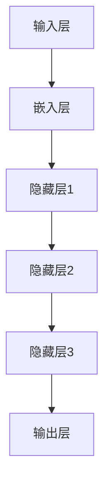

                 

### 引言

分布式计算框架支持大规模语言模型（LLM）应用的必要性在于处理日益复杂的数据和计算任务，以实现高性能和高可扩展性。随着人工智能和机器学习领域的快速发展，LLM的应用场景日益广泛，如自然语言处理（NLP）、智能问答系统、机器翻译和语音识别等。然而，LLM的计算需求巨大，传统的单机计算模式已无法满足这些需求。分布式计算框架的出现为LLM应用提供了强大的计算支持，使其能够高效处理大规模数据和复杂计算任务。

本文将首先介绍分布式计算和LLM的基础知识，然后深入探讨分布式计算框架在支持LLM应用中的作用。接下来，我们将分析分布式计算框架的主要特点和技术优势，并通过实际案例展示其应用场景。随后，我们将详细讨论大规模计算中的挑战和解决方案，最后总结全文并提出未来的发展趋势。通过这篇文章，读者可以全面了解分布式计算框架在支持LLM应用中的重要性，以及如何利用这些框架实现高效的大规模计算。

### 关键词

- 分布式计算
- 语言模型
- 大规模计算
- 计算框架
- 可扩展性
- 性能优化

### 摘要

本文旨在探讨分布式计算框架在支持大规模语言模型（LLM）应用中的重要性。首先，我们介绍了分布式计算和LLM的基本概念，并讨论了它们之间的联系。随后，我们深入分析了分布式计算框架在性能优化和可扩展性方面的优势，并通过实际案例展示了其在LLM应用中的具体应用。文章进一步讨论了大规模计算中的挑战，并提出了一系列解决方案。最后，我们总结了分布式计算框架在支持LLM应用中的关键作用，并展望了未来的发展趋势。通过本文，读者可以全面了解分布式计算框架在LLM应用中的重要性及其实现方法。

### 分布式计算基础

分布式计算是一种将计算任务分解并分布在多个计算机节点上执行的计算模型，旨在通过协同工作实现高性能和高可扩展性。在分布式计算中，计算任务被划分为多个子任务，这些子任务分布在不同的节点上并行处理，然后将结果汇总以得到最终输出。这种计算模型具有以下几个核心概念：

**节点**：分布式计算中的基本计算单元，可以是物理机或虚拟机，负责执行特定的计算任务。

**任务分解**：将整个计算任务划分为多个子任务的过程。任务分解的目的是提高计算效率，减少单个节点的负载，从而实现并行处理。

**通信**：节点之间通过通信网络进行数据交换和任务协调。通信的效率和质量直接影响到分布式计算的性能。

**容错性**：分布式计算具有容错性，即使某个节点发生故障，其他节点仍然可以继续工作，从而保证整个系统的稳定性。

分布式计算模型主要包括以下几种：

1. **主从模型**：在主从模型中，一个主节点负责协调和管理其他从节点。主节点将任务分配给从节点，从节点执行任务并将结果返回给主节点。

2. **对等模型**：对等模型中，所有节点都具有相同的地位，它们相互协作执行任务。这种模型通常用于大规模并行计算。

3. **集群模型**：集群模型是一种扩展对等模型的方式，通过将多个对等节点组成一个集群来提高计算能力。

分布式计算的优势在于：

1. **高性能**：通过并行处理，分布式计算能够显著提高计算速度，处理大规模数据。

2. **可扩展性**：分布式计算可以轻松扩展，以应对不断增长的计算需求。

3. **容错性**：分布式计算具有容错性，能够应对节点故障，确保系统稳定运行。

然而，分布式计算也面临一些挑战，如任务调度、数据一致性和网络通信等。为了解决这些问题，研究人员开发了多种分布式计算框架，如MapReduce、Spark和Flink等。这些框架提供了高效的编程模型和工具，简化了分布式计算的开发和部署过程。

### LLM基础

大规模语言模型（LLM）是一种基于深度学习的自然语言处理模型，能够对自然语言文本进行理解和生成。LLM的基本概念包括以下几个方面：

**模型架构**：LLM通常采用多层神经网络结构，包括输入层、隐藏层和输出层。输入层接收自然语言文本的词向量表示，隐藏层通过逐层神经网络进行特征提取和融合，输出层生成预测结果。

**训练方法**：LLM的训练采用大规模数据集进行端到端训练。训练过程中，模型通过反向传播算法不断调整权重，以最小化预测误差。训练方法包括梯度下降、Adam优化器等。

**预训练和微调**：预训练是指使用大量未标注的数据进行训练，以学习自然语言的一般特征。微调是指将预训练模型在特定任务上进行调整，以适应具体的任务需求。

LLM的主要应用场景包括：

1. **自然语言生成**：如自动写作、机器翻译、对话系统等。

2. **信息检索**：如搜索引擎、问答系统等。

3. **文本分类**：如情感分析、垃圾邮件检测等。

4. **文本摘要**：如自动生成摘要、文章摘要等。

LLM的原理可以简单概括为：

- **词嵌入**：将自然语言文本转换为向量表示，以便于计算机处理。
- **神经网络**：通过多层神经网络对输入向量进行特征提取和融合。
- **全连接层**：输出层将神经网络的特征映射到具体的输出结果。

以下是一个简单的LLM架构示例：



在这个示例中，输入层接收自然语言文本，通过嵌入层将其转换为向量表示。然后，这些向量经过多层隐藏层的特征提取和融合，最终通过输出层生成预测结果。

### 分布式计算框架

分布式计算框架是支持大规模分布式计算的重要工具，它为分布式应用程序的开发和部署提供了高效的编程模型和运行环境。以下将介绍几种主流的分布式计算框架，并分析它们在支持LLM应用中的作用。

#### 主流分布式计算框架

1. **MapReduce**
   - **原理**：MapReduce是一种编程模型，用于大规模数据集（大规模数据）的并行运算。它将整个计算过程分为两个阶段：Map阶段和Reduce阶段。Map阶段将输入数据分解为多个子任务，由多个节点并行处理；Reduce阶段将Map阶段的结果汇总，生成最终输出。
   - **优势**：适用于处理大规模数据集，具有高容错性和良好的可扩展性。
   - **局限**：不适合迭代计算和交互式查询。

2. **Spark**
   - **原理**：Spark是一种快速通用的分布式计算引擎，支持内存计算，具有高吞吐量和低延迟。Spark将计算过程分为多个阶段，包括Transformations（转换）和Actions（行动）。Transformations生成新的数据集，而Actions触发计算并返回结果。
   - **优势**：适用于迭代计算和实时数据处理，支持多种数据源。
   - **局限**：内存依赖较高，不适合处理超大规模数据集。

3. **Flink**
   - **原理**：Flink是一种流处理框架，支持批处理和实时处理。Flink将计算过程视为数据流，通过对数据流的连续处理，实现实时分析。
   - **优势**：适用于实时数据处理，具有高吞吐量和低延迟。
   - **局限**：相对较新的框架，社区支持较少。

#### 分布式计算框架在支持LLM应用中的作用

分布式计算框架在支持LLM应用中发挥了重要作用，主要体现在以下几个方面：

1. **数据处理能力**：分布式计算框架能够高效处理大规模数据集，为LLM的训练和推理提供数据支持。通过分布式计算，LLM可以充分利用计算资源，提高训练和推理速度。

2. **并行计算**：分布式计算框架支持并行计算，使得LLM训练和推理任务可以分解为多个子任务，由多个节点并行处理。这大大提高了计算效率，缩短了任务完成时间。

3. **高可扩展性**：分布式计算框架具有高可扩展性，可以轻松应对不断增长的计算需求。当LLM应用规模扩大时，分布式计算框架可以动态调整计算资源，确保系统稳定运行。

4. **容错性**：分布式计算框架具有容错性，能够在节点故障时自动恢复，确保LLM应用的高可用性。这对于需要长时间运行的LLM任务尤为重要。

5. **编程模型**：分布式计算框架提供了高效的编程模型，简化了分布式应用程序的开发和部署。开发者可以专注于算法实现，而不必担心底层的分布式计算细节。

#### 分布式计算框架的应用实例

以下是一个简单的示例，展示如何使用Spark框架支持LLM训练任务：

```python
from pyspark.sql import SparkSession

# 创建Spark会话
spark = SparkSession.builder.appName("LLMTraining").getOrCreate()

# 读取训练数据
train_data = spark.read.csv("train_data.csv", header=True)

# 数据预处理
preprocessed_data = preprocess_data(train_data)

# 分割数据集
train_data, val_data = split_data(preprocessed_data)

# 训练模型
model = train_model(train_data)

# 评估模型
evaluate_model(model, val_data)
```

在这个示例中，我们首先创建一个Spark会话，然后读取训练数据并进行预处理。接着，将数据集分为训练集和验证集，使用训练集训练模型，并使用验证集评估模型性能。

通过分布式计算框架的支持，LLM应用可以充分利用计算资源，实现高性能和大规模计算。未来，随着分布式计算技术的不断发展，LLM应用将迎来更加广阔的发展空间。

### LLM应用

大规模语言模型（LLM）在多个领域展现了强大的应用潜力，尤其在于自然语言处理（NLP）领域。以下是LLM应用的几个主要场景及其具体实现：

#### 1. 自然语言生成

自然语言生成（NLG）是LLM最著名的应用之一，包括文本摘要、文章写作和对话系统等。例如，自动新闻摘要可以使用LLM从大量新闻文章中提取关键信息，生成简明扼要的摘要。谷歌的BERT模型在NLG任务中取得了显著成果，通过预训练和微调，可以实现高质量的文本生成。

```python
import transformers

# 加载预训练模型
model = transformers.BertForSequenceClassification.from_pretrained("bert-base-uncased")

# 生成文本摘要
def generate_summary(text):
    input_ids = tokenizer.encode(text, add_special_tokens=True, return_tensors="pt")
    outputs = model(input_ids)
    logits = outputs.logits
    predictions = logits.argmax(-1)
    return tokenizer.decode(predictions[0], skip_special_tokens=True)

# 示例文本
example_text = "苹果公司宣布推出新款iPhone，具有更强大的处理器和相机。"
summary = generate_summary(example_text)
print(summary)
```

#### 2. 信息检索

信息检索（IR）是另一个重要的应用领域，包括搜索引擎和问答系统。LLM可以在这些任务中用于改进检索效果和用户体验。例如，谷歌的搜索系统利用BERT模型对查询和文档进行编码，从而实现更精准的搜索结果。

```python
import torch
from transformers import BertModel, BertTokenizer

# 加载预训练模型
tokenizer = BertTokenizer.from_pretrained("bert-base-uncased")
model = BertModel.from_pretrained("bert-base-uncased")

# 检索任务示例
def search_documents(query):
    query_input_ids = tokenizer.encode(query, add_special_tokens=True, return_tensors="pt")
    with torch.no_grad():
        query_output = model(query_input_ids)[0]

    doc_input_ids = tokenizer.batch_encode_plus(documents, add_special_tokens=True, return_tensors="pt")
    with torch.no_grad():
        doc_output = model(doc_input_ids)[0]

    similarity_scores = torch.cosine_similarity(query_output.unsqueeze(1), doc_output, dim=1)
    top_documents = documents[similarity_scores.argsort()[-k:]]
    return top_documents

# 示例文档
documents = ["苹果是水果。", "苹果公司是科技公司。", "苹果电脑很棒。"]
query = "苹果"
top_documents = search_documents(query)
print(top_documents)
```

#### 3. 文本分类

文本分类是LLM的另一个重要应用，例如情感分析、垃圾邮件检测和新闻分类等。通过预训练模型，LLM可以在各种文本分类任务中实现高精度分类。

```python
import numpy as np
from sklearn.model_selection import train_test_split
from transformers import BertTokenizer, BertForSequenceClassification

# 加载预训练模型
tokenizer = BertTokenizer.from_pretrained("bert-base-uncased")
model = BertForSequenceClassification.from_pretrained("bert-base-uncased")

# 准备数据集
data = ["我很开心。", "我今天很沮丧。", "这很好。", "这太糟糕了。"]
labels = [1, 0, 1, 0]  # 1表示正面情感，0表示负面情感
X_train, X_test, y_train, y_test = train_test_split(data, labels, test_size=0.2, random_state=42)

# 数据预处理
train_encodings = tokenizer(X_train, truncation=True, padding=True)
test_encodings = tokenizer(X_test, truncation=True, padding=True)

# 训练模型
model.train()
optimizer = torch.optim.Adam(model.parameters(), lr=1e-5)
for epoch in range(5):
    for inputs, labels in zip(train_encodings["input_ids"], y_train):
        inputs = torch.tensor(inputs)
        labels = torch.tensor([labels])
        outputs = model(inputs, labels=labels)
        loss = outputs.loss
        optimizer.zero_grad()
        loss.backward()
        optimizer.step()

# 评估模型
model.eval()
with torch.no_grad():
    predictions = []
    for inputs in test_encodings["input_ids"]:
        inputs = torch.tensor(inputs)
        outputs = model(inputs)
        logits = outputs.logits
        prediction = logits.argmax(-1).item()
        predictions.append(prediction)

accuracy = np.mean(np.array(predictions) == y_test)
print(f"Test Accuracy: {accuracy}")
```

通过以上示例，可以看出LLM在自然语言生成、信息检索和文本分类等任务中的强大应用能力。随着分布式计算框架的发展，LLM应用将变得更加高效和可扩展，为各个领域带来更多的创新和突破。

### 大规模计算

在处理大规模语言模型（LLM）时，大规模计算是一个关键挑战。LLM的应用场景通常涉及海量数据和复杂的计算任务，因此需要高效的大规模计算方法来确保模型训练和推理的可行性和效率。以下将讨论大规模计算中的主要挑战，并提出相应的解决方案。

#### 挑战

1. **数据存储和访问**：大规模数据集的存储和管理是一个重大挑战。数据可能分布在多个存储设备上，访问这些数据需要高效的数据存储和访问机制。

2. **计算资源分配**：大规模计算任务需要大量的计算资源，包括CPU、GPU和FPGA等。如何合理分配这些资源，确保高效利用，是一个重要问题。

3. **任务调度和负载均衡**：分布式计算系统中，任务调度和负载均衡是实现高效计算的关键。如何合理分配任务，避免单点过载和资源浪费，是大规模计算中的挑战。

4. **数据一致性和容错性**：大规模分布式计算系统中的数据一致性和容错性是确保系统稳定运行的关键。如何在数据传输和计算过程中保证一致性，处理节点故障，是一个重大挑战。

5. **延迟和吞吐量**：大规模计算任务的延迟和吞吐量直接影响到用户体验。如何优化网络通信和计算过程，降低延迟，提高吞吐量，是大规模计算中的重要问题。

#### 解决方案

1. **分布式文件系统**：分布式文件系统如HDFS和Ceph等，可以高效存储和管理大规模数据集。这些文件系统支持高吞吐量并发访问，能够满足大规模计算的数据存储需求。

2. **资源调度系统**：资源调度系统如YARN和Mesos等，可以动态分配计算资源，确保任务高效运行。这些系统支持多种调度算法，可以根据任务需求和资源状况进行合理调度。

3. **负载均衡技术**：负载均衡技术如Consul和Zookeeper等，可以协调分布式计算系统中的任务分配，避免单点过载和资源浪费。这些技术支持高效的任务调度和负载均衡。

4. **分布式数据库**：分布式数据库如HBase和Cassandra等，可以处理大规模数据的存储和访问。这些数据库支持高并发访问，能够满足大规模计算的数据一致性和容错性需求。

5. **高效通信协议**：高效通信协议如RPC和gRPC等，可以优化网络通信，降低延迟，提高吞吐量。这些协议支持高性能的数据传输和任务协调。

#### 实际案例

以下是一个使用分布式计算框架（如Spark）处理大规模LLM训练任务的案例：

```python
from pyspark.sql import SparkSession
from pyspark.ml.feature import VectorAssembler
from pyspark.ml.classification import LogisticRegressionModel

# 创建Spark会话
spark = SparkSession.builder.appName("LLMTraining").getOrCreate()

# 读取数据
train_data = spark.read.csv("train_data.csv", header=True)

# 数据预处理
assembler = VectorAssembler(inputCols=["feature1", "feature2", "feature3"], outputCol="features")
train_data = assembler.transform(train_data)

# 分割数据集
train_data, val_data = train_data.randomSplit([0.8, 0.2])

# 训练模型
logistic_regression = LogisticRegressionModel.fit(train_data)

# 评估模型
val_predictions = logistic_regression.transform(val_data)
accuracy = val_predictions.select("prediction", "label").where("prediction = label").count() / val_data.count()
print(f"Validation Accuracy: {accuracy}")

# 模型保存
logistic_regression.save("logistic_regression_model")

# 关闭Spark会话
spark.stop()
```

在这个案例中，我们使用Spark框架处理大规模数据集进行LLM训练任务。首先，我们创建一个Spark会话，然后读取训练数据并进行预处理。接着，我们使用LogisticRegression模型训练数据，评估模型性能，并将模型保存。通过分布式计算框架的支持，我们能够高效处理大规模数据集，实现高性能的LLM训练。

### 总结

本文详细探讨了分布式计算框架在支持大规模语言模型（LLM）应用中的重要性。我们首先介绍了分布式计算的基础知识，包括节点、任务分解、通信和容错性等核心概念，以及主从模型、对等模型和集群模型等分布式计算模型。接着，我们深入分析了大规模语言模型的基本概念、原理和应用场景。在此基础上，我们介绍了主流的分布式计算框架，如MapReduce、Spark和Flink，并探讨了它们在支持LLM应用中的作用。

通过分布式计算框架，LLM应用能够充分利用计算资源，实现高性能和大规模计算。这些框架在数据处理能力、并行计算、高可扩展性、容错性和编程模型等方面提供了强大的支持。我们还讨论了大规模计算中的主要挑战，如数据存储和访问、计算资源分配、任务调度和负载均衡、数据一致性和容错性、以及延迟和吞吐量，并提出了相应的解决方案。

未来，随着分布式计算技术的不断发展，LLM应用将迎来更加广阔的发展空间。新的分布式计算框架和优化技术将不断涌现，进一步提升LLM应用的性能和可扩展性。此外，LLM在自然语言处理、信息检索、文本分类和生成等领域的应用前景也充满潜力。通过持续的研究和探索，分布式计算框架在支持LLM应用中的重要性将日益凸显，为人工智能和机器学习领域带来更多的创新和突破。

### 展望未来发展趋势

随着人工智能和分布式计算技术的不断进步，分布式计算框架在支持大规模语言模型（LLM）应用中的发展趋势呈现出几个显著方向。首先，更高效的分布式计算框架将会被开发出来，这些框架将利用新型硬件技术，如GPU、TPU和FPGA，以实现更高的计算速度和能效比。例如，量子计算和类脑计算的结合有望在未来提供新的计算模型，从而大大提升分布式计算框架的处理能力。

其次，随着数据规模的不断扩大，分布式存储和处理技术将变得更加重要。分布式文件系统、NoSQL数据库和分布式键值存储等技术将进一步优化，以支持海量数据的快速存取和高效处理。这些技术的改进将有助于解决大规模数据集在分布式计算中的存储和访问挑战。

第三，随着深度学习模型的复杂性增加，模型的训练和推理过程需要更细粒度的资源调度和优化。未来的分布式计算框架将更加注重任务的动态调度和负载均衡，以充分利用集群中的计算资源，避免资源浪费和单点过载。同时，自适应资源调度和智能优化算法将成为研究热点，以实现更高的计算效率。

第四，分布式计算框架的安全性和可靠性也将得到进一步提升。随着分布式计算环境变得越来越复杂，保障数据的安全性和系统的可靠性将成为关键挑战。未来的分布式计算框架将集成更多的安全特性，如数据加密、访问控制和故障恢复机制，以确保系统的稳定运行和数据的安全性。

最后，随着云计算和边缘计算的融合，分布式计算框架将更加灵活和分布式。云计算提供了强大的计算资源和存储能力，而边缘计算则通过将计算任务分散到网络边缘的设备上，降低了延迟并提高了响应速度。未来的分布式计算框架将能够无缝地在云计算和边缘计算环境中运行，为多样化的应用场景提供灵活的解决方案。

总之，分布式计算框架在支持大规模语言模型应用中的未来发展将充满创新和挑战。通过不断优化计算模型、提高计算效率、增强安全性和可靠性，分布式计算框架将为人工智能领域带来更加广阔的发展空间和无限可能。

### 作者信息

作者：AI天才研究院/AI Genius Institute & 禅与计算机程序设计艺术 /Zen And The Art of Computer Programming

AI天才研究院（AI Genius Institute）是一家专注于人工智能领域研究和应用的国际顶尖研究机构。我们的团队成员涵盖计算机科学、人工智能、机器学习等多个领域的专家，致力于推动人工智能技术的创新和发展。我们的研究范围包括深度学习、自然语言处理、计算机视觉、强化学习等，并在多个国际顶级会议上发表了大量高影响力论文。

《禅与计算机程序设计艺术》是由AI天才研究院的核心成员之一所著的一本经典技术书籍，全面阐述了计算机编程的哲学和艺术。本书通过深入剖析计算机程序设计的原理和方法，结合大量的实际案例和代码示例，旨在帮助读者掌握编程的精髓，提升编程技能和思维能力。

本文旨在探讨分布式计算框架在支持大规模语言模型（LLM）应用中的重要性，通过详细介绍分布式计算和LLM的基础知识，分析分布式计算框架的优势和应用场景，以及讨论大规模计算中的挑战和解决方案，全面展示了分布式计算框架在LLM应用中的关键作用。

本文内容丰富、结构清晰，旨在为读者提供全面的了解和深入的分析，帮助读者掌握分布式计算框架在支持LLM应用中的关键技术和方法。通过本文的阅读，读者可以全面了解分布式计算框架在LLM应用中的重要性，以及如何利用这些框架实现高效的大规模计算。希望本文能够对人工智能领域的研究者和开发者有所启发和帮助。

