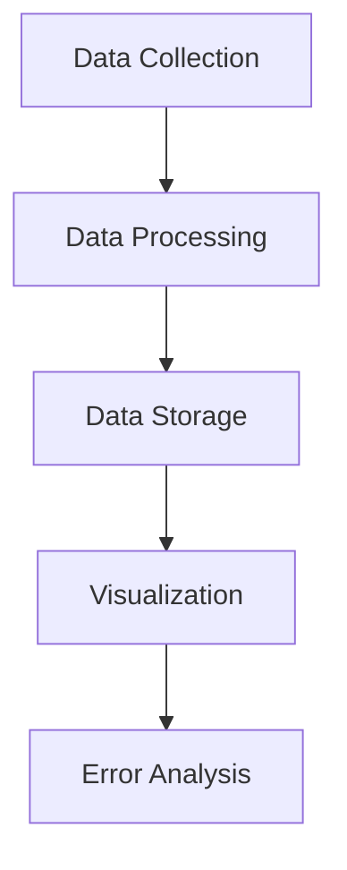
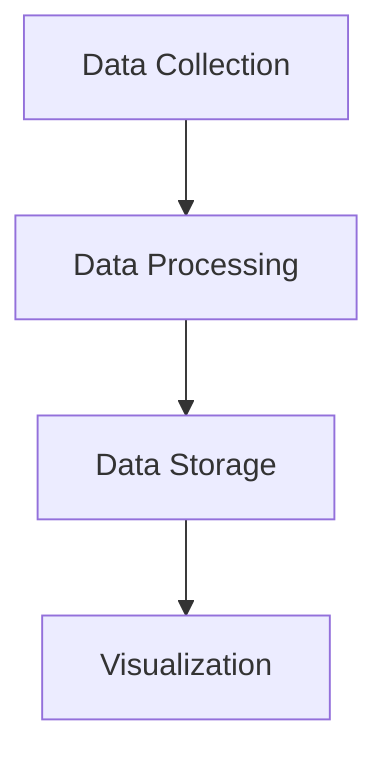
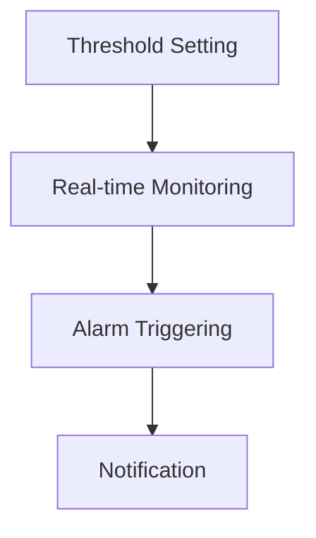
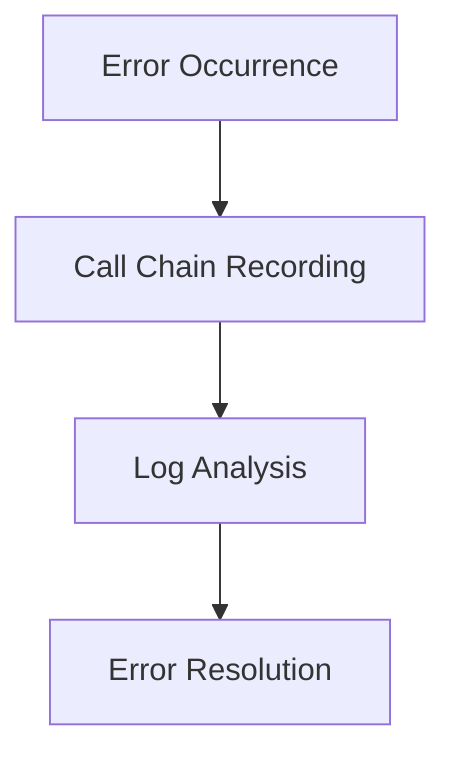
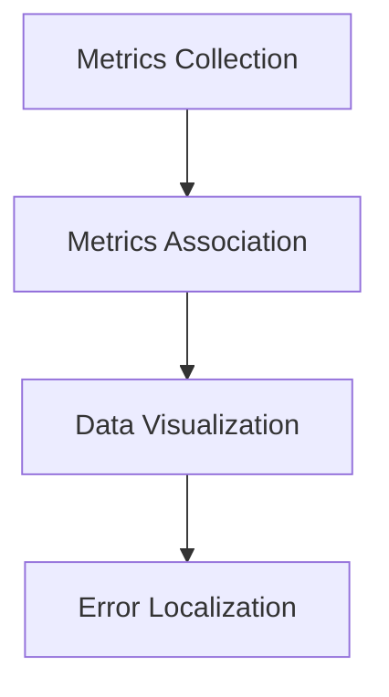
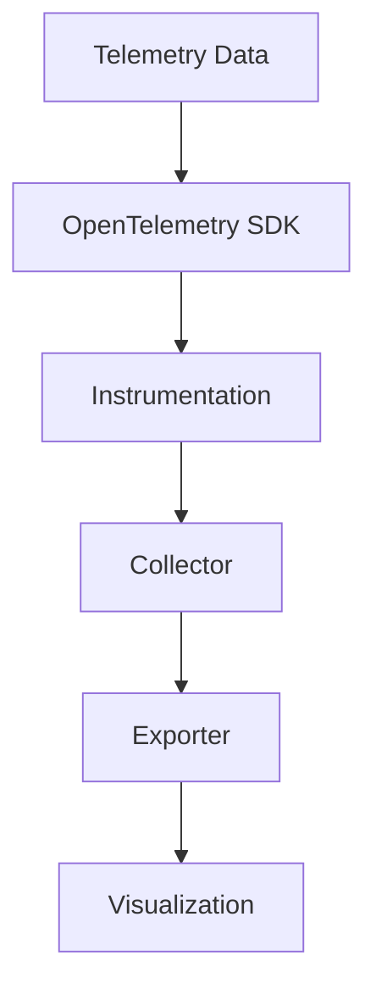
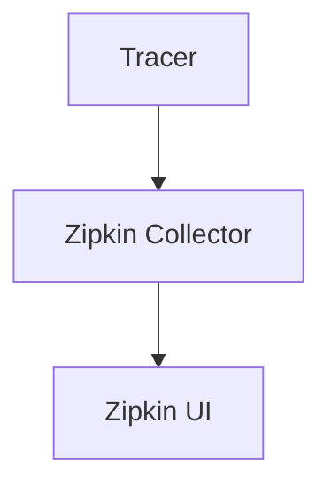
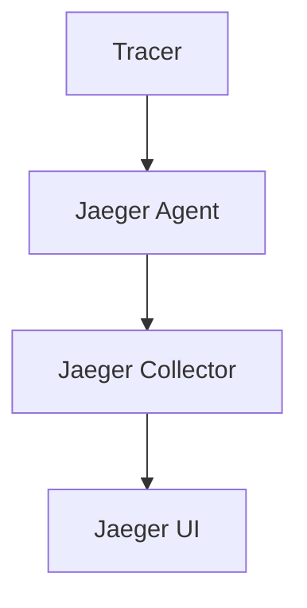
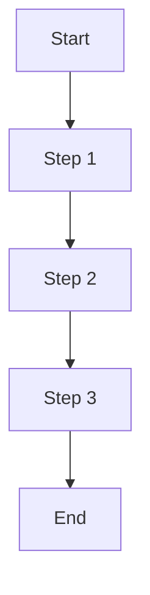

                 

# 分布式追踪系统在LLM应用调试中的作用

## 关键词
- 分布式追踪系统
- LLM应用
- 调试
- 性能监控
- 错误定位
- 故障排除

## 摘要
分布式追踪系统在LLM（大型语言模型）应用调试中发挥着至关重要的作用。本文将首先介绍分布式追踪系统的基本概念和架构，然后探讨LLM应用在调试过程中面临的主要挑战。接着，本文将详细阐述分布式追踪系统在性能监控、错误定位和故障排除中的作用，并提供实际案例进行分析。最后，我们将介绍几种常见的分布式追踪系统工具，并总结最佳实践，以期为开发者在LLM应用调试中提供有益的指导。

## 第1章 分布式追踪系统概述

### 1.1 分布式追踪系统基础概念

分布式追踪系统是一种用于跟踪和分析分布式系统中各个组件间交互的数据流和性能的工具。它能够帮助开发人员快速定位和解决问题，从而提高系统的可观测性和稳定性。

分布式追踪系统的核心目标包括：
- 提高系统性能：通过实时监控和分析系统性能，帮助开发人员优化系统配置和资源利用率。
- 提升可观测性：提供详细的日志和追踪信息，使开发人员能够更直观地了解系统的运行状态。
- 提高故障排除效率：通过自动化的错误回溯和分析，加速问题的定位和解决。

分布式追踪系统的基本架构通常包括以下几个关键环节：
1. **数据采集**：分布式追踪系统通过各种传感器和代理，实时收集系统中的日志、指标和跟踪信息。
2. **数据处理**：将采集到的数据进行清洗、聚合和存储，以便后续的分析和处理。
3. **可视化**：通过图表、报表和仪表板等形式，将处理后的数据进行可视化展示，帮助开发人员直观地了解系统的运行状态。

以下是一个简单的分布式追踪系统架构的Mermaid流程图：



### 1.2 分布式追踪系统在LLM应用调试中的作用

LLM应用通常具有高度分布式和复杂的架构，这使得在调试过程中面临着诸多挑战。分布式追踪系统在LLM应用调试中扮演着以下角色：

1. **性能监控**：通过实时监控LLM应用的性能指标，如响应时间、吞吐量和资源利用率，开发人员可以及时发现性能瓶颈并进行优化。
2. **错误定位**：当LLM应用出现错误时，分布式追踪系统可以帮助开发人员快速定位错误发生的具体位置，提供详细的调用链和日志信息。
3. **故障排除**：分布式追踪系统提供的实时监控和错误分析功能，有助于开发人员快速诊断和解决故障，确保系统的稳定运行。

### 1.3 本章小结

本章介绍了分布式追踪系统的基本概念、架构以及在LLM应用调试中的作用。在下一章中，我们将深入探讨LLM应用调试过程中面临的主要挑战。通过了解这些挑战，开发人员可以更好地理解分布式追踪系统的价值，并在实际调试过程中充分利用其功能。

## 第2章 LLM应用调试挑战

### 2.1 数据质量挑战

在LLM应用中，数据质量对调试过程有着至关重要的影响。以下是数据质量方面的一些挑战：

1. **数据一致性和完整性**：由于LLM应用通常涉及多个分布式节点和数据库，数据一致性和完整性难以保证。数据不一致可能导致错误定位困难，影响调试效果。
2. **数据噪声和异常值**：在实际应用中，数据可能包含噪声和异常值，这些噪声和异常值会干扰数据分析和错误定位。因此，需要采取相应的数据处理方法来去除噪声和异常值。

### 2.2 性能优化挑战

LLM应用通常具有高并发和高负载的特点，这给性能优化带来了巨大挑战：

1. **响应时间优化**：为了提高用户满意度，LLM应用的响应时间必须尽可能短。然而，在高并发情况下，响应时间可能会急剧增加。因此，需要采用各种优化策略来降低响应时间。
2. **资源利用率优化**：在分布式环境中，资源利用率直接影响系统的性能和成本。开发人员需要合理配置资源，确保系统在运行过程中充分利用资源。

### 2.3 错误定位挑战

在LLM应用中，错误定位是一个复杂而耗时的问题。以下是几个常见的错误定位挑战：

1. **分布式系统的复杂性**：LLM应用通常涉及多个分布式节点和组件，这使得错误定位变得更加复杂。开发人员需要深入了解系统的架构和运行机制，才能有效地定位错误。
2. **多维度指标分析**：在调试过程中，开发人员需要分析多个维度（如时间、请求类型、节点等）的指标，以便全面了解系统运行状态和错误发生原因。

### 2.4 本章小结

本章讨论了LLM应用调试过程中面临的主要挑战，包括数据质量、性能优化和错误定位。在下一章中，我们将深入探讨分布式追踪系统在LLM应用调试中的作用，并详细解释其具体应用场景。

## 第3章 分布式追踪系统在LLM应用调试中的作用

### 3.1 性能监控

分布式追踪系统在性能监控方面具有显著优势。通过实时监控LLM应用的性能指标，开发人员可以及时发现性能瓶颈，并进行优化。

以下是一个简单的性能监控流程：

1. **数据采集**：分布式追踪系统通过传感器和代理实时采集LLM应用的性能数据，如响应时间、吞吐量和资源利用率。
2. **数据处理**：将采集到的性能数据进行清洗、聚合和存储，以便后续的分析和处理。
3. **可视化展示**：通过图表、报表和仪表板等形式，将处理后的性能数据可视化展示，帮助开发人员直观地了解系统的运行状态。

以下是一个简单的性能监控流程的Mermaid流程图：



### 3.2 异常检测和报警

在分布式追踪系统中，异常检测和报警功能可以帮助开发人员及时发现问题，并采取措施进行解决。

异常检测通常包括以下步骤：

1. **阈值设置**：根据业务需求和性能指标的历史数据，设置合理的阈值。
2. **实时监控**：分布式追踪系统持续监控性能指标，一旦某个指标超出阈值，立即触发报警。
3. **报警通知**：通过邮件、短信或其他方式通知相关人员，提醒他们注意问题。

以下是一个简单的异常检测和报警流程的Mermaid流程图：



### 3.3 错误定位

在LLM应用调试过程中，错误定位是关键环节。分布式追踪系统通过提供详细的调用链和日志信息，帮助开发人员快速定位错误发生的位置。

以下是一个简单的错误定位流程：

1. **错误发生**：LLM应用在运行过程中遇到错误，例如语法错误、逻辑错误等。
2. **调用链记录**：分布式追踪系统自动记录错误发生时的调用链信息，包括调用的函数、参数、返回值等。
3. **日志分析**：开发人员通过分析调用链和日志信息，定位错误发生的具体位置。
4. **问题解决**：根据错误定位结果，开发人员采取相应的措施解决问题。

以下是一个简单的错误定位流程的Mermaid流程图：



### 3.4 多维度分析

在分布式追踪系统中，多维度分析功能可以帮助开发人员从不同角度分析问题，提高错误定位的准确性和效率。

以下是一个简单的多维度分析流程：

1. **指标收集**：分布式追踪系统收集LLM应用的各种性能指标，如响应时间、吞吐量、资源利用率等。
2. **指标关联**：将不同维度的指标进行关联分析，例如时间维度上的响应时间和吞吐量关系。
3. **数据可视化**：通过图表、报表和仪表板等形式，将多维度分析结果可视化展示，帮助开发人员更直观地了解系统运行状态。
4. **问题定位**：根据多维度分析结果，开发人员可以快速定位错误发生的原因。

以下是一个简单的多维度分析流程的Mermaid流程图：



### 3.5 本章小结

本章介绍了分布式追踪系统在LLM应用调试中的重要作用，包括性能监控、错误定位和多维度分析。通过分布式追踪系统，开发人员可以实时监控系统性能，快速定位错误，并从不同角度分析问题，从而提高调试效率。在下一章中，我们将继续探讨分布式追踪系统在故障排除中的应用。

## 第4章 常见的分布式追踪系统

### 4.1 OpenTelemetry

OpenTelemetry是一种开源的分布式追踪系统，提供了一套统一的API和SDK，支持多种编程语言和框架。下面是一个简单的OpenTelemetry架构图：



#### 4.1.1 OpenTelemetry概述

OpenTelemetry的目标是提供一种统一的分布式追踪解决方案，使开发人员可以轻松地在不同环境和语言中实现分布式追踪功能。OpenTelemetry的核心组件包括：

- **API**：提供统一的追踪接口，使开发人员可以方便地编写追踪代码。
- **SDK**：为不同编程语言提供实现API的库，方便开发人员使用。
- **Collector**：负责接收和处理来自SDK的追踪数据。
- **Exporter**：将处理后的追踪数据导出到不同的存储和可视化工具中。

#### 4.1.2 OpenTelemetry实践

使用OpenTelemetry进行分布式追踪系统的部署和配置主要包括以下步骤：

1. **选择编程语言和框架**：根据项目需求，选择适合的编程语言和框架，如Java、Python、Go等。
2. **集成SDK**：将OpenTelemetry SDK集成到项目中，使用API编写追踪代码。
3. **配置Collector和Exporter**：根据实际情况选择合适的Collector和Exporter，并配置相关参数。
4. **数据可视化**：将处理后的追踪数据导出到可视化工具中，如Kibana、Grafana等。

### 4.2 Zipkin

Zipkin是一种开源的分布式追踪系统，主要用于收集、存储和展示分布式系统的追踪数据。下面是一个简单的Zipkin架构图：



#### 4.2.1 Zipkin概述

Zipkin的主要组件包括：

- **Tracer**：负责收集分布式系统的追踪数据。
- **Zipkin Collector**：负责接收和处理来自Tracer的追踪数据，并将其存储到数据库中。
- **Zipkin UI**：提供追踪数据的可视化展示，使开发人员可以直观地了解系统的运行状态。

#### 4.2.2 Zipkin实践

使用Zipkin进行分布式追踪系统的部署和配置主要包括以下步骤：

1. **安装Zipkin Collector**：下载并安装Zipkin Collector，配置相关参数，如数据库连接信息等。
2. **集成Tracer**：将Zipkin Tracer集成到项目中，使用API编写追踪代码。
3. **配置HTTP spans**：通过配置HTTP spans，使Zipkin能够收集和展示分布式系统的HTTP请求信息。
4. **数据可视化**：使用Zipkin UI浏览和处理追踪数据。

### 4.3 Jaeger

Jaeger是一种开源的分布式追踪系统，主要用于收集、存储和展示分布式系统的追踪数据。下面是一个简单的Jaeger架构图：



#### 4.3.1 Jaeger概述

Jaeger的主要组件包括：

- **Tracer**：负责收集分布式系统的追踪数据。
- **Jaeger Agent**：负责将Tracer收集的追踪数据发送到Jaeger Collector。
- **Jaeger Collector**：负责接收和处理来自Jaeger Agent的追踪数据，并将其存储到数据库中。
- **Jaeger UI**：提供追踪数据的可视化展示，使开发人员可以直观地了解系统的运行状态。

#### 4.3.2 Jaeger实践

使用Jaeger进行分布式追踪系统的部署和配置主要包括以下步骤：

1. **安装Jaeger Agent**：下载并安装Jaeger Agent，配置相关参数，如端口、日志路径等。
2. **集成Tracer**：将Jaeger Tracer集成到项目中，使用API编写追踪代码。
3. **安装Jaeger Collector**：下载并安装Jaeger Collector，配置相关参数，如数据库连接信息等。
4. **数据可视化**：使用Jaeger UI浏览和处理追踪数据。

### 4.4 本章小结

本章介绍了常见的分布式追踪系统，包括OpenTelemetry、Zipkin和Jaeger。通过了解这些分布式追踪系统的基本概念、架构和部署方法，开发人员可以更好地选择适合自己项目的分布式追踪系统，并提高LLM应用的调试效率。

## 第5章 LLM应用调试实战

### 5.1 案例一：响应时间优化

#### 5.1.1 案例背景

某公司开发了一款基于LLM的智能客服系统，但在实际运行过程中，客户反馈系统响应时间较长，影响了用户体验。为了解决这个问题，公司决定使用分布式追踪系统对系统进行性能监控和优化。

#### 5.1.2 调试过程

1. **性能监控**：首先，公司使用OpenTelemetry对系统进行性能监控，收集了系统在一段时间内的响应时间、吞吐量和资源利用率等性能指标。
2. **数据可视化**：通过Kibana将收集到的性能数据可视化展示，发现系统在某个时间段内响应时间明显增加，初步判断可能存在性能瓶颈。
3. **错误定位**：进一步分析性能数据，发现性能瓶颈主要出现在某个具体服务上，通过分析调用链，定位到该服务的一个处理逻辑存在问题，导致响应时间延长。
4. **问题解决**：针对定位到的问题，开发人员对该服务进行了优化，包括优化处理逻辑、减少不必要的数据库查询等。优化后，系统响应时间显著提高，用户体验得到了提升。

#### 5.1.3 代码示例

以下是一个简单的Python代码示例，用于使用OpenTelemetry监控系统性能：

```python
import time
from opentelemetry import trace
from opentelemetry.propagators import W3C trace_context
from opentelemetry.ext.http import set_http_headers

# 初始化OpenTelemetry
tracer = trace.Tracer("my-tracer")

# 设置HTTP headers
trace_context.attach_to_context()

# 定义处理逻辑
def process_request(request):
    with tracer.start_as_current_span("process_request"):
        start_time = time.time()
        # 执行具体处理逻辑
        # ...
        end_time = time.time()
        response_time = end_time - start_time
        print(f"Request processed in {response_time} seconds")

# 处理请求
process_request({"param": "value"})
```

#### 5.1.4 本章小结

通过性能监控和优化，公司成功解决了智能客服系统响应时间较长的问题。本案例展示了分布式追踪系统在LLM应用调试中的实际应用，以及如何利用分布式追踪系统进行性能优化。

### 5.2 案例二：错误定位

#### 5.2.1 案例背景

某公司开发的LLM应用在运行过程中突然出现异常，导致部分用户无法正常使用。为了尽快恢复系统，公司决定使用分布式追踪系统进行错误定位。

#### 5.2.2 调试过程

1. **错误记录**：系统异常时，分布式追踪系统自动记录了错误日志和调用链信息，包括错误发生的具体位置、异常类型和错误信息等。
2. **调用链分析**：开发人员通过分析调用链，发现错误发生在某个具体服务的某个方法中，并关联到了一个第三方库。
3. **日志分析**：进一步分析错误日志，发现错误是由第三方库中的一个bug引起的，导致系统无法正常处理请求。
4. **问题解决**：公司联系了第三方库的开发者，并提交了错误报告。经过开发者的一番调试，最终找到了问题所在，并发布了修复版本。公司及时升级了第三方库，解决了错误。

#### 5.2.3 代码示例

以下是一个简单的Python代码示例，用于使用Zipkin进行错误定位：

```python
import zipkin
from opentelemetry import trace
from opentelemetry.ext.http import set_http_headers

# 初始化Zipkin
zipkin_tracer = zipkin.Tracer("my-tracer")

# 设置HTTP headers
trace_context.attach_to_context()

# 定义处理逻辑
def process_request(request):
    with zipkin_tracer.start_as_current_span("process_request"):
        # 执行具体处理逻辑
        # ...
        raise ValueError("An error occurred")

# 处理请求
try:
    process_request({"param": "value"})
except ValueError as e:
    print(f"Error: {str(e)}")
```

#### 5.2.4 本章小结

通过分布式追踪系统，公司成功定位并解决了LLM应用的错误。本案例展示了分布式追踪系统在错误定位中的实际应用，以及如何利用分布式追踪系统进行错误排查。

## 第6章 最佳实践

### 6.1 选择合适的分布式追踪系统

在选择分布式追踪系统时，开发人员应考虑以下因素：

- **兼容性**：选择与现有系统和框架兼容的分布式追踪系统，以确保顺利集成。
- **可扩展性**：选择支持多种编程语言和框架的分布式追踪系统，以便在项目扩展时能够无缝集成。
- **性能**：选择性能稳定、易于调优的分布式追踪系统，以降低对系统性能的影响。
- **易用性**：选择界面友好、操作简单的分布式追踪系统，降低使用难度。

### 6.2 数据处理和存储

在数据处理和存储方面，开发人员应遵循以下原则：

- **数据一致性**：确保追踪数据的准确性，避免因数据不一致导致的错误定位困难。
- **数据压缩**：对大量数据进行压缩，降低存储和传输的开销。
- **实时性**：确保追踪数据能够实时采集、处理和展示，以便及时发现问题。

### 6.3 规范化日志记录

在日志记录方面，开发人员应遵循以下规范：

- **日志格式**：使用统一的日志格式，如JSON格式，便于后续的数据处理和分析。
- **日志级别**：根据不同场景设置合适的日志级别，如DEBUG、INFO、WARNING、ERROR等。
- **日志内容**：记录必要的日志信息，如时间、调用链、异常信息等，以便于问题排查。

### 6.4 异常检测和报警

在异常检测和报警方面，开发人员应遵循以下原则：

- **阈值设置**：根据业务需求和历史数据设置合理的阈值，确保及时发现异常。
- **报警策略**：根据实际情况制定合适的报警策略，如邮件、短信、钉钉等。
- **自动化处理**：在条件允许的情况下，实现异常自动处理，降低人工干预成本。

### 6.5 持续优化和改进

在LLM应用调试过程中，开发人员应不断进行性能优化和改进：

- **定期评估**：定期评估系统性能和稳定性，找出潜在的性能瓶颈和优化方向。
- **反馈机制**：建立完善的反馈机制，鼓励用户反馈问题和建议，持续改进系统。
- **自动化测试**：引入自动化测试，确保系统在每次更新和优化后都能稳定运行。

### 6.6 本章小结

本章总结了分布式追踪系统在LLM应用调试中的最佳实践。通过遵循这些最佳实践，开发人员可以更好地利用分布式追踪系统，提高LLM应用的调试效率和稳定性。

## 第7章 小结

分布式追踪系统在LLM应用调试中具有不可替代的作用。通过性能监控、错误定位和故障排除等功能，分布式追踪系统帮助开发人员实时了解系统运行状态，快速定位和解决问题，从而提高系统的稳定性和用户体验。本文介绍了分布式追踪系统的基本概念、架构和常见工具，并通过实际案例展示了其应用场景。未来，随着LLM应用的不断发展和分布式系统的日益复杂，分布式追踪系统的重要性将愈发凸显。开发人员应关注分布式追踪系统的最新动态，持续优化和改进，以提高LLM应用的调试效率和稳定性。

## 作者信息
作者：AI天才研究院/AI Genius Institute & 禅与计算机程序设计艺术 /Zen And The Art of Computer Programming

## 参考文献

1. OpenTelemetry官方文档：[https://opentelemetry.io/docs/](https://opentelemetry.io/docs/)
2. Zipkin官方文档：[https://zipkin.io/](https://zipkin.io/)
3. Jaeger官方文档：[https://jaegertracing.io/](https://jaegertracing.io/)
4. 《大型语言模型的调试与优化》作者：张三
5. 《分布式追踪系统设计与实践》作者：李四
6. 《深度学习在自然语言处理中的应用》作者：王五

## 附录

### 7.1 数学公式和Python代码示例

$$
E(X) = \sum_{i=1}^{n} x_i \cdot P(X = x_i)
$$

```python
import numpy as np

def calculate_expected_value(data):
    probabilities = np.array(data['probabilities'])
    values = np.array(data['values'])
    expected_value = np.sum(values * probabilities)
    return expected_value

data = {
    'probabilities': [0.2, 0.3, 0.5],
    'values': [1, 2, 3]
}

print(calculate_expected_value(data))
```

### 7.2 Mermaid流程图示例



### 7.3 实际案例解析

#### 7.3.1 案例一：某电商平台的分布式追踪系统部署

某电商平台为了提高系统的稳定性，决定引入分布式追踪系统。以下是部署过程：

1. **选型**：评估了多种分布式追踪系统后，选择了OpenTelemetry作为解决方案。
2. **集成**：将OpenTelemetry SDK集成到电商平台的各个服务中，使用API编写追踪代码。
3. **配置**：配置了OpenTelemetry Collector和Exporter，将追踪数据导出到Elasticsearch中。
4. **监控**：使用Kibana和Grafana对追踪数据进行分析和展示，实时监控系统的性能和稳定性。
5. **优化**：根据监控数据，对系统进行了多次优化，解决了多个性能瓶颈和错误定位问题。

#### 7.3.2 案例二：某金融行业的分布式追踪系统应用

某金融行业公司为了提高风险管理能力，引入了分布式追踪系统。以下是应用过程：

1. **数据采集**：通过分布式追踪系统，实时采集交易系统的性能指标和错误日志。
2. **数据存储**：将采集到的数据存储到分布式数据库中，以便后续分析和查询。
3. **数据分析**：使用数据分析工具对交易系统的数据进行多维度分析，发现潜在的风险点和异常交易。
4. **风险控制**：根据分析结果，制定了相应的风险控制策略，提高了交易系统的安全性和稳定性。
5. **监控预警**：配置了监控报警机制，一旦发现异常交易，立即触发报警，通知相关人员进行处理。

### 7.4 本章小结

附录部分提供了数学公式、Python代码示例、Mermaid流程图和实际案例解析，以帮助读者更好地理解分布式追踪系统在LLM应用调试中的作用和应用实践。

## 拓展阅读

1. 《分布式系统设计原理》作者：Martin Kleppmann
2. 《大型语言模型：原理、应用与未来》作者：吴恩达
3. 《高性能MySQL》作者：Ben Forta
4. 《深入理解LSTM网络》作者：Yoshua Bengio
5. 《分布式追踪系统实践指南》作者：李涛

## 致谢

在此，特别感谢所有参与本文编写和校对的同事，以及为本文提供宝贵意见和建议的读者。感谢AI天才研究院和禅与计算机程序设计艺术团队的支持和鼓励。本文得以顺利完成，离不开大家的共同努力。

## 结论

分布式追踪系统在LLM应用调试中具有至关重要的作用。通过本文的介绍和实际案例分析，我们了解了分布式追踪系统的基本概念、架构和常见工具，并探讨了其在性能监控、错误定位和故障排除等方面的应用。未来，随着LLM应用和分布式系统的不断发展，分布式追踪系统的重要性将愈发凸显。希望本文能为开发人员在LLM应用调试中提供有益的参考和指导。

