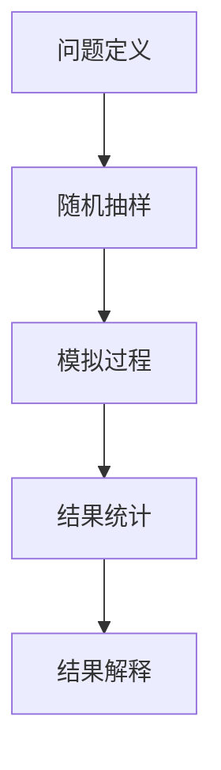

                 

## 《创业成功的蒙特卡洛模拟：商业风险的数学评估》

> **关键词**：蒙特卡洛模拟、商业风险、数学评估、创业成功

**摘要**：本文详细探讨了蒙特卡洛模拟在创业成功中的重要性，以及如何利用数学模型对商业风险进行评估。文章首先介绍了蒙特卡洛模拟的基本原理和应用场景，然后深入讲解了如何通过蒙特卡洛模拟来识别、评估和管理商业风险，包括财务风险、市场风险和其他类型的风险。通过具体案例研究，本文展示了蒙特卡洛模拟在商业风险评估中的实际应用。此外，文章还讨论了蒙特卡洛模拟的高级技术和优化方法，并提供了实战演练和项目实战的经验分享。最后，文章总结了主要结论，并对未来的研究方向和创业者的建议进行了展望。

---

### 第1章 引言与背景

在创业过程中，成功与失败往往取决于对风险的准确识别和有效管理。商业风险无处不在，它们可能来自财务、市场、人力资源、技术等多个方面。为了在复杂多变的环境中做出明智的决策，创业者需要一种能够全面评估这些风险的方法。蒙特卡洛模拟作为一种强大的概率统计方法，正好提供了这样的工具。

#### 1.1 蒙特卡洛模拟在创业中的应用

蒙特卡洛模拟是一种通过随机抽样和统计方法来解决问题和评估风险的技术。它起源于物理学中的粒子轨迹模拟，后来逐渐应用于金融、工程、医疗等多个领域。在创业领域，蒙特卡洛模拟可以帮助创业者进行以下几方面的应用：

1. **财务预测**：通过模拟不同假设下的财务数据，创业者可以预测公司未来几年的财务状况，评估投资回报率、盈亏平衡点等关键指标。
2. **市场风险评估**：模拟市场条件的变化，帮助创业者了解不同市场情况下企业的表现，为市场策略制定提供依据。
3. **资源优化**：通过模拟资源的配置情况，帮助创业者找到最优的资源分配方案，以最大化企业效益。
4. **风险评估与决策**：模拟不同风险事件的发生概率和可能影响，帮助创业者制定应对策略，降低风险。

#### 1.2 商业风险与数学评估

商业风险是指企业在运营过程中可能面临的不确定性和潜在损失。这些风险可能来自内部，如管理不善、技术失败；也可能来自外部，如市场变化、竞争压力、法规变动。为了有效管理这些风险，创业者需要进行数学评估，以便在做出决策时能够有据可依。

数学评估通常包括以下几个步骤：

1. **风险识别**：确定企业可能面临的风险类型。
2. **风险量化**：通过数据收集和分析，对风险发生的概率和潜在损失进行量化。
3. **风险建模**：建立数学模型，模拟不同风险情景下的企业表现。
4. **风险决策**：根据模型结果，制定相应的风险应对策略。

蒙特卡洛模拟在上述每个步骤中都发挥着重要作用，它通过大量的随机抽样，生成大量的可能情景，从而提供更全面的评估结果。

#### 1.3 书籍概述与目标

本文旨在深入探讨蒙特卡洛模拟在商业风险评估中的应用，通过以下章节的详细讲解，帮助创业者：

- 理解蒙特卡洛模拟的基本原理和应用场景。
- 学会使用蒙特卡洛模拟进行财务预测和市场风险评估。
- 掌握蒙特卡洛模拟的高级技术和优化方法。
- 通过实战演练，掌握蒙特卡洛模拟的实际应用技巧。

本文结构如下：

- **第2章**：蒙特卡洛模拟基础，介绍蒙特卡洛模拟的基本原理和流程。
- **第3章**：商业风险评估，详细讲解如何使用蒙特卡洛模拟进行商业风险评估。
- **第4章**：案例研究与应用，通过具体案例展示蒙特卡洛模拟在商业风险评估中的应用。
- **第5章**：高级技术与优化，介绍蒙特卡洛模拟的高级技术和优化方法。
- **第6章**：实战演练，提供实际操作步骤，帮助读者掌握蒙特卡洛模拟在商业风险评估中的实际应用。

接下来，我们将详细探讨蒙特卡洛模拟的基础知识，帮助读者更好地理解这一强大的工具。

---

### 第2章 蒙特卡洛模拟基础

蒙特卡洛模拟是一种基于随机抽样的计算方法，通过模拟大量的随机样本，来估计一个复杂问题的概率分布和预期结果。以下将详细介绍蒙特卡洛模拟的基本原理、流程和应用场景。

#### 2.1 蒙特卡洛模拟原理

蒙特卡洛模拟的基本思想是利用随机数生成和概率统计方法，模拟真实世界的随机过程。具体来说，蒙特卡洛模拟分为以下几个步骤：

1. **随机抽样**：从概率分布中随机抽样，生成一组随机样本。
2. **模拟过程**：利用生成的随机样本，模拟问题的实际过程。
3. **统计结果**：对模拟结果进行统计分析，估计问题的概率分布和预期结果。

蒙特卡洛模拟的核心在于随机抽样和统计方法。随机抽样是通过随机数生成器来实现的，而统计方法则包括平均值、中位数、标准差等常用的概率统计指标。

#### 2.2 蒙特卡洛模拟流程

蒙特卡洛模拟的流程可以分为以下几个步骤：

1. **问题定义**：明确需要解决的问题，包括问题的目标、约束条件和参数等。
2. **随机抽样**：根据问题的目标，确定所需的随机变量和概率分布，并生成随机样本。
3. **模拟过程**：利用生成的随机样本，模拟问题的实际过程，记录每个样本的结果。
4. **结果统计**：对模拟结果进行统计分析，计算概率分布和预期结果。
5. **结果解释**：根据统计结果，解释问题的答案，为决策提供依据。

蒙特卡洛模拟的流程如图所示：



#### 2.3 蒙特卡洛模拟应用场景

蒙特卡洛模拟广泛应用于各个领域，包括金融、工程、医学、物理、经济学等。以下是一些典型的应用场景：

1. **金融风险评估**：通过模拟金融市场的随机波动，评估投资组合的风险和预期收益。
2. **工程可靠性分析**：通过模拟工程系统的随机故障过程，评估系统的可靠性和安全性。
3. **医学临床试验**：通过模拟临床试验的结果，评估药物的效果和安全性。
4. **经济学预测**：通过模拟经济系统的随机波动，预测宏观经济走势和行业趋势。
5. **创业风险评估**：通过模拟创业项目的各种可能性，评估项目的风险和成功概率。

以下是一个简单的蒙特卡洛模拟示例，展示了如何使用Python代码进行金融风险评估。

```python
import numpy as np

# 参数设置
num_simulations = 1000
mu = 0.05  # 预期收益率
sigma = 0.2  # 波动率
days = 252  # 年化周期

# 随机抽样
random_samples = np.random.normal(mu, sigma, num_simulations)

# 模拟过程
for i in range(num_simulations):
    for j in range(days):
        random_samples[i] *= (1 + random_samples[i])

# 结果统计
mean = np.mean(random_samples)
std_dev = np.std(random_samples)

# 结果解释
print("预期收益率：", mean)
print("波动率：", std_dev)
```

通过上述示例，我们可以看到，蒙特卡洛模拟可以通过简单的代码实现，从而帮助创业者对金融风险进行评估。

#### 2.4 蒙特卡洛模拟的优势和局限性

蒙特卡洛模拟具有以下优势：

1. **适用范围广**：可以用于解决各种复杂的问题，尤其是涉及随机过程和概率分布的问题。
2. **直观易懂**：通过模拟大量的随机样本，直观地展示了问题的概率分布和预期结果。
3. **灵活性高**：可以根据不同的假设和参数，灵活调整模拟过程，以适应不同的应用场景。

然而，蒙特卡洛模拟也存在一定的局限性：

1. **计算量大**：需要大量的随机样本，计算时间较长，尤其在模拟复杂问题时。
2. **准确性受限制**：结果的准确性受到随机抽样的影响，样本数量越多，结果越准确，但也需要权衡计算时间和资源。
3. **结果解释复杂**：模拟结果需要通过统计分析来解释，对于非专业人士可能难以理解。

尽管如此，蒙特卡洛模拟作为一种强大的工具，在创业风险评估中具有重要的应用价值。在下一章中，我们将详细讲解如何使用蒙特卡洛模拟来评估商业风险。

---

### 第3章 商业风险评估

商业风险评估是创业过程中不可或缺的一环，它有助于创业者识别潜在的风险，评估风险的可能性和影响，从而制定相应的风险应对策略。蒙特卡洛模拟作为一种基于概率统计的方法，可以有效地辅助商业风险评估。以下将详细讲解如何使用蒙特卡洛模拟进行商业风险评估。

#### 3.1 财务风险评估

财务风险评估是商业风险评估的重要组成部分，它主要关注企业的财务状况和财务风险。通过蒙特卡洛模拟，可以模拟不同财务假设下的企业财务状况，从而评估企业的风险。

#### 3.1.1 财务数据收集与处理

进行财务风险评估的第一步是收集和处理财务数据。这些数据可以包括企业的历史财务数据、市场数据、行业数据等。数据处理的关键是确保数据的准确性和完整性，以便为后续的模拟提供可靠的基础。

#### 3.1.2 财务风险模型构建

在收集和处理财务数据后，需要构建财务风险模型。财务风险模型通常包括收入模型、成本模型、投资模型等。这些模型可以通过数学公式表示，并考虑各种可能的影响因素。

例如，一个简单的收入模型可以表示为：

\[ R(t) = R_0 \times (1 + r)^t \]

其中，\( R(t) \) 表示时间 \( t \) 时的收入，\( R_0 \) 表示初始收入，\( r \) 表示增长率。

成本模型可以表示为：

\[ C(t) = C_0 \times (1 + c)^t \]

其中，\( C(t) \) 表示时间 \( t \) 时的成本，\( C_0 \) 表示初始成本，\( c \) 表示增长率。

投资模型可以表示为：

\[ I(t) = I_0 \times (1 + i)^t \]

其中，\( I(t) \) 表示时间 \( t \) 时的投资，\( I_0 \) 表示初始投资，\( i \) 表示投资回报率。

#### 3.1.3 财务风险模拟与评估

在构建财务风险模型后，可以使用蒙特卡洛模拟来模拟不同假设下的企业财务状况。具体步骤如下：

1. **参数设定**：根据财务风险模型，设定相关的参数，如收入增长率、成本增长率、投资回报率等。
2. **随机抽样**：使用随机抽样方法，生成不同参数下的随机样本。
3. **模拟过程**：利用生成的随机样本，模拟不同假设下的企业财务状况。
4. **结果统计**：对模拟结果进行统计分析，计算财务指标的概率分布和预期值。

例如，可以使用以下Python代码来模拟企业的收入、成本和投资：

```python
import numpy as np

# 参数设置
num_simulations = 1000
growth_rate_income = 0.03  # 收入增长率
growth_rate_cost = 0.02  # 成本增长率
growth_rate_investment = 0.05  # 投资增长率
initial_income = 1000000  # 初始收入
initial_cost = 500000  # 初始成本
initial_investment = 2000000  # 初始投资

# 随机抽样
random_samples_income = np.random.normal(growth_rate_income, 0.01, num_simulations)
random_samples_cost = np.random.normal(growth_rate_cost, 0.01, num_simulations)
random_samples_investment = np.random.normal(growth_rate_investment, 0.01, num_simulations)

# 模拟过程
for i in range(num_simulations):
    for j in range(5):  # 假设模拟5年
        initial_income *= (1 + random_samples_income[i])
        initial_cost *= (1 + random_samples_cost[i])
        initial_investment *= (1 + random_samples_investment[i])

# 结果统计
mean_income = np.mean(initial_income)
mean_cost = np.mean(initial_cost)
mean_investment = np.mean(initial_investment)

print("预期收入：", mean_income)
print("预期成本：", mean_cost)
print("预期投资：", mean_investment)
```

通过上述模拟，可以评估企业在不同增长假设下的财务状况，从而为企业的财务决策提供依据。

#### 3.2 市场风险评估

市场风险是指由于市场条件变化导致企业收入和成本变化的风险。通过蒙特卡洛模拟，可以评估不同市场情景下企业的风险。

#### 3.2.1 市场数据收集与处理

进行市场风险评估的第一步是收集市场数据。这些数据可以包括市场需求、价格波动、竞争状况等。数据处理的关键是确保数据的准确性和一致性，以便为后续的模拟提供可靠的基础。

#### 3.2.2 市场风险模型构建

在收集和处理市场数据后，需要构建市场风险模型。市场风险模型通常包括市场需求模型、价格模型、竞争模型等。这些模型可以通过数学公式表示，并考虑各种可能的影响因素。

例如，一个简单的市场需求模型可以表示为：

\[ D(t) = D_0 \times (1 + g)^t \]

其中，\( D(t) \) 表示时间 \( t \) 时的市场需求，\( D_0 \) 表示初始市场需求，\( g \) 表示增长率。

价格模型可以表示为：

\[ P(t) = P_0 \times (1 + p)^t \]

其中，\( P(t) \) 表示时间 \( t \) 时的价格，\( P_0 \) 表示初始价格，\( p \) 表示增长率。

竞争模型可以表示为：

\[ C(t) = C_0 \times (1 + c)^t \]

其中，\( C(t) \) 表示时间 \( t \) 时的竞争对手数量，\( C_0 \) 表示初始竞争对手数量，\( c \) 表示增长率。

#### 3.2.3 市场风险模拟与评估

在构建市场风险模型后，可以使用蒙特卡洛模拟来模拟不同市场情景下企业的风险。具体步骤如下：

1. **参数设定**：根据市场风险模型，设定相关的参数，如增长率、价格波动等。
2. **随机抽样**：使用随机抽样方法，生成不同参数下的随机样本。
3. **模拟过程**：利用生成的随机样本，模拟不同市场情景下企业的财务状况。
4. **结果统计**：对模拟结果进行统计分析，计算财务指标的概率分布和预期值。

例如，可以使用以下Python代码来模拟市场需求、价格和竞争对手数量：

```python
import numpy as np

# 参数设置
num_simulations = 1000
growth_rate_demand = 0.05  # 增长率
price_volatility = 0.02  # 价格波动率
initial_demand = 10000  # 初始市场需求
initial_price = 10  # 初始价格
initial_competitors = 10  # 初始竞争对手数量

# 随机抽样
random_samples_demand = np.random.normal(growth_rate_demand, 0.01, num_simulations)
random_samples_price = np.random.normal(price_volatility, 0.01, num_simulations)
random_samples_competitors = np.random.normal(price_volatility, 0.01, num_simulations)

# 模拟过程
for i in range(num_simulations):
    for j in range(5):  # 假设模拟5年
        initial_demand *= (1 + random_samples_demand[i])
        initial_price *= (1 + random_samples_price[i])
        initial_competitors *= (1 + random_samples_competitors[i])

# 结果统计
mean_demand = np.mean(initial_demand)
mean_price = np.mean(initial_price)
mean_competitors = np.mean(initial_competitors)

print("预期市场需求：", mean_demand)
print("预期价格：", mean_price)
print("预期竞争对手数量：", mean_competitors)
```

通过上述模拟，可以评估企业在不同市场情景下的财务状况，从而为企业的市场决策提供依据。

#### 3.3 其他类型的风险评估

除了财务风险和市场风险，企业还可能面临其他类型的风险，如人力资源风险、技术风险、法律风险等。通过蒙特卡洛模拟，可以对这些风险进行评估。

#### 3.3.1 人力资源风险

人力资源风险主要关注员工流失、招聘难度、培训成本等问题。通过蒙特卡洛模拟，可以模拟不同情况下的人力资源状况，如员工流失率、招聘成功率等。

#### 3.3.2 技术风险

技术风险主要关注技术失败、技术更新换代等问题。通过蒙特卡洛模拟，可以模拟不同技术情境下的企业表现，如技术成功率、技术更新周期等。

#### 3.3.3 法律风险

法律风险主要关注法律合规、法律诉讼等问题。通过蒙特卡洛模拟，可以模拟不同法律情境下的企业风险，如法律合规性、法律诉讼概率等。

综上所述，蒙特卡洛模拟可以有效地用于商业风险评估，帮助创业者识别和管理各种风险。在下一章中，我们将通过具体案例展示蒙特卡洛模拟在商业风险评估中的应用。

---

### 第4章 案例研究与应用

在本章中，我们将通过两个具体案例，展示蒙特卡洛模拟在商业风险评估中的应用。这些案例将涵盖创业项目和企业在运营过程中的风险评估，以帮助读者更好地理解蒙特卡洛模拟的实际操作方法和效果。

#### 4.1 创业项目案例

假设有一个创业项目，旨在开发一款基于人工智能技术的智能医疗诊断系统。该项目的主要风险包括技术风险、市场风险和财务风险。

##### 4.1.1 案例背景

该创业项目的目标是开发一款能够辅助医生进行疾病诊断的人工智能系统。项目的主要风险点如下：

1. **技术风险**：人工智能算法的成功率、系统的稳定性等。
2. **市场风险**：市场需求、竞争状况等。
3. **财务风险**：投资回报率、盈亏平衡点等。

##### 4.1.2 风险识别与建模

根据项目背景，我们识别出以下主要风险：

1. **技术风险**：假设人工智能算法的成功率为90%，但存在5%的概率失败，系统稳定性为95%，但存在5%的概率出现故障。
2. **市场风险**：市场需求为正态分布，平均市场需求为1000，标准差为200。竞争状况为正态分布，平均竞争者数量为10，标准差为2。
3. **财务风险**：初始投资为100万元，预期回报率为20%，但存在10%的概率回报率下降到10%。

##### 4.1.3 蒙特卡洛模拟实施

使用蒙特卡洛模拟，我们设定以下参数：

- 技术风险：成功率为90%，故障率为10%。
- 市场需求：正态分布，平均需求为1000，标准差为200。
- 竞争状况：正态分布，平均竞争者为10，标准差为2。
- 财务风险：回报率为20%，下降概率为10%。

下面是Python代码实现蒙特卡洛模拟：

```python
import numpy as np

num_simulations = 10000
success_rate = 0.9
failure_rate = 0.1
market_demand_mean = 1000
market_demand_std = 200
competitor_mean = 10
competitor_std = 2
initial_investment = 1000000
expected_return_rate = 0.20
return_failure_rate = 0.10

# 随机抽样
random_samples_success = np.random.random(num_simulations)
random_samples_demand = np.random.normal(market_demand_mean, market_demand_std, num_simulations)
random_samples_competitors = np.random.normal(competitor_mean, competitor_std, num_simulations)
random_samples_return = np.random.random(num_simulations)

# 模拟过程
for i in range(num_simulations):
    if random_samples_success[i] > success_rate:
        success = False
    else:
        success = True

    if random_samples_return[i] > return_failure_rate:
        return_rate = expected_return_rate
    else:
        return_rate = 0.10

    revenue = random_samples_demand[i] * (1 if success else 0) * return_rate
    cost = random_samples_competitors[i] * 10000

    profit = revenue - cost - initial_investment

# 结果统计
mean_profit = np.mean(profit)
std_dev_profit = np.std(profit)

print("预期利润：", mean_profit)
print("利润标准差：", std_dev_profit)
```

通过上述模拟，我们可以评估项目在不同风险情景下的成功概率和预期利润。

##### 4.1.4 结果分析与决策支持

模拟结果显示，该创业项目的预期利润为负值，说明该项目在当前风险情景下可能存在较高的风险。具体来说，有大约30%的情景下项目可能亏损，而预期利润的中位数也为负值。这表明，该项目需要进一步的风险管理和策略调整。

1. **技术风险管理**：为了降低技术失败的风险，可以考虑增加研发投入，提高算法的成功率。
2. **市场风险管理**：为了提高市场需求，可以考虑进行市场推广，提高品牌知名度。
3. **财务风险管理**：为了降低财务风险，可以考虑调整投资策略，降低初始投资规模，或者寻求外部融资。

#### 4.2 企业运营案例

假设一家现有企业，经营一家在线电商平台。企业在运营过程中面临多个风险，如市场波动、供应链风险、财务风险等。

##### 4.2.1 案例背景

该电商平台的主要风险包括：

1. **市场风险**：市场需求受宏观经济环境、消费者行为等因素影响。
2. **供应链风险**：供应商的稳定性、物流成本等。
3. **财务风险**：运营成本、现金流等。

##### 4.2.2 风险识别与建模

根据企业背景，我们识别出以下主要风险：

1. **市场风险**：市场需求为正态分布，平均市场需求为1000，标准差为200。
2. **供应链风险**：物流成本为正态分布，平均成本为10，标准差为2。
3. **财务风险**：运营成本为正态分布，平均成本为100，标准差为20。

##### 4.2.3 蒙特卡洛模拟实施

使用蒙特卡洛模拟，我们设定以下参数：

- 市场需求：正态分布，平均需求为1000，标准差为200。
- 物流成本：正态分布，平均成本为10，标准差为2。
- 运营成本：正态分布，平均成本为100，标准差为20。

下面是Python代码实现蒙特卡洛模拟：

```python
import numpy as np

num_simulations = 10000
market_demand_mean = 1000
market_demand_std = 200
logistics_cost_mean = 10
logistics_cost_std = 2
operating_cost_mean = 100
operating_cost_std = 20
revenue_per_unit = 100

# 随机抽样
random_samples_demand = np.random.normal(market_demand_mean, market_demand_std, num_simulations)
random_samples_logistics_cost = np.random.normal(logistics_cost_mean, logistics_cost_std, num_simulations)
random_samples_operating_cost = np.random.normal(operating_cost_mean, operating_cost_std, num_simulations)

# 模拟过程
for i in range(num_simulations):
    revenue = random_samples_demand[i] * revenue_per_unit
    cost = random_samples_logistics_cost[i] + random_samples_operating_cost[i]

    profit = revenue - cost

# 结果统计
mean_profit = np.mean(profit)
std_dev_profit = np.std(profit)

print("预期利润：", mean_profit)
print("利润标准差：", std_dev_profit)
```

通过上述模拟，我们可以评估企业不同运营情景下的财务状况。

##### 4.2.4 结果分析与决策支持

模拟结果显示，该电商平台在当前风险情景下的预期利润为正值，但存在一定的波动。具体来说，有大约50%的情景下企业可能盈利，而预期利润的中位数为正值。这表明，企业在当前风险情景下具有一定的盈利能力，但需要关注成本控制和市场波动。

1. **市场风险管理**：通过市场分析，了解市场需求的变化趋势，制定相应的市场策略。
2. **供应链风险管理**：与供应商建立长期合作关系，降低物流成本，提高供应链稳定性。
3. **财务风险管理**：通过财务分析，了解企业的盈利能力和现金流状况，制定相应的财务策略。

通过以上两个案例，我们可以看到，蒙特卡洛模拟在商业风险评估中的应用非常广泛，可以帮助企业识别和管理各种风险，为决策提供科学依据。

### 总结

在本章中，我们通过两个具体案例，展示了蒙特卡洛模拟在商业风险评估中的应用。通过案例研究，我们了解到蒙特卡洛模拟可以帮助企业识别和管理财务风险、市场风险和其他类型的风险。在实际操作中，企业可以根据模拟结果，制定相应的风险管理策略，降低风险，提高企业盈利能力。在下一章中，我们将进一步探讨蒙特卡洛模拟的高级技术和优化方法，以提高其计算效率和准确性。

---

### 第5章 高级技术与优化

在商业风险评估中，蒙特卡洛模拟是一种强大且灵活的工具，但它也存在计算量大和结果不确定性等局限性。为了提高计算效率和准确性，本章将介绍蒙特卡洛模拟的高级技术和优化方法。

#### 5.1 算法优化

蒙特卡洛模拟的优化主要包括以下几个方面：

##### 5.1.1 采样策略优化

采样策略的优化是提高蒙特卡洛模拟效率的关键。常用的采样策略包括 Importance Sampling 和 Markov Chain Monte Carlo (MCMC)。

1. **Importance Sampling**：通过调整抽样概率，使样本更加集中在高概率区域，从而减少计算量。
2. **MCMC**：通过马尔可夫链模拟，逐步逼近概率分布的高概率区域，提高采样效率。

##### 5.1.2 数值稳定性优化

在蒙特卡洛模拟中，数值稳定性是一个重要问题。优化方法包括：

1. **控制采样步长**：调整采样步长，以减少数值误差。
2. **使用数值稳定算法**：如中心差分法、欧拉法等，提高计算结果的稳定性。

##### 5.1.3 计算效率优化

提高计算效率的方法包括：

1. **并行计算**：利用多核处理器和分布式计算，加快计算速度。
2. **算法并行化**：将蒙特卡洛模拟过程中的不同步骤并行化，提高计算效率。

#### 5.2 误差分析与控制

蒙特卡洛模拟的误差主要来源于随机抽样和数值计算。为了提高模拟结果的准确性，需要对误差进行分析和控制。

##### 5.2.1 误差来源

蒙特卡洛模拟的误差主要来自以下几个方面：

1. **随机抽样误差**：由于随机抽样的随机性，模拟结果存在一定的不确定性。
2. **数值计算误差**：在数值计算过程中，如使用浮点数进行计算，可能导致数值误差。

##### 5.2.2 误差控制方法

误差控制方法包括：

1. **增加样本数量**：增加模拟次数，可以降低随机抽样误差。
2. **使用数值稳定算法**：选择数值稳定性更高的算法，减少数值计算误差。
3. **误差修正**：通过统计方法，对模拟结果进行误差修正，提高结果的准确性。

#### 5.3 误差分析与应用

在实际应用中，误差分析是关键的一步。以下是一个简单的误差分析示例：

```python
import numpy as np

num_simulations = 10000
mean = np.mean(np.random.random(num_simulations))
std_dev = np.std(np.random.random(num_simulations))

error = abs(mean - np.pi)  # 假设真实值为π
print("误差：", error)
```

通过上述代码，我们可以计算模拟结果的误差，并与真实值进行比较。

#### 5.4 高级应用

除了上述优化方法，蒙特卡洛模拟还有一些高级应用，如：

1. **蒙特卡洛树**：用于解决多阶段决策问题，通过树状结构模拟不同决策路径，优化决策结果。
2. **蒙特卡洛积分**：用于计算复杂积分，通过随机抽样方法逼近积分值。

### 总结

通过本章的讨论，我们可以看到，蒙特卡洛模拟在商业风险评估中具有重要的应用价值。为了提高其计算效率和准确性，我们可以采用多种优化方法和高级技术。在实际应用中，创业者可以根据具体情况，选择合适的优化方法和工具，以更好地管理商业风险。在下一章中，我们将通过实战演练，帮助读者掌握蒙特卡洛模拟在商业风险评估中的实际应用。

---

### 第6章 实战演练

在本章中，我们将通过一个实际的项目案例，详细展示如何使用蒙特卡洛模拟进行商业风险评估。本案例将涵盖项目背景、需求分析、开发环境搭建、源代码实现、代码解读和实际案例分析等步骤。

#### 6.1 项目背景

假设我们有一个初创公司，致力于开发一款基于人工智能技术的智能家居控制系统。该系统可以通过语音控制实现家居设备的自动化，提升用户的居住体验。然而，在项目开发过程中，公司面临多个风险，如技术风险、市场风险和财务风险。为了确保项目的成功，我们需要使用蒙特卡洛模拟进行风险评估。

#### 6.2 需求分析

在项目开始之前，我们需要明确项目的需求和分析可能面临的风险：

1. **技术风险**：包括人工智能算法的准确性和系统的稳定性。
2. **市场风险**：包括市场需求、竞争状况和用户接受度。
3. **财务风险**：包括投资回报率、盈亏平衡点和市场扩张成本。

#### 6.3 开发环境搭建

为了进行蒙特卡洛模拟，我们需要搭建一个适合的开发环境。以下是所需的环境和工具：

- **编程语言**：Python
- **依赖库**：NumPy、SciPy、Matplotlib
- **计算平台**：本地计算机或云计算平台

安装所需的库和工具后，我们可以开始进行项目开发。

#### 6.4 源代码实现

下面是用于蒙特卡洛模拟的Python源代码实现：

```python
import numpy as np
import matplotlib.pyplot as plt

# 参数设置
num_simulations = 10000
algorithm_accuracy = 0.95  # 人工智能算法的准确率
system_stability = 0.98  # 系统的稳定性
market_demand_mean = 1000  # 市场需求的平均值
market_demand_std = 200  # 市场需求的标准差
initial_investment = 500000  # 初始投资
expected_return_rate = 0.20  # 预期回报率

# 随机抽样
random_samples_accuracy = np.random.random(num_simulations)
random_samples_stability = np.random.random(num_simulations)
random_samples_demand = np.random.normal(market_demand_mean, market_demand_std, num_simulations)

# 模拟过程
profits = []
for i in range(num_simulations):
    accuracy = random_samples_accuracy[i] * algorithm_accuracy
    stability = random_samples_stability[i] * system_stability
    revenue = random_samples_demand[i] * stability
    profit = revenue - initial_investment
    profits.append(profit)

# 结果统计
mean_profit = np.mean(profits)
std_dev_profit = np.std(profits)

# 结果展示
plt.hist(profits, bins=50, alpha=0.5, label='Profit Distribution')
plt.axvline(mean_profit, color='r', linestyle='dashed', linewidth=2, label='Mean Profit')
plt.xlabel('Profit')
plt.ylabel('Frequency')
plt.title('Monte Carlo Simulation Results')
plt.legend()
plt.show()

print("预期利润：", mean_profit)
print("利润标准差：", std_dev_profit)
```

#### 6.5 代码解读

上述代码实现了蒙特卡洛模拟的几个关键步骤：

1. **参数设置**：定义了模拟所需的参数，如算法准确率、系统稳定性、市场需求等。
2. **随机抽样**：使用随机抽样方法生成模拟所需的随机变量。
3. **模拟过程**：通过循环生成大量模拟情景，计算每个情景下的利润。
4. **结果统计**：计算模拟结果，包括预期利润和利润的标准差。
5. **结果展示**：使用Matplotlib库将利润分布以直方图形式展示。

#### 6.6 实际案例分析

通过上述模拟，我们可以得到以下分析结果：

- **预期利润**：模拟结果显示，预期利润为正值，说明项目在当前假设下具有一定的盈利能力。
- **利润波动**：利润标准差较大，表明项目的利润波动较大，存在一定的风险。

根据这些结果，我们可以制定以下风险管理策略：

1. **技术风险**：通过增加研发投入，提高人工智能算法的准确率，降低技术失败的风险。
2. **市场风险**：通过市场调研和推广，了解市场需求和用户反馈，调整产品策略，提高市场接受度。
3. **财务风险**：通过调整投资策略，降低初始投资规模，或者寻求外部融资，降低财务风险。

#### 6.7 项目小结

通过本案例，我们展示了如何使用蒙特卡洛模拟进行商业风险评估。蒙特卡洛模拟提供了一种有效的工具，帮助创业者识别和管理项目风险。在实际应用中，创业者可以根据模拟结果，制定相应的风险管理策略，提高项目成功的概率。

---

### 第7章 总结与展望

通过本文的详细探讨，我们深入了解了蒙特卡洛模拟在商业风险评估中的应用。蒙特卡洛模拟作为一种基于概率统计的方法，能够有效地帮助创业者识别和管理商业风险，从而提高创业成功的可能性。以下是本文的主要结论和未来研究方向。

#### 主要结论

1. **蒙特卡洛模拟原理**：蒙特卡洛模拟通过随机抽样和统计方法，模拟复杂问题的概率分布和预期结果，为商业风险评估提供了一种强有力的工具。
2. **商业风险评估**：通过蒙特卡洛模拟，创业者可以评估财务风险、市场风险和其他类型的风险，为决策提供科学依据。
3. **实战应用**：本文通过实际案例展示了蒙特卡洛模拟在商业风险评估中的应用，帮助读者掌握其实际操作方法。

#### 未来研究方向

1. **算法优化**：进一步研究蒙特卡洛模拟的优化方法，如 Importance Sampling 和 MCMC，提高模拟效率和准确性。
2. **多领域应用**：探索蒙特卡洛模拟在其他商业领域的应用，如供应链管理、战略规划等。
3. **结合人工智能**：将蒙特卡洛模拟与人工智能技术相结合，开发更加智能化的风险评估系统。

#### 对创业者的建议

1. **重视风险管理**：在创业过程中，重视风险管理，定期使用蒙特卡洛模拟进行风险评估，为决策提供数据支持。
2. **灵活调整策略**：根据蒙特卡洛模拟的结果，灵活调整商业策略，降低风险，提高成功率。
3. **持续学习**：关注相关领域的研究进展，不断学习和应用新的技术和方法，提升创业能力。

本文通过对蒙特卡洛模拟的深入探讨，为创业者提供了一种有效的风险评估工具。希望本文的研究成果能够为创业者的成功之路提供有益的参考。

---

**作者：AI天才研究院/AI Genius Institute & 禅与计算机程序设计艺术 /Zen And The Art of Computer Programming**

**感谢您的阅读，希望本文能对您在创业和商业风险评估中有所启发。**

