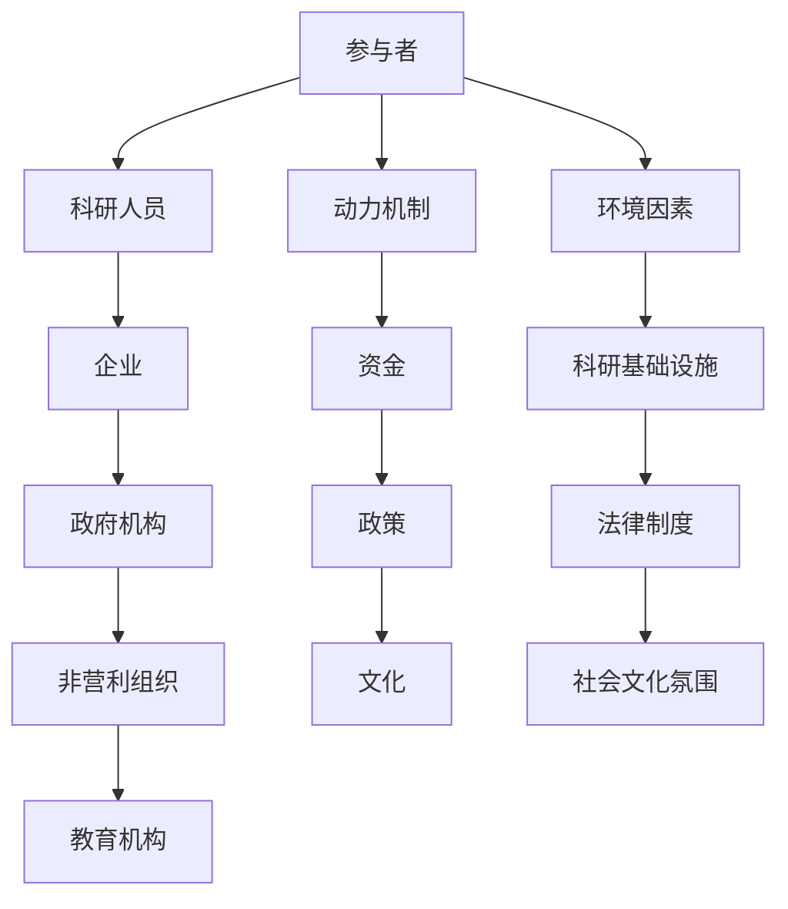

                 


### 文章标题：创新生态系统的设计原则：培育有利于世界理解的科研环境

#### 关键词：创新生态系统，设计原则，科研环境，世界理解，可持续发展

#### 摘要：
本文旨在探讨创新生态系统的设计原则，以培育一个有利于全球科研环境和世界理解的科研环境。通过深入分析创新生态系统的核心概念、组成部分以及关键设计原则，本文提出了一套系统化的方法，帮助科研机构和组织构建和优化创新生态系统。本文的核心思想是，通过科学的设计和合理的规划，可以促进知识共享、提高科研效率，并推动科研成果在全球范围内的传播和应用。

## 第一部分：引论

### 1.1 书籍背景与目标

在当前全球化的背景下，科学研究和技术创新已经成为推动社会进步和经济发展的关键力量。然而，科研环境的复杂性和多样性使得创新生态系统面临着诸多挑战。本书籍旨在解决这一问题，通过深入研究和分析，提供一套全面、系统的创新生态系统设计原则，为科研机构和组织提供实践指导和理论基础。

我们的目标是将创新生态系统建设成为全球科研环境中的“绿色 oasis”，一个能够促进知识共享、合作与创新的平台，使得科研成果能够更好地服务于人类社会的发展。

### 1.2 创新生态系统概述

创新生态系统是一个由多种参与者、动力机制和环境因素构成的复杂网络。这些参与者包括科研人员、企业、政府机构、非营利组织等，它们在创新过程中扮演着不同的角色。动力机制则是驱动创新活动的核心力量，包括资金、政策、文化等因素。环境因素则包括科研基础设施、法律制度、社会文化氛围等，这些因素共同影响着创新生态系统的运行和发展。

### 1.3 设计原则的重要性

创新生态系统的设计原则是构建和优化创新生态系统的关键。科学的设计原则能够提高系统的效率、促进知识共享、增强创新活力。本书籍将深入探讨这些设计原则，包括创新价值导向、可持续性原则、开放性原则、适应性原则和激励原则等。通过这些原则的指导，我们希望能够为科研机构和组织提供一套实用的方法论，推动全球科研环境的不断进步。

## 第二部分：核心概念与联系

### 2.1 创新生态系统定义

创新生态系统是一个动态的、复杂的网络系统，它由多个参与者、动力机制和环境因素相互作用而成。创新生态系统的主要目标是促进知识共享、创新和合作，从而推动科技进步和社会发展。创新生态系统不仅包括科学研究机构和企业，还包括政府机构、非营利组织、教育机构和公众等。

### 2.2 创新生态系统的组成部分

创新生态系统的组成部分可以分为三个主要方面：参与者、动力机制和环境因素。

#### 2.2.1 参与者

创新生态系统的参与者包括：
- **科研人员**：他们是创新生态系统中的核心，通过科学研究推动技术进步。
- **企业**：企业是技术创新的主要推动者，它们将科研成果转化为实际应用。
- **政府机构**：政府通过政策、资金支持等手段，为创新生态系统提供必要的支持和保障。
- **非营利组织**：非营利组织在知识共享、公益项目等方面发挥着重要作用。
- **教育机构**：教育机构为创新生态系统提供人才支持，培养未来的科研人员。

#### 2.2.2 动力机制

创新生态系统的动力机制主要包括：
- **资金**：资金是创新活动的重要保障，包括政府资金、企业投资、风险投资等。
- **政策**：政策是创新生态系统的关键驱动因素，包括税收优惠、研发支持、知识产权保护等。
- **文化**：文化氛围对创新生态系统的形成和发展有着重要影响，鼓励创新、尊重知识、包容失败等价值观有助于激发创新活力。

#### 2.2.3 环境因素

创新生态系统中的环境因素包括：
- **科研基础设施**：包括实验室、研究设备、数据中心等，为科研活动提供必要的硬件支持。
- **法律制度**：包括知识产权法、合同法、公司法等，为创新活动提供法律保障。
- **社会文化氛围**：包括社会对创新的接受度、对失败的容忍度、对知识的尊重等。

### 2.3 创新生态系统的架构

创新生态系统的架构可以简化为以下组成部分：



这种架构描述了创新生态系统中各个部分之间的相互关系和作用，为后续的设计原则提供了基础。

## 第三部分：设计原则

### 3.1 创新价值导向

创新价值导向是创新生态系统的核心原则之一，它强调以价值为导向，推动知识共享和科技创新。创新价值包括知识共享、创新成果和市场价值等三个方面。

#### 3.1.1 价值定义

创新价值可以通过以下公式进行定义：

$$
V = f(\text{知识共享}, \text{创新成果}, \text{市场价值})
$$

- **知识共享**：通过开放共享知识，提高整个系统的创新价值。
- **创新成果**：高质量的科研成果是创新生态系统的核心。
- **市场价值**：科研成果在市场上的应用和转化能力。

#### 3.1.2 价值评估

创新价值的评估可以通过以下伪代码实现：

```
function evaluate_value(innovation, market_data):
    knowledge_share = calculate_knowledge_share(innovation)
    market_impact = calculate_market_impact(market_data)
    return knowledge_share * market_impact
```

该函数通过计算知识共享和市场影响，评估创新的价值。

### 3.2 可持续性原则

可持续性原则强调创新生态系统的长期发展，通过可持续发展确保资源的合理利用和系统的稳定运行。

#### 3.2.1 可持续发展

可持续发展的公式为：

$$
Sustainability = \frac{E_{output}}{E_{input}} \times \frac{T_{duration}}{T_{cycle}}
$$

- $E_{output}$: 生态系统的总产出。
- $E_{input}$: 生态系统的总投入。
- $T_{duration}$: 可持续周期。
- $T_{cycle}$: 周期长度。

#### 3.2.2 资源利用

优化资源利用的伪代码为：

```
function optimize_resource_usage(resources, efficiency):
    optimized_resources = resources / efficiency
    return optimized_resources
```

该函数通过计算资源利用效率，优化资源的分配和使用。

### 3.3 开放性原则

开放性原则强调信息共享和合作，促进创新生态系统中各方的互动和合作。

#### 3.3.1 信息开放

信息开放的伪代码为：

```
function open_innovation_info(innovation_data):
    share_data = share_innovation_data(innovation_data)
    return share_data
```

该函数通过共享创新数据，促进信息共享。

#### 3.3.2 合作机制

合作机制的伪代码为：

```
function establish Cooperation_mechanism(participants):
    collaboration_plan = plan_collaboration(participants)
    return collaboration_plan
```

该函数通过制定合作计划，建立合作机制。

### 3.4 适应性原则

适应性原则强调创新生态系统应具备应对变化和灵活调整的能力。

#### 3.4.1 变化应对

变化应对的伪代码为：

```
function respond_to_changes(external_environment):
    adapt_strategy = adapt_to_changes(external_environment)
    return adapt_strategy
```

该函数通过适应外部环境变化，制定适应策略。

#### 3.4.2 灵活性

灵活性的伪代码为：

```
function ensure_flexibility(innovation_processes):
    flexible_processes = make_processes_flexible(innovation_processes)
    return flexible_processes
```

该函数通过优化创新过程，确保系统的灵活性。

### 3.5 创新激励原则

创新激励原则强调通过激励机制激发创新活力，提高科研人员的积极性和创造力。

#### 3.5.1 激励机制

激励机制的伪代码为：

```
function establish_innovation_incentives(employees):
    incentive_plan = create_incentive_program(employees)
    return incentive_plan
```

该函数通过制定激励计划，建立激励机制。

#### 3.5.2 创新者权益

创新者权益的伪代码为：

```
function protect_innovator_rights(innovators):
    rights_protection = secure_rights(innovators)
    return rights_protection
```

该函数通过保护创新者的权益，确保他们的创新成果得到应有的认可和保护。

## 第四部分：实践指导

### 4.1 科研环境建设

#### 4.1.1 组织架构设计

组织架构设计的伪代码为：

```
function design_organization_structure(units):
    organizational_structure = create_structure(units)
    return organizational_structure
```

该函数通过创建组织结构，设计合适的组织架构。

#### 4.1.2 管理机制建立

管理机制建立的伪代码为：

```
function establish_management_mechanisms(processes):
    management_plan = create_management_plan(processes)
    return management_plan
```

该函数通过制定管理计划，建立有效的管理机制。

### 4.2 创新生态系统设计流程

创新生态系统设计流程可以分为以下几个步骤：

1. **需求分析**：分析创新生态系统的需求和目标，确定设计的关键因素。
2. **系统设计**：根据需求分析结果，设计创新生态系统的架构和组成部分。
3. **实施与监控**：实施创新生态系统设计，并进行监控和调整，确保设计目标的实现。

#### 4.2.1 需求分析

需求分析的伪代码为：

```
function analyze_requirements的需求(external_environment):
    requirements = collect_requirements(external_environment)
    return requirements
```

该函数通过收集外部环境的需求，分析创新生态系统的需求。

#### 4.2.2 系统设计

系统设计的伪代码为：

```
function design_system(requirements):
    system_design = create_system_design(requirements)
    return system_design
```

该函数根据需求分析结果，设计创新生态系统的架构。

#### 4.2.3 实施与监控

实施与监控的伪代码为：

```
function implement_and_monitor(system_design):
    implementation_plan = create_implementation_plan(system_design)
    monitor_progress = monitor_progress(implementation_plan)
    return monitor_progress
```

该函数通过制定实施计划，并监控实施进度，确保设计目标的实现。

### 4.3 案例分析

#### 4.3.1 国内外成功案例

本部分将分析国内外创新生态系统的成功案例，包括美国硅谷、中国深圳等地的创新生态系统，探讨其成功因素和经验。

#### 4.3.2 案例解读

案例解读将通过对成功案例的详细分析，提取其核心原则和实践经验，为其他地区的创新生态系统建设提供借鉴。

## 第五部分：挑战与未来

### 5.1 创新生态系统面临的挑战

创新生态系统面临的挑战包括技术挑战、社会挑战和政策挑战等。

#### 5.1.1 技术挑战

技术挑战包括：
- **数据安全与隐私保护**：随着数据量的增长，数据安全与隐私保护成为重要挑战。
- **知识产权保护**：知识产权保护不足可能导致创新成果被滥用或盗用。

#### 5.1.2 社会挑战

社会挑战包括：
- **创新文化**：社会对创新的接受度和支持程度影响创新生态系统的建设。
- **人才流失**：人才流失可能导致创新生态系统的活力减弱。

#### 5.1.3 政策挑战

政策挑战包括：
- **政策不一致**：不同地区的政策不一致可能导致创新生态系统的分裂。
- **资金支持**：资金支持不足可能影响创新生态系统的稳定运行。

### 5.2 未来发展趋势

未来发展趋势包括：
- **全球合作**：全球合作将加强，推动创新生态系统的全球化发展。
- **技术进步**：技术进步将推动创新生态系统的升级和优化。
- **可持续发展**：可持续发展将成为创新生态系统的重要目标。

### 5.3 国际合作与全球科研环境

国际合作与全球科研环境的发展将推动全球科研环境的融合，提高全球科研效率，促进知识共享和科技创新。

## 附录

### A.1 相关资源

附录部分将提供相关资源，包括参考文献、在线资源和工具等，以方便读者进一步学习和研究。

### A.2 参考文献

参考文献将列出本书中引用的主要文献和资料，以供读者参考。

---

### 作者信息

作者：AI天才研究院/AI Genius Institute & 禅与计算机程序设计艺术 /Zen And The Art of Computer Programming

---

本博客文章是对创新生态系统设计原则的全面探讨，通过深入分析和具体实现，为科研机构和组织提供了实用的方法论和实践指导。随着全球科研环境的发展，创新生态系统的重要性日益凸显，相信通过科学的设计和合理的规划，我们可以培育出一个有利于世界理解的科研环境，推动科技创新和社会进步。

