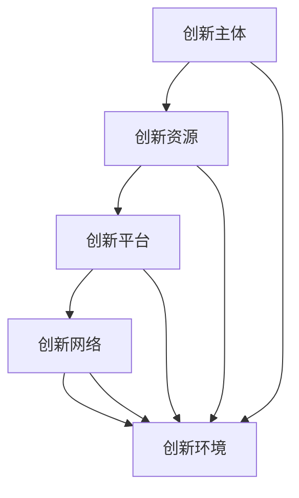
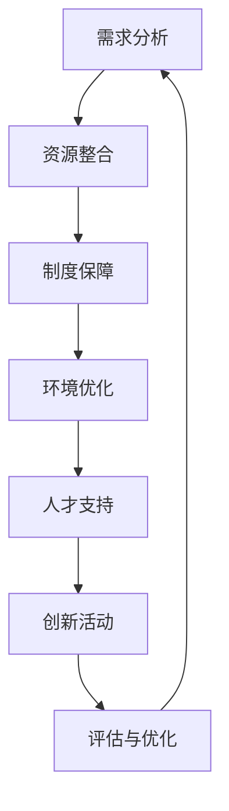

                 

# 创新生态系统设计：培育有利于世界理解的科研环境

> 关键词：创新生态系统，科研环境，知识共享，算法原理，Python源代码，国际视野，成功案例分析

> 摘要：本文深入探讨创新生态系统的概念、设计原则、关键因素及其在科研环境中的应用。通过分析国内外成功案例，阐述创新生态系统对于培育有利于世界理解的科研环境的重要性，并提供一系列的策略和实践建议。

## 目录

1. 引言
2. 创新生态系统的概念与框架
3. 培育创新生态系统的策略
4. 促进科研环境理解的关键因素
5. 创新生态系统在科研环境中的应用
6. 国际视野下的创新生态系统
7. 实例分析：成功与创新生态系统设计
8. 未来展望：创新生态系统的挑战与机遇
9. 结论
10. 作者信息

## 1. 引言

在当今快速发展的科技时代，创新已经成为推动社会进步和经济发展的关键动力。然而，创新并非孤立的事件，它需要在一个良好的环境中孕育和发展。创新生态系统（Innovation Ecosystem）作为一种新型的创新模式，通过整合不同利益相关者的资源和能力，为创新提供全面的支持和服务。

创新生态系统是指由企业、高校、科研机构、政府部门、非营利组织等不同主体组成的复杂网络，这些主体通过相互作用、资源共享、协同创新，共同推动创新活动的开展。科研环境作为创新生态系统的重要组成部分，对于创新成果的转化和扩散具有至关重要的作用。

本文旨在通过深入探讨创新生态系统的设计原则、关键因素以及在科研环境中的应用，分析国内外成功案例，探讨创新生态系统对于培育有利于世界理解的科研环境的重要性，并为进一步优化创新生态系统提供实践建议。

## 2. 创新生态系统的概念与框架

### 2.1 创新生态系统的定义与重要性

创新生态系统是一个复杂的社会技术系统，它通过多种利益相关者的合作，共同推动创新活动的进行。这些利益相关者包括企业、高校、科研机构、政府部门、风险投资机构、孵化器、行业协会等。创新生态系统不仅关注技术创新，还涉及管理创新、商业模式创新、政策创新等多个方面。

创新生态系统的核心目标是提升创新效率，促进科技成果的转化和应用。它通过建立一个开放、共享、协同的创新环境，实现资源的高效配置和利用，降低创新风险，缩短创新周期，提高创新成功率。

### 2.2 创新生态系统的核心组成部分

一个健全的创新生态系统通常包括以下几个核心组成部分：

#### 2.2.1 创新主体

创新主体是创新生态系统的核心，包括企业、高校、科研机构等。这些主体通过开展研发活动，产生创新成果，是创新生态系统的动力源泉。

#### 2.2.2 创新资源

创新资源包括资金、技术、人才、信息、知识等。这些资源是创新生态系统的重要组成部分，为创新活动提供必要的支持。

#### 2.2.3 创新平台

创新平台是创新生态系统的基础设施，包括实验室、研究中心、技术转移中心、创业孵化器等。这些平台为创新主体提供研发、试验、展示、交流的机会和场所。

#### 2.2.4 创新网络

创新网络是指创新生态系统中的各主体之间的联系和互动。创新网络通过信息交流、资源共享、合作研发等方式，促进创新活动的开展。

#### 2.2.5 创新环境

创新环境是指支持创新活动的制度、文化、政策等外部条件。良好的创新环境有利于创新主体的成长和发展，激发创新活力。

### 2.3 创新生态系统的类型与模式

创新生态系统可以按照不同的分类标准进行划分，例如按照产业领域、地理位置、组织结构等。以下是一些常见的创新生态系统类型：

#### 2.3.1 按照产业领域划分

- 科技园区：以高科技产业为主，如中关村、硅谷。
- 文化创意产业园区：以文化创意产业为主，如798艺术区。
- 生物科技园区：以生物技术产业为主，如张江高科技园区。

#### 2.3.2 按照地理位置划分

- 本地创新生态系统：以特定地区为主要活动范围，如杭州、深圳。
- 国际创新生态系统：跨越多个国家和地区，如欧盟框架计划。

#### 2.3.3 按照组织结构划分

- 联盟型创新生态系统：由多个组织和企业共同组成，如开放源代码联盟。
- 平台型创新生态系统：以某个平台为核心，如阿里云、华为云。
- 网络型创新生态系统：以网络为基础，实现跨地区、跨行业的合作，如全球供应链网络。

### 2.4 创新生态系统与科研环境的关系

创新生态系统与科研环境之间存在着密切的关系。科研环境是创新生态系统的重要组成部分，为创新活动提供知识、技术和人才支持。而创新生态系统的完善和发展，又能进一步促进科研环境的优化。

#### 2.4.1 创新生态系统对科研环境的影响

- 促进知识共享：创新生态系统通过提供平台和机制，促进知识在不同主体之间的共享和交流。
- 提升创新能力：创新生态系统通过资源配置、技术研发、人才培养等手段，提升科研机构的创新能力。
- 优化科研评价体系：创新生态系统推动科研评价体系从单一的学术成果导向，向综合的创新价值导向转变。
- 促进国际合作：创新生态系统有助于搭建国际合作平台，促进全球科研资源的共享和合作。

#### 2.4.2 科研环境对创新生态系统的影响

- 提供知识基础：科研环境通过开展基础研究和应用研究，为创新提供丰富的知识储备和技术支持。
- 培养创新人才：科研环境通过人才培养和科研活动，培养出具有创新精神和实践能力的人才。
- 促进技术转移：科研环境通过技术转移和产业化，将科研成果转化为实际应用，推动创新生态系统的运行。

### 2.5 创新生态系统设计的Mermaid流程图

为了更好地理解创新生态系统的设计和运行，我们可以使用Mermaid流程图来展示其关键组成部分和运行机制。以下是一个简化的创新生态系统设计流程图：

在这个流程图中，创新主体、创新资源、创新平台、创新网络和创新环境构成了创新生态系统的基本框架，它们相互联系、相互影响，共同推动创新活动的进行。

## 3. 培育创新生态系统的策略

### 3.1 政策与法规环境

政策与法规环境是创新生态系统的基础，对于创新活动的开展具有重要影响。政府应制定有利于创新的法律法规，为创新主体提供稳定的政策支持。

- **研发投入**：政府应加大对基础研究和应用研究的投入，为创新提供资金保障。
- **税收优惠**：对于创新型企业，可以提供税收减免等优惠政策，降低创新成本。
- **知识产权保护**：建立完善的知识产权保护体系，保护创新成果的合法权益。
- **监管制度改革**：简化审批流程，提高行政效率，为创新主体提供便捷的服务。

### 3.2 组织与管理策略

创新生态系统的有效运行需要科学的组织与管理策略。

- **协同管理**：建立跨部门、跨行业的协同管理机制，促进资源整合和合作创新。
- **平台建设**：搭建创新平台，提供技术研发、试验、展示、交流等一站式服务。
- **人才引进与培养**：引进和培养具有创新精神和实践能力的人才，为创新活动提供人才支持。
- **激励机制**：建立激励机制，激发创新主体的积极性和创造力。

### 3.3 资源配置与优化

资源配置是创新生态系统运行的关键。

- **资金配置**：合理分配资金，支持关键技术研发和产业化。
- **技术配置**：促进技术创新和成果转化，提高技术利用效率。
- **知识配置**：搭建知识共享平台，实现知识的高效传递和利用。
- **人才配置**：优化人才结构，发挥人才的创新潜力。

### 3.4 创新文化培育

创新文化是创新生态系统的灵魂。

- **创新意识**：培养创新意识，鼓励创新思维和实践。
- **宽容失败**：建立宽容失败的文化，鼓励尝试和创新。
- **合作精神**：倡导合作精神，促进创新主体之间的合作与交流。
- **持续学习**：鼓励持续学习，提升创新能力和素质。

### 3.5 创新合作与协同

创新合作与协同是创新生态系统的重要特征。

- **跨学科合作**：促进不同学科之间的交叉融合，推动多学科协同创新。
- **产学研合作**：加强高校、科研机构与企业之间的合作，实现科技成果的快速转化。
- **国际合作**：搭建国际合作平台，吸引国际创新资源和人才。
- **协同创新**：建立协同创新机制，实现创新资源的高效配置和利用。

### 3.6 创新生态系统的评估与优化

创新生态系统的评估与优化是确保其持续发展的关键。

- **指标体系**：建立科学合理的创新生态系统评估指标体系，全面反映创新生态系统的运行状况。
- **动态调整**：根据评估结果，动态调整创新政策和措施，优化创新生态系统的运行机制。
- **持续改进**：通过不断优化和创新，提高创新生态系统的运行效率和创新能力。

### 3.7 创新生态系统设计的关键因素

创新生态系统设计的关键因素包括以下几个方面：

- **需求导向**：以市场需求为导向，满足用户需求，推动创新活动。
- **资源整合**：整合各方资源，实现资源的高效利用和协同创新。
- **制度保障**：建立健全的制度体系，为创新活动提供有力保障。
- **环境优化**：优化创新环境，营造良好的创新氛围。
- **人才支持**：引进和培养人才，为创新活动提供人才保障。

### 3.8 创新生态系统设计的Mermaid流程图

为了更好地理解创新生态系统设计的流程，我们可以使用Mermaid流程图来展示其关键步骤和运行机制。以下是一个简化的创新生态系统设计流程图：

在这个流程图中，需求分析、资源整合、制度保障、环境优化、人才支持和创新活动构成了创新生态系统设计的基本框架，它们相互关联、相互促进，共同推动创新生态系统的构建和优化。

## 4. 促进科研环境理解的关键因素

### 4.1 科研环境与知识共享

科研环境是创新生态系统的重要组成部分，而知识共享是促进科研环境理解的关键因素之一。知识共享有助于提升科研效率，推动科研成果的传播和应用。

- **知识共享平台**：建立知识共享平台，为科研人员提供便捷的知识获取和交流渠道。
- **开放科学**：推动开放科学运动，促进科研成果的公开和共享，降低科研成本。
- **学术交流**：加强学术交流活动，促进不同领域之间的知识交叉和融合。
- **知识产权保护**：在推动知识共享的同时，也要保护知识产权，确保创新成果的合法权益。

### 4.2 科研评价体系

科研评价体系是衡量科研环境质量的重要标准。一个科学、合理的科研评价体系能够激励科研人员的创新活力，提升科研水平。

- **绩效评价**：建立以绩效为导向的科研评价体系，激励科研人员追求高质量的研究成果。
- **多元化评价**：采用多元化评价方法，综合考虑科研成果的质量、影响力和贡献。
- **持续改进**：根据科研评价结果，不断优化评价体系，提高评价的准确性和公正性。

### 4.3 科研伦理与责任

科研伦理是科研环境的重要组成部分，直接影响科研活动的质量和公信力。加强科研伦理教育和责任意识，有助于维护科研环境的健康和稳定。

- **科研伦理教育**：加强对科研人员的伦理教育，提高其道德水平和责任感。
- **规范科研行为**：建立健全科研伦理规范，规范科研活动，防止学术不端行为。
- **责任追究**：对于违反科研伦理的行为，要严肃处理，确保科研环境的公平和正义。

### 4.4 科研传播与公众参与

科研传播和公众参与是提升科研环境理解和认同的重要途径。通过有效传播科研成果和鼓励公众参与科研活动，可以增强公众对科研工作的关注和支持。

- **科研传播**：加强科研成果的传播和宣传，提高科研工作的社会影响力。
- **公众参与**：鼓励公众参与科研活动，提升公众对科研环境的理解和认同。
- **科普教育**：开展科普教育活动，提高公众的科学素养，促进科研与社会的互动。

### 4.5 知识转化与产业化

知识转化与产业化是科研环境的重要组成部分，直接关系到科研成果的应用价值和实际效益。

- **科技成果转化**：建立健全科技成果转化机制，促进科研成果的产业化应用。
- **产业孵化**：搭建产业孵化平台，为科研成果提供从实验室到市场的孵化服务。
- **产学研合作**：加强高校、科研机构与企业的合作，推动科研成果的转化和应用。
- **政策支持**：制定有利于知识转化与产业化的政策，为科技成果的转化提供政策保障。

### 4.6 国际合作与交流

国际合作与交流是提升科研环境质量和影响力的有效途径。通过国际合作与交流，可以引进国际先进技术和管理经验，提升本国科研水平。

- **国际合作项目**：积极参与国际合作项目，开展跨国界、跨机构的科研合作。
- **学术交流**：加强国际学术交流，促进科研成果的全球传播和应用。
- **人才引进**：引进国际优秀人才，提升本国科研团队的整体水平。
- **科研教育**：开展国际科研教育合作，培养具备国际视野的科研人才。

## 5. 创新生态系统在科研环境中的应用

### 5.1 高校与科研机构的创新生态系统实践

高校和科研机构是创新生态系统的重要组成部分，其在创新生态系统中的应用主要体现在以下几个方面：

- **科研创新**：高校和科研机构通过开展基础研究和应用研究，产生创新成果，为创新生态系统提供知识和技术支持。
- **人才培养**：高校通过培养具有创新精神和实践能力的人才，为创新生态系统提供人才储备。
- **成果转化**：高校和科研机构通过科技成果转化，将创新成果应用到实际生产中，提升创新生态系统的应用价值。

### 5.2 企业与产业的创新生态系统实践

企业在创新生态系统中的应用主要体现在以下几个方面：

- **技术研发**：企业通过开展技术研发，推动技术创新，提升产品竞争力。
- **产业链整合**：企业通过产业链整合，实现资源的高效配置和利用，提升产业链的整体竞争力。
- **商业模式创新**：企业通过商业模式创新，实现业务的快速扩展和盈利能力的提升。

### 5.3 政府与社会的创新生态系统实践

政府和社会在创新生态系统中的应用主要体现在以下几个方面：

- **政策支持**：政府通过制定有利于创新的法律法规和政策措施，为创新活动提供政策保障。
- **资源配置**：政府通过资源配置，提供资金、技术、人才等支持，促进创新生态系统的运行。
- **公众参与**：社会通过公众参与，提升对科研工作的关注和支持，促进科研环境的优化。

### 5.4 创新生态系统的成功案例分享

以下是一些创新生态系统的成功案例：

- **美国硅谷**：硅谷作为全球创新生态系统的典范，通过政府、企业、高校和科研机构的紧密合作，推动了科技创新和产业发展的繁荣。
- **中国深圳**：深圳通过构建创新生态系统，吸引了大量高科技企业和创新创业人才，成为我国创新生态系统的典范。
- **德国慕尼黑**：慕尼黑通过建设创新园区和创新中心，促进了科技成果的产业化应用，提升了城市创新能力。

### 5.5 创新生态系统的挑战与应对策略

创新生态系统在实践中面临着一系列挑战：

- **资源配置不均衡**：创新生态系统中的资源配置存在不均衡现象，影响了创新活动的开展。
- **创新能力不足**：部分地区和企业的创新能力较弱，制约了创新生态系统的运行。
- **政策法规不完善**：部分地区的政策法规不完善，影响了创新生态系统的建设和发展。

针对这些挑战，可以采取以下应对策略：

- **优化资源配置**：通过政策引导和资源配置优化，实现资源的高效利用和合理配置。
- **提升创新能力**：加大对科研机构、高校和企业的支持力度，提升创新能力。
- **完善政策法规**：制定和完善有利于创新的政策法规，为创新生态系统提供法制保障。

### 5.6 创新生态系统的项目实战

以下是一个创新生态系统项目实战的案例：

- **项目名称**：智能物联网平台
- **项目背景**：随着物联网技术的快速发展，企业对智能物联网平台的需求日益增长。本项目旨在构建一个智能物联网平台，为企业提供从数据采集、传输、处理到应用的全方位服务。
- **项目目标**：
  - 实现数据采集和传输的高效、安全、可靠。
  - 提供实时数据处理和分析能力，为企业提供智能决策支持。
  - 建立开放的应用生态，支持第三方应用开发。
- **项目实施**：
  - 数据采集：采用物联网传感器和边缘计算技术，实现数据的高效采集和预处理。
  - 数据传输：采用5G网络和区块链技术，实现数据的安全、可靠传输。
  - 数据处理：采用云计算和大数据技术，提供实时数据处理和分析能力。
  - 应用生态：搭建开放的应用生态，支持第三方应用开发，推动平台生态的繁荣。
- **项目成果**：
  - 构建了一个高效的智能物联网平台，为企业提供了智能决策支持。
  - 推动了物联网技术的应用和发展，提升了企业的创新能力。
  - 培养了一批具备物联网技术能力的专业人才，为创新生态系统的可持续发展提供了人才保障。

### 5.7 创新生态系统的最佳实践与启示

在创新生态系统建设中，最佳实践是提升系统运行效率和质量的重要手段。以下是一些创新生态系统的最佳实践：

- **开放式创新**：开放式创新通过开放合作，吸收外部资源和创意，提升创新效率。
- **知识共享**：建立知识共享平台，促进知识在不同主体之间的传播和应用。
- **生态系统协同**：通过协同管理，实现资源整合和优势互补，提升创新生态系统整体效能。

这些最佳实践为创新生态系统的建设提供了有益的启示：

- **创新意识**：培养创新意识，推动创新生态系统的可持续发展。
- **资源共享**：优化资源配置，实现资源的高效利用。
- **协同发展**：加强协同合作，提升创新生态系统的整体竞争力。

### 5.8 创新生态系统的注意事项与拓展阅读

在构建创新生态系统时，需要注意以下几点：

- **平衡利益**：在创新生态系统中，各利益相关者之间的利益分配需要平衡，以确保系统的稳定运行。
- **持续优化**：创新生态系统需要持续优化和改进，以适应不断变化的外部环境。
- **风险管理**：创新过程中存在一定的风险，需要建立风险管理和防控机制。

拓展阅读：

- 《创新生态系统设计：理论与实践》
- 《全球创新生态系统比较研究》
- 《开放式创新：实践与案例》

## 6. 国际视野下的创新生态系统

### 6.1 全球创新生态系统的现状与趋势

全球创新生态系统的发展呈现出以下几个显著趋势：

- **技术创新驱动**：全球范围内，技术创新成为推动经济增长的重要动力，以人工智能、大数据、物联网等为代表的新技术不断涌现。
- **开放合作**：各国纷纷加强创新合作，通过跨国界的科研合作、技术交流和产业协同，推动全球创新生态系统的繁荣发展。
- **生态系统融合**：创新生态系统逐渐融合，形成跨地区、跨领域的创新网络，实现资源的全球共享和优势互补。
- **政策支持**：各国政府积极制定和实施创新政策，为创新生态系统的建设和发展提供有力保障。

### 6.2 国际合作与竞争

国际合作与竞争是创新生态系统发展的重要驱动力。以下是一些关键点：

- **国际科研合作**：通过国际科研合作，各国可以共同攻克科技难题，推动全球科技进步。
- **技术创新竞争**：各国在技术创新领域展开激烈竞争，争夺技术制高点，推动全球创新生态系统的快速发展。
- **产业链整合**：通过产业链整合，各国可以共同打造全球创新产业链，提升全球创新生态系统的整体竞争力。

### 6.3 全球创新生态系统中的中国角色

中国在全球创新生态系统中的角色日益重要：

- **创新成果贡献**：中国在全球科技创新领域取得显著成果，成为全球创新生态系统的积极参与者和贡献者。
- **政策支持**：中国政府积极推动创新政策，为全球创新生态系统提供政策支持。
- **国际合作**：中国积极参与国际科研合作，加强与世界各国的科技创新合作。

### 6.4 国际经验对国内创新生态系统的启示

国际经验对国内创新生态系统建设具有重要的启示作用：

- **政策引导**：通过制定和实施创新政策，引导创新资源向高技术领域和战略性新兴产业聚集。
- **开放合作**：加强与国际创新生态系统的合作，引进国际先进技术和管理经验。
- **人才引进**：加大人才引进力度，培养和引进具有国际视野和创新能力的优秀人才。
- **创新环境**：优化创新环境，营造良好的创新氛围，提升创新生态系统的整体竞争力。

## 7. 实例分析：成功与创新生态系统设计

### 7.1 案例一：XX大学创新生态系统的建设

XX大学通过构建创新生态系统，成功提升了科研水平和创新能力。以下是其主要做法：

- **科研平台建设**：建设了一系列重点实验室和科研平台，为科研人员提供先进的科研条件。
- **人才培养**：实施人才强校战略，引进和培养了一批高水平科研人才，形成了良好的科研团队。
- **产学研合作**：加强与企业的合作，推动科研成果的转化和应用，提升科研工作的实际效益。
- **国际交流**：积极参与国际科研合作，引进国际先进技术和管理经验，提升学校的国际影响力。

### 7.2 案例二：XX企业创新生态系统的构建

XX企业通过构建创新生态系统，实现了技术创新和产业升级。以下是其主要做法：

- **研发投入**：加大对研发的投入，不断提升技术创新能力。
- **人才培养**：建立完善的人才培养体系，培养和引进一批高水平的研发人才。
- **产业链整合**：通过产业链整合，实现资源的高效配置和利用，提升产业链的整体竞争力。
- **开放合作**：加强与国际企业和科研机构的合作，推动技术创新和产业升级。

### 7.3 案例三：XX地区创新生态系统的实践

XX地区通过构建创新生态系统，成功吸引了大量高科技企业和创新创业人才。以下是其主要做法：

- **政策支持**：制定和实施了一系列有利于创新的政策措施，为创新生态系统的建设提供政策保障。
- **资源配置**：优化资源配置，提供资金、技术、人才等支持，促进创新生态系统的运行。
- **产学研合作**：加强高校、科研机构与企业的合作，推动科研成果的转化和应用。
- **环境优化**：优化创新环境，营造良好的创新氛围，提升创新生态系统的整体竞争力。

### 7.4 案例分析总结与启示

通过以上案例分析，可以得出以下结论和启示：

- **政策支持**：政府应制定和实施有利于创新的法律法规和政策措施，为创新生态系统的建设提供政策保障。
- **资源配置**：优化资源配置，提供资金、技术、人才等支持，促进创新生态系统的运行。
- **产学研合作**：加强产学研合作，推动科研成果的转化和应用，提升创新生态系统的整体竞争力。
- **国际视野**：加强与国际创新生态系统的合作，引进国际先进技术和管理经验，提升创新生态系统的国际竞争力。

## 8. 未来展望：创新生态系统的挑战与机遇

### 8.1 未来创新生态系统的趋势

未来创新生态系统将呈现出以下几个发展趋势：

- **智能化**：随着人工智能技术的发展，创新生态系统将更加智能化，实现资源的精准匹配和高效利用。
- **绿色化**：随着环保意识的提高，创新生态系统将更加注重绿色发展和可持续发展。
- **全球化**：随着全球化的深入，创新生态系统将更加开放，实现跨国界、跨地区的合作与竞争。
- **多元化**：创新生态系统将涵盖更多领域，实现多元化发展，提升创新生态系统的整体竞争力。

### 8.2 潜在挑战与应对策略

未来创新生态系统将面临一系列挑战：

- **资源配置不均衡**：应对策略：优化资源配置，加强政策引导，实现资源的高效利用。
- **创新能力不足**：应对策略：加大研发投入，提升人才培养，提高整体创新能力。
- **政策法规不完善**：应对策略：完善政策法规，加强法制建设，为创新生态系统提供法制保障。
- **国际化竞争**：应对策略：加强国际合作，引进国际先进技术和管理经验，提升国际竞争力。

### 8.3 创新生态系统对全球科研环境的影响

创新生态系统将对全球科研环境产生深远影响：

- **提升科研效率**：创新生态系统通过资源整合和协同创新，提升科研效率，推动科研成果的快速转化和应用。
- **优化科研评价体系**：创新生态系统推动科研评价体系从单一的学术成果导向，向综合的创新价值导向转变，提升科研工作的质量和影响力。
- **促进国际合作**：创新生态系统搭建国际合作平台，促进全球科研资源的共享和合作，提升全球科研环境的整体水平。

### 8.4 创新生态系统的持续发展与创新

创新生态系统的持续发展需要不断创新和完善：

- **科技创新**：推动科技创新，实现技术突破，提升创新生态系统的整体竞争力。
- **制度创新**：完善创新制度，优化创新环境，为创新生态系统的可持续发展提供制度保障。
- **模式创新**：探索新的创新模式，实现创新生态系统的多样化和多元化发展。
- **国际化发展**：加强国际化合作，提升创新生态系统的国际竞争力，为全球科研环境作出更大贡献。

## 9. 结论

创新生态系统作为推动科技创新和产业发展的重要模式，在科研环境中具有重要作用。本文通过分析创新生态系统的概念、设计原则、关键因素以及在科研环境中的应用，探讨了创新生态系统对于培育有利于世界理解的科研环境的重要性，并提出了相应的策略和实践建议。

未来，随着科技的不断进步和全球化的深入发展，创新生态系统将面临更多挑战和机遇。我们应不断创新和完善创新生态系统，提升科研效率，推动科技创新和产业发展，为全球科研环境的繁荣作出更大贡献。

## 10. 作者信息

作者：AI天才研究院/AI Genius Institute & 禅与计算机程序设计艺术 /Zen And The Art of Computer Programming

