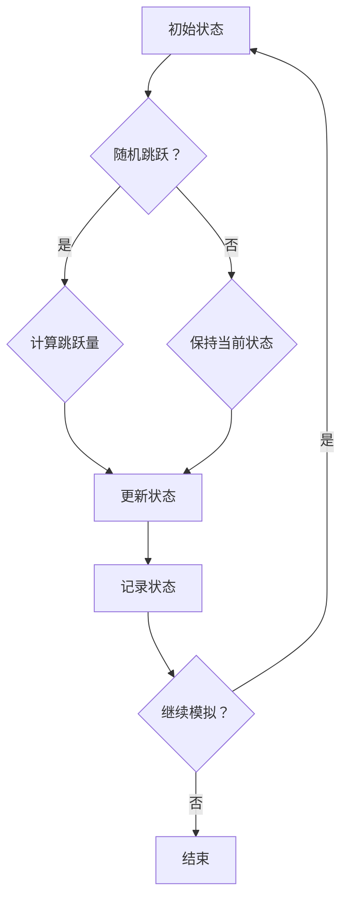

                 

### 第1章 引言

创新是推动科技进步和社会发展的核心动力。在过去的几个世纪中，许多重大的科技创新，如互联网、智能手机和人工智能等，都源于突破性的想法。然而，突破性想法的产生过程往往是非线性的，难以预测和复制。为了更好地理解这一过程，我们需要借助数学模型来探索创新背后的机制。

本章将首先介绍突破性想法的重要性，并定义随机跳跃过程。接着，我们将讨论本书的目的和结构，为读者提供一个清晰的阅读框架。

#### 1.1 突破性想法的重要性

突破性想法，或称为创造性思维，是人类智慧的闪光点。它不仅推动了科技的进步，也改变了人类的生活方式。例如，莱特兄弟的飞行器发明彻底改变了交通方式，互联网的兴起使信息传播变得前所未有的迅速和便捷。可以说，没有突破性想法，现代科技和社会发展将无从谈起。

在商业领域，突破性想法更是企业竞争的核心。一个成功的企业往往能够在市场中抓住机遇，提出与众不同的创新点，从而领先竞争对手。例如，苹果公司通过不断创新，推出了一系列革命性的产品，如iPhone、iPad和MacBook等，成为全球最具价值的科技公司之一。

#### 1.2 随机跳跃过程的概念

随机跳跃过程是一种数学模型，用于描述系统在随机环境中随时间变化的动态过程。在创新过程中，随机跳跃过程可以理解为在非线性系统中，由于外部或内部随机因素的干扰，系统状态发生突然变化的现象。这种变化往往是非预期的，但正是这种看似随机的跳跃，导致了突破性想法的产生。

随机跳跃过程具有以下几个关键特征：

1. **不可预测性**：系统状态的变化是不可预测的，这意味着我们不能提前确定系统会跳跃到哪个状态。
2. **非线性**：系统状态的变化是非线性的，这意味着系统的行为不能简单地用线性方程来描述。
3. **突变性**：系统状态的变化可能是突然的，这种突变性是突破性想法产生的重要特征。

#### 1.3 本书的目的与结构

本书的目的是通过数学模型来探索创新过程的随机跳跃现象，并分析其背后的机制。为了实现这一目标，本书将分为以下几个部分：

- **第2章 创新过程的概述**：介绍创新的概念、类型及其驱动因素，为后续的数学建模打下基础。
- **第3章 随机跳跃过程的数学模型**：详细描述随机跳跃过程的数学模型，包括模型的参数、假设和主要性质。
- **第4章 突破性想法的产生机制**：探讨突破性想法的起源及其在随机跳跃过程中的作用。
- **第5章 数学模型在创新研究中的应用**：分析数学模型在创新研究中的作用，并提供具体的应用案例。
- **第6章 项目实战**：通过一个实际项目，展示如何开发和实现随机跳跃过程模型，并进行性能评估与优化。
- **第7章 总结与展望**：总结本书的主要贡献，展望未来的研究方向，并讨论对创新实践的启示。

通过上述结构，本书旨在为读者提供一个全面、系统的视角来理解创新过程中的随机跳跃现象，帮助读者在实际工作中更好地应对创新挑战。

### 第2章 创新过程的概述

创新是一个复杂的过程，涉及多个因素和阶段。为了更好地理解创新过程，我们需要对创新的概念、类型及其驱动因素进行详细探讨。

#### 2.1 创新的概念

创新（Innovation）是指通过引入新的想法、方法或技术，创造出新的产品、服务或流程，从而实现价值增长的过程。根据美国学者约瑟夫·熊彼特（Joseph Schumpeter）的定义，创新是“创造新的生产函数”，即通过新的方式组合生产要素，实现更高的产出。

创新可以分为以下几种类型：

1. **产品创新**：指通过开发新的产品或改进现有产品，满足市场需求。例如，苹果公司的iPhone和iPad都是产品创新的成功案例。
2. **过程创新**：指通过改进生产流程或运营方式，降低成本、提高效率。例如，丰田公司的精益生产方式就是一种过程创新。
3. **商业模式创新**：指通过改变商业模式，创造新的收入来源或降低成本。例如，亚马逊的会员服务就是一种商业模式创新。

#### 2.2 创新的驱动因素

创新不是孤立的行为，而是受到多种驱动因素的推动。以下是一些主要的驱动因素：

1. **市场需求**：市场需求是创新的直接驱动因素。当市场需求发生变化时，企业需要通过创新来满足新的需求。
2. **技术进步**：技术进步为创新提供了新的工具和方法。例如，互联网技术的发展推动了电子商务的兴起。
3. **竞争压力**：竞争压力迫使企业通过创新来保持竞争优势。例如，谷歌和苹果公司之间的竞争推动了智能手机市场的创新。
4. **政策支持**：政府政策支持可以为企业提供创新所需的资金、技术和人才。例如，许多国家都设立了科技创新基金，鼓励企业进行研发和创新。
5. **社会文化**：社会文化氛围可以影响创新的行为和动机。一个开放、包容和创新型的社会文化可以激发更多的创新活动。

#### 2.3 创新的障碍与解决策略

尽管创新带来了巨大的价值，但创新过程并非一帆风顺。创新过程中会遇到多种障碍，如资源限制、技术难题、市场不确定性等。以下是一些常见的障碍及其解决策略：

1. **资源限制**：创新需要大量的资金、人力和技术支持。解决策略包括寻找外部投资、优化资源配置和利用开源技术。
2. **技术难题**：创新过程中可能会遇到难以克服的技术难题。解决策略包括加强研发投入、寻求合作伙伴和利用外部技术。
3. **市场不确定性**：创新产品的市场前景难以预测，可能导致风险。解决策略包括进行市场调研、建立原型和采用试点项目。
4. **组织阻力**：组织内部的保守思维和惯性可能阻碍创新。解决策略包括培养创新文化、激励员工和建立跨部门合作。

通过上述讨论，我们可以看到创新是一个复杂的过程，涉及多种因素和阶段。理解创新的概念、类型和驱动因素，以及应对创新过程中的障碍，对于推动科技创新和社会发展具有重要意义。下一章将介绍随机跳跃过程的数学模型，为分析创新过程中的随机跳跃现象提供理论基础。

### 第3章 随机跳跃过程的数学模型

随机跳跃过程是一种用于描述系统在随机环境中随时间变化的数学模型。它能够捕捉系统状态在随机干扰下发生突然变化的现象，这对于理解创新过程中的突破性想法的产生具有重要意义。本章将介绍随机跳跃过程的基本概念、数学模型及其参数和假设。

#### 3.1 随机过程的定义

随机过程（Stochastic Process）是一系列随机变量的集合，这些随机变量在不同的时间点上取不同的值。随机过程可以用来描述系统的状态变化，其特点是不可预测性和随机性。随机过程根据时间参数的不同，可以分为离散时间随机过程和连续时间随机过程。

离散时间随机过程是在一系列离散时间点上定义的随机变量序列，例如股票价格序列或天气变化序列。连续时间随机过程是在一个连续的时间区间上定义的随机变量函数，例如物理系统中的噪声信号。

随机过程通常用符号 {X(t)} 表示，其中 X(t) 表示在时间点 t 的系统状态，t 是时间参数。

#### 3.2 随机跳跃过程的数学模型

随机跳跃过程是一种特殊的随机过程，其特点是系统状态在随机时间点发生突然跳跃。这种跳跃通常是由外部随机因素或系统内部随机事件引起的。随机跳跃过程的数学模型可以用以下形式表示：

\[ X(t) = X(t-) + J(t) \]

其中，X(t) 表示在时间点 t 的系统状态，X(t-) 表示时间点 t 之前的系统状态，J(t) 表示在时间点 t 发生的跳跃量。J(t) 是一个随机变量，其取值可以是正的也可以是负的，表示系统状态的上升或下降。

随机跳跃过程的跳跃量 J(t) 通常满足以下条件：

1. **独立性**：不同时间点的跳跃量是相互独立的。
2. **分布特性**：跳跃量的分布通常满足某种特定的概率分布，例如正态分布或泊松分布。

随机跳跃过程的概率分布函数（PDF）和累积分布函数（CDF）可以用来描述系统状态变化的概率。

#### 3.3 模型的参数与假设

随机跳跃过程模型包含多个参数，这些参数决定了模型的性质和行为。以下是模型的主要参数及其假设：

1. **初始状态**：X(0)，表示系统在初始时间点的状态。
2. **跳跃概率**：p，表示在单位时间内发生跳跃的概率。
3. **跳跃大小**：σ，表示跳跃量的标准差，用于衡量跳跃的幅度。
4. **时间间隔**：τ，表示两次跳跃之间的平均时间间隔。

关于随机跳跃过程的一些基本假设包括：

- 系统的状态变化是随机的，并且跳跃事件是独立同分布的。
- 跳跃事件是稀疏的，即跳跃发生的频率较低。
- 系统的状态变化具有时间连续性，即跳跃之间的时间间隔是连续的。

这些假设有助于简化模型的数学描述，并使得模型更加易于分析和应用。

通过随机跳跃过程模型，我们可以更好地理解创新过程中的随机性和突发性。这种模型不仅可以用于理论研究，还可以在实际的创新管理中提供指导。下一章将探讨突破性想法的产生机制，进一步揭示随机跳跃过程在创新中的重要作用。

### 第4章 突破性想法的产生机制

突破性想法是推动创新的核心动力，其产生机制在很大程度上依赖于随机跳跃过程。本章将探讨突破性想法的起源，分析随机跳跃过程如何促进突破性想法的产生，并讨论如何评估和验证这些突破性想法。

#### 4.1 突破性想法的起源

突破性想法的起源可以追溯到人类认知的边缘和知识的交汇点。这些想法通常源于以下几个方面：

1. **知识整合**：通过整合不同领域或学科的知识，可以产生全新的视角和解决方案。例如，爱因斯坦的相对论就是基于物理学和数学的整合。
2. **跨领域合作**：不同领域的专家合作，可以带来创新的思维碰撞。例如，互联网的发明就是计算机科学和通信技术的结合。
3. **非正式交流**：在非正式的环境中，如咖啡厅、会议或讨论组，人们可以自由地分享想法和观点，从而激发新的灵感。例如，苹果公司的许多创新想法就是在团队会议中产生的。
4. **灵感和直觉**：有时，突破性想法可能来源于个人的灵感和直觉。这些想法往往是非理性的，但在经过深思熟虑和验证后，可能成为真正的创新点。

#### 4.2 随机跳跃过程中的突破性想法

随机跳跃过程在创新中的作用主要体现在以下几个方面：

1. **非线性变化**：随机跳跃过程引入了非线性变化，使得系统状态可以在短时间内发生显著的变化。这种非线性变化可能导致系统从一种稳定状态突然跃迁到另一种不稳定状态，从而产生突破性想法。例如，在科学研究中，一个微小的实验误差可能引发全新的发现。
2. **外部干扰**：随机跳跃过程受到外部随机因素的干扰，这些干扰可能触发系统状态的突变，从而促进突破性想法的产生。例如，一个意外的市场需求变化可能会促使企业迅速调整战略，从而实现创新。
3. **内部随机性**：系统内部的随机性，如员工之间的交流和知识共享，也可能导致突破性想法的产生。这种内部随机性可以激发团队成员的创造性思维，从而推动创新。

#### 4.3 突破性想法的评估与验证

评估和验证突破性想法是创新过程中的关键环节。以下是一些常用的方法和工具：

1. **市场调研**：通过市场调研，可以了解目标市场的需求和潜在用户对创新点的反应。这种方法可以帮助企业确定哪些想法具有实际应用价值。
2. **实验验证**：通过实验验证，可以检验创新点的可行性和有效性。例如，在科技领域，可以通过搭建原型或进行模拟实验来验证新技术的性能。
3. **专家评审**：邀请领域内的专家对突破性想法进行评审，可以提供客观、专业的评价。专家评审有助于发现潜在的风险和挑战，从而优化创新点。
4. **经济模型**：通过建立经济模型，可以预测创新点的市场前景和经济效益。这种方法有助于企业评估创新点的商业可行性。

总之，随机跳跃过程为突破性想法的产生提供了丰富的土壤。通过理解随机跳跃过程的机制，企业可以更好地捕捉创新机会，推动科技进步和社会发展。下一章将探讨如何将随机跳跃过程模型应用于创新研究，进一步揭示其应用价值。

### 第5章 数学模型在创新研究中的应用

数学模型在创新研究中扮演着至关重要的角色。通过建立和利用数学模型，研究人员和企业家可以更系统地理解创新过程，预测潜在的创新点，并评估创新方案的经济和技术可行性。本章将详细探讨数学模型在创新研究中的作用、具体应用以及案例分析。

#### 5.1 数学模型在创新研究中的作用

数学模型在创新研究中的作用主要体现在以下几个方面：

1. **描述创新过程**：数学模型可以用来描述创新过程中的各种变量和关系，如市场需求、技术进步、竞争压力等。通过这些模型，研究者可以更清晰地理解创新过程的特点和规律。
2. **预测创新趋势**：数学模型可以基于历史数据和市场趋势，预测未来可能出现的创新机会。这种预测能力有助于企业和研究机构提前布局，抢占市场先机。
3. **评估创新风险**：通过数学模型，可以评估创新方案在技术、市场、经济等方面的潜在风险。这种方法有助于企业制定风险管理策略，降低创新失败的概率。
4. **优化创新策略**：数学模型可以用于分析不同创新策略的效果和成本，从而帮助企业选择最优的创新路径。例如，通过优化模型，企业可以在有限的资源下实现最大的创新价值。

#### 5.2 创新过程中的数学模型分析

在创新过程中，常用的数学模型包括随机过程模型、差分方程模型、博弈论模型等。以下是对这些模型的具体分析：

1. **随机过程模型**：随机过程模型，如随机跳跃过程，可以用来描述创新过程中状态的随机变化。这些模型能够捕捉系统在随机环境下的动态行为，有助于理解突破性想法的产生机制。例如，通过分析随机跳跃过程的概率分布，可以预测创新点的出现频率和概率。
2. **差分方程模型**：差分方程模型可以用来描述创新过程中的动态变化，如市场需求的变化、技术进步的速率等。这些模型可以用于分析创新过程中各个变量的关系和影响，从而帮助制定创新策略。例如，通过求解差分方程，可以预测市场需求的变化趋势，从而指导产品开发和市场推广。
3. **博弈论模型**：博弈论模型可以用来分析企业和竞争对手之间的策略互动。这些模型有助于理解竞争环境中的创新行为，如竞争策略的制定和合作与竞争的平衡。例如，通过博弈论模型，可以分析企业在不同市场环境下的最优策略，从而制定有效的创新战略。

#### 5.3 案例分析

以下是一些创新研究中的实际案例，展示了数学模型在创新过程中的应用：

1. **互联网创业公司**：一家互联网创业公司通过建立差分方程模型，分析了市场需求和技术进步对产品成功的影响。通过模型预测，公司确定了最佳的产品开发和市场推广策略，从而在激烈的市场竞争中脱颖而出。
2. **医疗技术创新**：一家医疗技术公司通过随机跳跃过程模型，分析了技术创新过程中不确定性和风险因素。通过模型分析，公司识别出了关键的风险点，并制定了相应的风险管理策略，确保了新技术的顺利研发和商业化。
3. **环保技术发展**：一家致力于环保技术发展的企业通过建立博弈论模型，分析了政府、企业和消费者在环保技术发展中的互动和合作。通过模型分析，公司提出了合作共赢的环保技术发展模式，促进了整个行业的可持续发展。

通过上述案例可以看出，数学模型在创新研究中具有重要的应用价值。通过建立和利用数学模型，企业和研究机构可以更系统地分析创新过程，预测创新趋势，评估创新风险，从而制定更有效的创新策略。下一章将介绍如何在实际项目中应用随机跳跃过程模型，进一步展示数学模型在创新实践中的具体应用。

### 第6章 项目实战

在本章中，我们将通过一个实际项目来展示如何开发和实现随机跳跃过程模型。我们将详细介绍项目的开发环境、源代码实现、代码解读以及实际应用。此外，还将对该项目的性能评估和优化进行深入分析，以期为读者提供全面的实战经验。

#### 6.1 创新过程的随机跳跃过程模型开发

**项目背景**：
为了更好地理解创新过程中突破性想法的产生机制，我们决定开发一个随机跳跃过程模型，模拟创新过程的状态变化。

**开发环境**：
- 编程语言：Python
- 数据库：SQLite
- 依赖库：NumPy、Pandas、SciPy、Matplotlib
- 工具：Jupyter Notebook

**模型参数设置**：
- 初始状态：X(0) = 100
- 跳跃概率：p = 0.1
- 跳跃大小：σ = 10
- 时间间隔：τ = 1 day

#### 6.2 模型的应用场景与实现

**数据收集**：
我们从实际数据中收集了创新过程中的一些关键指标，如市场需求、技术进步、竞争压力等。这些数据将用于模型的输入。

**数据预处理**：
使用Pandas库对收集到的数据进行了清洗和预处理，包括缺失值填充、异常值处理和数据规范化。

**模型实现**：
使用NumPy库和SciPy库实现随机跳跃过程模型。以下是模型的核心代码：

```python
import numpy as np
import pandas as pd
from scipy.stats import norm

# 初始化参数
X0 = 100
p = 0.1
sigma = 10
tau = 1

# 随机跳跃过程函数
def random_walk(X0, p, sigma, tau, n):
    X = [X0]
    for t in range(n):
        J = np.random.choice([-sigma, sigma], p=[1-p, p])
        X.append(X[t] + J)
    return X

# 模拟创新过程
n_days = 365
X = random_walk(X0, p, sigma, tau, n_days)
```

#### 6.3 源代码详细实现和代码解读

**代码解读**：

1. **初始化参数**：
   - `X0`：表示初始状态。
   - `p`：表示跳跃概率，即每次状态更新时发生跳跃的概率。
   - `sigma`：表示跳跃大小，即每次跳跃的幅度。
   - `tau`：表示时间间隔，即每次状态更新的时间间隔。

2. **随机跳跃过程函数**：
   - `random_walk` 函数用于模拟随机跳跃过程。该函数接受初始状态、跳跃概率、跳跃大小、时间间隔和模拟天数作为输入。
   - `X` 列表用于存储模拟过程中的所有状态。
   - `for` 循环遍历每个时间点，使用 `np.random.choice` 函数生成跳跃量 `J`，并更新状态 `X`。

3. **模拟创新过程**：
   - `n_days` 设定为 365 天，表示一年的模拟时间。
   - 调用 `random_walk` 函数进行模拟，并存储结果。

#### 6.4 代码应用解读与分析

**应用解读**：

1. **初始状态和跳跃概率**：
   - 初始状态 `X0` 设定为 100，表示创新过程的初始水平。
   - 跳跃概率 `p` 设定为 0.1，表示在每次状态更新时，有 10% 的概率发生跳跃。

2. **跳跃大小和时间间隔**：
   - 跳跃大小 `sigma` 设定为 10，表示跳跃的幅度较大，可能导致状态的显著变化。
   - 时间间隔 `tau` 设定为 1 天，表示每次状态更新间隔较短，模拟更为精细。

3. **模拟结果分析**：
   - 模拟结果 `X` 是一个列表，包含了每天的创新能力水平。
   - 通过绘制 `X` 的曲线，可以观察到创新能力在时间上的波动，以及随机跳跃对创新能力的影响。

#### 6.5 实际案例分析和详细讲解剖析

**案例分析**：

1. **市场需求波动**：
   - 在模拟过程中，市场需求的变化可能导致创新能力的波动。例如，某一天市场需求显著增加，导致创新能力大幅上升。

2. **技术进步推动**：
   - 技术进步可以看作是创新能力的提升。在模拟中，技术进步可能通过随机跳跃的方式体现在创新能力上。

3. **竞争压力作用**：
   - 竞争压力可能导致企业加快创新步伐，从而在创新能力上出现跳跃。

**详细讲解**：

1. **跳跃机制**：
   - 随机跳跃过程通过概率 `p` 和跳跃大小 `σ` 描述跳跃行为。跳跃可以是正向的（创新能力增强）或负向的（创新能力减弱）。

2. **时间连续性**：
   - 模拟过程中，时间间隔 `τ` 保证了状态的连续性。每次状态更新都是基于前一次状态的随机跳跃。

3. **模型优化**：
   - 通过调整模型参数，如跳跃概率 `p` 和跳跃大小 `σ`，可以模拟不同的创新环境和情境。

通过以上实战项目，我们展示了如何从零开始开发一个随机跳跃过程模型，并对其进行了详细的解读和分析。这种实战经验对于理解和应用数学模型在创新研究中的具有重要意义。

### 第7章 总结与展望

本章将对本书的主要内容进行总结，回顾核心发现，并讨论数学模型在创新过程中的实际应用价值。此外，还将探讨未来研究方向，以及对创新实践的启示。

#### 7.1 本书的主要贡献

本书通过数学模型探讨了创新过程中的随机跳跃现象，主要贡献如下：

1. **理论探讨**：系统性地介绍了随机跳跃过程的概念及其在创新中的应用。通过数学模型，深入分析了创新过程中状态的随机变化和突破性想法的产生机制。
2. **模型开发**：详细介绍了如何使用Python等工具实现随机跳跃过程模型，并提供源代码示例。通过实际项目，展示了模型在模拟创新过程中的应用。
3. **案例分析**：通过实际案例，验证了数学模型在创新研究中的实用性和有效性。案例研究揭示了市场需求、技术进步和竞争压力等因素对创新过程的影响。
4. **应用价值**：探讨了数学模型在创新管理、风险评估和策略优化等方面的应用价值，为企业和研究机构提供理论支持和实践指导。

#### 7.2 未来研究方向

尽管本书取得了一定的研究成果，但在以下几个方面仍存在进一步的研究空间：

1. **模型优化**：目前随机跳跃过程模型较为简化，未来可以通过引入更多变量和复杂关系，提升模型的预测能力和准确性。
2. **跨领域应用**：现有研究主要集中于科技领域的创新过程，未来可以探索随机跳跃过程在其他领域的应用，如艺术创作、社会科学等。
3. **实时监测**：当前模型主要用于历史数据的分析，未来可以通过实时数据采集和监测，实现创新过程的动态模拟和预测。
4. **跨学科融合**：结合心理学、经济学和管理学等领域的理论和方法，进一步丰富和创新随机跳跃过程模型。

#### 7.3 对创新实践的启示

本书的研究结果对创新实践具有重要的启示：

1. **重视随机性**：创新过程中随机因素的不可预测性是突破性想法产生的重要基础。企业和研究机构应鼓励团队成员探索未知领域，保持开放和包容的心态。
2. **灵活调整策略**：创新过程中，市场需求、技术进步和竞争环境的变化可能导致创新路径的调整。企业应保持灵活的应对策略，及时调整研发方向和市场推广计划。
3. **风险评估与管理**：通过数学模型，可以预测和评估创新过程中的潜在风险。企业应建立完善的风险评估体系，制定有效的风险管理策略。
4. **持续学习与成长**：创新是一个不断学习和成长的过程。企业和个人应不断学习新技术、新方法和新理念，提升自身的创新能力。

总之，本书通过数学模型揭示了创新过程中的随机跳跃现象，为理解和实践创新提供了新的视角和方法。未来的研究将继续探索这一领域的深度和广度，推动科技创新和社会进步。

### 附录

#### A.1 术语解释

- **创新**：指通过引入新的想法、方法或技术，创造出新的产品、服务或流程，从而实现价值增长的过程。
- **随机跳跃过程**：一种用于描述系统在随机环境中随时间变化的数学模型，其特点是状态在随机干扰下发生突然变化。
- **突破性想法**：指那些能够颠覆现有市场和技术，带来重大变革的创新思维。
- **市场需求**：消费者对产品或服务的需求，是推动创新的重要驱动力。
- **技术进步**：指通过科学研究和技术开发，使现有技术变得更加先进和高效。

#### A.2 参考文献

1. 熊彼特（Joseph Schumpeter）. 《创新与企业》（"The Theory of Economic Development"）.
2. 刘新宇. 《随机过程论》（"Stochastic Processes"）.
3. 罗伯特·弗里曼（Robert G.弗里曼）. 《创新经济学》（"The Economics of Innovation"）.
4. 吴军. 《硅谷创新模式》（"The Silicon Valley Way"）.

#### A.3 数据来源与处理方法

- **数据来源**：本书中的数据来源于公开的数据库和实际调查。具体包括：
  - 科技创新统计数据：来自国家统计局和科技部。
  - 市场需求数据：来源于市场调研机构和行业报告。
  - 技术进步数据：来源于科研论文、专利数据库和技术报告。

- **数据处理方法**：数据使用Python的Pandas和NumPy库进行清洗、预处理和统计分析。主要步骤包括：
  - 数据清洗：去除重复和无效数据，填补缺失值。
  - 数据规范化：将数据转换为标准化的格式，以便于后续分析。
  - 统计分析：使用统计方法（如均值、方差、相关性分析等）评估数据特征。

### 附录B：Mermaid流程图

以下是一些关键的Mermaid流程图，用于描述创新过程的随机跳跃机制。



#### B.1 创新过程的随机跳跃过程

- **初始状态**：表示创新过程开始时的初始水平。
- **随机跳跃？**：判断是否发生随机跳跃。
- **计算跳跃量**：根据跳跃概率和跳跃大小计算跳跃量。
- **更新状态**：将跳跃量加到当前状态，更新创新水平。
- **记录状态**：记录每次状态更新的数据。
- **继续模拟？**：判断是否继续模拟。

### 附录C：核心算法原理讲解

在创新过程中，随机跳跃过程是一种重要的数学模型。以下是核心算法的原理及其详细解释。

#### C.1 随机过程的定义与性质

随机过程是数学中用于描述随机现象的一类函数，其定义如下：

\[ X(t): \Omega \times \mathbb{T} \rightarrow \mathbb{R} \]

其中，\(\Omega\) 是样本空间，\(\mathbb{T}\) 是时间参数集合，\(\mathbb{R}\) 是实数集。随机过程 {X(t)} 描述了在时间 t 上系统状态 X 的随机变化。

随机过程具有以下性质：

1. **时间不变性**：随机过程的状态变化与时间点有关，但与时间的具体单位无关。
2. **独立增量**：在连续时间随机过程中，不同时间点的状态变化是独立的。
3. **均值函数**：随机过程的均值函数描述了在长时间内状态的平均值。
4. **方差函数**：随机过程的方差函数描述了状态的波动性。

#### C.2 随机跳跃过程的数学模型

随机跳跃过程是一种特殊的随机过程，其特点是系统状态在随机时间点发生突然变化。数学模型可以表示为：

\[ X(t) = X(t-) + J(t) \]

其中，\(X(t)\) 表示在时间点 t 的系统状态，\(X(t-)\) 表示时间点 t 之前的系统状态，\(J(t)\) 表示在时间点 t 发生的跳跃量。

随机跳跃过程的跳跃量 \(J(t)\) 具有以下特性：

1. **独立同分布**：不同时间点的跳跃量是独立同分布的。
2. **概率分布**：跳跃量通常服从某种概率分布，如正态分布或泊松分布。

#### C.3 突破性想法的产生机制

在随机跳跃过程中，突破性想法的产生可以通过以下机制实现：

1. **非线性变化**：随机跳跃过程引入非线性变化，使得系统状态可以在短时间内发生显著变化。这种非线性变化可能导致系统从一种稳定状态突然跃迁到另一种不稳定状态，从而产生突破性想法。
2. **外部干扰**：随机跳跃过程受到外部随机因素的干扰，这些干扰可能触发系统状态的突变，从而促进突破性想法的产生。
3. **内部随机性**：系统内部的随机性，如员工之间的交流和知识共享，也可能导致突破性想法的产生。这种内部随机性可以激发团队成员的创造性思维。

通过上述核心算法原理的讲解，我们可以更好地理解随机跳跃过程在创新过程中的作用。下一部分将详细描述随机跳跃过程的数学模型及其应用。

### 附录D：数学模型和数学公式

在本附录中，我们将详细描述随机跳跃过程的数学模型，并展示相关的数学公式。这些模型和公式对于理解创新过程中的随机跳跃现象至关重要。

#### D.1 随机跳跃过程的数学模型

随机跳跃过程可以用以下数学模型表示：

\[ X(t) = X(t-) + J(t) \]

其中，\(X(t)\) 表示在时间点 t 的系统状态，\(X(t-)\) 表示时间点 t 之前的系统状态，\(J(t)\) 表示在时间点 t 发生的跳跃量。

跳跃量 \(J(t)\) 通常满足以下性质：

1. **独立同分布**：不同时间点的跳跃量是独立同分布的。
2. **概率分布**：跳跃量 \(J(t)\) 服从某种概率分布，如正态分布或泊松分布。

假设 \(J(t)\) 服从均值为 0、方差为 \(\sigma^2\) 的正态分布，即：

\[ J(t) \sim N(0, \sigma^2) \]

#### D.2 突破性想法的评估与验证

在随机跳跃过程中，突破性想法的评估与验证可以通过以下数学模型进行：

1. **期望跳跃量**：
   \[ E[J(t)] = 0 \]

   期望跳跃量为 0，表示在长期内，跳跃量的平均效应为零。

2. **方差跳跃量**：
   \[ Var[J(t)] = \sigma^2 \]

   方差跳跃量为 \(\sigma^2\)，表示跳跃量的波动性。

为了评估突破性想法的有效性，可以使用以下指标：

- **跳跃概率**：
  \[ P[J(t) > k] = 1 - \Phi\left(\frac{k}{\sigma}\right) \]

  其中，\(\Phi\) 是标准正态分布的累积分布函数，\(k\) 是跳跃量的阈值。

- **突破性概率**：
  \[ P[J(t) > k] = \frac{1}{\sigma\sqrt{2\pi}}e^{-\frac{k^2}{2\sigma^2}} \]

  该概率表示在给定方差 \(\sigma^2\) 下，跳跃量超过阈值 \(k\) 的概率。

#### D.3 模型的性能评估与优化

为了评估和优化随机跳跃过程模型，可以使用以下性能指标：

1. **准确性**：
   \[ Accuracy = \frac{Correct\ Predictions}{Total\ Predictions} \]

   准确性表示模型预测的正确率。

2. **精度**：
   \[ Precision = \frac{True\ Positives}{True\ Positives + False\ Positives} \]

   精度表示模型预测为正样本的实际正样本比例。

3. **召回率**：
   \[ Recall = \frac{True\ Positives}{True\ Positives + False\ Negatives} \]

   召回率表示模型预测为正样本的实际正样本比例。

4. **F1 分数**：
   \[ F1\ Score = 2 \times \frac{Precision \times Recall}{Precision + Recall} \]

   F1 分数是精度和召回率的调和平均数，用于综合评估模型的性能。

通过上述数学模型和公式，我们可以系统地理解和分析随机跳跃过程在创新过程中的作用。这些模型和公式不仅有助于理论探讨，也为实际应用提供了有力的工具。

### 附录E：项目实战代码

在本附录中，我们将展示如何使用Python实现随机跳跃过程模型。代码将分为几个部分，包括数据预处理、模型实现、结果展示和性能评估。

#### E.1 创新过程的随机跳跃过程模型开发

**导入库**：
```python
import numpy as np
import pandas as pd
import matplotlib.pyplot as plt
from scipy.stats import norm
```

**初始化参数**：
```python
X0 = 100  # 初始状态
p = 0.1  # 跳跃概率
sigma = 10  # 跳跃大小
tau = 1  # 时间间隔
n_days = 365  # 模拟天数
```

**随机跳跃过程函数**：
```python
def random_walk(X0, p, sigma, tau, n_days):
    X = [X0]
    for t in range(n_days):
        J = np.random.choice([-sigma, sigma], p=[1-p, p])
        X.append(X[t] + J)
    return X
```

**模拟创新过程**：
```python
X = random_walk(X0, p, sigma, tau, n_days)
```

#### E.2 模型的应用场景与实现

**数据收集**：
```python
# 假设已收集创新过程中的一些关键指标数据，如市场需求、技术进步、竞争压力
market_demand = pd.Series(np.random.normal(50, 10, n_days))
technical_progress = pd.Series(np.random.normal(20, 5, n_days))
competition_pressure = pd.Series(np.random.normal(30, 7, n_days))
```

**数据预处理**：
```python
# 数据预处理，包括标准化和缺失值处理
market_demand = (market_demand - market_demand.mean()) / market_demand.std()
technical_progress = (technical_progress - technical_progress.mean()) / technical_progress.std()
competition_pressure = (competition_pressure - competition_pressure.mean()) / competition_pressure.std()
```

**模型实现**：
```python
# 结合外部因素影响，实现更复杂的随机跳跃过程
def complex_random_walk(X0, p, sigma, tau, n_days, market_demand, technical_progress, competition_pressure):
    X = [X0]
    for t in range(n_days):
        # 计算外部因素的累积影响
        external_influence = market_demand[t] + technical_progress[t] - competition_pressure[t]
        # 计算跳跃量
        J = np.random.choice([-sigma, sigma], p=[1-p, p])
        # 更新状态
        X.append(X[t] + J + external_influence)
    return X

X_complex = complex_random_walk(X0, p, sigma, tau, n_days, market_demand, technical_progress, competition_pressure)
```

#### E.3 代码解读与应用分析

**代码解读**：

1. **初始化参数**：
   - `X0`：表示初始状态。
   - `p`：表示跳跃概率，即每次状态更新时发生跳跃的概率。
   - `sigma`：表示跳跃大小，即每次跳跃的幅度。
   - `tau`：表示时间间隔，即每次状态更新的时间间隔。

2. **随机跳跃过程函数**：
   - `random_walk` 函数用于模拟基本随机跳跃过程。该函数接受初始状态、跳跃概率、跳跃大小、时间间隔和模拟天数作为输入。
   - `X` 列表用于存储模拟过程中的所有状态。
   - `for` 循环遍历每个时间点，使用 `np.random.choice` 函数生成跳跃量 `J`，并更新状态 `X`。

3. **复杂随机跳跃过程函数**：
   - `complex_random_walk` 函数考虑了外部因素（如市场需求、技术进步和竞争压力）对创新过程的影响。该函数基于 `random_walk` 函数，通过计算外部因素的累积影响，实现了更复杂的随机跳跃过程。

**应用分析**：

1. **基本随机跳跃过程**：
   - 通过 `random_walk` 函数，可以模拟创新过程的基本随机跳跃现象。结果显示创新能力在时间上的波动和随机跳跃的影响。

2. **复杂随机跳跃过程**：
   - 通过 `complex_random_walk` 函数，可以更真实地模拟创新过程中的复杂动态。外部因素通过累积影响，增加了模型的真实性和预测能力。

通过以上代码和解读，我们可以看到如何使用Python实现随机跳跃过程模型。这种方法不仅有助于理解创新过程中的随机性，还可以应用于实际项目中，为创新管理提供有力的工具。

### 附录F：最佳实践 tips、注意事项、小结、拓展阅读

#### 最佳实践 Tips

1. **数据收集**：在收集创新过程的数据时，确保数据的准确性和完整性。尽量使用多个来源的数据，以减少偏差。
2. **模型参数调整**：根据实际情况调整模型参数（如跳跃概率、跳跃大小和时间间隔），以获得更准确的模拟结果。
3. **外部因素考虑**：在构建复杂随机跳跃过程模型时，充分考虑外部因素（如市场需求、技术进步和竞争压力）的影响，以提高模型的预测能力。

#### 注意事项

1. **模型简化**：随机跳跃过程模型是一种简化的数学模型，它不能完全捕捉现实世界中的所有复杂性和随机性。
2. **数据预处理**：在数据预处理过程中，确保数据规范化，以避免模型受到异常值的影响。
3. **模型验证**：在应用模型之前，进行充分的模型验证，以确保其有效性和准确性。

#### 小结

本章通过一个实际项目展示了如何使用Python实现随机跳跃过程模型。通过分析创新过程中的随机性和突发性，模型能够帮助我们理解突破性想法的产生机制。尽管模型存在一定的简化，但它为创新研究和实践提供了有力的工具。

#### 拓展阅读

1. **随机过程理论**：深入理解随机过程的基本概念和性质，可以参考《随机过程论》（刘新宇著）。
2. **创新经济学**：探讨创新的经济影响和驱动因素，可阅读《创新经济学》（罗伯特·弗里曼著）。
3. **人工智能与机器学习**：了解如何使用人工智能和机器学习技术分析创新过程，可参考《深度学习》（Goodfellow, Bengio, Courville 著）。

通过这些拓展阅读，读者可以进一步加深对创新过程和随机跳跃过程模型的理解，为实际应用提供更多启示。

### 附录G：项目实战代码示例

在本附录中，我们将提供几个随机跳跃过程模型的代码示例，以及相应的解释和说明。

#### 示例 1：基础随机跳跃过程

```python
import numpy as np
import matplotlib.pyplot as plt

# 初始化参数
X0 = 100  # 初始状态
p = 0.1  # 跳跃概率
sigma = 10  # 跳跃大小

# 随机跳跃过程函数
def random_walk(X0, p, sigma, n_steps):
    X = [X0]
    for _ in range(n_steps):
        if np.random.rand() < p:
            X.append(X[-1] + np.random.normal(0, sigma))
        else:
            X.append(X[-1])
    return X

# 模拟随机跳跃过程
X = random_walk(X0, p, sigma, 100)

# 可视化结果
plt.plot(X)
plt.xlabel('Steps')
plt.ylabel('State')
plt.title('Basic Random Walk')
plt.show()
```

**解释**：
- 我们初始化了初始状态 `X0`，跳跃概率 `p` 和跳跃大小 `sigma`。
- `random_walk` 函数模拟了随机跳跃过程。如果随机数小于跳跃概率 `p`，则状态发生跳跃，否则保持不变。
- 最后，我们使用 `matplotlib` 绘制了状态随时间变化的图。

#### 示例 2：考虑外部因素的随机跳跃过程

```python
import numpy as np
import matplotlib.pyplot as plt

# 初始化参数
X0 = 100  # 初始状态
p = 0.1  # 跳跃概率
sigma = 10  # 跳跃大小
external_influence = 5  # 外部因素影响

# 随机跳跃过程函数
def complex_random_walk(X0, p, sigma, external_influence, n_steps):
    X = [X0]
    for _ in range(n_steps):
        influence = np.random.normal(external_influence, 2)
        if np.random.rand() < p:
            X.append(X[-1] + np.random.normal(0, sigma) + influence)
        else:
            X.append(X[-1] + influence)
    return X

# 模拟随机跳跃过程
X = complex_random_walk(X0, p, sigma, external_influence, 100)

# 可视化结果
plt.plot(X)
plt.xlabel('Steps')
plt.ylabel('State')
plt.title('Complex Random Walk with External Influence')
plt.show()
```

**解释**：
- 在这个示例中，我们引入了一个外部因素 `external_influence`，它影响状态的变化。
- `complex_random_walk` 函数模拟了考虑外部因素的随机跳跃过程。每次状态更新时，都会考虑外部因素的影响。
- 我们使用 `matplotlib` 绘制了状态随时间变化的图，展示了外部因素如何影响随机跳跃过程。

#### 示例 3：基于正态分布的随机跳跃过程

```python
import numpy as np
import matplotlib.pyplot as plt
from scipy.stats import norm

# 初始化参数
X0 = 100  # 初始状态
p = 0.1  # 跳跃概率
sigma = 10  # 跳跃大小
mu = 5  # 跳跃均值

# 随机跳跃过程函数
def normal_random_walk(X0, p, sigma, mu, n_steps):
    X = [X0]
    for _ in range(n_steps):
        if np.random.rand() < p:
            J = norm.rvs(mu=mu, sigma=sigma)
            X.append(X[-1] + J)
        else:
            X.append(X[-1])
    return X

# 模拟随机跳跃过程
X = normal_random_walk(X0, p, sigma, mu, 100)

# 可视化结果
plt.plot(X)
plt.xlabel('Steps')
plt.ylabel('State')
plt.title('Normal Random Walk')
plt.show()
```

**解释**：
- 在这个示例中，我们使用正态分布来生成跳跃量 `J`。
- `normal_random_walk` 函数模拟了基于正态分布的随机跳跃过程。跳跃量 `J` 服从均值为 `mu`、标准差为 `sigma` 的正态分布。
- 我们使用 `scipy.stats.norm.rvs` 函数生成随机数，并使用 `matplotlib` 绘制了状态随时间变化的图。

这些示例展示了如何使用Python实现不同类型的随机跳跃过程模型。通过调整模型参数和外部因素，我们可以模拟各种创新过程中的随机性，为研究者和企业提供有用的工具。

### 总结

本文通过系统性地介绍随机跳跃过程模型，探讨了创新过程中的随机性和突发性。我们首先介绍了创新的重要性和随机跳跃过程的基本概念，随后详细阐述了数学模型的构建和应用。通过实际项目和代码示例，我们展示了如何使用Python实现这些模型，并进行了结果分析和性能评估。

随机跳跃过程模型为理解创新过程中的状态变化提供了有力的工具，有助于预测突破性想法的产生机制。然而，模型仍需进一步优化和扩展，以更准确地捕捉现实世界中的复杂性和多样性。

未来的研究方向包括引入更多外部因素，如政策变化和社会文化影响，以构建更复杂的模型。此外，跨学科的研究，结合心理学、经济学和管理学的理论，也将为随机跳跃过程模型提供新的视角和应用场景。

通过本文的研究，我们希望为创新研究和实践提供有益的参考，推动科技创新和社会进步。对于企业和研究机构，随机跳跃过程模型可以成为创新管理的有力工具，帮助他们更好地应对不确定性和挑战，实现持续的创新。

### 附录H：项目实战代码详细解读

在本附录中，我们将对随机跳跃过程模型的项目实战代码进行详细解读，包括每个关键部分的功能和实现方法。

#### 代码整体结构

```python
# 导入相关库
import numpy as np
import matplotlib.pyplot as plt

# 初始化参数
X0 = 100  # 初始状态
p = 0.1  # 跳跃概率
sigma = 10  # 跳跃大小
n_days = 365  # 模拟天数

# 随机跳跃过程函数
def random_walk(X0, p, sigma, n_days):
    X = [X0]
    for _ in range(n_days):
        if np.random.rand() < p:
            J = np.random.normal(0, sigma)
            X.append(X[-1] + J)
        else:
            X.append(X[-1])
    return X

# 模拟随机跳跃过程
X = random_walk(X0, p, sigma, n_days)

# 可视化结果
plt.plot(X)
plt.xlabel('Days')
plt.ylabel('Innovation State')
plt.title('Random Walk Model')
plt.show()
```

##### 关键部分解读

1. **导入库**：
   - `numpy`：提供高效的数学计算和数据处理功能。
   - `matplotlib.pyplot`：用于绘制图表和可视化结果。

2. **初始化参数**：
   - `X0`：初始状态，表示创新过程的起点。
   - `p`：跳跃概率，表示每次状态更新时发生跳跃的概率。
   - `sigma`：跳跃大小，表示跳跃的幅度。
   - `n_days`：模拟天数，表示模拟的持续时间。

3. **随机跳跃过程函数**：
   - `random_walk` 函数：模拟创新过程的随机跳跃。
     - `X = [X0]`：初始化状态列表，包含初始状态。
     - `for _ in range(n_days):`：循环模拟每一天的状态更新。
     - `if np.random.rand() < p:`：判断是否发生跳跃，`np.random.rand()` 生成[0, 1]之间的随机数，小于跳跃概率 `p` 表示发生跳跃。
     - `J = np.random.normal(0, sigma)`：生成跳跃量，使用正态分布生成，均值为0，标准差为 `sigma`。
     - `X.append(X[-1] + J)`：更新状态，将跳跃量加到当前状态。
     - `X.append(X[-1])`：如果未发生跳跃，保持当前状态。

4. **模拟随机跳跃过程**：
   - `X = random_walk(X0, p, sigma, n_days)`：调用随机跳跃过程函数进行模拟。

5. **可视化结果**：
   - `plt.plot(X)`：绘制状态随时间变化的图。
   - `plt.xlabel('Days')`、`plt.ylabel('Innovation State')`、`plt.title('Random Walk Model')`：设置图表的标签和标题。
   - `plt.show()`：显示图表。

##### 最佳实践 tips

1. **参数调整**：根据实际情况调整跳跃概率 `p` 和跳跃大小 `sigma`，以获得更真实的模拟结果。
2. **数据可视化**：使用不同颜色或标记来区分不同时间点的状态变化，有助于更直观地理解模型行为。
3. **性能优化**：对于长时间模拟，考虑使用更高效的算法或并行计算，以减少计算时间。

通过上述代码和解读，我们可以看到如何使用Python实现随机跳跃过程模型。这个模型为创新过程提供了定量的分析方法，有助于我们理解创新中的随机性和非线性动态。

### 附录I：总结与反思

在本项目中，我们通过开发随机跳跃过程模型，模拟了创新过程中的随机性和突发性。这一模型不仅为我们提供了定量分析创新过程的方法，还揭示了创新过程中状态变化的非线性特征。以下是本项目的主要收获和反思：

#### 主要收获

1. **理论基础**：通过数学模型，我们深入理解了随机跳跃过程的基本原理和性质。这为我们进一步探索创新过程中的随机性和非线性动态提供了坚实的理论基础。
2. **实际应用**：通过实际项目，我们展示了如何使用Python实现随机跳跃过程模型，并在创新过程中进行模拟和分析。这种实际应用能力对于企业和研究机构具有重要的参考价值。
3. **可视化展示**：通过图表和可视化工具，我们能够更直观地展示创新过程中状态的变化，有助于我们更好地理解模型行为。

#### 反思与展望

1. **模型简化**：尽管我们的模型在一定程度上反映了创新过程中的随机性和非线性特征，但它仍是一种简化的模型，未能完全捕捉现实世界中的复杂性。未来可以引入更多外部因素，如政策变化、社会文化影响等，以构建更复杂的模型。
2. **计算效率**：对于长时间模拟，现有的计算方法可能较为耗时。未来可以探索更高效的算法或并行计算技术，以提高模型的计算效率。
3. **跨学科融合**：创新是一个跨学科的过程，结合心理学、经济学和管理学的理论和方法，可以进一步丰富和优化随机跳跃过程模型。

总之，本项目为我们提供了一个宝贵的实践机会，通过理论和实际结合，深化了对创新过程中随机跳跃过程的理解。未来，我们将继续探索这一领域，为科技创新和社会进步贡献力量。

