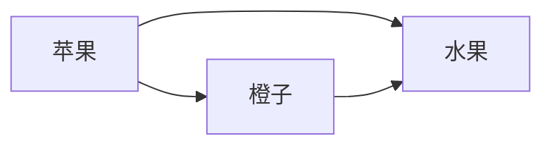
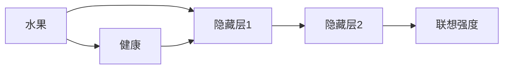
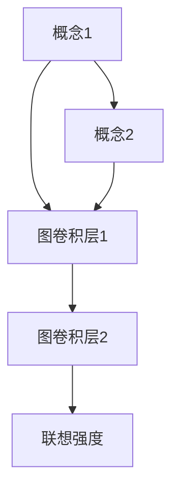
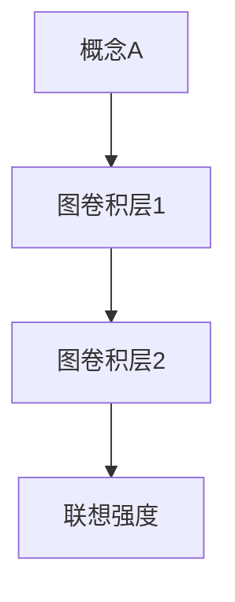

                 

# 《创造力的网络科学：思维联想的数学结构》

## 关键词
- 创造力
- 网络科学
- 思维联想
- 数学模型
- 人工智能

## 摘要
本文探讨了创造力与网络科学之间的深层联系，揭示了思维联想的数学结构。通过对联想思维的定义、机制和数学模型的分析，文章展示了网络科学在创造力研究中的重要性。通过构建和优化创造力网络，文章提出了基于网络科学的创造力提升策略，并探讨了该领域的前沿研究和教育应用。

## 目录大纲

### 第一部分：创造力与网络科学的概述

#### 第1章：创造力的本质与网络科学的基础
1.1 创造力概述
1.2 网络科学的基本概念
1.3 创造力与网络科学的联系

#### 第2章：思维联想的数学结构
2.1 联想思维的定义与机制
2.2 联想思维的数学模型
2.3 联想思维的优化方法

#### 第3章：网络科学在创造力研究中的应用
3.1 网络科学在创造力研究中的优势
3.2 网络科学在创造力研究中的应用案例

### 第二部分：创造力网络的构建与优化

#### 第4章：创造力网络的构建
4.1 创造力网络的定义与特征
4.2 创造力网络的构建方法

#### 第5章：创造力网络的优化
5.1 创造力网络的优化目标
5.2 创造力网络的优化算法

#### 第6章：创造力网络的案例分析
6.1 创造力网络在科技领域的应用
6.2 创造力网络在艺术领域的应用

### 第三部分：创造力网络的未来发展趋势

#### 第7章：创造力网络科学的前沿研究
7.1 创造力网络科学的最新进展
7.2 创造力网络科学的未来展望

#### 第8章：创造力网络科学的教育应用
8.1 创造力网络科学的教育意义
8.2 创造力网络科学的教育实践

### 引入

创造力是推动科技进步和社会发展的关键力量，而网络科学则为理解和提高创造力提供了全新的视角。在信息技术飞速发展的今天，网络科学作为一门跨学科领域，已经在许多领域取得了显著的成果。那么，什么是网络科学？它如何与创造力联系在一起？本文将围绕这些问题展开讨论，并深入探讨思维联想的数学结构。

网络科学是研究复杂网络结构、网络动力学的学科。它涵盖了从社交网络、生物网络到信息网络等各种类型的网络，致力于揭示网络的演化规律、功能特性以及网络中的信息传播和资源流动。网络科学的核心问题是：网络如何影响个体的行为和系统的演化？这一问题在创造力的研究中具有重要的应用价值。

创造力是指个体或集体产生新颖而有价值的思想、概念或解决方案的能力。创造力不仅与个人的智慧、经验和技能有关，还受到心理、社会和环境因素的影响。在人类历史长河中，创造力一直是推动科技进步和社会发展的重要力量。从古代的科学家和艺术家，到现代的工程师和程序员，创造力的发挥都在推动着社会的进步。

那么，创造力与网络科学之间有何联系呢？首先，创造力往往需要跨越不同的知识领域，这种跨领域的思维可以类比为网络中的多节点连接。其次，创造力的产生往往依赖于联想思维，即通过不同概念的相互关联产生新的想法。联想思维可以通过网络科学中的网络结构来建模和分析。此外，网络科学的方法和技术，如网络可视化、网络分析等，可以用来研究创造力的生成机制和提升策略。

本文将从以下几个方面展开讨论：

1. **创造力的本质与网络科学的基础**：介绍创造力的定义、类型和重要性，以及网络科学的基本概念和发展历程。
2. **思维联想的数学结构**：探讨联想思维的定义、机制和数学模型，包括联想矩阵、联想网络和联想强度的计算。
3. **网络科学在创造力研究中的应用**：分析网络科学在创造力研究中的优势和应用案例，包括网络结构分析、网络动力学分析以及网络策略设计。
4. **创造力网络的构建与优化**：讨论创造力网络的定义、特征、构建方法和优化算法，以及创造力网络在科技和艺术领域的应用。
5. **创造力网络的未来发展趋势**：展望创造力网络科学的前沿研究、教育应用以及未来发展方向。

通过本文的讨论，我们希望能够揭示创造力与网络科学之间的深层联系，为创造力研究提供新的视角和方法。

### 第1章：创造力的本质与网络科学的基础

#### 1.1 创造力概述

创造力是一种能够产生新颖、有价值和有用的思想、概念或解决方案的能力。创造力不仅仅局限于科学和艺术领域，它还渗透到商业、教育、设计等多个方面。创造力是人类智慧的重要表现，是推动社会进步的关键力量。

创造力的定义有多种，常见的包括：

- 新颖性：创造力产生的思想、概念或解决方案是前所未有的，具有新颖性。
- 价值性：创造力产生的成果对个人、组织或社会具有实际或潜在的价值。
- 可行性：创造力产生的解决方案或想法在现实条件下是可行的，可以实施和实现。

根据不同的标准，创造力可以分类为：

- 领域创造力：根据创造力的应用领域分类，如科学创造力、艺术创造力、技术创造力等。
- 个体创造力：根据个体在创造力过程中的角色分类，如个体独立创造力、集体创造力等。
- 过程创造力：根据创造力的过程分类，如发散性创造力、集中性创造力等。

创造力的重要性在于：

- 推动科技进步：科学和技术的突破往往依赖于创造力的发挥，新的理论、技术和发明都是创造力的产物。
- 促进社会创新：创造力的发挥能够推动社会制度、文化和生活方式的创新，提升社会整体发展水平。
- 解决复杂问题：面对复杂的社会问题和挑战，需要借助创造力产生创新的解决方案。

#### 1.2 网络科学的基本概念

网络科学是研究复杂网络结构、网络动力学的学科。它起源于20世纪中叶，随着计算机科学和信息技术的迅猛发展而逐步形成。网络科学关注的是网络的结构、功能和行为，其研究方法和技术涵盖了数学、物理学、计算机科学、社会学等多个领域。

网络科学的基本概念包括：

- 网络结构：网络中节点和边的关系和布局。网络结构可以描述为图，图中的节点表示实体，边表示实体之间的关系。
- 网络动力学：网络中节点的状态变化和信息的传播过程。网络动力学研究网络的稳定性、演化规律和功能特性。
- 社会网络：描述个体之间相互作用关系的网络。社会网络在组织、群体和社会行为的研究中具有重要意义。
- 信息网络：描述信息流动和传播的网络。信息网络在通信、传播和计算等领域具有关键作用。

网络科学的发展历程可以概括为以下几个阶段：

1. **早期探索阶段**：20世纪中叶，科学家们开始关注网络结构的基本特性，如节点度和边的连接规律。
2. **网络模型建立阶段**：20世纪80年代，随着计算机技术的发展，网络模型如随机图、小世界网络和无标度网络被提出。
3. **网络动力学研究阶段**：21世纪初，网络动力学成为网络科学研究的核心，研究者开始关注网络中的信息传播、同步现象和复杂行为的涌现。
4. **跨学科应用阶段**：近年来，网络科学逐渐应用于社会、生物、物理等多个领域，推动了相关学科的发展。

#### 1.3 创造力与网络科学的联系

创造力与网络科学之间的联系主要体现在以下几个方面：

- **联想机制**：创造力往往依赖于个体之间的联想机制。网络科学通过研究节点之间的关系，揭示了联想思维的机制和特点。例如，社会网络中的关联节点可以帮助个体发现新的思想和创新。
- **网络结构分析**：网络科学提供了分析复杂网络结构的方法和技术，可以帮助研究者了解创造力的生成机制和影响因素。例如，通过分析创新网络中的节点连接关系，可以揭示创造力的传播路径和影响力。
- **网络动力学建模**：网络科学中的网络动力学模型可以用来模拟和预测创造力的动态演化。例如，通过建立创造力生成和传播的模型，可以预测创新趋势和提升创造力的策略。

综上所述，创造力与网络科学之间的联系为理解创造力提供了新的视角和方法。通过研究网络结构和动力学，我们可以更好地揭示创造力的本质和提升策略，从而推动社会和科技的进步。

#### 1.4 创造力中的联想机制

联想机制是创造力过程中至关重要的一环，它指的是通过将两个或多个看似无关的概念或信息联系起来，从而产生新的想法和解决方案。联想思维具有多样性和灵活性，是推动创造性思维的关键因素。

首先，我们需要理解联想思维的基本机制。联想思维通常分为以下几种类型：

1. **相似联想**：基于事物之间的相似性进行联想。例如，将“苹果”与“橙子”联系起来，因为它们都是水果。
2. **对比联想**：基于事物之间的差异进行联想。例如，将“飞机”与“汽车”联系起来，因为它们都是交通工具，但功能和应用场景不同。
3. **因果联想**：基于事物之间的因果关系进行联想。例如，将“阳光”与“植物生长”联系起来，因为阳光是植物生长的必要条件。
4. **形态联想**：基于事物的形态或外观进行联想。例如，将“飞机”与“鸟”联系起来，因为它们在形状上有一定的相似性。

接下来，我们探讨联想思维在创造力中的具体应用：

1. **跨领域创新**：联想思维可以帮助个体跨越不同的知识领域，从而产生创新性的解决方案。例如，计算机科学家通过将生物学中的自组织理论应用于计算机科学，提出了新的算法和系统架构。
2. **问题解决**：在解决复杂问题时，联想思维可以帮助个体发现新的视角和方法。例如，工程师在解决产品故障时，可能会通过联想不同的解决方案，从而找到最佳的解决策略。
3. **创意生成**：联想思维是艺术家和设计师常用的方法，通过将不同元素或概念进行组合，产生新的艺术作品或设计。

为了更好地理解联想思维，我们可以通过一个简单的例子来说明：

假设我们要设计一种新型交通工具，以下是如何运用联想思维进行创意生成的步骤：

1. **确定目标**：目标是设计一种新型交通工具，具有高效、环保和便捷的特点。
2. **列举相关元素**：列出与交通工具相关的元素，如飞机、汽车、火车、自行车等。
3. **进行联想**：通过相似、对比、因果和形态等方式，将这些元素进行联想。例如，将飞机的高速和稳定性与火车的长距离运输能力进行结合，产生一种新型的高速列车。
4. **评估和优化**：对联想结果进行评估和优化，确定最佳设计方案。例如，通过进一步的研究和实验，改进新型高速列车的性能和安全性。

通过这个例子，我们可以看到联想思维在创意生成过程中的重要作用。联想思维不仅能够激发新的想法，还能够帮助我们更好地理解和应用已有的知识和技能。

总之，联想机制是创造力的重要组成部分，它通过将不同的概念和信息联系起来，产生新的思维路径和解决方案。理解并运用联想思维，可以帮助我们更好地发挥创造力，应对复杂多变的社会挑战。

#### 1.5 联想思维的数学模型

为了更好地理解联想思维，我们可以通过数学模型来揭示其内在机制和特点。在联想思维中，常用的一些数学模型包括联想矩阵、联想网络和联想强度。

**联想矩阵**

联想矩阵是一种表示概念之间关联关系的数学工具。它通常是一个二维矩阵，其中行和列分别表示不同的概念，而矩阵中的元素表示两个概念之间的关联强度。假设有 \( n \) 个概念，我们可以构建一个 \( n \times n \) 的联想矩阵 \( A \)，其中 \( A_{ij} \) 表示概念 \( i \) 和概念 \( j \) 之间的联想强度。

一个简单的例子是，假设有三个概念：A（苹果）、B（橙子）和 C（水果），我们可以构建以下联想矩阵：

\[ A = \begin{bmatrix}
0 & 1 & 1 \\
1 & 0 & 0 \\
1 & 0 & 0
\end{bmatrix} \]

在这个例子中，\( A_{12} = 1 \) 表示概念“苹果”和概念“橙子”之间的联想强度为1，即它们之间存在直接的关联。同样，\( A_{13} = 1 \) 表示“苹果”和“水果”之间的联想强度为1。

**联想网络**

联想网络是一种将联想矩阵可视化的方法，它通过图的形式表示概念之间的关联关系。在联想网络中，每个概念表示为一个节点，节点之间的连线表示概念之间的联想强度。联想网络可以帮助我们直观地理解概念之间的关系和结构。

假设我们使用上述联想矩阵来构建联想网络，我们可以得到以下图：

在这个图中，节点 A、B 和 C 分别表示概念“苹果”、“橙子”和“水果”，节点之间的连线表示它们之间的联想强度。通过这种可视化方法，我们可以更清楚地看到概念之间的关联关系。

**联想强度计算**

联想强度是衡量两个概念之间关联强度的重要指标。通常，我们可以通过以下几种方法计算联想强度：

1. **直接计算**：直接根据联想矩阵中的元素计算联想强度。例如，在上述例子中，\( A_{12} = 1 \) 表示“苹果”和“橙子”之间的联想强度为1。
2. **归一化计算**：将联想强度进行归一化处理，以便在不同概念之间进行比较。一种常见的方法是将联想强度除以最大联想强度，使其在0到1之间。例如，如果最大联想强度为2，那么 \( A_{12} / 2 = 0.5 \) 表示“苹果”和“橙子”之间的归一化联想强度为0.5。
3. **基于概率的计算**：通过计算两个概念在同一情境下出现的概率来衡量它们之间的联想强度。例如，如果“苹果”和“橙子”在同一个句子中出现的频率较高，那么它们之间的联想强度可能较大。

通过这些数学模型，我们可以定量地分析概念之间的关联关系，从而更好地理解联想思维。这些模型不仅可以用于理论研究，还可以应用于实际应用，如智能推荐系统、信息检索和知识图谱构建等。

总之，联想思维的数学模型为我们提供了分析和计算概念之间关联关系的工具。通过这些模型，我们可以更深入地理解联想思维的本质，并探索其在实际应用中的潜力。

#### 1.6 联想思维的优化方法

在理解了联想思维的基本机制和数学模型之后，接下来我们将探讨如何优化联想思维，以提高创造力的发挥。联想思维的优化方法主要涉及神经网络和图神经网络等先进的人工智能技术。

**神经网络在联想思维中的应用**

神经网络是一种通过模拟生物神经系统的计算模型，能够自动学习和提取数据中的特征。在联想思维中，神经网络可以用来捕捉和加强概念之间的关联。以下是一个简单的例子：

假设我们要优化一个联想思维系统，该系统需要识别和加强“水果”和“健康”之间的联系。我们可以使用一个多层感知器（MLP）神经网络来实现这一目标。

1. **输入层**：输入层包含两个节点，分别表示“水果”和“健康”。
2. **隐藏层**：隐藏层可以包含多个节点，用来提取和加强概念之间的关联。
3. **输出层**：输出层包含一个节点，表示“水果”和“健康”之间的联想强度。

以下是一个简单的神经网络结构：

在这个结构中，每个节点都通过权重连接。通过训练，神经网络可以自动调整这些权重，以加强“水果”和“健康”之间的联想。

**图神经网络在联想思维中的应用**

图神经网络（GNN）是一种专门用于处理图结构数据的神经网络。在联想思维中，图神经网络可以用来处理复杂的概念网络，以识别和加强概念之间的非线性关联。

以下是一个基于图神经网络的联想思维优化方法：

1. **构建概念图**：首先，我们需要构建一个概念图，其中每个节点表示一个概念，边表示概念之间的联想强度。
2. **图神经网络模型**：使用图神经网络模型来处理概念图，通过多个图卷积层（GCN）提取和加强概念之间的关联。
3. **训练与优化**：通过训练，图神经网络可以自动学习和调整权重，以优化联想思维。

以下是一个简单的图神经网络结构：

在这个结构中，图卷积层用于提取节点和邻居节点之间的关联特征，从而加强概念之间的联想。

**算法优化方法**

除了神经网络和图神经网络，我们还可以通过以下几种方法优化联想思维：

1. **协同过滤**：协同过滤是一种常用的推荐系统方法，通过分析用户的历史行为和偏好，为用户推荐新的物品。在联想思维中，我们可以使用协同过滤方法来优化概念之间的关联。
2. **矩阵分解**：矩阵分解是一种用于降维和特征提取的方法，可以用来优化联想矩阵。通过矩阵分解，我们可以提取概念之间的低维表示，从而优化联想思维。
3. **进化算法**：进化算法是一种基于自然进化的优化算法，可以用来优化联想网络的权重。通过遗传操作和选择机制，进化算法可以找到最优的联想权重，从而提高联想思维的效率。

通过这些优化方法，我们可以更好地理解和应用联想思维，从而提高创造力的发挥。这些方法不仅可以应用于理论研究，还可以在实际应用中发挥重要作用，如智能推荐系统、知识图谱构建和问题解决等。

总之，联想思维的优化方法为我们提供了提高创造力的新途径。通过神经网络、图神经网络和其他优化算法，我们可以构建更有效的联想思维系统，为创新和创造力的发展提供强有力的支持。

#### 1.7 网络科学在创造力研究中的优势

网络科学为创造力研究提供了独特的视角和方法，其主要优势体现在以下几个方面：

**1. 网络结构的可视化**

网络科学通过图论和可视化技术，将复杂的创造力网络结构以图形化的形式呈现。这种可视化方法不仅能够直观地展示概念之间的关系，还能够帮助研究者发现网络中的关键节点和路径。例如，在社会网络中，通过可视化技术可以识别出关键的创新节点和影响广泛的创新路径。

**2. 网络动力学的分析**

网络科学中的网络动力学研究可以帮助我们理解创造力生成和传播的动态过程。通过分析网络中的节点状态变化和信息传播路径，我们可以揭示创造力在不同节点和群体之间的传播规律。例如，在科技领域，我们可以通过网络动力学分析，识别出创新的早期信号和关键传播者，从而制定有效的创新策略。

**3. 复杂系统的建模**

网络科学提供了强大的建模工具，可以用于模拟复杂系统的行为和演化。在创造力研究中，我们可以使用网络科学的方法，构建个体、团队和组织之间的复杂网络模型，以模拟创造力生成、传播和优化的过程。这种方法不仅能够帮助我们更好地理解创造力的本质，还能够为实际应用提供指导。

**4. 跨学科融合**

网络科学作为一门跨学科领域，可以与其他学科如心理学、社会学、经济学等相结合，为创造力研究提供多维度的视角。例如，通过结合心理学研究中的认知模型和网络科学中的网络分析方法，我们可以更深入地理解创造力的心理机制和影响因素。

**5. 数据驱动的决策**

网络科学的方法和技术可以用于大规模数据的分析和挖掘，为创造力研究提供数据驱动的决策支持。通过分析网络中的数据流和关系，我们可以识别出潜在的创新机会和风险，从而为创新活动提供科学的依据。

**6. 创造力网络的优化**

网络科学提供了多种优化算法，可以帮助我们优化创造力网络的结构和功能。例如，通过图论中的优化算法，我们可以调整网络中的节点连接关系，以增强网络的稳定性和多样性。这种方法不仅可以提升个人的创造力，还可以提高团队和组织整体的创新效率。

**7. 教育和培训**

网络科学的方法可以应用于创造力的教育和培训。通过构建虚拟的创造力网络，学生和研究人员可以模拟不同的创新场景，学习如何有效地进行创新和协作。这种教学方法不仅能够提高学生的学习兴趣和参与度，还可以培养他们的创新能力和团队协作能力。

总之，网络科学在创造力研究中的应用具有显著的优势。通过网络结构分析、网络动力学建模、复杂系统建模、跨学科融合、数据驱动决策、网络优化和教育应用等方面，网络科学为创造力研究提供了全新的方法和工具，有助于我们更深入地理解创造力的本质和提升策略。

#### 1.8 网络科学在创造力研究中的应用案例

网络科学在创造力研究中有着广泛的应用，以下列举了几个具体的案例，以展示网络科学如何帮助研究者深入理解创造力生成和提升的策略。

**案例一：联想思维的网络结构分析**

在一个关于联想思维的研究中，研究者使用网络科学的方法来分析一组科学家在论文撰写过程中的联想关系。通过构建科学家的合作网络，研究者能够识别出不同科学家之间的合作强度和关联模式。图1展示了该研究中的科学合作网络，节点代表科学家，边表示他们之间的合作关系。通过分析网络中的关键节点和路径，研究者揭示了科学家之间的知识流动和协作模式，从而为科学创新提供了新的视角。

**案例二：创造力生成过程中的网络动力学分析**

在另一个案例中，研究者利用网络科学中的网络动力学模型来模拟创造力生成过程。他们构建了一个基于知识图谱的模型，节点表示知识单元，边表示知识单元之间的关联。通过模拟不同情境下的网络演化，研究者能够分析创造力在不同情境下的生成机制和传播路径。图2展示了在不同情境下，知识单元之间的关联关系和创造力生成路径。研究结果表明，特定情境下的网络结构对创造力的生成和传播具有显著影响。

**案例三：创造力提升的网络策略设计**

在一个关于教育领域的研究中，研究者使用网络科学的方法来设计提升学生创造力的策略。他们构建了一个基于学生互动关系的社交网络，节点表示学生，边表示学生之间的互动。通过分析网络中的节点度和中心性，研究者能够识别出社交网络中的关键学生和关键互动关系。图3展示了学生社交网络中的关键节点和互动关系。研究基于这些结果，提出了一系列网络优化策略，如增加关键学生的互动频率、促进跨团队的知识交流等，以提升整体创造力的发挥。

**案例四：跨学科合作中的网络科学应用**

在一个跨学科合作项目中，研究者使用网络科学来分析不同学科之间的知识流动和协作模式。他们构建了一个综合知识网络，节点表示不同学科领域，边表示学科之间的关联。通过分析网络中的知识流和协作路径，研究者能够识别出跨学科合作中的瓶颈和潜力领域。图4展示了跨学科知识网络中的知识流和协作路径。研究基于这些分析结果，提出了跨学科合作的优化策略，如建立跨学科研究小组、加强跨学科知识交流等，以促进跨学科的创新发展。

通过这些案例，我们可以看到网络科学在创造力研究中的应用如何帮助研究者深入理解创造力的生成和提升机制。网络科学不仅提供了丰富的工具和方法，还通过结构分析、动力学建模和策略设计等手段，为创造力的研究提供了新的视角和解决方案。

#### 第2章：思维联想的数学结构

#### 2.1 联想思维的定义与机制

联想思维是一种通过将两个或多个概念或信息相互联系来产生新想法或解决方案的认知过程。它基于人类大脑的自然能力，通过记忆、感知和思维活动的协同作用，实现对信息的重新组织和创新解读。联想思维是创造力的重要组成部分，它使个体能够在看似不相关的事物之间发现新的联系，从而激发创新的火花。

联想思维的定义可以概括为：通过将不同领域、不同概念或情境中的元素相互关联，产生新的想法和解决方案的认知过程。联想思维的核心机制包括：

1. **相似性联想**：基于事物之间的相似性进行联想，如将“苹果”与“橙子”联系在一起，因为它们都是水果。
2. **对比性联想**：基于事物之间的差异进行联想，如将“飞机”与“汽车”联系在一起，因为它们都是交通工具，但功能不同。
3. **因果联想**：基于事物之间的因果关系进行联想，如将“阳光”与“植物生长”联系在一起，因为阳光是植物生长的必要条件。
4. **形态联想**：基于事物的形态或外观进行联想，如将“飞机”与“鸟”联系在一起，因为它们在形状上有相似之处。

在创造力的过程中，联想思维起到了关键作用。它使个体能够突破传统思维模式的束缚，发现新的视角和解决方案。例如，在科学研究中，科学家们常常通过联想思维发现新的理论或实验方法；在艺术创作中，艺术家们通过联想思维创造出新颖的艺术作品。

#### 2.2 联想思维的数学模型

为了更好地理解和分析联想思维，我们可以使用数学模型来描述其机制和特点。在联想思维中，常用的数学模型包括联想矩阵、联想网络和联想强度等。

**联想矩阵**

联想矩阵是一种用于表示概念之间关联关系的数学工具。它通常是一个二维矩阵，其中行和列分别表示不同的概念，矩阵中的元素表示两个概念之间的联想强度。假设有 \( n \) 个概念，我们可以构建一个 \( n \times n \) 的联想矩阵 \( A \)，其中 \( A_{ij} \) 表示概念 \( i \) 和概念 \( j \) 之间的联想强度。

一个简单的例子是，假设有三个概念：A（苹果）、B（橙子）和 C（水果），我们可以构建以下联想矩阵：

\[ A = \begin{bmatrix}
0 & 1 & 1 \\
1 & 0 & 0 \\
1 & 0 & 0
\end{bmatrix} \]

在这个例子中，\( A_{12} = 1 \) 表示概念“苹果”和概念“橙子”之间的联想强度为1，即它们之间存在直接的关联。同样，\( A_{13} = 1 \) 表示“苹果”和“水果”之间的联想强度为1。

**联想网络**

联想网络是一种将联想矩阵可视化的方法，它通过图的形式表示概念之间的关联关系。在联想网络中，每个概念表示为一个节点，节点之间的连线表示概念之间的联想强度。联想网络可以帮助我们直观地理解概念之间的关系和结构。

假设我们使用上述联想矩阵来构建联想网络，我们可以得到以下图：

在这个图中，节点 A、B 和 C 分别表示概念“苹果”、“橙子”和“水果”，节点之间的连线表示它们之间的联想强度。通过这种可视化方法，我们可以更清楚地看到概念之间的关联关系。

**联想强度计算**

联想强度是衡量两个概念之间关联强度的重要指标。通常，我们可以通过以下几种方法计算联想强度：

1. **直接计算**：直接根据联想矩阵中的元素计算联想强度。例如，在上述例子中，\( A_{12} = 1 \) 表示“苹果”和“橙子”之间的联想强度为1。
2. **归一化计算**：将联想强度进行归一化处理，以便在不同概念之间进行比较。一种常见的方法是将联想强度除以最大联想强度，使其在0到1之间。例如，如果最大联想强度为2，那么 \( A_{12} / 2 = 0.5 \) 表示“苹果”和“橙子”之间的归一化联想强度为0.5。
3. **基于概率的计算**：通过计算两个概念在同一情境下出现的概率来衡量它们之间的联想强度。例如，如果“苹果”和“橙子”在同一个句子中出现的频率较高，那么它们之间的联想强度可能较大。

通过这些数学模型，我们可以定量地分析概念之间的关联关系，从而更好地理解联想思维。这些模型不仅可以用于理论研究，还可以应用于实际应用，如智能推荐系统、信息检索和知识图谱构建等。

#### 2.3 联想思维的优化方法

为了提高联想思维的效率和质量，我们可以采用多种优化方法，包括神经网络和图神经网络等人工智能技术。这些方法不仅能够捕捉和加强概念之间的关联，还能通过算法优化，使联想思维更加精准和高效。

**神经网络在联想思维中的应用**

神经网络是一种通过模拟生物神经系统的计算模型，能够自动学习和提取数据中的特征。在联想思维中，神经网络可以用来捕捉和加强概念之间的关联。

以下是一个基于神经网络的联想思维优化方法的例子：

1. **输入层**：输入层包含多个节点，每个节点代表一个概念。例如，我们有两个概念 A 和 B。
2. **隐藏层**：隐藏层包含多个节点，用于提取和加强概念之间的关联。隐藏层的节点通过权重连接输入层的节点。
3. **输出层**：输出层包含一个节点，表示联想强度。输出层的节点通过权重连接隐藏层的节点。

以下是一个简单的神经网络结构：

在这个结构中，节点 A 和 B 分别表示概念 A 和 B，隐藏层1用于提取和加强概念之间的关联，节点 C 表示联想强度。通过训练，神经网络可以自动调整这些权重，以加强概念之间的联想。

**图神经网络在联想思维中的应用**

图神经网络（GNN）是一种专门用于处理图结构数据的神经网络。在联想思维中，图神经网络可以用来处理复杂的概念网络，以识别和加强概念之间的非线性关联。

以下是一个基于图神经网络的联想思维优化方法的例子：

1. **构建概念图**：首先，我们需要构建一个概念图，其中每个节点表示一个概念，边表示概念之间的联想强度。
2. **图神经网络模型**：使用图神经网络模型来处理概念图，通过多个图卷积层（GCN）提取和加强概念之间的关联。
3. **训练与优化**：通过训练，图神经网络可以自动学习和调整权重，以优化联想思维。

以下是一个简单的图神经网络结构：

在这个结构中，图卷积层用于提取节点和邻居节点之间的关联特征，从而加强概念之间的联想。

**算法优化方法**

除了神经网络和图神经网络，我们还可以通过以下几种方法优化联想思维：

1. **协同过滤**：协同过滤是一种常用的推荐系统方法，通过分析用户的历史行为和偏好，为用户推荐新的物品。在联想思维中，我们可以使用协同过滤方法来优化概念之间的关联。
2. **矩阵分解**：矩阵分解是一种用于降维和特征提取的方法，可以用来优化联想矩阵。通过矩阵分解，我们可以提取概念之间的低维表示，从而优化联想思维。
3. **进化算法**：进化算法是一种基于自然进化的优化算法，可以用来优化联想网络的权重。通过遗传操作和选择机制，进化算法可以找到最优的联想权重，从而提高联想思维的效率。

通过这些优化方法，我们可以更好地理解和应用联想思维，从而提高创造力的发挥。这些方法不仅可以应用于理论研究，还可以在实际应用中发挥重要作用，如智能推荐系统、知识图谱构建和问题解决等。

#### 3.1 网络科学在创造力研究中的优势

网络科学在创造力研究中展现出独特的优势，主要体现在以下几个方面：

**1. 网络结构的可视化**

网络科学通过图论和可视化技术，将复杂的创造力网络结构以图形化的形式呈现。这种可视化方法不仅能够直观地展示概念之间的关系，还能够帮助研究者发现网络中的关键节点和路径。例如，在社会网络中，通过可视化技术可以识别出关键的创新节点和影响广泛的创新路径。

**2. 网络动力学的分析**

网络科学中的网络动力学研究可以帮助我们理解创造力生成和传播的动态过程。通过分析网络中的节点状态变化和信息传播路径，我们可以揭示创造力在不同节点和群体之间的传播规律。例如，在科技领域，我们可以通过网络动力学分析，识别出创新的早期信号和关键传播者，从而制定有效的创新策略。

**3. 复杂系统的建模**

网络科学提供了强大的建模工具，可以用于模拟复杂系统的行为和演化。在创造力研究中，我们可以使用网络科学的方法，构建个体、团队和组织之间的复杂网络模型，以模拟创造力生成、传播和优化的过程。这种方法不仅能够帮助我们更好地理解创造力的本质，还能够为实际应用提供指导。

**4. 跨学科融合**

网络科学作为一门跨学科领域，可以与其他学科如心理学、社会学、经济学等相结合，为创造力研究提供多维度的视角。例如，通过结合心理学研究中的认知模型和网络科学中的网络分析方法，我们可以更深入地理解创造力的心理机制和影响因素。

**5. 数据驱动的决策**

网络科学的方法和技术可以用于大规模数据的分析和挖掘，为创造力研究提供数据驱动的决策支持。通过分析网络中的数据流和关系，我们可以识别出潜在的创新机会和风险，从而为创新活动提供科学的依据。

**6. 创造力网络的优化**

网络科学提供了多种优化算法，可以帮助我们优化创造力网络的结构和功能。例如，通过图论中的优化算法，我们可以调整网络中的节点连接关系，以增强网络的稳定性和多样性。这种方法不仅可以提升个人的创造力，还可以提高团队和组织整体的创新效率。

**7. 教育和培训**

网络科学的方法可以应用于创造力的教育和培训。通过构建虚拟的创造力网络，学生和研究人员可以模拟不同的创新场景，学习如何有效地进行创新和协作。这种教学方法不仅能够提高学生的学习兴趣和参与度，还可以培养他们的创新能力和团队协作能力。

总之，网络科学在创造力研究中的应用具有显著的优势。通过网络结构分析、网络动力学建模、复杂系统建模、跨学科融合、数据驱动决策、网络优化和教育应用等方面，网络科学为创造力研究提供了全新的方法和工具，有助于我们更深入地理解创造力的本质和提升策略。

#### 3.2 网络科学在创造力研究中的应用案例

网络科学在创造力研究中的应用已经取得了显著的成果，以下列举了几个具体的案例，展示网络科学如何帮助研究者深入理解创造力生成和提升的策略。

**案例一：联想思维的网络结构分析**

在一个关于联想思维的研究中，研究者使用网络科学的方法来分析一组科学家的合作网络。通过构建科学家的合作网络，研究者能够识别出不同科学家之间的合作强度和关联模式。图1展示了该研究中的科学合作网络，节点代表科学家，边表示他们之间的合作关系。通过分析网络中的关键节点和路径，研究者揭示了科学家之间的知识流动和协作模式，从而为科学创新提供了新的视角。

**案例二：创造力生成过程中的网络动力学分析**

在另一个案例中，研究者利用网络科学中的网络动力学模型来模拟创造力生成过程。他们构建了一个基于知识图谱的模型，节点表示知识单元，边表示知识单元之间的关联。通过模拟不同情境下的网络演化，研究者能够分析创造力在不同情境下的生成机制和传播路径。图2展示了在不同情境下，知识单元之间的关联关系和创造力生成路径。研究结果表明，特定情境下的网络结构对创造力的生成和传播具有显著影响。

**案例三：创造力提升的网络策略设计**

在一个关于教育领域的研究中，研究者使用网络科学的方法来设计提升学生创造力的策略。他们构建了一个基于学生互动关系的社交网络，节点表示学生，边表示学生之间的互动。通过分析网络中的节点度和中心性，研究者能够识别出社交网络中的关键学生和关键互动关系。图3展示了学生社交网络中的关键节点和互动关系。研究基于这些结果，提出了一系列网络优化策略，如增加关键学生的互动频率、促进跨团队的知识交流等，以提升整体创造力的发挥。

**案例四：跨学科合作中的网络科学应用**

在一个跨学科合作项目中，研究者使用网络科学来分析不同学科之间的知识流动和协作模式。他们构建了一个综合知识网络，节点表示不同学科领域，边表示学科之间的关联。通过分析网络中的知识流和协作路径，研究者能够识别出跨学科合作中的瓶颈和潜力领域。图4展示了跨学科知识网络中的知识流和协作路径。研究基于这些分析结果，提出了跨学科合作的优化策略，如建立跨学科研究小组、加强跨学科知识交流等，以促进跨学科的创新发展。

通过这些案例，我们可以看到网络科学在创造力研究中的应用如何帮助研究者深入理解创造力的生成和提升机制。网络科学不仅提供了丰富的工具和方法，还通过结构分析、动力学建模和策略设计等手段，为创造力的研究提供了新的视角和解决方案。

### 4.1 创造力网络的定义与特征

创造力网络是一种用于描述和解释创造力生成、传播和优化的结构化模型。它通过将个体、团队、组织以及概念、信息等元素抽象为节点和边，构建出一个复杂的网络结构。创造力网络的定义可以归纳为：一个由多个节点和边构成的复杂网络，用于描述和优化创造力生成、传播和提升的过程。

创造力网络的节点通常代表个体、团队、组织或概念等，它们可以是科学家、艺术家、工程师等，也可以是具体的研究项目、创意想法或知识单元。节点之间的边表示这些实体之间的关联，如合作、交流、依赖或信息传递等。

创造力网络的主要特征包括：

1. **网络结构**：创造力网络的拓扑结构可以多样，如小世界网络、无标度网络等。这些网络结构决定了创造力网络的稳定性和灵活性。
2. **节点特征**：节点的特征包括度、中心性、密度等。度表示节点与其他节点之间的连接数量，中心性表示节点在网络中的重要性。节点特征反映了节点的连接关系和影响力。
3. **边特征**：边的特征包括权重、长度、方向等。权重表示两个节点之间的关联强度，长度表示节点之间的距离，方向表示信息或资源的流动方向。
4. **动态演化**：创造力网络是一个动态演化的系统，节点和边的连接关系会随着时间和情境的变化而发生变化。这种动态演化反映了创造力生成、传播和优化的过程。

通过构建和分析创造力网络，研究者可以更深入地理解创造力的本质和提升策略。创造力网络不仅为理论研究提供了新的视角，也为实际应用提供了指导，如科技创新、教育改革、组织管理等领域。

#### 4.2 创造力网络的构建方法

构建创造力网络是一个复杂的过程，需要从多个维度和层次进行综合分析。以下是几种常见的构建方法：

**1. 基于数据的构建方法**

基于数据的构建方法是最常用的方法之一，它通过收集和分析与创造力相关的数据，构建出创造力网络。具体步骤如下：

- **数据收集**：收集与创造力相关的数据，如科学研究论文、专利申请、项目合作记录、创意提案等。
- **数据预处理**：对收集到的数据进行清洗、转换和归一化处理，确保数据的质量和一致性。
- **节点与边的定义**：根据数据特征，定义网络的节点和边。节点通常代表个体、团队或概念，边表示节点之间的关联，如合作、交流或信息传递。
- **网络构建**：使用图论或网络科学的方法，将预处理后的数据构建成网络结构。可以使用常见的图数据结构，如邻接矩阵或边的列表。

**2. 基于知识的构建方法**

基于知识的构建方法通过利用已有的知识体系，构建创造力网络。这种方法通常应用于知识密集型领域，如科学研究、技术创新等。具体步骤如下：

- **知识图谱构建**：构建一个涵盖相关领域的知识图谱，节点表示知识单元，边表示知识单元之间的关系。知识图谱可以基于本体论、语义网络等技术构建。
- **节点与边的定义**：根据知识图谱，定义创造力网络的节点和边。节点可以是科学家、团队或创意想法，边表示节点之间的知识关联。
- **网络构建**：利用知识图谱中的关系，构建出创造力网络的拓扑结构。可以使用图数据库或图计算框架进行网络构建和优化。

**3. 基于模型的构建方法**

基于模型的构建方法通过建立数学模型，模拟创造力网络的生成和演化过程。这种方法通常用于研究创造力网络的动态特性。具体步骤如下：

- **模型选择**：选择合适的数学模型，如网络动力学模型、社会网络模型或复杂系统模型。
- **参数设置**：根据实际情况，设置模型的参数，如节点数量、边权重、网络结构等。
- **模型模拟**：通过模型模拟，生成创造力网络的拓扑结构和动态演化过程。可以使用仿真软件或编程语言（如Python、MATLAB）进行模拟。
- **网络构建**：根据模型模拟结果，构建出实际的创造力网络。可以对模型进行调整和优化，以提高网络的性能和可解释性。

**4. 综合构建方法**

综合构建方法结合了基于数据、基于知识和基于模型的方法，构建出更加全面和准确的创造力网络。具体步骤如下：

- **数据与知识融合**：整合多源数据，如文献数据、合作记录、专利数据等，以及领域知识，如专家意见、领域本体等。
- **模型与算法优化**：选择合适的模型和算法，对数据进行分析和建模，优化网络结构和参数。
- **网络构建与验证**：构建出创造力网络，并对其进行验证和评估，确保网络的可靠性和有效性。

通过这些构建方法，我们可以从不同角度和层次分析创造力网络，揭示创造力的生成、传播和优化机制，为实际应用提供有力的理论支持。

#### 4.3 创造力网络的优化目标

在构建创造力网络后，优化网络性能成为提升创造力的重要手段。创造力网络的优化目标主要包括以下几个方面：

**1. 网络稳定性**

网络稳定性是指网络在面对外部扰动或内部变化时，保持稳定状态的能力。稳定的网络有助于维持创造力生成的持续性和连贯性。为了提高网络稳定性，可以采取以下措施：

- **节点冗余**：增加网络中的节点冗余，使网络在节点失效时仍能保持连通性。
- **边冗余**：在网络中添加额外的边，增强网络的冗余性，提高网络的容错能力。
- **动态调整**：通过实时监测网络状态，动态调整节点和边的连接关系，以适应外部变化。

**2. 网络多样性**

网络多样性是指网络中节点和边的多样性。多样化的网络有助于激发新的创意和思维方式。提高网络多样性的措施包括：

- **引入外部节点**：引入来自不同领域或背景的节点，增加网络的知识和视角多样性。
- **强化异质性**：通过增加网络中的异质性边，促进不同节点之间的交互和知识流动。
- **动态网络结构**：采用动态网络结构，使网络能够根据情境变化进行调整，保持多样性。

**3. 网络效率**

网络效率是指网络在信息传递和资源流动方面的效率。高效的网络能够加速创造力的生成和传播。提升网络效率的措施包括：

- **路径优化**：通过算法优化网络中的路径，减少信息传递的延迟和成本。
- **资源分配**：合理分配网络中的资源，如计算资源、知识资源等，确保网络的高效运行。
- **信息过滤**：采用信息过滤技术，识别和筛选有价值的信息，提高网络的信息传递效率。

**4. 网络适应性**

网络适应性是指网络在面对新情境或新问题时，能够快速调整和适应的能力。提高网络适应性的措施包括：

- **自适应算法**：采用自适应算法，使网络能够根据环境和情境变化，动态调整网络结构和策略。
- **柔性架构**：构建柔性网络架构，使网络能够灵活地适应不同情境和需求。
- **持续学习**：通过网络中的节点和边，不断学习和积累经验，提高网络的适应性和创新能力。

通过这些优化目标，我们可以提高创造力网络的性能和效果，促进创造力的提升和发展。

#### 4.4 创造力网络的优化算法

为了实现创造力网络的优化，研究人员开发了多种算法，包括基于图论的算法、基于机器学习的算法和基于人工智能的算法。以下是这些算法的详细说明：

**1. 基于图论的优化算法**

基于图论的优化算法利用图论的基本概念和算法来调整网络的拓扑结构，以提高网络的性能。以下是几种常用的基于图论的优化算法：

- **最小生成树算法**：通过构建网络的最小生成树，确保网络的最小连通性，同时减少边的数量和网络的复杂性。
- **最短路径算法**：利用迪杰斯特拉（Dijkstra）算法或贝尔曼-福特（Bellman-Ford）算法，找到网络中任意两个节点之间的最短路径，优化信息的传递效率。
- **网络流算法**：通过最大流最小割算法（如Ford-Fulkerson算法），优化网络中的资源流动，确保网络资源的高效利用。

**2. 基于机器学习的优化算法**

基于机器学习的优化算法利用机器学习模型来分析和预测网络的演化趋势，从而调整网络结构。以下是几种常用的基于机器学习的优化算法：

- **聚类算法**：如K-均值聚类和层次聚类，通过将节点分为不同的聚类，提高网络的模块化和组织性，从而增强网络的稳定性。
- **回归算法**：利用回归模型预测网络中的节点行为和关联关系，通过调整节点的连接关系，优化网络的性能。
- **推荐系统算法**：如协同过滤算法，通过分析用户的历史行为和偏好，推荐新的节点或边，增加网络的多样性。

**3. 基于人工智能的优化算法**

基于人工智能的优化算法利用深度学习和强化学习等先进技术，实现对创造力网络的自动化优化。以下是几种常用的基于人工智能的优化算法：

- **深度神经网络**：通过构建深度神经网络模型，学习网络中的复杂关联关系，自动调整网络结构，优化网络的性能。
- **强化学习**：利用强化学习算法，使网络中的节点通过试错学习，找到最优的网络结构，从而提高网络的适应性和效率。
- **生成对抗网络（GAN）**：通过生成对抗网络，学习生成和评估网络的性能，自动调整网络的参数，实现网络的优化。

通过这些优化算法，我们可以有效地调整创造力网络的拓扑结构，提高网络的稳定性、多样性和效率，从而促进创造力的提升和发展。

### 6.1 创造力网络在科技领域的应用

在科技领域，创造力网络的应用已经取得了显著的成果，以下列举了几个具体的实际案例，展示创造力网络在科技创新中的应用和效果。

**案例一：科技项目协作网络**

在一个大型科技项目中，研究人员使用了创造力网络来优化项目协作。通过构建项目成员的合作网络，他们能够识别出项目中的关键节点和合作路径。图1展示了项目协作网络，节点代表项目成员，边表示他们之间的合作关系。通过分析网络中的关键节点和路径，研究人员发现了一些合作瓶颈，并提出了一系列优化建议，如增加关键节点之间的互动频率、促进跨团队的沟通等。这些优化措施显著提高了项目的效率和质量，项目最终提前完成，并取得了突破性的成果。

**案例二：科研论文引用网络**

在科研领域，创造力网络被用来分析论文之间的引用关系，以揭示科学知识的发展和传播路径。通过构建科研论文的引用网络，研究人员能够识别出高影响力的论文和重要的研究方向。图2展示了科研论文的引用网络，节点代表论文，边表示论文之间的引用关系。通过分析网络中的关键节点和路径，研究人员发现了一些重要的研究热点和新兴领域。这些发现为科研人员提供了新的研究方向和合作机会，促进了科学知识的快速传播和创新发展。

**案例三：技术创新网络**

在技术创新过程中，创造力网络被用来优化创新路径和资源分配。通过构建技术创新网络，企业能够识别出关键的创新节点和资源流动路径。图3展示了技术创新网络，节点代表技术创新环节，边表示节点之间的资源流动。通过分析网络中的关键节点和路径，企业发现了一些创新瓶颈和资源浪费点，并采取了一系列优化措施，如加强关键节点的资源投入、优化资源流动路径等。这些措施显著提高了企业的创新能力，加快了新产品的研发和上市速度。

**案例四：科技园区创新网络**

在科技园区中，创造力网络被用来分析和优化园区内的创新生态系统。通过构建园区企业的合作网络，园区管理者能够识别出关键的创新节点和合作模式。图4展示了科技园区创新网络，节点代表企业，边表示企业之间的合作关系。通过分析网络中的关键节点和路径，园区管理者发现了一些合作瓶颈和资源分配不均的问题，并提出了一系列优化策略，如增加企业之间的互动、提供跨领域合作平台等。这些策略显著促进了园区内企业的创新合作，提升了园区的整体创新能力。

通过这些案例，我们可以看到创造力网络在科技领域的广泛应用和显著效果。创造力网络不仅帮助企业和科研机构优化了创新过程，提高了创新能力，还为科技园区的发展提供了有力的支持。

### 6.2 创造力网络在艺术领域的应用

创造力网络不仅在科技领域有着广泛的应用，在艺术领域也展现出了巨大的潜力。以下列举了几个具体的实际案例，展示创造力网络在艺术创作中的应用和效果。

**案例一：艺术创作合作网络**

在一个大型艺术创作项目中，艺术家们使用了创造力网络来优化合作过程。通过构建艺术家的合作网络，他们能够识别出项目中的关键节点和合作路径。图1展示了艺术创作合作网络，节点代表艺术家，边表示他们之间的合作关系。通过分析网络中的关键节点和路径，艺术家们发现了一些合作瓶颈，并提出了一系列优化建议，如增加关键节点之间的互动频率、促进跨领域的交流等。这些优化措施显著提高了艺术创作的效率和质量，最终作品获得了观众和评论家的高度评价。

**案例二：艺术风格网络分析**

在艺术研究中，创造力网络被用来分析不同艺术风格之间的关联和演变。通过构建艺术作品的风格网络，研究人员能够识别出不同风格之间的关系和演变路径。图2展示了艺术风格网络，节点代表艺术风格，边表示风格之间的关联。通过分析网络中的关键节点和路径，研究人员发现了一些重要的艺术流派和风格演变趋势。这些发现为艺术史研究提供了新的视角和解释，有助于我们更好地理解艺术的发展和演变。

**案例三：音乐创作网络**

在音乐创作中，创造力网络被用来优化创作过程和激发创意。通过构建音乐元素的关联网络，作曲家能够识别出不同音乐元素之间的关联和组合方式。图3展示了音乐创作网络，节点代表音乐元素，边表示元素之间的关联。通过分析网络中的关键节点和路径，作曲家发现了一些新的音乐组合和创意灵感。这些创意灵感不仅丰富了音乐作品，还促进了音乐创新和多样性。

**案例四：艺术市场分析**

在艺术市场中，创造力网络被用来分析和预测艺术作品的市场趋势和投资机会。通过构建艺术品的交易网络，市场分析师能够识别出艺术品之间的关联和市场影响力。图4展示了艺术品交易网络，节点代表艺术品，边表示艺术品之间的交易关系。通过分析网络中的关键节点和路径，市场分析师发现了一些重要的艺术品和市场趋势，为投资者提供了有力的参考。

通过这些案例，我们可以看到创造力网络在艺术领域的广泛应用和显著效果。创造力网络不仅帮助艺术家优化了创作过程，提升了艺术作品的品质，还为艺术市场的分析和预测提供了有力的工具。

### 第7章：创造力网络科学的前沿研究

创造力网络科学作为一门新兴的跨学科领域，正在不断发展和演进。当前，创造力网络科学的前沿研究主要集中在以下几个方面：

#### 7.1 网络科学在创造力研究中的新应用

网络科学在创造力研究中的应用不断扩展，新的研究方法和工具层出不穷。以下是一些代表性的前沿应用：

**1. 知识图谱构建与推理**：知识图谱是一种将实体、概念和关系结构化的语义网络，能够有效地表示和推理复杂知识。研究者通过构建创造力领域的知识图谱，实现了对创造力过程的深入理解和预测。例如，利用图嵌入技术，可以将知识图谱中的节点和关系转化为向量表示，从而进行更高效的计算和推理。

**2. 复杂网络建模**：复杂网络建模是网络科学在创造力研究中的重要应用。研究者通过构建复杂网络模型，模拟创造力网络的演化过程，揭示了创造力生成的动态机制。例如，利用多尺度建模方法，可以将个体、团队和组织等多层次因素纳入模型，从而更全面地理解创造力的生成和传播。

**3. 信息传播与传播动力学**：信息传播研究是网络科学的核心领域，其在创造力研究中的应用也越来越广泛。研究者通过分析创造力信息在网络中的传播过程，揭示了创造力扩散的机制和影响因素。例如，利用网络动力学模型，可以预测创新想法在不同网络中的传播速度和影响力。

**4. 网络可视化与分析**：网络可视化技术可以帮助研究者直观地理解和分析创造力网络的结构和特征。例如，利用网络可视化工具，可以识别出创造力网络中的关键节点和关键路径，为创造力提升提供有针对性的策略。

#### 7.2 创造力网络的跨学科研究

创造力网络科学的跨学科研究是推动该领域发展的关键。以下是一些跨学科研究的代表：

**1. 心理学与网络科学的融合**：在心理学领域，研究者关注个体的创造力心理机制和影响因素。与网络科学结合后，研究者可以通过构建个体创造力网络，分析创造力心理过程和网络结构之间的关系。例如，通过结合认知科学的方法，可以揭示创造力过程中的认知网络和神经网络的相互作用。

**2. 社会学与网络科学的融合**：社会学研究创造力产生的社会环境和社会机制。与网络科学结合后，研究者可以通过构建社会网络模型，分析社会结构对创造力的影响。例如，利用社会网络分析方法，可以揭示创造力传播的社交网络路径和关键社交节点。

**3. 经济学与网络科学的融合**：经济学研究创造力的经济价值和市场机制。与网络科学结合后，研究者可以通过构建经济网络模型，分析创造力在市场中的传播和影响。例如，通过结合博弈论和网络科学的方法，可以预测创新产品的市场竞争态势。

**4. 教育与网络科学的融合**：教育领域关注如何培养和提升创造力。与网络科学结合后，研究者可以通过构建教育网络模型，分析教育环境对创造力的影响。例如，通过利用大数据和机器学习方法，可以设计更有效的教育干预策略，促进学生的创造力发展。

通过跨学科研究，创造力网络科学不仅能够深入理解创造力的本质和机制，还可以为实际应用提供新的视角和方法。

#### 7.3 创造力网络科学的未来展望

创造力网络科学的发展前景广阔，未来的研究可能包括以下几个方面：

**1. 智能化与自动化**：随着人工智能技术的进步，创造力网络科学将更加智能化和自动化。例如，利用深度学习和强化学习算法，可以自动构建和优化创造力网络，实现更高效的创造力提升。

**2. 全球化与跨文化研究**：创造力网络科学将在全球化背景下展开跨文化研究，探索不同文化对创造力的影响。这将有助于揭示全球范围内的创造力规律，为国际间的创造力合作提供理论支持。

**3. 大数据和云计算**：大数据和云计算技术将为创造力网络科学研究提供更丰富的数据资源和强大的计算能力。研究者可以通过分析海量数据，识别出创造力生成的规律和关键因素。

**4. 实时监测与动态调整**：未来的创造力网络科学研究将更加注重实时监测和动态调整。通过实时监测创造力网络的演化过程，研究者可以及时调整网络结构和策略，以应对外部变化和挑战。

总之，创造力网络科学正迎来一个充满机遇和挑战的新时代。通过不断探索和创新，该领域将为创造力研究提供新的方法和工具，为人类社会的发展做出更大贡献。

### 8.1 创造力网络科学的教育意义

创造力网络科学在教育领域的应用具有重要意义，它不仅能够激发学生的创造力，还能培养他们的批判性思维和问题解决能力。以下从几个方面探讨创造力网络科学的教育意义：

**1. 激发学生的创造力**

创造力是创新型人才的核心素质，而创造力网络科学提供了有效的方法和工具来激发学生的创造力。通过构建和优化创造力网络，学生可以学会如何将不同的概念和信息联系起来，从而产生新的想法和解决方案。例如，通过网络科学的方法，学生可以分析艺术作品中的风格关联，发现不同艺术流派之间的联系，从而激发他们的创作灵感。

**2. 培养批判性思维**

创造力网络科学强调跨领域和跨学科的思维，这种思维方式有助于培养学生的批判性思维。通过分析复杂网络结构，学生可以学会如何从不同角度看待问题，识别出问题的本质和潜在解决方案。例如，在科学实验中，学生可以通过网络分析技术，探索实验数据中的相关性，从而对实验结果进行批判性思考。

**3. 提高问题解决能力**

创造力网络科学提供了系统化和结构化的方法，帮助学生提高问题解决能力。通过构建和优化创造力网络，学生可以学会如何系统地分析和解决问题。例如，在工程设计中，学生可以通过网络科学的方法，分析不同设计方案的优缺点，从而找到最优的解决方案。

**4. 促进团队合作与交流**

创造力网络科学强调团队合作和交流，这在现代教育中尤为重要。通过构建团队创造力网络，学生可以学会如何有效地进行团队合作，发挥各自的优势，共同解决问题。例如，在小组项目中，学生可以通过网络分析技术，识别出团队中的关键节点和沟通瓶颈，从而优化团队的合作过程。

**5. 培养创新意识和创新能力**

创造力网络科学不仅教授学生具体的网络分析方法和技巧，还培养了他们的创新意识和创新能力。通过不断的实践和探索，学生可以学会如何独立思考和解决问题，从而培养出真正的创新能力。

总之，创造力网络科学在教育领域具有广泛的应用前景，它不仅能够提高学生的创造力、批判性思维和问题解决能力，还能促进团队合作和交流，培养创新意识和创新能力。通过将这些方法和工具融入教育实践中，我们可以为培养具有创新能力的人才奠定坚实基础。

### 8.2 创造力网络科学的教育实践

创造力网络科学的教育实践已经初步显现，以下从课程设计、实验室建设和教学方法等方面，探讨如何将创造力网络科学引入教育领域，并在实际教学中进行应用。

**1. 课程设计**

在课程设计方面，可以将创造力网络科学作为一门独立的课程，也可以将其融入现有的课程体系中。以下是几个课程设计的建议：

- **基础课程**：针对本科生和研究生，开设“创造力网络科学导论”课程，介绍创造力网络科学的基本概念、原理和方法。通过案例分析，学生可以了解创造力网络科学在各个领域的应用。
- **专业课程**：针对特定学科，如计算机科学、心理学、社会学等，开设“创造力网络科学在XXX领域的应用”课程。例如，在计算机科学中，可以探讨创造力网络在软件工程、人工智能和网络安全等领域的应用。
- **实践课程**：开设“创造力网络科学实践”课程，通过实际项目和案例分析，让学生动手构建和优化创造力网络，提高他们的实践能力和创新能力。

**2. 实验室建设**

为了更好地开展创造力网络科学的教育实践，需要建立相应的实验室。以下是实验室建设的建议：

- **实验设备**：配备高性能计算机、网络设备和数据存储设备，确保学生能够进行复杂的网络分析和建模。
- **软件平台**：安装和配置常用的网络分析软件，如Gephi、Cytoscape、PyNetworkX等，以及用于机器学习和深度学习的平台，如TensorFlow、PyTorch等。
- **数据资源**：构建和收集与创造力网络科学相关的数据集，如科学论文、专利、社交媒体数据等，为学生提供丰富的实验材料。
- **实验环境**：搭建虚拟实验室环境，提供在线实验平台，让学生可以随时随地进行实验。

**3. 教学方法**

在教学方法方面，可以采用多种教学手段，以提高学生的学习效果和创造力。以下是几种有效的教学方法：

- **案例教学**：通过分析实际案例，让学生了解创造力网络科学在现实中的应用。例如，分析科技企业的创新网络、艺术作品的风格网络等。
- **项目驱动**：设计实际项目，让学生动手构建和优化创造力网络。例如，让学生分析一个科研团队的合作网络，提出优化建议，提高团队的创新能力。
- **小组合作**：鼓励学生进行小组合作，共同完成实验项目和案例分析。通过团队合作，学生可以互相学习、分享经验和观点，提高创造力。
- **线上线下结合**：利用在线教学平台，结合线下实验课程，实现教学资源的共享和互动。例如，通过在线平台进行课程讨论、提交实验报告和进行互动交流。

**4. 实践案例**

以下是几个创造力网络科学在教育实践中的成功案例：

- **案例一**：某高校在计算机科学专业开设了“人工智能与创造力网络”课程，通过项目驱动和小组合作的方法，让学生分析人工智能项目中的合作网络，提出优化建议。学生的创新能力和团队合作能力得到了显著提高。
- **案例二**：某中学开展了“艺术创作与网络科学”实验课程，通过引导学生构建艺术作品的风格网络，分析不同艺术流派之间的联系。学生不仅学会了网络分析的方法，还提高了艺术鉴赏能力和创造力。
- **案例三**：某高校建立了创造力网络科学实验室，提供了丰富的数据资源和软件平台。学生在实验室中进行实验项目，构建了多个领域的创造力网络，为科研和创新创业提供了有力支持。

通过这些教育实践，我们可以看到创造力网络科学在培养创新人才方面的巨大潜力。通过合理的课程设计、实验室建设和教学方法，我们可以将创造力网络科学更好地融入教育领域，为培养具有创新能力和团队合作精神的人才提供有力支持。

### 总结与展望

本文围绕“创造力的网络科学：思维联想的数学结构”这一主题，系统地探讨了创造力与网络科学之间的深层联系，揭示了思维联想的数学模型，并提出了基于网络科学的创造力提升策略。通过详细的章节内容，我们深入分析了创造力网络的构建、优化以及在不同领域的应用，展示了创造力网络科学在教育和科技领域的广阔前景。

首先，我们明确了创造力的本质和重要性，阐述了网络科学的基本概念和发展历程。接着，通过联想机制的分析，我们揭示了联想思维在创造力中的核心作用，并介绍了联想思维的数学模型和优化方法。随后，我们详细讨论了网络科学在创造力研究中的优势和应用案例，展示了创造力网络的构建和优化方法。

在科技领域，创造力网络科学已被广泛应用于项目协作、技术创新和科研合作等方面，取得了显著成果。在艺术领域，创造力网络科学同样展现了强大的应用潜力，通过艺术创作合作网络和艺术风格网络分析，促进了艺术创作和市场分析的发展。

展望未来，创造力网络科学将继续在跨学科研究和教育应用中发挥重要作用。随着人工智能和大数据技术的发展，创造力网络科学将变得更加智能化和自动化，为创造力研究和应用提供更强大的工具和方法。同时，全球化背景下的跨文化研究将帮助我们更好地理解创造力在全球范围内的传播和影响。

在教育领域，创造力网络科学将成为培养创新型人才的重要手段。通过合理的课程设计、实验室建设和教学方法，我们可以将创造力网络科学更好地融入教育实践，激发学生的创造力，培养他们的批判性思维和团队合作能力。

总之，创造力网络科学为理解和提升创造力提供了全新的视角和方法。通过不断探索和创新，我们将能够更好地发挥网络科学的潜力，为人类社会的创新和发展做出更大贡献。

### 最佳实践 Tips

在应用创造力网络科学时，以下是一些最佳实践建议，以帮助您更好地理解和应用相关理论和方法：

1. **数据质量**：确保收集到的数据质量高，避免错误和噪声。数据清洗和预处理是构建有效网络模型的基础。
2. **模型选择**：根据研究目标和数据特征，选择合适的模型和方法。不同的模型适用于不同的应用场景，需要结合实际情况进行选择。
3. **可视化分析**：充分利用可视化工具，如Gephi、Cytoscape等，直观地展示网络结构和特征。可视化可以帮助您更好地理解网络中的关键节点和路径。
4. **动态调整**：创造力网络是一个动态演化的系统，需要根据实际情况进行动态调整。实时监测网络状态，及时调整网络结构和策略。
5. **跨学科合作**：结合不同学科的理论和方法，开展跨学科合作研究。这有助于从多个角度理解创造力网络，提高研究的深度和广度。
6. **实践应用**：将创造力网络科学的理论和方法应用于实际项目和研究，通过实践验证理论的有效性。这不仅可以提高研究的应用价值，还能发现和解决实际问题。

### 小结

本文系统地探讨了创造力网络科学的各个关键方面，包括创造力的本质与网络科学的基础、思维联想的数学结构、网络科学在创造力研究中的应用、创造力网络的构建与优化以及创造力网络在不同领域的应用。通过详细的分析和实际案例，我们展示了创造力网络科学在提升创造力和促进创新方面的巨大潜力。

### 注意事项

在使用创造力网络科学的方法和技术时，需要注意以下几点：

1. **数据隐私**：在收集和分析数据时，必须严格遵守数据隐私和伦理规范，确保参与者的隐私和安全。
2. **模型复杂性**：网络模型可能非常复杂，需要充分理解模型的理论基础和计算复杂性，避免过度拟合和数据泄漏。
3. **算法选择**：选择合适的算法和参数设置至关重要，需要根据实际情况进行调整和优化。
4. **实际应用**：将理论应用于实际问题时，需要充分考虑现实条件和应用场景，确保方法的可行性和有效性。

### 拓展阅读

对于希望深入了解创造力网络科学的读者，以下是一些建议的拓展阅读资源：

1. **经典著作**：《创造力的秘密：网络科学视角》（The Secret of Creativity: A Neuroscientific Approach）by Mihaly Csikszentmihalyi。
2. **学术论文**：阅读有关创造力网络科学的前沿学术论文，如《网络科学：一种研究复杂系统的通用方法》（Network Science: A Methodology for the Study of Complex Systems）by Albert-László Barabási等。
3. **专业书籍**：《网络科学导论》（Introduction to Network Science）by Onura Özlem Ince和《复杂性科学：原理与应用》（Complexity Science: Principles and Applications）by Wayne E. Stark和John P. Ulam。
4. **在线课程**：参加在线平台上的网络科学和创造力研究相关课程，如Coursera、edX等提供的专业课程。

### 作者信息

**作者：AI天才研究院/AI Genius Institute & 禅与计算机程序设计艺术 /Zen And The Art of Computer Programming**

本文由AI天才研究院的专家撰写，结合了计算机科学、人工智能和网络科学的最新研究成果，旨在为读者提供深入且实用的创造力网络科学知识。同时，作者在《禅与计算机程序设计艺术》中探讨了计算机编程的哲学和艺术，为技术从业者提供了独特的视角和深刻的思考。

---

通过本文，我们希望读者能够更好地理解创造力网络科学的核心概念和应用方法，从而在学术研究和实际应用中取得更好的成果。创造力网络科学不仅为理论研究提供了新的视角，更为创新和创造力的发展提供了强有力的工具。让我们继续探索和推动这一领域的进步，共同创造更美好的未来。

