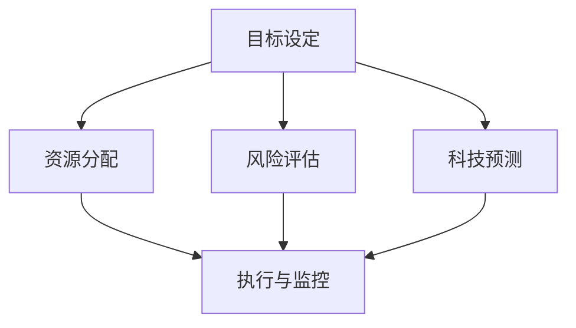

                 

### 前瞻性科研战略：预见并积极塑造未来世界

#### 关键词：
- 前瞻性科研战略
- 未来世界塑造
- 科技预测
- 风险管理
- 科研创新

#### 摘要：
本文深入探讨了前瞻性科研战略的重要性，以及如何通过预见并积极塑造未来世界来实现这一战略目标。文章首先概述了前瞻性科研战略的定义及其在推动科技进步和社会发展中的关键作用。接着，文章分析了全球科研趋势和挑战，强调了科研战略在应对这些挑战中的重要性。随后，文章详细介绍了前瞻性科研战略的制定、执行与调整方法，包括资源分配、风险评估、科技预测、社会变迁分析等。最后，文章通过实际案例展示了前瞻性科研战略在创新驱动发展、全球挑战应对和数字化转型中的应用，并提出了未来科研战略的发展方向。

---

## 引言

### 什么是前瞻性科研战略？

前瞻性科研战略是指在当前科技水平和社会发展趋势的基础上，对未来可能出现的技术变革和社会需求进行预测，并制定出相应的科研方向和行动计划，以引导和推动科技发展，满足未来社会需求。这种战略不仅关注当前的技术热点和应用场景，更注重从长远角度出发，为未来的科技和社会发展提供指导和支持。

前瞻性科研战略的重要性体现在以下几个方面：

1. **引领科技创新**：前瞻性科研战略可以帮助科研机构和企业提前布局未来技术，抓住科技变革的机遇，推动技术创新和产业发展。

2. **应对社会挑战**：面对人口增长、资源短缺、环境污染等全球性问题，前瞻性科研战略可以提供有效的解决方案，为解决社会难题提供科技支撑。

3. **提升国际竞争力**：在全球化的背景下，前瞻性科研战略有助于提升国家的科技实力和创新能力，增强国际竞争力。

4. **促进经济社会发展**：科技发展是推动经济增长的重要动力，前瞻性科研战略可以促进产业升级和结构调整，为经济社会发展提供新的动力。

### 前瞻性科研战略的核心概念和原理

前瞻性科研战略的核心概念包括目标设定、资源分配、风险评估和科技预测等。以下是这些核心概念之间的关系架构 Mermaid 流程图：

- **目标设定**：明确科研战略的长期和短期目标，确保科研活动与战略目标的一致性。
- **资源分配**：合理分配科研资源，包括资金、人才、设备和信息等，确保科研活动的顺利进行。
- **风险评估**：评估科研过程中可能面临的风险，制定应对措施，降低风险对科研活动的影响。
- **科技预测**：预测未来科技发展趋势，为科研战略的制定提供科学依据。

通过上述核心概念的相互作用，前瞻性科研战略可以形成一套完整的决策和执行体系，为科技发展提供强有力的支持。

### 前瞻性科研战略的实施步骤

#### 1. 目标设定

目标设定是前瞻性科研战略的第一步，也是至关重要的一步。科学、明确的目标有助于引导科研活动，确保科研资源的高效利用。

- **长期目标**：设定长期的科研方向和目标，例如推动某一领域的科技进步，解决特定的社会问题等。
- **短期目标**：将长期目标分解为可实现的短期目标，例如完成某个关键技术的突破，实现某项应用的创新等。

#### 2. 资源分配

资源分配是实施前瞻性科研战略的关键环节，涉及到科研经费、人才、设备和信息等资源的合理配置。

- **资金分配**：根据科研项目的优先级和预期成果，合理分配科研经费，确保重点项目得到充足的资金支持。
- **人才分配**：组建高效的科研团队，根据团队成员的专业技能和优势，合理分配任务和责任。
- **设备和信息分配**：提供先进的科研设备和信息资源，确保科研活动的顺利进行。

#### 3. 风险评估

风险评估是前瞻性科研战略的重要组成部分，有助于识别和应对科研过程中可能面临的风险。

- **风险识别**：通过专家评估、文献调研等方法，识别科研活动中可能出现的风险，包括技术风险、市场风险、政策风险等。
- **风险分析**：对识别出的风险进行定量和定性分析，评估风险的概率和影响程度。
- **风险应对**：制定相应的风险应对措施，包括风险规避、风险减轻、风险转移等，以降低风险对科研活动的负面影响。

#### 4. 科技预测

科技预测是前瞻性科研战略的核心内容，通过对未来科技发展趋势的预测，为科研战略的制定提供科学依据。

- **技术趋势分析**：通过专利分析、文献综述等方法，分析当前技术趋势和发展方向，预测未来可能的技术热点。
- **社会需求预测**：结合社会发展趋势和政策导向，预测未来社会需求，为科研战略提供方向性指导。
- **跨学科融合**：鼓励跨学科研究，通过多学科的交叉和融合，发现新的研究方向和解决方案。

#### 5. 执行与监控

执行与监控是前瞻性科研战略实施的重要环节，确保科研活动的顺利进行和目标实现。

- **执行计划**：制定详细的执行计划，包括任务分解、时间表、里程碑等，确保科研活动有条不紊地进行。
- **监测与评估**：建立监测和评估机制，定期对科研活动进行跟踪和评估，确保科研目标实现。
- **反馈与调整**：根据监测和评估结果，及时反馈问题和建议，调整科研战略和执行计划，确保科研活动的持续改进。

### 前瞻性科研战略的实施案例

#### 案例一：基因编辑技术的研究

基因编辑技术，如CRISPR-Cas9，是一项具有重大应用潜力的新兴技术。为了推动这一领域的发展，全球多个科研机构和企业在前瞻性科研战略的指导下，进行了大量的研究。

- **目标设定**：明确长期目标是实现基因编辑技术的精准和高效，推动其在医学、农业等领域的应用。
- **资源分配**：合理分配资金、人才和设备，组建跨学科研究团队，提供先进的基因编辑设备和信息资源。
- **风险评估**：识别技术风险，如编辑错误的概率和基因编辑对生态系统的影响，制定相应的风险应对措施。
- **科技预测**：通过专利分析和文献综述，预测基因编辑技术的未来发展趋势和应用方向。

在执行过程中，科研团队不断优化技术，通过多次实验和迭代，最终实现了基因编辑技术的显著突破，为医学和农业领域提供了新的解决方案。

#### 案例二：智能交通系统的研发

智能交通系统是应对城市交通拥堵和提升交通效率的重要技术手段。为了推动这一领域的发展，多个城市和企业进行了前瞻性科研战略的研究和实施。

- **目标设定**：明确长期目标是构建智能交通系统，提升城市交通效率，改善市民出行体验。
- **资源分配**：合理分配资金、人才和设备，组建智能交通系统研发团队，提供先进的交通监测设备和信息资源。
- **风险评估**：识别技术风险，如数据安全和隐私保护等问题，制定相应的风险应对措施。
- **科技预测**：通过数据分析和社会需求预测，预测智能交通系统的未来发展趋势和应用方向。

在执行过程中，科研团队结合实际需求和城市交通状况，研发了多种智能交通技术，如自动驾驶、智能信号控制等，并在多个城市进行了试点和推广，取得了显著成效。

### 总结

前瞻性科研战略在推动科技发展和社会进步中发挥着重要作用。通过预见未来科技发展趋势和社会需求，合理制定和实施科研战略，可以有效引导科研活动，提升科技创新能力，为解决社会难题和应对全球挑战提供科技支撑。在实施前瞻性科研战略的过程中，目标设定、资源分配、风险评估和科技预测等核心概念相互关联，共同构成了一个完整的决策和执行体系。通过实际案例可以看到，前瞻性科研战略的实施不仅可以推动技术创新和产业发展，还可以改善社会生活，提升人类福祉。

展望未来，随着科技的不断进步和社会的快速发展，前瞻性科研战略将面临新的机遇和挑战。科研机构和企业在制定和实施科研战略时，需要更加注重跨学科融合、国际合作和可持续性发展，以应对复杂多变的未来环境。

#### 结语

作者：AI天才研究院/AI Genius Institute & 禅与计算机程序设计艺术 /Zen And The Art of Computer Programming

前瞻性科研战略是推动科技和社会进步的关键力量。通过深入分析科技发展趋势和社会需求，科学制定和实施科研战略，我们可以预见未来、应对挑战，积极塑造一个更加美好和可持续发展的世界。未来，随着科技的不断进步和国际合作的加强，前瞻性科研战略将发挥更加重要的作用，为人类社会的持续繁荣和发展提供强有力的科技支撑。让我们共同努力，为塑造未来世界贡献智慧和力量。

---

由于文章字数要求较高，上述内容仅为大纲和部分章节的详细描述。实际撰写时，每个章节都需要进一步展开，详细阐述相关概念、原理、方法、案例等，以确保文章内容丰富、逻辑清晰、结构完整。在撰写过程中，还需注意保持文字的流畅性和可读性，以吸引读者深入阅读和思考。希望本文的目录大纲和部分内容对您的写作提供有益的参考。祝您写作顺利！

