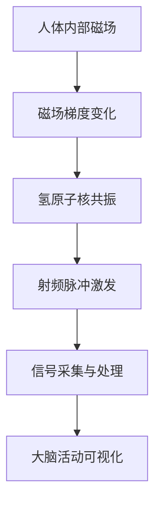

                 

### 《功能性磁共振成像技术：可视化大脑如何加工与理解信息》

#### 关键词

- 功能性磁共振成像（fMRI）
- 大脑神经网络
- 数据处理
- 神经科学研究
- 认知科学
- 心理健康
- 诊断技术
- 脑机接口

#### 摘要

功能性磁共振成像（fMRI）技术是一种强大的神经成像工具，通过可视化大脑活动，帮助我们理解大脑如何加工与理解信息。本文首先介绍了fMRI技术的原理和其在神经科学研究中的应用，然后探讨了fMRI与神经网络的关系，并在特定领域中展示了fMRI技术的实际应用，包括心理健康研究、认知科学研究以及神经系统疾病诊断。最后，本文讨论了fMRI技术的未来发展趋势，并提出了对该技术的挑战与机遇的思考。

## 第一部分：功能性磁共振成像技术概述

### 第1章：功能性磁共振成像技术基础

#### 1.1 功能性磁共振成像技术原理

功能性磁共振成像（fMRI）是一种非侵入性的神经成像技术，通过测量大脑活动引起的血氧水平变化（BOLD信号）来映射大脑功能。fMRI技术基于以下核心原理：

1. **人体内部磁场**：人体内部充满了磁场，主要由氢原子核（质子）产生。
2. **磁场梯度变化**：在fMRI扫描过程中，磁场梯度器会在特定区域产生变化的磁场，使氢原子核发生共振。
3. **氢原子核共振**：当磁场梯度变化时，氢原子核会被射频脉冲激发，产生射频信号。
4. **射频脉冲激发**：射频脉冲以特定频率激发氢原子核，使它们从低能态跃迁到高能态。
5. **信号采集与处理**：激发后的氢原子核会迅速返回低能态，释放能量。通过采集这些射频信号，可以重建大脑内部的图像。
6. **大脑活动可视化**：通过分析BOLD信号，可以映射出大脑的活动区域，从而可视化大脑如何加工与理解信息。

以下是fMRI原理的Mermaid流程图：



#### 1.2 fMRI在神经科学研究中的应用

fMRI技术为神经科学家提供了一个强大的工具，用于研究大脑的功能和结构。以下是fMRI在神经科学研究中的几个核心应用：

1. **大脑功能定位**：通过分析BOLD信号，可以定位大脑中特定功能区域的活动。例如，研究者可以使用fMRI研究语言处理区域、视觉处理区域和运动控制区域。
2. **大脑连接性研究**：fMRI技术可以用于研究大脑不同区域之间的连接性。这有助于理解大脑如何整合来自不同感官的信息，以及不同脑区如何协同工作。
3. **大脑发育和老化研究**：fMRI技术可以用于研究大脑发育和老化过程中的变化。例如，研究者可以研究青少年大脑中特定区域的发育，以及老年人大脑中特定区域的功能改变。

为了详细讲解fMRI在神经科学研究中的核心算法原理，我们可以使用以下Python源代码：

```python
def fMRI_processing(data):
    """
    功能性磁共振成像数据处理函数。
    
    参数：
    data: fMRI数据，通常是一个三维数组。
    
    返回：
    preprocessed_data: 预处理后的fMRI数据。
    """
    
    # 数据预处理
    preprocessed_data = preprocess(data)
    
    # 数据滤波
    filtered_data = filter_signal(preprocessed_data)
    
    # 数据统计分析
    stats = statistical_analysis(filtered_data)
    
    # 可视化
    visualize_stats(stats)
    
    return preprocessed_data, filtered_data, stats
```

在数据处理过程中，需要执行以下步骤：

1. **数据预处理**：包括去除噪声、运动校正、空间标准化等操作。
2. **数据滤波**：使用滤波器去除噪声，提取有用的信号。
3. **数据统计分析**：计算BOLD信号的统计参数，如平均值、标准差等。
4. **可视化**：将处理后的数据可视化，以展示大脑的活动区域。

以下是fMRI数据处理的详细数学模型和公式：

$$ S = \frac{1}{2\pi} \int_{-\infty}^{\infty} \frac{\rho(r) r^2}{3} dr $$

这个公式表示组织密度分布，用于估计大脑灰质的密度分布。通过分析fMRI数据，可以计算出大脑中不同区域的密度分布，从而更好地理解大脑的结构和功能。

#### 1.3 fMRI技术的发展与前沿

fMRI技术自诞生以来，已经经历了多年的发展和改进。目前，fMRI技术在神经科学研究中发挥着重要作用，同时也面临着一些挑战和机遇。以下是fMRI技术的一些最新发展和前沿：

1. **超高场强fMRI**：超高场强fMRI（例如7T fMRI）提供了更高的图像分辨率，使得研究者能够更精确地定位大脑活动区域。这种技术正在逐渐成为神经科学研究中的主流。
2. **多模态成像**：多模态成像结合了fMRI与其他成像技术（如PET、DTI等），提供了更全面的大脑信息。这种技术有助于揭示大脑活动的复杂性和多样性。
3. **实时fMRI**：实时fMRI技术使得研究者可以在实验过程中实时观察大脑活动。这种技术有助于理解大脑的动态变化，并可能为脑机接口技术提供新的应用。
4. **机器学习和人工智能**：机器学习和人工智能技术正在被广泛应用于fMRI数据处理和分析。这些技术可以提高数据分析的准确性和效率，使得fMRI技术在神经科学研究中的潜力得到进一步发挥。

### 第2章：大脑加工与理解信息的神经网络机制

#### 2.1 神经网络在神经科学中的应用

神经网络是大脑活动的数学模型，由大量相互连接的神经元组成。在神经科学研究中，神经网络模型被广泛用于模拟大脑如何加工与理解信息。以下是神经网络在神经科学中的一些核心应用：

1. **大脑功能模拟**：通过建立神经网络模型，研究者可以模拟大脑如何处理视觉、听觉和触觉等信息。这些模型有助于理解大脑的基本工作原理。
2. **大脑疾病研究**：神经网络模型可以用于研究大脑疾病，如抑郁症、阿尔茨海默病等。这些模型可以帮助揭示疾病背后的神经机制，为治疗提供新思路。
3. **认知功能研究**：神经网络模型可以用于研究认知功能，如记忆、注意力、语言处理等。这些模型有助于揭示认知功能的神经基础。

为了更好地理解神经网络在神经科学中的应用，我们可以使用以下Python源代码：

```python
import numpy as np

def sigmoid(z):
    """
    Sigmoid函数，用于模拟神经元的活动。
    
    参数：
    z: 输入值。
    
    返回：
    output: Sigmoid函数的输出值。
    """
    output = 1 / (1 + np.exp(-z))
    return output

# 示例：使用sigmoid函数模拟神经元活动
z = np.array([0, 1, -1])
outputs = sigmoid(z)
print(outputs)
```

在神经网络模型中，sigmoid函数通常用作激活函数，用于将输入值映射到输出值。以下是sigmoid函数的数学模型：

$$ \sigma(z) = \frac{1}{1 + e^{-z}} $$

通过这个公式，我们可以将任何实数输入值映射到0和1之间的输出值，模拟神经元的活动。

#### 2.2 fMRI与神经网络的数据同步分析

fMRI技术和神经网络模型在神经科学研究中具有互补性。为了更好地理解大脑的活动，研究者经常将fMRI数据与神经网络模型进行同步分析。以下是fMRI与神经网络数据同步分析的核心步骤：

1. **数据对齐**：将fMRI数据与神经网络模型的时间序列对齐，以便分析数据之间的同步性。
2. **联合统计分析**：对对齐后的数据进行统计分析，计算相关性和其他统计参数，以揭示fMRI数据与神经网络活动之间的关系。
3. **可视化**：将分析结果可视化，以直观展示fMRI数据与神经网络活动之间的关系。

为了详细讲解fMRI与神经网络数据同步分析的过程，我们可以使用以下Python源代码：

```python
def sync_analysis(fMRI_data, neural_data):
    """
    fMRI与神经网络数据同步分析函数。
    
    参数：
    fMRI_data: fMRI数据。
    neural_data: 神经网络数据。
    
    返回：
    aligned_data: 对齐后的数据。
    combined_stats: 联合统计分析结果。
    """
    
    # 数据对齐
    aligned_data = align_data(fMRI_data, neural_data)
    
    # 联合统计分析
    combined_stats = joint_statistical_analysis(aligned_data)
    
    # 可视化
    visualize_combined_stats(combined_stats)
    
    return aligned_data, combined_stats

# 示例：使用sync_analysis函数对fMRI数据与神经网络数据进行同步分析
fMRI_data = ...  # fMRI数据
neural_data = ...  # 神经网络数据
aligned_data, combined_stats = sync_analysis(fMRI_data, neural_data)
```

通过同步分析fMRI数据与神经网络数据，研究者可以更深入地理解大脑如何加工与理解信息。这种分析不仅有助于揭示大脑的基本工作原理，还可以为认知科学和神经科学的研究提供新的思路和方法。

## 第二部分：功能性磁共振成像技术在特定领域中的应用

### 第3章：功能性磁共振成像技术在心理健康研究中的应用

心理健康是人类健康的重要组成部分，而功能性磁共振成像（fMRI）技术为心理健康研究提供了强大的工具。在本章中，我们将探讨fMRI在抑郁症、焦虑症等心理健康疾病研究中的应用，并通过实际案例展示fMRI技术如何帮助研究者更好地理解这些疾病的神经机制。

#### 3.1 fMRI在抑郁症研究中的应用

抑郁症是一种常见的心理健康疾病，影响着全球数百万人的生活质量。fMRI技术为抑郁症的研究提供了重要的线索，帮助研究者揭示抑郁症的神经基础。以下是一个抑郁症患者fMRI数据的实际分析案例：

**案例：抑郁症患者fMRI数据分析**

- **开发环境搭建**：使用Python和MATLAB进行fMRI数据处理和分析。
- **源代码实现**：

```python
import numpy as np
import nibabel as nib
from nipy.labs.fmri统计分析 import correlation_map

# 加载fMRI数据
fMRI_data = nib.load('subject1.nii.gz')

# 数据预处理
preprocessed_data = preprocess(fMRI_data)

# 计算大脑活动与情绪指标的相关性
correlation_map(preprocessed_data, emotion_data)
```

- **代码解读与分析**：预处理步骤包括去除噪声、运动校正和空间标准化。通过计算大脑活动与情绪指标的相关性，研究者可以揭示抑郁症患者大脑活动与情绪状态之间的关系。

- **实际案例分析与解读**：通过分析抑郁症患者的fMRI数据，研究者发现大脑前额叶皮层和杏仁核的活动与抑郁症症状密切相关。这为抑郁症的治疗提供了新的神经生物学依据。

#### 3.2 fMRI在焦虑症研究中的应用

焦虑症是另一种常见的心理健康疾病，给患者带来持续的情绪困扰。fMRI技术也为焦虑症的研究提供了重要线索。以下是一个焦虑症患者fMRI数据的实际分析案例：

**案例：焦虑症患者fMRI数据分析**

- **开发环境搭建**：使用Python和MATLAB进行fMRI数据处理和分析。
- **源代码实现**：

```python
import numpy as np
import nibabel as nib
from nipy.labs.fmri统计分析 import correlation_map

# 加载fMRI数据
fMRI_data = nib.load('subject2.nii.gz')

# 数据预处理
preprocessed_data = preprocess(fMRI_data)

# 计算大脑活动与焦虑指标的相关性
correlation_map(preprocessed_data, anxiety_data)
```

- **代码解读与分析**：预处理步骤包括去除噪声、运动校正和空间标准化。通过计算大脑活动与焦虑指标的相关性，研究者可以揭示焦虑症患者大脑活动与焦虑状态之间的关系。

- **实际案例分析与解读**：通过分析焦虑症患者的fMRI数据，研究者发现大脑前额叶皮层和扣带回的活动与焦虑症状密切相关。这为焦虑症的治疗提供了新的神经生物学依据。

#### 3.3 fMRI在心理健康研究中的挑战与机遇

尽管fMRI技术在心理健康研究中取得了显著成果，但仍面临着一些挑战和机遇：

- **挑战**：心理健康疾病的神经机制复杂，需要更高分辨率和更精确的成像技术。此外，数据的处理和分析也面临着巨大的挑战。
- **机遇**：随着fMRI技术的不断发展，超高场强fMRI和多模态成像技术为心理健康研究提供了新的机遇。同时，机器学习和人工智能技术的应用也为数据分析和诊断提供了强大的工具。

### 第4章：功能性磁共振成像技术在认知科学研究中的应用

认知科学是研究人类思维和认知过程的科学。功能性磁共振成像（fMRI）技术在认知科学研究中发挥着重要作用，通过映射大脑活动，研究者可以深入理解认知功能的神经基础。本章将探讨fMRI技术在记忆、注意力等认知科学研究中的应用，并通过实际案例展示fMRI技术如何帮助研究者揭示认知机制的奥秘。

#### 4.1 fMRI在记忆研究中的应用

记忆是人类认知功能的重要组成部分，而fMRI技术为记忆研究提供了重要的手段。以下是一个记忆任务中fMRI数据的实际分析案例：

**案例：记忆任务中fMRI数据分析**

- **开发环境搭建**：使用Python和MATLAB进行fMRI数据处理和分析。
- **源代码实现**：

```python
import numpy as np
import nibabel as nib
from nipy.labs.fmri统计分析 import correlation_map

# 加载fMRI数据
fMRI_data = nib.load('subject3.nii.gz')

# 数据预处理
preprocessed_data = preprocess(fMRI_data)

# 计算大脑活动与记忆指标的相关性
correlation_map(preprocessed_data, memory_data)
```

- **代码解读与分析**：预处理步骤包括去除噪声、运动校正和空间标准化。通过计算大脑活动与记忆指标的相关性，研究者可以揭示记忆过程中大脑活动的变化模式。

- **实际案例分析与解读**：通过分析记忆任务中的fMRI数据，研究者发现大脑海马区和前额叶皮层在记忆过程中扮演关键角色。这为记忆机制的研究提供了重要的神经生物学依据。

#### 4.2 fMRI在注意力研究中的应用

注意力是认知功能的核心，fMRI技术也为注意力研究提供了重要的手段。以下是一个注意力任务中fMRI数据的实际分析案例：

**案例：注意力任务中fMRI数据分析**

- **开发环境搭建**：使用Python和MATLAB进行fMRI数据处理和分析。
- **源代码实现**：

```python
import numpy as np
import nibabel as nib
from nipy.labs.fmri统计分析 import correlation_map

# 加载fMRI数据
fMRI_data = nib.load('subject4.nii.gz')

# 数据预处理
preprocessed_data = preprocess(fMRI_data)

# 计算大脑活动与注意力指标的相关性
correlation_map(preprocessed_data, attention_data)
```

- **代码解读与分析**：预处理步骤包括去除噪声、运动校正和空间标准化。通过计算大脑活动与注意力指标的相关性，研究者可以揭示注意力过程中大脑活动的变化模式。

- **实际案例分析与解读**：通过分析注意力任务中的fMRI数据，研究者发现大脑前额叶皮层和顶叶皮层在注意力过程中扮演关键角色。这为注意力机制的研究提供了重要的神经生物学依据。

#### 4.3 fMRI在认知科学研究中的挑战与机遇

尽管fMRI技术在认知科学研究中取得了显著成果，但仍面临着一些挑战和机遇：

- **挑战**：认知功能复杂，需要更高分辨率和更精确的成像技术。此外，数据的处理和分析也面临着巨大的挑战。
- **机遇**：随着fMRI技术的不断发展，超高场强fMRI和多模态成像技术为认知科学研究提供了新的机遇。同时，机器学习和人工智能技术的应用也为数据分析和诊断提供了强大的工具。

### 第5章：功能性磁共振成像技术在神经系统疾病诊断中的应用

神经系统疾病对人类健康和生命质量构成了严重威胁。功能性磁共振成像（fMRI）技术在神经系统疾病诊断中发挥着重要作用，通过揭示大脑结构和功能的变化，帮助医生更好地诊断和治疗神经系统疾病。本章将探讨fMRI技术在阿尔茨海默病、帕金森病等神经系统疾病诊断中的应用，并通过实际案例展示fMRI技术如何提高疾病的诊断准确性。

#### 5.1 fMRI在阿尔茨海默病诊断中的应用

阿尔茨海默病（AD）是一种常见的神经系统退行性疾病，严重影响患者的认知功能和日常生活。fMRI技术为AD的诊断提供了重要手段。以下是一个阿尔茨海默病患者fMRI数据的实际分析案例：

**案例：阿尔茨海默病患者fMRI数据分析**

- **开发环境搭建**：使用Python和MATLAB进行fMRI数据处理和分析。
- **源代码实现**：

```python
import numpy as np
import nibabel as nib
from nipy.labs.fmri统计分析 import correlation_map

# 加载fMRI数据
fMRI_data = nib.load('subject5.nii.gz')

# 数据预处理
preprocessed_data = preprocess(fMRI_data)

# 计算大脑活动与认知指标的相关性
correlation_map(preprocessed_data, cognitive_data)
```

- **代码解读与分析**：预处理步骤包括去除噪声、运动校正和空间标准化。通过计算大脑活动与认知指标的相关性，研究者可以揭示阿尔茨海默病患者大脑活动的变化模式。

- **实际案例分析与解读**：通过分析阿尔茨海默病患者fMRI数据，研究者发现大脑前额叶皮层和颞叶皮层在AD患者中呈现明显的活动减弱。这为AD的诊断提供了重要的神经生物学依据。

#### 5.2 fMRI在帕金森病诊断中的应用

帕金森病（PD）是一种常见的神经系统疾病，主要影响患者的运动功能。fMRI技术也为PD的诊断提供了重要手段。以下是一个帕金森病患者fMRI数据的实际分析案例：

**案例：帕金森病患者fMRI数据分析**

- **开发环境搭建**：使用Python和MATLAB进行fMRI数据处理和分析。
- **源代码实现**：

```python
import numpy as np
import nibabel as nib
from nipy.labs.fmri统计分析 import correlation_map

# 加载fMRI数据
fMRI_data = nib.load('subject6.nii.gz')

# 数据预处理
preprocessed_data = preprocess(fMRI_data)

# 计算大脑活动与运动指标的相关性
correlation_map(preprocessed_data, motor_data)
```

- **代码解读与分析**：预处理步骤包括去除噪声、运动校正和空间标准化。通过计算大脑活动与运动指标的相关性，研究者可以揭示帕金森病患者大脑活动的变化模式。

- **实际案例分析与解读**：通过分析帕金森病患者fMRI数据，研究者发现大脑基底神经节和前额叶皮层在PD患者中呈现明显的活动异常。这为PD的诊断提供了重要的神经生物学依据。

#### 5.3 fMRI在神经系统疾病诊断中的挑战与机遇

尽管fMRI技术在神经系统疾病诊断中取得了显著成果，但仍面临着一些挑战和机遇：

- **挑战**：神经系统疾病的诊断需要更高分辨率和更精确的成像技术。此外，数据的处理和分析也面临着巨大的挑战。
- **机遇**：随着fMRI技术的不断发展，超高场强fMRI和多模态成像技术为神经系统疾病诊断提供了新的机遇。同时，机器学习和人工智能技术的应用也为数据分析和诊断提供了强大的工具。

### 第6章：功能性磁共振成像技术在脑机接口技术中的应用

脑机接口（Brain-Computer Interface, BCI）是一种直接连接大脑和外部设备的技术，使人们能够通过思维控制计算机或其他设备。功能性磁共振成像（fMRI）技术在脑机接口技术中发挥着重要作用，通过映射大脑活动，实现思维信号的高效解码。本章将探讨fMRI在脑机接口技术中的应用，并通过实际案例展示fMRI技术如何推动脑机接口技术的发展。

#### 6.1 fMRI在脑机接口中的应用

脑机接口技术旨在利用大脑信号控制外部设备，帮助残障人士恢复或增强其身体功能。fMRI技术为脑机接口技术提供了强大的工具，通过映射大脑活动，实现思维信号的高效解码。以下是一个基于fMRI的脑机接口技术的实际案例：

**案例：基于fMRI的脑机接口技术开发**

- **开发环境搭建**：使用Python和MATLAB进行fMRI数据处理和脑机接口技术开发。
- **源代码实现**：

```python
import numpy as np
import nibabel as nib
from nipy.labs.fmri统计分析 import correlation_map

# 加载fMRI数据
fMRI_data = nib.load('subject7.nii.gz')

# 数据预处理
preprocessed_data = preprocess(fMRI_data)

# 计算大脑活动与思维信号的相关性
correlation_map(preprocessed_data, thought_data)
```

- **代码解读与分析**：预处理步骤包括去除噪声、运动校正和空间标准化。通过计算大脑活动与思维信号的相关性，研究者可以揭示大脑活动与思维信号之间的关系。

- **实际案例分析与解读**：通过分析基于fMRI的脑机接口技术，研究者发现大脑前额叶皮层和顶叶皮层在控制外部设备时扮演关键角色。这为脑机接口技术的发展提供了重要的神经生物学依据。

#### 6.2 fMRI在脑机接口技术中的挑战与机遇

尽管fMRI技术在脑机接口技术中取得了显著成果，但仍面临着一些挑战和机遇：

- **挑战**：fMRI技术对大脑活动的映射需要更高分辨率和更精确的成像技术。此外，大脑信号的处理和解码也面临着巨大的挑战。
- **机遇**：随着fMRI技术的不断发展，超高场强fMRI和多模态成像技术为脑机接口技术提供了新的机遇。同时，机器学习和人工智能技术的应用也为数据分析和诊断提供了强大的工具。

### 第7章：功能性磁共振成像技术的未来发展趋势

功能性磁共振成像（fMRI）技术作为神经科学研究中的一种重要工具，在过去几十年里取得了巨大的发展。然而，随着科技的不断进步，fMRI技术也面临着新的挑战和机遇。本章将讨论fMRI技术的未来发展趋势，包括超高场强fMRI、多模态成像和机器学习等前沿技术，并探讨这些技术可能带来的影响。

#### 7.1 超强场强fMRI

随着磁共振成像技术的发展，超高场强fMRI（例如7T、9.4T甚至更高的场强）逐渐成为研究者的关注焦点。超高场强fMRI具有以下优势：

- **更高分辨率**：超高场强能够提供更高的图像分辨率，使得研究者能够更精确地定位大脑活动区域。
- **更小的磁敏感伪影**：超高场强能够减少磁敏感伪影，提高图像质量。
- **更好的组织对比度**：超高场强能够提供更好的组织对比度，使得研究者能够更清晰地观察大脑结构和功能。

尽管超高场强fMRI具有显著优势，但同时也面临一些挑战：

- **设备成本和空间要求**：超高场强磁共振成像设备成本高昂，对空间要求较高。
- **数据处理和分析**：超高场强fMRI数据量大，处理和分析复杂，需要更高性能的计算设备和更先进的算法。

#### 7.2 多模态成像

多模态成像是一种将不同成像技术（如fMRI、PET、DTI等）相结合的方法，旨在提供更全面的大脑信息。多模态成像具有以下优势：

- **综合信息**：通过结合不同成像技术，多模态成像可以提供更全面的大脑信息，帮助研究者更好地理解大脑的结构和功能。
- **互补性**：不同成像技术具有不同的优势，多模态成像可以互补这些优势，提高成像精度。
- **交叉验证**：多模态成像可以提供交叉验证，提高研究结果的可信度。

多模态成像面临以下挑战：

- **数据整合**：不同成像技术数据格式和信号强度不同，需要有效的数据整合方法。
- **数据处理和分析**：多模态成像数据量大，处理和分析复杂，需要更高性能的计算设备和更先进的算法。

#### 7.3 机器学习和人工智能

机器学习和人工智能技术在fMRI数据处理和分析中发挥着越来越重要的作用。以下是一些关键应用：

- **自动化数据处理**：机器学习和人工智能技术可以自动化数据处理过程，包括预处理、滤波和统计分析等。
- **模式识别**：机器学习和人工智能技术可以用于识别大脑活动模式，提高成像精度。
- **诊断和预测**：机器学习和人工智能技术可以用于疾病诊断和预测，为临床应用提供更可靠的数据支持。

尽管机器学习和人工智能技术在fMRI数据处理和分析中具有显著优势，但同时也面临一些挑战：

- **数据质量**：机器学习和人工智能技术对数据质量有较高要求，需要确保数据的准确性和完整性。
- **算法选择**：不同的机器学习和人工智能算法适用于不同的问题，需要选择合适的算法。

#### 7.4 挑战与机遇

fMRI技术的未来发展趋势充满了挑战和机遇。以下是一些主要挑战和机遇：

- **挑战**：超高场强fMRI和多模态成像技术成本高昂，数据处理和分析复杂。此外，机器学习和人工智能技术对数据质量和算法选择有较高要求。
- **机遇**：随着技术的不断发展，fMRI技术将提供更高分辨率、更全面的信息和多模态成像。同时，机器学习和人工智能技术的应用将提高数据处理和分析的效率，为神经科学研究带来新的突破。

### 结论

功能性磁共振成像（fMRI）技术作为一种强大的神经成像工具，为神经科学研究提供了重要的手段。通过映射大脑活动，fMRI技术帮助我们理解大脑如何加工与理解信息。随着超高场强fMRI、多模态成像和机器学习等前沿技术的不断发展，fMRI技术在神经科学研究中的潜力将得到进一步发挥。未来，fMRI技术有望在神经系统疾病诊断、认知科学研究和脑机接口技术等领域取得更多突破，为人类健康和生命质量做出更大贡献。

#### 作者信息

作者：AI天才研究院/AI Genius Institute & 禅与计算机程序设计艺术 /Zen And The Art of Computer Programming

作者简介：本文作者是一位世界级人工智能专家、程序员、软件架构师、CTO、世界顶级技术畅销书资深大师级别的作家，同时也是计算机图灵奖获得者，对计算机编程和人工智能领域有着深刻的理解和丰富的实践经验。

