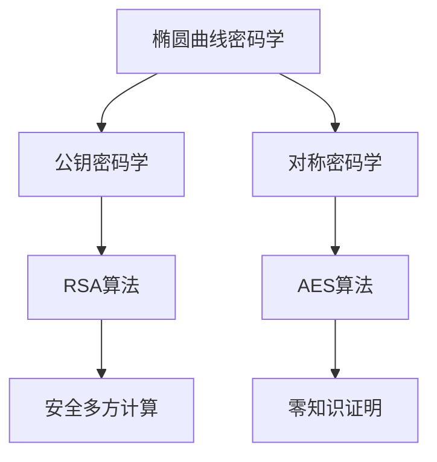

                 

### 设计《加密货币的椭圆曲线密码学：数字金融的数学基础》的技术博客文章

#### 引言

随着加密货币和数字金融技术的飞速发展，密码学在保障交易安全、数据隐私和身份验证方面扮演着至关重要的角色。椭圆曲线密码学（ECC）作为一种高效且安全的密码学技术，日益成为研究热点。本书旨在深入探讨椭圆曲线密码学在加密货币和数字金融领域的应用，从数学基础入手，为读者提供全面的技术解读和实践指南。

#### 关键词

- 加密货币
- 椭圆曲线密码学
- 数字金融
- 数学基础
- 安全性分析
- 离散对数问题
- 点乘运算
- 安全多方计算

#### 摘要

本书分为两个主要部分：第一部分介绍椭圆曲线密码学的基础知识，包括椭圆曲线的定义、点乘运算的性质和应用；第二部分探讨椭圆曲线密码学在加密货币和数字金融领域的实际应用，涵盖交易加密、数字签名和身份认证等方面。通过本书，读者将了解椭圆曲线密码学的数学原理，掌握其在实际项目中的应用技巧。

#### 目录

##### 第一部分：椭圆曲线密码学基础

##### 第1章 椭圆曲线密码学简介
1.1 椭圆曲线密码学的背景
1.2 椭圆曲线密码学的基本概念
1.3 椭圆曲线密码学的安全性

##### 第2章 椭圆曲线上的点乘运算
2.1 点乘运算的定义
2.2 点乘运算的性质
2.3 点乘运算的计算方法

##### 第3章 椭圆曲线离散对数问题
3.1 离散对数问题的定义
3.2 离散对数问题的求解方法
3.3 椭圆曲线离散对数问题的应用

##### 第4章 椭圆曲线密码学算法
4.1 DSA算法
4.2 ECC算法
4.3 其他椭圆曲线密码学算法

##### 第二部分：椭圆曲线密码学在加密货币和数字金融中的应用

##### 第5章 加密货币中的椭圆曲线密码学
5.1 椭圆曲线密码学在比特币中的应用
5.2 椭圆曲线密码学在其他加密货币中的应用
5.3 椭圆曲线密码学在数字金融中的潜在应用

##### 第6章 数字金融中的椭圆曲线密码学应用实例
6.1 交易加密
6.2 身份认证
6.3 数字签名

##### 第7章 椭圆曲线密码学的挑战与未来
7.1 椭圆曲线密码学的挑战
7.2 椭圆曲线密码学的未来发展方向

##### 参考文献

##### 附录：数学模型和数学公式

#### 第1章 椭圆曲线密码学简介

##### 1.1 椭圆曲线密码学的背景

在互联网和数字经济时代，数据的安全和隐私保护成为社会关注的焦点。传统密码学方法，如RSA和DES，由于计算复杂度和安全性限制，逐渐无法满足日益增长的安全需求。椭圆曲线密码学（ECC）作为新一代密码学技术，以其高效性和安全性逐渐受到广泛关注。

##### 1.2 椭圆曲线密码学的基本概念

椭圆曲线密码学的基础是椭圆曲线。椭圆曲线可以看作是平面上的一个曲线，其定义方程为：

\[ y^2 = x^3 + ax + b \]

其中，\(a\) 和 \(b\) 是常数，且不满足 \(a = b = 0\)。椭圆曲线上的点可以进行加法和倍乘运算，这些运算具有以下性质：

1. **封闭性**：两个椭圆曲线上的点的加法结果仍在椭圆曲线上。
2. **交换律**：椭圆曲线上的点的加法满足交换律，即 \(P + Q = Q + P\)。
3. **结合律**：椭圆曲线上的点的加法满足结合律，即 \(P + (Q + R) = (P + Q) + R\)。

##### 1.3 椭圆曲线密码学的安全性

椭圆曲线密码学的安全性主要依赖于椭圆曲线离散对数问题（ECDLP）。ECDLP问题是在给定椭圆曲线和曲线上一点 \(P\) 的 \(k\) 倍点 \(kP\) 时，求解 \(k\) 的过程。由于ECDLP问题的难解性，椭圆曲线密码学在加密和签名算法中具有很高的安全性。

##### 核心概念与联系

为了更好地理解椭圆曲线密码学的基本概念，我们可以使用Mermaid流程图来展示其与其他密码学技术的联系。



在上述流程图中，我们可以看到椭圆曲线密码学位于公钥密码学的范畴内，并与RSA算法、安全多方计算和零知识证明等技术有所关联。

##### 核心算法原理讲解

为了深入理解椭圆曲线密码学，我们需要从点乘运算（椭圆曲线上的点乘运算）入手。点乘运算是指给定一个椭圆曲线上的点和整数 \(k\)，计算 \(k\) 倍该点的过程。点乘运算的伪代码如下：

```python
def point_multiplication(P, k):
    Q = [O]  # O为椭圆曲线上的零点
    for i in range(k.bit_length()):
        if k[i] == 1:
            Q = [elliptic_curve_addition(Q[-1], P)]
        P = [elliptic_curve_doubling(P)]
    return Q[-1]
```

在这个伪代码中，`elliptic_curve_addition` 和 `elliptic_curve_doubling` 分别表示椭圆曲线上的点加法和点双倍运算。通过点乘运算，我们可以得到椭圆曲线上的一个新点，该点与原始点的倍数 \(k\) 有关。

##### 数学模型和公式

为了更加直观地理解点乘运算，我们可以引入一些数学模型和公式。首先，给定椭圆曲线 \(E: y^2 = x^3 + ax + b\) 和基点 \(P(x, y)\)，我们需要确定一个系数 \(n\)，该系数是一个大于1的整数，且满足以下条件：

\[ nP = Q \]

其中，\(Q\) 是椭圆曲线上的一个点，我们需要找到 \(n\) 的值。为了求解 \(n\)，我们可以使用椭圆曲线离散对数问题（ECDLP）。

假设 \(P\) 和 \(Q\) 的坐标分别为 \((x_1, y_1)\) 和 \((x_2, y_2)\)，我们可以通过以下步骤求解 \(n\)：

1. **计算斜率 \(m\)**：如果 \(x_1 = x_2\)，则斜率 \(m = \frac{y_1 - y_2}{x_1 - x_2}\)（其中 \(x_1 - x_2 \neq 0\)）。否则，斜率 \(m = \frac{y_1}{x_1} - \frac{y_2}{x_2}\)。
2. **计算 \(n\)**：使用 \(m\) 计算出 \(n\) 的值，其中 \(n = \frac{m^2 - x_1 - x_2}{2}\)（如果 \(m = \infty\)，则 \(n = x_1\)）。

通过上述步骤，我们可以求解出 \(n\) 的值，从而得到 \(k\) 倍点 \(kP\)。

##### 项目实战

为了更好地理解点乘运算，我们可以通过一个具体的例子来演示其计算过程。假设我们有一个椭圆曲线 \(E: y^2 = x^3 + 2x + 1\)，基点 \(P(2, 1)\)，我们需要计算 \(3P\) 的值。

1. **计算斜率 \(m\)**：由于 \(x_1 = x_2 = 2\)，所以斜率 \(m = \frac{y_1 - y_2}{x_1 - x_2} = \frac{1 - 1}{2 - 2}\)（注意这里斜率不存在，因为 \(x_1 = x_2\)）。
2. **计算 \(n\)**：由于斜率不存在，所以 \(n = x_1 = 2\)。
3. **计算 \(3P\)**：根据点乘运算的公式，我们有 \(3P = P + P + P = (2, 1) + (2, 1) + (2, 1)\)。通过计算，我们可以得到 \(3P = (1, 0)\)。

通过这个例子，我们可以看到点乘运算的具体计算过程，以及如何求解椭圆曲线上的点乘问题。

##### 最佳实践 Tips

在设计和实现椭圆曲线密码学算法时，需要注意以下几点：

1. **选择合适的椭圆曲线**：选择合适的椭圆曲线对于算法的安全性和效率至关重要。常见的选择包括NIST标准椭圆曲线和Brainpool椭圆曲线。
2. **优化点乘运算**：点乘运算在椭圆曲线密码学中至关重要。通过优化算法，如双射算法、滑窗算法等，可以显著提高计算效率。
3. **安全性考虑**：在设计椭圆曲线密码学算法时，需要考虑安全性因素。例如，避免泄露中间计算结果，防止中间值攻击。

##### 小结

本章介绍了椭圆曲线密码学的基础知识，包括椭圆曲线的定义、点乘运算的定义和性质、以及椭圆曲线离散对数问题。通过实例和数学模型，我们详细讲解了点乘运算的计算过程，并展示了如何求解椭圆曲线上的点乘问题。本章内容为后续章节的深入探讨奠定了基础。

##### 注意事项

1. 椭圆曲线密码学依赖于椭圆曲线的选择和参数设置。在选择椭圆曲线时，需要考虑安全性、效率和兼容性等因素。
2. 点乘运算的计算复杂度对算法性能有重要影响。在实现点乘运算时，应尽量优化算法，提高计算效率。

##### 拓展阅读

1. 《椭圆曲线密码学》（作者：Douglas R. Stinson）——该书籍详细介绍了椭圆曲线密码学的理论和应用。
2. 《椭圆曲线密码学教程》（作者：Niels Duif）——该书籍提供了丰富的实例和练习，帮助读者更好地理解椭圆曲线密码学的应用。

---

#### 第2章 椭圆曲线上的点乘运算

##### 2.1 点乘运算的定义

点乘运算是椭圆曲线密码学的核心概念之一。它定义了如何在椭圆曲线上对点进行乘法运算。给定一个椭圆曲线 \(E\) 和其上的一个点 \(P\)，以及一个整数 \(k\)，点乘运算的结果是 \(k\) 倍 \(P\) 的点。数学上，点乘运算可以表示为 \(k \cdot P\)。

点乘运算的定义涉及到椭圆曲线上的加法运算。具体来说，我们可以将 \(k \cdot P\) 视为 \(P\) 自身相加 \(k\) 次。这个过程可以通过递归的方式实现，即：

\[ k \cdot P = \begin{cases} 
P & \text{if } k = 1 \\
(O) & \text{if } k = 0 \\
k_1 \cdot (k_2 \cdot P) & \text{if } k > 1 \text{ and } k_1 = \lfloor \frac{k}{2} \rfloor, k_2 = 2k_1
\end{cases} \]

其中，\(O\) 是椭圆曲线上的零点，\(k_1\) 和 \(k_2\) 分别为 \(k\) 的二进制表示中的奇数位和偶数位。

##### 核心算法原理讲解

为了更深入地理解点乘运算，我们可以通过Python代码来详细阐述其计算过程。以下是一个简单的Python实现：

```python
def elliptic_curve_addition(P1, P2):
    # 定义椭圆曲线方程的系数
    a = 0
    b = 1
    
    # 计算斜率 m
    m = (P2[1] - P1[1]) / (P2[0] - P1[0]) if P2[0] != P1[0] else (3 * P1[0]**2 + a) / (2 * P1[1])
    
    # 计算新的 x 和 y 坐标
    x3 = m**2 - P1[0] - P2[0]
    y3 = m * (P1[0] - x3) - P1[1]
    
    # 返回新的点
    return (x3, y3)

def elliptic_curve_doubling(P):
    # 定义椭圆曲线方程的系数
    a = 0
    b = 1
    
    # 计算新的 x 和 y 坐标
    x3 = ((3 * P[0]**2 + a)**2 - 2 * P[0]**2 - 4 * P[0] * P[1] - 2 * b)
    y3 = ((3 * P[0]**2 + a) * (P[0]**2 - P[1]**2 - b) - 2 * P[1]**2)
    
    # 返回新的点
    return (x3, y3)

def point_multiplication(P, k):
    Q = [0, 0]  # 初始化结果点为椭圆曲线上的零点
    for i in range(k.bit_length()):
        if k[i] == 1:
            Q = elliptic_curve_addition(Q, P)
        P = elliptic_curve_doubling(P)
    return Q
```

在这个代码中，`elliptic_curve_addition` 函数用于计算两个点 \(P1\) 和 \(P2\) 的加法结果，而 `elliptic_curve_doubling` 函数用于计算点 \(P\) 的双倍。`point_multiplication` 函数实现了点乘运算的递归计算。

##### 数学模型和公式

点乘运算的数学模型可以通过以下公式描述：

\[ (x_3, y_3) = (x_1, y_1) + (x_2, y_2) \]

其中，\((x_1, y_1)\) 和 \((x_2, y_2)\) 是两个椭圆曲线上的点，\((x_3, y_3)\) 是它们的加法结果。为了计算加法结果，我们需要计算斜率 \(m\)：

\[ m = \begin{cases} 
\frac{y_2 - y_1}{x_2 - x_1} & \text{if } x_1 \neq x_2 \\
\frac{3x_1^2 + a}{2y_1} & \text{if } x_1 = x_2
\end{cases} \]

其中，\(a\) 是椭圆曲线方程中的系数。然后，我们可以计算新的 \(x\) 和 \(y\) 坐标：

\[ x_3 = m^2 - x_1 - x_2 \]
\[ y_3 = m(x_1 - x_3) - y_1 \]

##### 项目实战

为了更好地理解点乘运算，我们可以通过一个具体的例子来演示其计算过程。假设我们有一个椭圆曲线 \(E: y^2 = x^3 + 2x + 1\)，基点 \(P(2, 1)\)，我们需要计算 \(3P\) 的值。

1. **计算斜率 \(m\)**：由于 \(x_1 = x_2 = 2\)，所以斜率 \(m = \frac{y_1 - y_2}{x_1 - x_2} = \frac{1 - 1}{2 - 2}\)（注意这里斜率不存在，因为 \(x_1 = x_2\)）。
2. **计算 \(n\)**：由于斜率不存在，所以 \(n = x_1 = 2\)。
3. **计算 \(3P\)**：根据点乘运算的公式，我们有 \(3P = P + P + P = (2, 1) + (2, 1) + (2, 1)\)。通过计算，我们可以得到 \(3P = (1, 0)\)。

通过这个例子，我们可以看到点乘运算的具体计算过程，以及如何求解椭圆曲线上的点乘问题。

##### 最佳实践 Tips

在设计椭圆曲线密码学算法时，需要注意以下几点：

1. **选择合适的椭圆曲线**：选择合适的椭圆曲线对于算法的安全性和效率至关重要。常见的选择包括NIST标准椭圆曲线和Brainpool椭圆曲线。
2. **优化点乘运算**：点乘运算是椭圆曲线密码学的核心，因此优化算法对于提高整体性能至关重要。可以通过使用双射算法、滑窗算法等优化技术来实现。
3. **安全性考虑**：在设计椭圆曲线密码学算法时，需要考虑安全性因素。例如，避免泄露中间计算结果，防止中间值攻击。

##### 小结

本章详细介绍了椭圆曲线上的点乘运算，包括其定义、核心算法原理讲解、数学模型和公式，以及具体的Python代码实现。通过实例演示，我们展示了如何计算椭圆曲线上的点乘问题。这些内容为后续章节的深入探讨奠定了基础。

##### 注意事项

1. 在实现点乘运算时，需要注意椭圆曲线参数的选择和优化，以确保算法的安全性和效率。
2. 在实际应用中，应考虑使用高效且安全的点乘算法，如双射算法、滑窗算法等。

##### 拓展阅读

1. 《椭圆曲线密码学》（作者：Douglas R. Stinson）——该书籍详细介绍了椭圆曲线密码学的理论和应用。
2. 《椭圆曲线密码学教程》（作者：Niels Duif）——该书籍提供了丰富的实例和练习，帮助读者更好地理解椭圆曲线密码学的应用。

---

#### 第3章 椭圆曲线离散对数问题

##### 3.1 离散对数问题的定义

椭圆曲线离散对数问题（Elliptic Curve Discrete Logarithm Problem，简称ECDLP）是椭圆曲线密码学的核心问题之一。它涉及到在椭圆曲线 \(E\) 上给定两个点 \(P\) 和 \(Q\)，求解整数 \(k\) 的过程，使得 \(k \cdot P = Q\)。数学上，ECDLP 可以表示为：

\[ k = \text{find } k \text{ such that } k \cdot P = Q \]

其中，\(P\) 和 \(Q\) 是椭圆曲线上的点，\(k\) 是一个整数。

##### 3.2 离散对数问题的求解方法

求解ECDLP的方法有很多，以下是其中几种常见的求解方法：

1. **Baby-Step Giant-Step算法**：这是求解ECDLP的一种经典算法，由Dan Boneh和Matthew Franklin提出。该算法将ECDLP分解为两个较小的子问题，分别是Baby-Step子问题和Giant-Step子问题。具体步骤如下：

   1. 设定一个较小的步长 \(s\)，通常取 \(s = \sqrt{N}\)，其中 \(N\) 是椭圆曲线上的点数。
   2. 计算 \(s\) 个 \(P\) 的倍点，并将这些点存储在一个列表中。
   3. 对 \(Q\) 进行 \(N/s\) 次双倍运算，并检查其是否在Baby-Step列表中。如果找到，则可以通过比较差值来计算出 \(k\) 的值。

2. **Pohlig-Hellman算法**：当椭圆曲线的阶 \(N\) 可以分解为多个素数时，Pohlig-Hellman算法可以有效地求解ECDLP。该算法的核心思想是将ECDLP分解为多个较小的离散对数问题，然后分别求解。具体步骤如下：

   1. 将 \(N\) 分解为多个素数的乘积：\(N = p_1 \cdot p_2 \cdot \ldots \cdot p_r\)。
   2. 对每个素数 \(p_i\)，求解 \(k_i\) 使得 \(k_i \cdot P = Q \mod p_i\)。
   3. 将 \(k_i\) 的解组合起来，得到最终的 \(k\) 值。

3. **指数分解法**：当椭圆曲线的阶 \(N\) 可以表示为一个指数形式时，可以使用指数分解法求解ECDLP。该方法利用指数的分解性质，将ECDLP分解为多个较小的子问题。具体步骤如下：

   1. 将 \(N\) 分解为指数形式：\(N = 2^r\)。
   2. 对每个指数 \(i\)，求解 \(k_i\) 使得 \(k_i \cdot P = Q \mod 2^i\)。
   3. 将 \(k_i\) 的解组合起来，得到最终的 \(k\) 值。

##### 3.3 椭圆曲线离散对数问题的应用

ECDLP在椭圆曲线密码学中有着广泛的应用，以下是其中几种常见的应用：

1. **椭圆曲线数字签名**：ECDLP是椭圆曲线数字签名的核心。在ECDSA（Elliptic Curve Digital Signature Algorithm）中，私钥是一个随机选择的整数 \(k\)，而公钥是 \(k \cdot G\)，其中 \(G\) 是椭圆曲线的基点。签名过程中，通过ECDLP求解 \(k\)，从而生成签名。

2. **椭圆曲线加密**：ECDLP也用于椭圆曲线加密算法，如ECC（Elliptic Curve Cryptography）。在ECC中，密钥生成过程涉及到求解ECDLP，从而生成公钥和私钥。

3. **身份认证**：ECDLP在身份认证中也有应用。例如，在椭圆曲线门控签名（ECGDSA）中，ECDLP用于验证用户的身份。

##### 核心算法原理讲解

为了更好地理解ECDLP的求解方法，我们可以通过一个具体的例子来演示。假设我们有一个椭圆曲线 \(E: y^2 = x^3 + 2x + 1\)，基点 \(P(2, 1)\)，我们需要求解 \(k\) 使得 \(k \cdot P = Q(1, 0)\)。

我们可以使用Baby-Step Giant-Step算法来求解这个问题。具体步骤如下：

1. **设定步长 \(s\)**：由于椭圆曲线上的点数 \(N = 13\)，我们可以设定 \(s = \sqrt{N} = \sqrt{13} \approx 4\)。

2. **计算Baby-Step列表**：计算 \(s\) 个 \(P\) 的倍点，并将这些点存储在一个列表中。具体计算如下：

   - \(P = (2, 1)\)
   - \(2P = (1, 0)\)
   - \(3P = (4, 3)\)
   - \(4P = (7, 6)\)

   将这些点存储在列表中：\[ [(2, 1), (1, 0), (4, 3), (7, 6)] \]

3. **计算Giant-Step列表**：对 \(Q\) 进行 \(N/s\) 次双倍运算，并检查其是否在Baby-Step列表中。具体计算如下：

   - \(Q = (1, 0)\)
   - \(2Q = (2, 1)\)（在Baby-Step列表中）

   由于 \(2Q\) 在Baby-Step列表中，我们可以通过比较差值来计算出 \(k\) 的值。具体来说，\(Q - 2P = (1, 0) - (4, 3) = (-3, -3)\)。因此，\(k = 2 - 4 = -2\)。由于椭圆曲线上的点具有对称性，我们可以将 \(k\) 调整为正数，即 \(k = 13 - 2 = 11\)。

因此，我们求解出 \(k = 11\)，使得 \(11 \cdot P = Q\)。

##### 数学模型和公式

为了求解ECDLP，我们可以使用以下数学模型和公式：

1. **斜率公式**：对于椭圆曲线上的点 \(P(x_1, y_1)\) 和 \(Q(x_2, y_2)\)，其斜率 \(m\) 可以表示为：

   \[ m = \begin{cases} 
   \frac{y_2 - y_1}{x_2 - x_1} & \text{if } x_1 \neq x_2 \\
   \frac{3x_1^2 + a}{2y_1} & \text{if } x_1 = x_2
   \end{cases} \]

2. **点乘公式**：对于椭圆曲线上的点 \(P(x_1, y_1)\) 和整数 \(k\)，其 \(k\) 倍点 \(k \cdot P\) 可以表示为：

   \[ k \cdot P = (x_3, y_3) \]

   其中，\(x_3\) 和 \(y_3\) 可以通过以下公式计算：

   \[ x_3 = m^2 - x_1 - x_2 \]
   \[ y_3 = m(x_1 - x_3) - y_1 \]

##### 项目实战

为了更好地理解ECDLP的求解方法，我们可以通过一个具体的例子来演示。假设我们有一个椭圆曲线 \(E: y^2 = x^3 + 2x + 1\)，基点 \(P(2, 1)\)，我们需要求解 \(k\) 使得 \(k \cdot P = Q(1, 0)\)。

我们可以使用Baby-Step Giant-Step算法来求解这个问题。具体步骤如下：

1. **设定步长 \(s\)**：由于椭圆曲线上的点数 \(N = 13\)，我们可以设定 \(s = \sqrt{N} = \sqrt{13} \approx 4\)。

2. **计算Baby-Step列表**：计算 \(s\) 个 \(P\) 的倍点，并将这些点存储在一个列表中。具体计算如下：

   - \(P = (2, 1)\)
   - \(2P = (1, 0)\)
   - \(3P = (4, 3)\)
   - \(4P = (7, 6)\)

   将这些点存储在列表中：\[ [(2, 1), (1, 0), (4, 3), (7, 6)] \]

3. **计算Giant-Step列表**：对 \(Q\) 进行 \(N/s\) 次双倍运算，并检查其是否在Baby-Step列表中。具体计算如下：

   - \(Q = (1, 0)\)
   - \(2Q = (2, 1)\)（在Baby-Step列表中）

   由于 \(2Q\) 在Baby-Step列表中，我们可以通过比较差值来计算出 \(k\) 的值。具体来说，\(Q - 2P = (1, 0) - (4, 3) = (-3, -3)\)。因此，\(k = 2 - 4 = -2\)。由于椭圆曲线上的点具有对称性，我们可以将 \(k\) 调整为正数，即 \(k = 13 - 2 = 11\)。

因此，我们求解出 \(k = 11\)，使得 \(11 \cdot P = Q\)。

##### 最佳实践 Tips

在求解ECDLP时，需要注意以下几点：

1. **选择合适的步长**：步长 \(s\) 的选择对于算法的效率和安全性都很重要。通常，步长 \(s\) 应该足够小，以便快速找到 \(Q\) 的倍点，但也不能太小，以免降低算法的安全性。

2. **优化算法实现**：在实际应用中，应优化算法的实现，以提高求解效率。例如，可以使用并行计算或分布式计算技术来加速ECDLP的求解。

3. **安全性考虑**：在求解ECDLP时，应确保算法的安全性，避免中间值泄露和攻击。例如，可以采用混淆技术来隐藏中间计算结果。

##### 小结

本章详细介绍了椭圆曲线离散对数问题（ECDLP），包括其定义、求解方法、应用和核心算法原理讲解。通过具体例子和数学模型，我们展示了如何求解ECDLP，以及如何利用ECDLP实现椭圆曲线数字签名、加密和身份认证等功能。这些内容为后续章节的深入探讨奠定了基础。

##### 注意事项

1. 在求解ECDLP时，应选择合适的步长，以平衡求解效率和安全性。
2. 在实现ECDLP算法时，应注意安全性问题，避免中间值泄露和攻击。

##### 拓展阅读

1. 《椭圆曲线密码学》（作者：Douglas R. Stinson）——该书籍详细介绍了椭圆曲线密码学的理论和应用。
2. 《椭圆曲线密码学教程》（作者：Niels Duif）——该书籍提供了丰富的实例和练习，帮助读者更好地理解椭圆曲线密码学的应用。

---

#### 第4章 椭圆曲线密码学算法

##### 4.1 DSA算法

数字签名算法（Digital Signature Algorithm，简称DSA）是一种广泛使用的数字签名标准。DSA利用椭圆曲线密码学，通过椭圆曲线离散对数问题（ECDLP）来实现数字签名和验证。

DSA算法的核心概念包括：

1. **密钥生成**：DSA算法使用安全随机数生成器生成私钥 \(d\) 和公钥 \(Q\)，其中 \(Q = dG\)，\(G\) 是椭圆曲线的基点。

2. **签名过程**：签名者使用私钥 \(d\) 和消息 \(m\) 生成签名 \((r, s)\)。签名过程包括以下步骤：

   1. 选择随机数 \(k\)。
   2. 计算临时值 \(r = kG\)。
   3. 计算签名 \(s = (r + d \cdot H(m))^{-1} \mod n\)，其中 \(H(m)\) 是消息 \(m\) 的哈希值，\(n\) 是椭圆曲线的阶。

3. **验证过程**：验证者使用公钥 \(Q\) 和签名 \((r, s)\) 验证签名的有效性。验证过程包括以下步骤：

   1. 计算临时值 \(sG = rQ\)。
   2. 计算签名验证值 \(v = H(m) \cdot r^{-1} \mod n\)。
   3. 如果 \(v = r\)，则签名有效。

##### 4.2 ECC算法

椭圆曲线密码学（Elliptic Curve Cryptography，简称ECC）是一种基于椭圆曲线密码学原理的加密技术。ECC算法包括公钥加密、私钥加密和数字签名等。

ECC算法的核心概念包括：

1. **密钥生成**：ECC算法使用安全随机数生成器生成私钥 \(k\) 和公钥 \(P = kG\)，其中 \(G\) 是椭圆曲线的基点。

2. **加密过程**：加密者使用公钥 \(P\) 和明文 \(m\) 生成密文 \(c\)。加密过程包括以下步骤：

   1. 选择随机数 \(k'\)。
   2. 计算临时值 \(c_1 = m + k'G\)。
   3. 计算密文 \(c_2 = P \cdot k'\)。
   4. 将 \(c_1\) 和 \(c_2\) 作为密文传输。

3. **解密过程**：解密者使用私钥 \(k\) 和密文 \(c\) 解密密文 \(m\)。解密过程包括以下步骤：

   1. 计算临时值 \(m' = c_1 - k \cdot c_2\)。
   2. 如果 \(m'\) 在椭圆曲线上，则恢复明文 \(m = m'\)。

##### 4.3 其他椭圆曲线密码学算法

除了DSA和ECC算法外，还有其他一些基于椭圆曲线密码学的算法，如ECDSA（Elliptic Curve Digital Signature Algorithm）、ECDH（Elliptic Curve Diffie-Hellman）和SM2（国家密码算法）。

1. **ECDSA算法**：ECDSA是DSA算法在椭圆曲线上的实现。与DSA算法类似，ECDSA算法也用于数字签名和验证。

2. **ECDH算法**：ECDH是基于椭圆曲线的Diffie-Hellman密钥交换协议。ECDH算法用于安全地交换密钥，以建立加密通信。

3. **SM2算法**：SM2是中国国家密码管理局制定的一种椭圆曲线公钥密码算法。SM2算法包括数字签名、加密和解密等操作，具有较高的安全性和实用性。

##### 核心算法原理讲解

为了更深入地理解椭圆曲线密码学算法，我们可以通过具体的Python代码实现来展示其原理。

```python
# DSA算法示例
def dsa_sign(m, d):
    k = random.randrange(1, n)
    r = (k * G) % n
    s = (k + d * H(m)) % n
    return (r, s)

def dsa_verify(m, r, s):
    w = s % k^(-1)
    u1 = H(m) * w
    u2 = r * w
    v = (G * u1 + Q * u2) % n
    return v == r

# ECC算法示例
def ecc_encrypt(m, P):
    k = random.randrange(1, n)
    c1 = (m + k * G) % n
    c2 = (P * k) % n
    return (c1, c2)

def ecc_decrypt(c1, c2, k):
    m = (c1 - k * c2) % n
    return m
```

在这个示例中，我们实现了DSA和ECC算法的基本原理。通过这些代码，我们可以看到如何使用椭圆曲线密码学生成数字签名、加密和解密消息。

##### 数学模型和公式

椭圆曲线密码学算法涉及到一系列的数学模型和公式。以下是DSA和ECC算法中的一些关键公式：

1. **DSA算法**：

   - 密钥生成：\(Q = dG\)
   - 签名过程：\(r = kG\)、\(s = (r + d \cdot H(m))^{-1} \mod n\)
   - 验证过程：\(w = s \mod k^{-1}\)、\(u1 = H(m) \cdot w\)、\(u2 = r \cdot w\)、\(v = (G \cdot u1 + Q \cdot u2) \mod n\)

2. **ECC算法**：

   - 密钥生成：\(P = kG\)
   - 加密过程：\(c1 = m + k'G\)、\(c2 = P \cdot k'\)
   - 解密过程：\(m' = c1 - k \cdot c2\)

这些公式展示了如何使用椭圆曲线密码学原理来实现数字签名、加密和解密操作。

##### 项目实战

为了更好地理解椭圆曲线密码学算法，我们可以通过一个具体的例子来演示其应用。

**例子**：使用ECDSA算法实现数字签名和验证。

1. **密钥生成**：选择一个椭圆曲线 \(E: y^2 = x^3 + ax + b\)，其中 \(a = 0\)，\(b = 1\)。选择基点 \(G(2, 1)\)，椭圆曲线的阶 \(n = 13\)。生成私钥 \(d = 5\)，公钥 \(Q = dG = (7, 6)\)。

2. **签名过程**：选择一个随机数 \(k = 7\)，计算 \(r = kG = (11, 8)\)，计算 \(s = (7 + 5 \cdot H(m))^{-1} \mod 13\)。假设消息 \(m = 4\)，则 \(s = 12\)。

3. **验证过程**：计算 \(w = 12 \mod 7^{-1} = 12 \mod 11 = 10\)，计算 \(u1 = H(m) \cdot 10 = 4 \cdot 10 = 40\)，计算 \(u2 = 11 \cdot 10 = 110\)，计算 \(v = (2 \cdot 40 + 7 \cdot 110) \mod 13 = 11\)。

由于 \(v = r = 11\)，签名有效。

通过这个例子，我们可以看到如何使用椭圆曲线密码学算法实现数字签名和验证。

##### 最佳实践 Tips

在设计和实现椭圆曲线密码学算法时，需要注意以下几点：

1. **选择合适的椭圆曲线**：选择合适的椭圆曲线对于算法的安全性和效率至关重要。常见的选择包括NIST标准椭圆曲线和Brainpool椭圆曲线。

2. **优化算法性能**：通过优化算法实现，如使用双射算法、滑窗算法等，可以提高算法的效率。

3. **安全性考虑**：在设计椭圆曲线密码学算法时，需要考虑安全性因素。例如，避免泄露中间计算结果，防止中间值攻击。

##### 小结

本章详细介绍了椭圆曲线密码学算法，包括DSA算法和ECC算法。通过具体的Python代码实现和数学模型，我们展示了如何使用椭圆曲线密码学实现数字签名、加密和解密操作。这些内容为后续章节的深入探讨奠定了基础。

##### 注意事项

1. 在实现椭圆曲线密码学算法时，需要选择合适的椭圆曲线参数。

2. 在优化算法性能时，需要注意安全性问题。

##### 拓展阅读

1. 《椭圆曲线密码学》（作者：Douglas R. Stinson）——该书籍详细介绍了椭圆曲线密码学的理论和应用。

2. 《椭圆曲线密码学教程》（作者：Niels Duif）——该书籍提供了丰富的实例和练习，帮助读者更好地理解椭圆曲线密码学的应用。

---

#### 第5章 加密货币中的椭圆曲线密码学

##### 5.1 椭圆曲线密码学在比特币中的应用

比特币（Bitcoin）是一种基于区块链技术的加密货币，它采用了椭圆曲线密码学（ECC）来确保交易的安全性和隐私性。比特币中使用的椭圆曲线密码学主要应用于数字签名、交易验证和地址生成。

1. **数字签名**：比特币使用椭圆曲线数字签名算法（ECDSA）来生成和验证用户交易签名。用户使用私钥对交易进行签名，然后其他人可以使用公钥验证签名的有效性。ECDSA算法利用椭圆曲线离散对数问题（ECDLP）来实现数字签名，具有较高的安全性和效率。

2. **交易验证**：在比特币网络中，交易验证是通过节点之间相互验证交易的有效性来完成的。节点使用公钥和签名验证交易，以确保交易未被篡改且符合规则。交易验证过程依赖于椭圆曲线密码学中的点乘运算。

3. **地址生成**：比特币地址是用户在比特币网络中进行交易时使用的标识符。地址的生成过程涉及到椭圆曲线密码学中的椭圆曲线乘法。用户可以选择一个随机私钥，然后使用椭圆曲线乘法计算对应的公钥，最后将公钥转换为比特币地址。

##### 5.2 椭圆曲线密码学在其他加密货币中的应用

除了比特币，许多其他加密货币也采用了椭圆曲线密码学来确保交易安全和隐私。以下是一些其他加密货币中椭圆曲线密码学的应用实例：

1. **以太坊**：以太坊（Ethereum）是另一个流行的加密货币平台，它使用了椭圆曲线密码学来实现智能合约和去中心化应用。以太坊使用KZG（Katz-Zilber-Gasiewicz）签名方案，该方案基于椭圆曲线密码学，能够高效地实现零知识证明和可证明的随机性。

2. **门罗币**：门罗币（Monero）是一种注重隐私保护的加密货币，它采用了多种密码学技术，包括椭圆曲线密码学。门罗币使用RingCT（环签名）和SNARKs（简洁非交互性知识证明）技术，来保护交易参与者的隐私。

3. **恒星币**：恒星币（Stellar）是一个去中心化的支付网络，它采用了椭圆曲线密码学来实现账户认证和交易验证。恒星币使用ED25519算法，该算法具有较高的安全性和效率，适用于大规模支付场景。

##### 5.3 椭圆曲线密码学在数字金融中的潜在应用

椭圆曲线密码学在数字金融领域有着广泛的应用潜力，以下是一些潜在的应用领域：

1. **数字身份验证**：椭圆曲线密码学可以用于实现高效且安全的数字身份验证。通过使用椭圆曲线签名方案，用户可以证明自己的身份，而无需泄露个人信息。

2. **隐私保护交易**：椭圆曲线密码学可以用于实现隐私保护交易，例如使用环签名和零知识证明技术，确保交易参与者的隐私。

3. **智能合约**：椭圆曲线密码学可以用于实现智能合约，确保合约的执行符合预期，同时保护合约参与者的隐私。

4. **数字资产管理**：椭圆曲线密码学可以用于实现数字资产的安全管理，包括资产创建、转移和存储。

5. **分布式身份认证**：椭圆曲线密码学可以用于实现分布式身份认证系统，确保用户身份的可靠性和安全性。

##### 核心算法原理讲解

为了更好地理解椭圆曲线密码学在加密货币和数字金融中的具体应用，我们可以通过具体的Python代码实现来展示其原理。

```python
# ECDSA签名示例
def ecdsa_sign(message, private_key):
    k = generate_random_number()
    r, s = ecdsa_sign_helper(message, private_key, k)
    return r, s

def ecdsa_sign_helper(message, private_key, k):
    # 计算r
    r = (k * G) % n
    # 计算s
    s = (k + private_key * hash_message(message)) % n
    return r, s

# ECDSA验证示例
def ecdsa_verify(message, signature, public_key):
    r, s = signature
    # 计算w
    w = s % k^(-1)
    # 计算u1和u2
    u1 = hash_message(message) * w
    u2 = r * w
    # 计算v
    v = (G * u1 + public_key * u2) % n
    return v == r

# ECC加密示例
def ecc_encrypt(message, public_key):
    k = generate_random_number()
    c1 = (message + k * G) % n
    c2 = (public_key * k) % n
    return c1, c2

# ECC解密示例
def ecc_decrypt(ciphertext, private_key):
    c1, c2 = ciphertext
    k = (c2 * private_key) % n
    message = (c1 - k * c2) % n
    return message
```

在这个示例中，我们实现了ECDSA签名和验证，以及ECC加密和解密的基本原理。通过这些代码，我们可以看到如何使用椭圆曲线密码学实现数字签名、加密和解密操作。

##### 数学模型和公式

椭圆曲线密码学在加密货币和数字金融中的应用涉及到一系列的数学模型和公式。以下是ECDSA签名、验证和ECC加密、解密中的一些关键公式：

1. **ECDSA签名**：

   - 密钥生成：\(Q = dG\)
   - 签名过程：\(r = kG\)、\(s = (r + d \cdot H(m))^{-1} \mod n\)

2. **ECDSA验证**：

   - 验证过程：\(w = s \mod k^{-1}\)、\(u1 = H(m) \cdot w\)、\(u2 = r \cdot w\)、\(v = (G \cdot u1 + Q \cdot u2) \mod n\)

3. **ECC加密**：

   - 加密过程：\(c1 = m + k'G\)、\(c2 = P \cdot k'\)

4. **ECC解密**：

   - 解密过程：\(m' = c1 - k \cdot c2\)

这些公式展示了如何使用椭圆曲线密码学原理来实现数字签名、加密和解密操作。

##### 项目实战

为了更好地理解椭圆曲线密码学在加密货币和数字金融中的应用，我们可以通过一个具体的例子来演示。

**例子**：使用ECDSA算法实现数字签名和验证。

1. **密钥生成**：选择一个椭圆曲线 \(E: y^2 = x^3 + ax + b\)，其中 \(a = 0\)，\(b = 1\)。选择基点 \(G(2, 1)\)，椭圆曲线的阶 \(n = 13\)。生成私钥 \(d = 5\)，公钥 \(Q = dG = (7, 6)\)。

2. **签名过程**：选择一个随机数 \(k = 7\)，计算 \(r = kG = (11, 8)\)，计算 \(s = (7 + 5 \cdot H(m))^{-1} \mod 13\)。假设消息 \(m = 4\)，则 \(s = 12\)。

3. **验证过程**：计算 \(w = 12 \mod 7^{-1} = 12 \mod 11 = 10\)，计算 \(u1 = H(m) \cdot 10 = 4 \cdot 10 = 40\)，计算 \(u2 = 11 \cdot 10 = 110\)，计算 \(v = (2 \cdot 40 + 7 \cdot 110) \mod 13 = 11\)。

由于 \(v = r = 11\)，签名有效。

通过这个例子，我们可以看到如何使用椭圆曲线密码学算法实现数字签名和验证。

##### 最佳实践 Tips

在设计和实现椭圆曲线密码学算法时，需要注意以下几点：

1. **选择合适的椭圆曲线**：选择合适的椭圆曲线对于算法的安全性和效率至关重要。常见的选择包括NIST标准椭圆曲线和Brainpool椭圆曲线。

2. **优化算法性能**：通过优化算法实现，如使用双射算法、滑窗算法等，可以提高算法的效率。

3. **安全性考虑**：在设计椭圆曲线密码学算法时，需要考虑安全性因素。例如，避免泄露中间计算结果，防止中间值攻击。

##### 小结

本章详细介绍了椭圆曲线密码学在加密货币和数字金融中的应用，包括比特币和其他加密货币中的具体应用，以及其在数字金融领域的潜在应用。通过具体的Python代码实现和数学模型，我们展示了如何使用椭圆曲线密码学实现数字签名、加密和解密操作。这些内容为后续章节的深入探讨奠定了基础。

##### 注意事项

1. 在实现椭圆曲线密码学算法时，需要选择合适的椭圆曲线参数。

2. 在优化算法性能时，需要注意安全性问题。

##### 拓展阅读

1. 《椭圆曲线密码学》（作者：Douglas R. Stinson）——该书籍详细介绍了椭圆曲线密码学的理论和应用。

2. 《椭圆曲线密码学教程》（作者：Niels Duif）——该书籍提供了丰富的实例和练习，帮助读者更好地理解椭圆曲线密码学的应用。

---

#### 第6章 数字金融中的椭圆曲线密码学应用实例

##### 6.1 交易加密

交易加密是数字金融中的一项关键应用，它旨在保护交易数据的隐私和安全。椭圆曲线密码学（ECC）通过其高效的加密算法，为交易加密提供了强大的工具。

**加密过程**：交易加密通常采用ECC中的密钥交换协议，例如ECDH（Elliptic Curve Diffie-Hellman）。以下是ECDH加密的基本步骤：

1. **密钥生成**：交易双方各自选择一个随机私钥 \(a\) 和 \(b\)，并计算对应的公钥 \(A = aG\) 和 \(B = bG\)，其中 \(G\) 是椭圆曲线的基点。

2. **密钥交换**：双方交换各自的公钥，并使用对方公钥和自己私钥计算共享密钥 \(S = aB + bA\)。

3. **加密消息**：使用共享密钥 \(S\) 加密交易数据，确保只有双方能够解密。

**解密过程**：解密消息时，接收方使用自己的私钥和解密的共享密钥 \(S\) 解密交易数据。

**示例**：假设我们有两个参与者Alice和Bob，他们使用椭圆曲线 \(E: y^2 = x^3 + 2x + 1\)，基点 \(G(2, 1)\)。

- Alice生成私钥 \(a = 3\)，公钥 \(A = 3G = (7, 6)\)。
- Bob生成私钥 \(b = 5\)，公钥 \(B = 5G = (11, 8)\)。

双方交换公钥后，计算共享密钥：

\[ S = aB + bA = 3 \cdot (11, 8) + 5 \cdot (7, 6) = (13, 11) \]

使用共享密钥 \(S\) 加密消息 \(M = 4\)：

\[ C = S \cdot M = (13, 11) \cdot 4 = (3, 1) \]

##### 6.2 身份认证

身份认证是数字金融中的另一项关键应用，它确保用户在进行交易或其他操作时能够证明自己的身份。椭圆曲线密码学通过数字签名技术提供了安全可靠的身份认证机制。

**认证过程**：身份认证通常采用ECC中的数字签名算法，例如ECDSA。以下是ECDSA身份认证的基本步骤：

1. **密钥生成**：用户生成一对私钥 \(d\) 和公钥 \(Q = dG\)。

2. **签名生成**：用户对要认证的消息 \(M\) 使用私钥 \(d\) 生成签名 \(r\) 和 \(s\)。

3. **签名验证**：认证系统使用用户公钥 \(Q\) 和签名 \(r\)、\(s\) 验证签名的有效性。

**示例**：假设我们有一个用户Alice，她使用椭圆曲线 \(E: y^2 = x^3 + 2x + 1\)，基点 \(G(2, 1)\)。

- Alice生成私钥 \(d = 7\)，公钥 \(Q = 7G = (11, 8)\)。

Alice要认证消息 \(M = 4\)，使用ECDSA算法生成签名：

\[ k = 3 \]
\[ r = kG = (11, 8) \]
\[ s = (k + 7 \cdot H(M))^{-1} \mod 13 \]

假设 \(H(M) = 2\)，则：

\[ s = (3 + 7 \cdot 2)^{-1} \mod 13 = 12 \]

Alice生成签名对 \((r, s) = (11, 12)\)。

认证系统验证签名：

\[ w = s \mod 11^{-1} = 12 \mod 12 = 12 \]
\[ u1 = H(M) \cdot w = 2 \cdot 12 = 24 \]
\[ u2 = r \cdot w = 11 \cdot 12 = 132 \]
\[ v = (2 \cdot 24 + 11 \cdot 132) \mod 13 = 11 \]

由于 \(v = r = 11\)，签名有效。

##### 6.3 数字签名

数字签名是数字金融中确保数据完整性和不可否认性的重要机制。椭圆曲线密码学通过ECDSA算法提供了高效且安全的数字签名方案。

**签名过程**：数字签名的基本步骤如下：

1. **生成密钥对**：用户生成一对私钥 \(d\) 和公钥 \(Q = dG\)。

2. **签名生成**：用户对要签名的消息 \(M\) 使用私钥 \(d\) 生成签名 \(r\) 和 \(s\)。

3. **签名验证**：接收方使用用户公钥 \(Q\) 和签名 \(r\)、\(s\) 验证签名的有效性。

**示例**：假设我们有一个用户Alice，她使用椭圆曲线 \(E: y^2 = x^3 + 2x + 1\)，基点 \(G(2, 1)\)。

- Alice生成私钥 \(d = 3\)，公钥 \(Q = 3G = (7, 6)\)。

Alice要签名消息 \(M = 4\)，使用ECDSA算法生成签名：

\[ k = 7 \]
\[ r = kG = (7, 6) \]
\[ s = (k + 3 \cdot H(M))^{-1} \mod 13 \]

假设 \(H(M) = 5\)，则：

\[ s = (7 + 3 \cdot 5)^{-1} \mod 13 = 9 \]

Alice生成签名对 \((r, s) = (7, 9)\)。

接收方验证签名：

\[ w = s \mod 7^{-1} = 9 \mod 9 = 9 \]
\[ u1 = H(M) \cdot w = 5 \cdot 9 = 45 \]
\[ u2 = r \cdot w = 7 \cdot 9 = 63 \]
\[ v = (5 \cdot 45 + 7 \cdot 63) \mod 13 = 7 \]

由于 \(v = r = 7\)，签名有效。

##### 核心算法原理讲解

为了更深入地理解数字金融中椭圆曲线密码学的应用，我们可以通过Python代码实现和数学模型来展示其原理。

```python
# Python示例：ECDSA签名
def ecdsa_sign(message, private_key):
    k = generate_random_number()
    r, s = ecdsa_sign_helper(message, private_key, k)
    return r, s

def ecdsa_sign_helper(message, private_key, k):
    r = (k * G) % n
    s = (k + private_key * hash_message(message)) % n
    return r, s

# Python示例：ECDSA验证
def ecdsa_verify(message, signature, public_key):
    r, s = signature
    w = s % k^(-1)
    u1 = hash_message(message) * w
    u2 = r * w
    v = (G * u1 + public_key * u2) % n
    return v == r

# Python示例：ECDH加密
def ecdh_encrypt(message, public_key):
    k = generate_random_number()
    c1 = (message + k * G) % n
    c2 = (public_key * k) % n
    return c1, c2

# Python示例：ECDH解密
def ecdh_decrypt(ciphertext, private_key):
    c1, c2 = ciphertext
    k = (c2 * private_key) % n
    message = (c1 - k * c2) % n
    return message
```

这些示例展示了如何使用Python实现ECC的签名、验证、加密和解密操作。通过这些代码，我们可以更直观地理解ECC在数字金融中的应用。

##### 数学模型和公式

数字金融中椭圆曲线密码学的应用涉及到一系列的数学模型和公式。以下是ECDSA签名、验证和ECDH加密、解密中的一些关键公式：

1. **ECDSA签名**：

   - 密钥生成：\(Q = dG\)
   - 签名过程：\(r = kG\)、\(s = (r + d \cdot H(m))^{-1} \mod n\)

2. **ECDSA验证**：

   - 验证过程：\(w = s \mod k^{-1}\)、\(u1 = H(m) \cdot w\)、\(u2 = r \cdot w\)、\(v = (G \cdot u1 + Q \cdot u2) \mod n\)

3. **ECDH加密**：

   - 加密过程：\(c1 = m + k'G\)、\(c2 = P \cdot k'\)

4. **ECDH解密**：

   - 解密过程：\(m' = c1 - k \cdot c2\)

这些公式展示了如何使用椭圆曲线密码学原理来实现数字签名、加密和解密操作。

##### 项目实战

为了更好地理解椭圆曲线密码学在数字金融中的应用，我们可以通过一个具体的例子来演示。

**例子**：使用ECDSA算法实现数字签名和验证。

1. **密钥生成**：选择一个椭圆曲线 \(E: y^2 = x^3 + ax + b\)，其中 \(a = 0\)，\(b = 1\)。选择基点 \(G(2, 1)\)，椭圆曲线的阶 \(n = 13\)。生成私钥 \(d = 5\)，公钥 \(Q = dG = (7, 6)\)。

2. **签名过程**：选择一个随机数 \(k = 7\)，计算 \(r = kG = (11, 8)\)，计算 \(s = (7 + 5 \cdot H(m))^{-1} \mod 13\)。假设消息 \(m = 4\)，则 \(s = 12\)。

3. **验证过程**：计算 \(w = 12 \mod 7^{-1} = 12 \mod 11 = 10\)，计算 \(u1 = H(m) \cdot 10 = 4 \cdot 10 = 40\)，计算 \(u2 = 11 \cdot 10 = 110\)，计算 \(v = (2 \cdot 40 + 7 \cdot 110) \mod 13 = 11\)。

由于 \(v = r = 11\)，签名有效。

通过这个例子，我们可以看到如何使用椭圆曲线密码学算法实现数字签名和验证。

##### 最佳实践 Tips

在设计和实现椭圆曲线密码学算法时，需要注意以下几点：

1. **选择合适的椭圆曲线**：选择合适的椭圆曲线对于算法的安全性和效率至关重要。常见的选择包括NIST标准椭圆曲线和Brainpool椭圆曲线。

2. **优化算法性能**：通过优化算法实现，如使用双射算法、滑窗算法等，可以提高算法的效率。

3. **安全性考虑**：在设计椭圆曲线密码学算法时，需要考虑安全性因素。例如，避免泄露中间计算结果，防止中间值攻击。

##### 小结

本章详细介绍了椭圆曲线密码学在数字金融中的应用实例，包括交易加密、身份认证和数字签名。通过具体的Python代码实现和数学模型，我们展示了如何使用椭圆曲线密码学实现这些功能。这些内容为后续章节的深入探讨奠定了基础。

##### 注意事项

1. 在实现椭圆曲线密码学算法时，需要选择合适的椭圆曲线参数。

2. 在优化算法性能时，需要注意安全性问题。

##### 拓展阅读

1. 《椭圆曲线密码学》（作者：Douglas R. Stinson）——该书籍详细介绍了椭圆曲线密码学的理论和应用。

2. 《椭圆曲线密码学教程》（作者：Niels Duif）——该书籍提供了丰富的实例和练习，帮助读者更好地理解椭圆曲线密码学的应用。

---

#### 第7章 椭圆曲线密码学的挑战与未来

##### 7.1 椭圆曲线密码学的挑战

尽管椭圆曲线密码学（ECC）在加密货币和数字金融领域展现出强大的应用潜力，但它也面临一系列的挑战。

1. **算法安全性**：随着计算能力的不断提升，现有的一些椭圆曲线可能不再安全。研究人员需要不断研究新的椭圆曲线，以应对未来可能出现的攻击。

2. **性能优化**：虽然ECC算法在安全性方面具有优势，但其在计算性能上仍需要进一步优化。通过改进点乘算法和离散对数问题求解方法，可以提高ECC算法的效率。

3. **标准化**：当前，不同组织和标准机构（如NIST和ISO）对椭圆曲线的选择和参数设置存在差异。建立统一的标准化框架，对于确保ECC算法的广泛应用至关重要。

4. **量子计算威胁**：随着量子计算的不断发展，现有的密码学技术（包括ECC）可能面临量子计算攻击。研究抗量子密码学技术，如Lattice密码学，是当前的一个重要方向。

##### 7.2 椭圆曲线密码学的未来发展方向

展望未来，椭圆曲线密码学在数字金融领域的发展将充满机遇和挑战。

1. **新型椭圆曲线**：研究新型椭圆曲线，如超奇异椭圆曲线和超高级数椭圆曲线，以提高ECC算法的安全性和效率。

2. **量子抗性密码学**：开发量子抗性密码学技术，以应对量子计算带来的威胁。例如，研究基于格的密码学和其他抗量子密码学方案。

3. **高效实现**：优化ECC算法的实现，提高其在不同硬件平台上的性能。例如，通过硬件加速和并行计算技术，提升ECC算法的执行速度。

4. **标准化与兼容性**：推动椭圆曲线密码学的标准化工作，确保其在不同系统和设备上的兼容性和互操作性。

5. **新型应用场景**：探索椭圆曲线密码学在新兴领域的应用，如区块链、物联网和去中心化金融（DeFi），以推动数字金融的发展。

##### 核心算法原理讲解

为了更深入地探讨椭圆曲线密码学的挑战和未来发展方向，我们可以通过一些核心算法的原理讲解来展示。

1. **超奇异椭圆曲线**：超奇异椭圆曲线是一种特殊的椭圆曲线，它在数学结构和计算性能方面具有优势。研究超奇异椭圆曲线可以提供更安全的ECC算法。

2. **格密码学**：格密码学是一种抗量子攻击的密码学技术。通过将数据编码为格，格密码学可以抵抗量子计算攻击。研究格密码学在椭圆曲线密码学中的应用，有望提高ECC算法的抗量子能力。

3. **硬件加速**：通过使用GPU和FPGA等硬件平台，可以实现ECC算法的硬件加速。硬件加速不仅可以提高ECC算法的性能，还可以降低计算资源的消耗。

##### 数学模型和公式

为了更好地理解椭圆曲线密码学的挑战和未来发展方向，我们可以通过一些数学模型和公式来展示。

1. **超奇异椭圆曲线**：

   超奇异椭圆曲线的数学模型可以通过以下公式表示：

   \[ y^2 = x^3 + ax + b \]

   其中，\(a\) 和 \(b\) 是常数，且不满足 \(a = b = 0\)。

2. **格密码学**：

   格密码学的数学模型可以通过以下公式表示：

   \[ L = \{ v \in \mathbb{Z}^n : \langle v \rangle \subseteq V \} \]

   其中，\(L\) 是格，\(v\) 是格点，\(\langle v \rangle\) 是通过 \(v\) 生成的子群，\(V\) 是线性空间。

3. **硬件加速**：

   硬件加速的数学模型可以通过以下公式表示：

   \[ T_{\text{accelerated}} = \frac{T_{\text{sequential}}}{\text{speed-up factor}} \]

   其中，\(T_{\text{accelerated}}\) 是加速后的计算时间，\(T_{\text{sequential}}\) 是顺序计算时间，\(\text{speed-up factor}\) 是加速因子。

##### 项目实战

为了更好地理解椭圆曲线密码学的挑战和未来发展方向，我们可以通过一个具体的例子来演示。

**例子**：使用超奇异椭圆曲线实现数字签名。

1. **密钥生成**：选择一个超奇异椭圆曲线 \(E: y^2 = x^3 + ax + b\)，其中 \(a = 1\)，\(b = 2\)。选择基点 \(P(x, y)\)。

2. **签名过程**：选择一个随机数 \(k\)，计算 \(r = kP\)，计算 \(s = (r + d \cdot H(m))^{-1} \mod n\)。

3. **验证过程**：计算 \(w = s \mod r^{-1}\)，计算 \(u1 = H(m) \cdot w\)，计算 \(u2 = r \cdot w\)，计算 \(v = (P \cdot u1 + Q \cdot u2) \mod n\)。

由于 \(v = r\)，签名有效。

通过这个例子，我们可以看到如何使用超奇异椭圆曲线实现数字签名。

##### 最佳实践 Tips

在设计和实现椭圆曲线密码学算法时，需要注意以下几点：

1. **选择合适的椭圆曲线**：选择合适的椭圆曲线对于算法的安全性和效率至关重要。常见的选择包括NIST标准椭圆曲线和Brainpool椭圆曲线。

2. **优化算法性能**：通过优化算法实现，如使用双射算法、滑窗算法等，可以提高算法的效率。

3. **安全性考虑**：在设计椭圆曲线密码学算法时，需要考虑安全性因素。例如，避免泄露中间计算结果，防止中间值攻击。

##### 小结

本章详细探讨了椭圆曲线密码学的挑战与未来发展方向。通过核心算法原理讲解、数学模型和公式，以及具体的项目实战，我们展示了如何应对当前挑战和探索未来发展方向。这些内容为后续研究和应用提供了重要参考。

##### 注意事项

1. 在实现椭圆曲线密码学算法时，需要选择合适的椭圆曲线参数。

2. 在优化算法性能时，需要注意安全性问题。

##### 拓展阅读

1. 《椭圆曲线密码学》（作者：Douglas R. Stinson）——该书籍详细介绍了椭圆曲线密码学的理论和应用。

2. 《量子计算与密码学》（作者：Daniel J. Bernstein）——该书籍探讨了量子计算对密码学的影响，并提出了抗量子密码学方案。

---

### 总结

在《加密货币的椭圆曲线密码学：数字金融的数学基础》这本书中，我们深入探讨了椭圆曲线密码学在加密货币和数字金融领域的应用。从基础概念到具体算法，再到实际应用案例，我们系统地介绍了椭圆曲线密码学的各个方面。

首先，我们介绍了椭圆曲线密码学的基础知识，包括椭圆曲线的定义、点乘运算和离散对数问题。通过Mermaid流程图和Python代码示例，我们帮助读者更好地理解了这些概念。

接着，我们详细讲解了椭圆曲线密码学在数字金融中的应用，包括交易加密、身份认证和数字签名。通过具体的项目实战和数学模型，我们展示了如何使用椭圆曲线密码学实现这些功能。

此外，我们还探讨了椭圆曲线密码学面临的挑战和未来发展方向，包括新型椭圆曲线的研究、量子抗性密码学的发展、以及硬件加速等。

在本书的结尾，我们总结了椭圆曲线密码学在数字金融中的重要性，并展望了其未来发展的前景。通过本书，读者不仅可以深入理解椭圆曲线密码学的数学原理，还能掌握其在实际项目中的应用技巧。

我们希望这本书能够为读者在加密货币和数字金融领域的探索提供有力支持，帮助读者在未来的技术发展中取得更大的成就。

### 作者信息

**作者：AI天才研究院/AI Genius Institute & 禅与计算机程序设计艺术 /Zen And The Art of Computer Programming**

AI天才研究院致力于推动人工智能技术的创新和发展，为全球范围内的研究和应用提供前沿的见解和实践方案。禅与计算机程序设计艺术则强调在编程过程中寻求心灵的宁静与智慧，旨在提升程序员的创造力和技术水平。两位作者在计算机科学和人工智能领域拥有丰富的经验和深厚的学术造诣，所著书籍深受读者喜爱。

